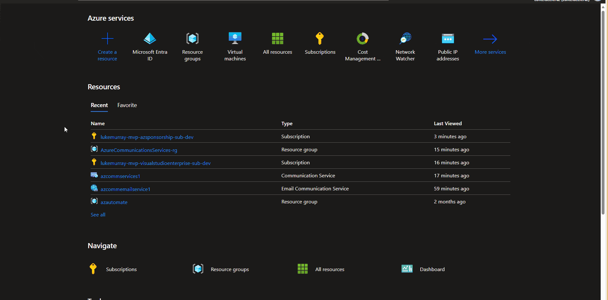

[Azure Communication Services](https://learn.microsoft.com/azure/communication-services/overview?WT.mc_id=AZ-MVP-5004796) brings rich communication APIs to all of your apps across any device on any platform, using the same reliable and secure infrastructure that powers Microsoft Teams.

Today, we will look into using Email as part of Azure Communication Services using the REST API and PowerShell to send an email.


{/* truncate */}

## Overview

Azure Communication Services is a platform of products and services that enable you to create custom communication applications and solutions. Microsoft has taken the same technologies that power Skype and Microsoft Teams and made it available to developers as an Azure product, allowing easy integration with other Microsoft developer services for additional functionality. 

:::info
Azure Communication Services supports various communication formats:

* [Voice and Video Calling](https://learn.microsoft.com/en-us/azure/communication-services/concepts/voice-video-calling/calling-sdk-features?WT.mc_id=AZ-MVP-5004796)
* [Rich Text Chat](https://learn.microsoft.com/azure/communication-services/concepts/chat/concepts?WT.mc_id=AZ-MVP-5004796)
* [SMS](https://learn.microsoft.com/en-us/azure/communication-services/concepts/sms/concepts?WT.mc_id=AZ-MVP-5004796)
* [Email](https://learn.microsoft.com/en-us/azure/communication-services/concepts/email/email-overview?WT.mc_id=AZ-MVP-5004796)
:::

:::note
[SMS](https://learn.microsoft.com/en-us/azure/communication-services/concepts/sms/concepts?WT.mc_id=AZ-MVP-5004796) services are not available on Azure Sponsorship or Visual Studio Enterprise subscriptions.
:::

Today we will be looking at the **[Email Communication Service](https://learn.microsoft.com/azure/communication-services/concepts/email/email-overview?WT.mc_id=AZ-MVP-5004796) by deploying Email and Azure Communication Services with [Bicep](https://learn.microsoft.com/azure/azure-resource-manager/bicep/overview?tabs=bicep&WT.mc_id=AZ-MVP-5004796), and Send a test email using the API and PowerShell RestMethod**.


### Deployment

I am going to make some assumptions here that you know how to deploy with [Azure Bicep](https://learn.microsoft.com/azure/azure-resource-manager/bicep/overview?tabs=bicep&WT.mc_id=AZ-MVP-5004796), and have it [installed](https://learn.microsoft.com/azure/azure-resource-manager/bicep/install?WT.mc_id=AZ-MVP-5004796), and that you have an Azure subscription and the ability to create new resources.

:::tip
If you are doing Bicep deployment, I do recommend looking at the [Azure Bicep Deploy Pane Visual Studio Code extension](https://luke.geek.nz/azure/Azure-Bicep-Deploy-Pane/).
:::

In order to use the Email Communication Service, we need to create it and then create Azure Communication Services, whose endpoint we will then use to send an email.
To authenticate with Azure Communication Services, we will use a Service Principal, which we will create, then use that Service Principal with a custom role to send an email using PowerShell and the Azure APIs.

For email services, you can use your own [Custom Domain](https://learn.microsoft.com/azure/communication-services/quickstarts/email/add-custom-verified-domains?WT.mc_id=AZ-MVP-5004796), and in most Production based scenarios you would, this requires some records being added to your DNS server, for domain ownership and to configure the DKIM/SFP records, but for the purposes of this article, we will use an Azure Managed *(and autogenerated domain)*.

#### Bicep Deployment

Deployment of Azure Communication Services via Bicep can be done using the [PowerShell cmdlet or the Azure CLI](https://learn.microsoft.com/en-us/azure/azure-resource-manager/bicep/deploy-cli?WT.mc_id=AZ-MVP-5004796). Still, today I will use the Deployment Pane and deploy from Visual Studio Code for my demo.

The Azure Bicep will deploy:

* Azure Communication services
* Email Communication Services

And configure 2 FROM email addresses:

* DoNotReply
* itservicedesk

However, you can modify this to your requirements; I put these in a variable array to make it easier to add and remove sender addresses.

Default tags have been added. However, these can easily be modified or removed if needed.

3 Parameter values will need to be defined:

| Parameters                | Notes                                                                                  |
| ------------------------- | -------------------------------------------------------------------------------------- |
| emailServicesName         | Azure Communication Services Email resource name.                                      |
| communicationServicesName | Azure Communication Services Email name.                                              |
| emailServicesLocation     | This is a global service; however, the data at rest (Data Location) needs to be specified. |

I am based in New Zealand, so my Region and Data location is Australia and Australia East.

:::info
The Azure Communication Service is a global resource and will need a unique name. You can only have 1 Azure managed domain per Email Communication Service, but you can also add a Custom Domain.
:::

Let us deploy and configure Azure Communication Services to talk to the Email service!


```bicep title="main.bicep"
// Scope
targetScope = 'resourceGroup'

// Parameters & Variables

param emailServicesName string 
param communicationServicesName string


@description('The location where the email service stores its data at rest.')
param emailServicesLocation string = 'Australia'

var emailServicesTags = {
  environment: 'production'
  department: 'IT'
  project: 'emailServices'
}

var senderUsernames = [
  {
    name: 'donotreply'
    username: 'DoNotReply'
    displayName: 'DoNotReply'
  }
  {
    name: 'itservicedesk'
    username: 'itservicedesk'
    displayName: 'itservicedesk'
  }
  // Add more sender usernames here
]


// Bicep

resource emailServices 'Microsoft.Communication/emailServices@2023-04-01-preview' = {
  name: emailServicesName
  location: 'global'
  tags: emailServicesTags
  properties: {
    dataLocation: emailServicesLocation
  }
}

resource emailServicesAzureDomain 'Microsoft.Communication/emailServices/domains@2023-06-01-preview' = {
  name: 'AzureManagedDomain'
  parent: emailServices
  location: 'global'

  properties: {
    domainManagement: 'AzureManaged'
    userEngagementTracking: 'Disabled'
  }
}

resource emailServicesSendAddresses 'Microsoft.Communication/emailServices/domains/senderUsernames@2023-06-01-preview' = [for senderUsername in senderUsernames: {
  parent: emailServicesAzureDomain
  name: senderUsername.name
  properties: {
    username: senderUsername.username
    displayName: senderUsername.displayName
  }
}]


resource communicationServices 'Microsoft.Communication/communicationServices@2023-06-01-preview' = {
  name: communicationServicesName
  location: 'global'
  tags: emailServicesTags
  properties: {
    dataLocation: emailServicesLocation
    linkedDomains: [
    emailServicesAzureDomain.id
    ]
  }  
}

output emailAddresses array = [for senderUsername in senderUsernames: {
  email: '${senderUsername.username}@${emailServicesAzureDomain.name}'
}]

output domainName string = emailServicesAzureDomain.properties.mailFromSenderDomain

output communicationServicesuri string = communicationServices.properties.hostName

```

#### Setup and configure Authentication

Now, that we have our Azure Communications Service and Email Communication service, next we need to create a Service Principal and Custom Role that we will use in the script.

To do that, we will, set up a new Service Principal and then add a custom role, which has the least amount of privileges to send an email, then add it to our Resource Group, containing the Azure Communication Services resources.

:::info
Use this opportunity to copy your Application ID and generate and copy a new Secret; these will be used by the test PowerShell script in the next step, along with your Entra ID tenant ID. In a Production scenario, the secret should be stored in an [Azure Key Vault](https://azure.microsoft.com/products/key-vault?WT.mc_id=AZ-MVP-5004796) as a Secret and not referenced as plain text anywhere.
:::



```json title="CommunicationServiceMailSender.json"
{
  "properties": {
    "roleName": "Communication Service Mail Sender",
    "description": "Minimal set of permissions required to send mail with Azure Communication Service.",
    "assignableScopes": [
      "" 
    ],
    "permissions": [
      {
        "actions": [
          "Microsoft.Communication/CommunicationServices/Write",
          "Microsoft.Communication/CommunicationServices/Read",
          "Microsoft.Communication/EmailServices/read"
        ],
        "notActions": [],
        "dataActions": [],
        "notDataActions": []
      }
    ]
  }
}

```

### Test outgoing email using API

Now that we have our Communication Services and email Services and configured our Service Principal, it is time to run our test.

:::warning
The script I will run below was written purely for my testing purposes and stores credentials as plain text; when looking to do this in Production, make sure these credentials are protected and the Service Principal is locked down from accepting requests outside of approved networks. 
:::

To do our test, we need to update a few variables.

| Parameters               | Notes                                                                                                             |
| ------------------------ | ----------------------------------------------------------------------------------------------------------------- |
| SPNAppId                 | Your Service Principal Application ID                                                                             |
| SPNSecretValue           | Your Service Principal Client Secret                                                                              |
| SPNTenantId              | Your Entra ID Tenant ID                                                                                           |
| senderAddress            | The email address Azure Communication Services is sending FROM                                                    |
| recipientAddress         | The email address you re sending TO                                                                               |
| communicationendpointurl | The endpoint of your Azure Communication Services (not Email Service). Https will be added further in the script. |

The senderAddress must match a valid email address configured in Azure Email Communication Service. I also added in some random Contoso email addresses into the recipient's body for testing, the idea is to give you a scaffold to adjust as needed; feel free to amend and remove what you don't need.


```powershell title="AzureEmailCommunicationSend.ps1"
## Define the Service Principal credentials and email addresses

## The Service Principal's Application (client) ID
## This is a unique identifier for the app, assigned by Entra ID. Replace to match your environment.
$SPNAppId = '069893df-a389-4a2a-99aa-d035265cfbb7'

## The Service Principal's secret
## This is like a password for the app, used for authentication. Replace to match your environment.
$SPNSecretValue = 'fc6652c483d4475a9c59cc1d81b6d45a'

## The Entra ID tenant ID
## This is the unique identifier for the Entra ID tenancy instance where the app is registered. Replace to match your environment.
$SPNTenantId = '49e37426-fba3-4995-b563-0355b5d6fc60'

## The sender's email address
## This is the email address that will appear in the "From" field of the email
$senderAddress = 'itservicedesk@959df321-6092-41e7-8414-e7b4ea05da2b.azurecomm.net'

## The recipient's email address
## This is the email address where the email will be sent
$recipientAddress = 'recipientemail@test.com'

## The URI for the Azure Communication Services API
$communicationendpointurl = "azcommservices1.australia.communication.azure.com"

## Function to get the access token from Entra ID
function Get-AccessToken {    
    # Define the parameters for the REST API call
    $params = @{
        Uri    = "https://login.microsoftonline.com/$($SPNTenantId)/oauth2/v2.0/token"
        Method = "POST"
        Body   = @{
            client_id     = $SPNAppId
            client_secret = $SPNSecretValue
            grant_type    = "client_credentials"
            scope         = "https://communication.azure.com/.default"
        }
    }

    # Call the REST API and get the access token
    $token = Invoke-RestMethod @params
    return $token.access_token
}

## Define the URI for the Azure Communication Services API

$uri = "https://$communicationendpointurl/emails:send?api-version=2023-03-31"

## Define the headers for the REST API call
$headers = @{
    "Content-Type"  = "application/json"
    "Authorization" = "Bearer $(Get-AccessToken)"
}

### Define the body for the REST API call
# Define the body for the REST API call
## This includes the email headers, sender address, content, recipients, attachments, reply-to addresses, and tracking settings

$apiResponse = @{
    # The headers of the email, including a unique ID generated by New-Guid
    headers                        = @{
        id = (New-Guid).Guid
    }
    # The sender's email address
    senderAddress                  = $senderAddress 
    # The content of the email, including the subject, plain text body, and HTML body
    content                        = @{
        subject   = "Contoso Email Test"
        plainText = "This is a test email from Contoso. If you received this, our test was successful."
        html      = "<html><head><title>Contoso Email Test</title></head><body><h1>This is a test email from Contoso.</h1><p>If you received this, our test was successful.</p></body></html>"
    }
    # The recipients of the email, including the "to", "cc", and "bcc" addresses
    recipients                     = @{
        to  = @(
            @{
                address     = $recipientAddress
                displayName = $recipientAddress
            },
            @{
                address     = "Jane.Doe@contoso.com"
                displayName = "Jane Doe"
            }
        )
        cc  = @(
            @{
                address     = 'wendy.smith@contoso.com'
                displayName = 'Wendy Smith'
            },
            @{
                address     = "jimmy.johns@contoso.com"
                displayName = "Jimmy Johns"
            }
        )
        bcc = @(
            @{
                address     = "bob.jones@contoso.com"
                displayName = "Bob Jones"
            },
            @{
                address     = "alice.johnson@contoso.com"
                displayName = "Alice Johnson"
            }
        )
    }
    # The attachments to the email, including the name, content type, and content in Base64
    attachments                    = @(
        @{
            name            = "Attachment.txt"
            contentType     = "application/txt"
            contentInBase64 = "TG9yZW0gaXBzdW0gZG9sb3Igc2l0IGFtZXQ="
        }

    )
    # The reply-to addresses for the email
    replyTo                        = @(
        @{
            address     = "contoso-support@contoso.com"
            displayName = "Contoso Support"
        }
    )
    # A flag to disable user engagement tracking
    userEngagementTrackingDisabled = $true
}

## Convert the PowerShell object to JSON
## The -Depth parameter is set to 10 to ensure all levels of the object are converted
$body = $apiResponse | ConvertTo-Json -Depth 10

## Send the email
try {
    $response = Invoke-RestMethod -Uri $uri -Method Post -Headers $headers -Body $body -UseBasicParsing
    $response
}
catch {
    Write-Error $_.Exception.Message
}

```

> Congratulations, you have now stood up Azure Communications Services and successfully sent and received an email using the Azure Communication Service API.

## Additional Reading

* [Azure Communication Services pricing](https://azure.microsoft.com/contact/pricing/?WT.mc_id=AZ-MVP-5004796)
* [Introduction to Azure Communication Services](https://learn.microsoft.com/en-us/training/modules/intro-azure-communication-services/?source=recommendations&WT.mc_id=AZ-MVP-5004796)
* [Quick-start: Handle Email events](https://learn.microsoft.com/en-us/azure/communication-services/quickstarts/email/handle-email-events?WT.mc_id=AZ-MVP-5004796)
