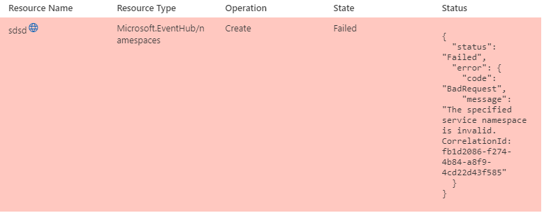

When deploying an Event Hub using Azure Bicep, you may get the following error:

    "code": "BadRequest",
    "message": "The specified service namespace is invalid. CorrelationId: 652cc73c-1fa7-450a-9788-b73ad6a818df"

This could be caused by the name of your namespace needing to meet the naming requirements.

{/* truncate */}

For example:

The namespace identifier should adhere to the following naming conventions:

* The name must be unique across Azure. The system immediately checks to see if the name is available.
* The name length is at least 6 and at most 50 characters.
* The name can contain only letters, numbers, and hyphens “-“.
* The name must start with a letter and end with a letter or number.
* The name doesn't end with “-sb“ or “-mgmt“.

Reference: 
* [Create Namespace](https://learn.microsoft.com/rest/api/servicebus/create-namespace?WT.mc_id=AZ-MVP-5004796), even though this article dates back to an API from 2021, the naming standards are still valid in the API for 2023-01-01-preview.
* [Create Service Bus Namespace in Portal](https://learn.microsoft.com/en-us/azure/service-bus-messaging/service-bus-quickstart-portal#:~:text=Enter%20a%20name,sb%E2%80%9C%20or%20%E2%80%9C-mgmt?WT.mc_id=AZ-MVP-5004796)
