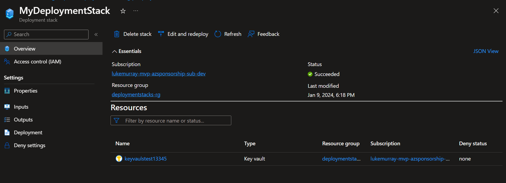
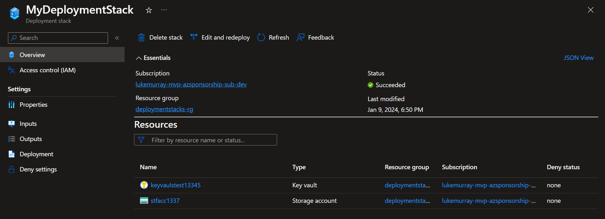

An Azure [deployment stack](https://learn.microsoft.com/azure/azure-resource-manager/bicep/deployment-stacks?tabs=azure-powershell&WT.mc_id=AZ-MVP-5004796) is a type of Azure resource that enables the management of a group of Azure resources as an atomic unit.

If you deploy a new Deployment Stack, all resources in your ARM/Bicep template will get included as Managed resources, but what if you want to include a resource that was deployed outside of Bicep into your Deployment Stack?


A community member, approached me to ask how they could do this, so let us take a look.

{/*truncate*/}

:::info
An Azure deployment stack is a type of Azure resource that enables the management of a group of Azure resources as an atomic unit. When a Bicep file or an ARM JSON template is submitted to a deployment stack, it defines the resources that are managed by the stack. If a resource that was previously included in the template is removed, it will either be detached or deleted based on the specified actionOnUnmanage behavior of the deployment stack. Similar to other Azure resources, access to the deployment stack can be restricted using Azure role-based access control (Azure RBAC). To create and update a deployment stack, you can utilize Azure CLI, Azure PowerShell, or the Azure portal along with Bicep files. These Bicep files are transpiled into ARM JSON templates, which are then deployed as a deployment object by the stack.
:::

:::tip
Check out a previous post I did on [Deployment Stacks](https://luke.geek.nz/azure/Azure-Bicep-Deployment-with-Deployment-Stacks/) for a bit more detail on how they can be used and setup.
:::

In our demo, we will have a Resource Group, with an existing Storage account already precreated *(using the Azure Portal)* and a Deployment Stack, consisting of an Azure KeyVault deployed using Bicep.

The PowerShell command used to deploy the Bicep is:

```powershell
New-AzResourceGroupDeploymentStack `
  -Name "MyDeploymentStack" `
  -ResourceGroupName "deploymentstacks-rg" `
  -TemplateFile "main.bicep" `
  -DenySettingsMode "none"
```

And the Bicep we initially deployed *(where the Storage account isn't part of the Deployment Stack, and the KeyVault is a dummy resource for something to deploy)* is:

```bicep

resource storage 'Microsoft.Storage/storageAccounts@2023-01-01' existing = {
  name: 'stfacc1337'
}

resource keyvault 'Microsoft.KeyVault/vaults@2023-07-01' = {
  name: 'keyvaulstest13345'
  location:  resourceGroup().location
  
  properties: {
    accessPolicies: [
      {
        tenantId: subscription().tenantId
        objectId: '00000000-0000-0000-0000-000000000000'
        permissions: {
          keys: ['all']
          secrets: ['all']
          certificates: ['all']
        }
      }
    ]
    
    sku: {
      family:   'A'
      name:  'standard'
    }
tenantId: subscription().tenantId
  }
}

```



As you can see, even though the 'stfacc1337' storage account is tested as a referenable object in Bicep by using the [existing](https://learn.microsoft.com/azure/azure-resource-manager/bicep/existing-resource?WT.mc_id=AZ-MVP-5004796) flag, it hasn't been brought into the Deployment Stack.

Being able to reference the module in Bicep, isn't enough to bring it into the Deployment Stack and this is by design *([Issue #146](https://github.com/Azure/deployment-stacks/issues/146))*.

> So if you can't reference an existing resource, how can you bring it into the deployment stack?

:::Answer
The Answer is: You need to import it into the Bicep!**
:::

A resource needs to exist in Infrastructure as Code, in order to be added to a Deployment Stack, the easiest way is to import it.

I did a seperate [blog article](https://luke.geek.nz/azure/azure-bicep-and-insert-resource/) on using the Bicep Visual Studio extension, to import an existing resource, so refer to that, but in essence it can import the resource from ARM, and compile it into an indentical resource into Bicep, matching what you have deployed.

The Bicep now looks like this:

```bicep
@description('Generated from /subscriptions/a42e282a-c1e4-4abc-9fa1-1dd1ecbd6bf9/resourceGroups/deploymentstacks-rg/providers/Microsoft.Storage/storageAccounts/stfacc1337')
resource stfacc 'Microsoft.Storage/storageAccounts@2023-01-01' = {
  sku: {
    name: 'Standard_RAGRS'
  }
  kind: 'StorageV2'
  name: 'stfacc1337'
  location: 'australiaeast'
  tags: {}
  properties: {
    dnsEndpointType: 'Standard'
    defaultToOAuthAuthentication: false
    publicNetworkAccess: 'Enabled'
    allowCrossTenantReplication: false
    minimumTlsVersion: 'TLS1_2'
    allowBlobPublicAccess: false
    allowSharedKeyAccess: true
    networkAcls: {
      ipv6Rules: []
      bypass: 'AzureServices'
      virtualNetworkRules: []
      ipRules: []
      defaultAction: 'Allow'
    }
    supportsHttpsTrafficOnly: true
    encryption: {
      requireInfrastructureEncryption: false
      services: {
        file: {
          keyType: 'Account'
          enabled: true
        }
        blob: {
          keyType: 'Account'
          enabled: true
        }
      }
      keySource: 'Microsoft.Storage'
    }
    accessTier: 'Hot'
  }
}

resource keyvault 'Microsoft.KeyVault/vaults@2023-07-01' = {
  name: 'keyvaulstest13345'
  location:  resourceGroup().location
  
  properties: {
    accessPolicies: [
      {
        tenantId: subscription().tenantId
        objectId: '00000000-0000-0000-0000-000000000000'
        permissions: {
          keys: ['all']
          secrets: ['all']
          certificates: ['all']
        }
      }
    ]
    
    sku: {
      family:   'A'
      name:  'standard'
    }
tenantId: subscription().tenantId
  }
}

```

Now redeploy the Deployment Stack.

:::tip
The create-stack commands can also be used to update deployment stacks!
:::

> Once your Deployment Stack has been deployed, your resource is now imported.


