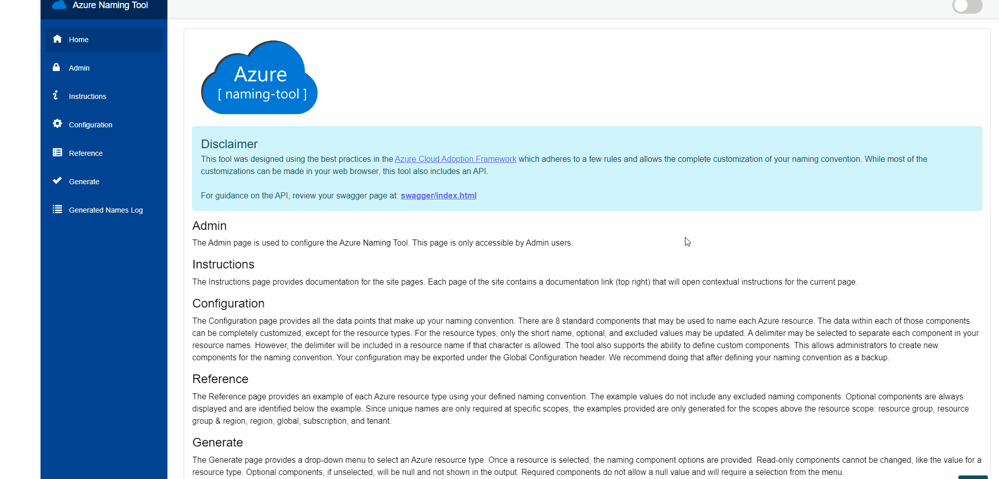
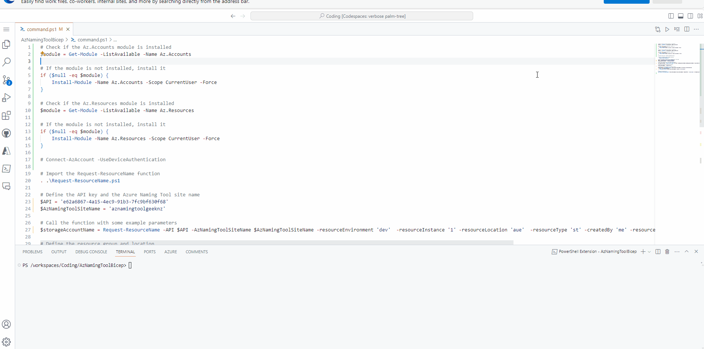
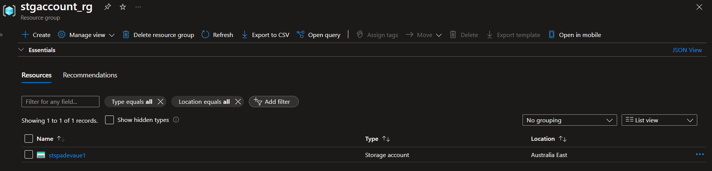

The [Azure Naming Tool](https://github.com/mspnp/AzureNamingTool) was created to help administrators define and manage their naming conventions for Azure resources while providing a simple interface for users to generate a compliant name. 
The tool was developed using a naming pattern based on [Microsoft's best practices](https://learn.microsoft.com/azure/cloud-adoption-framework/ready/azure-best-practices/naming-and-tagging?WT.mc_id=AZ-MVP-5004796). Once an administrator has defined the organizational components, users can use the tool to generate a name for the desired Azure resource.

Today, we will use the Azure Naming Tool API to generate a name for our storage account bicep resource.


{/*truncate*/}

## Overview

:::note
I had a previous Blog article for [Deploying Azure Naming Tool into an Azure WebApp as a container](https://luke.geek.nz/2022/07/11/deploy-azure-naming-tool-into-an-azure-webapp-as-a-container/) this was a previous version, as of June 2022, but check it out, if you run into issues with your deployment. Today, we will deploy the latest version at the time of this article straight to a WebApp.
:::

:::tip
The process is reasonably well documented directly on [Wiki of GitHub repository](https://github.com/mspnp/AzureNamingTool/wiki) for Azure Naming Tool, and it is what I followed, but to trigger the Publishing Profile button (if it greyed out) in the Azure Portal, for a brand new web app, I was able to go into Configuration/General Settings and Turn Basic Auth Publishing Off, Save, then back on, Save, and the button was enabled.
:::

So, now we have our Azure Naming Tool set up and deployed; we can test it out by using the API to generate a name for our storage account bicep resource.

## Scripts

> To do this, we will have three scripts:

* **main.bicep** - This is our main bicep file, which will deploy our storage account and use the Azure Naming Tool API to generate a name for it.
* **command.ps1** - This will be our PowerShell script, which will call the Azure Naming Tool API, generate a name for our storage account, and then trigger the Bicep deployment.
* **Request-ResourceName.ps1** - This is our PowerShell function that will call the Azure Naming Tool API and return the generated name value.

Command.ps1 will call the other scripts.

So let us take a look at those:

```powershell title="command.ps1"
## Check if the Az.Accounts module is installed
$module = Get-Module -ListAvailable -Name Az.Accounts

### If the module is not installed, install it
if ($null -eq $module) {
    Install-Module -Name Az.Accounts -Scope CurrentUser -Force
}

## Check if the Az.Resources module is installed
$module = Get-Module -ListAvailable -Name Az.Resources

# If the module is not installed, install it
if ($null -eq $module) {
    Install-Module -Name Az.Resources -Scope CurrentUser -Force
}

## Connect-AzAccount -UseDeviceAuthentication

## Import the Request-ResourceName function
. .\Request-ResourceName.ps1

## Define the API key and the Azure Naming Tool site name
$API = ''
$AzNamingToolSiteName = ''

## Call the function with some example parameters
$storageAccountName = Request-ResourceName -API $API -AzNamingToolSiteName $AzNamingToolSiteName -resourceEnvironment 'dev'  -resourceInstance '1' -resourceLocation 'aue'  -resourceType 'st' -createdBy 'me' -resourceProjAppSvc 'spa' | Select-Object -ExpandProperty resourceName

## Define the resource group and location
$resourceGroupName = 'stgaccount_rg'

## Create the resource group if it doesn't exist
$resourceGroup = Get-AzResourceGroup -Name $resourceGroupName -ErrorAction SilentlyContinue
if ($null -eq $resourceGroup) {
    New-AzResourceGroup -Name $resourceGroupName -Location 'australiaeast'
}

## Deploy the Bicep file
New-AzResourceGroupDeployment -ResourceGroupName $resourceGroupName -TemplateFile './main.bicep' -storageAccountName $storageAccountName
```

```bicep title="main.bicep"
param storageAccountName string 
param location string = resourceGroup().location

resource storageacc 'Microsoft.Storage/storageAccounts@2023-01-01' = {
  name: storageAccountName
  location: location
  properties: {
    accessTier: 'Hot'
  }
  sku: {
  
    name:  'Standard_LRS'
  }
  kind:  'BlobStorage'
}
```
```powershell title="Request-ResourceName.ps1"

## Define the function that requests a resource name
function Request-ResourceName {
    # Define the parameters that the function accepts
    param (
        [Parameter(Mandatory=$true)] [string] $API,  # The API key
        [Parameter(Mandatory=$true)] [string] $AzNamingToolSiteName,  # The Azure Naming Tool site name
        [Parameter(Mandatory=$true)]
        [ValidateSet('dev', 'prd', 'sbx', 'shd', 'stg', 'tst', 'uat')]
        [ValidateLength(1,5)]
        [string] $resourceEnvironment,  # The environment of the resource
        [Parameter(Mandatory=$false)] [string] $resourceFunction,  # The function of the resource
        [Parameter(Mandatory=$true)] [string] $resourceInstance,  # The instance of the resource
        [Parameter(Mandatory=$true)]
        [ValidateSet('aue', 'aus', 'nzn', '	usw')]
        [ValidateLength(1,10)]
        [string] $resourceLocation,  # The location of the resource
        [Parameter(Mandatory=$false)] [string] $resourceOrg,  # The organization of the resource
        [Parameter(Mandatory=$false, HelpMessage="The shortcode of the project. This needs to match an existing Project in Azure Naming Tool.")]
        [ValidateLength(1,3)]
        [string] $resourceProjAppSvc,  # The project or application service of the resource
        [Parameter(Mandatory=$true)] [string] $resourceType,  # The type of the resource
        [Parameter(Mandatory=$false)]
        [ValidateLength(1,5)]
        [string] $resourceUnitDept,  # The unit or department of the resource
        [Parameter(Mandatory=$false)] [Hashtable] $customComponents,  # Any custom components for the resource
        [Parameter(Mandatory=$false)] [string] $createdBy  # The creator of the resource
    )

    # Define the headers for the API request
    $headers = @{
        'accept' = '*/*'
        'APIKey' = $API
        'Content-Type' = 'application/json'
    }

    # Define the body of the API request
    $body = @{
        'resourceEnvironment' = $resourceEnvironment
        'resourceFunction' = $resourceFunction
        'resourceInstance' = $resourceInstance
        'resourceLocation' = $resourceLocation
        'resourceOrg' = $resourceOrg
        'resourceProjAppSvc' = $resourceProjAppSvc
        'resourceType' = $resourceType
        'resourceUnitDept' = $resourceUnitDept
        'customComponents' = $customComponents
        'createdBy' = $createdBy
    } | ConvertTo-Json -Depth 6  # Convert the body to JSON format

    # Send the API request and store the response
    try {
        $response = Invoke-RestMethod -Uri "https://$AzNamingToolSiteName.azurewebsites.net/api/ResourceNamingRequests/RequestName" -Method Post -Headers $headers -Body $body
        if ($null -eq $response) {
            Write-Host "The API returned a successful response with no body."
        } else {
            Write-Host "The API returned a successful response, with the name generated as: $($response.resourceName)"
        }
    } catch {
        Write-Host "An error occurred: $_"
    }
    # Return the response
    return $response
}


```

## Deployment

Now that we have the scripts, it's time to run it. I am going to run this from a GitHub Codespace that already has the latest version of PowerShell and Bicep installed. I have whitelisted the IP of the Codespace to allow it to access the Azure Naming Tool WebApp.

:::warning
Your Azure Naming Tool configuration is key! It needs to align with your organisational needs, naming conventions, projects and departments where necessary. Different resource types, will require different configurations, so make sure you plan this out, the Azure Naming Tool reference page can be key to review for successful name generation.
:::

First, we will need the API Key, so within the Azure Naming Tool, click on Admin, enter your password and Copy the Full Access API Key. This key is needed as the generated API resource name is a POST operation.



You will also need the name of your Azure Naming Tool WebApp, the Request-ResourceName script does make an assumption that this is an Azure hosted website *(ie https://aznamingtoolgeeknz.azurewebsites.net/)*. If you are hosting it elsewhere, you will need to update the script to reflect the domain name.

Enter the API and WebApp name into the command.ps1 script, these are parameters for the script, along with resourceType, resourceInstance, resourceLocation, etc. Different resource types and configurations will require different parameters.

Now it's time to create our Storage Account using a Name generated from the Azure Naming Tool.

The command script will trigger a REST API call to Azure Naming Tool to generate a name for our storage account. Then we will use that name as a parameter for the storageAccountName Bicep deployment.



Our Storage account is now created:



