Enterprise Azure Policy as Code (EPAC) comprises a number of scripts which can be used in a CI/CD-based system or a semi-automated use to deploy Azure Policies, Policy Sets, Assignments, Policy Exemptions and Role Assignments! This is a great way to ensure that your Azure environment complies with your company's policies and standards, so let us look at it!

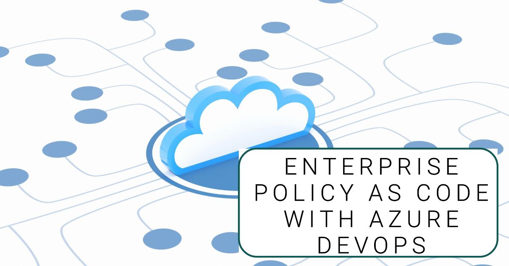

{/*truncate*/}

[Enterprise Azure Policy as Code (EPAC)](https://azure.github.io/enterprise-azure-policy-as-code/) allows you to define and deploy your Azure policies and exemptions as code. This is a great way to ensure consistency of one or more Azure environments, including managing your exemptions in a way that is auditable and a way that can be integrated into CI/CD pull request approval processes.

So, let's delve a little further into it.

## What is Enterprise Azure Policy as Code?

:::info
Enterprise Azure Policy as Code, or EPAC for short, comprises a number of scripts which can be used in a CI/CD-based system or a semi-automated use to deploy Policies, Policy Sets, Assignments, Policy Exceptions and Role Assignments.

Main features include:

* Multi-tenant/environment policy deployment
* Easy CI/CD Integration
* Extract existing policy objects from an environment
* Support JSON and CSV inputs for large, complex policies
* PowerShell Module
* Integration with Azure Landing Zone recommended policies
* Starter Kit with examples
* Schema to provide Intellisense for VS Code development
:::

Enterprise Policy as Code, runs primarily on PowerShell scripts, at the time of writing, there is 114 PowerShell scripts that make up this solution *(not all are in use for day-to-day operations)*, from the actual deployment to the plan, importing existing policies and initiatives, creating GitHub or Azure DevOps issues, for policy remediation tasks and even importing Azure Landing Zone policies into the solution, this solution is jam-packed with an ever-expanding toolset.

:::tip
It is worth noting that although this solution was designed and implemented by Microsoft employees, this is an [Open Source initiative](https://opensource.microsoft.com/codeofconduct/) and is not officially supported by Microsoft, but the community is very active, and the solution is constantly being updated and improved upon. All [Issues](https://github.com/Azure/enterprise-azure-policy-as-code/issues) can be raised directly on GitHub, and if you have any queries, concerns or issues, I suggest you look here first.
:::

## Why would you use Enterprise Azure Policy as Code?

So, why would you use EPAC? Before we go into that - let's go back to basics - Azure Policy.

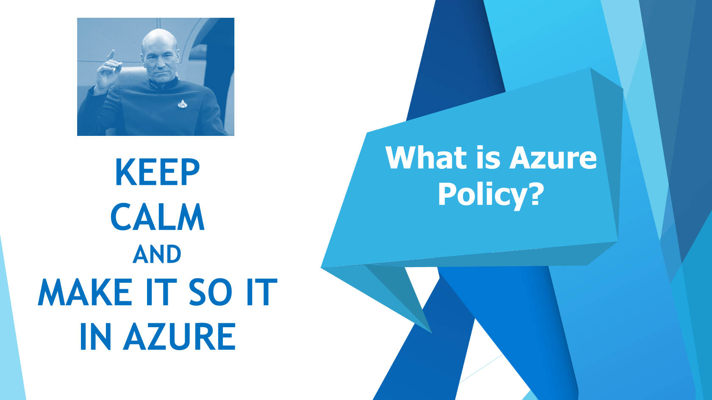

[Azure policies](https://learn.microsoft.com/azure/governance/policy/overview?WT.mc_id=AZ-MVP-5004796) are essential to Azure governance; they are the 'make it so' of the Azure environment *(and beyond)*.

The policies exist to help across areas such as:

* Maintain regulatory compliance with industry standards
* Security and performance consistencies
* Enterprise-wide design principles
* Controlling cost

But how do they do that? Let us take a look at the definitions that make them sing!

For this, we are to look at some of the key components of a definition for the 'Function apps should authenticate to Azure Container Registry using a managed identity' policy.

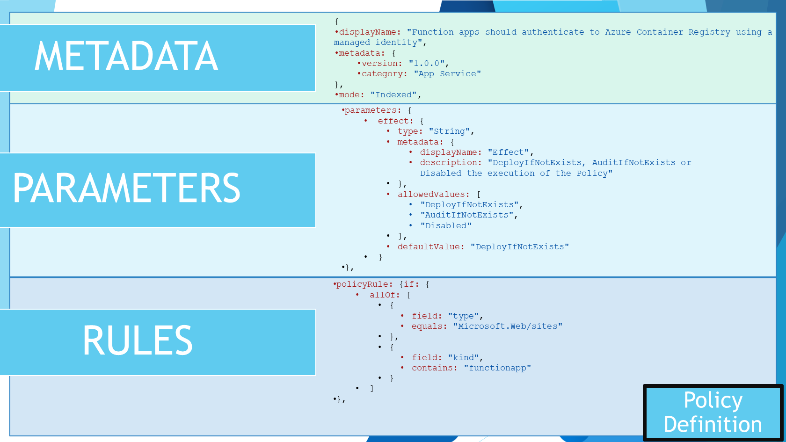

* Metadata
* Parameters
* Rules

Metadata includes items such as: DisplayName, Mode *(Indexed vs All)*, version and categories. 
Parameters give you the flexibility to adjust your policy to your environment, in this case, the policy is looking for a specific Azure Container Registry, but you could have a parameter for the resource group, the subscription, or even the identity that it uses, which can be adjusted to be unique between environments.
Rules are the actual policy; in this case, the policy is looking for a specific identity to be used to authenticate to the Azure Container Registry but will contain the type of resources that the policy will affect, the aliases or resource properties that it needs to look for to evaluate against, and even change.

So, why would you use EPAC? Imagine you have a large number of policies, a large number of environments, or even a large number of policy exemptions, managing your policies as code is a great way to manage them all in a consistent and auditable way, especially when you are working with different versions of policies, and policies deployed to different scopes as well.

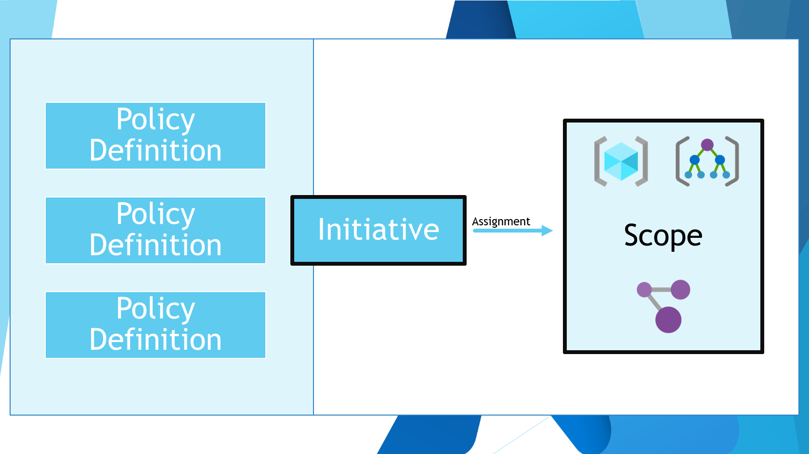

## How do you use Enterprise Azure Policy as Code?

Now that we have looked into some of the complexity of Azure policies, especially at scale. Let us take a look into how we can get going with [Enterprise Policy as Code](https://azure.github.io/enterprise-azure-policy-as-code/).

In this article, I am going to assume a few things:

1. You have permission to deploy policies and policy assignments in your Azure environment
2. You have an Azure DevOps environment (we will use Azure DevOps pipelines in this article, however there is also GitHub action workflows that can be used if you are using GitHub as well) and [Service Connection configured](https://azure.github.io/enterprise-azure-policy-as-code/ci-cd-app-registrations/).

We are going to leverage the EPAC [StarterKit](https://github.com/Azure/enterprise-azure-policy-as-code/tree/main/StarterKit), for the pipelines and scripts.

Before we get CI/CD pipelines set up, we need to do a few things locally first.

### Step 1: Import existing policies

So, let's import our existing policies and set up our environment! I highly recommend importing your existing environment first, as this will give you a good starting point for your policies, policy sets and exemptions.

:::info
This requires a computer running: [PowerShell](https://learn.microsoft.com/powershell/scripting/install/installing-powershell-on-windows?view=powershell-7.4&WT.mc_id=AZ-MVP-5004796) 7.3.1 or later, 7.3.4 *(latest)* recommended, and the [Azure PowerShell](https://learn.microsoft.com/powershell/azure/install-azure-powershell?view=azps-11.3.0&WT.mc_id=AZ-MVP-5004796) module installed (Az required 9.3.0 or later).
:::

In my environment, I have a range of Custom and Builtin policies and initiatives, that are mostly deployed to at the top level, including Sandbox policies, and am I also running an NZISM 3.5 initiative, which is a builtin iniative but not the most up-to-date, so as part of the EPAC implementation, I want to replace the policy assignment with 3.6 custom and assign my Sandbox policies to the Sandbox Management Group.

So let us get cracking!

1. First, we need to install the EPAC PowerShell module and the Az module and connect to our Azure environment.

```powershell
    Install-Module EnterprisePolicyAsCode -Scope CurrentUser
    Install-Module Az -Scope CurrentUser
    Connect-AzAccount
```
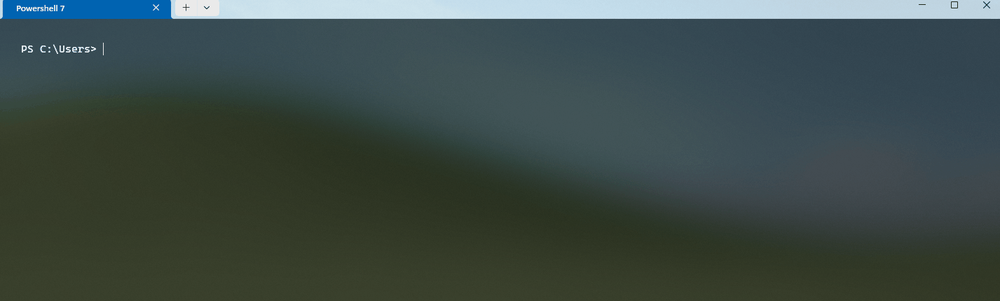

2. Once that's installed and you are connected to the Azure environment that you want to export your policies from, now we can do the export. To do the export, you have to generate a BuildDefinition folder to contain your policies, assignments and exemptions.


```powershell
    New-EPACDefinitionFolder -DefinitionsRootFolder Definitions
```

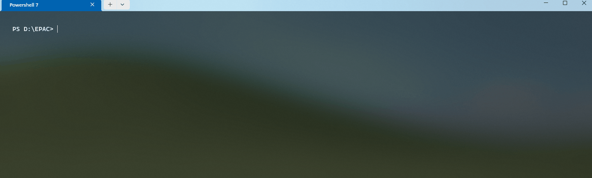

That will create the following folders and files, giving us the base scaffolding for Enterprise Policy as Code:

| Folder & Files        | Type   | Notes                                                                      |
| --------------------- | ------ | -------------------------------------------------------------------------- |
| policyAssignments     | Folder | Contains your Assignments (for both Policy and Initiatives)                |
| policyDefinitions     | Folder | Contains your Policy Definitions                                           |
| policyDocumentations  | Folder | Contains documentation about your policies                                 |
| policySetDefinitions  | Folder | Contains the definitions for your initiatives (or PolicySets)              |
| global-settings.jsonc | File   | Main configuration file, containing your environments and deployment paths |

3. Now that we have our base, scaffold - before we can import our existing Definitions and Assignments, we need to edit the 'global-settings.jsonc' file, to add in environment context.

:::tip
The file is a JSONC file, which is a JSON file with comments, so you can add comments to the file, which is great for documentation. The same jsonc format is also used for PolicyDefinitions and assignments, allowing you to add more context and notes to your policies and assignments! I encourage you to use this functionality to add notes and comments to your assignments!
:::

So open the global-settings.jsonc file, and paste the following example:

```jsonc
    {
        "$schema": "https://raw.githubusercontent.com/Azure/enterprise-azure-policy-as-code/main/Schemas/global-settings-schema.json",
        "pacOwnerId": "f2ce1aea-944e-4517-94fb-edada00633ae", // Generate a guid using New-Guid and place it here
        "managedIdentityLocations": {
            "*": "australiaeast" // Update the default location for managed identities
        },
        "globalNotScopes": {
            "*": [
                "/resourceGroupPatterns/excluded-rg*"
            ]
        },
        "pacEnvironments": [
            {
                "pacSelector": "quick-start",
                "cloud": "AzureCloud",
                "tenantId": "bdb8ea1c-17da-4423-8895-6b79af002b4e", // Replace this with your tenant Id
                "deploymentRootScope": "/providers/Microsoft.Management/managementGroups/root" // Replace this with a management group that represents the functional root in your environment. 
            }
        ]
    }
```

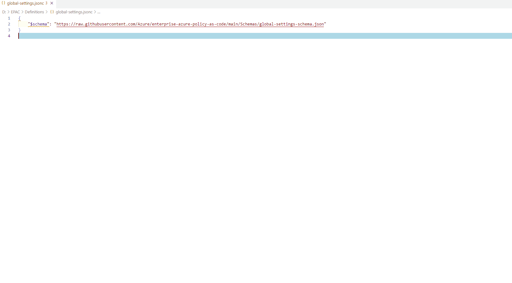

**Reference: [EPAC Quick Start](https://azure.github.io/enterprise-azure-policy-as-code/quick-start/)**

We now need to define our overall environment, and we can start by using PowerShell to generate our own unique pacOwnerId.

```powershell
    New-Guid
```
The pacOwner helps to identify who or what owns an Assignment or Policy definition deployment and needs to be unique to your EPAC environment. The pacOwnerId is used to identity policy resources that are deployed by your EPAC repository, or another EPAC isntance, legacy or another solution entirely.

Another thing you may need to adjust is the managedIdentityLocations, this is the default location for managed identities that are used for policies that are DeployIfNotExist and Modify. This is the location that the managed identity will be created in, if it does not exist. I will keep this as the example, AustraliaEast which is the primary region that my resources are deployed into.

If you run multiple regions, you can remove the wildcard and replace it with the pacEnvironments name that represents your other regions.

Although you can add exclusions to your individual Policy and PolicySetAssignments, the globalNotScopes is a way to exclude resources from all Policy and PolicySetAssignments, without having to add it to every single assignment, in this case, the example excludes all resources that are in a resource group that starts with 'excluded-rg'. You can exclude resources at different scopes, ie Resource Group, Subscriptions, Resouce Groups.

Now, lets take a look at pacEnvironments. pacEnvironments is a way to define your environments, and the deploymentRootScope is the scope that represents the functional root in your environment. This is the top scope that all your Policy and PolicySetAssignments will be deployed to, and is the scope that you will be deploying your policies definitions to.

The pacSelector will be used in your assignments to select what environment and scope you are deploying to, as you can have multiple environments, so give it a name that you can understand - ie 'epac-prod', 'epac-dev', 'epac-qa' etc. This will be reused in your assignments and pipelines.

Make sure the tenantId matches your Entra ID and the deploymentRootScope is the top-level scope that you want to deploy your policies to.

Save the file.

4. The next step is to import your existing policies and assignments, the commands will use the information you just defined in the 'global-settings.jsonc' file, to review of the scope and the environment of the export.

To do that, we will go back to PowerShell:

  ```powershell
    Export-AzPolicyResources -DefinitionsRootFolder .\Definitions -OutputFolder Output
  ```

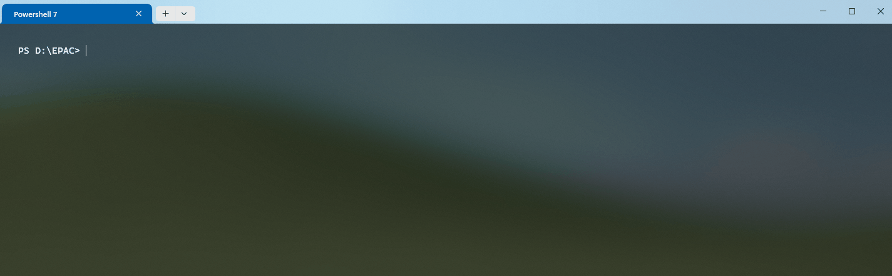

:::tip
If you want to target a specific environment, ie you have a Management Group, where you want to deploy your policies and test using the Azure Portal first **(this can be useful for quickly importing assignments and policies in a format that's ready to go by EPAC)**, then you can add the '-InputPacSelector' parameter and target a specific environment for export, else it will do all environments listed in the global-settings.
:::

Depending on the complexity of your environment, it could take a while, but once it is done, you will have a new folder called 'Output', which will contain an export of your policy-ownerships, definitions, assignments and exemptions in an Enterprise Policy as Code useable format *(JSON)*.

Your Output folder will contain the policy exemptions, assignments, and definitions of your existing environment.

You can copy the files and folders from the Output folder, into the original Definitions folder, originally created, to bring in your existing policies and assignments into your EPAC environment.

:::tip
Now is a great time to look at those exemptions and policy assignments and see if they are still relevant, and if they are, add comments to the files to give context to the assignments and exemptions and to help with the deployment of the policies and assignments in the future.
:::

### Step 2: Configure Azure DevOps

Now that we have our policies and assignments imported, we can now configure our Azure DevOps environment, to automatically deploy them. I am going to go through the process from the beginning but feel free to skip to the relevant sections if you already have a project and repository setup.

1. Login to Azure DevOps
2. Create a new project
3. Give the project a name, and a description, and select the visibility of the project **(ie Private)**
4. Click 'Create'
5. Navigate to Repos
6. Click on Files
6. Initialize the repository with a README or add a new file

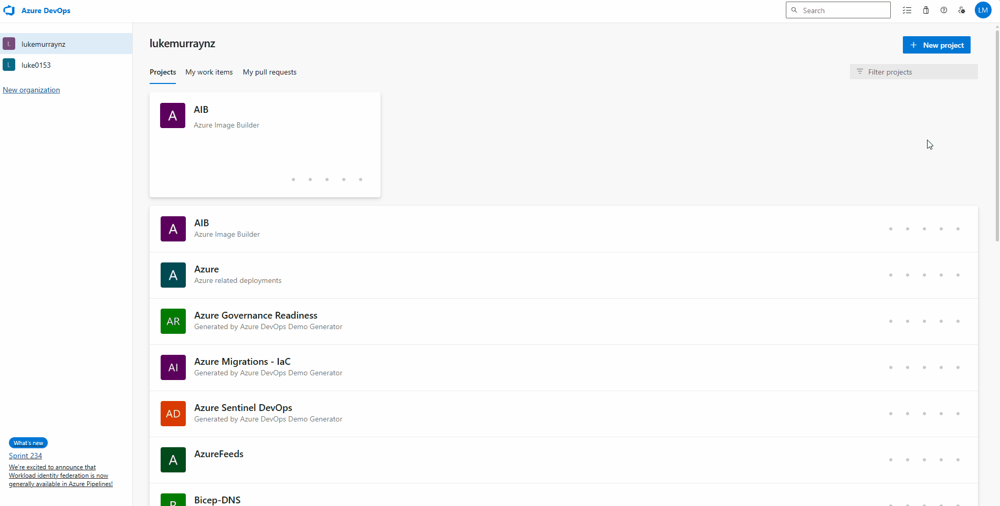

Now that the repository has been initialized. We can now add the files from the EPAC StarterKit to the repository.

Clone the repository to your local computer copy the Definitions folder to the repository and commit. 

:::info
You can Clone the Git repository using [Visual Studio Code](https://azuredevopslabs.com/labs/azuredevops/git/?T.mc_id=AZ-MVP-5004796), or Git CLI or even [GitHub Desktop](https://luke.geek.nz/2021/12/30/git-using-github-desktop-on-windows-for-sysadmins/).
:::

Once cloned, copy the Definitions folder from the Output folder, into the repository, and commit the changes.

Now that we have our repository setup, we can now create a pipeline to deploy our policies and assignments, to get started we will grab the Azure Pipelines from the [StarterKit](https://github.com/Azure/enterprise-azure-policy-as-code/tree/main/StarterKit/Pipelines) folder, and copy them into the repository, along with the Scripts folder.

For this article, we will use the single-tenant-pipeline.yml file, as we are only deploying to a single environment, but if you are deploying to multiple environments, you can use the multi-tenant-pipeline.yml file.

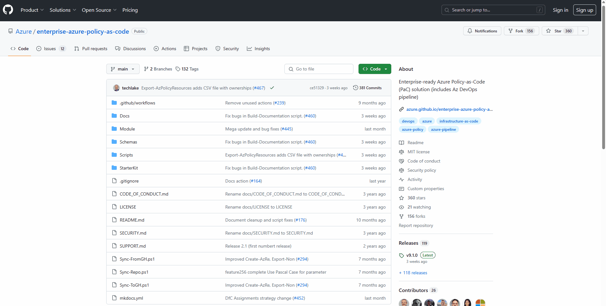

Once downloaded, make sure you commit it to your repository. We will have to edit the pipeline, but before we do that - we need a Service Connection for Azure DevOps to connect to Azure to deploy the policies and assignments.

1. Open your EPAC Azure DevOps project
2. Click on Project Settings
3. Select Service Connections
4. Click on Create Service Connection
5. Click Azure Resource Manager
6. Click Next
7. Select Workload Identity Federation (Automatic) and click Next
8. Select Management Group
9. Select your top-level management group, that matches your Enterprise Policy as Code environment (ie where the definitions will be deployed to)
10. Type in a name and description and click Save **(make sure this is a name that is easy to understand, and what its function is, we will reuse the name in our pipelines)**

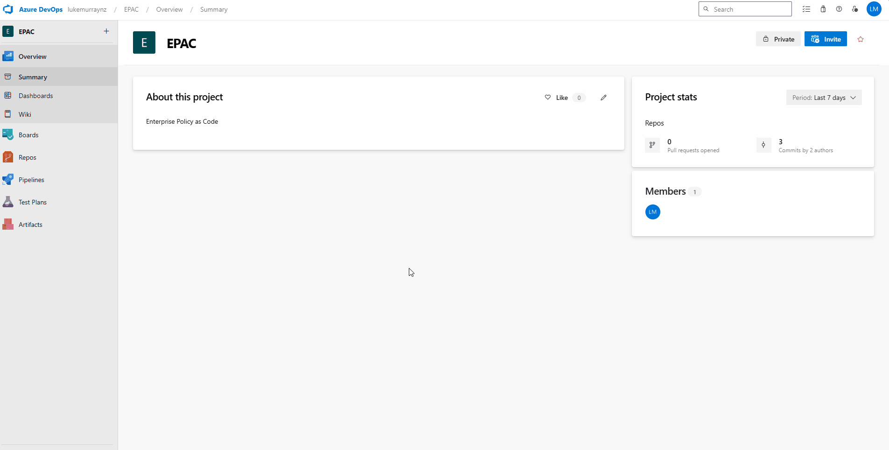

:::info
Enterprise Policy as Code (EPAC) suggests the least privileged and just enough permissions to deploy the policies, assignment and RBAC **(Role Based Access Control)** where they need to.

The pipeline itself will look for the following separate Service Connections:

* devServiceConnection - This service connection is used for development purposes, allowing the pipeline to connect to the development environment and deploy policies and assignments.
* tenantPlanServiceConnection - This service connection is used for managing the policy plan, which includes creating and updating policy definitions, policy sets, and policy initiatives.
* tenantDeployServiceConnection - This service connection is used for deploying policy assignments and exemptions to the target environment.
* tenantRolesServiceConnection - This service connection is used for managing RBAC (Role-Based Access Control) roles and permissions in the target environment.

So consider whether you have separate scopes and service principals for your environments.
:::

For the purposes of this article, I am going to use the same service principal to deploy all the EPAC functions, so let's edit the pipeline to use it.

1. You can edit the Pipeline, either locally with Visual Studio Code and recommit it, or edit it directly in Azure DevOps, update the following variables with the relevant service connection names:

* devServiceConnection 
* tenantPlanServiceConnection
* tenantDeployServiceConnection                                                                               
* tenantRolesServiceConnection 

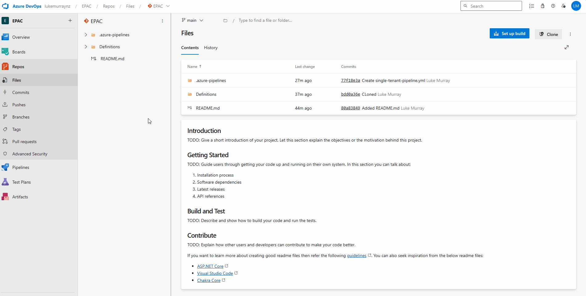

The single-tenant Azure DevOps pipeline has 5 stages:

| Stage                   | Notes                                                                                                                                                                                                                                                                                                                                                                                                                                |
| ----------------------- | ------------------------------------------------------------------------------------------------------------------------------------------------------------------------------------------------------------------------------------------------------------------------------------------------------------------------------------------------------------------------------------------------------------------------------------ |
| devStage                | This stage is used for planning, deploying, and assigning roles in the development environment. It uses the devServiceConnection to connect to Azure. The stage is only executed if the build reason is 'Manual', 'IndividualCI', or 'BatchedCI' and the source branch is not 'main'.                                                                                                                                                |
| tenantPlanFeatureStage  | This stage is used for planning feature branches in the tenant environment. It uses the tenantPlanServiceConnection to connect to Azure. This stage depends on the devStage and is only executed if the devStage has not failed or been canceled, the build reason is 'Manual', 'IndividualCI', or 'BatchedCI', and the source branch is not 'main'.                                                                             |
| tenantPlanMainStage     | This stage is used for planning the main branch in the tenant environment. It uses the tenantPlanServiceConnection to connect to Azure. This stage depends on the tenantPlanFeatureStage and is only executed if the tenantPlanFeatureStage has not failed or been canceled, the build reason is 'Manual', 'IndividualCI', or 'BatchedCI', and the source branch is 'main'.                                                      |
| tenantDeployPolicyStage | This stage is used for deploying policies in the tenant environment. It uses the tenantDeployServiceConnection to connect to Azure. This stage depends on the tenantPlanMainStage and is only executed if the tenantPlanMainStage has not failed or been canceled, the tenantPlanMainStage has policy changes to deploy, the build reason is 'Manual', 'IndividualCI', or 'BatchedCI', and the source branch is 'main'.              |
| tenantRolesStage        | This stage is used for deploying role assignments in the tenant environment. It uses the tenantRolesServiceConnection to connect to Azure. This stage depends on the tenantDeployPolicyStage and is only executed if the tenantDeployPolicyStage has not failed or been canceled, the tenantPlanMainStage has role changes to deploy, the build reason is 'Manual', 'IndividualCI', or 'BatchedCI', and the source branch is 'main'. |

The name 'Tenant' is used to represent the environment that the policies and assignments are being deployed to. Tenant is the default name of the EPAC environment, so we will need to change this, to reflect our own environments. This is the pacSelector name, in the global-settings.jsonc file, that we created earlier.

I will go back and add a new Service Connection, for Development, and add another development environment to the global-settings.jsonc. You don't need to do this, but it does give you the option to test your policies and assignments before deploying them to your main environment.

Now we need to edit the pipeline again, to align to our pacEnvironments.

:::info
You could do a a full Find and Replace, of the Word Tenant on the pipeline and replace it with your Production pacEnvironment name, just be wary that the stage name is used as a depedency for other steps, so you will need to make sure all references have been updated.
:::

Once you have made the changes, commit the pipeline to your repository.


Before we look at actually running the pipeline and redeploying the policies under Enterprise Policy as Code, we need to be aware of another environment option - and that is desiredState.

desiredState allows you to control, how much control EPAC has over your environment, ie how much of a 'make it so'.

desiredState options are:

* full
* ownedOnly

If the desired state strategy is 'Full', then EPAC will manage all the policies and assignments in the environment and will remove any policies and assignments that are not in the EPAC repository.
If the desiredState strategy is 'ownedOnly', then EPAC will only manage the policies and assignments that are in the EPAC repository, and will not remove any policies and assignments that are not in the EPAC repository.

Full is the default desiredState, so if you want to use ownedOnly, you will need to add the desiredState to the global-settings.jsonc file for the environment.

  ```jsonc
 // desiredState is an optional object that specifies the desired state of the environment.
            "desiredState": { // [optional]
                // strategy specifies the strategy to achieve the desired state. The default is "full".
                "ownedOnly": "full" // default full
            }
  ```

Another environment option is related to Defender for Cloud. [Defender for Cloud](https://learn.microsoft.com/azure/defender-for-cloud/policy-reference?WT.mc_id=AZ-MVP-5004796) uses Azure Policy Assignments to enable and configure the various capabilities.
Enterprise Policy as Code could remove the Defender for Cloud assignments if they are not in the EPAC repository, so you can add the following to the global-settings.jsonc file to prevent this from happening.

  ```jsonc
   "desiredState": { // [optional]
                // strategy specifies the strategy to achieve the desired state. The default is "full".
                "strategy": "full" ,// default full
                "keepDfcSecurityAssignments": true // default false
            }
  ```

If set to true or strategy is ownedOnly, EPAC will not remove Security Policy assignments created by Defender for Cloud.
If omitted or set to false and strategy is full, EPAC will remove Security Policy Set Assignments created by Defender for Cloud.

Even though these settings are managed by the default behaviour of Enterprise Policy as Code, I prefer to make sure they are added in the configuration for awareness. Security Policies should be managed by EPAC at the Management Group level; this is the recommended approach for managing Security Policies instead of relying on the auto-assignments, but as usual, it comes down to business requirements.

### Step 3: Run the Pipeline

:::danger
Make sure you test your deployment in a development environment before deploying to your main environment, especially if you are using the 'full' desiredState strategy.
:::

Now it's time to import the pipeline.

1. Login to Azure DevOps
2. Navigate to your EPAC project
3. Navigate to Pipelines
4. Click on Create Pipeline
5. Click on Azure Repos Git
6. Select your repository
7. Select Existing Azure pipelines YAML file
8. Under path, select single-tenant-pipeline.yml
9. Click Save

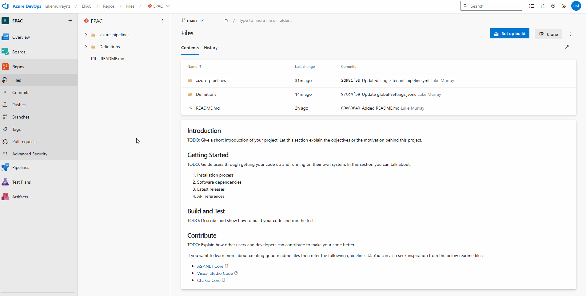

Now that it's imported, we can run the pipeline. The first pipeline deployment is aimed at making the state of Azure match the EPAC environment and also giving access to the pipelines to the Service Connections.


If this is the first time the pipeline has been run, there may be delays, as you need to approve the pipeline to be able to use the Service Connections.

Congratulations! You have deployed your Azure Policy as Code!

If you login to the Azure Portal and navigate to your [Policies and assignments](https://portal.azure.com/#view/Microsoft_Azure_Policy/PolicyMenuBlade/~/Assignments), they should match.

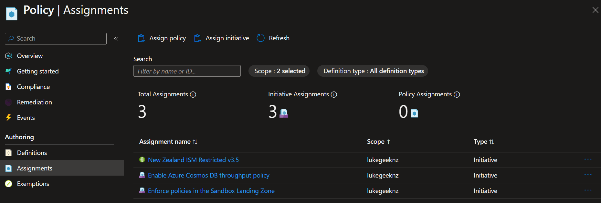

## Policy configuration

Now that the policies and assignments are deployed, you can start to configure your policies and assignments to match your environment.

### Change assignment scope

In my scenario, my Sandbox policies are assigned to my Lukegeeknz Management Group, and I want them to be assigned to my Sandbox Management Group, so I will need to update the policy assignments to reflect this.

I will test this by deploying it into a New Branch, which will trigger the dev Plan.


And we can see in the plan that the assignment will change successfully. 

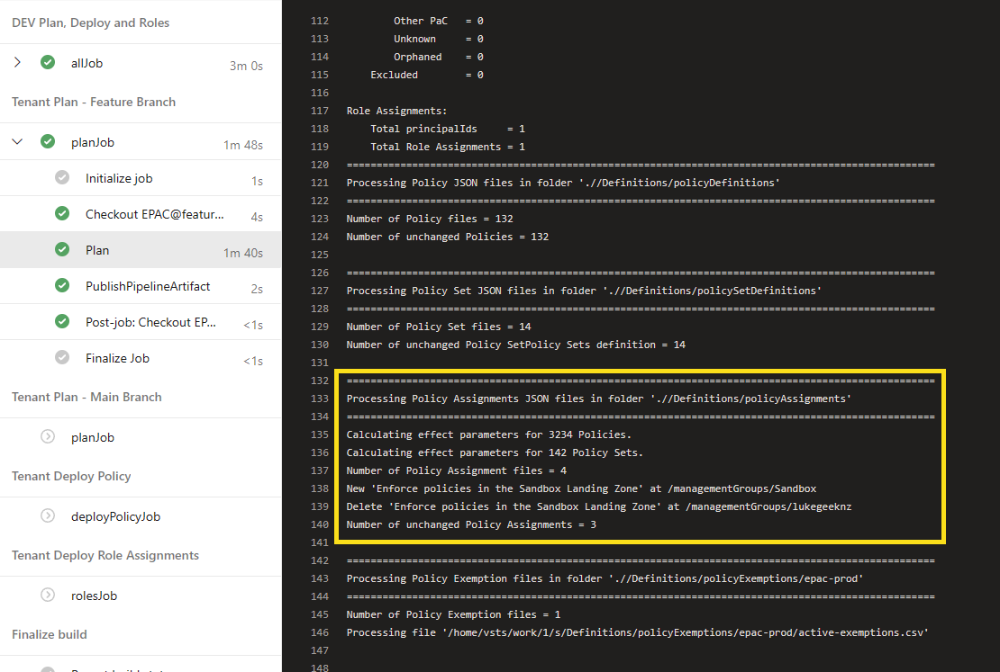

Now, lets merge or changes into Production, by opening up a Pull Request, once approved and merged the Sandbox assignment will be updated in Production.

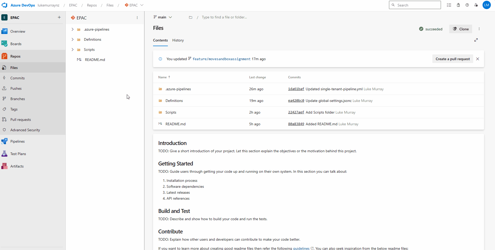

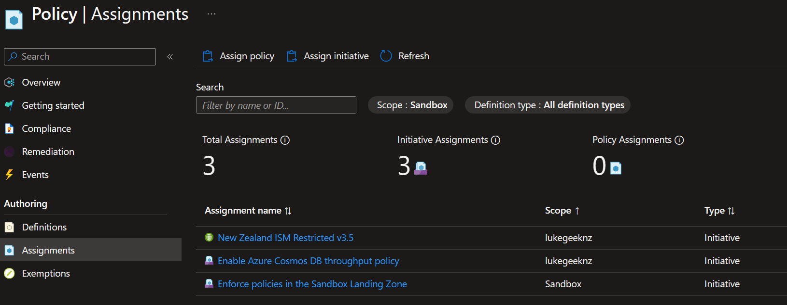

## Reference

You can view my EPAC code for reference directly on GitHub: [lukemurraynz/EPAC_ADO](https://github.com/lukemurraynz/EPAC_ADO) 
