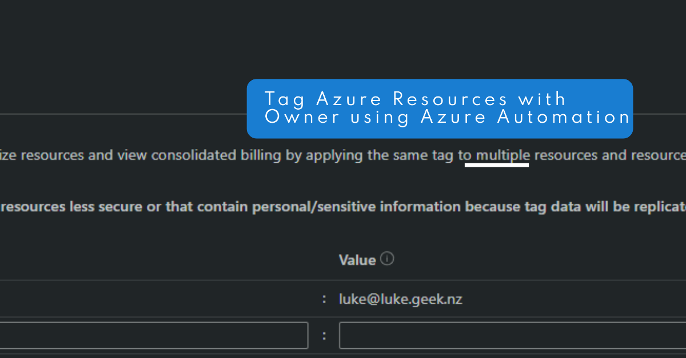

Inspired by [Tagging Azure Resources with a Creator](https://techcommunity.microsoft.com/t5/core-infrastructure-and-security/tagging-azure-resources-with-a-creator/ba-p/1479819?WT.mc_id=AZ-MVP-5004796) an Azure function + event grid solution, that will tag resources with the creator of the resource. I wanted to see if I could do the same thing using Azure Automation runbooks, instead of using event grid but a schedule instead, to make use of an already existing [Azure Automation](https://learn.microsoft.com/azure/automation/overview?WT.mc_id=AZ-MVP-5004796) account.

It turns out you can, so let's take a look.



{/*truncate*/}

Make sure to change the ManagementGroupID variable to match your own environment.

This runbook uses a System Managed Identity from the Azure Automation account, so make sure this has Contributor rights to the subscription or management group you want to tag resources in. 

:::info
This PowerShell script is designed to tag Azure resources with the user's email address who last modified them. It's particularly useful for tracking who is responsible for each resource in your Azure environment. Here's a step-by-step breakdown of what the script does:
1. **Disable AzContext Autosave**: The script starts by disabling the autosave feature for the Azure context. This ensures the script doesn't inherit any Azure context from previous sessions.
2. **Suppress Warnings**: The script suppresses warnings related to breaking changes in Azure PowerShell. This is to prevent these warnings from cluttering the output.
3. **Import Modules**: The script imports the Az.Accounts and Az.Resources modules, which provide the cmdlets needed to interact with Azure.
4. **Define Variables**: The script defines a variable for the tag name (`$tagName`) and the management group ID (`$ManagementGroupID`).
5. **Connect to Azure**: The script uses a Managed Service Identity.
6. **Get Subscriptions**: The script defines a function (`Get-AzSubscriptionsFromManagementGroup`) that retrieves all the subscription IDs under a specified management group, including subscriptions under child management groups. It then calls this function to get the subscription IDs under the management group specified by `$ManagementGroupID`.
7. **Process Each Subscription**: For each subscription ID retrieved, the script sets the Azure context to that subscription and retrieves all resources in the subscription.
8. **Process Each Resource**: For each resource in the subscription, the script checks if the resource has a tag with the name specified by `$tagName`.
9. **Add Tag If Not Present**: If the resource does not have a tag with the name specified by `$tagName`, the script retrieves the Azure activity logs for the resource for the past seven days and finds the user's email address who last modified the resource. It then adds a tag to the resource with the name specified by `$tagName` and the value set to the user's email address.
This script is designed to be run on a schedule, such as once a day, to ensure that all resources are tagged with the user's email address who last modified them.

```mermaid
graph TD
  A[Start] --> B[Disable AzContext Autosave]
  B --> C[Suppress Warnings]
  C --> D[Import Modules]
  D --> E[Define Variables]
  E --> F[Connect to Azure]
  F --> G[Get Subscriptions]
  G --> H{For Each Subscription}
  H --> I[Set Azure Context]
  I --> J[Get All Resources]
  J --> K{For Each Resource}
  K --> L[Check If Tag Exists]
  L --> |No|M[Get Azure Activity Logs]
  M --> N[Find Last Modified User]
  N --> O[Add Tag]
  O --> P[End]
  L --> |Yes|P
  K --> H
  ```
:::


The Runbook is as follows:

```powershell
<# Ensures you do not inherit an AzContext in your runbook #>
Disable-AzContextAutosave -Scope Process | Out-Null;

#Toggle to stop warnings with regard to Breaking Changes in Azure PowerShell
Set-Item -Path Env:\SuppressAzurePowerShellBreakingChangeWarnings -Value $true

## Import the required modules
Import-Module Az.Accounts
Import-Module Az.Resources

## Define the tag name as a variable
$tagName = "Createdby"

#Adjust to suit your management group; this is the top scope that the Script will run under
$ManagementGroupID = 'mg-landingzones'


<# Connect using a Managed Service Identity #>

Connect-AzAccount -Identity


## Get the subscription IDs under the specified management group AND child management groups
function Get-AzSubscriptionsFromManagementGroup {
    param($ManagementGroupName)
    $mg = Get-AzManagementGroup -GroupId $ManagementGroupName -Expand
    foreach ($child in $mg.Children) {
        if ($child.Type -match '/managementGroups$') {
            Get-AzSubscriptionsFromManagementGroup -ManagementGroupName $child.Name
        }
        else {
            $child | Select-Object @{N = 'Name'; E = { $_.DisplayName } }, @{N = 'Id'; E = { $_.Name } }
        }
    }
}


Write-Output "Setting ManagementGroupID to $($mgid.DisplayName)'..."

Write-Output "Retrieving management group with ID '$ManagementGroupID'..."
$mgid = Get-AzManagementGroup -GroupId $ManagementGroupID -Expand

Write-Output "Successfully retrieved management group with ID '$ManagementGroupID'."

Write-Output "Retrieving subscription IDs from management group '$($mgid.DisplayName)'..."

$subIds = Get-AzSubscriptionsFromManagementGroup -ManagementGroupName $ManagementGroupID 

foreach ($subId in $subIds) {
    Write-Output "Setting subscription context for subscription $subId..."
    Set-AzContext -Subscription $subId.Id

    $resources = Get-AzResource 

    Write-Output "Found resources in subscription $subId."

    foreach ($resource in $resources) {
        Write-Output "Processing resource $($resource.Name)..."
        $tags = $resource.Tags
        if ($null -eq $tags -or -not $tags.ContainsKey($tagName)) {        
            Write-Output "Resource $($resource.Name) does not have 'resource-owner' and  tags. Adding tags..."

            $endTime = Get-Date
            $startTime = $endTime.AddDays(-7)
            $owners = Get-AzLog -ResourceId $resource.ResourceId -StartTime $startTime -EndTime $endTime |
            Where-Object { $_.Authorization.Action -like "*/write*" } |
            Select-Object -ExpandProperty Caller 
            $owner = $owners | Where-Object { $_ -match "^[a-zA-Z0-9._%+-]+@[a-zA-Z0-9.-]+\.[a-zA-Z]{2,}$" } | Select-Object -First 1

            #Objects created by a Service Principal will tag the objects with a GUID instead of a name by default. You can fix this behavior by giving the Managed Identity the Application Developer role in Entra ID. 

            # If owner is null, stop the script
            if ($null -eq $owner) {
                Write-Output "No owner found that matches an email address."
            }
            
            # Output owners
            Write-Output "Owners: $owners, selected owner: $owner"
            $existingTags = $resource.Tags
            $modifiedTags = @{
                $tagName = $owner
            }
            # Merge existing tags with new tags
            $allTags = $existingTags + $modifiedTags

            $resource | Set-AzResource -Tag $allTags -Force
        }
    }
}
```

:::info
The script is also held on [GitHub](https://github.com/lukemurraynz/Azure/blob/main/Azure%20Automation/Tag-ResourceOwner.ps1), so feel free to raise an Issue or Pull Request if you have any improvements.
If there are no logged users due to the resource being written to or created outside of the Log retention, the resource will be skipped.
:::

This script could be extended with the [Change Actor feed](https://techcommunity.microsoft.com/t5/azure-governance-and-management/announcing-the-public-preview-of-change-actor/ba-p/4076626?WT.mc_id=AZ-MVP-5004796#:~:text=Identifying%20who%20made%20a%20change,all%20your%20tenants%20and%20subscriptions) to determine who made a recent change to the resource.
