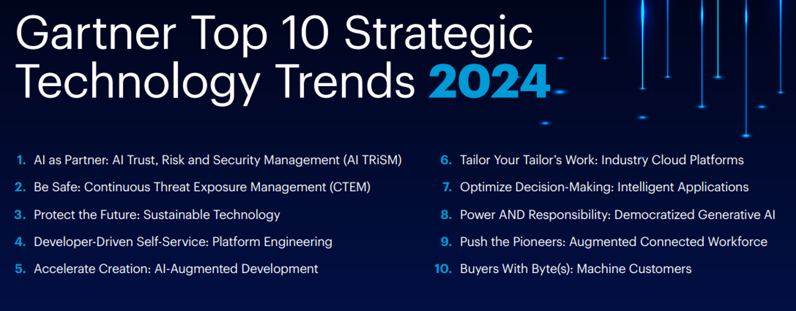
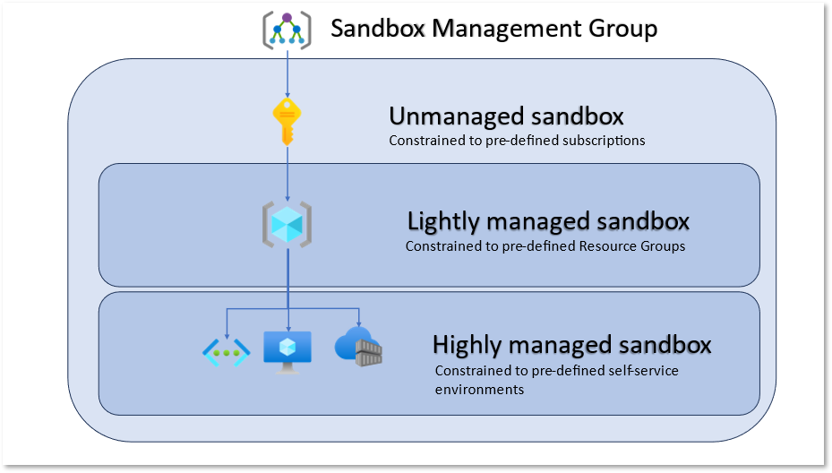

When working with Microsoft Azure, you may want an environment for learning, whether its for an individual or a team. This article aims to highlight some architectural considerations when looking at implementing a Sandbox environment within the Microsoft Azure platform.

{/*truncate*/}

## ☁️ What is a Cloud Sandbox environment?

When talking about a Sandbox environment, what am I talking about?

:::info
Cloud Sandboxes are contained, isolated environments that allow evaluation of new Cloud services and features _(without impacting production environments)_.

* Sandbox is a pathway to learning, not to development
* Build and experiment with capabilities with an open platform
* Co-innovate with trust and safeguards

General principles for a Sandbox environment are:

* Cannot store Production data
* Secure identity with production controls
* Environment for learning, not production

:::

## ❔Why would I want a Sandbox environment?

Having an environment for learning is key to driving adoption of Cloud technologies, by giving consumers the ability to leverage and test Azure resources, in an isolated environment, from Production, users using the Sandbox could be users new to Microsoft Azure, or those who may already have Azure knowledge but want to trial and test preview features, that may not be compliant with Production controls.

:::info
Platform Engineering, is the discipline of building and operating self-service internal platforms — each platform is a layer, created and maintained by a dedicated product team, designed to support the needs of its users by interfacing with tools and processes
:::

According to the Garther Top 10 technology trends for 2024, Platform Engineering, is a key element to the to enabling developers and application teams to remain comptitive, not only from a business standpoint, but also from talent retention, empowering employees to do more, the premise of Platform Engineering is for a 'Platform Team' to manage the governance of the Cloud platforms _(following key well-architected framework guidelines, such as Operational Excellence, Security, Performance and Realibility)_ and also allowing the Application owners to deploy and manage their applications, without having to worry about the necessary organisational guardrails.

## What are the antipatterns to avoid?

The word 'anti-patterns' can be quite negative teraminology to use, however its really a trade-off between having an environment, protected, ie with regulatory requirements etc, like you would in Production, in most cases preventing your Sandbox consumers, from being able to learn without running into the various guardrails, and having an environment on the opposite end of the scale, where there are no guardrails in place.

When we look at anti-patterns, we need to remember what we are trying to achieve with the Cloud Sandboxes ie, give Sandbox consumers an environment for learning Cloud technologies.

So let us take a look at some patterns and areas to avoid.

* Regional restrictionns - the reason why you might want to restrict Regional Restrictions, is due to the the fact that not all Azure services, are avaliable, in all regions.
* Over extensive blocklists
* Trying to build the entire platform at once

## Sandbox Patterns

Ok, lets talk Patterns! Every organisation may have a different Sandbox requirement,  but before we discuss the particulatrs of the patterns lets first talk about Platform Landing Zones, at a high level so I can make sure we are all talking the same lanuage.

In the context of Platform Landing Zones, I am refering to an Azure environment, setup like the Enterprise Scale Landing Zone Reference architecture (ESLZ), where the Landing Zone, features common components for the Platform, such as Security and Connectivity, and is usually the base of your networking infrastructure, such as Virtual WAN (Wide Area Network) connecting to your on-premises environment or a Virtual Network connecting different Applications and depedencies together.

The purpose of the Platform Landing Zone design, is to keep Platform management consistant, centralised, and secure, allowing your application teams to leverage the shared services, supplied by the Platform Landing Zone design. An organisation may have requirements, to move from this reference pattern - and that is ok - but the premise here is that the Platform Landing Zone is looked after a Platform or Infrastructure team _(in most cases)_ and the environment is architected in a way that does not impeed application teams, to deliver business value, while making sure that their solutions are secure and where necessary, consistant.

A sandbox usually contains:

* Data isolation
* Network security (segregated)
* Identity and access controls
* Compliance and regulatory considerations

So let us discuss Sandbox Types

### Sandbox Type - Personal

When refering to a Personal Sandbox, I am referring to a Free, Pay As You Go, or Azure Sponorship, Visual Studio Enterprise subscription(s) that are used by an invidiual, an example is a Cloud Engineer, who has access to a Visual Studio Enterprise subscription, and then uses the free credit, to spin up an Azure subscription - that is unmamaged and not part of the organisations network, identity or compliance controls. These subscriptions usually have a hard limit on the type of resources you can deploy

### Sandbox Type - Unmanaged

### Sandbox Type - Lightly Managed

### Sandbox Type - Highly Managed

## 📖Reference Links

🔗[Festive Tech Calender - 2023 - Azure Sandbox Design.mp4](https://youtu.be/WR9zRbzYfTQ)
🔗Gartner Top 10 Strategic Technology Trends for 2024 (https://www.gartner.com/en/articles/gartner-top-10-strategic-technology-trends-for-2024)
🔗Azure Sandbox (Azure Architecture Center) (https://learn.microsoft.com/en-us/azure/architecture/guide/azure-sandbox/azure-sandbox?WT.mc_id=AZ-MVP-5004796)
🔗Microsoft Azure Cloud Adoption Framework (https://azure.microsoft.com/en-us/solutions/cloud-enablement/cloud-adoption-framework?WT.mc_id=AZ-MVP-5004796)
🔗Azure subscription and service limits, quotas and constraints (https://learn.microsoft.com/en-us/azure/azure-resource-manager/management/azure-subscription-service-limits?WT.mc_id=AZ-MVP-5004796)
🔗Azure Deployment Environments (https://azure.microsoft.com/products/deployment-environments?WT.mc_id=AZ-MVP-5004796)
🔗Entra ID Access Packages (https://learn.microsoft.com/entra/id-governance/entitlement-management-access-package-create?WT.mc_id=AZ-MVP-5004796)
🔗BevanSin/AzureSandbox (https://github.com/BevanSin/AzureSandbox)
🔗dazzlejim/AzureSandbox (https://github.com/dazzlejim/AzureSandbox)

Icons: 🌏🔔☁️