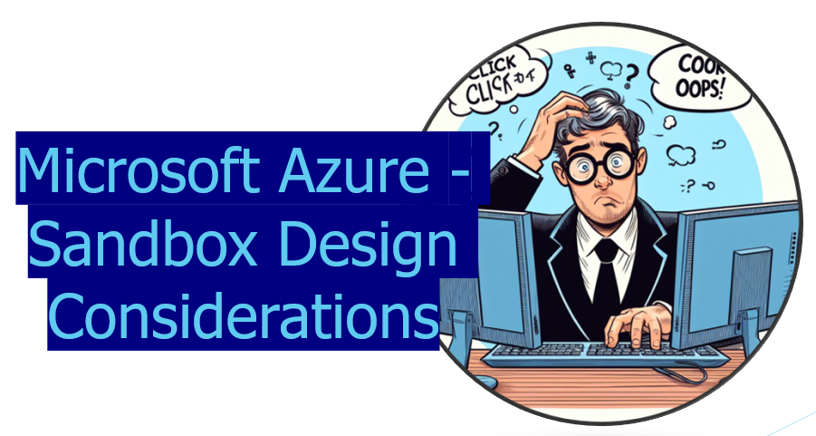
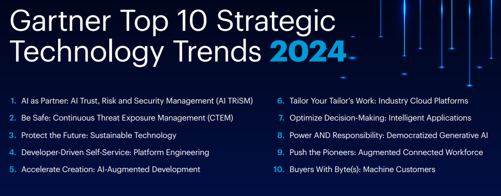
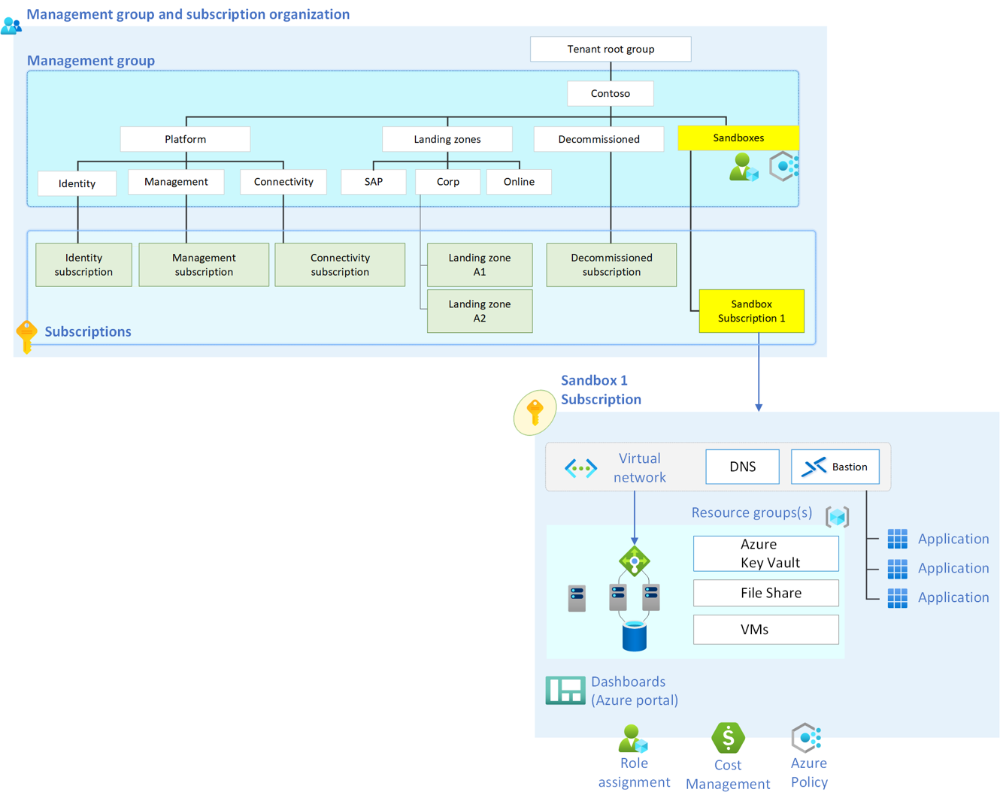
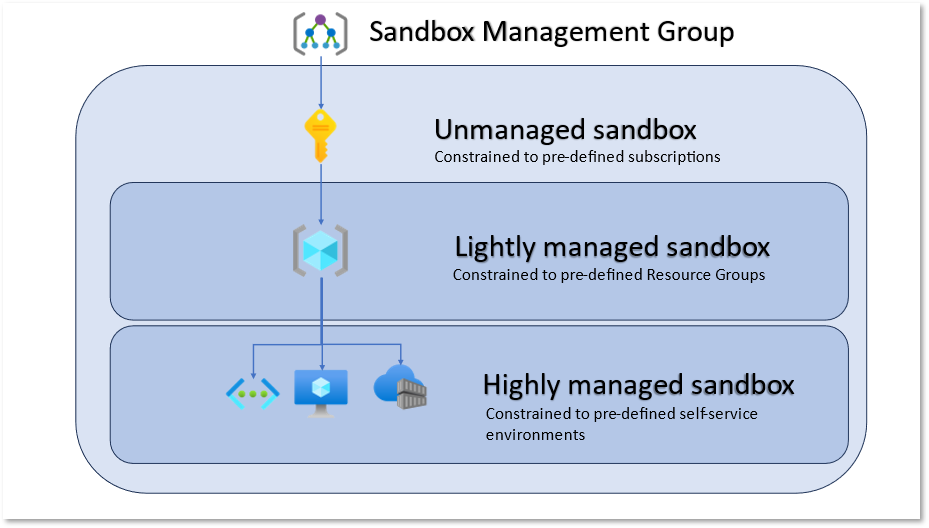
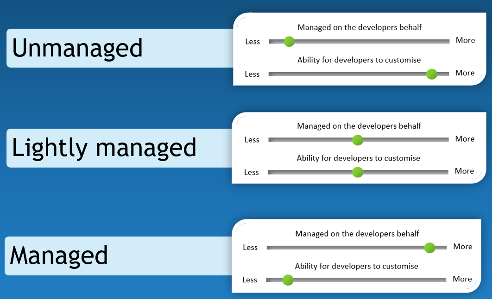
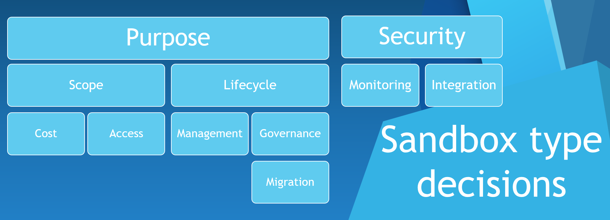
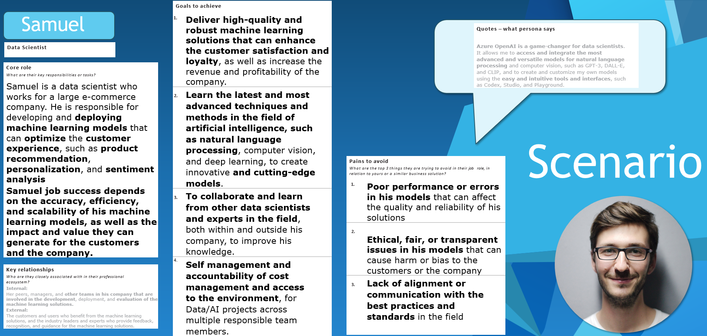
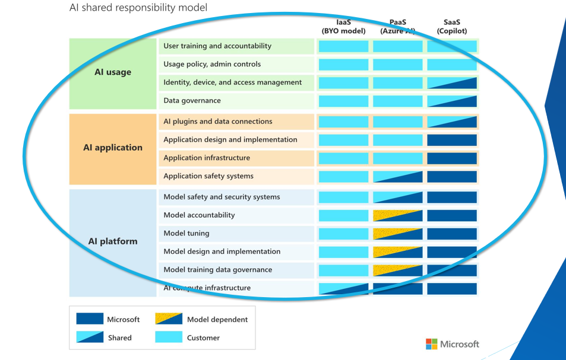
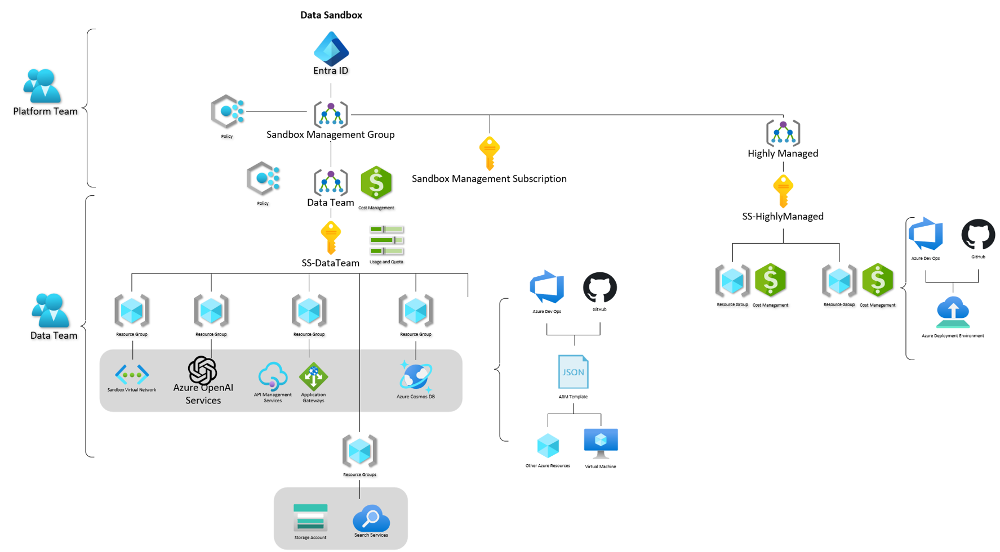
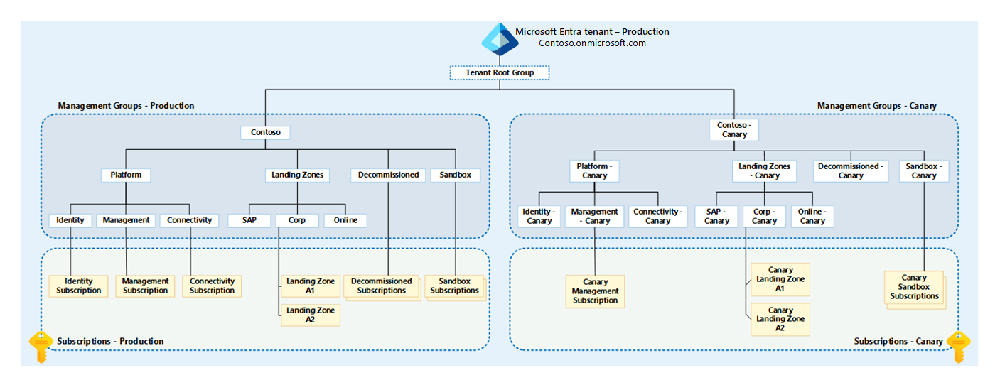

When working with Microsoft Azure, you may want an environment for learning, whether for an individual or a team. This article aims to highlight some architectural considerations when implementing a Sandbox environment within the Microsoft Azure platform.

:::tip
Your Sandbox isn’t a pathway to production; it’s a pathway to “CLICK, CLICK, OOPS.”
:::

{/*truncate*/}

## ☁️ What is a Cloud Sandbox environment?

What am I talking about when talking about a Sandbox environment?

:::info
Cloud Sandboxes are contained, isolated environments that allow the evaluation of new Cloud services and features _(without impacting production environments)_.

* Sandbox is a pathway to learning, not to development
* Build and experiment with capabilities with an open platform
* Co-innovate with trust and safeguards

The general principles for a Sandbox environment are:

* Cannot store Production data
* Secure identity with production controls
* Environment for learning, not production

:::

## ❔Why would I want a Sandbox environment?

Having an environment for learning is key to driving the adoption of Cloud technologies by giving consumers the ability to leverage and test Azure resources in an isolated environment from Production; users using the Sandbox could be users new to Microsoft Azure or those who may already have Azure knowledge but want to trial and test preview features, that may not be compliant with Production controls.

:::info
Platform Engineering is the discipline of building and operating self-service internal platforms — each platform is a layer created and maintained by a dedicated product team, designed to support the needs of its users by interfacing with tools and processes.
:::

According to the Gartner Top 10 technology trends for 2024, Platform Engineering is a key element to enabling developers and application teams to remain competitive, not only from a business standpoint but also from talent retention, empowering employees to do more, the premise of Platform Engineering is for a 'Platform Team' to manage the governance of the Cloud platforms _(following key well-architected framework guidelines, such as Operational Excellence, Security, Performance and Reliability)_ and also allowing the Application owners to deploy and manage their applications, without having to worry about the necessary organisational guardrails.

## 😷What are the antipatterns to avoid?

The word 'anti-patterns' can be quite negative terminology to use. However, it's really a trade-off between having an environment protected, i.e., with regulatory requirements, etc., like you would in Production, which in most cases prevents your Sandbox consumers from being able to learn without running into the various guardrails and having an environment on the opposite end of the scale, where there are no guardrails in place.

When we look at anti-patterns, we need to remember what we are trying to achieve with the Cloud Sandboxes, i.e. give Sandbox consumers an environment for learning Cloud technologies.

So, let us take a look at some patterns and areas to avoid.

* Regional restrictions - the reason why you might want to restrict Regional Restrictions is due to the fact that not all Azure services are available in all regions.
* Over extensive blocklists
* Trying to build the entire platform at once

## 📋Sandbox Patterns

Ok, let's talk Patterns! Every organisation may have a different Sandbox requirement, but before we discuss the particular of patterns, let's first talk about Platform Landing Zones at a high level so I can make sure we are all talking the same language.

In the context of Platform Landing Zones, I am referring to an Azure environment setup like the Enterprise Scale Landing Zone Reference architecture (ESLZ), where the Landing Zone features common components for the Platform, such as Security and Connectivity, and is usually the base of your networking infrastructure, such as Virtual WAN (Wide Area Network) connecting to your on-premises environment or a Virtual Network connecting different Applications and dependencies together.

The Platform Landing Zone design aims to keep Platform management consistent, centralised, and secure, allowing your application teams to leverage the shared services supplied by the Platform Landing Zone design. An organisation may have requirements to move from this reference pattern - and that is ok - but the premise here is that the Platform Landing Zone is looked after by a Platform or Infrastructure team _(in most cases)_ and the environment is architected in a way that does not impede application teams, to deliver business value, while making sure that their solutions are secure and where necessary, consistent.

A sandbox usually contains:

* Data isolation
* Network security (segregated)
* Identity and access controls
* Compliance and regulatory considerations

So, let us discuss Sandbox Types.

The term: Managed, below - is in the context of the Azure Cloud Adoption Framework, where the environment is managed by the organisation and is part of the organisation's governance, identity and compliance controls, and Platform team managed.

### Sandbox Type - Personal

When referring to a Personal Sandbox, I am referring to a Free, Pay As You Go, or Azure Sponsorship, [Visual Studio Enterprise subscription(s)](https://visualstudio.microsoft.com/subscriptions/?WT.mc_id=AZ-MVP-5004796) that are used by an individual, an example is a Cloud Engineer, who has access to a Visual Studio Enterprise subscription and then uses the free credit, to spin up an Azure subscription - that is unmanaged and not part of the organisation's network, identity or compliance controls. These subscriptions usually have a hard limit on the type of resources you can deploy or Budget.

Personal subscriptions are outside of the organisation's control and are not managed by the organisation. They are usually used for learning and not for production workloads. For individuals with these licenses, these subscriptions can be key to preparing for certification or individual upskilling.

### Sandbox Type - Unmanaged

When I refer to an Unmanaged Sandbox, I am referring to an Azure subscription that is managed by the organisation but is not part of the organisation's network, identity, or production compliance controls (although it would be auditable). 
These subscriptions are usually used for learning, not for production workloads. For individuals or teams, these subscriptions can be key to preparing for certification or team upskilling with Cloud technologies and preview features.

### Sandbox Type - Lightly Managed

When referring to Lightly Managed Sandboxes, these are more managed than an Unmanaged subscription because they are Resource Group limited; for example, a team of 10 may have access to a Lightly Managed Sandbox, where they can deploy resources into a specific Resource Group, or Resource Groups that they have access to, however, the overall governance of the Subscription is done by the Platform team. This is useful when you have a lot of individuals wanting a specific regulated Resource Group to stand up resources into, vs giving them a Subscription each.

Resource Group tags can be key to [FinOps](https://techcommunity.microsoft.com/t5/fasttrack-for-azure/the-azure-finops-guide/ba-p/3704132?WT.mc_id=AZ-MVP-5004796) cost management and tracking.

Lightly Managed sandboxes can be useful for smaller organisations that do not want Subscription sprawl.

### Sandbox Type - Highly Managed

Highly Managed Sandboxes are usually used for testing the same set of services repeatedly, where the users (particularly Developers) don't necessarily care about the underly Azure platform and resources and are more focussed on the application and services they are deploying, for example, a developer may want to test a new version of a service, and they can deploy the service into a Highly Managed Sandbox, and then run their tests, and then destroy the environment. 
Highly Managed Sandboxes are useful for standing up consistant infrastructure, such as an Azure Kubernetes Service or App Service, that is used every single time.

:::info
The main difference is that managed sandboxes have pre-determined services that can be deployed as needed, which is useful for testing the same set of services repeatedly.
Lightly managed sandboxes are useful when many individuals want a specific regulated Resource Group to allocate resources to.

In contrast, the unmanaged sandbox is more open and less restrictive, which makes it ideal for learning and trying new technologies for a small to large team.
:::

### Sandbox Type decisions

When deciding on the type of Sandbox, you need to consider the following:

* **The purpose of the Sandbox**. What are you trying to achieve with the Sandbox? Are you trying to give users an environment to learn, or are you trying to give users an environment to test a specific set of services?
* **The scope of the Sandbox**. Are you trying to give users an environment to learn, or are you trying to give users an environment to test a specific set of services?
* **The lifecycle of the Sandbox**. How long do you want it to be available? Do you want it to be available for a specific period of time?
* **The Cost of the Sandbox**. How much are you willing to spend on it? Who has the financial authority to approve Cloud spending?
* **Access to the Sandbox**. Who has access to the Sandbox, and how do you manage access to the Sandbox?
* **Management of the Sandbox**. Who is responsible for managing the Sandbox? How do you manage the lifecycle of the Sandbox?
* **Governance of the Sandbox**. How do you manage the governance of the Sandbox? How do you manage the compliance of the Sandbox? 
* **Migration of the Sandbox**. How do you migrate the Sandbox to a different environment? How do you migrate the Sandbox to a different subscription? ie what would migration of a proof of technology from a Sandbox environment into Dev/Test or Production look like?
* **Security of the Sandbox**. How do you manage the security of the Sandbox? How do you manage the identity and access to a Sandbox? How do you manage the compliance of the Sandbox?
* **Monitoring of the Sandbox** How do you monitor the Sandbox? How do you manage the cost of the Sandbox? How do you manage the performance of resources in the Sandbox (and do you need to)?
* **Integration of the Sandbox**. How do you integrate the Sandbox with other environments? How do you integrate the Sandbox with other subscriptions? How do you integrate the Sandbox with other services?

Consideration of all of the above will help you decide on the type of Sandbox that is right for your organisation.

| Criteria | Personal | Unmanaged | Lightly Managed | Highly Managed |
|----------|----------|-----------|-----------------|----------------|
| Purpose | Learning, individual upskilling | Learning, team upskilling | Regulated resource group for team | Testing specific services repeatedly |
| Scope | Individual | Small to large team | Specific team | Specific services |
| Lifecycle | Determined by individual | Determined by team | Managed by platform team | Managed by platform team |
| Cost | Limited by subscription type | Auditable, managed by organisation | Managed by platform team | Managed by platform team |
| Access | Individual | Team | Regulated by platform team | Regulated by platform team |
| Management | Individual | Team | Platform team | Platform team |
| Governance | Individual | Auditable, managed by organisation | Managed by platform team | Managed by platform team |
| Migration | Individual responsibility | Team responsibility | Managed by platform team | Managed by platform team |
| Security | Individual responsibility | Auditable, managed by organisation | Managed by platform team | Managed by platform team |
| Monitoring | Individual responsibility | Team responsibility | Managed by platform team | Managed by platform team |
| Integration | Individual responsibility | Team responsibility | Managed by platform team | Managed by platform team |

Let's look at a scenario:

We have a Data Scientist named Samuel.

Samuel's goals are to:

1. **Deliver high-quality and robust machine learning solutions that can enhance customer satisfaction and loyalty**x, as well as increase the revenue and profitability of the company. 
2. **Learn the latest and most advanced techniques and methods in the field of artificial intelligence, such as natural language processing**, computer vision, and deep learning, to create innovative and cutting-edge models.
3. To **collaborate and learn from other data scientists and experts in the field, both within and outside his company**, to improve his knowledge.
4. **Self-management and accountability of cost management** and access to the environment for Data/AI projects across multiple responsible team members**.

If we also take a look at the [Microsoft AI Shared responsibility model](https://learn.microsoft.com/azure/security/fundamentals/shared-responsibility-ai?WT.mc_id=AZ-MVP-5004796), we can see that the Data Scientist, is responsible for the Data, the AI model, and the AI application, and the Platform team is responsible for the underlying infrastructure, and the AI platform.

Because of Samuel's requirements and the shared responsibility model, we can see that Samuel would benefit from an Unmanaged Sandbox, where he can deploy resources into a specific Subscription he has access to, alongside members of his team and approved external identities, while also being isolated from Production. He has also accepted responsibility for Cost.

The reference architecture of Samuel's Sandbox could look like the following:

## 🚙Pathway to Production

:::info
Remember: The Sandbox is not a pathway to production; it is a pathway to "CLICK, CLICK, OOPS".
:::

**However**, there will be times when users have learnt something in the Sandbox, and they want to move their solution into a Dev/Test or Production environment, and this is where the [Cloud Adoption Framework](https://learn.microsoft.com/azure/cloud-adoption-framework/?WT.mc_id=AZ-MVP-5004796) comes into play, and the [Well-Architected Framework](https://learn.microsoft.com/azure/well-architected/?WT.mc_id=AZ-MVP-5004796) can be used to help guide the migration of the solution from the Sandbox into a Dev/Test or Production environment.

Make sure to consider the following:

1. **Identify and document the requirements and specifications of the product after your learning**: After experimenting and learning in the Sandbox, it's crucial to identify and document the requirements and specifications of the product. This includes understanding the technical requirements, the business needs, and the user expectations. This step is in line with the Strategy phase of the Cloud Adoption Framework.
2. **Security considerations (RBAC, Access, CISO review)**: Security is a paramount concern when moving from a Sandbox to a Production environment. Considerations should include Role-Based Access Control (RBAC) to ensure only authorized individuals have access, a thorough review of access permissions, and a review by the Chief Information Security Officer (CISO) or equivalent. This aligns with the Well-Architected Framework's security pillar.
3. **Ensure that the data, code, models, and outputs are suitable for Production; change**: Before moving to Production, ensure that all data, code, models, and outputs are production-ready. This means they should be thoroughly tested, reliable, and meet all necessary regulations and standards. This is part of the Plan and Ready phases of the Cloud Adoption Framework.
4. **Deploy the production using CI/CD where possible**: Continuous Integration/Continuous Deployment (CI/CD) is a best practice for deploying applications. It allows for frequent code changes, automated testing, and quick deployment to production. This is part of the Migrate and Innovate phases of the Cloud Adoption Framework.
5. **Test and debug**: Rigorous testing and debugging are essential to ensure the product works as expected and any issues are identified and fixed before going live. This aligns with the Well-Architected Framework's reliability pillar.
6. **Monitor and manage**: Once in production, the application should be continuously monitored and managed to ensure it remains secure, performs well, and meets user needs. This includes monitoring for any issues, managing updates and changes, and regularly reviewing performance. This is part of the Govern and Manage phases of the Cloud Adoption Framework.

Also, make sure you make sure of Cloud Adoption Framework Landing Zone guidance, such as [Dev/Test Management Group and subscription Landing Zone guidance, such as a Canary Management Group structure](https://learn.microsoft.com/en-gb/azure/cloud-adoption-framework/ready/enterprise-scale/testing-approach?WT.mc_id=AZ-MVP-5004796).

Although not mandatory, the canary environment management group hierarchy can be used to simplify testing of the following resource types without ending up with a range of exemptions and overprivileged access to Production resources, where it is not required:

* **Management groups**: Management groups in Azure provide a level of scope above subscriptions. They give you enterprise-grade management at a large scale no matter what type of subscriptions you might have. All subscriptions within a management group automatically inherit the conditions applied at the management group level.
* **Subscription placement**: The placement of subscriptions within the management group hierarchy is crucial. It allows for the application of governance conditions at different levels, providing flexibility and control over the environment.
* **Roles (built-in and custom)**: Azure provides several built-in roles that you can assign to users, groups, and services. You can also create custom roles if the built-in roles don't meet your specific needs.
* **Assignments**: Assignments in Azure RBAC are the links between roles and security principals (user, group, service principal, or managed identity). They define the access a security principal has.
* **Azure Policy**: Azure Policy is a service in Azure that you use to create, assign, and manage policies. These policies enforce different rules and effects over your resources, helping to ensure your resources stay compliant with your corporate standards and service level agreements.
* **Definitions (built-in and custom)**: Azure Policy uses policy definitions to express what to evaluate and what action to take. There are built-in definitions provided by Azure and you can also create custom definitions.
* **Initiatives, also known as set definitions**: An initiative definition is a set or group of policy definitions to help track your compliance state for a larger goal. Initiatives bring together one or more policies as a group to accomplish things like enabling real-time policy enforcement and more comprehensive coverage.

The Canary Landing Zone architecture is useful as it provides a controlled environment for testing changes and updates before they are applied to the production resources.

## 🚢Products and tools

When considering a Sandbox environment, you may want to consider the following products and tools to assist.

* [Azure Deployment Environments](https://learn.microsoft.com/azure/deployment-environments/overview-what-is-azure-deployment-environments?WT.mc_id=AZ-MVP-5004796) - useful for 'Highly Managed Sandboxes', Azure Deployment Environments, allows you to pre-define a set of services through infrastructure as code, and offer it up to developers or Sandbox consumers, as a Service, that they can then deploy and tear down as required.
* [Azure Dev/Test Labs](https://learn.microsoft.com/azure/devtest-labs/devtest-lab-overview?WT.mc_id=AZ-MVP-5004796) - Azure DevTest Labs is a service for easily creating, using, and managing infrastructure-as-a-service (IaaS) virtual machines (VMs) and platform-as-a-service (PaaS) environments in labs. Labs offer preconfigured bases and artifacts for creating VMs, and Azure Resource Manager (ARM) templates for creating environments like Azure Web Apps or SharePoint farms. Azure DevTest Labs is useful for Lightly Managed Sandboxes, where you want to give a team access to a specific Resource Group.
* [Entra ID Access Packages](https://learn.microsoft.com/entra/id-governance/entitlement-management-access-package-create?WT.mc_id=AZ-MVP-5004796) - Access packages are great for giving delegated access to a specific set of resources, for a specific period of time, and can be useful for Lightly and Unmanaged  Sandboxes, where you want to give a team access to a specific Resource Group or Subscription.
* [Microsoft Purview](https://learn.microsoft.com/purview/purview?WT.mc_id=AZ-MVP-5004796) - Microsoft Purview is a unified data governance service that helps you manage and govern your on-premises, multi-cloud, and software-as-a-service (SaaS) data. You can use Purview to understand your data, manage data policies, and ensure data privacy and compliance. Microsoft Purview is useful for understanding the data that is being used in the Sandbox.

## 📖Reference Links

1. [Festive Tech Calender - 2023 - Azure Sandbox Design](https://youtu.be/WR9zRbzYfTQ)
2. [Gartner Top 10 Strategic Technology Trends for 2024](https://www.gartner.com/en/articles/gartner-top-10-strategic-technology-trends-for-2024)
3. [Azure Sandbox (Azure Architecture Center)](https://learn.microsoft.com/en-us/azure/architecture/guide/azure-sandbox/azure-sandbox?WT.mc_id=AZ-MVP-5004796)
4. [Microsoft Azure Cloud Adoption Framework](https://azure.microsoft.com/en-us/solutions/cloud-enablement/cloud-adoption-framework?WT.mc_id=AZ-MVP-5004796)
5. [Azure subscription and service limits, quotas and constraints](https://learn.microsoft.com/en-us/azure/azure-resource-manager/management/azure-subscription-service-limits?WT.mc_id=AZ-MVP-5004796)
6. [BevanSin/AzureSandbox](https://github.com/BevanSin/AzureSandbox)
7. [dazzlejim/AzureSandbox](https://github.com/dazzlejim/AzureSandbox)
8. [Azure Sandbox Environment - Turbo360 Podcast](https://www.youtube.com/watch?v=dkNAnw1InA0)
