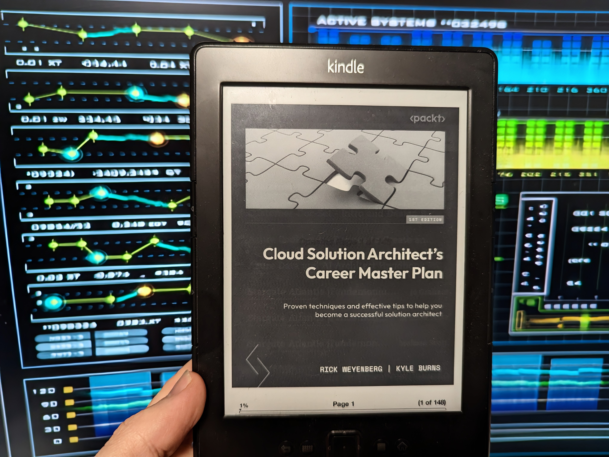

Eook review of [Cloud Solution Architect's Career Master Plan: Proven techniques and effective tips to help you become a successful solution architect](https://www.amazon.com/Cloud-Solution-Architects-Career-Master/dp/1805129716)

<!-- truncate -->

:::info
Although this book was given to me to review _(for free, I have no formal relationship with either Packetpub, although I thank them for allowing me to review this book, I am reviewing this book from an entirely independent view)_, as someone who architects and builds Azure solutions, this is the type of book, I usually would read, based on the title and synopsis, so let us open the page...  :
:::

Book synopsis:

>  Proven techniques and effective tips to help you become a successful solution architect.

## Introduction

[Cloud Solution Architect's Career Master Plan](https://www.amazon.com/Cloud-Solution-Architects-Career-Master/dp/1805129716) is a Packtpub published (in March 2024) book written by the following authors:

* [Rick Weyenberg](https://www.linkedin.com/in/rickweyenberg/)
* [Kyle Burns](https://www.linkedin.com/in/kylemburns/)

First up - lets take a look, who this book is for. According to the authors, this book is for, aspiring Cloud Solution Architects:

> If you are a self-motivated IT professional and would like to pursue a career as a solution architect, then 
this book is for you. You should have a solid base of traditional software architecture understanding, but not in-depth cloud concepts and design considerations.
> This book will also be valuable for anyone who is considering a solution architect role as a potential career field but doesn’t know where to get started. No experience in the cloud architect role is needed to get started.

In order to set the context of my review, I need to give a brief blurb about my own IT Career to give the context of what lense, I am reviewing from, and what I am looking for in a book like this, my background is Systems/Infrastructure Engineer, then moving into Cloud based roles, from project delivery/implementation, to technical assurance roles, working with third party service partners to deliver services, and now as a Senior Consultant/Architect *(the New Zealand IT industry, is very much generalised, one day you will be architecting strategic solutions, the next you will be doing infrastructure as code, as an engineer, we need to adapt to fit what needs doing at the time)*, so I am looking for a book that can help me in my career and  role, and also help me to mentor and guide others in their career.

There are 8 Chapters in this book, covering Introduction to the Cloud Solution Architect Role, Pursuing the Cloud Architect Role, Preparing for and after the Offer, and is 124 pages long.

I am going to break my review in several areas, and look at answering questions such as:

1. Does the book provide a clear understanding of the CSA’s role? How well does it explain the evolution of cloud computing?
2. Are the educational recommendations practical and accessible? Does the book cover a range of certifications?
3. Does the book offer actionable advice for gaining experience? Are the examples and suggestions relevant to current industry standards?
4. Is the book offer advice that is up-to-date and industry-specific? How helpful are the resume and interview tips?

So lets take a look and see if the book answers these questions. I don't want to give away too much of the book, but hopefully this review will give you a good idea of what to expect from the book.

## Role overview

For the role, Overview section, we are going to take a look at the book and see whether it discusses the responsibilities and evolution of a Cloud Solution Architect (CSA).

> Question: Does the book provide a clear understanding of the CSA’s role? How well does it explain the evolution of cloud computing?

Chapters 1 and 2, are dedicated to answering this very question, with Chapter 1: understanding the responsibilities of a Cloud Solution Architect, and Chapter 2: Types of Cloud Solution Architect roles.

Chapter 1, outlines the evolution of Cloud computing, from the first concepts of what became the internet in the 1960s to modern day Cloud within the 2000s. The authors, do a very good job of being concise on these details - and vendor agnostic, which is clear throughout the entire book. Its worth noting that alough the authors have ties to Microsoft, as part of their day to day roles, they cover Azure, AWS, Google concepts as well. Cloud Solution Architect is not specific to one Cloud or hyperscaler, and in my opinion the authors concentrate on that, very view - its purely about being able to fill the gap, that Cloud architecture has, as an Architect.

Not only does the Chapter outline the history, but gives insights into core Cloud concepts as well, along with high-level points around the [Microsoft Cloud Adoption](https://learn.microsoft.com/azure/cloud-adoption-framework/?WT.mc_id=AZ-MVP-5004796) and [Well-Architected Framework](https://learn.microsoft.com/azure/well-architected/?WT.mc_id=AZ-MVP-5004796).

In regards, to a CSA (Cloud Solution Architect) role, the book outlines the upsides and downsides of the role and some of the responsibilities that come with the role, acrosss elemments from on-premises, IaaS *(Infrastructure as a Service)*, PaaS *(Platform as a Service)* and SaaS *(Software as a Service)*, including various architectural patterns that CSAs need to know.

One of the highligts of the role overview Chapter, is that the authors, have distilled the role of 'Cloud Solution Architect' which, could mean different things, to different people - a very open ended job title, into the various sub-categories that exist for CSAs, and organisations such as Microsoft adhere to, such as Cloud Solution Architect (Infrastructure), Cloud Solution Architect (Applications), Cloud Solution Architect (Data and AI), and Cloud Solution Architect (Security) etc, highlighting the differences in these particular roles, including tools and relevant certifications for each Architect function.

**Overall, these Chapters, does a good job of setting the scene for the rest of the book, and gives a good overview of the role, and the responsibilities that come with it, and in my opinion, clearly answers the question of What a CSA is, and what they do, and even covers industry specific *(such as Healthcare or Utilities)*.**

## Educational Pathways

For this section, we will examine the various educational paths and certifications available for aspiring CSAs, by answering the following question:

> Question: Are the educational recommendations practical and accessible? Does the book cover a range of certifications?

**I aluded to this, in the previous section (Role overview), the book authors, have included a list of relevant certifications, for each CSA (Cloud Solution Architect) function, ie AWS Certified Machine Learning, AI Engineer Associate, for AI/ML CSAs (Artificial Intelligence/Machine Learning Cloud Solution Architects), including a draft of fundementals certifications across multiple platforms. It is my opinion, that the book covers educational pathways pretty well, with a vendor neutral focus, from technical certification recommendations, to even soft-skills, and growth-mindset recommended reading, some great content and pathways to get started on your journey as a Cloud Solution Architect.**

## Real-World Application

In thie section, we will evaluate the book's practical advice for gaining experience and industry-specific knowledge - outside of the book.

We will consider how the book addresses gaining real experience through side projects, open source contributions, and hackathons.

> Question: Does the book offer actionable advice for gaining experience? Are the examples and suggestions relevant to current industry standards?

**When looking at a role, such as a Cloud Solution Architect, gaining experience is key, and the book does a good job of outlining the various ways to gain experience, from side projects, to open source contributions, to hackathons, and even to the importance of networking, and building relationships with other professionals in the industry, and the importance of mentorship, and how to find a mentor.**
**As a community advocate, and someone who has learn't by helping the community *(outside of my day-to-day role)*, by contributing to open-source projects, Microsoft Learn documentation editing and writing, and helping on Microsoft Q&A etc, public speaking etc - the guidance this book offers is key, and even touches on the high-level roadmap of, being a consumer of an open-source project, and moving to more of a Contributor role. The path to a Cloud Solution Architect, is not always a straight line, and the book does a good job of outlining this, and the importance of gaining experience, and the various ways to do so, that that not necessarily your traditional, become an engineer, then either go into architecture or management.**

To quote from the book itself:

> "In 1975, Steve Wozniak started working on a side project to design a general-purpose computing device suitable for hobbyist use. This device became the Apple I and helped start Apple Computer down the path toward becoming a household name.In May 2023, Apple announced a revenue of $94.8 billion for the second quarter of 2023"

## Job Pursuit Strategy

In this section we will review the guidance provided for pursuing a job, crafting a resume, and preparing for interviews.

> Question: Is the job pursuit advice up-to-date and industry-specific? How helpful are the resume and interview tips?

Now that the book has covered alot of theory about what a CSA (Cloud Solution Architect) is and how to get experience and education *(in my opinion, covered successuflly)*, now lets see how whether the guidance can help us with the next step, of preparing for interviews, and crafting a resume.

First, we need to keep in mind that this book came out March 2024, around the same time as this review - so the information on hand is relevant and up-to-date at the time of this review, so the job pursuit advice is relevant for the current job market, however different industries, companies and geographical locations may have different requirements for an Architect, so make sure to read the fine print of that role.

**Going back to the book - the book has already touched on a Cloud Solution Architect, what that is, and how to get experience and industry specific concerns, but what the book hasn't touched on YET - is the different levels, for example: Junior, Senior, Principal Cloud Solution Architect, I question I had before reading this book was:**

**What was the difference between a Senior Cloud Solution Architect and a Principal architect? This book answered that.**

**The book also covered, average salary *(again company, geographical specific)*,  and recommendations on resume tips and skills. These sections were very high-level but straight to the point - the authors allowed room for you to adjust and make their recommendations your own, and adjustable for the actual role you are applying for. I took the recommendations as a way to structure the sentences and my achivements on my resume, and skills (both technical and soft skills) that I may need, or didn't think to add.**

**Alongside the resume tips, are tips about leveraging Social Media, and also some relevant interview questions.**

## Author's Expertise

I believe the authors have the correct expertise to make this book viable *(and based on my own knowledge, reading this book)* and accurate.

* [Kyle Burns](https://www.linkedin.com/in/kylemburns/) is Microsoft Principal Cloud Solution Architect - concentrating on Azure App Dev.
* [Rick Weyenberg](https://www.linkedin.com/in/rickweyenberg/) is a Microsoft Principal Azure Cloud Solution Architect, with an industry focus for automotive.

**It is my opinion that this duo is indeed suited to write this type of book, and this can be seen from the actionable and valid output of the book itself.**

## Conclusion

**Cloud Solution Architect's Career Master Plan (1st Edition) is a book containing 124 pages of actionable, and useful content, for those interested in what a Cloud Solution Architect is, and how to start your journey on becoming one. Key traits needed in my opinion for a Cloud Solution Architect are a desire to learn, and stay up to date with emerging technologies, this is reflected in the guidance of the book. Overall I had no pre-conceptions when I was asked to review this book, but it was very timely, for my personally, where I am in my own career, and questions that I had.**

**I would like to point out, that this book goes beyond, by dedicating a section to giving back to the Community, and the importance of mentorship, and networking, and the importance of soft-skills, and growth-mindset, which is key to being a successful Cloud Solution Architect, and highly recommend picking up to read. The only issue I had was that there was missing 's' on an image for on-premises!**

If interested, feel free to checkout another Book review I did on [Book Review Azure Architecture Explained](https://luke.geek.nz/azure/misc/Book-Review-Azure-architecture-explained/), another great book on the more technical and governance aspects of architecting solutions in Azure.