[Azure Container Apps](https://learn.microsoft.com/azure/container-apps/overview?WT.mc_id=AZ-MVP-5004796), [KEDA](https://keda.sh/), and [Dapr](https://dapr.io/) — what are these, and how do they work together? This article aims to give a high-level insight into Azure Container Apps and some of the [Cloud Native ecosystem](https://landscape.cncf.io/) that surrounds this container orchestrator.

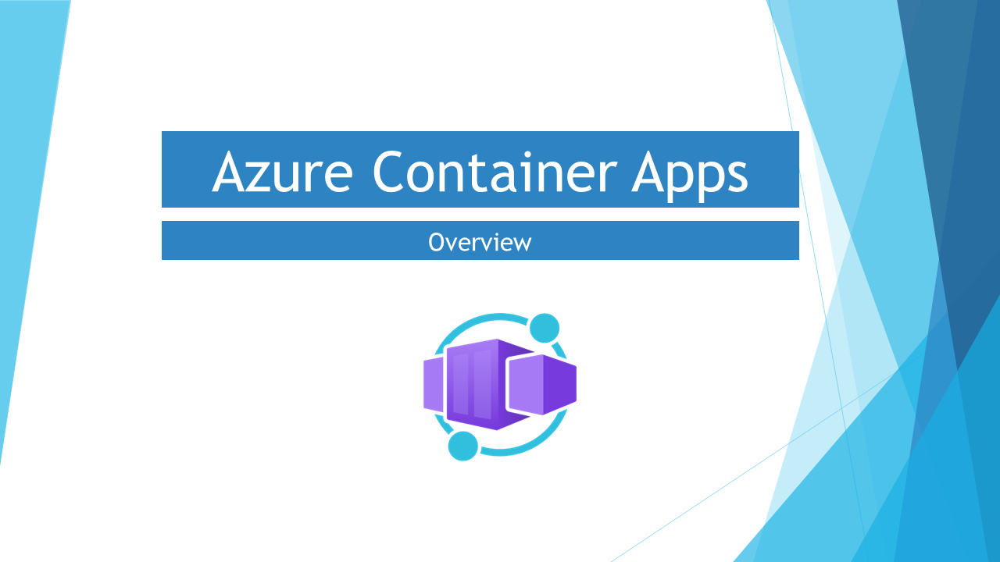

<!-- truncate -->

:::info
“[Azure Container Apps](https://learn.microsoft.com/azure/container-apps/overview?WT.mc_id=AZ-MVP-5004796) is a fully managed [Kubernetes-based](https://kubernetes.io/) application platform that helps you deploy apps from code or containers without orchestrating complex infrastructure.”
:::

## ☁️ Understanding Azure Container Apps

In this section, we will take a look at the following:

* Overview of Microservices
* Getting started with Container APPS
* Differences between ACA and other Azure container solutions

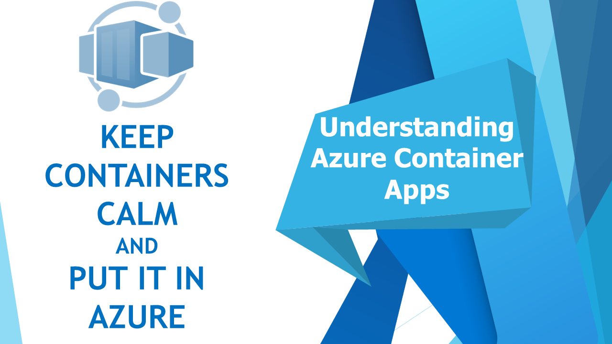

:::info
[Azure Container Apps](https://learn.microsoft.com/azure/container-apps/overview?WT.mc_id=AZ-MVP-5004796) is a fully managed serverless container service for building and deploying modern apps at scale - without managing infrastructure. It is built on top of Kubernetes and provides a simple, fully managed experience for deploying containerized applications.
:::

### Monoliths, Microservices and Containers? Huh?

To understand why we need Container Apps, we need to go back to some of the elements of software development. 

First, let's take a look at Monoliths.

#### Monoliths

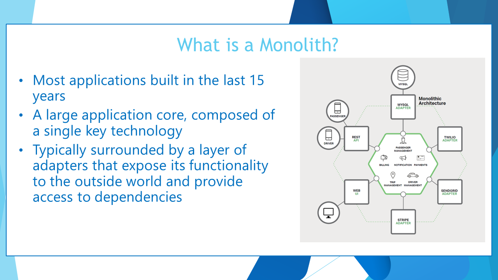

"In software engineering, a monolithic application is a single unified software application that is self-contained and independent from other applications but typically lacks flexibility"—Wikipedia.

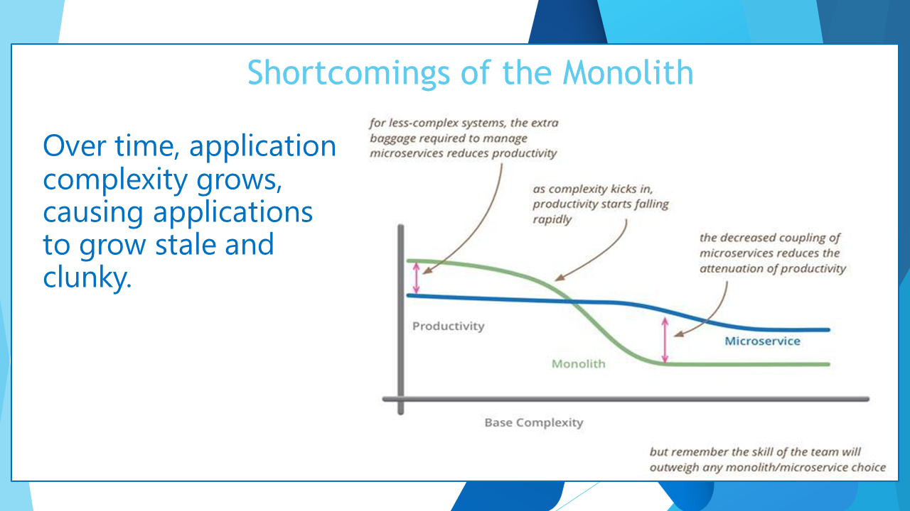

Generally, monolithic architectures suffer from drawbacks that can delay application development and deployment. These drawbacks become especially significant when the product's complexity increases or when the development team grows in size.

The codebase of monolithic applications can be difficult to understand because it may be extensive. This can make it difficult for new developers to modify the code to meet changing business or technical requirements. 

As requirements evolve or become more complex, it becomes difficult to correctly implement changes without hampering the code's quality and affecting the application's overall operation.

📖 References: 

* [monolithic architecture](https://www.techtarget.com/whatis/definition/monolithic-architecture)
* [Challenges and patterns for modernizing a monolithic application into microservices](https://developer.ibm.com/articles/challenges-and-patterns-for-modernizing-a-monolithic-application-into-microservices/)
* [Microservices with Azure Container Apps](https://learn.microsoft.com/azure/container-apps/microservices?WT.mc_id=AZ-MVP-5004796)

Next up is Microservices, a more modular approach to software development.

#### Microservices

At its core, the concept of the microservices architecture is an approach to application development in which a large application is built as a collection of modular and cooperating services. 

However, in order to successfully achieve a robust microservices architecture, the underlying infrastructure must also be correctly designed. In fact, due to the distributed nature of the microservices architecture, the line between what used to be separate application details and implementation details grows blurrier.

Containers simplify the continuous deployment of microservices.

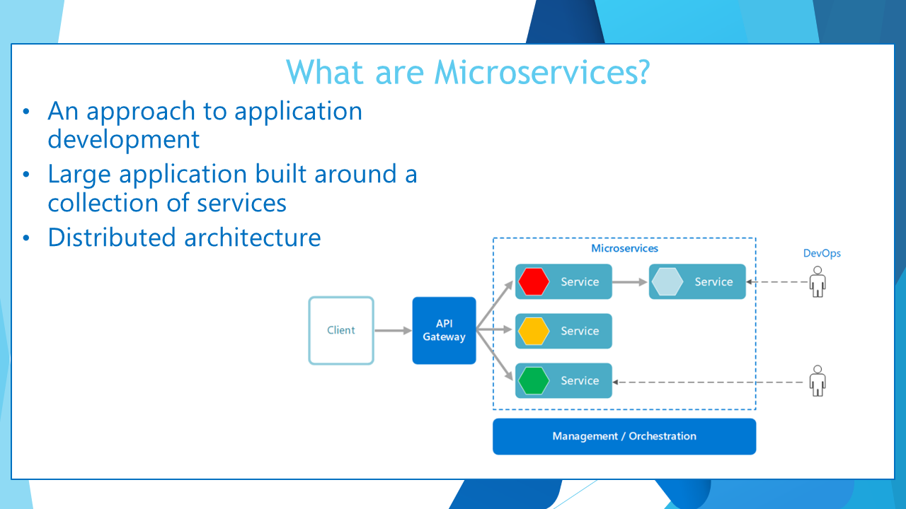

📖 References: 

* [Of Microservices & Containers](https://hackernoon.com/https-medium-com-spruha-pandya-of-microservices-containers-6f0ea25dac3)

#### Deployment modes

The deployment of microservices and traditional monolith applications is usually done separately, which is an oversimplification.

| Aspect | Microservices | Monolith Application |
|--------|---------------|----------------------|
| Service instantiation | Instantiate services instead of spinning up new machines => faster | Spinning up new machines for each instance => slower |
| Hardware utilization | Better utilization of hardware | Less efficient utilization of hardware |
| Cost | Optimized cost due to efficient resource usage | Potentially higher cost due to inefficient resource usage |
| Time to market | Lower time to market: more confident when it comes to upgrading a service | Higher time to market: less confident when it comes to upgrading a service |
| Independence | Services are independently implemented, deployed, scaled, and versioned | All components are tightly coupled and scaled together |

**So, let's take a look at how Microservices and Containers can work together.**

Let’s delve into the differences between microservices and containers:

| Aspect | Microservices | Containers |
|--------|---------------|------------|
| Definition | Microservices are an architectural style that breaks down an application into small, autonomous services. These services communicate via well-defined interfaces using lightweight APIs. | A container is a technology that bundles an application along with all its dependencies into a package. This package allows the application to be deployed consistently across different environments, abstracting away differences in operating systems and underlying infrastructure. |
| Structure | Microservices are self-contained and encapsulate their logic. They interact through well-defined interfaces, allowing independent development and deployment. | Containers ride on a host operating system, similar to virtual machines (VMs), but they share the OS kernel. This makes them lighter and faster to boot than VMs. Containers are hosted on a container runtime, which enables multiple containers (each several megabytes in size) to run on a single server. |
| Popular Tools | Microservices can be developed with various programming languages and frameworks. | Docker is a well-known commercial container management solution, while Kubernetes (often referred to as K8s) is a widely used free and open-source container management system. |
| Pros | Enhance maintainability, testability, and scalability. Organized around business capabilities and are typically owned by small teams. | Excellent for packaging and deploying applications consistently, regardless of the environment. More lightweight and faster to boot than VMs. |
| Cons | Complexity in managing multiple services. Need for coordination and communication between services. | Requires knowledge of container management and orchestration tools. Potential security risks if not properly isolated. |
| Use Case | Suitable for building modular, scalable applications. | Provides the infrastructure for running microservices, ensuring consistent deployment and management across different environments. |

Containers provide the infrastructure for running microservices, ensuring consistent deployment and management across different environments. Microservices, on the other hand, define the architectural approach for building modular, scalable applications.

### 💡 Container orchestration

:::info
Container orchestration is required to transition from deploying containers individually on a single host, to deploying complex multi-container apps on many machines. It requires a distributed platform, independent from infrastructure, that stays online through the entire lifetime of your application, surviving hardware failure and software updates.
:::

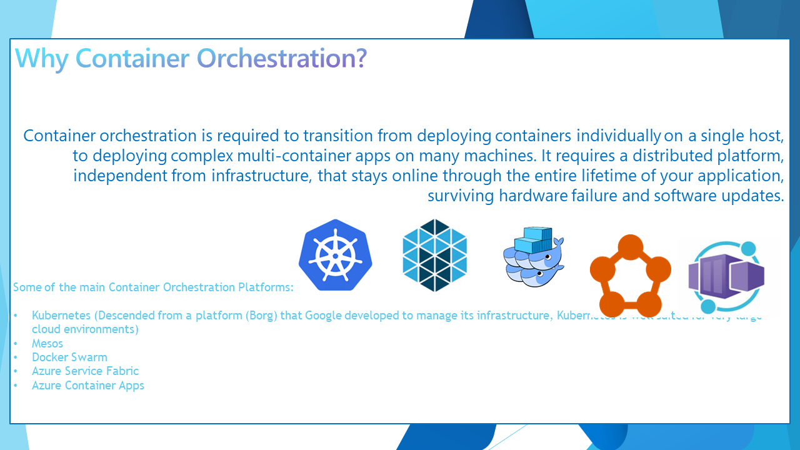

Existing Container orchestration solutions include the following:

| Solution | Description | Pros | Cons |
|----------|-------------|------|------|
| Kubernetes | An open-source platform designed to automate deploying, scaling, and operating application containers. | Highly flexible and customizable. Large community support. | Complexity in setup and management. |
| Docker Swarm | Docker's own native container orchestration. | Easy to set up. Integrated into Docker CLI. | Limited functionality compared to Kubernetes. |
| Amazon ECS | A highly scalable, high-performance container orchestration service that supports Docker containers. | Deep integration with AWS services. | Only available on AWS. |
| Azure Kubernetes Service (AKS) | Managed Kubernetes service provided by Azure. | Deep integration with Azure services. Managed Kubernetes with less operational complexity. | Only available on Azure. |
| Azure Container Apps | A serverless container service that enables you to run containerized applications at scale. | Serverless, event-driven, and supports Linux containers. Deep integration with Azure services. | Only available on Azure. |

**So, what is Container orchestration?**

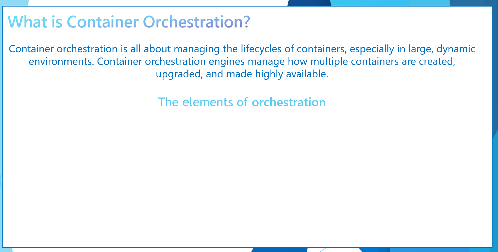

Container orchestration plays a crucial role in managing and scaling containerized applications. Here are some reasons why it’s essential:

| Feature | Description |
|---------|-------------|
| Scaling and Load Balancing | Container orchestration tools like Kubernetes allow you to dynamically scale your application by adding or removing containers based on demand. Load balancing ensures that incoming requests are distributed evenly across containers, preventing overload on any single instance. |
| High Availability | Orchestration ensures that your application remains available even if individual containers fail. It automatically restarts failed containers or replaces them with healthy ones. |
| Service Discovery and DNS | Containers come and go, making it challenging to keep track of their IP addresses. Orchestration tools provide service discovery and DNS resolution, allowing containers to find each other by name. |
| Rolling Updates and Rollbacks | When deploying new versions of your application, orchestration allows for rolling updates. You can gradually replace old containers with new ones, minimizing downtime. In case of issues, you can easily roll back to a previous version. |
| Configuration Management | Orchestration tools manage environment variables, secrets, and other configuration settings for containers. This centralizes configuration management and ensures consistency. |
| Resource Optimization | Orchestration optimizes resource utilization by scheduling containers efficiently across nodes. It balances CPU, memory, and storage requirements. |
| Networking and Security | Orchestration handles networking, including creating virtual networks for communication between containers. It also manages security policies, access controls, and network segmentation. |
| Monitoring and Logging | Container orchestration platforms provide monitoring dashboards and logs. You can track performance, troubleshoot issues, and gain insights into your application. |

Container orchestration simplifies deployment, enhances reliability, and ensures efficient management of containerized applications.

### 👑 Container Apps

[Azure Container Apps](https://learn.microsoft.com/azure/container-apps/overview?WT.mc_id=AZ-MVP-5004796) is a serverless platform that simplifies running containerized applications

1. Azure Container Apps allows you to focus on your application logic without worrying about server configuration, container orchestration, or deployment details.
2. It reduces operational complexity and saves costs by providing up-to-date server resources.
3. Common use cases include deploying API endpoints, handling background processing jobs, event-driven processing, and running microservices.

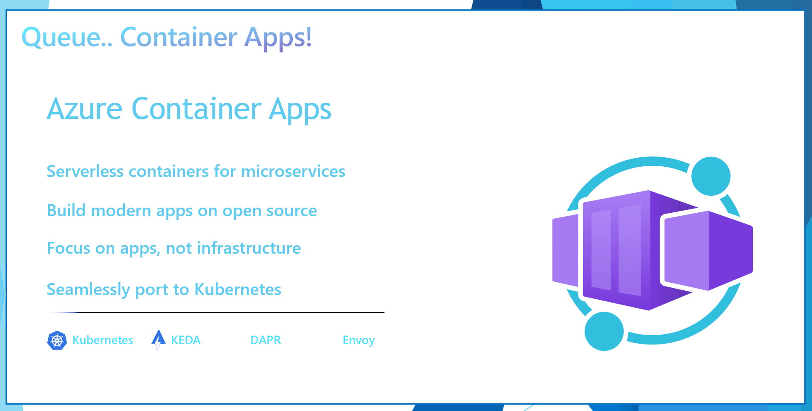

**You may be wondering what sort of applications you can build with Azure Container Apps.**

Here are some common ones including:
* Deploying API endpoints
* Hosting background processing applications
* Handling event-driven processing
* Running microservices

With each of those applications, you can dynamically scale based on:
* HTTP traffic
* Event-driven processing
* CPU or memory load
* Any KEDA-supported scaler

### What are the differences between Azure Container Apps and other Container solutions?

:::info
Azure customers can easily deploy microservices using either Azure Kubernetes Service for flexible customized container solutions or Azure Container Apps for productivity-optimized, fully-managed serverless container solutions. Azure delivers app portability to support business growth powered by open source in the Kubernetes ecosystem. 
:::

Azure Container Apps is built on a foundation of powerful open-source technology to deliver the same microservices benefits as Kubernetes as a fully managed and serverless app hosting option. Behind the scenes, every container app runs on Azure Kubernetes Service, with Kubernetes Event Driven Autoscaling (KEDA), Distributed Application Runtime (Dapr), and Envoy deeply integrated in the hosting service. However, developers and operators are not exposed to this underlying Kubernetes infrastructure. The open-source-centric approach enables a path for teams to build microservices without having to overcome the concept and operational overhead of working with Kubernetes directly and enables continued app portability by leveraging open standards and APIs

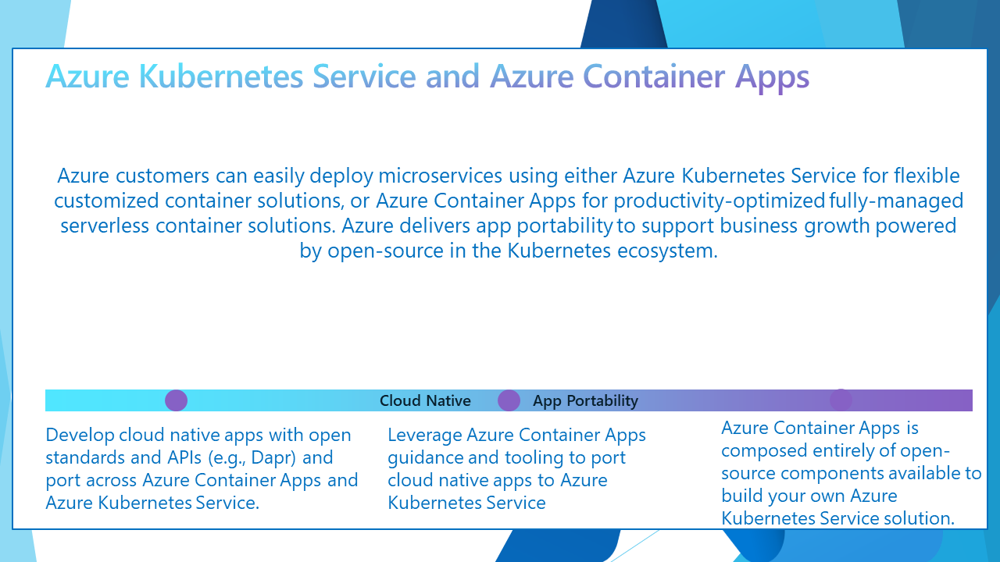

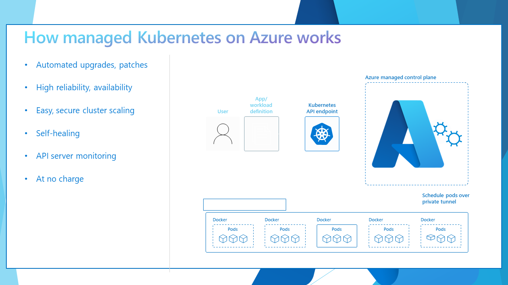

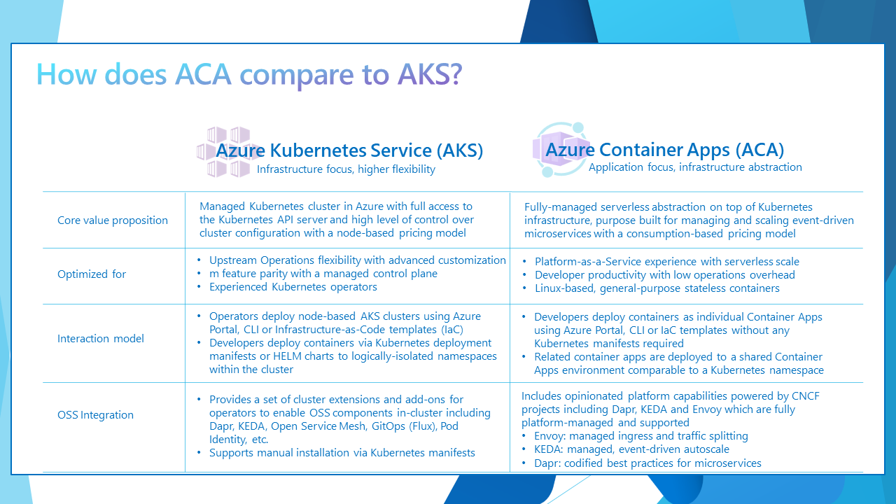

## ⚡Building Azure Container Apps

Now that we know where Azure Container Apps fits in the Cloud Native ecosystem let's take a look at potential tools for building Azure Container Apps.

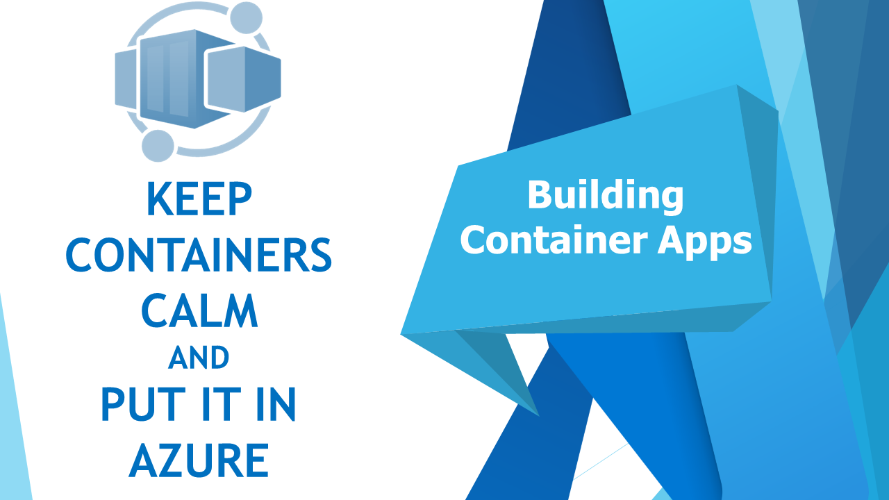

### Azure Container App Deployment options

Although anything that can connect to the Azure APIs can essentially create a [Container App Environment](https://learn.microsoft.com/azure/container-apps/environment?WT.mc_id=AZ-MVP-5004796), common tools are:

* [Azure Portal Deployment](https://learn.microsoft.com/azure/container-apps/quickstart-portal?WT.mc_id=AZ-MVP-5004796)
* [Azure CLI deployment](https://learn.microsoft.com/azure/container-apps/containerapp-up?WT.mc_id=AZ-MVP-5004796)
* [ARM template deployment](https://learn.microsoft.com/azure/container-apps/azure-resource-manager-api-spec?tabs=arm-template&WT.mc_id=AZ-MVP-5004796)
* [Bicep template deployment](https://learn.microsoft.com/azure/templates/microsoft.app/containerapps?pivots=deployment-language-bicep&WT.mc_id=AZ-MVP-5004796)
* [Terraform template deployment](https://registry.terraform.io/providers/hashicorp/azurerm/latest/docs/resources/container_app)
* [Pulumi](https://www.pulumi.com/registry/packages/azure-native/api-docs/app/containerapp/) or other API tools

### 🌐 Container App environments

But before you jump into the tools to create, you need to understand what you will be deploying and building, so let us take a look at [Container App Environments](https://learn.microsoft.com/azure/container-apps/environment?WT.mc_id=AZ-MVP-5004796).

:::info
A Container app environment is a secure boundary around groups of container apps that share the same virtual network and write logs to the same logging destination.

Container app environments are fully managed, where Azure handles OS upgrades, scale operations, failover procedures, and resource balancing.
:::

| Reasons to deploy container apps to the same environment | Reasons to deploy container apps to different environments |
|-----------------------------------------------------------|-----------------------------------------------------------|
| Manage related services                                   | Two applications never share the same compute resources   |
| Deploy different applications to the same virtual network | Two Dapr applications can't communicate via the Dapr service invocation API |
| Instrument Dapr applications that communicate via the Dapr service invocation API | |
| Have applications to share the same Dapr configuration | |
| Have applications share the same log analytics workspace | |
| Provide an existing virtual network when you create an environment | |

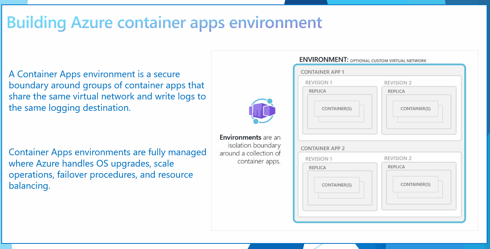

#### Container Types

Azure Container Apps supports two types of Containers.

App Container *(Sidecar)* - The container that runs your application code
Init Containers - Containers that run before the app container starts

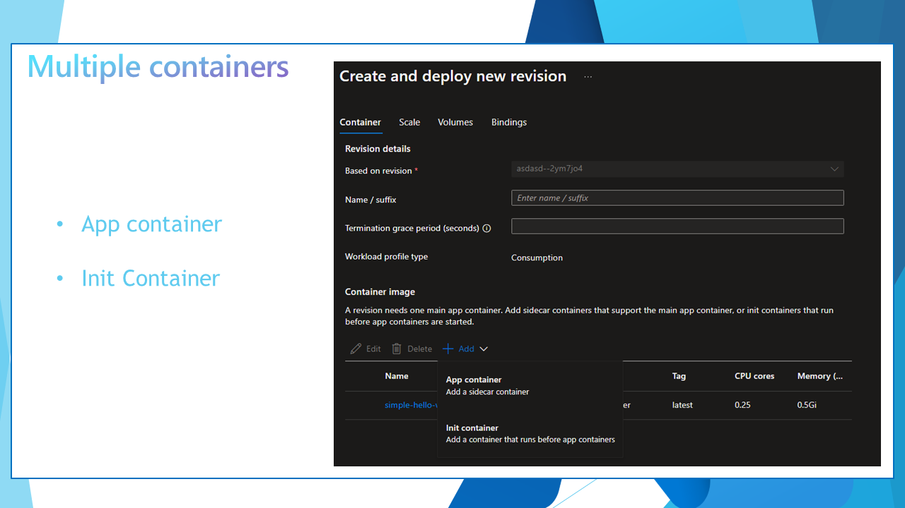

#### Container registry

Azure Container Apps supports multiple container registries, including:

* [Azure Container Registry](https://azure.microsoft.com/products/container-registry?WT.mc_id=AZ-MVP-5004796)
* [Docker Hub](https://hub.docker.com/) and other registries.

Public and private registries, i.e., Azure Container Registry, are on a private endpoint.

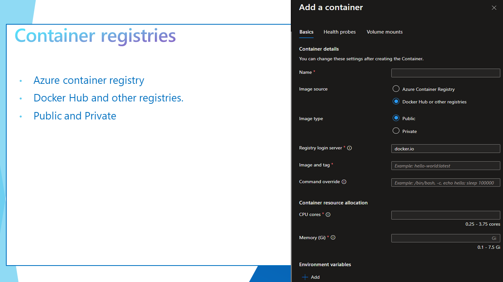

#### Container Revisions

:::info
Azure Container Apps implements container app versioning by creating [revisions](https://learn.microsoft.com/azure/container-apps/revisions?WT.mc_id=AZ-MVP-5004796). A revision is an immutable snapshot of a container app version.
:::

The first revision is automatically provisioned when you deploy your container app.
New revisions are automatically provisioned when you make a revision-scope change to your container app.
While revisions are immutable, they're affected by application-scope changes, which apply to all revisions.
You can create new revisions by updating a previous revision.
You can retain up to 100 revisions, giving you a historical record of your container app updates.
You can run multiple revisions concurrently.
You can split external HTTP traffic between active revisions.

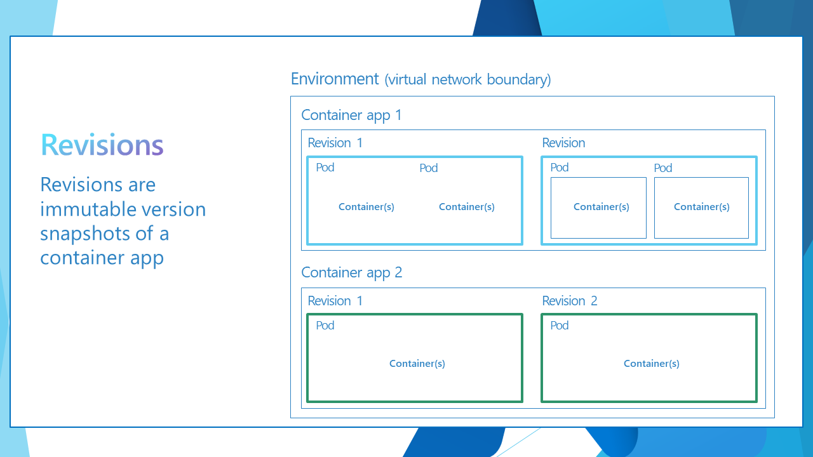

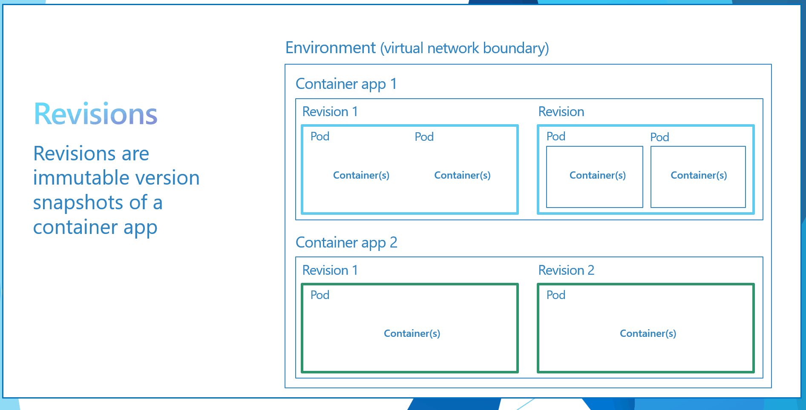

##### Container shutdowns

It's worth noting how your Containers will shut down as Azure Container Apps scales your Apps or you deactivate a revision, as this can affect your application.

The containers are shut down in the following situations:

* As a container app scales in
* As a container app is being deleted
* As a revision is being deactivated

When a shutdown is initiated, the container host sends a SIGTERM message to your container. The code implemented in the container can respond to this operating system-level message to handle termination.

If your application doesn't respond within 30 seconds to the SIGTERM message, then SIGKILL terminates your container.

Additionally, make sure your application can gracefully handle shutdowns. Containers restart regularly, so don't expect the state to persist inside a container. Instead, use external caches for expensive in-memory cache requirements.

📖 References: 

* [Application lifecycle management in Azure Container Apps](https://learn.microsoft.com/azure/container-apps/application-lifecycle-management?WT.mc_id=AZ-MVP-5004796)

#### Secret Management

Securely store sensitive configuration elements that are then available to containers through environment variables, scale rules, and Dapr.

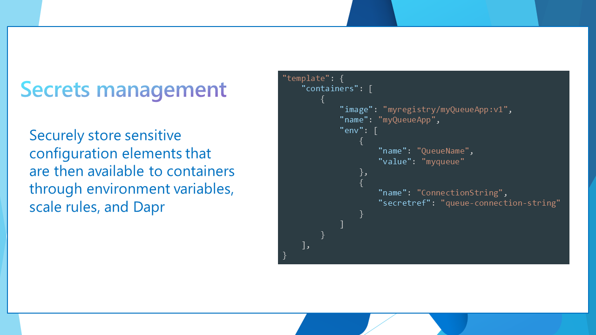

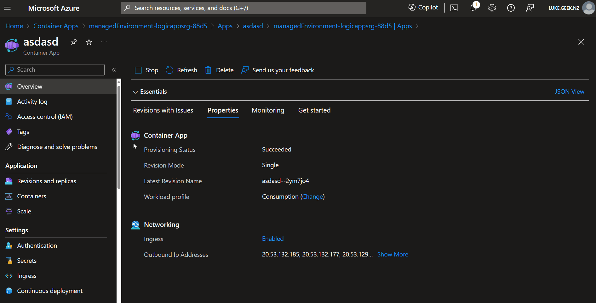

Those environment variables can also reference an [Azure Key Vault](https://azure.microsoft.com/products/key-vault?WT.mc_id=AZ-MVP-5004796). For further information, refer to the following Microsoft documentation: [Manage secrets in Azure Container Apps](https://learn.microsoft.com/azure/container-apps/manage-secrets?tabs=azure-portal&WT.mc_id=AZ-MVP-5004796).

## ☁️ Cloud Native Ecosystem

Azure Container Apps integrates several Cloud Native technologies, including [KEDA](https://keda.sh/) and [Dapr](https://dapr.io/), to provide a fully managed serverless container service.

These technologies are part of the [Cloud Native Computing Foundation](https://www.cncf.io/) and designed to help developers build and deploy modern applications at scale. 

### 👕 Dapr

[Dapr (Distributed Application Runtime)](https://dapr.io/) is a portable, event-driven runtime for building distributed applications across the cloud and edge. 

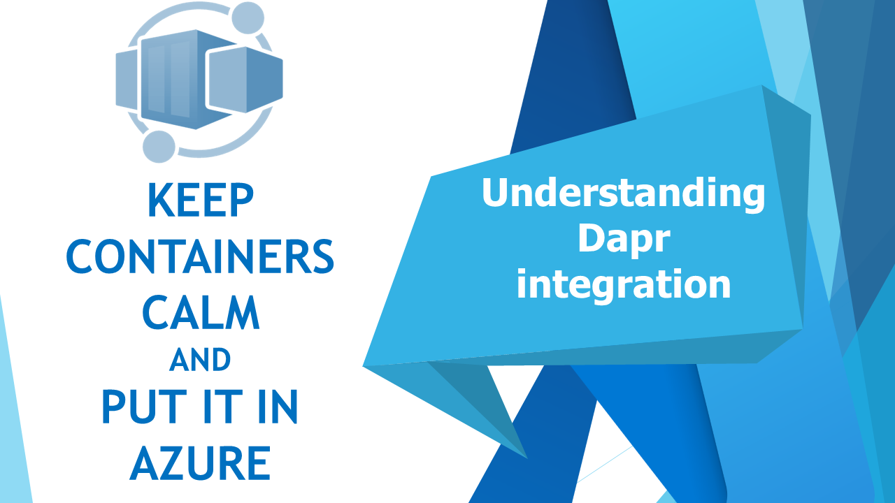

:::info
[Dapr](https://techcommunity.microsoft.com/t5/microsoft-developer-community/open-at-microsoft-dapr/ba-p/3857064?WT.mc_id=AZ-MVP-5004796) is a new way to build modern distributed applications. Born at Microsoft in 2019 as an incubation project, it was donated to the Cloud Native Computing Foundation in 2021 and is now a highly successful open-source project. Dapr helps you write flexible and secure microservices that leverage industry-proven best practices to build connected distributed applications faster. By letting Dapr’s sidecar take care of the complex challenges such as service discovery, message broker integration, encryption, observability, and secret management, you can focus on business logic and keep your code simple.
:::

Dapr is a set of integrated APIs with built-in best practices and patterns to build distributed applications. Dapr increases your developer productivity by 20-40% with out-of-the-box features such as workflow, pub/sub, state management, secret stores, external configuration, bindings, actors, distributed lock, and cryptography. You benefit from the built-in security, reliability, and observability capabilities, so you don't need to write boilerplate code to achieve production-ready applications.
Dapr's component model decouples the integrated API with the underlying resources. For instance, when you're using the Dapr publish-subscribe API, you can change the message broker by swapping out a yaml component file to switch from RabbitMQ to Kafka (or any other supported broker) without changing your application code.

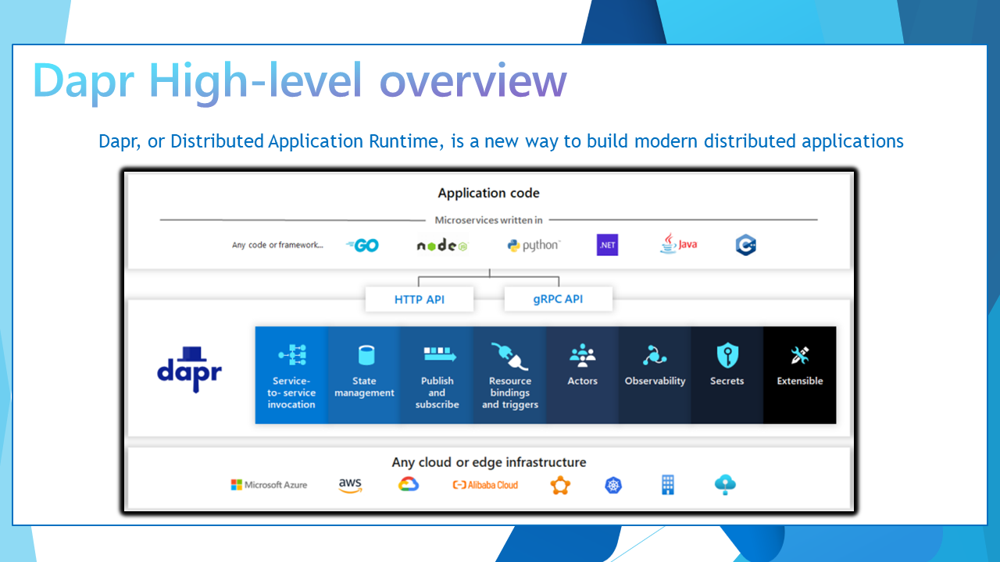

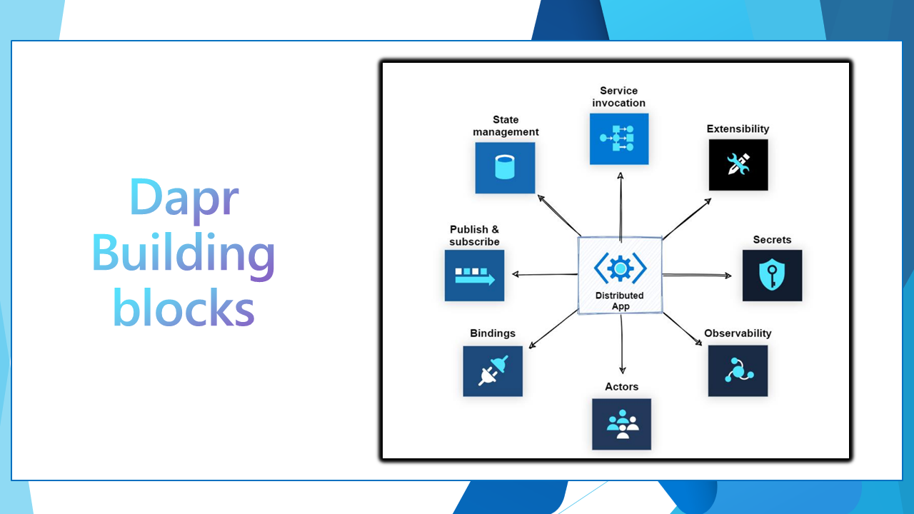

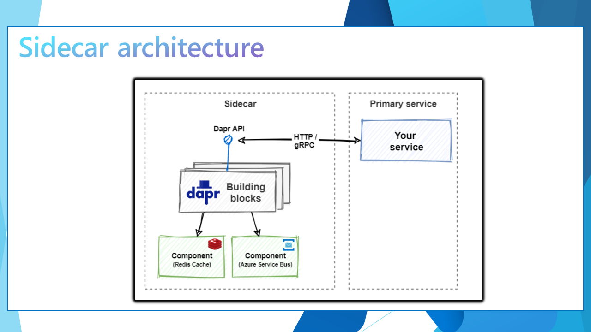

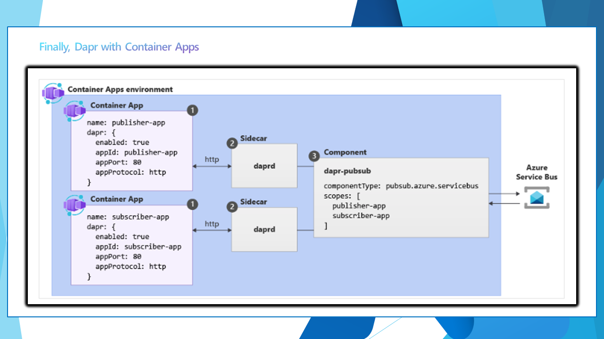

Dapr integration is built into Azure Container Apps, so you can focus on building your application without worrying about the underlying infrastructure. Dapr operates as a sidecar alongside your application, providing features only where needed.

Dapr integration is available straight from the Azure Portal for both the Envirionment and Container App itself.

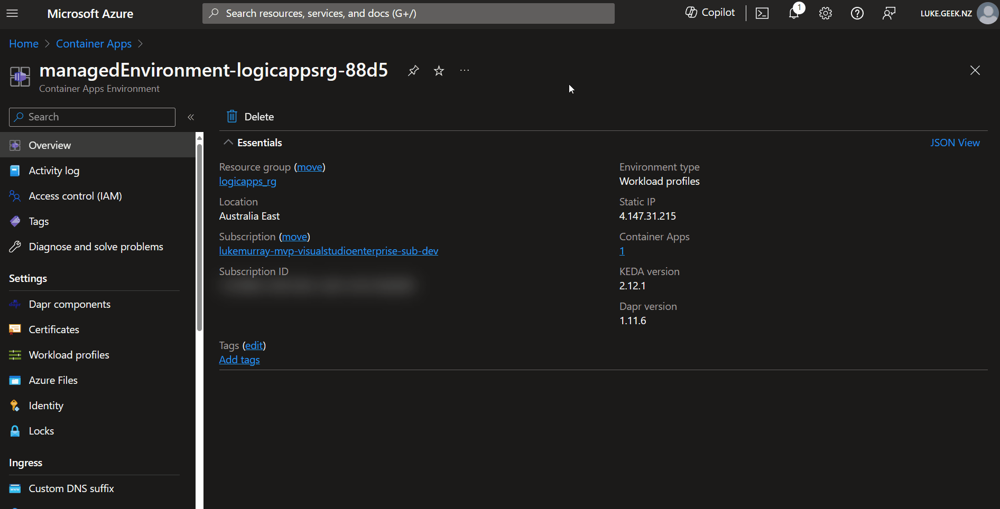

Also, make sure to check out [Dapr component resiliency](https://learn.microsoft.com/azure/container-apps/dapr-component-resiliency?tabs=bicep&WT.mc_id=AZ-MVP-5004796).

### 📚 KEDA

[KEDA (Kubernetes-based Event-Driven Autoscaling)](https://keda.sh/) is a Kubernetes-based event-driven autoscaling component.

:::info
KEDA is a Kubernetes-based Event Driven Autoscaler. With KEDA, you can drive the scaling of any container in Kubernetes based on the number of events needing to be processed.
:::

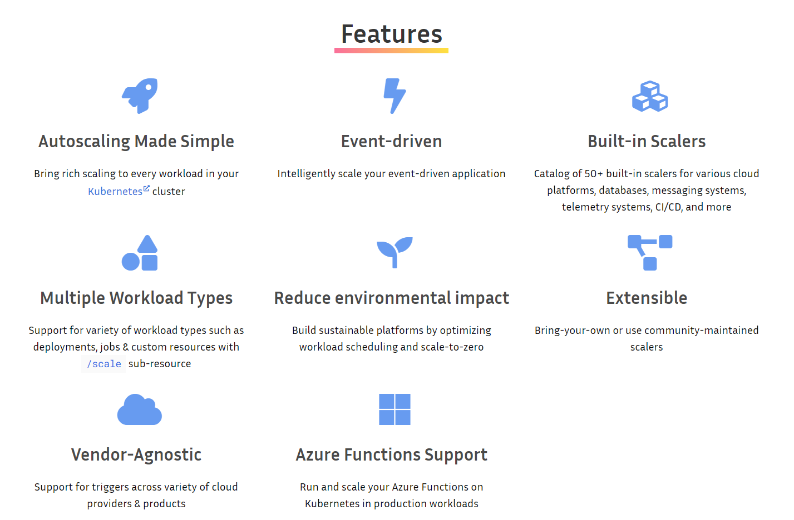

KEDA (Kubernetes-based Event Driven Autoscaling) is an open-source project that provides event-driven autoscaling for Kubernetes workloads. KEDA can scale any container in response to events from various sources such as Azure Service Bus, Azure Event Hubs, Azure Storage Queues, Azure Storage Blobs, RabbitMQ, Kafka, and more.

An example of KEDA event scaling is being able to scale your Containers based on KEDA scalers, such as Azure DevOps pipelines. You can refer to a previous blog post I did on leveraging KEDA scalers with [Container App Jobs to create Self-Hosted Azure DevOps Agents](https://luke.geek.nz/azure/hosted-agents-container-apps-job/).

KEDA really opens up the possibilities of scaling your Containers, based on events, and is a great addition to Azure Container Apps, and like DAPR KEDA is built-in to Azure Container Apps and managed by Microsoft.

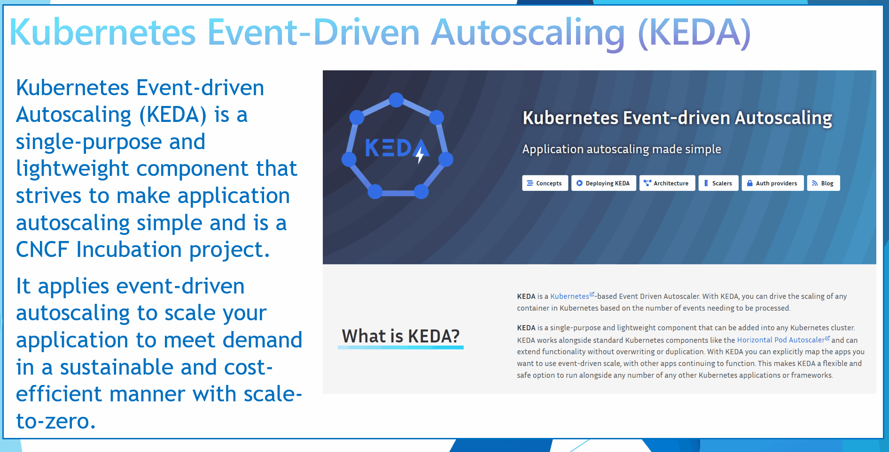

## Azure Container Apps Networking & Storage

Now, let us talk about Networking and Storage.

### 💻 Networking

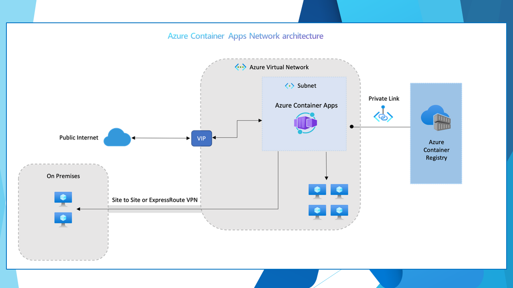

:::info
[Azure Container Apps run in the context of an environment](https://learn.microsoft.com/azure/container-apps/networking?tabs=workload-profiles-env%2Cazure-cli&WT.mc_id=AZ-MVP-5004796), which is supported by a virtual network (VNET). 

When you create an environment, you can provide a custom VNET, otherwise a VNET is automatically generated for you. Generated VNETs are inaccessible to you as they're created in Microsoft's tenant.

To take full control over your VNET, provide an existing VNET to Container Apps as you create your environment.
:::

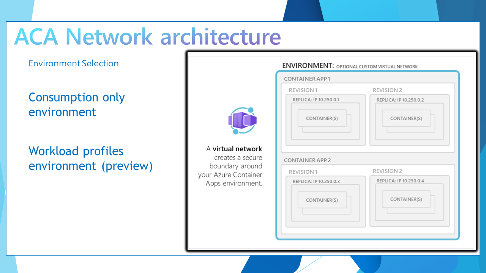

**Accessibility levels**

Using internal and external accessibility levels, you can configure whether your container app allows public ingress or ingress only from within your VNet at the environment level.

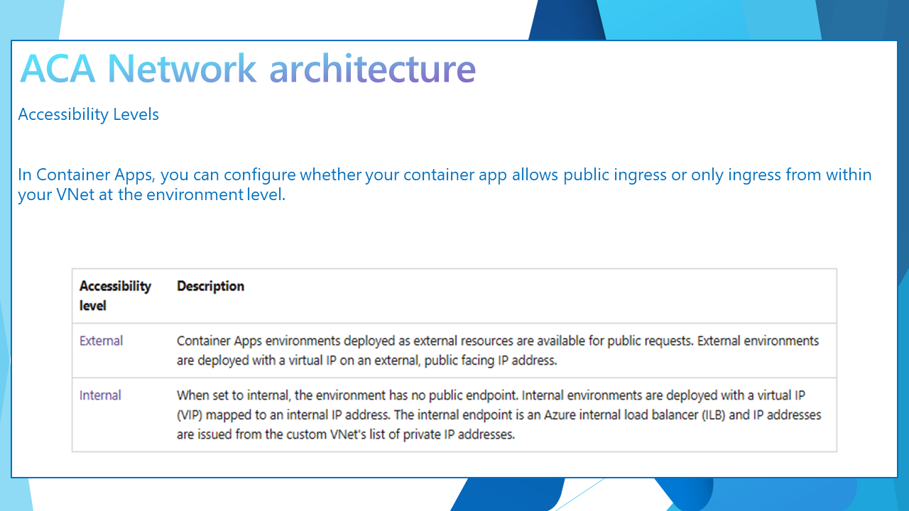

Custom VNET (Virtual Network) integration

If you want your container app to restrict all outside access, create an internal Container app environment.

When you provide your own VNet, you need to provide a subnet that is dedicated to the Container App environment you deploy. This subnet isn't available to other services.

Network addresses are assigned from a subnet range you define as the environment is created.

You can define the subnet range used by the Container Apps environment.

You can restrict inbound requests to the environment exclusively to the VNet by deploying the environment internally.

**User-defined routes**

User-defined routes (UDR) and controlled egress through NAT Gateway are supported in the workload profiles environment. These features aren't supported in the consumption-only environment.

:::info
When using UDR with Azure Firewall in Azure Container Apps, you need to add certain FQDNs and service tags to the firewall's allowlist. To learn more, see [configuring UDR with Azure Firewall](https://learn.microsoft.com/azure/container-apps/networking?WT.mc_id=AZ-MVP-5004796#configuring-udr-with-azure-firewall).
:::

**Envoy**

Azure Container Apps uses [Envoy proxy](https://www.envoyproxy.io/) *(also part of the Cloud Native Computing Foundation)* as an edge HTTP proxy. TLS is terminated on the edge, and requests are routed based on their traffic splitting rules, which route traffic to the correct application.

Azure Container Apps uses Envoy as a network proxy for all HTTP requests. Envoy provides some capabilities such as:

* Scaling to zero: Envoy allows your container apps to scale to zero instances when there is no traffic and scale up when there is demand. Envoy acts as a buffer between the clients and the container apps and handles the cold start latency.
* HTTPS redirection: Envoy automatically redirects all HTTP requests to HTTPS, ensuring secure communication between the clients and the container apps.
* TLS termination: Envoy terminates the transport layer security (TLS) at the edge of the container app environment and forwards the requests to the container apps over plain HTTP. This reduces the overhead of encryption and decryption for the container apps.
* Mutual TLS: Envoy supports mutual TLS (mTLS) when you use Dapr as a sidecar for your container apps. mTLS provides an additional layer of security by requiring both the client and the server to present valid certificates for authentication.
* Ingress controls: Envoy allows you to configure some ingress controls for your container apps, such as IP restrictions, CORS, WAF, etc.

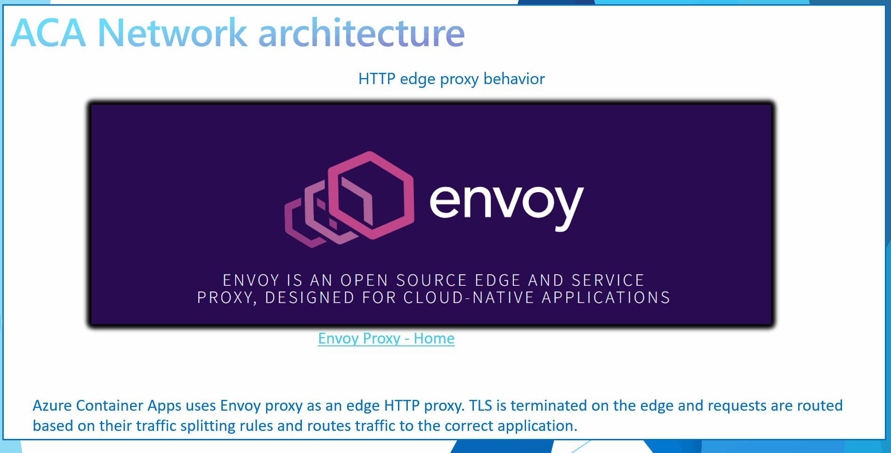

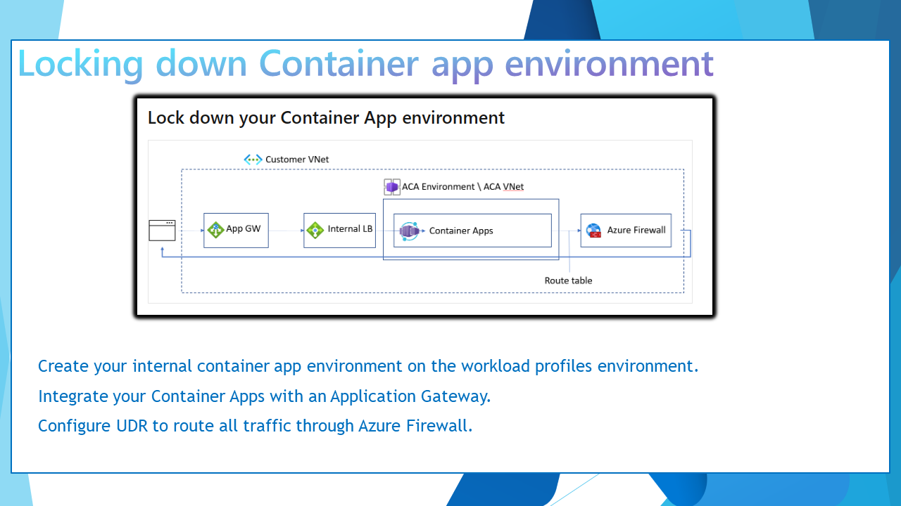

📖 References: 

* [Networking in Azure Container Apps environment](https://learn.microsoft.com/azure/container-apps/networking?tabs=workload-profiles-env%2Cazure-cli&WT.mc_id=AZ-MVP-5004796)
* [From Chaos to Clarity: Simplifying Your Networking with Azure Container Apps](https://techcommunity.microsoft.com/t5/startups-at-microsoft/from-chaos-to-clarity-simplifying-your-networking-with-azure/ba-p/4034625?WT.mc_id=AZ-MVP-5004796)
* [User defined routes (UDR)](https://learn.microsoft.com/azure/container-apps/networking?tabs=consumption-only-env%2Cazure-cli&WT.mc_id=AZ-MVP-5004796#user-defined-routes-udr)

### 💾 Storage

A container app has access to different types of storage. A single app can take advantage of more than one type of storage if necessary.

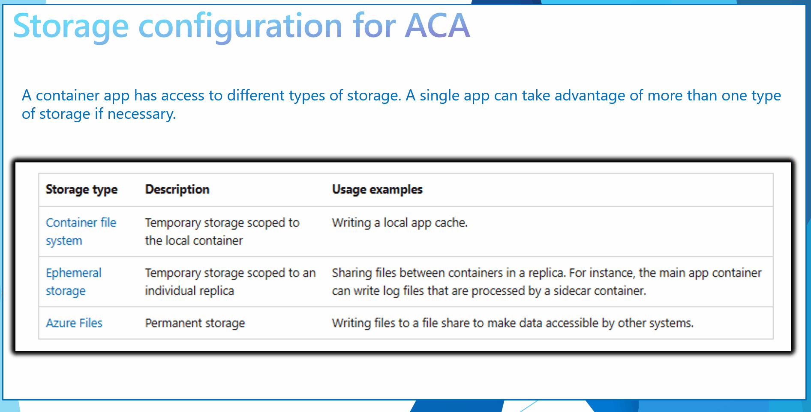

📖 References: 

* [Use storage mounts in Azure Container Apps](https://learn.microsoft.com/azure/container-apps/storage-mounts?pivots=azure-cli&WT.mc_id=AZ-MVP-5004796)

### 👀 Observability

Azure Container Apps provides several built-in observability features that together give you a holistic view of your container app’s health throughout its application lifecycle

These features help in monitoring and diagnosing the state of the application to improve performance and respond to trends and critical problems.

### Application lifecycle observability

 Phase | Features | Description |
| --- | --- | --- |
| Development and Test | Log streaming, Container console | Real-time access to containers' application logs and console for debugging issues |
| Deployment | Azure Monitor metrics, Azure Monitor alerts, Azure Monitor Log Analytics | Continuous monitoring after deployment for identifying problems around error rates, performance, and resource consumption |
| Maintenance | Azure Monitor metrics, Azure Monitor alerts, Azure Monitor Log Analytics | Manages updates to your container app by creating revisions. Allows running multiple revisions concurrently for blue green deployments or A/B testing. Helps in monitoring applications across revisions |

### 🏡 Azure Landing Zone for Container Apps

Last but not least, now that we have investigated and examined some of the finer points of Azure Container Apps, we need somewhere to put it. Following the Enterprise Scale landing zone approach, the Well-architected and Ready phase of the Cloud Adoption Framework has an Application Landing zone reference architecture for Azure Container Apps.

Azure landing zone accelerators provide architectural guidance, reference architectures, reference implementations, and automation to deploy workload platforms on Azure at scale. They are aligned with industry proven practices, such as those presented in [Azure landing zones guidance](https://learn.microsoft.com/azure/cloud-adoption-framework/ready/landing-zone/?WT.mc_id=AZ-MVP-5004796) in the Cloud Adoption Framework.

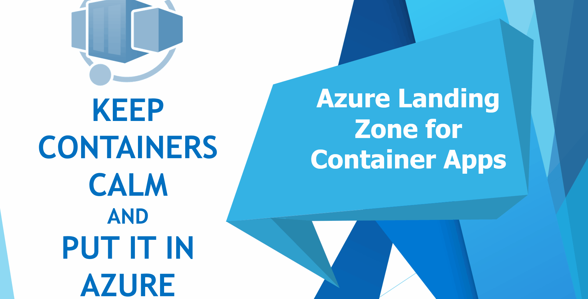

This reference architecture can be found on GitHub directly: [Azure/aca-landing-zone-accelerator](https://aka.ms/aca-lza).

Thank you for sticking with me until the end! I hope you found this article useful. As usual, feel free to reach out to me on social media if there's anything you want covered that I may have missed, if you have any queries, or if you want me to cover anything else.

**[Get started with Azure Container Apps today](https://learn.microsoft.com/azure/container-apps/overview?WT.mc_id=AZ-MVP-5004796)!**
