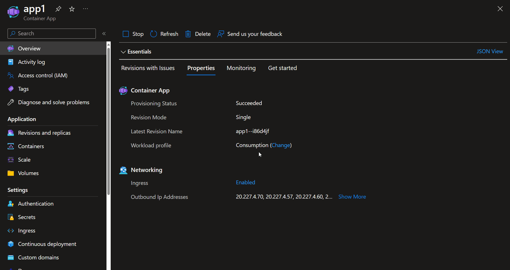
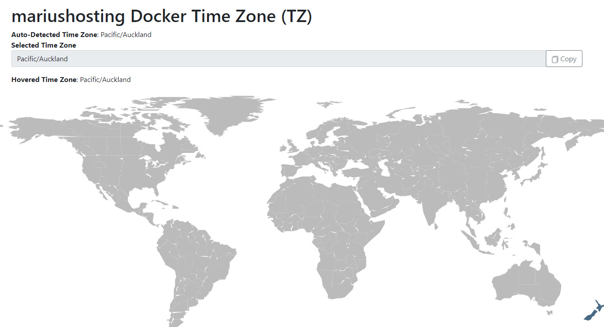

Updating the timezone of your Azure Container Apps containers might not be a common operation, but there are scenarios where it could be necessary.

<!-- truncate -->

Example scenarios on why you may want to update the Timezone (from UTC) to another timezone may be because of the following:

* Application requirements
* Logging and debugging concerns
* Compliance and regulations
Or general application testing and development

You could have this built into the container itself, which would be preferred to keep a consistent experience and to work with any time offset that may be needed (daylight savings, etc), but you can update the container environment.

📺 To demo this, I am using a Container App Environment and a Container App using the 'Simple hello world container' quickstart image.

My revision mode is set to Single; however, the same steps can be applied with multiple revision modes. Just ensure you test and update the right revision or the date change may not be applied.

To update the timezone, we will be the 'TZ' Environment variable, and this change will trigger a new Revision.

First, let us check the current timezone of the container app by running the following command *(on a running Container App)* from the Console:

```PowerShell
    date
```



This will return the current date and time in UTC.

Now, let us update the Timezone. To do that, we need to specify the timezone in the TZ database format; to find this format, we can use sites like [Wikipedia](https://en.wikipedia.org/wiki/List_of_tz_database_time_zones) or [mariushosting Docker Time Zone (TZ)](https://timezone.mariushosting.com/), as I am based in New Zealand, I will be using: Pacific/Auckland.



To do this:

:::danger
⚠️ If you're using Single Revision mode: This may trigger an outage, during the creation of a new revision, make sure you test this in a safe environment.
:::

1. **Navigate** to your **Container App** in the Azure Portal
2. Click on **Containers**
3. Click **Edit and Deploy**
4. Click your **Container image**
5. Navigate down to **Environment variables**
6. **Add**: **TZ** with the value of your **timezone** *(Manual Entry, although you could also have this as a Secret in a KeyVault)*.
7. Click **Save**
8. Click **Create** to create your Revision
9. You can then navigate back to the Console and type in Date to confirm the timezone has been updated.


📖 References: 

* [Default timezone in Docker containers](https://support.circleci.com/hc/en-us/articles/115015771347-How-do-I-set-the-timezones-in-Docker-images)
* [How do I change timezone in a docker container?](https://stackoverflow.com/questions/57607381/how-do-i-change-timezone-in-a-docker-container)
