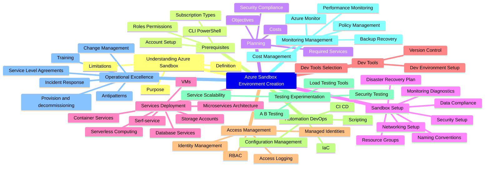

When working with Microsoft Azure, you may want an environment for learning, whether for an individual or a team.

This article aims to highlight some reference implementation considerations for implementing a Sandbox environment within the Microsoft Azure platform.

<!-- truncate -->

When working with Microsoft Azure, you may want an environment for learning, whether for an individual or a team.

Cloud Sandboxes are contained, isolated environments that allow evaluation of new Cloud services and features (without impacting production environments).

:::info
This follows on from a previous article around [Sandbox Design](https://luke.geek.nz/azure/microsoft-azure-sandbox-design-considerations/) considerations, but with a focus on the implementation elements. This article aims to give you some ideas on how you can achieve Sandbox vending.
:::

A design area of the Ready phase of the [Cloud Adoption Framework](https://learn.microsoft.com/azure/cloud-adoption-framework/?WT.mc_id=AZ-MVP-5004796), is the design and implementation of the [Azure Landing Zone](https://learn.microsoft.com/azure/cloud-adoption-framework/ready/landing-zone/?WT.mc_id=AZ-MVP-5004796), it would be asmiss of me not to bring up [Subscription vending](https://learn.microsoft.com/en-us/azure/cloud-adoption-framework/ready/landing-zone/design-area/subscription-vending?WT.mc_id=AZ-MVP-5004796).

> "Subscription vending provides a platform mechanism for programmatically issuing subscriptions to application teams that need to deploy workloads."

Subscription Vending is the foundation, of what we are going to discuss today: Sandbox vending.

I am going to base this article on Unmanaged Sandboxes *(Subscription scoped Sandboxes)* however, alot of the same information can be used across Sandbox types.

## Planning

Before delving into the actual implementation, you need to consider what the Sandbox will look like, by answering questions such as:

| No. | Questions                                                                 | Why it's needed                                                                                                                                       |
|-----|---------------------------------------------------------------------------|-------------------------------------------------------------------------------------------------------------------------------------------------------|
| 1   | What is the purpose you want to use an Azure Sandbox for?                 | To understand the use case and requirements of the sandbox.                                                                                           |
| 2   | What subscription types are available and suitable for our needs?         | To choose the most cost-effective and suitable subscription for the needs.                                                                            |
| 3   | What roles and permissions are needed?                                    | To ensure proper access control and security.                                                                                                         |
| 4   | What Azure services are required for our use case?                        | To identify the necessary services for the sandbox.                                                                                                   |
| 5   | What is our budget for the Azure Sandbox?                                 | To manage costs and ensure the sandbox stays within budget.                                                                                           |
| 6   | What security and compliance measures need to be considered?              | To ensure the sandbox meets all necessary security and compliance requirements.                                                                       |
| 7   | How should we structure our resource groups?                              | To organize resources in a logical and efficient manner.                                                                                              |
| 8   | What naming conventions (if any) should we follow?                        | To maintain consistency and clarity across resources.                                                                                                 |
| 9   | What networking setup is required?                                        | To ensure proper connectivity and security.                                                                                                           |
| 10  | What security measures need to be implemented?                            | To protect the sandbox and its resources from threats.                                                                                                |
| 11  | How do we ensure data compliance?                                         | To meet data protection and privacy requirements.                                                                                                     |
| 12  | What monitoring and diagnostic tools should we use?                       | To maintain visibility into the sandbox's performance and troubleshoot issues.                                                                        |
| 13  | Do we need a disaster recovery plan for the sandbox?                      | To ensure business continuity and data protection in case of a disaster.                                                                              |
| 14  | What development tools are required?                                      | To provide the necessary tools for development within the sandbox.                                                                                    |
| 15  | What version control system will we use?                                  | To manage code changes and collaboration.                                                                                                             |
| 16  | How will we manage identities and access?                                 | To control who has access to the sandbox and what they can do.                                                                                        |
| 17  | How will we implement Role-Based Access Control (RBAC)?                   | To provide fine-grained access control based on roles.                                                                                                |
| 18  | Do we need to use Azure Managed Identities?                               | To manage identities for services in the sandbox.                                                                                                     |
| 19  | How will we log and monitor access?                                       | To track who is accessing what resources and when.                                                                                                    |
| 20  | How will we implement Infrastructure as Code (IaC)?                       | To automate the provisioning and management of resources.                                                                                             |
| 21  | What Continuous Integration/Continuous Deployment (CI/CD) practices will we follow? | To automate the development and deployment process.                                                                                                   |
| 22  | How will we use Azure Monitor?                                            | To monitor the performance and health of the sandbox and its resources.                                                                               |
| 23  | How will we manage costs?                                                 | To ensure the sandbox stays within budget.                                                                                                            |
| 24  | How will we manage policies?                                              | To enforce rules and standards in the sandbox.                                                                                                        |
| 25  | What backup and recovery strategies will we use, if any?                  | To protect data and ensure it can be recovered in case of a loss.                                                                                     |
| 26  | How will we manage changes?                                               | To ensure changes are properly tracked and managed.                                                                                                   |
| 27  | What are our Service Level Agreements (SLAs) or OLA (Organisational Level Agreements)? | To define the level of service expected and how issues will be handled.                                                                               |
| 28  | What training is required for the team?                                   | To ensure the team has the necessary skills and knowledge to use the sandbox effectively.                                                             |
| 29  | How will we handle provision and decommissioning of resources?             | To manage the lifecycle of resources in the sandbox.                                                                                                  |
| 30  | What are the potential antipatterns we should avoid?                       | To avoid common mistakes and pitfalls in sandbox implementation.                                                                                      |

Alot of these are organisational specific, but they are good technical considerations to consider when implementing and designing your Sandbox environment.

## Sandbox Setup
      Resource Groups
      Naming Conventions
      Networking Setup
      Security Setup
      Data Compliance
      Monitoring Diagnostics
      Disaster Recovery Plan
The Sandbox setup, will depend on the outputs of your Planning and requirements, just remember to keep it simple and easy to manage.

A Subscription, or Resource Group per Sandbox consumer.

## Dev Tools
      Dev Tools Selection
      Dev Environment Setup
      Version Control
## Access Management
      Identity Management
      RBAC
      Managed Identities
      Access Logging
## Automation DevOps
      IaC
      CI CD
      Scripting
      Configuration Management
    Testing Experimentation
      Load Testing Tools
      Security Testing
      A B Testing
      Service Scalability
## Monitoring Management
      Azure Monitor
      Cost Management
      Policy Management
      Backup Recovery
      Performance Monitoring
## Operational Excellence
      Incident Response
      Change Management
      Service Level Agreements
      Training
      Provision and decommissioning
      Antipatterns