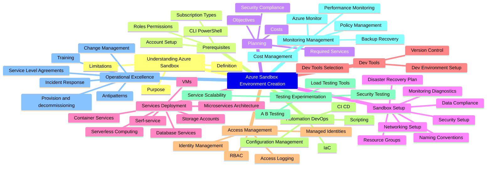

When working with Microsoft Azure, you may want an environment for learning, whether for an individual or a team.

This article aims to highlight some reference implementation considerations for implementing a Sandbox environment within the Microsoft Azure platform.

<!-- truncate -->

When working with Microsoft Azure, you may want an environment for learning, whether for an individual or a team.

Cloud Sandboxes are contained, isolated environments that allow evaluation of new Cloud services and features (without impacting production environments).

:::info
This follows on from a previous article around [Sandbox Design](https://luke.geek.nz/azure/microsoft-azure-sandbox-design-considerations/) considerations, but with a focus on the implementation elements. This article aims to give you some ideas on how you can achieve Sandbox vending.
:::

A design area of the Ready phase of the [Cloud Adoption Framework](https://learn.microsoft.com/azure/cloud-adoption-framework/?WT.mc_id=AZ-MVP-5004796), is the design and implementation of the [Azure Landing Zone](https://learn.microsoft.com/azure/cloud-adoption-framework/ready/landing-zone/?WT.mc_id=AZ-MVP-5004796), it would be asmiss of me not to bring up [Subscription vending](https://learn.microsoft.com/en-us/azure/cloud-adoption-framework/ready/landing-zone/design-area/subscription-vending?WT.mc_id=AZ-MVP-5004796).

> "Subscription vending provides a platform mechanism for programmatically issuing subscriptions to application teams that need to deploy workloads."

Subscription Vending is the foundation, of what we are going to discuss today: Sandbox vending.

I am going to base this article on Unmanaged Sandboxes *(Subscription scoped Sandboxes)* however, alot of the same information can be used across Sandbox types.

