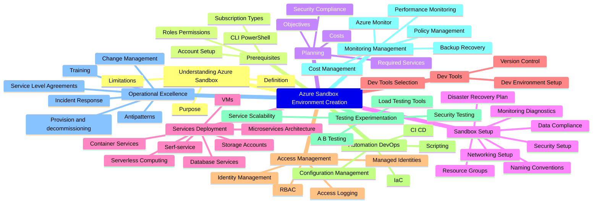

When working with Microsoft Azure, you may want an environment for learning, whether for an individual or a team.

This article aims to highlight some reference implementation considerations for implementing a Sandbox environment within the Microsoft Azure platform.

<!-- truncate -->

When working with Microsoft Azure, you may want an environment for learning, whether for an individual or a team.

Cloud Sandboxes are contained, isolated environments that allow evaluation of new Cloud services and features (without impacting production environments).

:::info
This follows on from a previous article around [Sandbox Design](https://luke.geek.nz/azure/microsoft-azure-sandbox-design-considerations/) considerations, but with a focus on the implementation elements. This article aims to give you some ideas on how you can achieve Sandbox vending.
:::

A design area of the Ready phase of the [Cloud Adoption Framework](https://learn.microsoft.com/azure/cloud-adoption-framework/?WT.mc_id=AZ-MVP-5004796), is the design and implementation of the [Azure Landing Zone](https://learn.microsoft.com/azure/cloud-adoption-framework/ready/landing-zone/?WT.mc_id=AZ-MVP-5004796), it would be asmiss of me not to bring up [Subscription vending](https://learn.microsoft.com/en-us/azure/cloud-adoption-framework/ready/landing-zone/design-area/subscription-vending?WT.mc_id=AZ-MVP-5004796).

> "Subscription vending provides a platform mechanism for programmatically issuing subscriptions to application teams that need to deploy workloads."

Subscription Vending is the foundation, of what we are going to discuss today: Sandbox vending.

I am going to base this article on Unmanaged Sandboxes *(Subscription scoped Sandboxes)* however, alot of the same information can be used across Sandbox types.

## Scenario

The scenario we are going to run through today, is creating an Unmanaged *(ie Subscription scoped)* Sandbox *(Sandbox vending)* per-user or Team, so this could be be a method of impementing it.

To go through this scenario, we will use the the following Disicplines of [Cloud Adoption](https://learn.microsoft.com/azure/cloud-adoption-framework/?WT.mc_id=AZ-MVP-5004796) to help seperate elements.

| Discipline           | Description                                                                                           |
|----------------------|-------------------------------------------------------------------------------------------------------|
| Cost Management      | Cost is a primary concern for cloud users. Develop policies for cost control for all cloud platforms. |
| Security Baseline    | Policies and enforcement apply those requirements across network, data, and asset configurations.     |
| Resource Consistency | Resources can be configured consistently to manage risks related to onboarding, drift, discoverability, and recovery. |
| Identity Baseline    | Identity Baseline discipline focuses on ensuring that identity is consistently applied across cloud adoption efforts. |
| Deployment Acceleration | Centralization, standardization, and consistency in approaches to deployment and configuration improve governance practices. |

## Cost Management

### FinOps

When working with a Sandbox environment, you need to be aware of the costs associated with it. [FinOps principles](https://www.finops.org/framework/principles/) can be key.

[Tags](https://learn.microsoft.com/azure/azure-resource-manager/management/tag-resources?WT.mc_id=AZ-MVP-5004796) can be key, to help you showback/chargeback costs and help you assign resource owners.

Recommended Tags for a Sandbox environment would be:

   "costCenter": "sandbox",
   "costModel": "show-back",
   "environment": "sandbox",
   "resourceowner": "your_name",
   "project": "sandbox_project"

Although the Sandbox environment is for learning, you still need to be aware of the costs associated with it, and keep these as lean as possible.

### Budgets

Implement [Budgets](https://learn.microsoft.com/azure/cost-management-billing/costs/tutorial-acm-create-budgets?tabs=psbudget&WT.mc_id=AZ-MVP-5004796) for each Sandbox, assigned to the Budget.

Monthly resource spend should be forecast initially and amended as the footprint changes. 

Budget alerts are setup to highlight unplanned spend, not to prevent it *(i.e., they are alerting thresholds, not limits)*.

Each Sandbox environment, could start with a consistent Budget, and can be adjusted IF required as an exception.
Budgets are intended to drive Sandbox owners, to keep their costs under control, by having the information on hand.