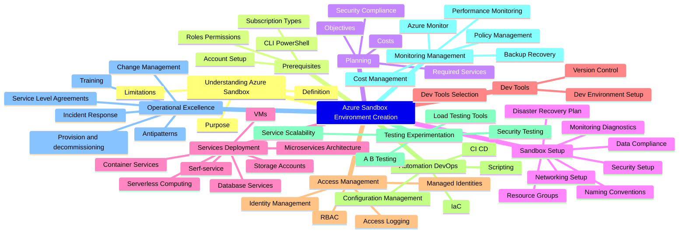
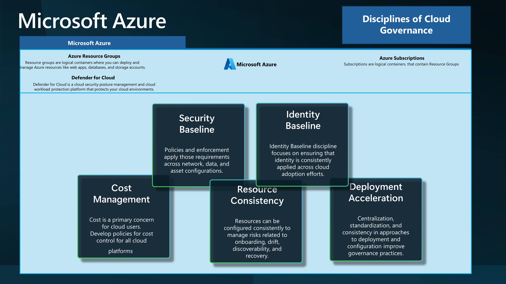

When working with Microsoft Azure, you may want an environment for learning, whether for an individual or a team.

This article aims to highlight some reference implementation considerations for implementing a Sandbox environment within the Microsoft Azure platform.

<!-- truncate -->

When working with Microsoft Azure, you may want an environment for learning, whether for an individual or a team.

Cloud Sandboxes are contained, isolated environments that allow evaluation of new Cloud services and features (without impacting production environments).

:::info
This follows on from a previous article around [Sandbox Design](https://luke.geek.nz/azure/microsoft-azure-sandbox-design-considerations/) considerations, but with a focus on the implementation elements. This article aims to give you some ideas on how you can achieve Sandbox vending.
:::

A design area of the Ready phase of the [Cloud Adoption Framework](https://learn.microsoft.com/azure/cloud-adoption-framework/?WT.mc_id=AZ-MVP-5004796), is the design and implementation of the [Azure Landing Zone](https://learn.microsoft.com/azure/cloud-adoption-framework/ready/landing-zone/?WT.mc_id=AZ-MVP-5004796), it would be asmiss of me not to bring up [Subscription vending](https://learn.microsoft.com/en-us/azure/cloud-adoption-framework/ready/landing-zone/design-area/subscription-vending?WT.mc_id=AZ-MVP-5004796).

> "Subscription vending provides a platform mechanism for programmatically issuing subscriptions to application teams that need to deploy workloads."

Subscription Vending is the foundation, of what we are going to discuss today: Sandbox vending.

I am going to base this article on Unmanaged Sandboxes *(Subscription scoped Sandboxes)* however, alot of the same information can be used across Sandbox types.

## Scenario

The scenario we are going to run through today, is creating an Unmanaged *(ie Subscription scoped)* Sandbox *(Sandbox vending)* per-user or Team, so this could be be a method of impementing it.

To go through this scenario, we will use the the following Disicplines of [Cloud Adoption](https://learn.microsoft.com/azure/cloud-adoption-framework/?WT.mc_id=AZ-MVP-5004796) to help seperate elements.

| Discipline           | Description                                                                                           |
|----------------------|-------------------------------------------------------------------------------------------------------|
| Cost Management      | Cost is a primary concern for cloud users. Develop policies for cost control for all cloud platforms. |
| Security Baseline    | Policies and enforcement apply those requirements across network, data, and asset configurations.     |
| Resource Consistency | Resources can be configured consistently to manage risks related to onboarding, drift, discoverability, and recovery. |
| Identity Baseline    | Identity Baseline discipline focuses on ensuring that identity is consistently applied across cloud adoption efforts. |
| Deployment Acceleration | Centralization, standardization, and consistency in approaches to deployment and configuration improve governance practices. |

## Cost Management

### FinOps

When working with a Sandbox environment, you need to be aware of the costs associated with it. [FinOps principles](https://www.finops.org/framework/principles/) can be key.

[Tags](https://learn.microsoft.com/azure/azure-resource-manager/management/tag-resources?WT.mc_id=AZ-MVP-5004796) can be key, to help you showback/chargeback costs and help you assign resource owners.

Recommended Tags for a Sandbox environment would be:

   "costCenter": "sandbox",
   "costModel": "show-back",
   "environment": "sandbox",
   "resourceowner": "your_name",
   "project": "sandbox_project"

Although the Sandbox environment is for learning, you still need to be aware of the costs associated with it, and keep these as lean as possible.

### Budgets

Implement [Budgets](https://learn.microsoft.com/azure/cost-management-billing/costs/tutorial-acm-create-budgets?tabs=psbudget&WT.mc_id=AZ-MVP-5004796) for each Sandbox, assigned to the Budget.

Monthly resource spend should be forecast initially and amended as the footprint changes. 

Budget alerts are setup to highlight unplanned spend, not to prevent it *(i.e., they are alerting thresholds, not limits)*.

Each Sandbox environment, could start with a consistent Budget, and can be adjusted IF required as an exception.
Budgets are intended to drive Sandbox owners, to keep their costs under control, by having the information on hand.

## Security Baseline

Security is a key concern for any environment, and the Sandbox environment is no different, however there are some tradeoffs - the key to a successful Sandbox environment, is that its an environment for learning, so the level of security you would adopt should be less, however there are some stop gaps that should be implemented.

### Defender for Cloud

[Defender for Cloud](https://learn.microsoft.com/azure/defender-for-cloud/defender-for-cloud-introduction?WT.mc_id=AZ-MVP-5004796) is a cloud-native application protection platform (CNAPP) that is made up of security measures and practices that are designed to protect cloud-based applications from various cyber threats and vulnerabilities.

Defender for Cloud should be enabled on all Sandboxes, to help protect against threats, increasing visibility and is a great learning tool. 

As people learn how to use Azure technologies, they may not necessarily know how to secure them, or how their services might be adapted for a more secure environment. Defender for Cloud helps increases the knowledge around resources, in alignment with [current security best practices](https://learn.microsoft.com/azure/defender-for-cloud/alerts-overview?WT.mc_id=AZ-MVP-5004796).

"While the security team is responsible for improving the security posture, team members might not actually implement security recommendations.
Using governance rules driven by the security team helps you to drive accountability and an SLA around the remediation process."

> [Governance rules](https://learn.microsoft.com/en-us/azure/defender-for-cloud/governance-rules?WT.mc_id=AZ-MVP-5004796) are key.

For example, using Tags, you could assign resource owners to resources, and help drive accountability, alerts and remediation. Defender for Cloud, can be a great learning tool, by informing your Sandbox users of potential security issues.

### Azure Policy

[Azure Policy](https://learn.microsoft.com/azure/governance/policy/overview?WT.mc_id=AZ-MVP-5004796) is a service in Azure that you use to create, assign, and manage policies. These policies enforce different rules and effects over your resources, so those resources stay compliant with your corporate standards and service level agreements.

:::tip
Hightly recommend you deploy your Policies and initiatives using [Azure Enterprise Policy as Code](https://azure.github.io/enterprise-azure-policy-as-code/).
:::

There are tradeoffs, with the type of Azure policies you deploy in a Sandbox environment, vs what you would deploy in your Production, or even Dev/Test environment, recommeded policies as a base that I would recommend are:

Reference: [ALZ policies](https://github.com/Azure/Enterprise-Scale/blob/main/docs/wiki/ALZ-Policies.md)

| Assignment Name                                                | Definition Name                                                | Policy Type                         | Description                                                                                                                                                                                            | Effect(s)         |
| -------------------------------------------------------------- | -------------------------------------------------------------- | ----------------------------------- | ------------------------------------------------------------------------------------------------------------------------------------------------------------------------------------------------------ | ----------------- |
| **Enforce ALZ Sandbox Guardrails** | **Enforce policies in the Sandbox Landing Zone** | `Policy Definition Set`, **Custom** | This initiative will help enforce and govern subscriptions that are placed within the Sandobx Management Group. Policies included: <ul><li>Deny vNET peering across subscriptions<li>Deny the deployment of vWAN/ER/VPN gateways.</ul>                                                                              | Enforce              |

| Assignment Name                                                | Definition Name                                                | Policy Type                         | Description                                                                                                                                                                                            | Effect(s)         |
| -------------------------------------------------------------- | -------------------------------------------------------------- | ----------------------------------- | ------------------------------------------------------------------------------------------------------------------------------------------------------------------------------------------------------ | ----------------- |
| **Enforce ALZ Decommissioned Guardrails** | **Enforce policies in the Decommissioned Landing Zone** | `Policy Definition Set`, **Custom** | This initiative will help enforce and govern subscriptions that are placed within the decommissioned Management Group as part of your Subscription decommissioning process.  Policies included: <ul><li>Deny the deployment of new resources<li>Deploy an auto VM shutdown policy at UTC 00:00</ul>                                                                           | Enforce              |

The Decommissioned Management group, is where you would move your Sandbox subscriptions, once they are no longer required, and you want to decommission them.

Key policies are part of the ALZ Sandbox Guardrails, essentially the policies to restrit the deployment of network resources, that would allow you to link virtual networks to on-premises, peer to other virtual networks that would allow Sandbox users to connect to prodution virtual networks, or virtual networks outside of your organization controls.

## Resource Consistency

Resource Consistency is key, to ensure that resources are configured consistently to manage risks related to onboarding, drift, discoverability, and recovery.

