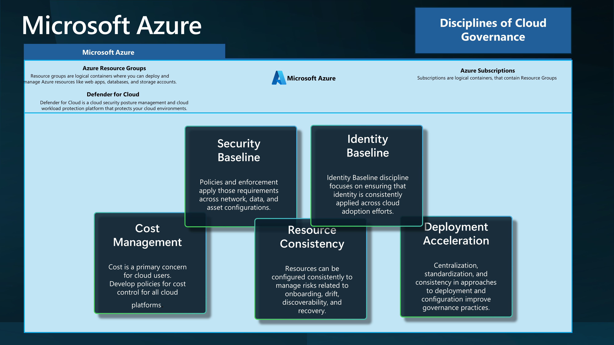
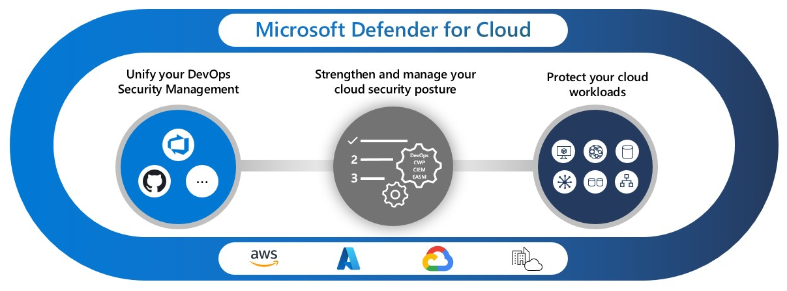

When working with Microsoft Azure, you may want an environment for learning, whether for an individual or a team.

This article aims to highlight some reference implementation considerations for implementing a Sandbox environment within the Microsoft Azure platform.

<!-- truncate -->

When working with Microsoft Azure, you may want an environment for learning, whether for an individual or a team.

Cloud Sandboxes are contained, isolated environments that allow the evaluation of new Cloud services and features (without impacting production environments).

:::info
This follows on from a previous article around [Sandbox Design](https://luke.geek.nz/azure/microsoft-azure-sandbox-design-considerations/) considerations, but with a focus on the implementation elements. This article aims to give you some ideas on how you can achieve Sandbox vending, and is opiniated based on my experience, however its purely intended to show one *(of many)* possible ways, just make sure you understand the business requirements of what you need to achieve. 
:::

A design area of the Ready phase of the [Cloud Adoption Framework](https://learn.microsoft.com/azure/cloud-adoption-framework/?WT.mc_id=AZ-MVP-5004796), is the design and implementation of the [Azure Landing Zone](https://learn.microsoft.com/azure/cloud-adoption-framework/ready/landing-zone/?WT.mc_id=AZ-MVP-5004796), it would be asmiss of me not to bring up [Subscription vending](https://learn.microsoft.com/en-us/azure/cloud-adoption-framework/ready/landing-zone/design-area/subscription-vending?WT.mc_id=AZ-MVP-5004796).

> "Subscription vending provides a platform mechanism for programmatically issuing subscriptions to application teams that need to deploy workloads."

Subscription Vending is the foundation of what we are going to discuss today: Sandbox vending.

I will base this article on Unmanaged Sandboxes *(Subscription scoped Sandboxes)*; however, a lot of the same information can be used across Sandbox types.


## Scenario

The scenario we are going to run through today is creating an Unmanaged *(i.e., Subscription scoped)* Sandbox *(Sandbox vending)* per-user or Team, so this could be a method of implementing it.


To go through this scenario, we will use the the following Disicplines of [Cloud Adoption](https://learn.microsoft.com/azure/cloud-adoption-framework/?WT.mc_id=AZ-MVP-5004796) to help seperate elements.



| Discipline           | Description                                                                                           |
|----------------------|-------------------------------------------------------------------------------------------------------|
| Cost Management      | Cost is a primary concern for cloud users. Develop policies for cost control for all cloud platforms. |
| Security Baseline    | Policies and enforcement apply those requirements across network, data, and asset configurations.     |
| Resource Consistency | Resources can be configured consistently to manage risks related to onboarding, drift, discoverability, and recovery. |
| Identity Baseline    | Identity Baseline discipline focuses on ensuring that identity is consistently applied across cloud adoption efforts. |
| Deployment Acceleration | Centralization, standardization, and consistency in approaches to deployment and configuration improve governance practices. |

## Cost Management

### FinOps

When working with a Sandbox environment, you need to be aware of the costs associated with it. [FinOps principles](https://www.finops.org/framework/principles/) can be key.

[Tags](https://learn.microsoft.com/azure/azure-resource-manager/management/tag-resources?WT.mc_id=AZ-MVP-5004796) can be key, to help you showback/chargeback costs and help you assign resource owners.

Recommended Tags for a Sandbox environment would be:

   "costCenter": "sandbox",
   "costModel": "show-back",
   "environment": "sandbox",
   "resourceowner": "your_name",
   "project": "sandbox_project"

Although the Sandbox environment is for learning, you still need to be aware of the costs associated with it, and keep these as lean as possible.

You can also implement Cost Management and Governance workbooks, that allow Sandbox users, access to interactive dashboards, that can help them understand their costs and usage.

See:

* [Governance workbook](https://microsoft.github.io/finops-toolkit/governance-workbook) - Monitor the governance posture of your Azure environment. Leverage recommendations to address compliance issues.
* [Cost optimization workbook](https://microsoft.github.io/finops-toolkit/optimization-workbook) - Give your engineers a single pane of glass for cost optimization with this handy Azure Monitor workbook.


### Budgets

Implement [Budgets](https://learn.microsoft.com/azure/cost-management-billing/costs/tutorial-acm-create-budgets?tabs=psbudget&WT.mc_id=AZ-MVP-5004796) for each Sandbox, assigned to the Budget.

Monthly resource spending should be forecast initially and amended as the footprint changes. 

Budget alerts are set up to highlight unplanned spending, not to prevent it *(i.e., they are alerting thresholds, not limits)*.

Each Sandbox environment could start with a consistent Budget and can be adjusted IF required as an exception.
Budgets are intended to drive Sandbox owners to keep their costs under control by having the information on hand.

## Security Baseline

Security is a key concern for any environment, and the Sandbox environment is no different; however, there are some tradeoffs. The key to a successful Sandbox environment is that it's an environment for learning, so the level of security you would adopt should be less. However, there are some stop gaps that should be implemented.

### Defender for Cloud

[Defender for Cloud](https://learn.microsoft.com/azure/defender-for-cloud/defender-for-cloud-introduction?WT.mc_id=AZ-MVP-5004796) is a cloud-native application protection platform (CNAPP) that is made up of security measures and practices that are designed to protect cloud-based applications from various cyber threats and vulnerabilities.



Defender for Cloud should be enabled on all Sandboxes to help protect against threats and increase visibility. It is a great learning tool. 

As people learn how to use Azure technologies, they may not necessarily know how to secure them or how their services might be adapted for a more secure environment. Defender for Cloud helps increase the knowledge around resources in alignment with [current security best practices](https://learn.microsoft.com/azure/defender-for-cloud/alerts-overview?WT.mc_id=AZ-MVP-5004796).

"While the security team is responsible for improving the security posture, team members might not actually implement security recommendations.
Using governance rules driven by the security team helps you to drive accountability and an SLA around the remediation process."

> [Governance rules](https://learn.microsoft.com/en-us/azure/defender-for-cloud/governance-rules?WT.mc_id=AZ-MVP-5004796) are key.

For example, using Tags, you could assign resource owners to resources and help drive accountability, alerts, and remediation. Defender for Cloud, can be a great learning tool, by informing your Sandbox users of potential security issues.

### Azure Policy

[Azure Policy](https://learn.microsoft.com/azure/governance/policy/overview?WT.mc_id=AZ-MVP-5004796) is a service in Azure that you use to create, assign, and manage policies. These policies enforce different rules and effects over your resources so those resources stay compliant with your corporate standards and service level agreements.

:::tip
I highly recommend that you deploy your policies and initiatives using [Azure Enterprise Policy as Code](https://azure.github.io/enterprise-azure-policy-as-code/).
:::

There are tradeoffs with the type of Azure policies you deploy in a Sandbox environment vs what you would deploy in your Production or even Dev/Test environment; recommended policies as a base that I would recommend are:

Reference: [ALZ policies](https://github.com/Azure/Enterprise-Scale/blob/main/docs/wiki/ALZ-Policies.md)

| Assignment Name                                                | Definition Name                                                | Policy Type                         | Description                                                                                                                                                                                            | Effect(s)         |
| -------------------------------------------------------------- | -------------------------------------------------------------- | ----------------------------------- | ------------------------------------------------------------------------------------------------------------------------------------------------------------------------------------------------------ | ----------------- |
| **Enforce ALZ Sandbox Guardrails** | **Enforce policies in the Sandbox Landing Zone** | `Policy Definition Set,` **Custom** | This initiative will help enforce and govern subscriptions that are placed within the Sandbox Management Group. Policies included: <ul><li>Deny vNET peering across subscriptions<li>Deny the deployment of vWAN/ER/VPN gateways.</ul>                                                                              | Enforce              |

| Assignment Name                                                | Definition Name                                                | Policy Type                         | Description                                                                                                                                                                                            | Effect(s)         |
| -------------------------------------------------------------- | -------------------------------------------------------------- | ----------------------------------- | ------------------------------------------------------------------------------------------------------------------------------------------------------------------------------------------------------ | ----------------- |
| **Enforce ALZ Decommissioned Guardrails** | **Enforce policies in the Decommissioned Landing Zone** | `Policy Definition Set,` **Custom** | This initiative will help enforce and govern subscriptions that are placed within the decommissioned Management Group as part of your Subscription decommissioning process.  Policies included: <ul><li>Deny the deployment of new resources<li>Deploy an auto VM shutdown policy at UTC 00:00</ul>                                                                           | Enforce              |

The Decommissioned Management group is where you would move your Sandbox subscriptions once they are no longer required and you want to decommission them.


Key policies are part of the ALZ Sandbox Guardrails, essentially the policies to restrict the deployment of network resources. These policies would allow you to link virtual networks to on-premises, peer to other virtual networks, and allow Sandbox users to connect to production virtual networks or virtual networks outside of the control of your organization.

### Terms of use

Make sure you don't forget about the People/Process of your Sandbox sandbox, you should implement a Terms of Use for the Sandbox environment, so that users understand the rules and regulations of the environment, such as 'Do not store Production data' in the Sandbox environment.

You can combine this directly into the Azure Portal login experience, by using [Microsoft Entra terms of use](https://learn.microsoft.com/en-us/entra/identity/conditional-access/terms-of-use?WT.mc_id=AZ-MVP-5004796).


## Resource Consistency

Resource Consistency is key. It ensures that resources are configured consistently to manage risks related to onboarding, drift, discoverability, and recovery.

This is where a lot of automation comes into play to prevent drift and inconsistencies with the creation *(and decommission)* of a Sandbox environment.


Ideally you would have a user interface, where a user could request a Sandbox environment *(I will talk more about this in the deployment acceleration section)*, and this would trigger an Azure DevOps pipeline or GitHub action, as an example - to create the environment.

Using Infrastructure as Code *(IaC)*, you can ensure that the environment is consistent, repeatalbe, and can be provisioned and decommissioned.

### Enterprise Policy as Code

[Enterprise Policy as Code or EPAC](https://learn.microsoft.com/azure/cloud-adoption-framework/ready/policy-management/enterprise-policy-as-code?WT.mc_id=AZ-MVP-5004796) for short comprises a number of scripts which can be used in CI/CD based system or a semi-automated use to deploy Policies, Policy Sets, Assignments, Policy Exemptions and Role Assignments.

This is a solution, created by Microsoft employees, however without Microsoft official support, as an open-source initiative.

EPAC is designed for organizations with a large number of Policies, Policy Sets and Assignments. It is also designed for organizations with multiple tenants and/or environments, the solution primary consists of PowerShell scripts, intended to run operations such as policy planning, deployment and sync of external policies, such as Enterprise Landing Zone policies into the EPAC repo.

Enterprise Policy as Code can also be used to control exemptions as well, an example is running this nightly, and any policies or exemptions not in the repository are removed.

Enterprise Policy as Code could be used for Sandbox environments, as an opportunity to cleanup the current outdated policies, assignments and exemptions and keep it consistent.


Feel free to refer a blog post, I did previously on [Enterprise Policy as Code, with Azure DevOps](https://luke.geek.nz/azure/enterprise-policy-code-azure-devops/).

### Azure DevOps/GitHub

[Azure DevOps](https://azure.microsoft.com/products/devops?WT.mc_id=AZ-MVP-5004796) or [GitHub](https://github.com/), both offer features, such as Boards/Discussions, Code Repos, Pipelines *(or Actions)* which can be used as a platform, for IaC *(Infrastructure as Code)* and CI/CD *(Continous Integration and Continous Deployment)*, and is defintely recommended to be factored in your Sandbox design, when it comes to automation and desired state of your Sandbox environment.

Any following automation recommendations, going to assume you have access to Azure DevOps or GitHub *(or similar)*.

### Symphony

A large part of the Sandbox vending is a DevOps pipeline, and connectivity to Azure, that allows the Terraform and pipeline sin Azure DevOps to connect to make changes in Azure, where Terraform is the car, Symphony is the road that it travels on.

[Symphony](https://github.com/microsoft/symphony) is a framework and set of patterns and best practices for developing, testing, and deploying infrastructure on Azure using Infrastructure as Code *(IAC)* It includes modern DevOps practices for IAC such as Main and Pull Request workflows, IaC Code Validation & Linting, Automated Testing, Security Scanning, Multi-environment deployments, modules dependencies and more. A mature workflow for IAC not only automates the deployment of the IAC resources but also incorporates engineering fundamentals, resources validation, dependency management, test execution, security scanning, and more.

The Syphony pipelines for Azure DevOps and Terraform for example are:

| Pipeline Name                        | Comments                                                                                                                                                                                                                                                                                                                                                                                                             |
| ------------------------------------ | -------------------------------------------------------------------------------------------------------------------------------------------------------------------------------------------------------------------------------------------------------------------------------------------------------------------------------------------------------------------------------------------------------------------- |
| pipeline.ci.terraform.yml            | This YAML file defines a Continuous Integration (CI) pipeline for Azure DevOps, which triggers on changes to the main branch, sets up certain variables, and executes several stages including validation of configuration and preview deployment using Terraform templates. This file is the command file, triggering the other pipelines.                                                                          |
| pipeline.destroy.terraform.yml       | This YAML file defines a pipeline in Azure DevOps that uses a specific agent image to run a job based on a template for destroying a Terraform environment, with the environment details and key vault information passed as parameters. The pipeline does not trigger automatically on any branch or pull request changes.                                                                                          |
| template.terraform.previewdeploy.yml | This YAML file defines a job in an Azure DevOps pipeline that sets up a clean workspace, installs Terraform and Go, retrieves secrets from an Azure Key Vault, updates network rules and storage account settings, and executes a Terraform plan and apply operation. It also cleans up by removing the agent IP from the Key Vault and denying public access to the Terraform DevOps Storage after the job is done. |
| template.terraform.report.yml        | This YAML file defines a job in an Azure DevOps pipeline that, depending on a condition, cleans the workspace, retrieves secrets from an Azure Key Vault, and executes a bash script to backup the state files of a specified environment using Terraform.                                                                                                                                                           |
| template.terraform.test.yml          | This YAML file defines an end-to-end test job in an Azure DevOps pipeline that sets up a clean workspace, installs Terraform and Go, retrieves secrets from an Azure Key Vault, adds the agent IP to the Key Vault and storage account, runs tests, publishes the test results, and finally removes the agent IP from the Key Vault and storage account.                                                             |
| template.terraform.validate.yml      | This YAML file defines a validation job in an Azure DevOps pipeline that sets up a clean workspace, installs necessary tools, runs GitLeaks for code analysis, adds the agent IP to a Key Vault, runs Terraform lint and validate, optionally runs layer tests, publishes test results, and finally removes the agent IP from the Key Vault and denies public access to the Terraform DevOps Storage.                |

Using a framework, such as Symphony gives you a good starting point for your deployments.


### Terraform

Bicep and Terraform are both tools used for infrastructure-as-code (IaC), which means they allow you to define and manage your cloud infrastructure using code. Both are declarative, meaning you define the desired state of your infrastructure, and the tool figures out how to make it so. Bicep is more Microsoft Azure focused, while Terraform is more multi-cloud focused.

For this article, I am going to focus on Terraform, based purely on work done with this around Sandbox provisining and decommissioning, and the Terraform state file, helping with alot of the Sandbox decomissioning aspect.

Terraform modules that can be used during Sandbox provisioning are:

| Name                     | Link                                                                                                                                           |
| ------------------------ | ---------------------------------------------------------------------------------------------------------------------------------------------- |
| azuread                  | [https://registry.terraform.io/providers/hashicorp/azuread/latest](https://registry.terraform.io/providers/hashicorp/azuread/latest)           |
| azurerm                  | [https://registry.terraform.io/providers/hashicorp/azurerm/latest](https://registry.terraform.io/providers/hashicorp/azurerm/latest)           |
| random                   | [https://registry.terraform.io/providers/hashicorp/random/latest](https://registry.terraform.io/providers/hashicorp/random/latest)             |
| time                     | [https://registry.terraform.io/providers/hashicorp/time/latest](https://registry.terraform.io/providers/hashicorp/time/latest)                 |
| Azure/lz-vending/azurerm | [https://registry.terraform.io/modules/Azure/lz-vending/azurerm/latest](https://registry.terraform.io/modules/Azure/lz-vending/azurerm/latest) |

The real foundation of Sandbox vending, is the [Azure/terraform-azurerm-lz-vending](https://github.com/Azure/terraform-azurerm-lz-vending) Terraform module.

It can be used  to create Azure resources according to the landing zone *(Sandbox)* vending pattern. It can be used to provision resources such as subscriptions, management group associations, role assignments, and virtual networks.

Heres an example of how you could use the module, by having multiple YAML files per Sandbox, and using a for_each loop to create each Sanbox environment:

```hcl
# This module is used to create resources in Azure according to the landing zone vending pattern.

module "lz_vending" {
  # The source and version of the module.
  source  = "Azure/lz-vending/azurerm"
  version = "4.0.2"

  # The for_each loop allows us to create multiple instances of this module, one for each item in the landing_zone_data_map.
  for_each = local.landing_zone_data_map

  # The location where the resources will be created.
  location = var.location

  # Subscription variables.
  # Enables the resource provider creation
  subscription_register_resource_providers_enabled = true
  # The map of resource providers to register.
  subscription_register_resource_providers_and_features = var.subscription_register_resource_providers_and_features
  # Enables the creation of a subscription alias.
  subscription_alias_enabled = true
  # The billing scope for the subscription.
  subscription_billing_scope = "/providers/Microsoft.Billing/billingAccounts/0000000/enrollmentAccounts/${each.value.billing_enrollment_account}"
  # The display name for the subscription. It is converted to lowercase to maintain consistency.
  subscription_display_name = ("SUB-Contoso-${each.value.name}_${var.env}-001")
  # The alias name for the subscription. It is also converted to lowercase.
  subscription_alias_name = ("SUB-Contoso${each.value.name}_${var.env}-001")
  # The workload type for the subscription.
  subscription_workload = each.value.workload

  # Management group association variables.
  # Enables the association of the subscription with a management group.
  subscription_management_group_association_enabled = true
  # The ID of the management group to associate with the subscription.
  subscription_management_group_id = each.value.management_group_id
  # Tags to apply to the subscription. The Owner tags are set to the owner of the workload.
  subscription_tags = merge(
    var.tags,
    {
      "resource-owner" = each.value.owner,
      "expiry_date"    = each.value.expiry_date
    },


  )

  # Role assignment variables.

  role_assignment_enabled = true

  role_assignments = {
    # using role definition name, created at subscription scope
    contrib_user_sub = {
      principal_id   = azuread_group.contributor[each.key].id
      definition     = "Contributor"
      relative_scope = ""
    },

  }
  # Virtual network variables.
  # Enables the creation of a virtual network.
  virtual_network_enabled = true
  # Enables the creation of a network watcher resource group.
  network_watcher_resource_group_enabled = true
  # The details of the virtual network to create.
  virtual_networks = {

    one = {
      # The name of the virtual network. It is converted to lowercase.
      name                        = lower("vnet-${var.env}-${each.value.name}")
      resource_group_lock_enabled = false

      # The address space for the virtual network.
      address_space = ["192.168.1.0/24"]
      # The name of the resource group where the virtual network will be created. It is converted to lowercase.
      resource_group_name = lower("rg-contoso-networks-${var.env}-aue-001")
      # The location where the virtual network will be created.
      location = var.location
    
    }

  }

}
```

This will create a Subscription, Resource Group and define Contributor access, based on data from a data map, that looks at each YAML file in a folder.

"for_each = local.landing_zone_data_map" - This is the key part, as it allows you to create multiple instances of the module, one for each item in the landing_zone_data_map.

```hcl
locals {
  # landing_zone_data_dir is the directory containing the YAML files for the landing zones.
  # It is set to the root directory of the current Terraform project.
  landing_zone_data_dir = path.root
  # landing_zone_data_map is a map that stores the decoded YAML data from each landing zone file.
  # It uses a for loop to iterate over each file in the landing_zone_files list.
  # For each file, it reads the contents of the file using the file function and decodes the YAML data using the yamldecode function.
  # The file path is constructed by concatenating the landing_zone_data_dir and the file name.
  # The decoded YAML data is then stored in the landing_zone_data_map with the file name as the key.
  landing_zone_data_map = {
    for f in local.landing_zone_files :
    f => yamldecode(file("${local.landing_zone_data_dir}/${f}"))
  }
  # landing_zone_files is the list of landing zone YAML files to be processed.
  # It uses the fileset function to find all files in the landing_zone_data_dir that match the pattern "landing_zone_*.yaml".
  landing_zone_files = fileset(local.landing_zone_data_dir, "sbx_landing_zone_*.yaml")
}
```

Heres an example YAML file:

```yaml
name: SandboxOwner1  # Name of the landing zone. No spaces.
workload: DevTest  # Type of subscription for the landing zone (DevTest vs Production (PAY AS YOU GO)). Most Sandboxes will be Production (Pay As You Go), unless all users have a Visual Studio Enterprise subscription.
owner: admin@contoso.com  # Owner of the landing zone
billing_enrollment_account: 123456  # Billing enrollment account for the landing zone. Limit of 5000 API requests for new subscriptions. Later Subscriptions may need a new billing enrollment.
management_group_id: Unmanaged-Sandbox  # Management group ID for the landing zone
budget_amount: 1000  # Budget amount for the landing zone, numerical value
expiry_date: 2024-10-16  # The date when the landing zone will expire, default should be 3 months from date of provisioning. After this date, resources may be automatically cleaned up.
cost-centre: Contoso (Cloud)  # Cost center for the landing zone
cost-model: show-back  # Cost model for the landing zone
```

This is a very basic example, but it gives you an idea of how you could use the module to create a Subscription, Resource Group and define Contributor access, based on data from a data map, that looks at each YAML file in a folder. The Expiry date is used as part of the Sandbox decomissioning process, and also added as a Tag to the Subscription, along with the Owner, which can also be used as an email receipient of a Budget.

There is a [limit](https://learn.microsoft.com/azure/cost-management-billing/manage/programmatically-create-subscription-enterprise-agreement?tabs=rest&WT.mc_id=AZ-MVP-5004796#limitations-of-azure-enterprise-subscription-creation-api) to the number of API requests you can make to create a new subscription, so you may need to create a new billing enrollment account, if you hit this limit, which is why its included in the yaml.

Using this method you can create a new Sandbox environment, by creating a new YAML file, and running the Terraform apply command, and decomissioning the environment, by removing the YAML file, and running the Terraform apply command again.

For the decomissioning, you can run a seperate pipeline, to check the expiry of the YAML file, then delete it, if its past its due-=date, which could then trigger the removal.

## Identity Baseline

To connect to your Sandbox environment, you need to ensure that you have the correct Identity Baseline in place.

I recommend you merge your Sandbox identity access, ie Entra ID Groups, Access packages etc into your IaC pipelines, so that access is granted automatically, when a new Sandbox environment is created, then removed when not required anymore.

### Entitlement Management

[Entitlement management](https://learn.microsoft.com/en-us/entra/id-governance/entitlement-management-overview?WT.mc_id=AZ-MVP-5004796) is an identity governance feature that enables organizations to manage identity and access lifecycle at scale, by automating access request workflows, access assignments, reviews, and expiration.


### Access packages

With an access package, an administrator or delegated access package manager lists the resources (groups, apps, and sites), and the roles the users need for those resources.
Access packages also include one or more policies. A policy defines the rules or guardrails for assignment to access package. Each policy can be used to ensure that only the appropriate users are able to have access assignments, and the access is time-limited and will expire if not renewed.


You can use Access packages to grant access to your Sandbox environment, and then remove access, when the environment is no longer required. 

Access Packages can be used to delegate access to each Sandbox environment, to the owner of the Sandbox environment, allowing Sandbox owners, who may have financial delegation to control who has access to their environment, and remove that access when no longer required.

### Conditional Access

Make sure you factor Conditional Access into your Sandbox design, by making sure that only the users who may be using compliant devices, or from trusted networks can access the environment. 

## Deployment Acceleration

### Onboarding

Onboarding of a new Sandbox environment, could be automated from start to end, using a self-service portal. An example is:

A [PowerApp](https://learn.microsoft.com/power-apps/powerapps-overview?WT.mc_id=AZ-MVP-5004796) that allows a user to request a new Sandbox environment, by filling in a form, that then triggers a [PowerAutomate](https://learn.microsoft.com/power-automate/?WT.mc_id=AZ-MVP-5004796) flow, to gain approval, and then creates a new YAML file, in a folder, that then triggers a Terraform apply command, to create the new Sandbox environment.

