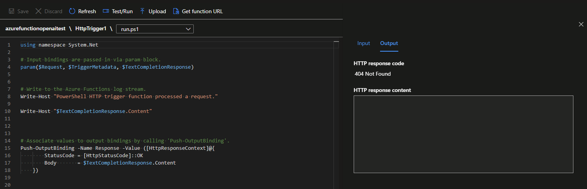
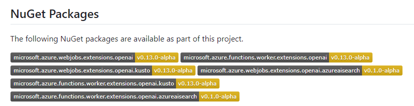
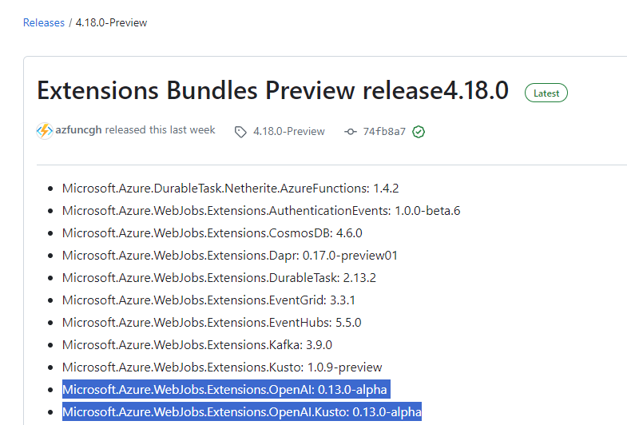
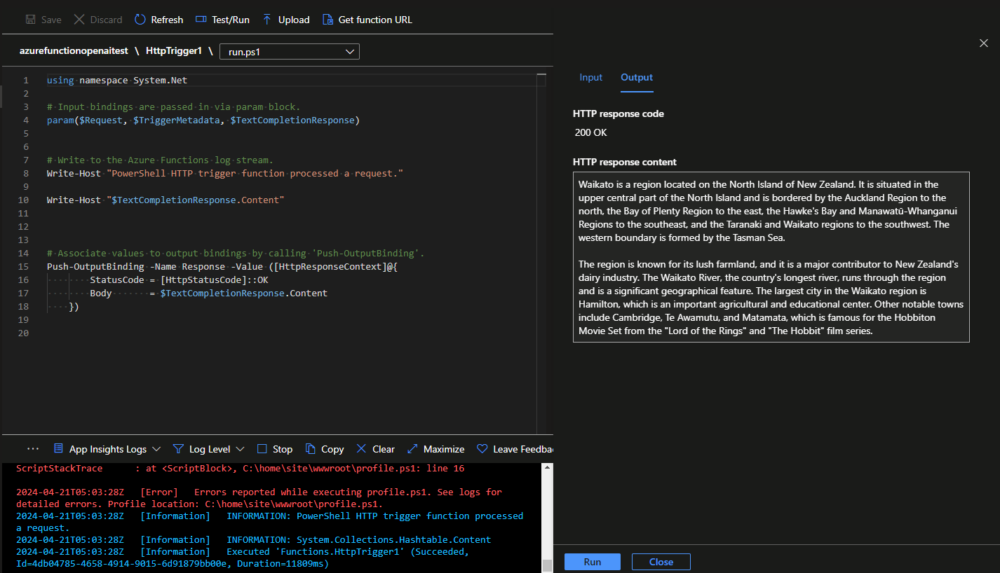

When attempting to work with [Azure Open AI](https://learn.microsoft.com/azure/ai-services/openai/overview?WT.mc_id=AZ-MVP-5004796), you may want to work with an [Azure Functions](https://learn.microsoft.com/azure/azure-functions/functions-overview?pivots=programming-language-csharp&WT.mc_id=AZ-MVP-5004796) to adjust or massage the response, to do so you can use the [Azure Functions bindings for OpenAI's GPT engine
](https://github.com/Azure/azure-functions-openai-extension) to query the OpenAI API. However, you may encounter a 404 Not Found error when attempting to query OpenAI using the Azure Function binding. 



<!-- truncate -->

If you encounter this error, it could be likely that you are using the Azure Function ExtensionBundle, which does not contain the necessary dependencies to query the OpenAI API. 

The binding requires at least the following:

* Microsoft.Azure.WebJobs.Extensions.OpenAI: 0.12.0-alpha
* Microsoft.Azure.WebJobs.Extensions.OpenAI.Kusto: 0.12.0-alpha



:::error
The binding type(s) 'textCompletion' were not found in the configured extension bundle. Please ensure the correct version of the extension bundle is configured.
:::

Both packages are not integrated into the [4.13.2](https://github.com/Azure/azure-functions-extension-bundles/releases/tag/4.13.2) version of the ExtensionBundle, which, at the time of writing, is not available in the production ExtensionBundle shipped with new Azure Functions *(which is 4.13.2)*. 

**However**, it is integrated into the Extension Bundle Preview. For example, Extension Bundle Preview for [4.18.0](https://github.com/Azure/azure-functions-extension-bundles/releases/tag/4.18.0-Preview) features:

* Microsoft.Azure.WebJobs.Extensions.OpenAI: 0.13.0-alpha
* Microsoft.Azure.WebJobs.Extensions.OpenAI.Kusto: 0.13.0-alpha



🔧 To use the latest Preview Bundle and enable the OpenAI binding extension, you need to update your function apps: host.json file:

```json
{
  "version": "2.0",
  "managedDependency": {
    "Enabled": true
  },
   "extensionBundle": {
        "id": "Microsoft.Azure.Functions.ExtensionBundle.Preview",
        "version": "[4.*, 5.0.0)"
    }
}
```

Update the id of `Microsoft.Azure.Functions.ExtensionBundle.Preview` and the version to `[4.*, 5.0.0)` in accordance with the latest [bundle releases](https://github.com/Azure/azure-functions-extension-bundles/releases) to ensure you are using the latest Preview Bundle. The wildcard `*` will ensure you use the latest Extension Bundle Preview version within that major release.

You should now be able to query the OpenAI API using the Azure Function binding.


