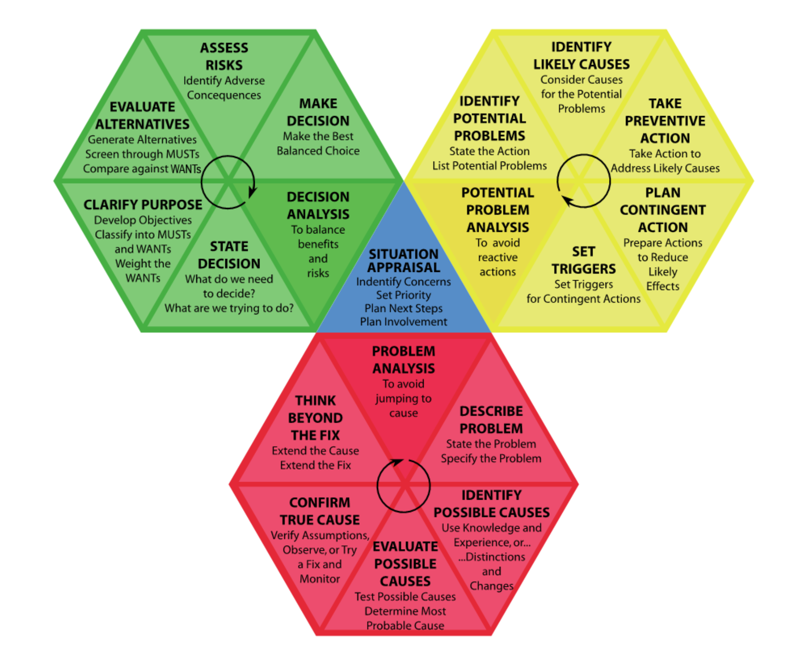
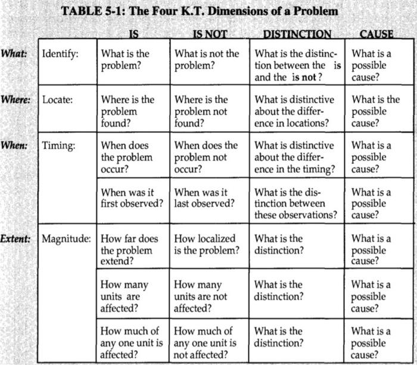

Troubleshooting Azure Open AI and API calls to OpenAI can be challenging, especially when you may not know where to start!

The idea of this article is to give you not only a place to start with some common scenarios you may run into but also a way of thinking - to help you troubleshoot. This is not a technical 'get-your-hands dirty, delve into those logs' type article.

I am a big fan of the KT, or [Kepner-Tregoe](https://kepner-tregoe.com/) problem analysis methodology, and I have used it in many scenarios throughout my career to help discover and test the root cause of various problems. So, we will use the base of this problem analysis methodology to help us troubleshoot the scenarios we will discuss in this article.

<!-- truncate -->

## ❓ The Kepner-Tregoe (KT) 

:::info
The Kepner-Tregoe (KT) Problem Management methodology incorporates elements such as:

* "Is" *(what we know to be true about the problem)*
* "Is Not" *(what we know to be false or different from the problem)*
* "Could Be" *(possible causes)*
* "Could Not Be" *(what is not a possible cause)*
* "Distinctive Clarity" *(what sets this problem apart from others)*

and "Next Steps" *(actions to further diagnose or solve the problem)*
:::

You may find that with some issues, we instinctively do a lot of this. Still, this method helps, gives you context, allows you to check any bias you may have in trying to find the root cause, and gives you some great tools to rule out and test any theories, given it has been a few years since I have been through the formal training. Still, it's one of those methodologies that have stuck with me, and I always keep it in mind when troubleshooting issues. Obviously, you can use this methodology for more than just troubleshooting OpenAI issues; this is the scenario we are going to cover today.

> The key to successful troubleshooting, if any IT *(Information Technology)* issue - is having a clear problem statement, and in the 'real world' really concentrating on the one single problem statement to remain effective for this article; however, we will be covering a mix of common scenarios problems, to help give you high-level ideas and context when troubleshooting issues.

## ❗ Problem Statements

Today, we are going to look at the following statements:

| Type of Problem Statement | Problem Statement |  
|---------------------------|-------------------|  
| Chunking Control | "Inconsistent accuracy during high-volume transactions suggests that the chunking process is not fully controlled. The problem manifests where API consumption occurs and is especially prominent when handling complex inputs of varying sizes." |  
| Token Limit Checks | "Unexpected API call failures, which are confirmed to occur before the API request is made, indicate that the token limit pre-check may not be accurately estimating token sizes, particularly at the time of calling and in cases of complex requests." |  
| Region Usage | "Increased latency and occasional service disruptions are observed in a specific default region during peak usage times, suggesting that network latency or regional service performance may not be optimized for the workload, impacting certain regions more than others." |  
| Model Versioning | "Encoding and performance issues have arisen across all API endpoints following model or API updates, which are more pronounced in certain versions, indicating that using outdated model versions or incompatibilities between model versions and API might be the underlying cause." |  
| Streaming Response | "User experience issues with the streaming implementation on the front-end application during real-time interactions suggest that there might be backend streaming service limitations or insufficient front-end optimization, affecting certain user interactions." |  
| Token Volume Expectancy | "The system occasionally experiences overload or underperformance across all API endpoints during 24/7 operation, implying that token volume expectancy might not be accurately predicted or that the system's scaling and load balancing are not adequately configured." |  
| Logging Practices | "Issues in diagnostic effectiveness within the logging system arise during error occurrences, which may be due to incomplete logging data or incorrect logging configurations, affecting the resolution of problems by not capturing comprehensive data." |  
| API Versioning | "Persisting aborted issues and doubts regarding production readiness after using a preview API version suggest that stability might be compromised due to the continued use of a less stable preview version rather than the GA version across the API service." |  

## 🎯 IS and Is Nots

Let's look at each problem and work out various Is and Nots and potential causes at a high level.

| Troubleshooting Criteria       | Is (What is True)                        | Is Not (What is False)                  | Could Be (Possible Causes)                       | Could Not Be (What is not a cause) | Distinctive Clarity (What sets this apart)             | Next Steps                                             |  
|--------------------------------|------------------------------------------|-----------------------------------------|--------------------------------------------------|------------------------------------|--------------------------------------------------------|--------------------------------------------------------|  
| Control of Chunking            | Chunking process is implemented          | Perfect control over chunking           | Inadequate chunk size management                 | A problem with the API itself      | How chunking affects the accuracy of responses         | [Evaluate and refine the semantic chunking process](https://learn.microsoft.com/azure/search/vector-search-how-to-chunk-documents?WT.mc_id=AZ-MVP-5004796)       |  
| Token Limit Check              | Pre-call token limit check is in place   | Always under the token limit            | Misestimation of token size                      | A network connectivity issue       | Instances when token limits are exceeded               | [Implement stricter checks and alerts for token limits](https://techcommunity.microsoft.com/t5/fasttrack-for-azure/strategies-for-optimizing-high-volume-token-usage-with-azure/ba-p/4007751?WT.mc_id=AZ-MVP-5004796)   |  
| Region Selection               | Using a specific default region          | Region is the cause of all issues       | Network latency or regional service disruption   | Model versioning issues           | The impact of region selection on response times       | [Test performance in different regions; consider geo-redundancy](https://learn.microsoft.com/azure/ai-services/openai/quotas-limits?WT.mc_id=AZ-MVP-5004796#regional-quota-limits) |  
| Model Version                  | Using a specified model version          | All versions have the same performance  | Outdated model causing issues                    | A problem with user input          | Differences in encoding and performance between versions | [Upgrade to the latest GA or recommended version of the model](https://learn.microsoft.com/azure/ai-services/openai/how-to/working-with-models?tabs=powershell&WT.mc_id=AZ-MVP-5004796) |  
| Streaming Response             | Streaming is being used                  | Streaming is flawless                   | Streaming implementation affecting user experience | Token limit issues                | User experience with streaming vs. non-streaming responses | [Optimize streaming experience based on user feedback](https://github.com/microsoft/semantic-kernel/blob/main/python/notebooks/11-streaming-completions.ipynb)   |  
| Token Volume                   | Expected volume is known                 | The system can handle any volume        | Insufficient API rate limiting or scaling        | An issue with the model's capabilities | Peak token volume times or patterns                   | [Plan for scaling and load balancing based on expected volume](https://techcommunity.microsoft.com/t5/fasttrack-for-azure/smart-load-balancing-for-openai-endpoints-and-azure-api/ba-p/3991616?WT.mc_id=AZ-MVP-5004796) |  
| Logging                        | Logging practices are in place           | All necessary data is being logged      | Incomplete or incorrect logging                  | An issue with the model's accuracy | The level of detail and usefulness of logs            | [Enhance logging for better diagnostics and problem resolution](https://learn.microsoft.com/azure/architecture/ai-ml/openai/architecture/log-monitor-azure-openai?WT.mc_id=AZ-MVP-5004796) |  
| API Version                    | Currently using a non-GA API version     | GA version has been tested              | Use of preview API versions causing issues       | An issue unrelated to the API version | The stability and features of GA vs. preview API versions | [Test and migrate to the GA version of the API](https://learn.microsoft.com/azure/ai-services/openai/reference?WT.mc_id=AZ-MVP-5004796)          |  
| System Message Control         | System messages are being used           | Full control over system messages       | System message limits not being respected by the model | An issue with the API call structure | How system messages guide user interactions          | [Ensure system message limits are enforced and informative](https://learn.microsoft.com/azure/ai-services/openai/concepts/system-message?WT.mc_id=AZ-MVP-5004796) |  
| System Message Compliance      | Checks for model adherence to system messages | The model always adheres to system message limits | Oversights in system message enforcement       | An issue with user expectations     | Instances of non-compliance impacting user experience | [Regularly verify model compliance with system message limits](https://www.microsoft.com/en-us/security/blog/2024/02/22/announcing-microsofts-open-automation-framework-to-red-team-generative-ai-systems?WT.mc_id=AZ-MVP-5004796) |  
| Hallucinations and Accuracy    | Occurrences of hallucinations and inaccuracies | The model is always accurate          | Model training or complexity of queries          | An issue with the input data quality | Specific scenarios where inaccuracies are more frequent | [Investigate model choice and implement LLM OPS for evaluation](https://semaphoreci.com/blog/openai-models) |  
| Request and Timeout Issues     | Experiencing request or timeout issues   | All requests are processed promptly | High server load, inadequate resources, or network latency | Complete system failure            | Frequency and conditions of timeouts and request failures | [Analyze server and network logs, monitor system performance, and optimize configuration](https://learn.microsoft.com/en-us/azure/ai-services/openai/how-to/latency?WT.mc_id=AZ-MVP-5004796) |  

Although this is a very theoretical article, hopefully, it points you in the right direction and *thinking* when needing to troubleshoot your issues with Azure OpenAI. As a Consultant or Engineer, it can be very quick to jump straight into solutions without fully knowing the extent of the issue or the problem you are actually trying to solve.

## 🔗 References

* [Azure Open AI](https://learn.microsoft.com/azure/ai-services/openai/overview?WT.mc_id=AZ-MVP-5004796)
* [Azure OpenAI Service frequently asked questions](https://learn.microsoft.com/azure/ai-services/openai/faq?WT.mc_id=AZ-MVP-5004796)
* [Kepner-Tregoe](https://kepner-tregoe.com/)
* [OpenAI Tokenizier](https://platform.openai.com/tokenizer)
* [What's new in Azure OpenAI Service](https://learn.microsoft.com/azure/ai-services/openai/whats-new?WT.mc_id=AZ-MVP-5004796)
