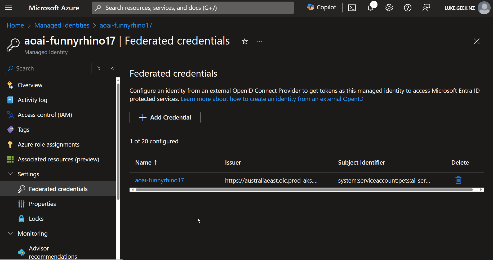

Workloads deployed on an Azure Kubernetes Services (AKS) cluster require Microsoft Entra application credentials or managed identities to access Microsoft Entra-protected resources, such as Azure Key Vault and Microsoft Graph. Microsoft Entra Workload ID integrates with the capabilities native to Kubernetes to federate with external identity providers.

Let's look at how that might be set up for Managed Identity for AKS (Azure Kubernetes Service) in Azure.


<!-- truncate -->

:::tip
There is a lot of detail around identity, federated identity, and workload identity that I won't be going into today.

If this is something you want to dig into, I recommend the following:

* [Use Microsoft Entra Workload ID with Azure Kubernetes Service (AKS)](https://learn.microsoft.com/en-us/azure/aks/workload-identity-overview?tabs=dotnet&WT.mc_id=AZ-MVP-5004796)
* [Create an OpenID Connect provider on Azure Kubernetes Service (AKS)](https://learn.microsoft.com/azure/aks/use-oidc-issuer?WT.mc_id=AZ-MVP-5004796)
* [AKS Workload Identity - Quick Tutorial](https://www.youtube.com/watch?v=i2GobU0Wg48)
:::

So, let us look at adding a Federated Credential to a User Assigned Managed identity.

Click on **Settings** and **Federated credentials**

We will look at one I set up earlier. How this is used is application-specific, but in this example, the Federated credentials are used by an AI Service running on an AKS cluster to talk to an Azure OpenAI instance that the User Assigned Managed identity has access to.



:::warning
It is worth knowing that to use Federated Credentials and open the OIC APIs on your cluster, you will need to either create a new cluster or update it. The OIC APIs are not open by default on the cluster. See [Create an OpenID Connect provider on Azure Kubernetes Service (AKS)](https://learn.microsoft.com/en-us/azure/aks/use-oidc-issuer?WT.mc_id=AZ-MVP-5004796) for more information.
:::

First up is:

**Cluster Issue URL**, in my example, I have:
  
  ```plaintext
  https://australiaeast.oic.prod-aks.azure.com/00000000-0000-0000-0000-000000000000/00000000-0000-0000-0000-000000000000/
  ```
  So what is this? This is the URL of the OpenID Connect provider with which the AKS cluster is federating. It is also the URL that the AKS cluster will use to authenticate the User Assigned Managed identity.

  To get the URL, you can use the Azure CLI and run the following query:

  ```bash
  az aks show -n myAKScluster -g myResourceGroup --query "oidcIssuerProfile.issuerUrl" -otsv
  ```
  
To test that it is responding and open, you can navigate to the URL discovery endpoint '/openid/v1/jwks', for example:

https://australiaeast.oic.prod-aks.azure.com/00000000-0000-0000-0000-000000000000/00000000-0000-0000-0000-000000000000/openid/v1/jwks

You will get an HTTP response back similar to the following:

  ```plaintext
{
  "keys": [
    {
      "use": "sig",
      "kty": "RSA",
      "kid": "4gZVAbix5cXrHnMF9D6rp-EOpB92gfamRWVG873e9s5",
      "alg": "RS256",
      "n": "wCZChNTi7ymXkmLeMP95PUl-9b2Fnzm1xLlslLw4Cc_1oMVbvNUbJS6r4_bgylTYSowUCqQLZUPH_DClav4aJC-G3OYlCkQrG3wFnB7b70Q8qJrwsVr2XaYh8lwfah_BceiDEJNc2yjjEBQoHs3zbi3qOVhYp3_BYHVoXuBJnhEgMb5bpxzgN-ZrM2QwmLzLSv9BB_iq034B3P0Exn8n0yWvXPFe_pWPzwyC_l4dgMN_TpNMLjaBYoJ-wdfim7eEJuOgVfuV1O8smMeXhUNUoRKOvFNw9H2qjZM243JhVBnLX1C7Oj_8L2AW7wSptuThl-gIqy9nrcSPT_oHhVUwAgO-gwFCRSgilFiBhsG9-wkflSdELeJCRpLi1j_8OOON0LTX6vZrHjwGzGa0bC5zgouKCFE1iNtVc3HoNKczZL-wiERUIgo8YKey_uOdeOtdBPOLVO0igfN4xtDZnxb_CzSUJ3fJHGAg03k3MBEpr0KAMmhsTSo-KUqfcgnclHkOywGdwnX-oT43SvcItEDbUiKyFV-i0CabAVebzF4O6r_ovpK4N2QJ-4s8_bHx4d3RMstML1D_yEpy40PeFjQq5ZPQQt1AUfkT1jP5-siCdJgm8HTc0zIPwfZfwKdKefYMRmamNHwk3TNV9gdOX0fnKP07R9FBKCgypqeDcLYZYgMt",
      "e": "AQAB"
    },
    {
      "use": "sig",
      "kty": "RSA",
      "kid": "wQ4TGh1obxJ6l8nxEiV-hf-lccLnJwXxx7Rw8E-UDBo",
      "alg": "RS256",
      "n": "ydxfJlP6Qmh_dfkhWkrGQrrad-o0ShvZCShIUz4-k8bhH98xAhSgC52EmXnbCvkbDxHpwQIZ8GQHFGjbFC-Z-ZbdIpETd-MVwp70HXyoejuFNmdghTeLZaN5Q-lf1U8gjnxfzUo5tL_Vwcd1RhGi3YXwQmiEGJoZ5ZWhQs75O8iAnvyOzDqWt0CxraIAVPoY9aJ1IBTPlA0bIdDtuCTiynCMQiozO4dx72BDMjJ3ZcEwKrFZBFAu71SPr4xs7ErUYqZFtZxmcDxKkhTNCPd9dUkmo6uknMuVSHj5OqeXexDdKhZKcJhTFBGF89oWtIjx0ix9G8VTqTJsDZp3_LBcs6Ob0hpfyaGePhibZTqhDXD_Nr3p-yw78lXO0ceD1xz8ZJyY4EzxtY2yobAGGNsg_wU23XJsIkJLOGiCAjRg81PxbtlEPzClXkxbrZTjKI9OVJxujGxt01PmgiLN38piThL3zsvGF_4N-ApX1fpdKH9Owl2xsmVd-zzzoJ1l8y9FKZpgnJKQ-VECIbVNwzO6KEm2f7O6MKpqB5hLi-QPH-ZLk3zbi_55zb8h1PZxmuam4rS3MHi98IxxmVz8fbMVirosQhzP7oYuM-L1ZgZLzwKvDenmoUYIfzwUl6QCsM3DxZs_07sxUrZk0isNvBHU3wXKsCtSXJyf0CJyq6TAYCD1",
      "e": "AQAB"
    }
  ]
}
  ```

However, for the Federated credential configuration for AKS, the OIC URL from the Azure CLI `az aks show` command is enough.

Second is the **Namespace**. This is the Namespace in which the User Assigned Managed identity will be used. In my example, I have 'pets' as this is my Application namespace. Be as specific as you can.

In Kubernetes, a namespace organizes and isolates resources within a cluster. It acts as a virtual cluster within the main cluster. Namespaces allow you to group related objects (such as pods, services, and deployments) together and provide a scope for resource names.

Third is the **Service Account**. This Service Account will be linked to the Federated credential inside of AKS.

A service account is an identity used by pods (containers) running within a namespace to authenticate with other services or APIs. Each namespace can have multiple service accounts, and they are associated with specific permissions. When a pod is created, it can be assigned a service account. The pod then uses the credentials associated with that service account to access other resources (e.g., secrets, APIs). Service accounts are useful for controlling access and ensuring that pods have the appropriate permissions.

That leaves the **Subject identifier**. This is the Subject identifier.

In AKS Federated credentials, the subject identifier refers to the identity the managed identity will trust. When using workload identity, the subject identifier is typically the service account associated with a pod. The subject identifier establishes trust between the managed identity (related to the AKS cluster) and the service account (associated with the pod). Once this trust is established, the managed identity can securely use the service account’s credentials to access other Azure services.

Namespaces provide isolation, service accounts represent identities for pods, and subject identifiers (usually service accounts) are used in federated credentials to establish trust between the managed identity and Kubernetes workloads.

Under the Credentials details, we have **Name** and **Audience**.

The **name** refers to the identifier associated with a managed identity or service principal in Azure. In AKS (Azure Kubernetes Service), when configuring federated credentials using managed identities, you create a managed identity (or use an existing one) to represent your AKS cluster. This managed identity is assigned a unique name, which is used to identify it within Entra ID. For example, creating a managed identity named “my-aks-cluster-identity” becomes the name associated with the identity.

The **audience** (also known as the “aud” claim) is a critical part of security tokens (such as JWTs) issued by Azure AD. In the context of AKS federated credentials, the audience represents the intended recipient of the token. When a pod in AKS requests an access token (e.g., to access Azure Key Vault secrets), the audience is set to the specific Azure resource (e.g., Key Vault) the pod wants to access. The audience ensures that the token is valid only for the specified resource. For example, if a pod seeks to access a secret stored in Azure Key Vault, the audience in the token will be set to the Key Vault’s endpoint.

The `api://AzureADTokenExchange` audience is typically used when a service needs to obtain a token to act on behalf of a user or another service. For example:

- A user logs in to a web application (front-end), and the application needs to call an API (back-end) on behalf of the user. The front-end application requests an on-behalf-of token with the `api://AzureADTokenExchange` audience.
- A service (acting as a middle-tier) receives an access token from a client and needs to call another downstream service.

*(e.g., a database or an API)*. It exchanges the token for an on-behalf-of token using the same audience.

The api://AzureADTokenExchange audience is used explicitly for token exchange scenarios, allowing services to obtain tokens on behalf of users or other services.

Name: The unique identifier for a managed identity or service principal.
Audience: The intended recipient (Azure resource) for the security token.
