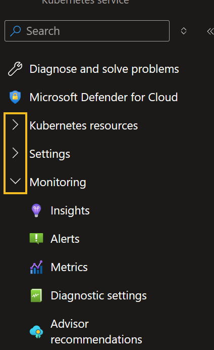
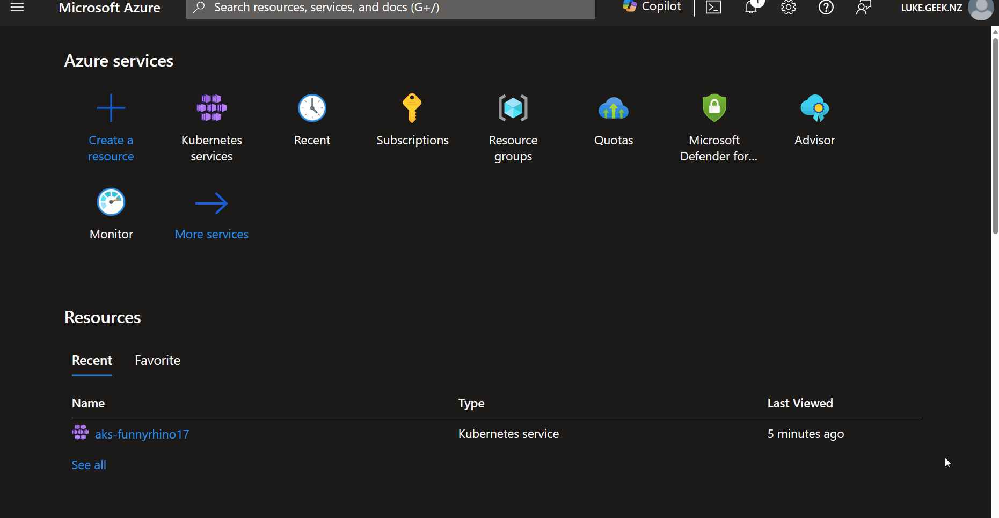

There have been some changes to the Azure Portal that have people scratching their heads; I am talking about the infamous collapsable Blade menu.

<!-- truncate -->

I actually like it because it gives the flexibility to hide areas that you may be potentially distracted by, especially as more and more service functionality is brought into the Azure Portal. However, a concern I have is not being able to see new services or options offered in the blade of a service, so for that reason alone, at the moment, I have configured my Azure Portal to have the Blade menu always open.

You can do this fairly easily per user: click on Settings *(top right)*, click Appearance + Startup views, select Expanded Service menu behavior, and then click Apply.

