Today, we are going to look at deploying a large language model *(LLM)* directly into your AKS *(Azure Kubernetes Service)* cluster, running on GPU-enabled nodes, using [Kaito *(Kubernetes AI Toolchain Operator)*](https://github.com/Azure/kaito).

> KAITO is an open-source operator that transforms how you deploy AI models on Kubernetes. It streamlines the process, automating critical tasks like infrastructure provisioning and resource optimization. It intelligently selects the optimal hardware configuration for your specific model, using available CPU and GPU resources on AKS. KAITO eliminates the manual setup complexities, accelerating your deployment time and reducing associated costs.

<!-- truncate -->

## 👀 Overview

:::info
[Kaito](https://github.com/Azure/kaito) is an operator that automates the deployment of the AI/ML inference model in a Kubernetes cluster. The target models are popular open-sourced inference models such as Falcon and llama2. Kaito has the following critical differentiations compared to most of the mainstream model deployment methodologies built on top of virtual machine infrastructures:

* Manage large model files using container images. An HTTP server is provided to perform inference calls using the model library.
* Avoid tuning deployment parameters to fit GPU hardware by providing preset configurations.
* Auto-provision GPU nodes based on model requirements.
* Host large model images in the public Microsoft Container Registry (MCR) if the license allows.

Kaito follows the classic Kubernetes Custom Resource Definition(CRD)/controller design pattern. The user manages a workspace custom resource that describes the GPU requirements and the inference specification. Kaito controllers automate the deployment by reconciling the workspace custom resource.


* Workspace controller: It reconciles the workspace custom resource, creates machine custom resources to trigger node auto-provisioning, and creates the inference workload (deployment or stateful set) based on the model preset configurations.
* Node provisioner controller: The controller's name is gpu-provisioner in [Kaito helm chart](https://github.com/Azure/kaito/tree/main/charts/kaito/gpu-provisioner). It uses the machine CRD originated from Karpenter to interact with the workspace controller. It integrates with Azure Kubernetes Service(AKS) APIs to add new GPU nodes to the AKS cluster. Note that the gpu-provisioner is an open-sourced component. It can be replaced by other controllers if they support Karpenter-core APIs.

> At the time of this article, [Kaito is in preview](https://azure.microsoft.com/updates/public-preview-kubernetes-ai-toolchain-operator-kaito-addon-for-aks/?WT.mc_id=AZ-MVP-5004796) and **is not recommended for production use**.

There are some significant benefits of running open-source LLMs with Kaito. Some advantages include:

* Automated GPU node provisioning and configuration: Kaito will automatically provision and configure GPU nodes for you. This can help reduce the operational burden of managing GPU nodes, configuring them for Kubernetes, and tuning model deployment parameters to fit GPU profiles.
* Reduced cost: Kaito can help you save money by splitting inferencing across lower-end GPU nodes, which may also be more readily available and cost less than high-end GPU nodes.
* Support for popular open-source LLMs: Kaito offers preset configurations for popular open-source LLMs. This can help you deploy and manage open-source LLMs on AKS and integrate them with your intelligent applications.
* Fine-grained control: You can fully control data security and privacy, model development and configuration transparency, and fine-tune the model to fit your specific use case.
* Network and data security: You can ensure these models are ring-fenced within your organization's network, and the data never leaves the Kubernetes cluster.
:::

:::warning
A word of warning: when looking at running your model in your own AKS cluster, be aware of the [AI Shared responsibility model](https://learn.microsoft.com/en-us/azure/security/fundamentals/shared-responsibility-ai?WT.mc_id=AZ-MVP-5004796). There is a difference in the Azure AI PaaS *(Platform as a Service)* offerings, i.e., Model safety, compute, versioning, etc. and running your model in your own AKS cluster. So, although the Kaito operator helps you run some SLM models in your AKS cluster, you are responsible for the security, compliance, and governance of the entire system versus consuming a Microsoft-provided model as a service offering.
:::

:::info
If you want to follow the guide and set up Kaito, make sure you have approved [quota](https://learn.microsoft.com/en-us/azure/azure-resource-manager/management/azure-subscription-service-limits?WT.mc_id=AZ-MVP-5004796) in your region for the GPU compute nodes. In this example, I am using a 12 vCPU Standard NCSv3 instance.

You can use the following Azure CLI command to check your use and limit:

~~~bash
az vm list-usage \
  --location ${AZURE_LOCATION} \
  --query "[? contains(localName, 'Standard NCSv3')]" \
  -o table
~~~

You can follow this Microsoft guide for requesting a quota increase: [Request a quota increase](https://learn.microsoft.com/azure/quotas/regional-quota-requests?WT.mc_id=AZ-MVP-5004796).
:::

### 🐶 Example App - Pets

Today, we will use the [aks store demo—Pets](https://github.com/Azure-Samples/aks-store-demo) sample microservices app, commonly used for AKS demos, tutorials, and experiments. We will deploy it to our AKS cluster, update it to use a locally hosted mistral model to generate the local product descriptions, and then call the externally hosted Azure OpenAI endpoint.

> This sample demo app consists of containerized microservices that can be easily deployed into an Azure Kubernetes Service (AKS) cluster. It is meant to show a realistic scenario using a polyglot architecture, event-driven design, and common open-source back-end services *(e.g., RabbitMQ, MongoDB)*. The application also leverages OpenAI's GPT-3 models to generate product descriptions. This can be done using either Azure OpenAI or OpenAI.


The application has the following services: 

| Service | Description |
| --- | --- |
| `makeline-service` | This service handles processing orders from the queue and completing them (Golang) |
| `order-service` | This service is used for placing orders (Javascript) |
| `product-service` | This service is used to perform CRUD operations on products (Rust) |
| `store-front` | Web app for customers to place orders (Vue.js) |
| `store-admin` | Web app used by store employees to view orders in queue and manage products (Vue.js) | 
| `virtual-customer` | Simulates order creation on a scheduled basis (Rust) |
| `virtual-worker` | Simulates order completion on a scheduled basis (Rust) |
| `ai-service` | Optional service for adding generative text and graphics creation (Python) |
| `mongodb` | MongoDB instance for persisted data |
| `rabbitmq` | RabbitMQ for an order queue |

### 🚀 Overview

### 📦 Prerequisites

* [GitHub account](https://github.com/) *(we will use a GitHub Codespace to deploy the App, and requirements)*
* [Azure subscription](https://azure.microsoft.com/en-us/free/open-source?WT.mc_id=AZ-MVP-5004796) *(we will need an Azure subscription, to install the cluster the model to)*
* [Request a quota increase](https://learn.microsoft.com/azure/quotas/regional-quota-requests?WT.mc_id=AZ-MVP-5004796) for a GPU compute workload *(ie Standard NCSv3)* in your region. I am based in New Zealand so that I will be deploying to Australia East.

### 🐝 Deploy AKS cluster

1. Let us deploy our Cluster and application using a pre-created Azure Developer CLI infrastructure as code deployment by connecting to the Codespace *(which already has the dependencies of Azure Developer CLI, Kubectl, Helm, Azure Bicep, and Terraform Azure CLI pre-installed)* at [aks store demo—Pets](https://github.com/Azure-Samples/aks-store-demo).
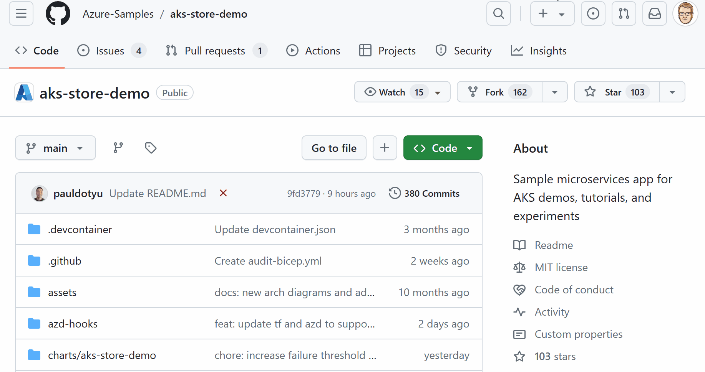
2. Now, we need to prep for the Azure Developer CLI deployment, which will use Terarform (a random pet name module for a unique name) to deploy our AKS cluster in our specified region. So, let's log in to Azure.

```bash
## login to Azure CLI
az login --use-device-code

## login to Azure Developer CLI
azd auth login
```


3. Once logged in, we can configure a new Azure Developer CLI environment in preparation for our deployment.

```bash
azd env new
```

4. Enter an environment name *(i.e., Kaito)*; the Azure Developer CLI uses this to store the environment settings for the deployment and won't reflect any of your deployed resources.
5. Now, we need to set a few environment variables for our deployment, which will be used by the Terraform deployment to deploy the Azure Open AI instance that Pets will use *(and we will replace it with Falcon later on; however, I recommend including it in the deployment to confirm that the OpenAI components are confirmed working first)*.

```bash
azd env set DEPLOY_AZURE_OPENAI true
azd env set DEPLOY_AZURE_WORKLOAD_IDENTITY true
```

To confirm variables, you can run the following:

```bash
azd env get-values
```

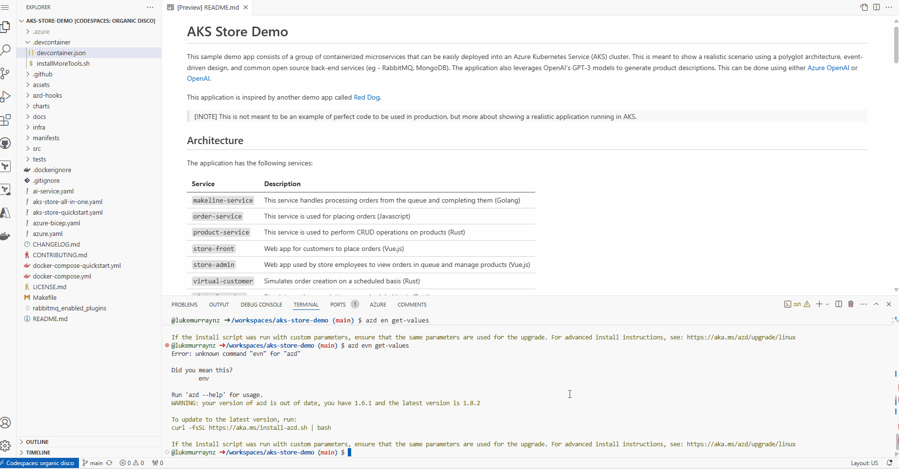

6. Finally, it's time to deploy. Run the following command and select the Subscription you want to deploy the AKS cluster into and the region *(remember this region is the region for which you have requested the GPU quota increase)*.

```bash
azd up
```

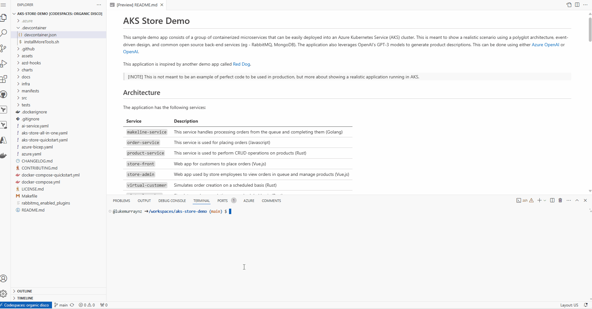

7. Once the deployment is complete, you will see the output (AKS and helm deployments for the PET microservices), including the AKS cluster name, the Azure OpenAI endpoint, and the OIDC issuer URL.

After you have provided the information, the azd up command will start by registering Azure providers and features and installing Azure CLI extensions. From there, it will invoke the terraform apply command and execute "azd-hook" scripts, which is a neat way for you to "hook" into the deployment process and add any customizations. We will invoke a helm install command in our deployment to apply our Kubernetes manifests.

This will take a few minutes to complete. Once it's done, you will see the terraform apply command output and the created resources. You can also view the resources in the Azure portal.

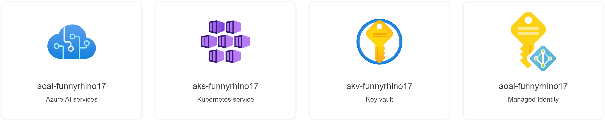

7. Once the deployment is complete, run the following command to load all the AZD environment variables into your shell to be used by the Kaito deployment.

```bash
eval "$(azd env get-values)"
```
## 🧪 Test the Pet-store app

Now, lets test that its working, by taking a look at the pet store admin public endpoint.

1. Open your favorite browser and navigate to the [Azure Portal](https://portal.azure.com/#home)
2. Search for Kubernetes services
3. Find your AKS cluster and click on the resource
4. Click on Services and Ingresses
5. Find the store-admin service and click on the public endpoint to open the store-admin page.
6. You can test the current *(external to the AKS cluster)* Azure OpenAI endpoint by clicking on Products, Add Product, typing in a Keyword, clicking on the "Ask AI Assistant" button, and seeing the generated text.


### 🐦 Implement Kaito and Falcon LLM

Now that the AKS cluster is deployed and the Pets store app is running, we can implement Kaito and run the Falcon 7b-instruct large language model.

> You can continue to set this up in the Codespace; I am going to switch to an [Azure CloudShell](https://learn.microsoft.com/azure/cloud-shell/overview?WT.mc_id=AZ-MVP-5004796) to complete the rest of the implementation, mainly to come at the implementation, from the point of view of installing Kaito in an existing cluster, not related to the Pet store example *(i.e., make sure that there are no variables, etc. that we might be reliant on, without knowing why)*. 

:::info
Researchers from Technology Innovation Institute, Abu Dhabi, introduced the [Falcon series](https://arxiv.org/pdf/2311.16867.pdf), which includes models with 7 billion, 40 billion, and 180 billion parameters. These models, intended to be causal decoder-only models, were trained on a high-quality, varied corpus mostly obtained from online data. Falcon-180B, the largest model in the series, is the only publicly available pretraining run ever, having been trained on a dataset of more than 3.5 trillion text tokens.

The researchers discovered that Falcon-180B shows great advancements over other models, including PaLM or Chinchilla. It outperforms models being developed concurrently, such as LLaMA 2 or Inflection-1. Falcon-180B achieves performance close to PaLM-2-Large, which is noteworthy given its lower pretraining and inference costs. With this ranking, Falcon-180B joins GPT-4 and PaLM-2-Large as the leading language models in the world. For more information, see the following resources:

* [The Falcon Series of Open Language Models](https://arxiv.org/pdf/2311.16867.pdf)
* [Falcon-40B-Instruct](https://huggingface.co/tiiuae/falcon-40b-instruct)
* [Falcon-180B](https://huggingface.co/tiiuae/falcon-180B)
* [Falcon-7B](https://huggingface.co/tiiuae/falcon-7b)
* [Falcon-7B-Instruct](https://github.com/Azure-Samples/aks-kaito-terraform/blob/main/alcon-7B-Instruct)

Reference: [Deploy Kaito on AKS using Terraform](https://techcommunity.microsoft.com/t5/azure-for-isv-and-startups/deploy-kaito-on-aks-using-terraform/ba-p/4108930?WT.mc_id=AZ-MVP-5004796)
:::

1. To do this, we need to make sure that we have the preview version of the AKS CLI extension installed. You can check this by running the following command:

```bash
az extension list --query "[?name=='aks-preview']"
```

If you don't have it, you can install it:

```bash
az extension add --name aks-preview --allow-preview true
```

And if needed, update it:

```bash
az extension update --name aks-preview --allow-preview true
```
2. Re-login to Azure, if needed *(you don't need to login to the Azure Developer CLI; it was only required for previous steps)*. Next, we need to register the AIToolchainProvider resource provider by running the following command:

```bash
az feature register --namespace "Microsoft.ContainerService" --name "AIToolchainOperatorPreview"
```

This will allow the Kaito (AI Toolchain Operator) APIs on your Azure subscription to be deployed into your AKS cluster. It could take a few minutes to register.

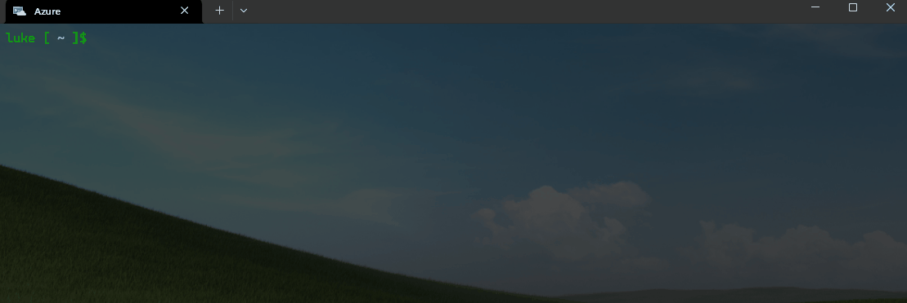

3. Once the registration is complete, we can prepare to deploy the workload identity, workspace, and GPU-enabled node pool for Kaito; as part of this, we need to define the environment variables (if you are still using the Codespace, these should be carried over from the previous deployment; if not, we can set them)*. Adding the variables helps us avoid having to enter the values each time we run a command.

```bash
export AZURE_SUBSCRIPTION_ID="9b06e177-a5bb-468b-9fd6-fc58e5b67239"
export AZURE_RESOURCE_GROUP="rg-funnyrhino17"
export AZURE_LOCATION="australiaeast"
export CLUSTER_NAME="aks-funnyrhino17"
```


4. We are now going to update our AKS cluster to enable the Kaito operator and OpenID Connect issuer *(required to enable connectivity to a Managed identity to create the Node pools)* by running the following command:

```bash
az aks update --name ${CLUSTER_NAME} --resource-group ${AZURE_RESOURCE_GROUP} --enable-oidc-issuer --enable-ai-toolchain-operator
```


5. Once updated, we can then connect directly to the cluster using the Kubernetes command line tool, Kubectl, by running the following command:

```bash
az aks get-credentials --resource-group ${AZURE_RESOURCE_GROUP} --name ${CLUSTER_NAME}
```

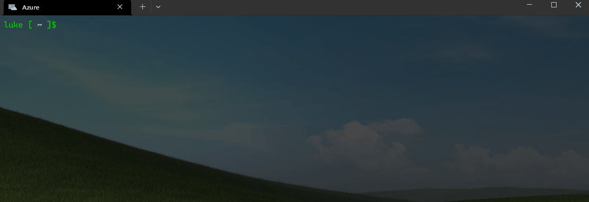

6. Then verify the connection:

```bash
kubectl get nodes
```
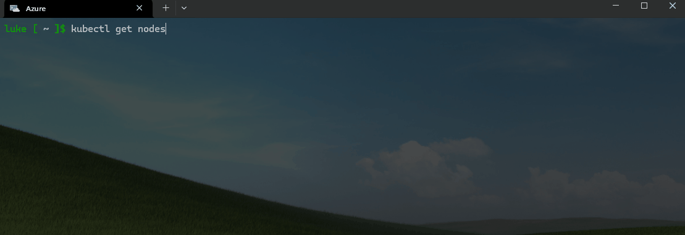

:::tip
`kubectl` is a command line tool for interacting with Kubernetes clusters. It's part of the Kubernetes project and is used to deploy and manage applications on Kubernetes. It can also be used to inspect and debug cluster and application resources.

Kubectl is the Kubernetes command-line tool that allows you to run commands against Kubernetes clusters. You can use Kubectl to deploy applications, inspect and manage cluster resources, and view logs. It's a crucial component for interacting with Kubernetes and is used in various operations, from creating, updating, and deleting Kubernetes resources to debugging running applications.
:::

8. Lets assign the managed identity, Contributor rights over the Resource Group, that contains the Cluster by running the following command:

```bash
export AKS_OIDC_ISSUER=$(az aks show --name "${CLUSTER_NAME}" --resource-group "${AZURE_RESOURCE_GROUP}" --query "oidcIssuerProfile.issuerUrl" -o tsv)
export MC_RESOURCE_GROUP=$(az aks show --resource-group ${AZURE_RESOURCE_GROUP} --name ${CLUSTER_NAME} --query nodeResourceGroup -o tsv)
KAITO_IDENTITY_PRINCIPAL_ID=$(az identity show --name ai-toolchain-operator-${CLUSTER_NAME} --resource-group ${MC_RESOURCE_GROUP} --query principalId --output tsv)
KAITO_IDENTITY_CLIENT_ID=$(az identity show  --name ai-toolchain-operator-${CLUSTER_NAME} --resource-group ${MC_RESOURCE_GROUP} --query clientId --output tsv)
az role assignment create --assignee $KAITO_IDENTITY_PRINCIPAL_ID --scope "/subscriptions/${AZURE_SUBSCRIPTION_ID}/resourcegroups/${AZURE_RESOURCE_GROUP}" --role Contributor
az identity federated-credential create --name "Kaito-federated-identity" --identity-name ai-toolchain-operator-${CLUSTER_NAME} --resource-group ${MC_RESOURCE_GROUP} --issuer ${AKS_OIDC_ISSUER} --subject system:serviceaccount:kube-system:kaito-gpu-provisioner --audience api://AzureADTokenExchange
```

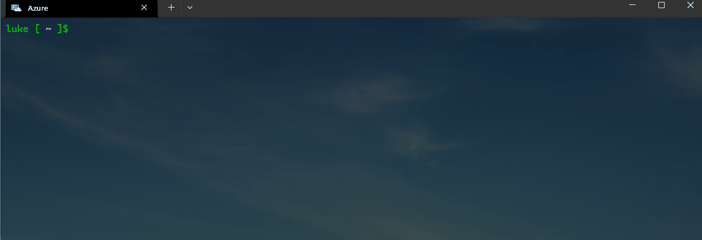

:::warning

If you get 'Failed to connect to MSI. Please make sure MSI is configured correctly.' Make sure you relogin to Azure *(ie az login --use-device-code)*, you may need to assign Contributor rights manually as well. Reference: [Error from CloudShell - Failed to connect to MSI. Please make sure MSI is configured correctly. #17695](https://github.com/Azure/azure-cli/issues/17695)

:::

:::tip

You can check what entries are in the environment variables by running using echo to output the variable:

```bash
echo $KAITO_IDENTITY_CLIENT_ID
```

If the gpu-provisioner is not running, you can check the logs by running the following command:

```bash
kubectl get pods --all-namespaces -l app=ai-toolchain-operator
```
Find the name of the gpu-provisioner pod, and then run the following command to get the logs:

```bash
kubectl logs -n kube-system <gpu-provisioner-pod-name>
```

I had issues where the gpu-provisioner pod was not running and constantly restarted. The logs showed that the identity was not found, so I had to re-run the command to assign the correct managed identity and use the echo command to reveal the managed identity, highlighting the wrong one was selected.

:::

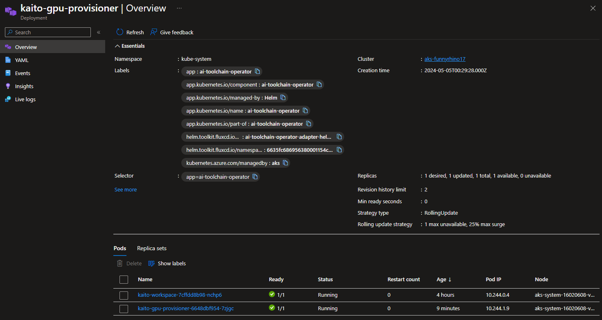

9. Let's now deploy the Falcon 7b instruct model to our AKS cluster.

:::warning

As soon as the models are grabbed from the remote registry, the GPU nodes will spin up, and you will start paying for their use, so just be aware.

:::

We are going to use one of the **supported models to create our interference endpoint in AKS, the Falcon 7b instruct model, as per their examples in the [Kaito GitHub repository](https://github.com/Azure/kaito/tree/main/examples/inference)**.

```bash
kubectl apply -f https://raw.githubusercontent.com/Azure/kaito/main/examples/inference/kaito_workspace_falcon_7b-instruct.yaml
```

:::tip

You can monitor the progress of the workspaces and model deployment by running the following command:

```bash
kubectl get workspace workspace-falcon-7b-instruct -w
```

> The deployment can take a few minutes *(ie 20-50 minutes, the Resources because ready, before the workspace is ready)*, so be patient. It needs to pull the Falcon model from the Microsoft public container registry *(ie, Pulling image "mcr.microsoft.com/aks/kaito/kaito-falcon-7b-instruct:0.0.4")*.  It took me 45 minutes when I tested with the Mistral 7b model

Wait for the Workspace to be ready before continuing.

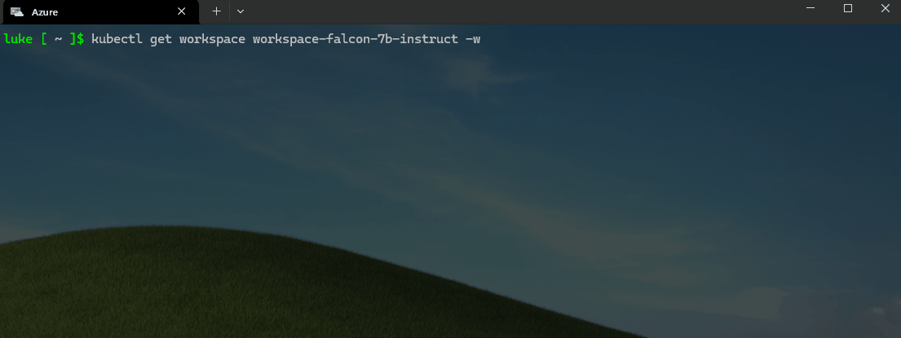

:::

Once the workspaces and pods/nodes have been provisioned, let us test the deployment by running the following command:

```bash
kubectl get svc workspace-falcon-7b-instruct -o jsonpath='{.spec.clusterIP}'
export SERVICE_IP=$(kubectl get svc workspace-falcon-7b-instruct -o jsonpath='{.spec.clusterIP}')
kubectl run -it --rm --restart=Never curl --image=curlimages/curl -- curl -X POST http://$SERVICE_IP/chat -H "accept: application/json" -H "Content-Type: application/json" -d "{\"prompt\":\"What is your favorite ice cream flavor?\"}"
```

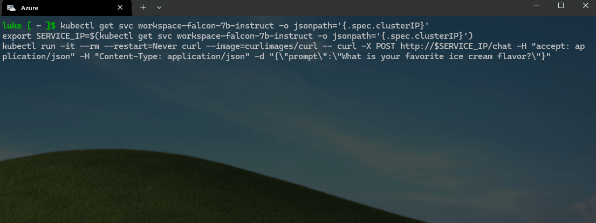

### 🚀 Update the Pet-store app

Almost there! Now that we know that our local chat endpoint is working with the Falcon 7b instruct model, we can update the Pet Store app to use the local Falcon 7b model and remove the Azure OpenAI to generate the product descriptions.

We will continue in our Terminal to do that, but like the previous steps, it can be done in the Codespace. The Pet Store application already has some great examples of doing this, so we will create a new manifest and repoint the application to use the local Falcon workspace instead of the public Azure Open AI endpoint that was created initially:

1. First, we need to create a new config map to deploy the Pet Store app with the Falcon 7b instruct model by running the following command:

```bash
kubectl apply -n pets -f - <<EOF
apiVersion: v1
kind: ConfigMap
metadata:
  name: ai-service-configmap
data:
  USE_LOCAL_LLM: "True"
  AI_ENDPOINT: "http://workspace-falcon-7b-instruct/chat"
---
apiVersion: apps/v1
kind: Deployment
metadata:
  name: ai-service
spec:
  replicas: 1
  selector:
    matchLabels:
      app: ai-service
  template:
    metadata:
      labels:
        app: ai-service
    spec:
      nodeSelector:
        "kubernetes.io/os": linux
      containers:
      - name: order-service
        image: ghcr.io/azure-samples/aks-store-demo/ai-service:latest
        ports:
        - containerPort: 5001
        envFrom:
        - configMapRef:
            name: ai-service-configmap
        resources:
          requests:
            cpu: 20m
            memory: 50Mi
          limits:
            cpu: 30m
            memory: 85Mi
        startupProbe:
          httpGet:
            path: /health
            port: 5001
          initialDelaySeconds: 60
          failureThreshold: 3
          timeoutSeconds: 3
          periodSeconds: 5
        readinessProbe:
          httpGet:
            path: /health
            port: 5001
          initialDelaySeconds: 3
          failureThreshold: 3
          timeoutSeconds: 3
          periodSeconds: 5
        livenessProbe:
          httpGet:
            path: /health
            port: 5001
          failureThreshold: 3
          initialDelaySeconds: 3
          timeoutSeconds: 3
          periodSeconds: 3
---
apiVersion: v1
kind: Service
metadata:
  name: ai-service
spec:
  type: ClusterIP
  ports:
  - name: http
    port: 5001
    targetPort: 5001
  selector:
    app: ai-service
EOF
```

Now, let's test it! We will remove the Azure OpenAI instance first and then test it!

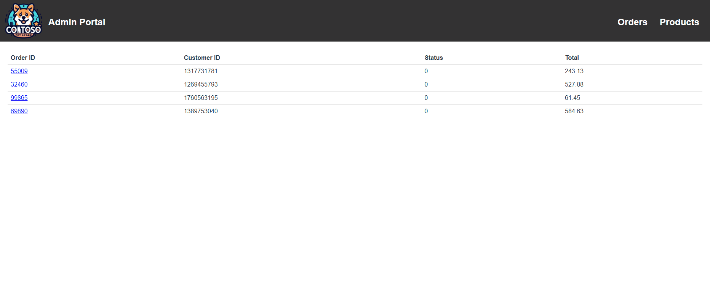

We can confirm within our AI Service ConfigMap now that the local endpoint is being used:

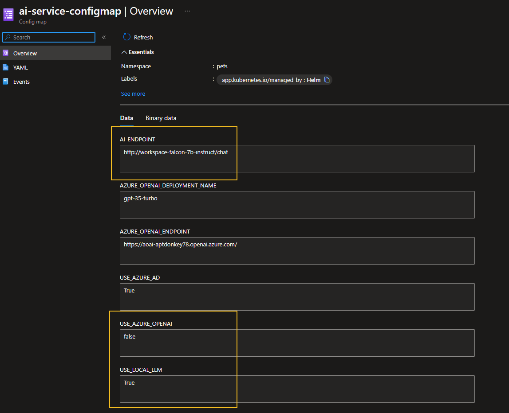
