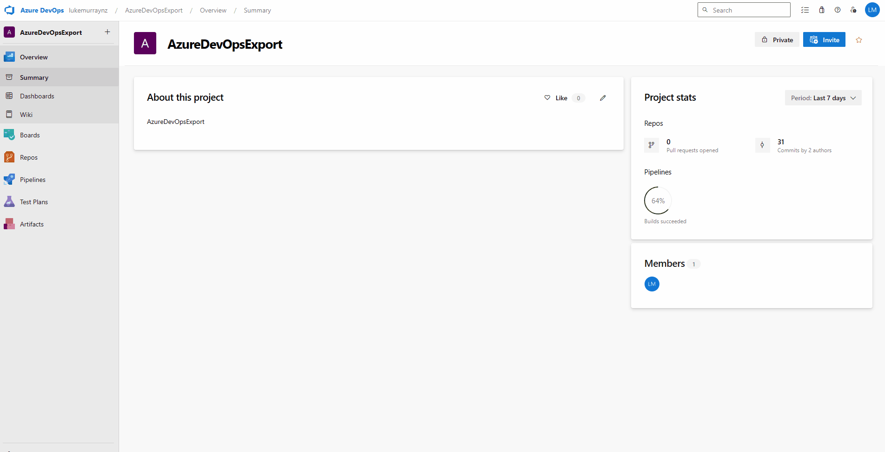

import Tabs from '@theme/Tabs';
import TabItem from '@theme/TabItem';

When recently deleted, Azure DevOps code repositories go into a soft-delete state, any repositories deleted are retained for 30 days before they are permanently deleted.

For Disaster Recovery scenarios or scenarios where you may not realize something has been deleted until after Microsoft retains the backup, you may want to export the repositories at a single point in time to an Azure storage account.

The Azure DevOps service is highly redundant and built on core Azure Platform infrastructure components, such as Availability Zones and is built using Azure Cloud native Storage and Azure SQL services, which are highly redundant and backed-up. 

However, mistakes can happen, and there may be organizational requirements to retain backups of the repositories. 

Today, we will examine exporting your repositories to an Azure Storage Account using a DevOps pipeline. This pipeline will capture the repositories at their current state and run nightly. 

<!-- truncate -->

## 📚 Overview

:::info
"You can recover deleted organizations or projects within the 28-day window following deletion. But, once this period elapses, these entities are permanently deleted and can't be restored. While these backups serve as a crucial component for disaster recovery, customers need to practice appropriate data management and backup strategies to ensure comprehensive data protection."

"Accidental deletion here refers to scenarios that arise as a result of an incident on our services. It doesn't include customers' accidental deletion of assets (for example, repositories, work items, attachments, or artifacts).

**We don't support restoring assets that customers accidentally delete. These backups are meant only for business continuity and to aid recovery from outages or disaster scenarios.**"

Reference: [Data protection - Mistakes Happen](https://learn.microsoft.com/en-us/azure/devops/organizations/security/data-protection?view=azure-devops&WT.mc_id=AZ-MVP-5004796#mistakes-happen)
:::

:::warning
Please remember that this backup will only export the repositories and pipelines, not the work items, pipeline variables, or other artifacts. This will also backup any code stored in Azure DevOps, so if secrets or other sensitive information are stored in the code, please ensure that these are not stored in the code or are encrypted, or they may be readable by someone with access to the storage account.
:::

Today, we will run a PowerShell script with an Azure DevOps pipeline. The script will connect to the Azure DevOps API and grab the zip file of each Repository in all Projects into an artifact, which then gets exported and copied to an Azure Storage Account.


## 🚀 Deployment

### ☁️ Azure Storage Account

We will need to create an Azure Storage Account to store the exported repositories. We can point towards an already existing Storage Account and Container. 

We will deploy the Storage account fresh using [Azure Bicep](https://learn.microsoft.com/azure/azure-resource-manager/bicep/overview?tabs=bicep&WT.mc_id=AZ-MVP-5004796) to our existing Resource Group for this article.

:::tip
I will use the [Deployment Pane](https://luke.geek.nz/azure/Azure-Bicep-Deploy-Pane/) to deploy the Storage Account straight from Visual Studio Code, running in a [Codespace](https://luke.geek.nz/azure/Getting-Started-with-GitHub-Codespaces/).
:::

We will use [Lifecycle Management policies](https://learn.microsoft.com/azure/storage/blobs/lifecycle-management-policy-configure?tabs=azure-portal&WT.mc_id=AZ-MVP-5004796) to help control the retention of the exported repositories. We will move the repositories to Cool Storage after 30 days, Archive Storage after 90 days, and delete them after 120 days.


```bicep
// Parameters for the script
param storageAccountName string // Name of the storage account
param location string = resourceGroup().location // Location of the storage account, default to the location of the resource group
param containerName string = 'adoexport' // Name of the container

// Resource definition for the storage account
resource storageAccount 'Microsoft.Storage/storageAccounts@2023-01-01' = {
  name: storageAccountName // Set the name of the storage account
  location: location // Set the location of the storage account
  sku: {
    name: 'Standard_LRS' // Set the SKU to Standard_LRS
  }
  kind: 'StorageV2' // Set the kind to StorageV2
  properties: {
    accessTier: 'Hot' // Set the access tier to Hot
    allowBlobPublicAccess: false // Disable public access to blobs
    publicNetworkAccess: 'Disabled' // Disable public network access
  }
}

// Resource definition for the blob service
resource blobService 'Microsoft.Storage/storageAccounts/blobServices@2023-01-01' = {
  name: 'default' // Set the name of the blob service to default
  parent: storageAccount // Set the parent to the storage account
  properties: {
    lastAccessTimeTrackingPolicy: {
      enable: true // Enable last access time tracking
    }
  }
}

// Resource definition for the storage container
resource storageContainer 'Microsoft.Storage/storageAccounts/blobServices/containers@2023-01-01' = {
  name: containerName // Set the name of the container
  parent: blobService // Set the parent to the blob service
  properties: {
    publicAccess: 'None' // Set public access to None
  }
}

// Define a new resource of type 'Microsoft.Storage/storageAccounts/managementPolicies'
resource lifecyclePolicy 'Microsoft.Storage/storageAccounts/managementPolicies@2023-01-01' = {
  // The name of the management policy. 'default' is a reserved name for the policy.
  name: 'default'
  
  // The parent resource that this policy is associated with, which is the storage account.
  parent: storageAccount
  
  properties: {
    policy: {
      rules: [
        {
          // This rule is enabled
          enabled: true
          // The name of the rule
          name: 'MoveToCoolStorageAfter30Days'
          // The type of rule, in this case, it's a lifecycle rule
          type: 'Lifecycle'
          definition: {
            actions: {
              // The actions to take on base blobs (i.e., non-versioned blobs)
              baseBlob: {
                // Move the blob to cool storage after it hasn't been modified for 30 days
                tierToCool: {
                  daysAfterModificationGreaterThan: 30
                }
              }
            }
            // The filters that determine which blobs the rule applies to
            filters: {
              // The types of blobs that the rule applies to. In this case, the rule applies to block blobs
              blobTypes: [
                'blockBlob'
              ]
            }
          }
        }
        {
          enabled: true
          name: 'MoveToArchiveStorageAfter90Days'
          type: 'Lifecycle'
          definition: {
            actions: {
              baseBlob: {
                // Move the blob to archive storage after it hasn't been modified for 90 days
                tierToArchive: {
                  daysAfterModificationGreaterThan: 90
                }
              }
            }
            filters: {
              blobTypes: [
                'blockBlob'
              ]
            }
          }
        }
        {
          enabled: true
          name: 'DeleteBlobsAfter120Days'
          type: 'Lifecycle'
          definition: {
            actions: {
              baseBlob: {
                // Delete the blob after it hasn't been modified for 120 days
                delete: {
                  daysAfterModificationGreaterThan: 120
                }
              }
            }
            filters: {
              blobTypes: [
                'blockBlob'
              ]
            }
          }
        }
      ]
    }
  }
}

output storageAccountName string = storageAccount.name // Output the name of the storage account
output containerName string = storageContainer.name // Output the name of the storage account container

```

Please note the Storage Account name and Container Name; we will need them for Azure DevOps pipeline variables.

### 🛠️ Azure DevOps Pipeline

Now, it's time to set up your project and repository. If you don't know how to do that, you can follow the official Microsoft Learn documentation here: [Create a new Git repo in your project](https://learn.microsoft.com/en-us/azure/devops/repos/git/create-new-repo?view=azure-devops&WT.mc_id=AZ-MVP-5004796). 

Once your repository has been set up and initialized, we need to add the following files.

## 💻 PowerShell Script

The PowerShell script, `Export-AzDevOpsRepos.ps1`, is responsible for cloning all repositories in a given Azure DevOps organization and downloading them as ZIP files. It uses the Azure DevOps REST API to fetch all projects and their respective repositories. For each repository, it generates a URL to download the repository as a ZIP file and saves it to a local directory. If the script is run in an Azure Pipelines environment, it also uploads the directory containing the downloaded repositories as a pipeline artifact.

:::tip
The PowerShell script can also be run locally. If it detects an Azure DevOps agent, it will automatically collect the variables from the pipeline variables; otherwise, those variables can be added manually to the script to run it locally.

```powershell
if ($env:AGENT_ID) {
    # Running in Azure DevOps
    $personalAccessToken = "$env:pat" # Assuming PAT is stored as a secret variable in the pipeline
    $organization = "$env:AzDevOpsOrg"

}
else {
    # Running on a local PC
    $personalAccessToken = ''
    $organization = ''
}
```
:::

## 🚀 Azure Pipelines

The Azure Pipelines configuration file, `.azure-pipelines/pipeline.ci.adoexport.yml` sets up a CI pipeline that runs the PowerShell script on a schedule. The pipeline is configured to run on the latest Windows agent. It uses the Azure CLI task to run the PowerShell script and to manage access to an Azure storage account. After the script has run, the pipeline downloads any ZIP files produced as artifacts and copies them to the Azure storage account. The pipeline is scheduled to run daily at midnight.

<Tabs>
<TabItem value="pipeline" label="pipeline.ci.adoexport.yml">

```yaml
name: "Export Azure DevOps repositories" # Name of the pipeline

trigger: none # Pipeline is not triggered automatically

schedules: # Define schedules for pipeline runs
  - cron: "0 12 * * *" # Run daily at midnight
    displayName: Daily midnight run # Display name for the schedule
    branches:
      include:
        - main # Only run on the 'main' branch
    always: true # Run even if there are no code changes

pool:
  vmImage: "windows-latest" # Use the latest Windows agent

steps:
  - checkout: self # Checkout the source code from the repository
    persistCredentials: true # Persist credentials for subsequent steps
    displayName: "Checkout code" # Display name for the step

  - task: AzureCLI@2 # Use Azure CLI task
    displayName: "Clone Azure DevOps Repositories" # Display name for the step
    inputs:
      azureSubscription: "$(azServiceConnection)" # Azure subscription to use
      scriptType: "ps" # Use PowerShell script
      scriptLocation: "scriptPath" # Script location is a file path
      scriptPath: "$(Build.Repository.LocalPath)/Export-AzDevOpsRepos.ps1" # Path to the PowerShell script
    env:
      PAT: $(PAT) # Personal Access Token for authentication
      AzDevOpsOrg: $(AzDevOpsOrg) # Azure DevOps organization

  - task: AzureCLI@2 # Use Azure CLI task
    displayName: Allow Public Access to Azure DevOps Export Storage Account for upload # Display name for the step
    condition: succeeded() # Run only if the previous step succeeded
    inputs:
      azureSubscription: "$(azServiceConnection)" # Azure subscription to use
      scriptType: bash # Use Bash script
      scriptLocation: inlineScript # Script location is inline
      inlineScript: |
        az storage account update --name "${storageAccount}"  --resource-group "${storageAccountRG}" --default-action Allow
    env:
      storageAccount: $(storageAccount) # Personal Access Token for authentication
      storageAccountRG: $(storageAccountRG) # Azure DevOps organization

  - task: AzureCLI@2 # Use Azure CLI task
    displayName: "Check Storage Network Access" # Display name for the step
    condition: succeeded() # Run only if the previous step succeeded
    timeoutInMinutes: 10 # Timeout after 10 minutes
    continueOnError: true # Continue even if the step fails
    name: check_storage_access # Name of the step
    inputs:
      azureSubscription: "$(azServiceConnection)" # Azure subscription to use
      scriptType: bash # Use Bash script
      scriptLocation: inlineScript # Script location is inline
      inlineScript: |
        set -x
        echo -e "Setting up authentication..."
        AZURE_STORAGE_ACCOUNT=${storageAccount}
        AZURE_STORAGE_KEY=$(az storage account keys list --account-name ${storageAccount} --query '[0].value' --output tsv)
        echo -e "Checking storage account access every 60 seconds..."
        sleep 10
        for i in {1..60}; do
          if az storage container list --output none; then
            echo "Access granted"
            break
          else
            echo "Access denied, retrying in 60 seconds..."
            sleep 60
          fi
        done

  - task: DownloadPipelineArtifact@2 # Download pipeline artifacts
    displayName: "Download Build Artifacts" # Display name for the step
    inputs:
      patterns: "**/*.zip" # Include all ZIP files
      path: "$(Build.ArtifactStagingDirectory)" # Download artifacts to the staging directory

  #Storage account needs the SPN to have a Storage Blob Data Contributor role to allow blob upload.

  - task: AzureFileCopy@6 # Use Azure File Copy task
    displayName: "Copy artifacts to $(storageAccount)" # Display name for the step
    inputs:
      azureSubscription: "$(azServiceConnection)" # Azure subscription to use
      blobPrefix: "$(Build.DefinitionName)/$(Build.BuildId)" # Prefix for the blob names
      containerName: $(stgAccContainer) # Name of the storage container
      destination: "AzureBlob" # Copy to Azure Blob storage
      sourcePath: "$(Build.ArtifactStagingDirectory)/*" # Source path for the artifacts
      storage: $(storageAccount) # Storage account to copy the artifacts to
    # Log the status of artifact download and storage account operations


  - task: AzureCLI@2 # Use Azure CLI task
    displayName: Remove Public Access from Azure DevOps Export Storage Account # Display name for the step
    condition: succeededOrFailed() # Run whether the previous step succeeded or failed
    inputs:
      azureSubscription: "$(azServiceConnection)" # Azure subscription to use
      scriptType: bash # Use Bash script
      scriptLocation: inlineScript # Script location is inline
      inlineScript: |
        az storage account update --name "${storageAccount}" --resource-group "${storageAccountRG}" --default-action Deny
    env:
      storageAccount: $(storageAccount) # Personal Access Token for authentication
      storageAccountRG: $(storageAccountRG) # Azure DevOps organization

```
</TabItem>
<TabItem value="script" label="Export-AzDevOpsRepos.ps1">

```powershell
$apiVersion = '7.1' # Update API version to 6.0

if ($env:AGENT_ID) {
    # Running in Azure DevOps
    $personalAccessToken = "$env:pat" # Assuming PAT is stored as a secret variable in the pipeline
    $organization = "$env:AzDevOpsOrg"

}
else {
    # Running on a local PC
    $personalAccessToken = ''
    $organization = ''
}

$base64AuthInfo = [System.Convert]::ToBase64String([System.Text.Encoding]::ASCII.GetBytes(":$($personalAccessToken)"))
$headers = @{Authorization = ("Basic {0}" -f $base64AuthInfo) }

## Get all projects
$projects = Invoke-RestMethod -Uri "https://dev.azure.com/$organization/_apis/projects?api-version=$apiVersion" -Method Get -Headers $headers -Verbose

## Output the count and names of the projects
Write-Host "Number of projects: $($projects.value.Count)"
Write-Host "Project names: $($projects.value | ForEach-Object { $_.name })"

## For each project, get all repositories and download them as zip

## Ensure the repositories directory exists before starting the loop
$repositoriesPath = "$env:SYSTEM_DEFAULTWORKINGDIRECTORY/repositories"
if (-not (Test-Path -Path $repositoriesPath)) {
    Write-Host "Creating repositories directory: $repositoriesPath"
    New-Item -ItemType Directory -Path $repositoriesPath | Out-Null
}

$projects.value | ForEach-Object {
    $projectName = $_.name

    if (-not [string]::IsNullOrWhiteSpace($projectName)) {
        $projectName = $projectName.Replace(' ', '%20')
        $result = Invoke-RestMethod -Uri "https://dev.azure.com/$organization/$projectName/_apis/git/repositories?api-version=$apiVersion" -Method Get -Headers $headers -Verbose

        $result.value | ForEach-Object {
            $repoName = $_.name
            Write-Host "Attempting to clone the repository: $repoName"

            if (-not [string]::IsNullOrWhiteSpace($repoName)) {
                $repoId = $_.id
                $zipUrl = "https://dev.azure.com/$organization/$projectName/_apis/git/repositories/$repoId/items?scopePath=/&recursionLevel=Full&api-version=$apiVersion&`$format=zip"
                $outputPath = "repositories/$repoName.zip"
                Write-Host "Output path: $outputPath"
                # Ensure the directory exists before trying to download the file
                $directoryPath = Split-Path -Path $outputPath -Parent
                if (-not (Test-Path -Path $directoryPath)) {
                    Write-Host "Creating directory: $directoryPath"
                    New-Item -ItemType Directory -Path $directoryPath | Out-Null
                }
                try {
                    Write-Host "Starting download for $repoName from $zipUrl"
                    Invoke-WebRequest -Uri $zipUrl -OutFile $outputPath -Headers $headers
                    Write-Host "Download completed for $repoName"
                }
                catch {
                    Write-Host "Failed to download $repoName from $zipUrl"
                    Write-Host $_.Exception.Message
                }
            }
        }
    }
}

## Check if the repositories directory exists before trying to upload it
if (Test-Path -Path "$env:SYSTEM_DEFAULTWORKINGDIRECTORY/repositories") {
    Write-Host "Repositories directory exists, uploading as an artifact."
    Write-Host "##vso[artifact.upload containerfolder=repositories;artifactname=AzureDevOpsExportedRepositories;]$env:SYSTEM_DEFAULTWORKINGDIRECTORY/repositories"
}
else {
    Write-Host "The repositories directory does not exist, so you cannot upload it as an artifact."
}

```
</TabItem>
</Tabs>

You can also find the latest files in the [lukemurraynz/ADO_Export](https://github.com/lukemurraynz/ADO_Export) GitHub repository. Feel free to open a Pull Request, Suggest changes, or improve.

I am going to be lazy and just drag the files into the repo and commit them.



Once committed, it is time to set up our pipeline.

But first, we need to setup our [PAT (Personal Access Token)](https://learn.microsoft.com/azure/devops/organizations/accounts/use-personal-access-tokens-to-authenticate?view=azure-devops&tabs=Windows&WT.mc_id=AZ-MVP-5004796) and [Service Connection](https://learn.microsoft.com/azure/devops/pipelines/library/service-endpoints?view=azure-devops&tabs=yaml&WT.mc_id=AZ-MVP-5004796). Both I have completed.

For your PAT token, you will need the following permissions:

- Code (Read)
- Project and Team (Read)

For your Service Connection, you will need the following permissions:

Reader on the Subscription that Contains your Storage Account *(the subscription scoping is required for the Azure CLI commanders to check and access your Storage account; if you are using a Self-Managed DevOps agent, you may be able to avoid this)*, and Storage Blob Data Contributor on the Storage Account.

Then, we need to add to our pipeline the following:

| Variable            | Example                                        | Notes                                                                                         |
| ------------------- | ---------------------------------------------- | --------------------------------------------------------------------------------------------- |
| azDevOpsOrg         | Contoso                                        | Your Azure DevOps Org - matching your URL ie (https://dev.azure.com/contoso)                 |
| azServiceConnection | AzureServiceConnection                         | Your Service Connection name for Azure Resource Provider access to your Azure Resource Group |
| pat                 | 2xj2jv4yf2h6xvqjgk7y2n4d2iucxltlzyxuhcdjxibnrf | Your PAT (Personal Access Token), used to authenticate to Azure DevOps. Set this as a secure string.                       |
| stgAccContainer     | adoexport                                      | The Container that will contain your ADO Exports inside of the Storage Account               |
| storageAccount      | adoexport23                                    | Storage account that your ADO exports will be going into.                                     |
| storageAccountRG    | adoexport-rg                                   | Resource Group, containing your Azure Storage Account                                         |

So, let's import our pipeline and configure our variables!

1. To import the Pipeline, navigate to your Azure DevOps Project, click on Pipelines, and then click on the "New Pipeline" button.
2. Click Azure Repos Git and select your repository.
3. Select Existing Azure Pipelines YAML file
4. Select your Pipeline and click Continue
5. Now, we can add our Variables by clicking Variables and then Add. If you have already imported the Pipeline, you can navigate to the Pipeline, click Edit, and then Variables.


:::info
By default, the pipeline has a cronjob configured to set it for midnight, but you can change this to any time you like by editing the pipeline file and changing the [cron syntax](https://learn.microsoft.com/azure/devops/pipelines/process/scheduled-triggers?view=azure-devops&tabs=yaml&WT.mc_id=AZ-MVP-5004796#cron-syntax).

```yaml
schedules: # Define schedules for pipeline runs
  - cron: "0 12 * * *" # Run daily at midnight
    displayName: Daily midnight run # Display name for the schedule
    branches:
      include:
        - main # Only run on the 'main' branch
    always: true # Run even if there are no code changes
```
:::

## 🏃‍♂️ Run

Now that you have configured your Storage Account and Pipeline, it's time to run the pipeline manually to ensure there are no problems before your scheduled time runs.

:::warning
Before you run:

Double-check the permissions you have granted the Service Principal and your variable naming and values; else you may get an error similar to the following when attempting to copy the artifacts to the Storage Account:

```plaintext
ERROR: (InvalidApiVersionParameter) The api-version '2023-01-01' is invalid. The supported versions are '2024-03-01,2023-07-01,2023-07-01-preview,2023-03-01-preview,2022-12-01,2022-11-01-preview,2022-09-01,2022-06-01,2022-05-01,2022-03-01-preview,2022-01-01,2021-04-01,2021-01-01,2020-10-01,2020-09-01,2020-08-01,2020-07-01,2020-06-01,2020-05-01,2020-01-01,2019-11-01,2019-10-01,2019-09-01,2019-08-01,2019-07-01,2019-06-01,2019-05-10,2019-05-01,2019-03-01,2018-11-01,2018-09-01,2018-08-01,2018-07-01,2018-06-01,2018-05-01,2018-02-01,2018-01-01,2017-12-01,2017-08-01,2017-06-01,2017-05-10,2017-05-01,2017-03-01,2016-09-01,2016-07-01,2016-06-01,2016-02-01,2015-11-01,2015-01-01,2014-04-01-preview,2014-04-01,2014-01-01,2013-03-01,2014-02-26,2014-04'.
Code: InvalidApiVersionParameter
```
It means, that your variables are not parsing correctly, to the Azure CLI, make sure they are correct.
:::

*You may need to permit your Pipeline to use your Service Connection by clicking on the "Allow" button when the pipeline runs.*

Your pipeline may take a while to run, depending on how many repositories you have and how large they are. You can monitor the progress of the pipeline by clicking on the pipeline, then clicking on the Job, and then the Task to see the output of the PowerShell script. This is why I would recommend running this on a schedule during a time that does not impact users, as it can hold up an agent while it runs; also be aware that depending on your repositories, running this every night can quickly use up any [build minutes you may have, if running from a Microsoft hosted agent](https://azure.microsoft.com/pricing/details/devops/azure-devops-services/?WT.mc_id=AZ-MVP-5004796).

:::info
If a Repository is only used for Azure Boards and not for code, it will not be exported, as the API will not return it *, i.e., you will use a (404) Not Found*.
:::


Once that's completed - you will be able to see your exported repositories in your storage account!


