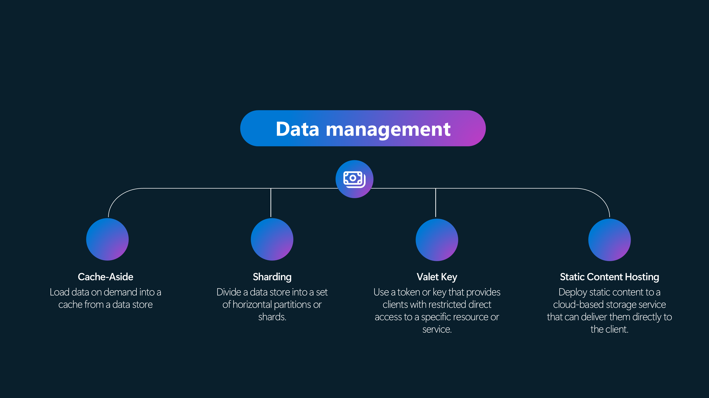
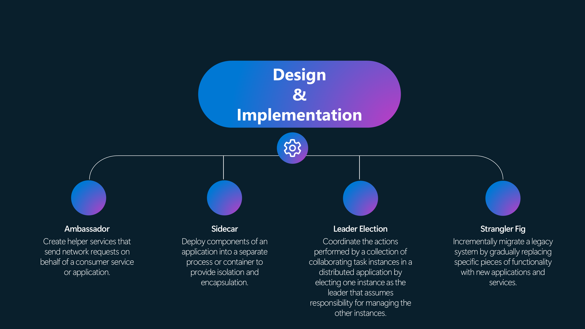

Cloud Design patterns help build reliable, scalable, secure applications in the cloud.

Today, we will cover common patterns, their use cases, and considerations.

The patterns we will cover today are only a small set of common patterns documented in the [Azure Architecture Center](https://learn.microsoft.com/en-us/azure/architecture/patterns/?WT.mc_id=AZ-MVP-5004796).

<!-- truncate -->

## 🌩️ Cloud Design Patterns

### Importance of Design Patterns

Design patterns are reusable solutions to common problems in software design. They are templates that can be applied to solve a problem in a specific context. They are not finished designs that can be transformed directly into code. They are a starting point for your design.

:::info
Design patterns are not new. They have been around for a long time. The concept of design patterns was introduced by the architect [Christopher Alexander](https://en.wikipedia.org/wiki/Christopher_Alexander#:~:text=Alexander%%20and%20personally%20built,architect%20and%20a%20general%20contractor.&text=In%20software%2C%20Alexander%20is%20regarded,to%20its%20creator%2C%20Ward%20Cunningham) in the field of architecture and later adopted by software engineers.
:::

Design patterns are essential to consider when implementing your solutions as they help with the following:

Reusability - Design patterns promote reusability by providing proven solutions to common problems, allowing components and subsystems to be used in other applications and scenarios and interoperability

* Maintainability - They simplify administration and development, making maintaining and updating applications easier.
* Consistency - Design patterns ensure consistency and coherence in component design and deployment, which is crucial for the overall quality of the application
* Efficiency - By following established patterns, developers can avoid repetitive work and focus on implementing specific requirements, thus saving development time
* Scalability - Design patterns help in designing scalable systems by providing guidelines for efficient resource allocation and management
* Performance - They help optimize the use of system resources, leading to improved performance of the application 
* Modularity - Design patterns promote modular and structured code, making it easier to understand, modify, and maintain.

This is as true in Modern Cloud solutions as it is in traditional development, with [well-architected principles](https://learn.microsoft.com/azure/well-architected/?WT.mc_id=AZ-MVP-5004796) more important than ever.

Take a Cloud Platform or ecosystem like Azure, with Services offering a theory of functionality that can be put together like Lego bricks.

* Scalability—Cloud design patterns address scalability by providing solutions for horizontal and vertical scaling, ensuring that applications can handle increased loads efficiently. This promotes sustainability by enabling dynamic resource allocation and reducing energy consumption during low-demand periods.
* Resilience—Patterns like Circuit Breakers and Bulkhead help build resilient applications that can withstand failures and continue to function. Sustainable operations are achieved by minimizing downtime and resource wastage, thus ensuring efficient resource use.
* Security—Security patterns such as API Gateway and Secure Token ensure that applications are protected against malicious actors while maintaining confidentiality, integrity, and availability. Secure systems support sustainability by preventing security breaches that could lead to resource wastage.
* Operational Excellence - Patterns like Ambassador and Anti-Corruption Layer enhance operational excellence by simplifying the management and monitoring of cloud applications. Efficient management practices contribute to sustainability by optimizing resource usage and reducing unnecessary overhead.
* Performance Efficiency - Patterns such as Cache-Aside and Compute Resource Consolidation optimize performance by efficiently managing resources and reducing latency. Effective resource management leads to sustainability by lowering the overall resource footprint and energy consumption.
* Data Management—Data management patterns address data consistency, synchronization, and management challenges across different locations, which is crucial for cloud applications. Sustainable data practices ensure data is stored and processed efficiently, minimizing energy use and reducing environmental impact.

#### Acroymns

When talking about design patterns, we will be using a few acronyms, and it is important to understand what they mean in order to fully understand the context.

| Acronym  | Definition                                                                                                                                                                                                                | Example                                                                                                                                                                                                    |
| -------- | ------------------------------------------------------------------------------------------------------------------------------------------------------------------------------------------------------------------------- | ---------------------------------------------------------------------------------------------------------------------------------------------------------------------------------------------------------- |
| Service  | A service in cloud pattern design refers to a distinct function or set of functions a cloud application provides. Services are typically designed to be reusable and can be consumed by multiple clients or consumers. | In a microservices architecture, each microservice is a service that performs a specific business function, such as user authentication, payment processing, or data storage.                              |
| Consumer | A  consumer is an entity (such as an application, service, or user) that consumes or uses the services provided by another service. Consumers send requests to services and receive responses.                            | A web application that calls an authentication service to verify user credentials is a consumer of that authentication service.                                                                            |
| Tenant   | In a multi-tenant architecture, a tenant is a group of users who share common access with specific privileges to the software instance. Each tenant's data is isolated and remains invisible to other tenants.            | In a Software as a Service (SaaS) application, each customer (company or organization) is considered a tenant. They have their own isolated data and configuration settings within the shared application. |
| Facade   | The Facade pattern provides a simplified interface to a complex subsystem, making it easier to use and understand. It acts as a high-level interface that hides the complexities of the underlying system.                      | In a software application, a facade can be used to provide a simplified API that abstracts away the complexities of interacting with multiple subsystems or modules.                                      |
| Asynchronous | Asynchronous communication is a messaging pattern where the sender and receiver do not need to interact in real time. The sender can send a message and continue with other tasks, while the receiver processes the message at its own pace. | In a distributed system, asynchronous messaging can be used to decouple components and improve scalability. For example, a message queue can be used to send and receive messages between different services. |
| Synchronous | Synchronous communication is a messaging pattern where the sender and receiver interact in real time. The sender sends a message and waits for a response from the receiver before proceeding. | In a request-response scenario, a client sends a request to a server and waits for the server to process the request and send back a response. This pattern is commonly used in HTTP-based APIs. |

### Archetypes *(Categories)* of Patterns

Cloud design patterns can be categorized into different Archetypes *(categories)* based on their characteristics and use cases. These archetypes provide a structured way to understand and apply patterns in cloud architecture design.

The categories include Data Management, Security, Reliability, Messaging, and Design and implementation. Let's examine each category in detail.

* Data Management patterns help us manage data in the cloud. Caching helps us reduce the number of database hits and improve application performance. Sharding helps us partition our data across multiple databases to improve scalability. Federation helps us distribute data across multiple databases for better availability and fault tolerance.
* Security patterns help us secure our applications in the cloud. Perimeter Networks help us isolate our applications from the Internet. Identity Management helps us manage user identities and access to resources. Secure Communication helps us protect our data in transit.
* Reliability patterns help us build highly available and fault-tolerant applications in the cloud. Retry helps us recover from transient failures. Circuit Breakers help us prevent cascading failure. Bulkhead helps us limit the damage caused by a failure.
* Messaging patterns help us build scalable and decoupled applications in the cloud. Asynchronous Messaging helps us send messages between components in a non-blocking way. Event Sourcing helps us capture all changes to an application state. Competing Consumers help us process messages in parallel.
* Design and implementation patterns help us build scalable and resilient cloud-native applications. Valet Key helps us delegate access to resources. Ambassador helps us expose services to external clients. Gateway helps us provide a single entry point to our application.

:::warning
As usual, the choice of pattern depends on your application's specific requirements. To make an informed decision, it's essential to understand the characteristics and trade-offs of each pattern and business requirements. Sometimes, multiple patterns may be required, or even part of one, to solve a specific problem.
:::

### Pattern Deep Dives

The cloud has changed the way we design our applications. Let's examine some design patterns we can use in the cloud. These patterns help us solve common problems in cloud architecture and make our applications more reliable, scalable, and secure.

In the following sections, we will examine common cloud design patterns, their use cases, and considerations in depth.

### Data Management Patterns

### 📚 Cache-Aside

> Load data on demand into a cache from a data store

Many commercial caching systems provide read-through and write-through/write-behind operations. In these systems, an application retrieves data by referencing the cache. 

If the data isn't in the cache, it's retrieved from the data store and added to the cache. Any modifications to data held in the cache are also automatically written back to the data store.

For caches that don't provide this functionality, it's the responsibility of the applications that use the cache to maintain the data.

If an application updates information, it can follow the write-through strategy by modifying the data store and invalidating the corresponding item in the cache. When the item is next required, using the cache-aside strategy will cause the updated data to be retrieved from the data store and added back into the cache.

#### Issues & considerations

Consider the following points when deciding how to implement this pattern:

* Lifetime of cached data. Many caches implement an expiration policy that invalidates data and removes it from the cache if it's not accessed for a specified period. For cache-aside to be effective, ensure that the expiration policy matches the pattern of access for applications that use the data. Don't make the expiration period too short because this can cause applications to continually retrieve data from the data store and add it to the cache. Similarly, don't make the expiration period so long that the cached data will likely become stale. Remember that caching is most effective for relatively static data or data that is read frequently.
* Evicting data. Most caches have a limited size compared to the data store where the data originates, and they'll evict data if necessary. Most caches adopt a least-recently-used policy for selecting items to evict, but this might be customizable. Configure the global expiration property and other properties of the cache, as well as the expiration property of each cached item, to ensure that the cache is cost-effective. Applying a global eviction policy to every item in the cache isn't always appropriate. For example, if a cached item is costly to retrieve from the data store, it can be beneficial to keep this item in the cache at the expense of more frequently accessed but less costly items.
* Priming the cache. Many solutions prepopulate the cache with the data that an application is likely to need during startup processing. The Cache-Aside pattern can still be useful if some of this data expires or is evicted.
* Consistency. Implementing the Cache-Aside pattern doesn't guarantee consistency between the data store and the cache. An external process can change an item in the data store at any time, and this change might not be reflected in the cache until the next time the item is loaded. In a system replicating data across data stores, this problem can become serious if synchronization occurs frequently.
* Local *(in-memory)* caching. A cache could be local to an application instance and stored in memory. Cache-aside can be useful in this environment if an application repeatedly accesses the same data. However, a local cache is private, so different application instances could each have a copy of the same cached data. This data could quickly become inconsistent between caches, so it might be necessary to expire data in a private cache and refresh it more frequently. In these scenarios, investigate a shared or distributed caching mechanism.

#### When to use this pattern

* When an in-built cache doesn't provide native read-through or write-back operations.
* When resource demand is unpredictable, you want to avoid overloading the data store.
* When the cached dataset is not static
* When NOT caching session state information in a web application hosted in a web farm. 

#### Azure Solutions

In this example, it uses [Azure Cache for Redis](https://learn.microsoft.com/azure/azure-cache-for-redis/cache-overview?WT.mc_id=AZ-MVP-5004796). When an application needs to retrieve data, it will first check to see if it exists in Azure Cache for Redis.
If the data is found in Azure Cache for Redis (cache hit), the application will use this data.
If the data is not found in Azure Cache for Redis (cache miss), the application must retrieve it from the appropriate Azure database service.
For cache miss scenarios, the requesting application should add the data retrieved from the Azure Database service to Azure Cache for Redis.

### 📚 Sharding

> Divide a data store into a set of horizontal partitions or shards.

Dividing a data store into a set of horizontal partitions or shards. This can improve scalability when storing and accessing large volumes of data.

* The Lookup strategy. In this strategy, the sharding logic implements a map that routes a request for data to the shard containing that data using the shard key. In a multi-tenant application, all the data for a tenant might be stored together in a shard using the tenant ID as the shard key. Multiple tenants might share the same shard, but the data for a single tenant won't be spread across multiple shards.
* The Range strategy. This strategy groups related items together in the same shard and orders them by shard key—the shard keys are sequential. It's useful for applications that frequently retrieve sets of items using range queries (queries that return a set of data items for a shard key that falls within a given range). For example, if an application regularly needs to find all orders placed in a given month, this data can be retrieved more quickly if all orders for a month are stored in date and time order in the same shard. If each order were stored in a different shard, they'd have to be fetched individually by performing many point queries (queries that return a single data item). 
* The Hash strategy. The purpose of this strategy is to reduce the chance of hotspots (shards that receive a disproportionate amount of load). It distributes the data across the shards in a way that achieves a balance between the size of each shard and the average load that each shard will encounter. The sharding logic computes the shard to store an item in based on a hash of one or more data attributes. The chosen hashing function should distribute data evenly across the shards, possibly by introducing some random element into the computation.

#### Issues & considerations

Consider the following points when deciding how to implement this pattern:

* Balancing data across multiple shards.
* Your queries need to be efficient and not require data from multiple shards or cause latency issues.
* Designing for scalability (storage nodes – data & throughput)
* Designing for availability (replication, failover, recovery)
* Make sure to use stable and unique key data to determine the sharding state
* Monitoring, backup, and maintaining consistency of multiple shards can be difficult.

#### When to use this pattern

The primary focus of sharding is to improve the performance and scalability of a system. Still, as a by-product it can also improve availability due to how the data is divided into separate partitions. A failure in one partition doesn't necessarily prevent an application from accessing data held in other partitions, and an operator can perform maintenance or recovery of one or more partitions without making the entire data for an application inaccessible. 

* When the data store is likely to need to scale beyond the resources of a single storage node.
* When you can improve performance  by reducing contention on a single data store.
* When you need to optimize cost by multiple instances of less expensive compute or storage.
* Improve resilience and reliability.
* When you have geographical concerns, i.e., Optimization based on where users or systems are located.

#### Azure Solutions

Consider a website that surfaces an expansive collection of information on published books worldwide. 
The number of possible books cataloged in this workload and the typical query/usage patterns contra-indicate the usage of a single relational database to store the book information. The workload architect decides to shard the data across multiple database instances, using the books' static International Standard Book Number (ISBN) for the shard key. Specifically, they use the check digit (0 - 10) of the ISBN as that gives 11 possible logical shards, and the data will be balanced across each shard. First, they decide to colocate the 11 logical shards into three physical shard databases. They use the lookup sharding approach and store the key-to-server mapping information in a shard map database.

Azure resources that can be used to implement this pattern include [Azure SQL Database](https://learn.microsoft.com/azure/azure-sql/database/sql-database-paas-overview?view=azuresql&WT.mc_id=AZ-MVP-5004796), [Azure Cosmos DB](https://learn.microsoft.com/azure/cosmos-db/introduction?WT.mc_id=AZ-MVP-5004796), and [Azure Storage](https://learn.microsoft.com/azure/storage/common/storage-introduction?WT.mc_id=AZ-MVP-5004796).

### 🚗 Valet Key

> Use a token or key that provides clients with restricted direct access to a specific resource or service.

Data stores have the ability to handle the upload and download of data directly without requiring the application to perform any processing to move this data. However, this typically requires the client to have access to the store's security credentials. This can be a useful technique to minimize data transfer costs and the requirement to scale out the application and to maximize performance. It means, though, that the application is no longer able to manage the security of the data. After the client has a connection to the data store for direct access, the application can't act as the gatekeeper. It's no longer in control of the process and can't prevent subsequent uploads or downloads from the data store.
This isn't a realistic approach in distributed systems that need to serve untrusted clients. 

Applications must be able to securely control access to data in a granular way, but still reduce the load on the server by setting up this connection and then allowing the client to communicate directly with the data store to perform the required read or write operations.

#### Issues & considerations

By considering these issues and trade-offs, you can effectively implement the Valet Key pattern to enhance security, performance, and cost efficiency in your cloud applications.

* Ensure that the token or key used for access is securely generated and transmitted to prevent unauthorized access
* It could introduce security and audit risks if not implemented correctly
* Implement proper access controls and authorization mechanisms to restrict the actions that can be performed using the valet key
* Cost savings from offloading processing must be weighed against the complexity of implementing and managing the Valet Key pattern
* Monitor and audit access using the valet key to detect any unauthorized or malicious activities
* Ensure that the resources are managed efficiently to avoid unnecessary costs, especially when dealing with frequent or large client requests

#### When to use this pattern

Using a valet key doesn't require the resource to be locked, no remote server call is required, there's no limit on the number of valet keys that can be issued, and it avoids a single point of failure resulting from performing the data transfer through the application code. 

Consider using the Valet Key pattern in the following scenarios:

* Offload data transfer from the application to minimize the use of valuable resources such as computing, memory, and bandwidth. 
* When the data is stored in a remote data store or a different datacenter from the application.
* Minimize operational costs by enabling direct access to stores and queues. 
* Clients regularly upload or download data, particularly where there's a large volume or when each operation involves a large file
* If the application doesn’t need to perform tasks on the data first.
* When you need to provide secure, temporary access to specific resources or services.

```mermaid
graph TB
  Start(Start) --> OffloadDataTransfer{Offload data transfer to minimize resource usage?}
  OffloadDataTransfer -- Yes --> RemoteDataStore{Is data stored remotely or in a different datacenter?}
  OffloadDataTransfer -- No --> DoNotUsePattern[Do not use this pattern]
  RemoteDataStore -- Yes --> MinimizeCosts{Minimize operational costs by direct access to stores and queues?}
  RemoteDataStore -- No --> DoNotUsePattern
  MinimizeCosts -- Yes --> RegularDataTransfer{Clients regularly upload or download large volumes of data?}
  MinimizeCosts -- No --> DoNotUsePattern
  RegularDataTransfer -- Yes --> NoDataProcessing{Application doesn’t need to process the data first?}
  RegularDataTransfer -- No --> DoNotUsePattern
  NoDataProcessing -- Yes --> SecureAccess{Need to provide secure, temporary access to resources?}
  NoDataProcessing -- No --> DoNotUsePattern
  SecureAccess -- Yes --> UsePattern[Use this pattern]
  SecureAccess -- No --> DoNotUsePattern
```

#### Azure Solutions

Azure supports shared access signatures on Azure Storage for granular access control to data in blobs, tables, and queues, and for Service Bus queues and topics. A shared access signature token can be configured to provide specific access rights such as read, write, update, and delete to a specific table, a key range within a table, a queue, a blob, or a blob container. The validity can be a specified time period. This functionality is well-suited for accessing a valet key.

Azure resources that can be used to implement this pattern include [Azure Storage](https://learn.microsoft.com/azure/storage/common/storage-introduction?WT.mc_id=AZ-MVP-5004796) and [Azure Function](https://learn.microsoft.com/azure/azure-functions/functions-overview?pivots=programming-language-csharp&WT.mc_id=AZ-MVP-5004796).

### 📦 Static Content Hosting

> Deploy static content to a cloud-based storage service that can deliver them directly to the client.

Web applications typically include some elements of static content. This static content might include HTML pages and other resources such as images and documents that are available to the client, either as part of an HTML page (such as inline images, style sheets, and client-side JavaScript files) or as separate downloads (such as PDF documents).
Although web servers are optimized for dynamic rendering and output caching, they still have to handle requests to download static content. This consumes processing cycles that could often be better used for more important delivery and user-experience tasks.

Deploy static content to a cloud-based storage service that can deliver them directly to the client. This can reduce the need for potentially expensive compute instances.

#### Issues & considerations

By considering these issues and trade-offs, you can effectively implement the Valet Key pattern to enhance security, performance, and cost efficiency in your cloud applications.

* If static content is not included in the application deployment package or process, it may need to be provisioned and deployed independently from the application.
* Security access needs to be considered – i.e., Public write access to prevent unauthorized uploads.
* Storage services might not support the use of a custom domain name
* File compression, such as gzip, to reduce load times for clients.
* Consider how to handle local development and testing
* Geographic concerns: Consider using a content delivery network (CDN) to cache the storage container's contents in multiple data centers around the world.
* Caching of existing assets.

#### When to use this pattern

Static Content Hosting is a common pattern used in web applications to offload the delivery of static content from the application server to a cloud-based storage service. This pattern is particularly useful when the application server is not optimized for serving static content or when the application server is under heavy load and needs to offload some of the work to improve performance and scalability.

* Reduce the hosting costs for websites and applications that contain some static resources. Cloud-hosted storage is typically much less expensive than compute instances
* Improve the performance of your main WebApp by offloading  static content serving
* Expose static resources and content for applications running in other hosting environments or on-premises servers. 
* Improve your application's performance and availability by using a content delivery network (CDN) to cache the contents of the storage container in multiple datacenters worldwide. 

#### Azure Solutions

Azure resources that can be used to implement this pattern include [Azure Blob Storage](https://learn.microsoft.com/azure/storage/blobs/storage-blobs-introduction?WT.mc_id=AZ-MVP-5004796), [Azure Content Delivery Network (CDN)](https://learn.microsoft.com/azure/cdn/cdn-overview?WT.mc_id=AZ-MVP-5004796), and [Azure Static Web Apps](https://learn.microsoft.com/azure/static-web-apps/overview?WT.mc_id=AZ-MVP-5004796).

### Design & Implementation Patterns

### 🎉 Ambassador

> Create helper services that send network requests on behalf of a consumer service or application.

Resilient cloud-based applications require features such as circuit breaking, routing, metering and monitoring, and the ability to make network-related configuration updates. It may be difficult or impossible to update legacy applications or existing code libraries to add these features because the code is no longer maintained or can't be easily modified by the development team.
Network calls may also require substantial configuration for connection, authentication, and authorization. If these calls are used across multiple applications, built using multiple languages and frameworks, the calls must be configured for each of these instances. In addition, network and security functionality may need to be managed by a central team within your organization. With a large code base, it can be risky for that team to update application code they aren't familiar with.

Put client frameworks and libraries into an external process that acts as a proxy between your application and external services. Deploy the proxy on the same host environment as your application to allow control over routing, resiliency, and security features and to avoid any host-related access restrictions. 

#### Issues & considerations

When implementing the Ambassador pattern, consider the following issues and considerations:

* Latency Overhead- The proxy adds some latency overhead. It is important to evaluate whether a client library, invoked directly by the application, might be a better approach to avoid this additional latency
* Generalized Features - Including generalized features in the proxy can have unintended consequences. For example, the ambassador could handle retries, but this might not be safe unless all operations are idempotent. Ensure that the features implemented in the proxy do not introduce risks or conflicts with the application's requirements
* Context Passing — Consider a mechanism that allows the client to pass some context to the proxy and back to the client. For example, include HTTP request headers to opt out of retry or specify the maximum number of times to retry. This flexibility can help tailor the proxy's behavior to specific needs.
* Packaging and Deployment - Think about how to package and deploy the proxy. The proxy can be deployed as a sidecar to accompany the lifecycle of a consuming application or service. Alternatively, if an ambassador is shared by multiple separate processes on a common host, it can be deployed as a daemon or Windows service
* Shared vs. Dedicated Instances - Decide whether to use a single shared instance for all clients or an instance for each client. This decision can impact resource utilization, performance, and isolation between different clients
* Security and Configuration - Network calls may require substantial connection, authentication, and authorization configuration. If these calls are used across multiple applications built using multiple languages and frameworks, the calls must be configured for each of these instances. Additionally, network and security functionality may need to be managed by a central team within your organization
* Specialized Teams - Features that are offloaded to the ambassador can be managed independently of the application. This allows for separate, specialized teams to implement and maintain security, networking, or authentication features that have been moved to the ambassador without disturbing the application's legacy functionalityBy addressing these issues and considerations, you can effectively implement the Ambassador pattern to enhance the networking capabilities, security, and maintainability of your applications.

#### When to use this 

The Ambassador pattern should be used in the following scenarios:
* Offloading Common Client Connectivity Tasks - When you need to offload common client connectivity tasks such as monitoring, logging, routing, security (such as TLS), and resiliency patterns in a language-agnostic way
* Legacy Applications - When dealing with legacy applications or other applications that are difficult to modify, the Ambassador pattern can extend their networking capabilities without requiring changes to the application code
* Specialized Teams - When you want to enable a specialized team to implement and maintain security, networking, or authentication features independently of the application. This allows for updates and modifications to the ambassador without disturbing the application's legacy functionality
* Resilient Cloud-Based Applications - When building resilient cloud-based applications that require features such as circuit breaking, routing, metering and monitoring, and the ability to make network-related configuration updates. The Ambassador pattern can facilitate these features without modifying the existing codebase
* Centralized Management of Network and Security - When network calls require substantial configuration for connection, authentication, and authorization across multiple applications built using multiple languages and frameworks. The Ambassador pattern allows these configurations to be managed centrally, reducing the risk of updating application code by a team unfamiliar with it
* Standardizing and Extending Instrumentation - When you need to standardize and extend instrumentation, such as monitoring performance metrics like latency or resource usage. The Ambassador pattern allows this monitoring to happen in the same host environment as the application
* Supporting Cloud or Cluster Connectivity Requirements - When you need to support cloud or cluster connectivity requirements in a legacy application or an application that is difficult to modify considering these scenarios, you can effectively use the Ambassador pattern to enhance the networking capabilities, security, and maintainability of your applications.

#### Azure Solutions

Azure resources that can be used to implement this pattern include [Azure API Management](https://learn.microsoft.com/azure/api-management/api-management-key-concepts?WT.mc_id=AZ-MVP-5004796), [Azure Front Door](https://learn.microsoft.com/azure/frontdoor/front-door-overview?WT.mc_id=AZ-MVP-5004796) and [Azure Firewall](https://learn.microsoft.com/azure/firewall/overview?WT.mc_id=AZ-MVP-5004796).

### 🚀 Sidecar

> Deploy components of an application into a separate process or container to provide isolation and encapsulation.

Deploy application components into a separate process or container to provide isolation and encapsulation. This pattern can also enable applications composed of heterogeneous components and technologies.
This pattern is named Sidecar because it resembles a sidecar attached to a motorcycle. In the pattern, the sidecar is attached to a parent application and provides supporting features for the application. The sidecar also shares the same lifecycle as the parent application, being created and retired alongside the parent. The sidecar pattern is sometimes referred to as the sidekick pattern and is a decomposition pattern.

#### Issues & considerations

When implementing the Sidecar pattern, consider the following issues and considerations.

* Deployment and Packaging - Carefully decide on the deployment and packaging format for services, processes, or containers. Containers are particularly well-suited to the sidecar pattern
* Interprocess Communication - Choose the interprocess communication mechanism wisely. Aim to use language- or framework-agnostic technologies unless performance requirements make that impractical
* Functionality Placement - Before placing functionality into a sidecar, consider whether it would work better as a separate service or a more traditional daemon. Also, evaluate if the functionality could be implemented as a library or using a traditional extension mechanism, as language-specific libraries may offer deeper integration and less network overhead
* Resource Management - The sidecar can access the same resources as the primary application, which allows it to monitor system resources used by both the sidecar and the primary application
* Latency - Communication between a parent application and sidecar services includes some overhead, notably call latency. This may not be an acceptable trade-off for chatty interfaces
* Application Size and Resource Cost - For small applications, the resource cost of deploying a sidecar service for each instance may not be worth the advantage of isolation
* Scaling - If the service needs to scale differently or independently from the main applications, it may be better to deploy the feature as a separate service
* Security - By encapsulating tasks and deploying them out-of-process, you can reduce the surface area of sensitive processes to only the code needed to accomplish the task. Sidecars can also add cross-cutting security controls to an application component that is not natively designed with that functionality
* Operational Excellence - The sidecar pattern provides an approach to implementing flexibility in tool integration that might enhance the application's observability without requiring the application to take direct implementation dependencies. It enables the sidecar functionality to evolve and be maintained independently of the application's lifecycle
* Performance Efficiency - Moving cross-cutting tasks to a single process that can scale across multiple instances of the main process reduces the need to deploy duplicate functionality for each instance of the application, by addressing these issues and considerations, you can effectively implement the Sidecar pattern to enhance the modularity, security, and maintainability of your applications.

#### When to use this 

The Sidecar pattern should be used in the following scenarios.

* Heterogeneous Set of Languages and Frameworks - When your primary application uses a heterogeneous set of languages and frameworks. A component located in a sidecar service can be consumed by applications written in different languages using different frameworks
* Component Ownership by Remote Teams - When a component is owned by a remote team or a different organization. This allows the component to be developed and maintained independently of the main application
* Co-location Requirement - When a component or feature must be co-located on the same host as the application. This ensures that the component can access the same resources and environment as the primary application
* Independent Updates - When you need a service that shares the overall lifecycle of your main application but can be independently updated. This allows for flexibility in updating the sidecar without affecting the main application
* Fine-grained resource Control - When you need fine-grained control over resource limits for a particular resource or component. For example, you may want to restrict the amount of memory a specific component uses. Deploying the component as a sidecar allows you to manage memory usage independently of the main application
* Security Enhancements - When you need to encapsulate tasks and deploy them out-of-process to reduce the surface area of sensitive processes to only the code needed to accomplish the task. Sidecars can also add cross-cutting security controls to an application component that is not natively designed with that functionality
* Operational Excellence - When you want to implement flexibility in tool integration that might enhance the application's observability without requiring the application to take direct implementation dependencies. The sidecar functionality can evolve and be maintained independently of the application's lifecycle
* Performance Efficiency — When you want to move cross-cutting tasks to a single process that can scale across multiple instances of the main process, reducing the need to deploy duplicate functionality for each application instance. By considering these scenarios, you can effectively use the Sidecar pattern to enhance the modularity, security, and maintainability of your applications.

#### Azure Solutions

Use a sidecar container that enhances the application with the required SSL functionality without modifying the application code. The sidecar pattern is a powerful concept in container-based architectures that lets you decompose application functionality into different container images that run together in the same container group.
In an Azure Container Instances container group, each container can take over part of the functionality the application requires. Sidecar containers can use different container images from the application container, even from different image repositories. Containers in the same container group share some properties, such as the underlying network stack.

Azure resources that can be used to implement this pattern include [Azure Container Instances](https://learn.microsoft.com/azure/container-instances/container-instances-overview?WT.mc_id=AZ-MVP-5004796), [Azure Kubernetes Service](https://learn.microsoft.com/azure/aks/intro-kubernetes?WT.mc_id=AZ-MVP-5004796), and [Azure App Service](https://learn.microsoft.com/azure/app-service/?WT.mc_id=AZ-MVP-5004796).

### 🎖️ Leader Election

> Coordinate the actions performed by a collection of collaborating task instances in a distributed application by electing one instance as the leader who assumes responsibility for managing the other instances.

A typical cloud application has many tasks acting in a coordinated manner. These tasks could all be instances running the same code and requiring access to the same resources, or they might be working together in parallel to perform the individual parts of a complex calculation.
The task instances might run separately for much of the time, but it might also be necessary to coordinate the actions of each instance to ensure that they don't conflict, cause contention for shared resources, or accidentally interfere with the work that other task instances are performing.
For example:
In a cloud-based system that implements horizontal scaling, multiple instances of the same task could be running at the same time with each instance serving a different user. If these instances write to a shared resource, it's necessary to coordinate their actions to prevent each instance from overwriting the changes made by the others.
If the tasks are performing individual elements of a complex calculation in parallel, the results need to be aggregated when they are all complete.

#### Issues & considerations

When implementing the Leader Election pattern, consider the following issues and considerations.

* Preventing Multiple Leaders - Ensure the election process is managed carefully to prevent two or more instances from taking over the leader position simultaneously. This requires a robust mechanism for selecting a leader that can handle events such as network outages or process failures
* Failure Detection - The system must be able to detect when the leader has failed or become unavailable (e.g., due to a communications failure). The speed of detection depends on the system's requirements. Some systems can tolerate a short period without a leader, while others need immediate detection and a new election
* Handling Leader Termination - In systems with horizontal autoscaling, the leader could be terminated if the system scales back and shuts down some computing resources. Ensure the system can handle such scenarios and elect a new leader promptly
* Avoiding Single Points of Failure - Using a shared, distributed mutex introduces a dependency on the external service that provides the mutex, which can become a single point of failure. If this service becomes unavailable, the system won't be able to elect a leader
* Leader as a Bottleneck - Avoid making the leader a bottleneck in the system. The leader's role is to coordinate the work of subordinate tasks, not necessarily to participate in the work itself. Ensure the leader can delegate tasks effectively to avoid performance issues
* Latency and Performance - The resulting latency from leader coordination can affect the performance and response times of other processes if they are waiting for the leader to coordinate an operation. Optimize the leader election process to minimize latency
* Flexibility and Optimization - Implementing leader election algorithms manually provides the greatest flexibility for tuning and optimizing the code. However, this approach requires careful design and testing to ensure robustness
* Election Algorithms - Consider using established leader election algorithms such as the Bully Algorithm or the Ring Algorithm. These algorithms assume each candidate in the election has a unique ID and can communicate reliably with other candidates
* Coordination Requirements - Use the Leader Election pattern when tasks in a distributed application need careful coordination and there is no natural leader. This pattern is useful for cloud-hosted solutions where multiple instances need to work together without conflict
* Alternative Solutions — Evaluate whether a more lightweight method, such as optimistic or pessimistic locking, can achieve the required coordination. Also, consider third-party solutions like Apache Zookeeper for managing leader election and coordination tasks. By addressing these issues and considerations, you can effectively implement the Leader Election pattern to ensure reliable and efficient coordination in distributed systems.

#### When to use this 

The Leader Election pattern should be used in the following scenarios.

* Task Coordination - When you need to coordinate a task among multiple instances of a service or application. The Leader Election pattern ensures that one instance acts as the coordinator, preventing conflicts and ensuring smooth operation
* Avoiding Single Points of Failure - When you want to avoid having a single point of failure in your application. By using leader election, if the current leader fails, a new leader is automatically selected, ensuring continuous operation without manual intervention 
* Distributed Systems - In distributed systems where multiple instances need to work together without conflict. The Leader Election pattern helps in managing coordination tasks effectively across different instances
* High Availability Requirements - When your application requires high availability and resilience. The pattern helps in maintaining service continuity by electing a new leader if the current one fails, thus supporting failover mechanisms
* Scalability - When you need to scale out your application horizontally. The Leader Election pattern can help manage the coordination of tasks across multiple instances, ensuring that the system scales efficiently without bottlenecks
* Consensus Algorithms - When implementing consensus algorithms to manage failover and ensure that work is reliably redirected in case of node malfunctions. This is particularly useful in scenarios where reliability and self-healing are critical
* Using Off-the-Shelf Solutions - When you prefer not to implement a leader election algorithm from scratch. Off-the-shelf solutions like Apache Zookeeper can be used to manage leader election and coordination tasks effectively. By considering these scenarios, you can effectively use the Leader Election pattern to ensure reliable and efficient coordination in distributed systems, enhancing the overall resilience and scalability of your application.

#### Azure Solutions

Azure resources that can be used to implement this pattern include [Azure Service Fabric](https://learn.microsoft.com/azure/service-fabric/service-fabric-overview?WT.mc_id=AZ-MVP-5004796), [Azure Kubernetes Service](https://learn.microsoft.com/azure/aks/intro-kubernetes?WT.mc_id=AZ-MVP-5004796), and [Azure Functions](https://learn.microsoft.com/azure/azure-functions/functions-overview?pivots=programming-language-csharp&WT.mc_id=AZ-MVP-5004796).

### 🌳 Strangler Fig

> Incrementally migrate a legacy system by gradually replacing specific pieces of functionality with new applications and services.

As systems age, the development tools, hosting technology, and even system architectures they were built on can become increasingly obsolete. As new features and functionality are added, the complexity of these applications can increase dramatically, making them harder to maintain or add new features to.
Completely replacing a complex system can be a huge undertaking. Often, you will need a gradual migration to a new system, while keeping the old system to handle features that haven't been migrated yet. However, running two separate versions of an application means that clients have to know where particular features are located. Every time a feature or service is migrated, clients need to be updated to point to the new location.

The Strangler Fig pattern involves gradually replacing parts of the legacy system with new services. This allows for a controlled and step-by-step transition rather than a wholesale move.

#### Issues & considerations

When implementing the Strangler Fig pattern, consider the following issues and considerations.

* Handling Services and Data Stores - Ensure that both new and legacy systems can access shared services and data stores. This is crucial for maintaining consistency and avoiding data integrity issues during the migration process 
* Structuring New Applications - Structure new applications and services in a way that they can easily be intercepted and replaced in future migrations. This helps in maintaining flexibility and ease of further transitions.
* Facade Management - The facade, which intercepts requests and routes them to either the legacy or new system, must keep up with the migration. It should not become a single point of failure or a performance bottleneck. Proper management and monitoring of the facade are essential to ensure smooth operation2 
* Incremental Migration - The pattern supports incremental migration, which helps to minimize risk and spread the development effort over time. However, this requires careful planning to ensure that each increment is functional and does not disrupt the overall system
* Client Updates - Running two separate versions of an application means that clients need to be updated to know where particular features are located. This can add complexity to the migration process, as each client must be aware of the changes and adapt accordingly
* Avoiding Single Points of Failure - Ensure that the facade does not become a single point of failure. It should be designed to handle high availability and failover scenarios to maintain system reliability during the migration
* Performance Considerations - The facade should not become a performance bottleneck. It must be capable of handling the load and routing requests efficiently to avoid degrading the user experience
* Completing the Migration - At some point, when the migration is complete, the strangler fig facade will either go away or evolve into an adaptor for legacy clients. Plan for this transition to ensure that the final system is clean and does not retain unnecessary components2 By addressing these issues and considerations, you can effectively implement the Strangler Fig pattern to ensure a smooth and controlled migration from a legacy system to a new architecture.

#### When to use this 

The Strangler Fig pattern should be used in the following scenarios.

* Gradual Migration -  When you need to incrementally migrate a legacy system to a new architecture. This pattern allows you to gradually replace specific pieces of functionality with new applications and services, minimizing risk and spreading the development effort over time
* Complex Systems - When dealing with complex systems where a complete replacement would be a huge undertaking. The Strangler Fig pattern enables a controlled decomposition of a monolith into a set of microservices, allowing the legacy system to continue functioning while new features are added to the new system
* Maintaining Functionality - When it is essential to keep the legacy system operational during the migration. The facade in the Strangler Fig pattern intercepts requests and routes them to either the legacy application or the new services, ensuring that consumers can continue using the same interface without being aware of the migration
* Avoiding Big Bang Rewrites - When you want to avoid the risks associated with a "big bang" rewrite. The Strangler Fig pattern supports an incremental approach, allowing you to add functionality to the new system at your own pace while ensuring the legacy application continues to function
* Modernizing Legacy Systems - When modernizing legacy systems that have become increasingly obsolete due to outdated development tools, hosting technology, or system architectures. The pattern helps in gradually transitioning to a new system while maintaining the old system for features that haven't been migrated yet
* Using Modern Orchestration Tools - When you want to leverage modern orchestration tools such as Azure DevOps to manage the lifecycle of each service. Once the application has been decomposed into constituent microservices, these tools can be used to manage the new system effectively. Considering these scenarios, you can effectively use the Strangler Fig pattern to ensure a smooth and controlled migration from a legacy system to a new architecture, enhancing the overall resilience and scalability of your application.

#### Azure Solutions

Many [Azure products](https://azure.microsoft.com/products?WT.mc_id=AZ-MVP-5004796), can be used to implement this pattern.

### Messaging Patterns

#### 🚚 Sequential Convoy

> Process a set of related messages in a defined order without blocking the processing of other groups of messages.

Applications often need to process a sequence of messages in the order they arrive, while still being able to scale out to handle increased load. In a distributed architecture, processing these messages in order is not straightforward, because the workers can scale independently and often pull messages independently

Push related messages into categories within the queuing system, and have the queue listeners lock and pull only from one category, one message at a time.

#### Issues & considerations

The Sequential Convoy pattern is designed to process a set of related messages in a defined order without blocking the processing of other groups of messages. Here are some issues and considerations associated with this pattern

* Message Ordering - Ensuring that messages are processed in the order they arrive can be challenging in a distributed architecture. Workers can scale independently and often pull messages independently, which can disrupt the order of processing
* Scalability - While the pattern allows for scaling out to handle increased load, it requires careful management to ensure that the order of messages is maintained. This can involve categorizing related messages within the queuing system and having queue listeners lock and pull only from one category at a time
* Complexity in Implementation - Implementing the Sequential Convoy pattern can be complex, especially when dealing with interleaved transactions for multiple orders. The system must be designed to handle these transactions in a first-in-first-out (FIFO) manner at the order level
* Resource Management - Efficiently managing resources to ensure that the processing of one group of messages does not block others is crucial. This involves coordinating actions across distributed services and remote resources
* Error Handling - Handling errors in a sequential processing system can be more complex. If an error occurs, the system must ensure that subsequent messages are not processed until the error is resolved, which can involve implementing compensating transactions or other error recovery mechanisms By addressing these issues and considerations, the Sequential Convoy pattern can be effectively implemented to ensure ordered processing of related messages in a distributed system.

##### When to use this pattern

The Sequential Convoy pattern should be used in the following scenarios.

* Ordered Message Processing - When you have messages that arrive in a specific order and must be processed in that same order. This is crucial for maintaining the integrity and consistency of the operations being performed
* Categorized Messages - When arriving messages can be categorized in such a way that the category becomes a unit of scale for the system. For example, in an order tracking system, messages can be categorized by order ID, ensuring that all operations related to a specific order are processed sequentially
* Avoiding Blocking - When you need to process a set of related messages in a defined order without blocking the processing of other groups of messages. This allows for efficient handling of multiple message groups concurrently while maintaining order within each group However, this pattern might not be suitable for extremely high throughput scenarios (millions of messages per minute or second), as the FIFO (First in and First Out) requirement limits the scaling that can be done by the system.

##### Azure Solutions

Azure resources that can be used to implement this pattern include [Azure Service Bus](https://learn.microsoft.com/azure/service-bus-messaging/service-bus-messaging-overview?WT.mc_id=AZ-MVP-5004796), [Azure Event Grid](https://learn.microsoft.com/azure/event-grid/overview?WT.mc_id=AZ-MVP-5004796), and [Azure Functions](https://learn.microsoft.com/azure/azure-functions/functions-overview?pivots=programming-language-csharp&WT.mc_id=AZ-MVP-5004796).

### 📌 Queue-Based Load Leveling

> Use a buffer between a task and a service that it invokes in order to smooth intermittent heavy loads.

Use a queue that acts as a buffer between a task and a service it invokes to smooth intermittent heavy loads that can cause the service to fail or the task to time out. This can help minimize the impact of peaks in demand on availability and responsiveness for both the task and the service.
Context and problem, many solutions in the cloud involve running tasks that invoke services. In this environment, if a service is subjected to intermittent heavy loads, it can cause performance or reliability issues.
A service could be part of the same solution as the tasks that use it, or it could be a third-party service providing access to frequently used resources such as a cache or a storage service. If the same service is used by a number of tasks running concurrently, it can be difficult to predict the volume of requests to the service at any time.
A service might experience peaks in demand that cause it to overload and be unable to respond to requests in a timely manner. Flooding a service with a large number of concurrent requests can also result in the service failing if it's unable to handle the contention these requests cause.
Solution, Refactor the solution and introduce a queue between the task and the service.

##### Issues & considerations

The Queue-Based Load Leveling pattern is designed to handle intermittent heavy loads by using a queue as a buffer between a task and a service it invokes. Here are some issues and considerations associated with this pattern

* Rate Control - It is necessary to implement application logic that controls the rate at which services handle messages to avoid overwhelming the target resource. This involves ensuring that spikes in demand are not passed to the next stage of the system
* Testing Under Load - The system should be tested under load to ensure that it provides the required leveling. Adjustments may be needed in the number of queues and the number of service instances that handle messages to achieve optimal performance
* Scalability - The pattern can help maximize scalability because both the number of queues and the number of services can be varied to meet demand. However, careful management is required to ensure that the system scales effectively without introducing bottlenecks
* Availability - This pattern can help maximize availability because delays in services won't have an immediate and direct impact on the application. The application can continue to post messages to the queue even when the service isn't available or isn't currently processing messages
* Cost Control - The number of service instances deployed only needs to be adequate to meet the average load rather than the peak load, which can help control costs. However, this requires careful monitoring and adjustment to ensure that the system remains cost-effective while meeting performance requirements
* Throttling - Some services implement throttling when demand reaches a threshold beyond which the system could fail. Implementing load-leveling with these services can ensure that this threshold isn't reached, thereby maintaining service functionality
* Temporal Decoupling - A message broker provides temporal decoupling, meaning the producer and consumer do not have to run concurrently. This allows the producer to send messages regardless of the consumer's availability, and the consumer can process messages at its own pace
* Asynchronous Processing — The pattern supports asynchronous message processing, which can help maintain the responsiveness of the user interface and distribute processing across multiple servers to improve throughput. By considering these issues and implementing appropriate strategies, the Queue-Based Load Leveling pattern can effectively manage load and improve a system's resilience and scalability.

##### When to use this pattern

The Queue-Based Load Leveling pattern should be used in the following scenarios:

* Handling Intermittent Heavy Loads - When a service is subjected to intermittent heavy loads that can cause performance or reliability issues, this pattern helps to smooth out these loads by using a queue as a buffer between the task and the service it invokes
* Decoupling Tasks from Services - When you need to decouple tasks from services to allow the service to handle messages at its own pace, regardless of the volume of requests from concurrent tasks. This ensures that the service is not overwhelmed by a sudden spike in demand
* Maximizing Availability - When you want to ensure that delays in services do not have an immediate and direct impact on the application. The application can continue to post messages to the queue even when the service isn't available or isn't currently processing messages
* Maximizing Scalability - When you need to scale both the number of queues and the number of services to meet demand. This pattern allows for flexible scaling to handle varying loads
* Cost Control - When you want to control costs by deploying a number of service instances that only need to be adequate to meet the average load rather than the peak load. This can help in reducing the overall cost of the system
* Throttling - When services implement throttling to prevent system failure due to high demand. The Queue-Based Load Leveling pattern can help ensure that the demand does not exceed the service's capacity, thereby maintaining functionality
* Asynchronous Processing — When you need to perform tasks asynchronously to maintain the responsiveness of the user interface and distribute processing across multiple servers to improve throughput, you can use the Queue-Based Load Leveling pattern in these scenarios to improve your system's resilience, scalability, and cost-effectiveness.

##### Azure Solutions

Azure resources that can be used to implement this pattern include [Azure Service Bus](https://learn.microsoft.com/azure/service-bus-messaging/service-bus-messaging-overview?WT.mc_id=AZ-MVP-5004796), [Azure Event Grid](https://learn.microsoft.com/azure/event-grid/overview?WT.mc_id=AZ-MVP-5004796), and [Azure Functions](https://learn.microsoft.com/azure/azure-functions/functions-overview?pivots=programming-language-csharp&WT.mc_id=AZ-MVP-5004796).

#### 📌 Publisher-Subscriber

> Enable an application to announce events to multiple interested consumers asynchronously, without coupling the senders to the receivers.

Publisher-Subscriber, or PubSub for short, enables an application to announce events to multiple interested consumers asynchronously without coupling the senders to the receivers.

In cloud-based and distributed applications, system components often need to provide information to other components as events occur.
Asynchronous messaging is an effective way to decouple senders from consumers and avoid blocking the sender from waiting for a response. The sender uses an input messaging channel. The sender packages events into messages, using a known message format, and sends these messages via the input channel. The sender in this pattern is also called the publisher.

One output messaging channel per consumer. The consumers are known as subscribers.
A mechanism for copying each message from the input channel to the output channels for all subscribers interested in that message. This operation is typically handled by an intermediary such as a message broker or event bus.

##### Issues & considerations

The Publisher-Subscriber pattern, also known as Pub-Sub, is a messaging pattern where an application (publisher) sends messages or events to multiple interested consumers (subscribers) asynchronously. Here are some issues and considerations associated with this pattern

* Scalability - One of the main challenges is ensuring the system can scale efficiently as the number of subscribers increases. Each new subscriber typically requires additional resources and potentially changes to the application code to handle the new message queue
* Message Delivery - Ensuring that messages are delivered to all subscribers reliably and in a timely manner can be complex. Message queues generally aim to deliver messages in a first-in-first-out (FIFO) manner, but this order is not always guaranteed, especially under high-load conditions
* Monitoring and Alerts - Implementing effective monitoring and alerting mechanisms is crucial to tracking the performance of message queues, detecting stuck messages, and ensuring that subscribers are processing messages efficiently
* Security - Ensuring that messages are encrypted and only authorized subscribers can access them is essential. This involves implementing robust authentication and authorization mechanisms
* Handling Subscriptions - Deciding how to manage subscriptions is important. You need to determine whether subscribers can subscribe and unsubscribe at their own pace or if an approval mechanism is required
* Message Duplication - Handling duplicate messages is necessary because message queues guarantee at least one delivery, which means there is a chance that a message might be delivered more than once. Implementing deduplication mechanisms can help manage this issue
* Poison Messages - Managing poison messages, which are messages that repeatedly fail to be processed, is important. These messages should be moved to a separate poison queue to free up the main queue for other messages
* One-Way Communication - The Pub-Sub pattern is inherently one-way, meaning that subscribers cannot send acknowledgments or responses back to the publisher. If two-way communication is needed, another pattern like Request-Reply should be implemented
* Message Expiration - Defining how long messages should remain in the queue before they expire is important. This helps in managing the lifecycle of messages and ensuring that outdated messages do not clog the system 
* Wildcard Subscriptions — Implementing wildcard subscriptions can allow subscribers to subscribe to all topics with a single action, simplifying the management of multiple topics. By addressing these issues and considerations, the Publisher-Subscriber pattern can be effectively implemented to enable scalable, reliable, and secure asynchronous communication between publishers and multiple subscribers.

##### When to use this pattern

The Publisher-Subscriber (Pub-Sub) pattern should be used in the following scenarios.

* Broadcasting Information to Multiple Consumers - When you need to send the same information to multiple consumers simultaneously, the Pub-Sub pattern is ideal. This allows a single publisher to broadcast messages to multiple subscribers without needing to send individual messages to each one
* Decoupling Senders and Receivers - When you want to decouple the senders of messages from the receivers, enabling them to operate independently. This is useful in systems where the publisher does not need to know about the subscribers and vice versa
* Asynchronous Communication - When you need to enable asynchronous communication between different parts of a system. This allows the publisher to send messages without waiting for the subscribers to process them, improving the overall responsiveness and scalability of the system 
* Event-Driven Architectures - When implementing event-driven architectures where components need to react to events as they happen. The Pub-Sub pattern allows for real-time event propagation to multiple interested parties
* Handling Real-Time Notifications - When you need to provide real-time notifications to multiple subscribers, such as in monitoring systems, alerting mechanisms or live data feeds 
* Scalability and Flexibility - When you need a scalable and flexible system where new subscribers can be added without modifying the publisher. This allows the system to grow and adapt to new requirements easily
* Filtering and Routing Messages — When you need to filter and route messages to specific subscribers based on certain criteria, you can use topics and content filtering mechanisms. By using the Publisher-Subscriber pattern in these scenarios, you can create a robust, scalable, and flexible messaging system that efficiently handles communication between different components.

##### Azure Solutions

Azure resources that can be used to implement this pattern include [Azure Service Bus](https://learn.microsoft.com/azure/service-bus-messaging/service-bus-messaging-overview?WT.mc_id=AZ-MVP-5004796), [Azure Event Grid](https://learn.microsoft.com/azure/event-grid/overview?WT.mc_id=AZ-MVP-5004796).

#### 🔄 Asynchronous Request-Reply

> Decouple backend processing from a frontend host, where backend processing needs to be asynchronous, but the frontend still needs a clear response.

In modern application development, it's normal for client applications — often code running in a web client (browser) — to depend on remote APIs to provide business logic and compose functionality. In most cases, APIs for a client network infrastructure are largely out of the control of the application developer. Most APIs can respond quickly enough for responses to arrive back over the same connection. Application code can make a synchronous API call in a non-blocking way, giving the appearance of asynchronous processing, which is recommended for I/O-bound operations.
In some scenarios, however, the work done by the backend may be long-running, on the order of seconds, or might be a background process that is executed in minutes or even hours. In that case, it isn't feasible to wait for the work to complete before responding to the request. This situation is a potential problem for any synchronous request-reply pattern. Applications are designed to respond quickly, on the order of 100 ms or less. 
One solution to this problem is to use HTTP polling. Polling is useful to client-side code, as it can be hard to provide call-back endpoints or use long-running connections. Even when callbacks are possible, the extra libraries and services that are required can sometimes add too much extra complexity.

##### Issues & considerations

The Asynchronous Request-Reply pattern is used to decouple backend processing from a frontend host, where backend processing needs to be asynchronous, but the frontend still needs a clear response. Here are some issues and considerations associated with this pattern

* Latency and Response Time - The pattern is designed to handle scenarios where backend processing is long-running. However, this introduces latency in the response time, as the client has to poll for the result of the long-running operation. This can affect the user experience if not managed properly
* Polling Mechanism - Implementing an efficient polling mechanism is crucial. The HTTP02 response should indicate the location and frequency that the client should poll for the response. This helps in managing the load on the server and ensures that the client does not overwhelm the server with frequent polling requests
* Handling Long-Running Operations - The backend must be capable of handling long-running operations efficiently. This includes offloading processing to another component, such as a message queue, and ensuring that the status endpoint can accurately reflect the progress of the operation
* Error Handling - Proper error handling mechanisms need to be in place. If an error occurs during processing, the error should persist at the resource URL described in the location header, and the appropriate response code (HTTP 4xx) should be returned. This ensures that the client is aware of any issues and can take appropriate action
* Status Codes and Redirects - The API should return the correct status codes based on the state of the operation. For example, upon successful processing, the API should return HTTP00 (OK), HTTP01 (Created), or HTTP04 (No Content). If the status endpoint redirects on completion, HTTP 302 or HTTP 303 should be used
* Client-Side Considerations - The client-side code must be designed to handle asynchronous responses. This includes managing the polling logic, handling different status codes, and updating the user interface based on the progress and completion of the operation
* Scalability - The pattern allows the client process and the backend API to scale independently. However, this separation also brings additional complexity when the client requires success notification, as this step needs to become asynchronous
* Security - Ensuring secure communication between the client and the server is essential. This includes validating both the request and the action to be performed before starting the long-running process and ensuring that sensitive data is protected during transmission
* Legacy Clients - Some legacy clients might not support this pattern. It is important to consider the compatibility of the pattern with existing clients and whether additional support or alternative solutions are needed for those clients
* Resource Management - Efficiently managing resources such as message queues and status endpoints is crucial to prevent resource exhaustion and ensure the system can handle many concurrent requests. By addressing these issues and considerations, the Asynchronous Request-Reply pattern can be effectively implemented to handle long-running operations while providing a clear response to the client.

##### When to use this pattern

The Asynchronous Request-Reply pattern should be used in the following scenarios.

* Long-Running Backend Operations - When the backend processing is long-running, taking seconds, minutes, or even hours, and it is not feasible to keep the client waiting for the operation to complete. This pattern allows the client to initiate the request and then poll for the result later
* Decoupling Frontend and Backend - When you need to decouple the frontend host from the backend processing. This is useful in scenarios where the frontend needs a clear response, but the backend processing needs to be asynchronous
* Scalability - When you want to enable the client process and the backend API to scale independently. By using a message broker to separate the request and response stages, you can achieve better scalability and manage load more effectively
* Handling High Latency - When factors such as network infrastructure, geographic location, or current load can add significant latency to the response. The pattern helps mitigate these issues by allowing the backend to process the request asynchronously and the client to poll for the result
* Microservices Architectures - When implementing microservices architectures where server-to-server REST API calls are common. The pattern helps manage long-running operations and decouples services, making the system more resilient and scalable
* Client-Side Polling - When it is difficult to provide call-back endpoints or use long-running connections on the client side. The pattern allows the client to poll for the result, which can be simpler and more efficient in certain scenariosBy using the Asynchronous Request-Reply pattern in these scenarios, you can effectively manage long-running operations, improve scalability, and decouple frontend and backend processing, leading to a more robust and responsive system.

##### Azure Solutions

An application that uses Azure Functions to implement this pattern. There are three functions in the solution:

* The asynchronous API endpoint.
* The status endpoint.
* A backend function that takes queued work items and executes them.

Azure resources that can be used to implement this pattern include [Azure Functions](https://learn.microsoft.com/azure/azure-functions/functions-overview?pivots=programming-language-csharp&WT.mc_id=AZ-MVP-5004796), [Azure Service Bus](https://learn.microsoft.com/azure/service-bus-messaging/service-bus-messaging-overview?WT.mc_id=AZ-MVP-5004796), and [Azure Storage Queues](https://learn.microsoft.com/azure/storage/queues/storage-queues-introduction?WT.mc_id=AZ-MVP-5004796).

### Reliability Patterns

#### ⚡️ Circuit Breaker

> Handle faults that might take a variable amount of time to recover from when connecting to a remote service or resource. This can improve an application's stability and resiliency.

In a distributed environment, calls to remote resources and services can fail due to transient faults, such as slow network connections, timeouts, or the resources being overcommitted or temporarily unavailable. These faults typically correct themselves after a short period of time, and a robust cloud application should be prepared to handle them by using a strategy such as the [Retry pattern](https://learn.microsoft.com/dotnet/architecture/cloud-native/application-resiliency-patterns?WT.mc_id=AZ-MVP-5004796#retry-pattern).
However, there can also be situations where faults are due to unanticipated events, and that might take much longer to fix. These faults can range in severity from a partial loss of connectivity to the complete failure of a service. In these situations, it might be pointless for an application to retry an operation that is unlikely to succeed continually, and instead, the application should quickly accept that the operation has failed and handle this failure accordingly. Additionally, if a service is very busy, failure in one part of the system might lead to cascading failures. The purpose of the Circuit Breaker pattern is different than the Retry pattern. The Retry pattern enables an application to retry an operation in the expectation that it'll succeed. The Circuit Breaker pattern prevents an application from performing an operation that is likely to fail. An application can combine these two patterns by using the Retry pattern to invoke an operation through a circuit breaker. However, the retry logic should be sensitive to any exceptions returned by the circuit breaker and abandon retry attempts if the circuit breaker indicates that a fault is not transient. The failure counter used by the Closed state is time-based. It's automatically reset at periodic intervals. This helps to prevent the circuit breaker from entering the Open state if it experiences occasional failures.

##### Issues & considerations

The Circuit Breaker pattern is designed to handle faults that might take a variable amount of time to recover from, especially when connecting to remote services or resources. Here are some issues and considerations associated with this pattern

* State Management - The Circuit Breaker pattern typically involves three states: Closed, Open, and Half-Open. Managing these states correctly is crucial. The Closed state allows normal operation, the Open state immediately fails requests, and the Half-Open state allows a limited number of test requests to check if the issue has been resolved
* Thresholds and Timeouts - Setting appropriate thresholds for the number of failures and timeouts is essential. If the thresholds are too low, the circuit breaker might open too frequently, causing unnecessary failures. If they are too high, the system might not protect itself effectively from cascading failures
* Recovery Testing - In the Open state, the circuit breaker should periodically test the service to see if it has recovered. This can be done using a timer or by pinging the service. The interval for these tests should be carefully chosen based on the criticality of the operation and the nature of the service 
* Manual Override - Providing a manual override option can be beneficial in systems where the recovery time for a failing operation is extremely variable. This allows administrators to manually reset the circuit breaker or force it into the Open state as needed
* Concurrency - The circuit breaker might be accessed by a large number of concurrent instances of an application. The implementation should ensure that it does not block concurrent requests or add excessive overhead to each call
* Resource Differentiation - Using a single circuit breaker for multiple underlying independent providers can be problematic. For example, in a data store with multiple shards, one shard might be accessible while another is experiencing issues. The circuit breaker should differentiate between these resources to avoid unnecessary failures
* Accelerated Circuit Breaking - Sometimes, a failure response can provide enough information for the circuit breaker to trip immediately and stay tripped for a minimum amount of time. For example, an overloaded shared resource might indicate that an immediate retry is not recommended
* Replaying Failed Requests - In the Open state, the circuit breaker could record the details of each failed request and arrange for these requests to be replayed when the service becomes available again. This ensures that important operations are not lost
* Inappropriate Timeouts - The circuit breaker might not fully protect applications from operations that fail in external services configured with lengthy timeouts. If the timeout is too long, a thread running the circuit breaker might be blocked for an extended period, tying up resources
* Impact on Shared Resources - Aggressive retry policies can cause an increasing number of transient faults for other users and applications sharing the same resources. It is important to consider the impact of the circuit breaker on shared resources and other tenants in a multi-tenant environment. Addressing these issues and considerations, the Circuit Breaker pattern can be effectively implemented to improve the stability and resiliency of an application, preventing cascading failures and managing long-lasting faults efficiently.

##### When to use this pattern

The Circuit Breaker pattern should be used in the following scenarios.

* Handling Persistent or Non-Transient Errors - When an application encounters persistent or non-transient errors, such as a service being down or a network failure, the Circuit Breaker pattern can prevent the application from continually trying to perform an operation that is likely to fail
* Preventing Resource Exhaustion - If a service is frequently unavailable or busy, it might be due to resource exhaustion. The Circuit Breaker pattern helps to prevent further strain on the service by stopping additional requests until the service has had time to recover
* Improving System Stability - The pattern provides stability while the system recovers from a failure and minimizes the impact on performance. It quickly rejects requests for operations that are likely to fail rather than waiting for them to time out or never return
* Managing Long-Lasting Faults - When faults are likely to be long-lasting or terminal, the Circuit Breaker pattern can handle these faults as exceptions. The application can log the exception and try to continue by invoking an alternative service or offering degraded functionality
* Avoiding Cascading Failures - The pattern helps mitigate failures and avoid cascading failures disrupting the entire application. By stopping requests to a failing service, it prevents the failure from propagating to other parts of the system
* Testing Service Recovery - The Circuit Breaker pattern allows the application to periodically test the service to detect when it becomes available again. This can be done on an intermittent basis with long intervals between requests, depending on the criticality of the operation and the nature of the service
* Logging and Monitoring—The pattern can be used to log all failed requests and monitor the operation's health. This information can be used to alert administrators when a circuit breaker trips to the Open state, providing insights into the system's health. Using the Circuit Breaker pattern in these scenarios, you can improve the resiliency and stability of your application, prevent resource exhaustion, and manage long-lasting faults effectively.

##### Azure Solutions

Azure resources that can be used to implement this pattern include [Azure API Management](https://learn.microsoft.com/azure/api-management/api-management-key-concepts?WT.mc_id=AZ-MVP-5004796).

#### 📮 Deployment Stamps

> The deployment stamp pattern involves provisioning, managing, and monitoring a heterogeneous group of resources to host and operate multiple workloads or tenants.

The deployment stamp pattern involves provisioning, managing, and monitoring a heterogeneous group of resources to host and operate multiple workloads or tenants. Each individual copy is called a stamp or sometimes a service unit, scale unit, or cell. In a multitenant environment, every stamp or scale unit can serve a predefined number of tenants. Multiple stamps can be deployed to scale the solution almost linearly and serve an increasing number of tenants. This approach can improve the scalability of your solution, allow you to deploy instances across multiple regions, and separate your customer data. consider grouping resources in scale units and provisioning multiple copies of your stamps. Each scale unit will host and serve a subset of your tenants. Stamps operate independently of each other and can be deployed and updated independently. A single geographical region might contain a single stamp or might contain multiple stamps to allow for horizontal scale-out within the region. 

##### Issues & considerations

Several issues and considerations need to be addressed when implementing the deployment stamp pattern to ensure a successful deployment.

* Deployment Process - It's crucial to have automated and fully repeatable deployment processes. Tools like Bicep, JSON ARM templates, or Terraform modules can be used to declaratively define your stamps and keep the definitions consistent
* Cross-Stamp Operations - When your solution is deployed across multiple stamps, operations that span multiple stamps, such as aggregating customer data, can become complex. Queries might need to be executed against each stamp, and the results aggregated. Alternatively, consider having all stamps publish data into a centralized data warehouse for consolidated reporting
* Determining Scale-Out Policies - Stamps have a finite capacity, which might be defined using a proxy metric such as the number of tenants that can be deployed to the stamp. It's important to monitor the available and used capacity for each stamp and proactively deploy additional stamps to accommodate new tenants
* Minimum Number of Stamps - It's advisable to deploy at least two stamps of your solution to avoid hard-coding assumptions in your code or configuration that won't apply when you scale out
* Cost - Deploying multiple copies of your infrastructure components will likely involve a substantial increase in the cost of operating your solution. This includes the cost of additional memory, compute, and other resources required for each stamp2 
* Moving Between Stamps - Each stamp is deployed and operated independently, so moving tenants between stamps can be difficult. Custom logic is needed to transmit customer information to a different stamp and remove it from the original stamp. This process might require a backplane for communication between stamps, further increasing the complexity of the solution
* Traffic Routing - Routing traffic to the correct stamp for a given request can require an additional component to resolve tenants to stamps. This component needs to be highly available to ensure reliable traffic routing
* Shared Components - Some components might be shared across stamps. For example, a shared single-page app for all tenants could be deployed in one region and replicated globally using Azure CDN
* Geographical Distribution - For multi-region applications, each tenant's data and traffic should be directed to a specific region. This ensures that requests are routed to the correct stamp based on the user's geographical location
* Resiliency During Outages - Stamps are independent of one another, so if an outage affects a single stamp, tenants deployed to other stamps should not be affected. This isolation helps to contain the 'blast radius' of an incident or outage
* Handling Single and Multi-Tenant Instances - The pattern should support both single and multi-tenant instances, ensuring that each tenant's data is isolated and secure
* Update Frequency — Different stamps might need to be on different versions of your solution at the same time. This requires careful management of updates and version control across stamps. By considering these issues and implementing appropriate strategies, the Deployment Stamp pattern can effectively improve the scalability, resiliency, and manageability of your solution.

##### When to use this pattern

The Deployment Stamp pattern is useful in the following scenarios

* Natural Limits on Scalability - If certain components of your system cannot or should not scale beyond a specific number of customers or requests, the Deployment Stamp pattern allows you to scale out by deploying multiple instances (stamps) of your solution
* Tenant Isolation - When there is a requirement to separate certain tenants from others due to security concerns or compliance requirements, the Deployment Stamp pattern can be used to deploy these tenants onto their own isolated stamps
* Multi-Region Applications - For applications that need to be deployed across multiple regions, each tenant's data and traffic can be directed to a specific region. This ensures that requests are routed to the correct stamp based on the user's geographical location
* Resiliency During Outages - Stamps are independent of one another, so if an outage affects a single stamp, tenants deployed to other stamps should not be affected. This isolation helps to contain the 'blast radius' of an incident or outage, enhancing the overall resiliency of the application
* Different Versions of the Solution - If there is a need to have some tenants on different versions of your solution at the same time, the Deployment Stamp pattern allows for this flexibility by deploying different stamps with different versions
* High-Scale Platforms — The pattern is suitable for implementing high-scale platforms with users distributed over a wide area. It helps manage the load and ensure that the system can handle a large number of users efficiently. By using the Deployment Stamp pattern in these scenarios, you can achieve better scalability, isolation, and resiliency for your application.

##### Azure Solutions

Azure resources that can be used to implement this pattern include [Azure Traffic Manager](https://learn.microsoft.com/azure/traffic-manager/traffic-manager-overview?WT.mc_id=AZ-MVP-5004796), [Azure Front Door](https://learn.microsoft.com/azure/frontdoor/front-door-overview?WT.mc_id=AZ-MVP-5004796).

#### 🚢 Bulkhead

> In a bulkhead architecture, elements of an application are isolated into pools so that if one fails, the others will continue to function.

The Bulkhead pattern is a type of application design that is tolerant of failure. In a bulkhead architecture, elements of an application are isolated into pools so that if one fails, the others will continue to function. It's named after the sectioned partitions (bulkheads) of a ship's hull. If the hull of a ship is compromised, only the damaged section fills with water, which prevents the ship from sinking. A cloud-based application may include multiple services, with each service having one or more consumers. Excessive load or failure in a service will impact all consumers of the service. Partition service instances into different groups, based on consumer load and availability requirements. This design helps to isolate failures and allows you to sustain service functionality for some consumers, even during a failure.

The Bulkhead pattern and the Deployment Stamp pattern are both architectural patterns used to improve the resiliency and scalability of applications, but they address different concerns and are implemented in different ways, for example, the Deployment Stamp isolates entire instances of applications, each with its own services, the bulkhead partner isolates different components or services within the same application or system and is primarily focuses on fault isolation and resource management within a single deployment. These patterns can work together for a highly resistant solution.

##### Issues & considerations

The Bulkhead pattern is designed to improve the resiliency of an application by isolating different parts of the system to prevent a failure in one part from cascading to others. Here are the key issues and considerations when implementing the Bulkhead pattern
Issues

* Resource Exhaustion - If a service or consumer fails or becomes misconfigured, it can exhaust resources such as connection pools, memory, or CPU. This can prevent other services or consumers from functioning properly.
* Cascading Failures - Without isolation, a failure in one service can lead to cascading failures, affecting the entire system. This can happen if a single service consumes all available resources, leaving none for other services.
* Complexity - Implementing the Bulkhead pattern adds complexity to the system. It requires careful planning and management of resource allocation and isolation.
* Less Efficient Use of Resources - Isolating resources for different services or consumers can lead to less efficient use of resources. For example, some resources might remain underutilized while others are overutilized
Considerations
* Partitioning Services and Consumers — Services and consumers should be divided into different groups based on load and availability requirements. This helps isolate failures and maintain service functionality for some consumers even during a failure.
* Resource Allocation - Allocate separate resources (e.g., connection pools, memory) for each service or consumer. This ensures that a failure in one service does not affect the resources available to other services.
* Granularity of Bulkheads - Determine the appropriate level of granularity for bulkheads. For example, you could isolate resources at the service level, consumer level, or even at the tenant level.
* Combining with Other Patterns - Consider combining the Bulkhead pattern with other fault-handling patterns such as retry, circuit breaker, and throttling to provide more sophisticated fault handling.
* Technology Overhead - Evaluate the overhead in terms of cost, performance, and manageability when partitioning services or consumers into bulkheads. For example, using containers can offer a good balance of resource isolation with fairly low overhead.
* Monitoring and SLA - Monitor the performance and SLA of each partition to ensure that the isolation is effective and that resources are being used efficiently.
* Critical vs. Standard Consumers - Isolate critical consumers from standard consumers to ensure that critical operations can continue even if standard operations fail.
* Security—The segmentation between components helps constrain security incidents to the compromised bulkhead, enhancing the overall security of the system. By addressing these issues and considerations, the Bulkhead pattern can help improve the resiliency and reliability of your application, ensuring that failures are contained and do not affect the entire system.

##### When to use this pattern

The Bulkhead pattern is particularly useful in the following scenarios

* Isolating Resources for Backend Services - Use the Bulkhead pattern to isolate resources used to consume a set of backend services. This is especially important if the application can provide some level of functionality even when one of the services is not responding
* Isolating Critical Consumers from Standard Consumers - Implement the Bulkhead pattern to isolate critical consumers from standard consumers. This ensures that critical operations can continue even if standard operations fail
* Protecting the Application from Cascading Failures - The Bulkhead pattern helps protect the application from cascading failures. By isolating different parts of the system, a failure in one part does not affect the entire system
* Handling Resource Exhaustion - When a service or consumer fails or becomes misconfigured, it can exhaust resources such as connection pools, memory, or CPU. The Bulkhead pattern helps to prevent this by isolating resources for different services or consumers
* Maintaining Service Functionality During Failures - The Bulkhead pattern allows you to sustain service functionality for some consumers even during a failure. By partitioning service instances into different groups based on consumer load and availability requirements, you can isolate failures and maintain service functionality
* Combining with Other Fault-Handling Patterns - Consider combining the Bulkhead pattern with other fault-handling patterns such as retry, circuit breaker, and throttling to provide more sophisticated fault-handling
* Deploying Services with Different Quality of Service - The Bulkhead pattern allows you to deploy services that offer a different quality of service for consuming applications. For example, a high-priority consumer pool can be configured to use high-priority services. By using the Bulkhead pattern in these scenarios, you can improve the resiliency and reliability of your application, ensuring that failures are contained and do not affect the entire system.

##### Azure Solutions

Azure resources that can be used to implement this pattern include [Azure Kubernetes Service (AKS)](https://learn.microsoft.com/azure/aks/intro-kubernetes?WT.mc_id=AZ-MVP-5004796), [Azure Container Instances](https://learn.microsoft.com/azure/container-instances/container-instances-overview?WT.mc_id=AZ-MVP-5004796), and [Azure Functions](https://learn.microsoft.com/azure/azure-functions/functions-overview?pivots=programming-language-csharp&WT.mc_id=AZ-MVP-5004796).

#### 😊 Compensating Transaction

> If one or more of the steps fail, you can use the Compensating Transaction pattern to undo the work that the steps performed.

When you use an eventually consistent operation that consists of a series of steps, the Compensating Transaction pattern can be useful. Specifically, if one or more of the steps fail, you can use the Compensating Transaction pattern to undo the work that the steps performed. Typically, you find operations that follow the eventual consistency model in cloud-hosted applications that implement complex business processes and workflows. Applications that run in the cloud frequently modify data. This data is sometimes spread across various data sources in different geographic locations. To avoid contention and improve performance in a distributed environment, an application shouldn't try to provide strong transactional consistency. Rather, the application should implement eventual consistency. In the eventual consistency model, a typical business operation consists of a series of separate steps. While the operation performs these steps, the overall view of the system state might be inconsistent. But when the operation finishes and all the steps have run, the system should become consistent again. The data that are affected by an operation that implements eventual consistency isn't always held in a database. For example, consider a service-oriented architecture (SOA) environment. An SOA operation can invoke an action in a service and cause a change in the state that's held by that service. 

To undo the operation, you also have to undo this state change. This process can involve invoking the service again and performing another action that reverses the effects of the first.

The solution is to implement a compensating transaction. The steps in a compensating transaction undo the effects of the steps in the original operation. An intuitive approach is to replace the current state with the state the system was in at the start of the operation. But a compensating transaction can't always take that approach, because it might overwrite changes that other concurrent instances of an application have made. Instead, a compensating transaction must be an intelligent process that takes into account any work that concurrent instances do. This process is usually application-specific, driven by the nature of the work that the original operation performs.

##### Issues & considerations

When implementing the Compensating Transaction pattern, there are several issues and considerations to keep in mind

* Determining Failure - It might not be easy to determine when a step in an operation that implements eventual consistency fails. A step might not fail immediately but could get blocked. Implementing a time-out mechanism can help identify such failures
* Complexity of Compensation Logic - Compensation logic is often application-specific and relies on the application having sufficient information to undo the effects of each step in a failed operation. Generalizing this logic can be challenging
* Idempotency - Define the steps in a compensating transaction as idempotent commands. This ensures that the steps can be repeated if the compensating transaction itself fails, which is crucial for maintaining consistency
* Resilience and Reliability - The infrastructure handling the steps must be resilient both in the original operation and in the compensating transaction. It should not lose the information required to compensate for a failing step and must reliably monitor the progress of the compensation logic
* State Restoration - A compensating transaction doesn't necessarily return the system data to its state at the start of the original operation. Instead, it compensates for the work that the operation completed successfully before it failed
* Order of Steps - The order of the steps in the compensating transaction isn't necessarily the exact opposite of the steps in the original operation. For example, one data store might be more sensitive to inconsistencies than another, so the steps that undo changes to this store should occur first
* Concurrency and Parallelism - It might be possible to perform some of the undo steps in parallel, depending on how the compensating logic is designed for each step. This can help speed up the compensation process
* Manual Intervention - In some cases, manual intervention might be the only way to recover from a step that has failed. The system should raise an alert and provide as much information as possible about the reason for the failure
* Resource Locking - To increase the likelihood of overall activity success, you can place a short-term, time-out–based lock on each resource required to complete an operation. Obtain these resources in advance and perform the work only after acquiring all the resources, finalizing all actions before the locks expire
* Retry Logic - Implement retry logic that is more forgiving than usual to minimize failures that trigger a compensating transaction. If a step in an operation fails, handle the failure as a transient exception and repeat the step. Stop the operation and initiate a compensating transaction only if a step fails repeatedly or can't be recovered. By considering these issues and implementing appropriate strategies, you can effectively manage the complexities associated with compensating transactions and ensure the reliability and consistency of your application.

##### When to use this pattern

The Compensating Transaction pattern should be used in the following scenarios.

* Undoing Operations in Eventual Consistency Models - Use this pattern to undo operations that implement the eventual consistency model. This is particularly useful when you need to maintain data consistency across distributed systems
* Handling Failures in Long-Running Transactions - When dealing with long-running transactions that involve multiple steps, the Compensating Transaction pattern can be used to undo the effects of each step if the transaction fails at any point. This ensures that the system can recover gracefully from failures
* Ensuring Reliability and Resilience - Implement this pattern to address malfunctions in critical workload paths by rolling back data changes, breaking transaction locks, or executing native system behavior to reverse the effect. This helps make the workload resilient to malfunctions and ensures it recovers to a fully functioning state after a failure
* Complex Business Processes and Workflows - Use the Compensating Transaction pattern in cloud-hosted applications that implement complex business processes and workflows. This pattern helps in managing eventual consistency and ensuring that the system can handle failures effectively
* Avoiding the Complexity of Distributed Transactions - When it is not feasible to use distributed transactions due to their complexity and overhead, the Compensating Transaction pattern can be an alternative. It allows you to break down a distributed transaction into separate, compensable tasks
* Handling State Changes in Service-Oriented Architectures (SOA) - In an SOA environment, where operations can cause changes in the state held by services, the Compensating Transaction pattern can be used to undo these state changes if necessary
* Manual Intervention and Recovery - In cases where manual intervention might be required to recover from a failed step, the Compensating Transaction pattern can be used to raise alerts and provide information about the failure, allowing for manual recovery actions using the Compensating Transaction pattern in these scenarios, you can ensure that your system can handle failures gracefully, maintain data consistency, and recover from errors effectively.

##### Azure Solutions

Customers use a travel website to book itineraries. A single itinerary might consist of a series of flights and hotels. A customer who travels from Seattle to London and then on to Paris might perform the following steps when creating an itinerary:

1. Book a seat on flight F1 from Seattle to London.
2. Book a seat on flight F2 from London to Paris.
3 Book a seat on flight F3 from Paris to Seattle.
4. Reserve a room at Hotel H1 in London.
5. Reserve a room at Hotel H2 in Paris.

These steps constitute an eventually consistent operation, although each step is a separate action. In addition to performing these steps, the system must also record the counter operations for undoing each step. This information is needed in case the customer cancels the itinerary. The steps necessary to perform the counter operations can then run as a compensating transaction.

In many business solutions, failure of a single step doesn't always necessitate rolling back the system by using a compensating transaction. For example, consider the travel website scenario. Suppose the customer books flights F1, F2, and F3 but can't reserve a room at Hotel H1. It's preferable to offer the customer a room at a different hotel in the same city rather than canceling the flights. The customer can still decide to cancel. In that case, the compensating transaction runs and undoes the bookings for flights F1, F2, and F3. But the customer should make this decision, not the system.

Azure resources that can be used to implement this pattern include [Azure Functions](https://learn.microsoft.com/azure/azure-functions/functions-overview?pivots=programming-language-csharp&WT.mc_id=AZ-MVP-5004796), [Azure Logic Apps](https://learn.microsoft.com/azure/logic-apps/logic-apps-overview?WT.mc_id=AZ-MVP-5004796), and [Azure Service Bus](https://learn.microsoft.com/azure/service-bus-messaging/service-bus-messaging-overview?WT.mc_id=AZ-MVP-5004796).

### Security Patterns

#### 😊 Backends for Frontends

> Create separate backend services to be consumed by specific frontend applications or interfaces. 

The Backends for Frontends (BFF) pattern involves creating separate backend services tailored to specific frontend applications or interfaces. This pattern is particularly useful when you want to avoid customizing a single backend for multiple interfaces, which can lead to conflicting requirements and development bottlenecks. An application may initially target a desktop web UI, with a backend service developed to support it. As the user base grows, a mobile application might be developed that needs to interact with the same backend. However, the capabilities and requirements of mobile devices differ significantly from desktop browsers, leading to competing requirements for the backend. An application may initially target a desktop web UI, with a backend service developed to support it. As the user base grows, a mobile application might be developed that needs to interact with the same backend. However, the capabilities and requirements of mobile devices differ significantly from desktop browsers, leading to competing requirements for the backend

##### Issues & considerations

When implementing the Backends for Frontends (BFF) pattern, there are several issues and considerations to keep in mind
 
* Competing Requirements - Different frontends (e.g., desktop web UI and mobile applications) have varying requirements in terms of screen size, performance, and display limitations. These differences can lead to competing requirements for the backend, making it challenging to serve both interfaces effectively
* Development Bottlenecks - The backend can become a bottleneck in the development process due to the need to accommodate conflicting update requirements from different front-end teams. This can result in significant effort being spent on maintaining a single deployable resource that serves multiple frontends
* Complexity in Maintenance - Maintaining separate backends for each frontend can increase the complexity of the system. Each backend needs to be updated and maintained independently, which can lead to increased operational overhead 
Considerations
* Segmentation and Isolation - The BFF pattern introduces segmentation and isolation by creating separate backend services for each frontend. This reduces the surface area of the API and limits lateral movement among different backends, which might expose different capabilities
* Tailored Security and Authorization - The separation allows for tailored security and authorization mechanisms for each front end. This ensures that the security requirements for each frontend are addressed effectively, potentially reducing the surface area of an API
* Optimized Interfaces - By creating separate backends for each client, you can expose an optimal interface for that client. This allows for different payload sizes or interaction patterns that are specific to the needs of each front, improving performance and user experience
* Reduced Attack Surface - The BFF pattern reduces the attack surface by limiting the functionality exposed by each backend to only what is necessary for its corresponding front end. This minimizes the potential for security vulnerabilities 
* Enhanced Monitoring and Control - The separation of backends allows for more granular monitoring and control over each service. Security incidents can be contained within the specific backend, reducing the blast radius of any potential compromise
* Compliance and Regulatory Requirements - Different frontends might have different compliance and regulatory requirements. The BFF pattern allows for these requirements to be addressed individually, ensuring that each backend complies with the necessary standards By considering these issues and implementing appropriate strategies, you can effectively manage the complexities associated with the Backends for Frontends pattern and ensure the reliability, security, and performance of your application.

##### When to use this pattern

The Backends for Frontends (BFF) pattern should be used in the following scenarios.

* Different Client Requirements - When different types of clients, such as mobile applications and desktop web browsers, require different payload sizes or interaction patterns, the BFF pattern is useful. It allows you to create separate backends for each client, which exposes an optimal interface for that client
* Avoiding Backend Bottlenecks - If the backend service becomes a bottleneck due to conflicting update requirements from different frontend teams, the BFF pattern can help. By creating separate backend services for each frontend, you can reduce the effort spent on maintaining a single deployable resource that serves multiple frontends
* Competing Requirements - When the capabilities of different frontends (e.g., mobile devices vs. desktop browsers) differ significantly, leading to competing requirements for the backend, the BFF pattern can address these differences. It allows each backend to be optimized for the specific needs of its corresponding frontend
* Security and Authorization - The BFF pattern is beneficial when you need to tailor security and authorization mechanisms for each front end. By individualizing the service layer for each front, you can reduce the surface area of the API and limit lateral movement among different backends, which might expose different capabilities
* Optimized Interfaces - When you need to expose an optimal interface for each client, the BFF pattern is appropriate. This allows for different payload sizes or interaction patterns that are specific to the needs of each frontend, improving performance and user experience. Using the Backends for Frontends pattern in these scenarios, you can effectively manage the complexities associated with serving multiple frontends, ensure optimal performance, and enhance the security of your application.

##### Azure Solutions

Azure resources that can be used to implement this pattern include [Azure API Management](https://learn.microsoft.com/azure/api-management/api-management-key-concepts?WT.mc_id=AZ-MVP-5004796), [Application Gateway](https://learn.microsoft.com/azure/application-gateway/overview?WT.mc_id=AZ-MVP-5004796), [App Service](https://learn.microsoft.com/azure/app-service/?WT.mc_id=AZ-MVP-5004796).

#### 🚧 Gatekeeper

> Protect applications and services by using a dedicated host instance to broker requests between clients and the application or service.

Cloud services expose endpoints that allow client applications to call their APIs. The code used to implement the APIs triggers or performs several tasks, including but not limited to authentication, authorization, parameter validation, and some or all request processing. The API code is likely to access storage and other services on behalf of the client.
If a malicious user compromises the system and gains access to the application's hosting environment, its security mechanisms and access to data and other services are exposed. As a result, the malicious user can gain unrestricted access to credentials, storage keys, sensitive information, and other services.

The GateKeeper patterns allow you to protect applications and services by using a dedicated host instance to broker requests between clients and the application or service. The broker validates and sanitizes the requests, and can provide an additional layer of security and limit the system's attack surface.

##### Issues & considerations

The Gatekeeper pattern is a design pattern used to protect applications and services by acting as an intermediary that validates and sanitizes requests before passing them to the trusted host. Here are the key issues and considerations when implementing this pattern
 
* Single Point of Failure - The gatekeeper instance could become a single point of failure. If the gatekeeper fails, it can disrupt the entire system. To mitigate this, consider deploying redundant instances and using an autoscaling mechanism to ensure capacity and maintain availability
* Performance Impact - Adding the gatekeeper layer introduces additional processing and network communication, which can impact the overall performance of the system. This additional latency needs to be considered, especially for performance-critical applications
* Complexity in Implementation - Implementing the gatekeeper pattern adds complexity to the system architecture. It requires careful design to ensure that the gatekeeper effectively validates and sanitizes requests without becoming a bottleneck or introducing new vulnerabilities
Considerations
 
* Controlled Validation - The gatekeeper should validate all incoming requests and reject those that do not meet the validation requirements. This helps in ensuring that only legitimate requests are processed by the trusted host
* Limited Risk and Exposure - The gatekeeper should not have access to the credentials or keys used by the trusted host to access storage and services. This limits the risk and exposure in case the gatekeeper is compromised, as the attacker would not gain access to these sensitive credentials or keys
* Appropriate Security - The gatekeeper should run in a limited privilege mode, while the rest of the application runs in full trust mode required to access storage and services. This ensures that even if the gatekeeper is compromised, it cannot directly access the application services or data
* Secure Communication - Use secure communication channels (e.g., HTTPS, SSL, or TLS) between the gatekeeper and the trusted hosts or tasks. This helps protect the data in transit and ensures that the communication between the gatekeeper and the trusted hosts is secure
* Internal or Protected Endpoints - Ensure that the trusted hosts expose only internal or protected endpoints that are used exclusively by the gatekeeper. The trusted hosts should not expose any external endpoints or interfaces to minimize the attack surface
* Redundant Instances - To minimize the impact of a failure, deploy redundant instances of the gatekeeper and use an autoscaling mechanism to ensure that there is always sufficient capacity to handle incoming requests
* Separation of Concerns - The gatekeeper should not perform any processing related to the application or services or access any data. Its function should be purely to validate and sanitize requests. The trusted hosts might need to perform additional request validation, but the core validation should be done by the gatekeeper. By considering these issues and implementing appropriate strategies, you can effectively manage the complexities associated with the Gatekeeper pattern and ensure the reliability, security, and performance of your application.

##### When to use this pattern

The Gatekeeper pattern should be used in the following scenarios.

* Handling Sensitive Information - When your application handles sensitive information that requires a high degree of protection from malicious attacks, the Gatekeeper pattern is beneficial. It acts as an intermediary that validates and sanitizes requests before they reach the trusted host, thereby protecting sensitive data
* High-Security Requirements - If your application exposes services that require robust security measures, such as web application firewalls, DDoS protection, bot detection, and centralized authentication and authorization checks, the Gatekeeper pattern can centralize these security functionalities
* Mission-Critical Operations - For applications that perform mission-critical operations that cannot be disrupted, the Gatekeeper pattern ensures that only validated and sanitized requests are processed, reducing the risk of malicious attacks and system failures
* Separate Request Validation - When there is a need to perform request validation separately from the main tasks or to centralize this validation to simplify maintenance and administration, the Gatekeeper pattern is appropriate. It ensures that the core validation is done by the gatekeeper, while the trusted hosts might perform additional validation
* Reducing Attack Surface - The Gatekeeper pattern is useful when you want to reduce the attack surface of your system. By decoupling the public endpoints from the code that processes requests and accesses storage, the gatekeeper can provide an additional layer of security and limit the system's exposure to potential attacks
* Secure Communication - When secure communication between clients and the application or service is required, the Gatekeeper pattern can be implemented using secure communication channels (e.g., HTTPS, SSL, or TLS) between the gatekeeper and the trusted hosts or tasks
* Redundancy and Availability - In scenarios where high availability is crucial, deploying redundant instances of the gatekeeper and using an autoscaling mechanism can ensure that there is always sufficient capacity to handle incoming requests, minimizing the impact of a failure using the Gatekeeper pattern in these scenarios, you can enhance the security, reliability, and performance of your application, ensuring that it meets the necessary protection and operational requirements.

##### Azure Solutions

The Azure resources that can be used to implement this pattern include [Azure Application Gateway](https://learn.microsoft.com/azure/application-gateway/overview?WT.mc_id=AZ-MVP-5004796) and [Azure Firewall](https://learn.microsoft.com/azure/firewall/overview?WT.mc_id=AZ-MVP-5004796). 

#### 🤝 Federated Identity

> Delegate authentication to an external identity provider. This can simplify development, minimize the requirement for user administration, and improve the user experience of the application.

Users typically need to work with multiple applications provided and hosted by different organizations they have a business relationship with.

Implement an authentication mechanism that can use federated identity. Separate user authentication from the application code and delegate authentication to a trusted identity provider.

This model is often called claims-based access control. Applications and services authorize access to features and functionality based on the claims contained in the token. The service that requires authentication must trust the IdP. The client application contacts the IdP, which performs the authentication.

Federated authentication provides a standards-based solution to the issue of trusting identities across diverse domains,

This type of authentication is becoming more common across all types of applications, especially cloud-hosted applications because it supports single sign-on without requiring a direct network connection to identity providers. The user doesn't have to enter credentials for every application. This increases security because it prevents the creation of credentials required to access many different applications, and it also hides the user's credentials from all but the original identity provider. Applications see just the authenticated identity information contained within the token.

##### Issues & considerations

When implementing the Federated Identity pattern, there are several issues and considerations to keep in mind
Issues
 
* Single Point of Failure - Authentication can become a single point of failure. If the identity provider (IdP) or the Security Token Service (STS) fails, it can disrupt access to all applications relying on it. To mitigate this, consider deploying your identity management mechanism across multiple data centers to maintain reliability and availability
* Complexity in Implementation - Implementing federated identity can be complex, especially if retrofitting it into existing applications that were built using different authentication mechanisms. This complexity can make it less cost-effective and more challenging to manage
* Performance Impact - The additional steps involved in federated authentication, such as token issuance and validation, can introduce latency. This performance impact needs to be considered, especially for applications requiring high responsiveness
* Security Vulnerabilities - Federated identity can expose security vulnerabilities if not properly managed. For example, if a user leaves the company and their account is not immediately deprovisioned, it can lead to unauthorized access. Ensuring timely de-provisioning and robust security practices is crucial
* Administrative Overhead - While federated identity can reduce the administrative overhead of managing user credentials within the application, it requires careful management of the relationship with the identity provider. This includes ensuring that the identity provider's security practices are robust and that the integration is maintained.
 * Role-Based Access Control (RBAC) - Federated identity allows for the implementation of RBAC based on role claims contained in the authentication token. This provides a more granular level of control over access to features and resources within the application
* Home Realm Discovery - If there are multiple identity providers configured, the STS must determine which identity provider the user should be redirected to for authentication. This process, known as home realm discovery, can be automated based on various factors such as email address, subdomain, IP address, or cookies
* User Experience - Federated identity can improve the user experience by enabling single sign-on (SSO) across multiple applications. Users do not need to remember multiple credentials, which simplifies their interaction with the system and reduces the likelihood of forgotten passwords
* Security and Compliance - Offloading user management and authentication to a trusted identity provider can enhance security by leveraging the provider's advanced capabilities for identity-based threat detection and prevention. This also helps in meeting compliance requirements without implementing these capabilities in the application itself
* Business Continuity - Federated systems typically require a load-balanced array of servers to ensure high availability for authentication requests. This setup helps maintain business continuity by providing redundancy and failover capabilities
* Integration with Third-Party Services - Federated identity is useful for integrating with third-party services and applications, especially in scenarios where multiple organizations need to collaborate. It allows users from different organizations to authenticate using their own credentials, simplifying access management. By considering these issues and implementing appropriate strategies, you can effectively manage the complexities associated with the Federated Identity pattern and ensure the reliability, security, and performance of your application.

##### When to use this pattern

The Federated Identity pattern should be used in the following scenarios.

* Single Sign-On in the Enterprise - When you need to authenticate employees for corporate applications hosted in the cloud outside the corporate security boundary, without requiring them to sign in every time they visit an application. This provides a seamless user experience similar to on-premises applications where users authenticate once and gain access to all relevant applications
* Federated Identity with Multiple Partners - When you need to authenticate both corporate employees and business partners who do not have accounts in the corporate directory. This is common in business-to-business applications, applications that integrate with third-party services, and scenarios where companies with different IT systems have merged or shared resources
* SaaS Applications - For independent software vendors providing a ready-to-use service for multiple clients or tenants. Each tenant can authenticate using a suitable identity provider, such as corporate credentials for business users or social identity credentials for consumers and clients of the tenant
* Improving User Experience - When users typically need to work with multiple applications provided and hosted by different organizations, federated identity can simplify the user experience by allowing them to use the same credentials across all applications. This reduces the likelihood of forgotten passwords and provides a more cohesive user experience
* Reducing Administrative Overhead - When you want to minimize the administrative overhead of managing user credentials within the application. By delegating authentication to a trusted identity provider, you can simplify development and reduce the need for user administration tasks such as password reminders and account deprovisioning
* Enhancing Security - When you need to enhance security by offloading user management and authentication to a trusted identity provider. This can provide advanced capabilities for identity-based threat detection and prevention and ensure that user credentials are managed securely
* Supporting Claims-Based Access Control — When you need to implement role-based access control (RBAC) based on role claims contained in the authentication token, this allows for a more granular level of control over access to features and resources within the application.

##### Azure Solutions

Azure services that can be used to implement this pattern include [Microsoft Entra ID](https://learn.microsoft.com/entra/fundamentals/whatis?WT.mc_id=AZ-MVP-5004796) and [Microsoft Entra ID External](https://learn.microsoft.com/entra/external-id/external-identities-overview?WT.mc_id=AZ-MVP-5004796).

#### 🛡️ Gateway Offloading

> Offload shared or specialized service functionality to a gateway proxy. 

This pattern can simplify application development by moving shared service functionality, such as the use of SSL certificates, from other parts of the application into the gateway. Offload some features into a gateway, particularly cross-cutting concerns such as certificate management, authentication, SSL termination, monitoring, protocol translation, or throttling.

It is similar to the Gatekeeper pattern, which focuses on protecting applications by validating and sanitizing requests, decoupling public endpoints from backend processing, and centralizing security functionalities to limit the system's attack surface.

The Gateway Offloading focuses on offloading cross-cutting concerns and shared functionalities to a gateway to simplify application development and maintenance, enhance security, and ensure consistency in logging and monitoring.

##### Issues & considerations

When implementing the Gateway Offloading pattern, there are several issues and considerations to keep in mind

* Coupling Across Services - Introducing a gateway can create coupling across services, which might not be suitable for all architectures. This coupling can lead to dependencies that complicate the deployment and scaling of individual services
* Single Point of Failure - The gateway itself can become a single point of failure if not properly managed. It is crucial to ensure that the gateway is highly available and resilient to failure by running multiple instances and designing it for the capacity and scaling requirements of the application
* Performance Overhead - Offloading functionality to a gateway can introduce performance overhead. The gateway must be designed to handle the additional load without becoming a bottleneck for the application. This includes ensuring that the gateway can scale appropriately to meet the demands of the application
* Security Management - Properly handling security issues such as token validation, encryption, and SSL certificate management requires specialized skills. The gateway must be configured and managed by a team with the necessary expertise to ensure that security is not compromised
* Administrative Overhead - While offloading shared functionalities to a gateway can reduce administrative overhead in some areas, it can also introduce new administrative tasks. For example, managing and updating SSL certificates or other shared resources at the gateway level requires careful coordination and planning
* Consistency in Logging and Monitoring - The gateway can provide consistency in request and response logging and monitoring. However, it is essential to ensure that the gateway is correctly instrumented to provide the necessary level of monitoring and logging, even if individual services are not
* Specialized Features - Offloading specialized features such as authentication, authorization, logging, monitoring, or throttling to the gateway allows dedicated teams to manage these features. This can simplify the development and maintenance of the core application but requires coordination between teams to ensure that the offloaded features are correctly implemented and maintained
* Business Logic - Business logic should never be offloaded to the gateway. The gateway should only handle cross-cutting concerns that are used by the entire application, such as security or data transfer. Offloading business logic can lead to a tightly coupled architecture that is difficult to maintain and scale. Considering these issues and carefully planning the implementation, you can effectively use the Gateway Offloading pattern to simplify application development, enhance security, and ensure consistency in logging and monitoring.

##### When to use this pattern

The Gateway Offloading pattern should be used in the following scenarios.

* Shared or Specialized Service Functionality - When you need to offload shared or specialized service functionality, such as SSL certificate management, authentication, authorization, logging, monitoring, or throttling, to a gateway proxy. This can simplify application development by moving these cross-cutting concerns from other parts of the application into the gateway
* Reducing Administrative Overhead - When managing shared features across multiple services increases administrative overhead and the likelihood of deployment errors. Offloading these features to a gateway can reduce the need to configure, manage, and maintain them across all services, simplifying updates and reducing the risk of errors
* Centralized Security Management - When you need to handle complex security tasks such as token validation, encryption, and SSL certificate management. Offloading these tasks to a gateway allows dedicated teams with specialized skills to manage them, ensuring that security is not compromised
* Consistency in Logging and Monitoring - When you want to ensure consistency in request and response logging and monitoring across services. The gateway can be configured to provide a minimum level of monitoring and logging, even if individual services are not correctly instrumented
* High Availability and Resilience - When you need to ensure that the gateway is highly available and resilient to failure. Running multiple instances of the gateway and designing it for the capacity and scaling requirements of the application can help avoid single points of failure and ensure that the gateway does not become a bottleneck
* Simplifying Configuration and Management - When you want to simplify the configuration and management of supporting resources, such as web server certificates and secure website configurations. Offloading these responsibilities to a gateway can make service upgrades simpler and more manageable
* Specialized Team Management - When you want to allow dedicated teams to implement features that require specialized expertise, such as security. This allows your core team to focus on the application functionality, leaving these specialized but cross-cutting concerns to the relevant experts
* Network Security and Attack Mitigation - When you need to mitigate attacks at the edge ensure that internet traffic routes only through the gateway, not directly to the workloads or PaaS services. The gateway should have the ability to mitigate exploits and provide network security. By considering these scenarios, you can determine whether the Gateway Offloading pattern is suitable for your application and ensure that it meets the necessary security, user experience, and administrative requirements.

##### Azure Solutions

Azure resources that can be used to implement this pattern include [Azure Front Door with WAF](https://learn.microsoft.com/azure/frontdoor/front-door-overview?WT.mc_id=AZ-MVP-5004796), [Azure Application Gateway](https://learn.microsoft.com/azure/application-gateway/overview?WT.mc_id=AZ-MVP-5004796) and [Azure Firewall](https://learn.microsoft.com/azure/firewall/overview?WT.mc_id=AZ-MVP-5004796)

### 🏗️ Architecting for Azure

The following Frameworks can help guide you, from the business requirements to the technical implementation of your solution:

1. [Cloud Adoption Framework](https://learn.microsoft.com/azure/cloud-adoption-framework/?WT.mc_id=AZ-MVP-5004796) - Proven guidance and best practices that help you confidently adopt the cloud and achieve business outcomes.
2. [Azure Architecture Center](https://learn.microsoft.com/azure/architecture/?WT.mc_id=AZ-MVP-5004796) - Guidance for architecting solutions on Azure using established patterns and practices
3. [Cloud Design Patterns (part of Architecture Center)](https://learn.microsoft.com/azure/architecture/patterns/?WT.mc_id=AZ-MVP-5004796) - Design patterns are useful for building reliable, scalable, secure applications in the cloud.
4. [Well-Architected Framework](https://learn.microsoft.com/azure/well-architected/?WT.mc_id=AZ-MVP-5004796) - A set of quality-driven tenets, architectural decision points, and review tools intended to help solution architects build a technical foundation for their workloads.

:::info
"Design patterns are important for reusability, efficiency, maintainability, consistency, performance, and modularity 

Cloud design patterns are important for scalability, resilience, operational excellence, performance efficiency, and security 
Categories of patterns include data management, security, reliability, messaging, and design & implementation
Implementing patterns in Azure involves using the Cloud Adoption Framework, Well-Architected Framework, and Azure Architecture Center 

Recap: Design patterns are important in modern cloud architecture and can be implemented in Azure using established frameworks and guidance to ensure scalability, resilience, and security."
:::

