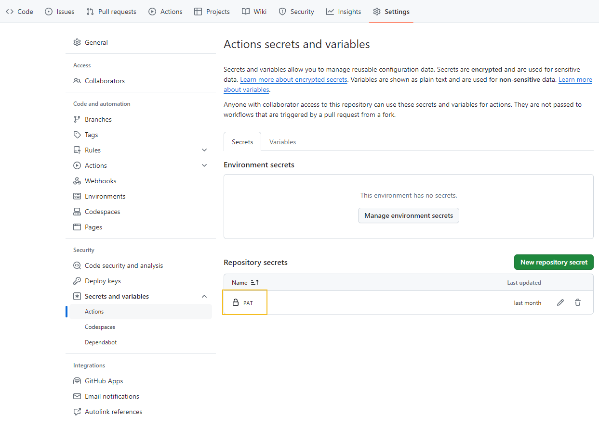

I've written, about [GitHub Codespaces](https://github.com/features/codespaces) before, in the article [Coding on the Cloud - Getting Started with GitHub Codespaces](https://luke.geek.nz/azure/Getting-Started-with-GitHub-Codespaces/), this article builds on it by supplying a Codespace setup for Infrastructure as Code *(IaC)* coding, including Bicep and Terraform, and Linting.

<!-- truncate -->

:::tip
The **[lukemurraynz/Codespace_IaC_Coding](https://github.com/lukemurraynz/Codespace_IaC_Coding/)** Codespace includes essential tools for Infrastructure as Code development for Azure, tools like Azure CLI, PowerShell, Azure Bicep, Azure Developer CLI (azd), Terraform, TFLint, and Terragrunt. **Feel free to fork, clone, or contribute to the repository. This template is aimed at getting you up and coding as soon as possible!**
:::

* **[Azure CLI](https://learn.microsoft.com/cli/azure/what-is-azure-cli?WT.mc_id=AZ-MVP-5004796)**: The Azure Command-Line Interface (CLI) is a cross-platform command-line tool to connect to Azure and execute administrative commands on Azure resources.
* **[PowerShell](https://learn.microsoft.com/powershell/scripting/overview?view=powershell-7.4&WT.mc_id=AZ-MVP-5004796)**: PowerShell is a cross-platform task automation solution made up of a command-line shell, a scripting language, and a configuration management framework.
* **[Azure Bicep](https://learn.microsoft.com/azure/azure-resource-manager/bicep/overview?tabs=bicep&WT.mc_id=AZ-MVP-5004796)**: Bicep is a domain-specific language (DSL) that uses declarative syntax to deploy Azure resources. In a Bicep file, you define the infrastructure you want to deploy to Azure, and then use that file throughout the development lifecycle to repeatedly deploy your infrastructure. 
* **[Azure Developer CLI (azd)](https://learn.microsoft.com/azure/developer/azure-developer-cli/overview?WT.mc_id=AZ-MVP-5004796)**: Azure Developer CLI (azd) is an open-source tool that accelerates the time it takes for you to get your application from local development environment to Azure. azd provides best practice, developer-friendly commands that map to key stages in your workflow, whether you're working in the terminal, your editor or integrated development environment (IDE), or CI/CD (continuous integration/continuous deployment).
* **[Terraform](https://www.terraform.io/)**: Infrastructure automation to provision and manage resources in any cloud or data center.
* **[TFLint](https://github.com/terraform-linters/tflint)**: A Terraform linter for detecting errors that cannot be detected by terraform plan.
* **[Terragrunt](https://terragrunt.gruntwork.io/)**: A thin wrapper for Terraform that provides extra tools for working with multiple Terraform modules.

:::info
Because this repository includes tools for both Bicep and Terraform IaC, it can take a few minutes to set up the Codespace. The setup process installs the necessary tools and extensions for Bicep and Terraform development. If you need to use only one of the tools, you can remove the unnecessary tools from the `.devcontainer/devcontainer.json` file.
:::

The repository also includes uses [MegaLinter](https://megalinter.io/latest/) to ensure code quality and adherence to best practices. MegaLinter analyzes the codebase for potential issues, coding standards violations, formatting discrepancies, and more across multiple languages and file formats. It helps maintain a high standard of code quality and consistency across the project.

Megalinter can be configured to automatically lint and open up a pull request with the changes, or it can be run manually. The repository is configured to run the MegaLinter on every push to the main branch, by setting a [PAT (Personal Access Token)](https://docs.github.com/en/authentication/keeping-your-account-and-data-secure/managing-your-personal-access-tokens#creating-a-fine-grained-personal-access-token) in the repository secrets. The PAT is used to create a pull request with the linting results. Review the [Megalinter](https://megalinter.io/7.8.0/configuration/) documentation for more information on how to configure it.

VSCode is the default editor in the Codespace, and you can use the integrated terminal to run commands. The repository includes a `.devcontainer/devcontainer.json` file that defines the development container configuration. The configuration includes the tools and extensions required for Bicep and Terraform development, but also the base VSCode settings and extensions.

The Codespace configuration includes the following VSCode settings:

**editor.formatOnSaveMode**: Configures format on save to be applied to the entire file.
**[bicep.experimental.deployPane](https://luke.geek.nz/azure/Azure-Bicep-Deploy-Pane/)**: Enables the experimental deploy pane for Bicep.

VS Code Extensions to be Installed:

* **[ms-azuretools.vscode-azurecontainerapps](https://marketplace.visualstudio.com/items?itemName=ms-azuretools.vscode-azurecontainerapps)**: Azure Container Apps extension.
* **[ms-azuretools.vscode-azureresourcegroups](https://marketplace.visualstudio.com/items?itemName=ms-azuretools.vscode-azureresourcegroups)**: Azure Resource Groups extension.
* **[ms-azuretools.vscode-bicep](https://marketplace.visualstudio.com/items?itemName=ms-azuretools.vscode-bicep)**: Bicep extension.
* **[GitHub.copilot](https://marketplace.visualstudio.com/items?itemName=GitHub.copilot)**: GitHub Copilot extension.
* **[GitHub.copilot-chat](https://marketplace.visualstudio.com/items?itemName=GitHub.copilot-chat)**: GitHub Copilot Chat extension.
* **[ms-vscode.azure-account](https://marketplace.visualstudio.com/items?itemName=ms-vscode.azure-account)**: Azure Account extension.
* **[hashicorp.terraform](https://marketplace.visualstudio.com/items?itemName=HashiCorp.terraform)**: Terraform extension.
* **[golang.Go](https://marketplace.visualstudio.com/items?itemName=golang.Go)**: Go language support extension.

