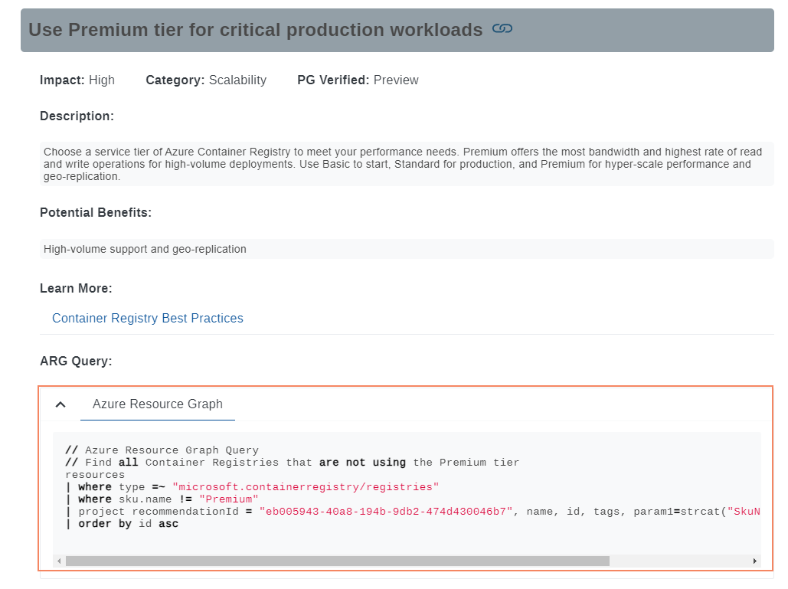
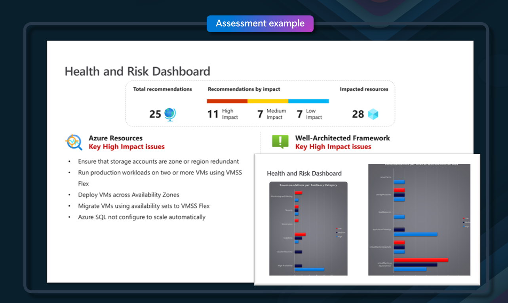
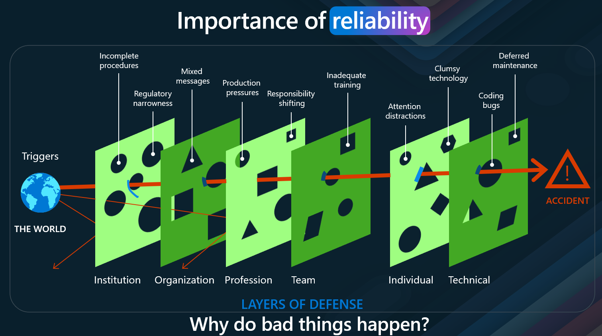
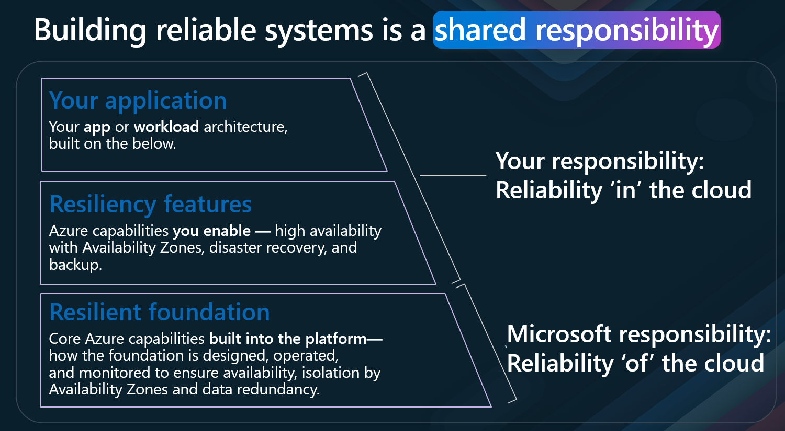
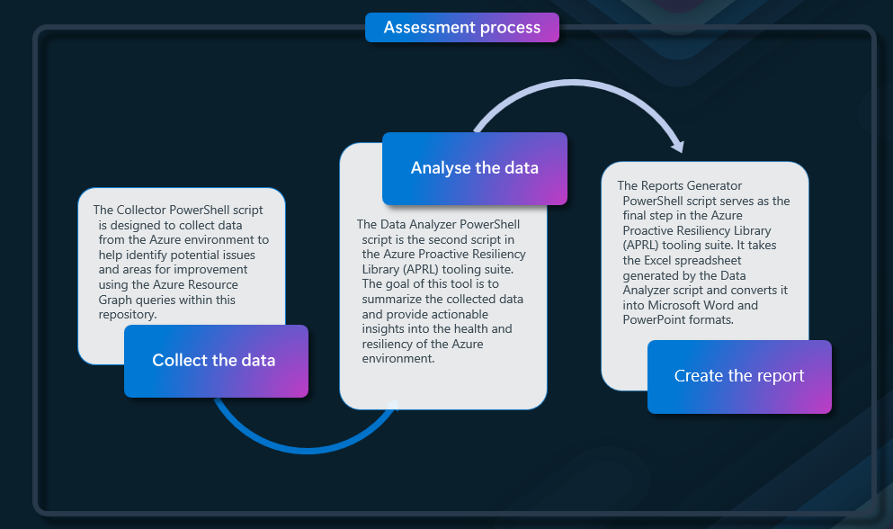
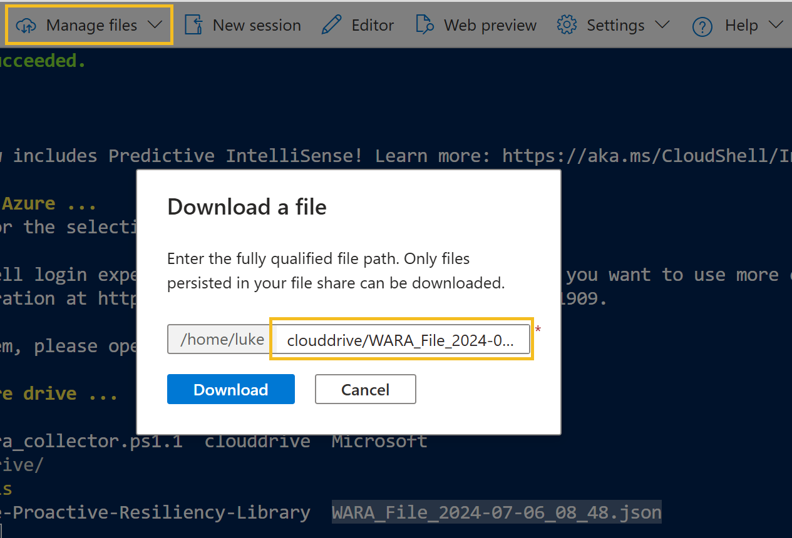

The [Azure Proactive Resiliency Library](https://azure.github.io/Azure-Proactive-Resiliency-Library-v2/) is a curated collection of best practices, guidance, and recommendations designed to improve the resiliency of applications and services running in Azure. Built on the Resiliency pillar of the Well-Architected Framework, this catalog provides valuable insights to ensure your workloads remain robust and reliable.

The library also includes automation capabilities (using Azure Graph queries) that allow you to collect data, analyze it, and generate detailed Word and PowerPoint reports. These reports, part of the Well-Architected Reliability Assessment workshop, provide visibility into the reliability of your Azure workloads. This toolset, often used by Microsoft Cloud Solution architects, can be leveraged to identify areas for improvement in your own Azure estate, following [Resiliency](https://learn.microsoft.com/azure/well-architected/reliability/principles?WT.mc_id=AZ-MVP-5004796) well-architected principles.

In this article, we will walk through the process of running the scripts to collect, analyze and report on resiliency data for your workloads using the Azure Proactive Resiliency Library to help you identify and address potential reliability issues in your Azure environment.

<!-- truncate -->

Along with recommendations, to increase Azure resource resilincy, supplementing the guidance on the Well-Architected Framework, the proactive resiliency library includes sample [Azure Resource Graph queries](https://learn.microsoft.com/azure/governance/resource-graph/overview?WT.mc_id=AZ-MVP-5004796), to determine the current state of your resources.



An improvement to this automation, is the ability to run queries to collect, analyse and create a Word and PowerPoint report for your Azure workloads, these reports are part of a Workshop delivery initiative - Well-Architected Reliability Assessment, usually driven by Microsoft Cloud Solution architects, we can leverate the same toolsets, to help increase visibility across the state of the reliability of our own Azure estate. This is not a set and forget tool, but a starting point to help you understand the current state of your resources, and to help you make informed decisions on how to improve the reliability of your Azure workloads, and an avanue to highlight Reliability improvements. This process works best when its scoped to a specific workload, vs an entire environment.

> This article is not mean't as a subsitute for Microsoft delivered Resiliency workshop, but mainly to help get you started on your resiliency journey. The information in this article is based on the [Azure Proactive Resiliency Library v2](https://azure.github.io/Azure-Proactive-Resiliency-Library-v2/), and the scripts provided in the public repository.



> So why do we need to consider reliability and resiliency in our Azure workloads?

The answer is simple, to ensure that your applications and services are available and reliable, even when failures occur. This is important for business continuity, and to ensure that your customers can access your services when they need them.



When managing resources and workloads in Azure, ensuring reliability is paramount to avoid unexpected failures and downtime. But why exactly do bad things happen, even when there seem to be numerous safeguards in place? Let's delve into the concept of reliability and why it's essential for your Azure environment by exploring the "Swiss Cheese Model" of accident causation, illustrated in the image above.

The [Swiss Cheese Model](https://en.wikipedia.org/wiki/Swiss_cheese_model), developed by James Reason, is a popular way to understand how errors and failures occur in complex systems. Each layer of defense—represented as slices of Swiss cheese—has holes, or weaknesses. When these holes align across multiple layers, an accident can occur. Let's break down this model and see how it applies to Azure reliability.

* Institutional Level: At the highest level, institutions may have incomplete procedures and regulatory narrowness. In the context of Azure, this could mean inadequate governance policies or lack of compliance with best practices. These gaps can create vulnerabilities that might be exploited, leading to system failures.
* Organizational Level: Organizations often face mixed messages and production pressures. For Azure, this could translate to conflicting priorities between rapid deployment and maintaining robust security and reliability. Pressure to deliver quickly might lead to overlooked reliability checks, creating potential points of failure.
* Professional Level: At the professional level, issues such as responsibility shifting can arise. In an Azure environment, this might occur when there is a lack of clear ownership over different components of the architecture, leading to neglected maintenance and updates.
* Team Level: Teams might suffer from inadequate training. In Azure, this could mean insufficient knowledge about Azure services, leading to suboptimal configuration and management of resources. Proper training ensures that teams can effectively manage and troubleshoot their environments.
* Individual Level: Individual contributors might be distracted or make errors. In Azure, this could involve misconfigurations or overlooking critical logs and alerts. Encouraging a culture of attention to detail and thoroughness can help mitigate these risks.
* Technical Level: Finally, technical issues such as clumsy technology, coding bugs, and deferred maintenance can directly impact reliability, in Azure, this might involve outdated software versions, unpatched vulnerabilities, or inefficient resource configurations.

By understanding the layers of defense and potential triggers for failures, you can take proactive steps to enhance the reliability of your Azure resources and workloads, ensuring a robust, secure, and efficient cloud environment.

The Azure Proactive Resiliency library and the assessments we will run through, will concentrate on the technical level, to ensure that your Azure resources are configured correctly and are resilient to failures, however the other layers of defense are also important to consider, and is a [shared responsibility](https://learn.microsoft.com/azure/reliability/overview?WT.mc_id=AZ-MVP-5004796#reliability-requirements) between Microsoft and the customer.



So - lets get started with the Azure Proactive Resiliency Library and the assessment report.

## Azure Proactive Resiliency Library - Assessment Report

The Assessment report is a 3 stage process

1. collect the data
2. analyse the data
3. create the report



> You can do both the data collection in an Azure CloudShell, which is useful for running this in customer environments, however to create and analyse the data you will need to run the script from a computer that has Word and Excel installed.

**Its worth noting, that not all services, will be supported by the automated resource graph queries, so you will need, to check any services that are not supported manually, and when looking at running this for Production workloads, remember to consider the business context around the resiliency requirements.**

###  Collect the data

The Collector PowerShell script is designed to collect data from the Azure environment to help identify potential issues and areas for improvement using the Azure Resource Graph queries within this repository.

| Parameter         | Description                                                                                                              | Example                                                                    |
| ----------------- | ------------------------------------------------------------------------------------------------------------------------ | -------------------------------------------------------------------------- |
| TenantID          | Optional; tenant to be used.                                                                                             | 12345678-1234-1234-1234-123456789012                                       |
| SubscriptionIds   | Required (or SubscriptionsFile); Specifies Subscription(s) to be included in the analysis.                               | 12345678-1234-1234-1234-123456789012, 12345678-1234-1234-1234-123456789012 |
| SubscriptionsFile | Optional (or SubscriptionIds); Specifies the file with the subscription list to be analyzed (one subscription per line). | subscriptions.txt                                                          |
| RunbookFile       | Optional; Specifies the file with the runbook (selectors & checks) to be used.                                           | runbook.json                                                               |
| ResourceGroups    | Optional; Specifies Resource Group(s) to be included in the analysis.                                                    | ResourceGroup1,ResourceGroup2                                              |
| Debug             | Optional; Writes Debugging information of the script during the execution.                                               | TRUE                                                                       |


1. Open an [Azure Cloud Shell](https://shell.azure.com/) session
2. Type in: 
  
  ```powershell
 wget https://github.com/Azure/Azure-Proactive-Resiliency-Library-v2/raw/main/tools/1_wara_collector.ps1
 .\1_wara_collector.ps1 -SubscriptionIds 'YOURSUBID'
  ```
3. Once the script has completed, you will have a JSON file with the data collected, and can proceed to the next step.


###  Analyse the data

The Data Analyzer PowerShell script is the second script in the Azure Proactive Resiliency Library (APRL) tooling suite. The goal of this tool is to summarize the collected data and provide actionable insights into the health and resiliency of the Azure environment.

If you have used the CloudShell in the previous step, you will need to download the JSON file to your local machine, to run the Data Analyzer script.

> _(The Data Analyzer script must be run from a Windows Machine with Excel installed.)_



Once the file is downloaded, you can run the Data Analyzer script, to create the ExcelPlan.

1. Open a PowerShell 7 terminal
2. Download the Data Analyzer script:

```powershell
https://github.com/Azure/Azure-Proactive-Resiliency-Library-v2/raw/main/tools/2_wara_data_analyzer.ps1
# Define the URL of the file to be downloaded
$url = "https://github.com/Azure/Azure-Proactive-Resiliency-Library-v2/raw/main/tools/2_wara_data_analyzer.ps1"
# Define the path where the file will be saved
$outputPath = "d:\APRL\"
# Use Invoke-WebRequest to download the file
Invoke-WebRequest -Uri $url -OutFile $outputPath
```


Once downloaded, we can run it against the JSON file, from the Data Collector script.
  
  ```powershell
$JSONFile = 'WARA_File_2024-07-06_08_48.json'
.\2_wara_data_analyzer.ps1 -JSONFile $JSONFile
  ```


You should now have an Excel Action Plan, with the data from the JSON file, including the recommendations and the current state of the resources.


| Worksheet Name    | Description                                                                                                                                                                                                         |
| ----------------- | ------------------------------------------------------------------------------------------------------------------------------------------------------------------------------------------------------------------- |
| Recommendations   | You will find all Recommendations, their category, impact, description, learn more links, and much more. Note that Columns A and B are counting the number of Azure Resources associated with the RecommendationID. |
| ImpactedResources | You will find a list of Azure Resources associated with a RecommendationID. These are the Azure Resources NOT following Microsoft best practices for Reliability.                                                   |
| PivotTable        | You will find a couple of pivot tables used to automatically create the charts.                                                                                                                                     |
| Charts            | You will find 3 charts that will be used in the Executive Summary PPTx.                                                                                                                                             |
| ResourceTypes     | You will find a list of all ResourceTypes the customer is using, number of Resources deployed for each one, and if there are Recommendations for the ResourceType in APRL.                                          |

> There will be resources that are not supported by the Resource Graph queries, so you will need to check these manually. Remove/add any recommendations based on your analysis prior to generating reports

###  Create the report

The Report Generator PowerShell script is the final script in the Azure Proactive Resiliency Library (APRL) tooling suite. The goal of this tool is to generate a Word and PowerPoint report based on the data collected and analyzed by the Collector and Data Analyzer scripts.

Now that we have our main Excel Action plan with the data, we can run the Report Generator script to create the Word and PowerPoint reports.

The previous script, would have downloaded the git repository for the Azure Proactive Library to your local device, so you can run the Report Generator script directly from that, the script needs to be ran.

This script requires specific Microsoft PowerPoint and Word templates:

* Mandatory - Executive Summary presentation - Template.pptx
* Optional - Assessment Report - Template.docx

These are stored in the Tools folder of the Azure Proactive Library repository.

The 3_wara_report_generator.ps1 script has the following parameters:

| Parameter        | Description                                                                                                                                         | Example Demo Parameters          |
| ---------------- | --------------------------------------------------------------------------------------------------------------------------------------------------- | -------------------------------- |
| ExcelFile        | Mandatory; WARA Excel file generated by ‘2_wara_data_analyzer.ps1’ script and customized.                                                           | C:\\path\\to\\WARA_Analysis.xlsx |
| CustomerName     | Optional; specifies the Name of the Customer to be added to the PPTx and DOCx files.                                                                | Contoso Ltd                     |
| Heavy            | Optional; runs the script at a lower pace to handle heavy environments.                                                                             | TRUE                             |
| WorkloadName     | Optional; specifies the Name of the Workload of the analyses to be added to the PPTx and DOCx files.                                                | E-commerce Platform              |
| PPTTemplateFile  | Optional; specifies the PPTx template file to be used as source. If not specified the script will look for the file in the same path as the script. | C:\\path\\to\\Template.pptx      |
| WordTemplateFile | Optional; specifies the DOCx template file to be used as source. If not specified the script will look for the file in the same path as the script. | C:\\path\\to\\Template.docx      |
| Debugging        | Optional; Writes a Debugging information to a log file.                                                                                             | TRUE                             |

1. Open a PowerShell 7 terminal
2. Run the following script _(adjust for your needs, it will look in the same folder that the script is located in for the word and excel templates)_:

  ```powershell
$Excellocation = 'D:\APRL\WARA Action Plan 2024-07-06_21_22.xlsx'
$WorkLoadName = 'eCommerce'
$CustomerName = 'Contoso Ltd'
cd D:\APRL\Azure-Proactive-Resiliency-Library\tools\
.\3_wara_reports_generator.ps1 -ExcelFile $Excellocation -WorkLoadName $WorkLoadName -CustomerName $CustomerName
  ```


The script will generate a Word and PowerPoint report, with the data from the Excel Action Plan, and the recommendations for the Azure resources, that have been automatically included. You then have the ability to add additional information, and recommendations, based on the analysis of the data, and the business context around the resources.


More detail can then be added into the Word document.


## 📖 References: 

* [Overview and Usage of APRL Scripts
](https://azure.github.io/Azure-Proactive-Resiliency-Library-v2/tools/script-overviews/)
* [Reliability design principles](https://learn.microsoft.com/azure/well-architected/reliability/principles?WT.mc_id=AZ-MVP-5004796)
* [Azure Advisor Resiliency Reviews](https://learn.microsoft.com/azure/advisor/advisor-resiliency-reviews?WT.mc_id=AZ-MVP-5004796)

