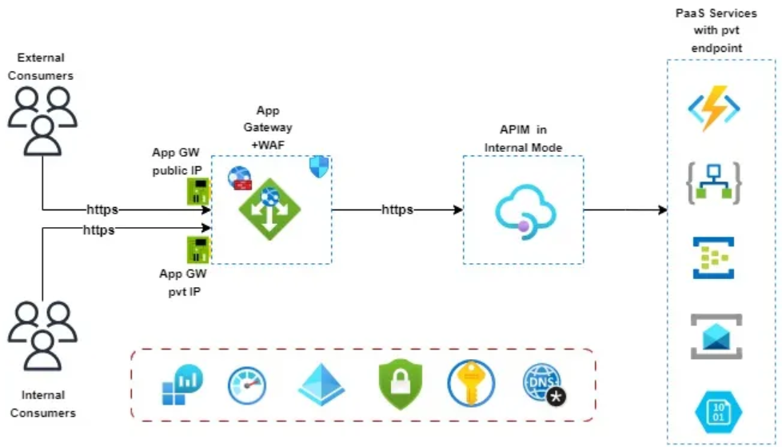
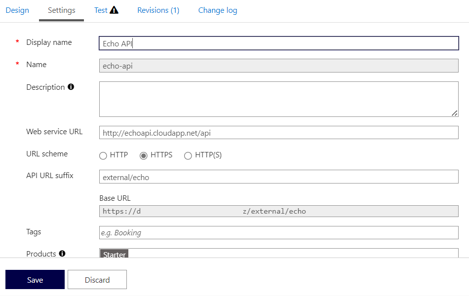
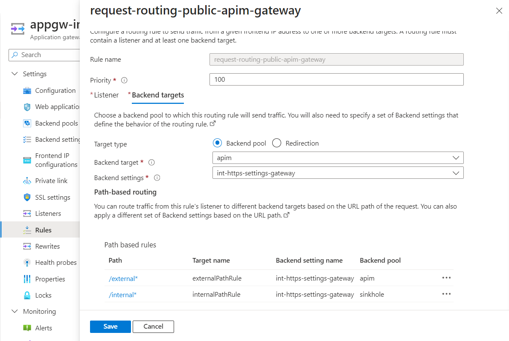

When you use an [Azure API Management](https://learn.microsoft.com/azure/api-management/api-management-key-concepts?WT.mc_id=AZ-MVP-5004796) solution in Internal mode, you may also want to use an [Azure Application Gateway](https://learn.microsoft.com/azure/application-gateway/overview?WT.mc_id=AZ-MVP-5004796) to provide additional security and performance features for external consumers as well and contain a mix of both Internal *(to your own vnet and private dns)* and *(external, accessed via public DNS)* APIs.


_(Image courtesy of: [Azure APIM and Application Gateway Integration](https://medium.com/@thahif.86/azure-apim-and-application-gateway-integration-9039378ba197))_

In this scenario, you can use the following paths on your APIs:

- **Internal**: `https://apim.yourdomain.com/internal/echo`
- **External**: `https://apim.yourdomain.com/external/echo`



<!-- truncate -->

Where the path of Internal is only intended for internal consumers and internal APIs, and the external path is intended to be accessed externally *(and in some cases internally)*. You can drop all traffic that reaches the Azure Application Gateway with an /internal URL by routing it to a backend that doesn't exist.

To do this, you can create a Backend Pool named sinkhole and a Rule to route traffic to the sinkhole pool based on the path using the Application Gateway path routing rules.



Here is the Terraform code on how you might implement this:

```hcl
## Public/external gateway rules
  url_path_map {
    name = "path-based-routing"

    default_backend_address_pool_name  = "apim"
    default_backend_http_settings_name = "int-https-settings-gateway"

    path_rule {
      name                       = "externalPathRule"
      paths                      = ["/external*"]
      backend_address_pool_name  = "apim"
      backend_http_settings_name = "int-https-settings-gateway"
    }

    path_rule {
      name                       = "internalPathRule"
      paths                      = ["/internal*"]
      backend_address_pool_name  = "sinkhole"
      backend_http_settings_name = "int-https-settings-gateway"
    }
  }

  request_routing_rule {
    name               = "request-routing-public-apim-gateway"
    rule_type          = "PathBasedRouting"
    http_listener_name = "https-gateway-public"
    url_path_map_name  = "path-based-routing"
    priority           = "100"
  }

```

This Terraform code is configuring an Azure Application Gateway, which is a web traffic load balancer that enables you to manage traffic to your web applications.

Here's a breakdown of what each section does:

* url_path_map: This block defines a URL path-based routing rule. It specifies how HTTP traffic is routed to different backend pools based on the URL paths of the HTTP requests.
* default_backend_address_pool_name and default_backend_http_settings_name define the default backend pool and HTTP settings to use if none of the specified path rules match.
* Two path_rule blocks are defined. Each path_rule specifies a condition (based on the URL path) and the corresponding backend pool and HTTP settings to use when the condition is met. The first rule routes requests with paths starting with "/external" to the "apim" backend pool. The second rule routes requests with paths starting with "/internal" to the "sinkhole" backend pool.
request_routing_rule: This block defines a request routing rule, determining how the Application Gateway distributes traffic to the backend pools.
* rule_type is set to "PathBasedRouting," which means the rule is based on URL paths.
* http_listener_name specifies the HTTP listener to associate with the rule.

url_path_map_name specifies the URL path map to use, which is defined in the url_path_map block.

Priority sets the priority of the rule. Lower numbers have higher priority. If a request matches multiple rules, the rule with the highest priority is applied.

So let us look at the sinkhole configuration:

```hcl
  backend_address_pool {
    name  = "sinkhole"
    fqdns = null
  }
```

Here's a breakdown of what each line does:

* backend_address_pool: This block defines a backend address pool, which is a collection of IP addresses to which the Application Gateway can route network traffic.
* "sinkhole": This line sets the name of the backend address pool to "sinkhole." This name is used to reference the backend address pool in other parts of the configuration.
* fqdns = null: This line sets the fully qualified domain names (FQDNs) of the backend addresses to null. This means that the backend address pool does not contain any backend addresses. In the context of a "sinkhole" pool, this is likely intended to discard traffic or direct it to a non-existent endpoint.

I hope this helps you understand how to configure a sinkhole pool in Azure Application Gateway using Terraform. This allows you to offer both external and internal APIs through the gateway. You can also have a private listener with a different routing rile if you want to offer all the internal and external APIs to your internal consumers/networks.

📖 References: 

- 🔗[Deploy your Azure API Management instance to a virtual network - internal mode](https://learn.microsoft.com/azure/api-management/api-management-using-with-internal-vnet?tabs=stv2&WT.mc_id=AZ-MVP-5004796)
- 🔗[Protect APIs with Application Gateway and API Management](https://learn.microsoft.com/azure/architecture/web-apps/api-management/architectures/protect-apis?WT.mc_id=AZ-MVP-5004796)
- 🔗[URL Path Based Routing overview](https://learn.microsoft.com/azure/application-gateway/url-route-overview?WT.mc_id=AZ-MVP-5004796)
- 🔗[apim-landing-zone-accelerator](https://github.com/Azure/apim-landing-zone-accelerator)
