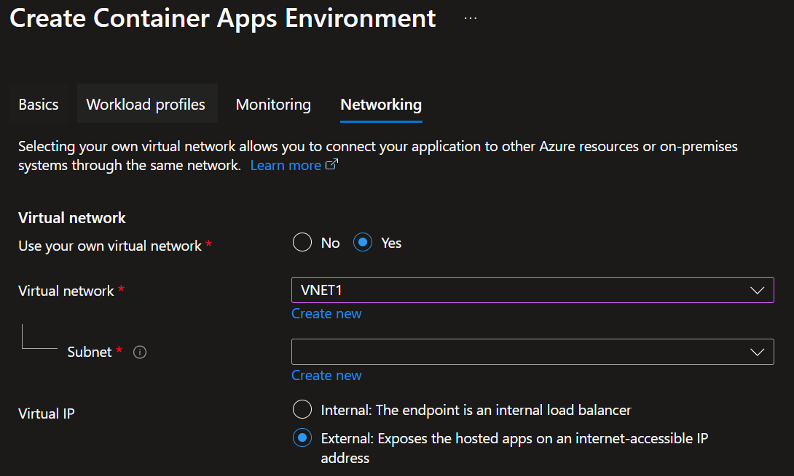
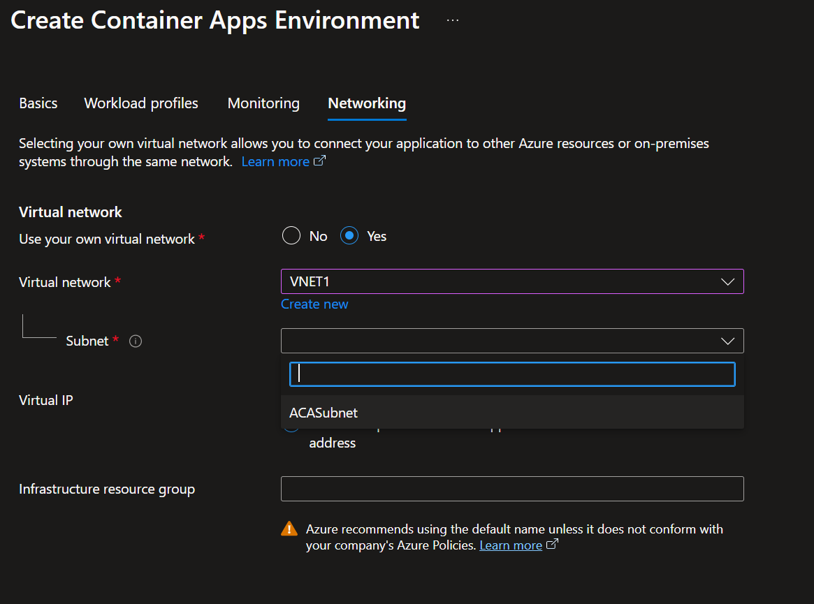
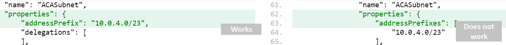

When attempting to deploy a Container Apps Environment, integrated into a VNET (Virtual Network) that was pre-created you may have issues selecting a subnet which your Container Apps Environment should be deployed into, as your subnet may not be appearing in the Azure Portal to select.



Before we continue make sure that the subnet address ranges matches at least:

| Workload Profile | Minimum Subnet Size for Virtual Network Integration |
|------------------|----------------------------------------------------|
| Standard         | /27                                                 |
| Consumption      | /23                                                 |

If you have a subnet that meets the requirements, you can proceed with trying the following steps.

1. Delete the Subnet you want to use to deloy your Container Apps environment into it.
2. Now we need to recreate the subnet using the Azure CLI *(you can use the [Azure CloudShell](https://learn.microsoft.com/azure/cloud-shell/overview?WT.mc_id=AZ-MVP-5004796))* by running the following command *(replace the values with your own)*:

```bash
az network vnet subnet create --resource-group RG1  --vnet-name VNET1  --name ACASubnet  --address-prefix '10.0.4.0/23'
```

After running the command, you should now be able to select the subnet created in the Azure Portal.



If we look at the differences between a subnet created in the Azure Portal Container Apps Environment experience and one created using the Azure CLI, we can see that there are differences:



Working

```json
"properties": {
    "addressPrefix": "10.0.4.0/23"
}
```

Non-Working

```json
"properties": {
    "addressPrefixes": [
        "10.0.4.0/23"
    ]
}
```

In the non-working example, the addressPrefixes property is used instead of addressPrefix.

The difference lies in how the address prefix is represented:

* Working Example: Uses addressPrefix as a single string property.
* Non-working Example: Uses addressPrefixes as an array with one element

📖 References: 

* 🔗[Guided project - Deploy and manage a container app using Azure Container Apps](https://learn.microsoft.com/training/modules/deploy-manage-container-app-using-azure-container-apps/?WT.mc_id=AZ-MVP-5004796)
* 🔗[Networking in Azure Container Apps environment](https://learn.microsoft.com/azure/container-apps/networking?tabs=workload-profiles-env%2Cazure-cli&WT.mc_id=AZ-MVP-5004796)
