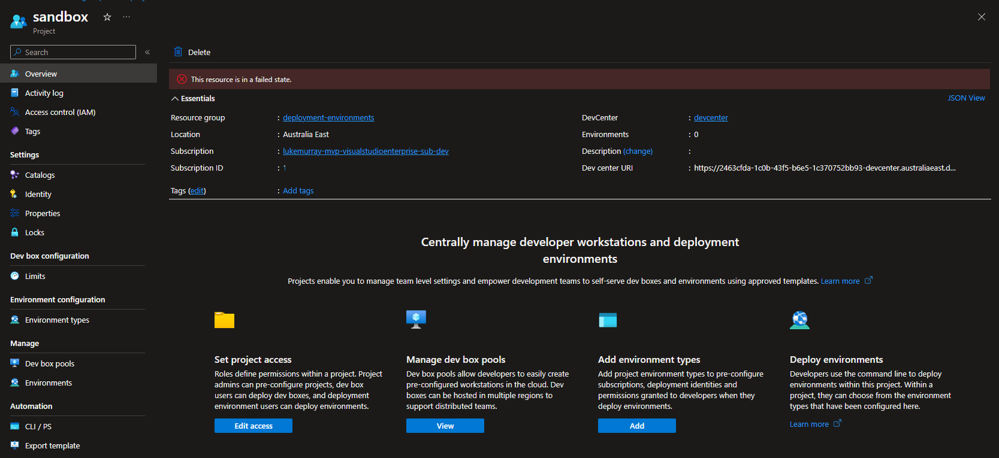
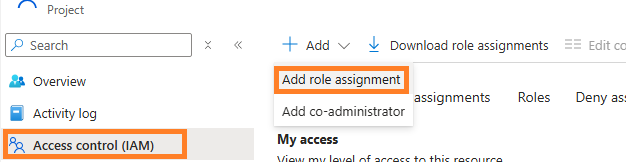
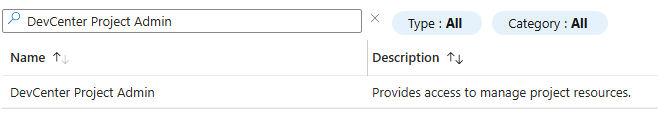
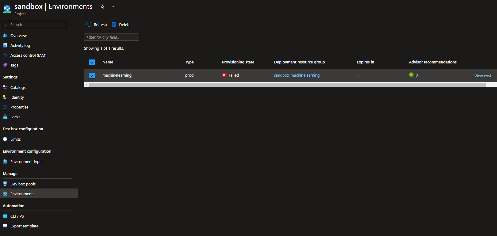

When attempting to delete a devcenter project, you may encounter the following error:

:::warning
This resource is in a failed state.
:::

<!-- truncate -->

:::info
The error message usually occurs when environments are created for these projects. This prevents the deletion of the Environment Type / Project / DevCenter. This behavior is designed to prevent accidental deletion.
:::

1. Sign-in to the [Azure Portal](https://azure.microsoft.com/get-started/azure-portal?WT.mc_id=AZ-MVP-5004796) go to the project page.
2. Select Access Control (IAM) in the left panel, then click Add and choose Add role assignment

3. Search the **DevCenter Project Admin** and grant this role to yourself

4. After the operation executes successfully, try to delete the project again

If this doesn't work, then you may need to delete the Environment first; if you get an Internal Server error, then wait 2 minutes and retry the deletion again. 

