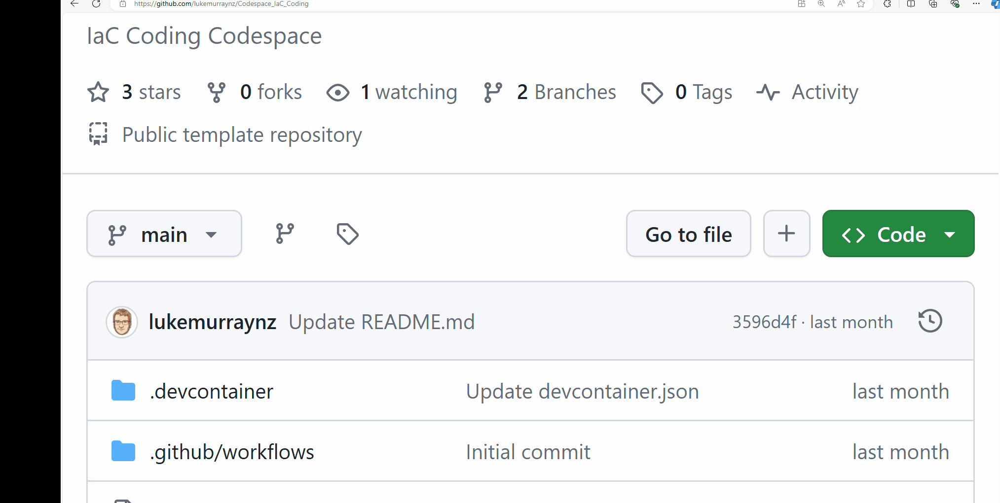
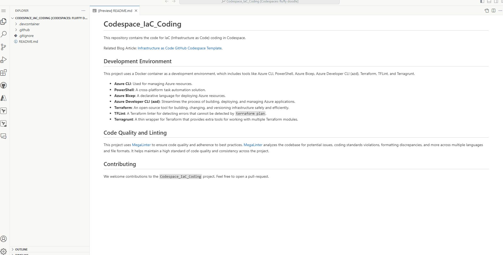
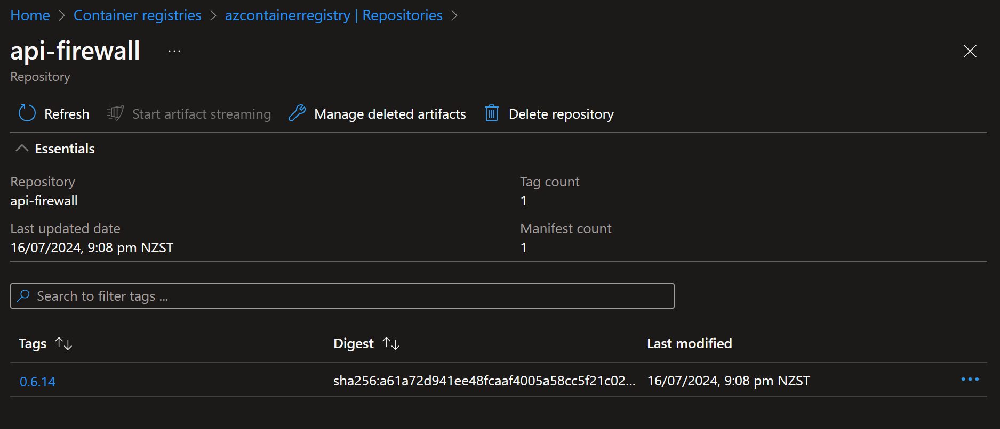

[GitHub Codespaces](https://github.com/features/codespaces) already have Docker preinstalled, as a dependency for the Codespaces environment. This article will guide you on how to pull and push a Docker image from DockerHub to Azure Container Registry using GitHub Codespaces.
::info
This article assumes you have an [Azure Container Registry](https://learn.microsoft.com/azure/container-registry/?WT.mc_id=AZ-MVP-5004796) and a [DockerHub](https://hub.docker.com/) account.
:::

1. Launch a Codespace, for example: [lukemurraynz/Codespace_IaC_Coding](https://github.com/lukemurraynz/Codespace_IaC_Coding)

2. Install the [Docker extension](https://marketplace.visualstudio.com/items?itemName=ms-azuretools.vscode-docker) for Visual Studio Code in the Codespace
3. Open the Docker extension and sign in to DockerHub

4. Now we need to login to our Azure Registry, under Registry, select Azure and connect and login to your Azure account
5. Now we don't  have any images, so we need to pull it down from the dockerhub. Open the terminal and run the following command:

::info
Replace `api-firewall:0.6.14` with the image and tag you want to pull from DockerHub.
:::

```bash
docker pull api-firewall:0.6.14
```
6. Now that our image is pulled down from the Dockerhub, we need to tag it with our Azure Container Registry, and push it. We can do this directly from the Docker extension.
7. Right click and select Push
8. Select Azure as the provider, and select your Azure Container Registry
9. Now we need to tag the image with the Azure Container Registry, so we can push it. You can adjust the name and Tag and click Ok to Push it.

10. Now, navigate to your Azure Container Registry in the Azure Portal, and you should be able to see your new image in the repository.


You have now successfully pulled and pushed a Docker image from DockerHub to Azure Container Registry using GitHub Codespaces.
