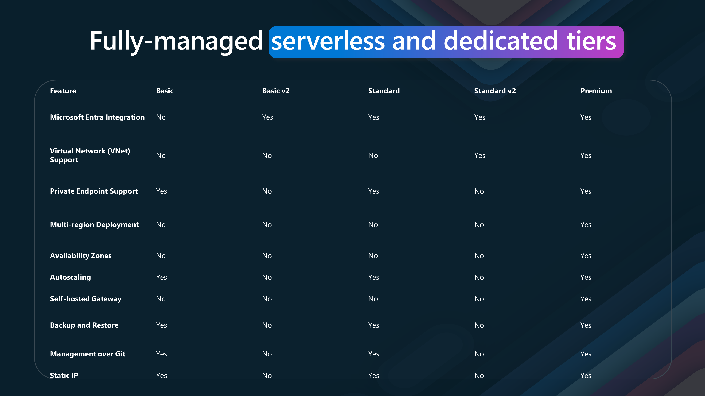

Today, we are going to look at [Azure API Management](https://learn.microsoft.com/azure/api-management/api-management-key-concepts?WT.mc_id=AZ-MVP-5004796). Azure API Management is a service that creates consistent and modern API gateways for existing back-end services. It also publishes APIs to external, partner, and internal developers. Azure API Management is a fully managed service that enables customers to publish, secure, transform, maintain, and monitor APIs.

{/*truncate*/}

# Azure API Management Overview

> [Azure API Management](https://learn.microsoft.com/azure/api-management/api-management-key-concepts?WT.mc_id=AZ-MVP-5004796) is a hybrid, multi-cloud management platform for APIs across all environments. As a platform-as-a-service, API Management supports the complete API lifecycle.

We'll examine the API life cycle phases in-depth and explore how Azure API Management can help you efficiently manage your APIs from start to finish.

- **Design**
The first phase of the API life cycle is Design. In this phase, we define the API's purpose, endpoints, and the data it will handle. This involves creating a blueprint for the API, including its structure and functionality. Azure API Management provides tools and templates to help you design efficient, scalable, and easy-to-use APIs.
- **Develop**
Once the design is in place, we move on to the development phase. This is where the actual coding happens. Developers write the code that implements the API's functionality based on the design specifications. Azure API Management supports various development environments and integrates seamlessly with tools like Visual Studio, making the development process smoother and more efficient.
- **Secure**
Security is a critical aspect of API management. We ensure our APIs are protected from unauthorized access and potential threats in the Secure phase. Azure API Management offers robust security features such as authentication, authorization, and encryption. These features help safeguard your APIs and the data they handle, ensuring that only authorized users can access them.
- **Publish**
After securing the API, it's time to make it available to users. The Publish phase involves exposing the API to developers and end-users. Azure API Management provides a developer portal where you can publish your APIs, offer documentation, and manage subscriptions. This makes it easy for developers to discover and start using your APIs.
- **Scale**
As your API gains popularity, you must ensure it can handle increased traffic. The Scale phase focuses on optimizing the API's performance and scalability. Azure API Management allows you to scale your APIs effortlessly, ensuring they can handle large volumes of requests without compromising performance.
- **Monitor**
Monitoring is essential to ensuring your APIs are functioning correctly and efficiently. Azure API Management provides detailed analytics and logging capabilities in the Monitor phase. You can track usage patterns, monitor performance metrics, and identify potential issues before they impact your users.
- **Analyze**
In the Analyze phase, we use the data collected during monitoring to gain insights into how our APIs are used. Azure API Management offers powerful analytics tools that help you understand user behavior, identify trends, and make data-driven decisions to improve your APIs continuously.

In the modern digital era, transformation is more than just a buzzword—it's necessary. APIs are at the heart of this transformation, enabling connected experiences and seamless integration of services and data.

APIs are crucial in connecting various devices and platforms. Whether it's a smart home system, wearable technology, automotive applications, or industrial equipment, APIs facilitate the communication and interoperability between these diverse endpoints.

Please be sure to think about your daily interactions with technology. From unlocking your smartphone, using applications on your tablet, streaming content on your smart TV, and engaging in augmented reality experiences, APIs are working behind the scenes to ensure a smooth and connected experience. They enable devices and applications to talk to each other, share data, and create a cohesive user experience.

APIs connect various services, databases, servers, and cloud infrastructures. They allow these systems to interact, share data, and coordinate complex functions.

APIs also enable businesses to be agile and adaptive. By exposing functionalities through APIs, companies can quickly integrate new services, scale their operations, and meet evolving customer demands. They empower developers to build robust applications, enhance user experiences, and drive digital growth.

## API governance

Three crucial aspects of API governance and usage play a significant role in achieving success: 

- **Façade Abstraction**
This concept involves creating an interface that simplifies and standardizes how APIs interact with backend systems.
Aggregate or Slice: APIs can aggregate data from multiple sources or slice it into meaningful pieces for specific use cases. This flexibility allows businesses to present data in the most relevant and valuable way to their users.
Normalize or Modernize: Façade Abstraction also helps normalize or modernize legacy systems, making them compatible with modern applications. This allows you to extend the life of older systems and integrate them with new technologies without extensive rework.
Decouple Lifecycle Mock: Decoupling the API lifecycle from the backend systems ensures that changes in backend services do not disrupt the API functionality. Mocking services during the development and testing phases further ensures smooth transitions and updates.
- **Front Door Control**
This aspect is about managing and controlling how APIs are accessed and utilized.
Route and Accelerate: By routing API requests efficiently, you can optimize your applications' performance and responsiveness. Acceleration techniques like caching and load balancing can significantly improve user experience.
Secure and Protect: Security is paramount in API management. Front Door Control involves implementing robust security measures to protect APIs from threats and unauthorized access. These measures include authentication, authorization, and data encryption.
Transform and Observe: Transforming API requests and responses to meet specific requirements and observing API usage patterns helps maintain control and ensure optimal performance. Monitoring tools provide insights into how APIs are being used and can alert you to potential issues before they become critical.
- **Frictionless Consumption**
This principle is about making it easy for developers and users to discover, access, and use your APIs.
Onboarding: A smooth onboarding process is crucial for attracting and retaining users. Clear documentation, tutorials, and support help users quickly understand and start using your APIs.
Discover and Learn: APIs should be easily discoverable. A well-organized developer portal where users can learn about the available APIs, their functionalities, and use cases can achieve this.
Try and Obtain Access: Allowing users to try APIs in a sandbox environment and easily obtain access through streamlined registration encourages experimentation and adoption.

## Stakeholders

Azure API Management has the following stakeholders:
 
- **App Developers** 
These are the individuals or teams responsible for creating applications that consume APIs. They use the platform to discover, learn, try, onboard, and get help with APIs.
Employees, Partners.
- **Customers**
These stakeholders leverage the APIs to enhance workflows, integrate systems, and improve customer experiences.
- **Apps on Devices**
These represent the end-user applications that interact with the APIs. They could be mobile apps, web applications, IoT devices, or other software that consumes APIs.

## Planes

:::info
Azure API Management consists of three main planes:
 
- **User Plane**
Developer Portal: This portal serves as the primary interface for app developers. It provides resources for developers to discover, learn, try, and onboard with APIs. The portal ensures developers have the support they need to integrate APIs efficiently into their applications.
- **Data Plane**
Gateway: The Gateway is a secure bridge between the API consumers and the backend services. It enforces security policies, manages traffic, and ensures reliable API performance. The gateway handles rate limiting, authentication, and request routing tasks.
- **Management Plane**
API Management Plane: This is where API providers manage the lifecycle of their APIs. The management plane includes tools for abstracting, securing, evolving, observing, and monetizing APIs. This layer ensures that APIs are managed effectively, from creation and deployment to monitoring and analytics.
:::

Azure API Management integrates with various Azure services and microservices, providing a cohesive environment for managing and deploying APIs. This integration allows organizations to leverage the full power of Azure's cloud capabilities, ensuring that their APIs are scalable, secure, and performant.

- **Benefits**

Some of the benefits of Azure API Management include:

* Discoverability: Developers can easily find and access APIs.
* Security: Robust security measures protect data and ensure compliance.
* Scalability: APIs can scale to meet growing demand.
* Efficiency: Streamlined management processes enhance productivity.
* Monetization: Organizations can generate revenue from their APIs.

In conclusion, Azure API Management is a robust platform that enables organizations to create, manage, and scale APIs efficiently. By following the API life cycle phases and leveraging Azure API Management's features, businesses can deliver seamless digital experiences, drive innovation, and stay ahead in today's competitive landscape.

## Azure API Management plans

Azure API Management offers various service tiers, each designed to provide specific capabilities and benefits. Let's explore these tiers in more detail.

- **Consumption Tier**
 
Key Features include:

* No Infrastructure to Provision or Manage: The consumption tier eliminates the need to manage infrastructure. This serverless approach lets you focus solely on your APIs without worrying about the underlying hardware or software.
* Built-in Auto-scaling Down to Zero: It automatically scales to handle varying loads and can scale down to zero during inactivity, ensuring cost-efficiency.
* Consumption-based Micro Billing: Billing is based on actual usage, making it a cost-effective solution for unpredictable or fluctuating traffic applications.
* Variable, Usage-based Monthly Cost: You pay only for what you use, allowing for a flexible and budget-friendly approach.
* No Reserved Capacity: This tier does not require any reserved capacity, making it ideal for projects with uncertain demands.
* Shared Management Plane: The management plane is shared, simplifying administration and reducing costs.
* On-demand Activation: APIs can be activated on demand, providing flexibility and agility.
* Curated Set of Features and Usage Limits: This tier offers a curated set of features and usage limits, ensuring a streamlined and efficient API management experience.

- **Developer, Basic, Standard, and Premium Tiers**
 
Key Features include:

* No Infrastructure to Provision or Manage: Similar to the consumption tier, these tiers also eliminate the need to manage infrastructure, allowing you to focus on development and deployment.
* Manual Scaling or External Auto-scaling: These tiers support manual scaling or external auto-scaling, providing more control over resource allocation.
* Billing Based on Reserved Capacity: Billing is based on reserved capacity, offering predictable and consistent costs.
* Constant, Predictable Monthly Cost: Unlike the consumption tier, these tiers provide a constant, predictable monthly cost, making budget planning easier.
* Reserved Capacity: These tiers offer reserved capacity, ensuring that your APIs can handle consistent and high-demand workloads.
* Dedicated Management, User, and Data Planes: With dedicated planes, you get enhanced security, performance, and isolation, which is crucial for mission-critical applications.
* Always On APIs are always available, ensuring high availability and reliability for your applications.
* Full Set of Features: These tiers offer complete features without governance limits, providing comprehensive capabilities for complex and large-scale API management needs.

Let's delve into the key features of each tier.

| Feature                        | Basic | Basic v2 | Standard | Standard v2 | Premium |
| ------------------------------ | ----- | -------- | -------- | ----------- | ------- |
| Microsoft Entra Integration    | No    | Yes      | Yes      | Yes         | Yes     |
| Virtual Network (VNet) Support | No    | No       | No       | Yes         | Yes     |
| Private Endpoint Support       | Yes   | No       | Yes      | No          | Yes     |
| Multi-region Deployment        | No    | No       | No       | No          | Yes     |
| Availability Zones             | No    | No       | No       | No          | Yes     |
| Autoscaling                    | Yes   | No       | Yes      | No          | Yes     |
| Self-hosted Gateway            | No    | No       | No       | No          | Yes     |
| Backup and Restore             | Yes   | No       | Yes      | No          | Yes     |
| Management over Git            | Yes   | No       | Yes      | No          | Yes     |
| Static IP                      | Yes   | No       | Yes      | No          | Yes     |

> "Accelerate your API strategy with Azure API Management, the comprehensive lifecycle solution trusted by thousands of enterprises worldwide. From abstraction and security to observability and discoverability, the APIM platform empowers you to manage APIs effortlessly across clouds and on-premises environments. Built for reliability, security, scalability, and performance, it's designed to support DevOps and developers, seamlessly integrating with Azure services. Benefit from global availability, robust support, and competitive, accessible pricing—Azure API Management simplifies API management so you can focus on innovation."

## API Lifecycle

The API lifecycle consists of several phases, each essential for creating, managing, and optimizing APIs. This lifecycle emphasizes the continuous and iterative nature of API development and management.

- **Design**

The lifecycle begins with the Design phase. In this phase, APIs are conceptualized and defined. 

Key features include:

* Start fast with proxy mode: Quickly create an API proxy to start testing.
* Design and mock: Define and simulate APIs to validate their design.
* Import from a definition: Use existing API definitions to create new APIs.
* Import from Azure resources: Generate APIs based on Azure services.
* Capture schema from test calls: Automatically generate API schemas from sample requests and responses.

- **Develop**

The next phase is Develop, where the API is built and refined. This stage includes:

* 50+ policies: Apply various policies to control API behavior.
* SOAP-to-REST: Convert SOAP services to RESTful APIs.
* Visual Studio Code integration: Use VS Code for development and debugging.
* Live policy debugging: Debug policies in real-time.
* API scaffolding: Automatically generate code and configurations for APIs.

-**Secure**

In the Secure phase, the API's security is ensured. This involves:

* Data | Management | User planes: Secure different aspects of data and management.
* Keys, OAuth, certificates, custom: Implement authentication and authorization mechanisms.
* 1st and 3rd party identity providers: Integrate with various identity providers.
* Request/response validation: Validate API requests and responses for security.
* IP-based access control: Restrict access based on IP addresses.
* Private networking: Secure APIs within private networks.
* Compliance: Ensure APIs comply with industry standards and regulations.

- **Publish**

After securing the API, it is time to Publish it. This stage involves:

* Revisions and versions: Manage different versions and revisions of the API.
* API products, user groups, subscriptions: Organize APIs into products and manage user access.
* Customizable developer portal: Provide a portal for developers to access and use APIs.
* Integrated API playground: Allow developers to test APIs within the portal.
* Export to the Power Platform: Integrate APIs with Microsoft Power Platform.
* Self-service onboarding: Enable users to onboard themselves.
* DevOps: Integrate with DevOps pipelines for continuous integration and deployment.

- **Scale**

Once published, the API needs to be scaled to handle increased demand. The Scale phase includes:

* Worldwide availability: Deploy APIs globally to ensure availability.
* Multi-region deployments: Distribute APIs across multiple regions for redundancy and performance.
* Availability zones: Utilize availability zones to increase reliability.
* Caching: Implement caching to improve performance.
* Auto-scaling: Automatically adjust resources based on demand.
* Hybrid and multi-cloud: Deploy APIs in hybrid and multi-cloud environments.
* Azure Arc enabled: Manage and govern APIs across different environments using Azure Arc.

- **Monitor**

The API must be monitored after scaling to ensure it operates correctly. The Monitor phase involves:

* Azure Monitor: Use Azure Monitor to track and analyze API performance.
* Application Insights: Gain insights into application performance and user behavior.
* Logs | Metrics | Traces | Alerts: Collect and analyze logs, metrics, and traces and set up alerts.
* Configurable verbosity: Adjust the level of detail in logs and metrics.
* E2E request tracing: Trace requests end-to-end to diagnose issues.
* Local telemetry for self-hosted gateway: Collect telemetry data from self-hosted API gateways.

- *Analyze*

Finally, in the Analyze phase, the collected data is used to gain insights and improve the API. This stage includes:

* Built-in reports: Use built-in reports for quick insights.
* Custom reports with Log Analytics: Create custom reports using Log Analytics.
* Reports in Power BI: Visualize data and generate reports using Power BI.
* Custom telemetry pipelines: Set up custom telemetry pipelines for advanced analysis.

This lifecycle ensures that APIs are well-designed, developed, secured, published, scaled, monitored, and analyzed, providing a comprehensive approach to API management.

### Design

Code-and design-first approaches to building APIs

API Management supports both approaches to building APIs: 

- **Code-first approach**
Implement the API and generate the API specification as an afterthought (i.e., with Swashbuckle). Benefits: 
More convenient for API developers: The only option for existing APIs

- **Design-first approach**
Create an API specification, review it with stakeholders, and implement the API Kickstart development by scaffolding the code from the API specification. 

Benefits: 

Better API consumer experience thanks to the deliberate API design Reduced risk thanks to the API review processes

You can create APIs

* Support for SOAP, REST, WebSocket and GraphQLAPIs
* Import an API from OpenAPI(1, 2, or 3), WADL, or WSDL files
* Import an API from App Service, Logic App, Function App, or Container App
* Create a blank API

So let us create a new API, by importing the [Star Wars API](https://swapi.dev/).

1. Open your Azure API Management instance
2. Navigate to: APIs
3. Click on + Add API
4. Click on HTTP (manually define an HTTP API)
5. Select Full
5. Fill in the details:
   - Display name: Star Wars
   - Name: star-wars
   - Description: Star Wars API
   - Web service URL: https://swapi.dev/api
   - API URL suffix: starwars
6. Click Create
Now that we have imported our initial API endpoint, we can start to define the operations that we want to expose.
1. Click on + Add operation
2. Fill in the details:
   - Display name: Get People
   - Name: get-people
   - URL template: /people
   - HTTP verb: GET
Now, lets add another operation,, to get information about Starships in the Star Wars universe. Fill in the details:
   - Display name: Get Starships
   - Name: get-starships
   - URL template: /starships
   - HTTP verb: GET

Now lets test it.

1. Click on Get Starships API operation
2. Click on test
3. Click + Add parameter 
4. Type in Search in the name, and the value as 'Star Destroyer'
5. Click Send

:::tip
You can use a wildcard in the URL path, if you are not sure of an accurate specification, while you work on the API design.

:::

Now that we have imported and tested an existing API, lets consider the design of a new API.

