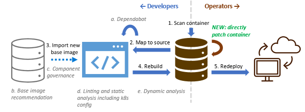
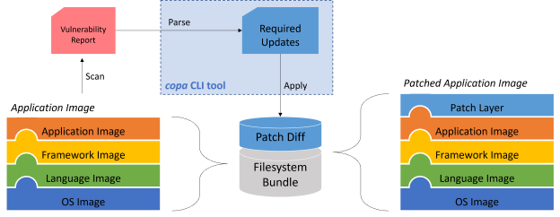
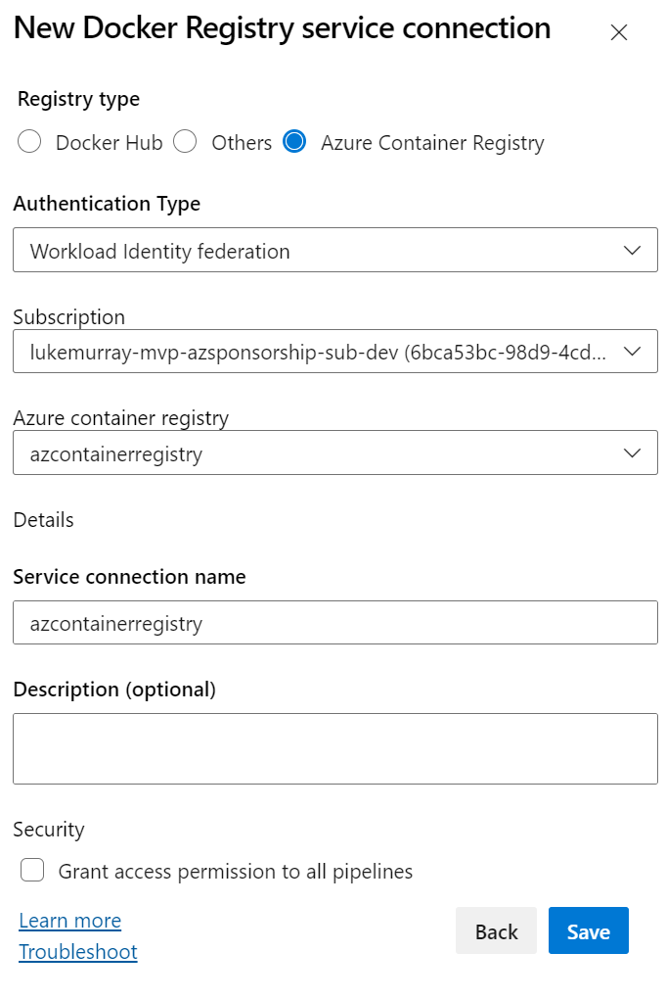
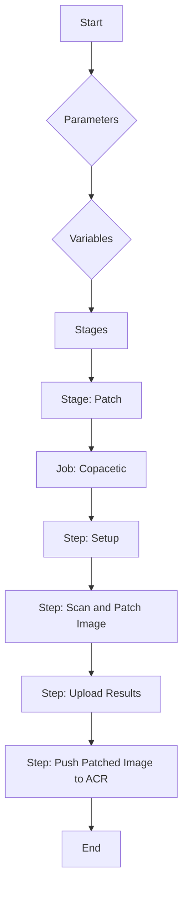
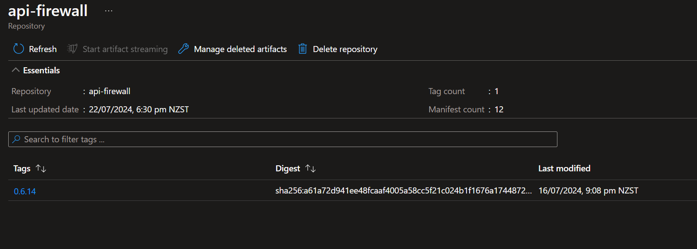
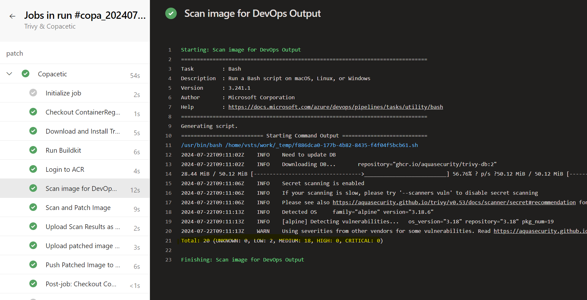
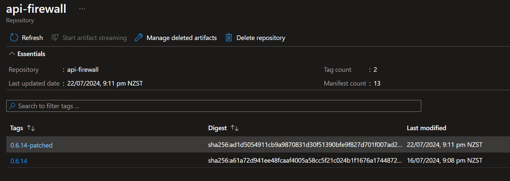

[Copacetic](https://project-copacetic.github.io/copacetic/website/) (or Copa for short) is a CLI tool written in Go and based on buildkit that can be used to directly patch container images given the vulnerability scanning results from popular tools like [Trivy](https://github.com/aquasecurity/trivy).

[Trivy](https://aquasecurity.github.io/trivy/) is a security scanner that can scan container images for vulnerabilities. It is a simple and comprehensive scanner that can be used to scan images for vulnerabilities in the OS packages, application dependencies, and language-specific packages, supplemented by vulnerability databases supplemented with Copa, which can be used to patch the vulnerabilities found by Trivy; this tool can be used to quickly patch container images without going upstream for a full rebuild, which may require more time, and the involvement of multiple teams _(ie Developers, Q&A, Operations, Support)_ to patch, test and deploy.

In this article, we will use [Azure DevOps](https://azure.microsoft.com/products/devops?WT.mc_id=AZ-MVP-5004796) to run a pipeline that will use [Trivy](https://aquasecurity.github.io/trivy/) to scan a container image for vulnerabilities, and then use [Copa](https://project-copacetic.github.io/copacetic/website/) to patch the vulnerabilities found by Trivy, and then push the patched image to an [Azure Container Registry (ACR)](https://azure.microsoft.com/products/container-registry?WT.mc_id=AZ-MVP-5004796).

{/* truncate */}

## 📋Overview

:::info
[Copa](https://github.com/project-copacetic/copacetic) gives the ability to patch containers quickly without going upstream for a complete rebuild. As the window between [vulnerability disclosure and active exploitation](https://www.bleepingcomputer.com/news/security/hackers-scan-for-vulnerabilities-within-15-minutes-of-disclosure/) continues to narrow, there is a growing operational need to patch critical security vulnerabilities in container images so they can be quickly redeployed into production.

In addition to filling the operational gap not met by left-shift security practices and tools, the ability of Copa to patch a container without requiring a rebuild of the container image provides other benefits:



* Allows users other than the image publishers also to patch container images, such as DevSecOps engineers.
* Reduces the storage and transmission costs of redistributing patched images by only creating an additional patch layer instead of rebuilding the entire image, which usually results in different layer hashes that break layer caching.
* Reduces the turnaround time for patching a container image by not having to wait for base image updates and being a faster operation than a full image rebuild.
* Reduces the complexity of patching the image from running a rebuild pipeline to running a single tool on the image.
:::

:::warning
Copa currently only supports OS package vulnerabilities and does not support application dependencies or language-specific packages. When validated and tested with developers, it is recommended to use Copa in conjunction with Trivy to patch OS package vulnerabilities and other tools to patch application dependencies and language-specific packages.
:::

:::info
The copa tool is an extensible engine that:

Parses the needed update packages from the container image’s vulnerability report produced by a scanner like Trivy. New adapters can be written to accommodate more report formats.
Obtains and processes the needed update packages using the appropriate package manager tools such as apt, apk, etc. New adapters can be written to support more package managers.
Applies the resulting update binaries to the container image using buildkit.



This approach is motivated by the core principles of making direct container patching broadly applicable and accessible:

* Copa supports patching existing container images _(Devs don't need to build their images using specific tools or modify them in some way to support container patching)_.
* Copa supports containers without package managers, including distro less containers
* Copa works with the existing vulnerability scanning and mitigation ecosystems.
_(Image publishers don't need to create new workflows for container patching since Copa supports patching container images using the security update packages already being published today.)_
_(Consumers do not need to migrate to a new and potentially more limited support ecosystem for custom distros or change their container vulnerability scanning pipelines to include remediation since Copa can be integrated seamlessly as an extra step to patch containers based on those scanning reports.)_
* Copa reduces the technical expertise needed and waiting on dependencies needed to patch an image.
_(For OS package vulnerabilities, no specialized knowledge about a specific image is needed to be patch it as Copa relies on the vulnerability remediation knowledge already embedded in the reports produced by popular container scanning tools today.)_
:::

## 🚀Azure DevOps deploy

So let's get started by creating a new Azure DevOps pipeline that will use Trivy to scan a container image for vulnerabilities, and then use Copa to patch the vulnerabilities found by Trivy, and then push the patched image to an Azure Container Registry (ACR).

First we need to create the Service Connection, we can create a [Docker Registry service connection](https://learn.microsoft.com/azure/devops/pipelines/ecosystems/containers/publish-to-acr?WT.mc_id=AZ-MVP-5004796).



Then, we can use the pipeline to connect to the Container Registry and patch the Container.



Make sure you update the parameters, and Service Principal variable name with the up-to-date versions of Trivy, Copacetic and BuildKit, at the time you run this, and of course the container image you want to patch.

### 🛠️Pipeline

You can also find the full pipeline code at the following gist: [lukemurraynz/copacetic.yml](https://gist.github.com/lukemurraynz/ea00bc9c6b6a9468a82f3b679c40a220).

```yaml copacetic.yml
## The name of the pipeline, including the date and a revision number
name: copa_$(Date:yyyyMMdd)_$(Rev:r)

## This pipeline is not triggered automatically by any event
trigger: none

## This pipeline is not triggered automatically by any pull request
pr: none

## Parameters for the pipeline
parameters:
  # The Docker image to be patched
  # This parameter specifies the Docker image that will be patched by the pipeline.
  - name: image
    displayName: Image To Patch
    type: string
    default: "azcontainerregistry.azurecr.io/api-firewall:0.6.14"

  # The version of Trivy to be used
  # Trivy is a Simple and Comprehensive Vulnerability Scanner for Containers and other Artifacts,
  # suitable for CI. This parameter specifies the version of Trivy to be used in the pipeline.
  - name: trivyVersion
    displayName: 'Trivy Version'
    type: string
    default: '0.53.0'

  # The version of Copacetic to be used
  # Copacetic is a tool for checking the health of services. This parameter specifies the version
  # of Copacetic to be used in the pipeline.
  - name: copaVersion
    displayName: 'Copacetic Version'
    type: string
    default: '0.7.0'

  # The version of BuildKit to be used
  # BuildKit is a toolkit for converting source code to build artifacts in an efficient, 
  # expressive and repeatable manner. This parameter specifies the version of BuildKit to be used in the pipeline.
  - name: buildkitVersion
    displayName: 'BuildKit Version'
    type: string
    default: '0.15.0'

## Variables for the pipeline
variables:
  # The port on which BuildKit will run
  buildkit.port: "8888"
  # The name of the service connection to be used
  serviceConnectionName: 'azcontainerregistry'
  # The system.debug variable is set to true. This enables verbose logging for the entire pipeline.
  # When this is enabled, Azure Pipelines will output more detailed logs, which can be helpful for debugging.
  system.debug: false

stages:
  - stage: patch
    jobs:
    - job: Copacetic
      steps:
        - bash: |
            # Exit immediately if a command exits with a non-zero status
            set -e
            # Download the Trivy tarball from the specified URL
            wget "https://github.com/aquasecurity/trivy/releases/download/v${{ parameters.trivyVersion }}/trivy_${{ parameters.trivyVersion }}_Linux-64bit.tar.gz"
            # Extract the Trivy binary to /usr/local/bin
            sudo tar -C /usr/local/bin -zxvf trivy_${{ parameters.trivyVersion }}_Linux-*.tar.gz trivy
            # Make the Trivy binary executable
            sudo chmod +x /usr/local/bin/trivy
            # Download the Copacetic tarball from the specified URL
            wget "https://github.com/project-copacetic/copacetic/releases/download/v${{ parameters.copaVersion }}/copa_${{ parameters.copaVersion }}_linux_amd64.tar.gz"
            # Extract the Copacetic binary to /usr/local/bin
            sudo tar -C /usr/local/bin -zxvf copa_${{ parameters.copaVersion }}_*.tar.gz copa
            # Make the Copacetic binary executable
            sudo chmod +x /usr/local/bin/copa
          displayName: Download and Install Trivy and Copa

        - bash: |
            # This script is used to run a new Docker container in the background.
            # 'set -e' is used to exit the script immediately if a command exits with a non-zero status.
            set -e
            # The 'docker run' command is used to start a new Docker container.
            # The '--detach' option is used to run the container in the background and print the new container ID.
            # The '--rm' option is used to automatically remove the container when it exits.
            # The '--privileged' option is used to give extended privileges to this container.
            # The '-p' option is used to publish the container's port to the host.
            # The '--name' option is used to assign a name to the container.
            # The '--entrypoint' option is used to overwrite the default ENTRYPOINT of the image.
            # The '--addr' option is used to specify the listening address of the BuildKit daemon.
            docker run \
              --detach \
              --rm \
              --privileged \
              -p 127.0.0.1:$(buildkit.port):$(buildkit.port)/tcp \
              --name buildkitd \
              --entrypoint buildkitd \
              "moby/buildkit:v${{ parameters.buildkitVersion }}" \
              --addr tcp://0.0.0.0:$(buildkit.port)
          displayName: Run Buildkit

        - task: Docker@2
          displayName: Login to ACR
          inputs:
            command: login
            containerRegistry: $(serviceConnectionName)
            # This task uses the Docker@2 task to log in to Azure Container Registry (ACR)
            # The 'command: login' input tells the task to perform a 'docker login' command
            # The 'containerRegistry: $(serviceConnectionName)' input specifies the service connection to use for logging in
            # The service connection contains the credentials needed to authenticate with ACR

        - bash: |
            # Exit immediately if a command exits with a non-zero status
            set -e
            # Extract the tag from the image name
            tag=${IMAGE#*:}
            # Extract the repository from the image name
            repo=${IMAGE%:*}
            # Scan the image with Trivy and store the output as a JSON file named copa-patch.json
            stdbuf -oL trivy image --vuln-type os --ignore-unfixed $IMAGE | grep Total
          env:
            # The image to be patched
            IMAGE: ${{ parameters.image }}
          displayName: Scan image for DevOps Output

        - bash: |
            # Exit immediately if a command exits with a non-zero status
            set -e
            # Extract the tag from the image name
            tag=${IMAGE#*:}
            # Extract the repository from the image name
            repo=${IMAGE%:*}
            # Scan the image with Trivy and store the output as a JSON file named copa-patch.json
            stdbuf -oL trivy image --vuln-type os --ignore-unfixed -f json $IMAGE | tee copa-patch.json
            # Use the scan result to patch the image, if needed
            copa patch \
              -i $IMAGE \
              -r copa-patch.json \
              -t $tag-patched \
              -a tcp://0.0.0.0:$(buildkit.port)
            docker save -o patched-image.tar $repo:$tag-patched
            # The 'copa patch' command is used to patch the image.
            # '-i $IMAGE' specifies the image to be patched.
            # '-r copa-patch.json' specifies the file containing the scan results.
            # '-t $tag-patched' specifies the tag for the patched image.
            # '-a tcp://0.0.0.0:$(buildkit.port)' specifies the address of the BuildKit daemon.
            # The 'docker save' command is used to save the new patched image as a tar file that can be used later.
          env:
            # The image to be patched
            IMAGE: ${{ parameters.image }}
          displayName: Scan and Patch Image

        - task: PublishPipelineArtifact@1
          inputs:
            targetPath: $(System.DefaultWorkingDirectory)/copa-patch.json
            artifactName: scan_results
          displayName: Upload Scan Results as a pipeline artifact
          # This task uses the PublishPipelineArtifact@1 task to upload the scan results as a pipeline artifact
          # The 'targetPath: $(System.DefaultWorkingDirectory)/copa-patch.json' input specifies the file to upload
          # The 'artifactName: scan_results' input specifies the name of the artifact in the pipeline

        - task: PublishPipelineArtifact@1
          inputs:
            targetPath: $(System.DefaultWorkingDirectory)/patched-image.tar
            artifactName: patched
          displayName: Upload patched image as a pipeline artifact
          # This task uses the PublishPipelineArtifact@1 task to upload the patched image as a pipeline artifact
          # The 'targetPath: $(System.DefaultWorkingDirectory)/patched-image.tar' input specifies the file to upload
          # The 'artifactName: patched' input specifies the name of the artifact in the pipeline

        - bash: |
            # Exit immediately if a command exits with a non-zero status
            set -e
            # Print each command that is executed to the terminal
            set -x
            # Extract the tag from the image name
            tag=${IMAGE#*:}
            # Extract the repository from the image name
            repo=${IMAGE%:*}
            # Tag the patched image with the appropriate repository name
            # The 'docker tag' command creates a new alias for the image
            # The format is 'docker tag source_image target_image'
            # In this case, the source and target images are the same, so this command effectively does nothing
            docker tag $repo:$tag-patched $repo:$tag-patched
            # Push the patched image back to Azure Container Registry
            # The 'docker push' command pushes an image or a repository to a registry
            docker push $repo:$tag-patched
          env:
            # The image to be patched
            IMAGE: ${{ parameters.image }}
          displayName: Push Patched Image to ACR
```

For demo purposes, I am using an older version of the [api-firewall](https://hub.docker.com/_/api-firewall) image, which has known vulnerabilities that must be patched.

## ✅Deployment results

Let's look at the image in Azure Container Registry before the patch.



Now, let us deploy the pipeline and see the results.




After the pipeline has run, we can see the patched image in the Azure Container Registry.



If we re-run the pipeline again, this time targetting our new patched image, we can see that there are no patchable vulnerabilities found.


:::warning
Remember that Copacetic is a tool that can be used to quickly patch container images without going upstream for a full rebuild - HOWEVER, it does not replace the need to do a full rebuild of the image, as it only patches OS package vulnerabilities, and does not support application dependencies or language-specific packages. It is also recommended not to layer patch on top of patch, as this can lead to a bloated image, and potential conflicts between patches, consider patching the same base image other an an already patched image, if new updates occur.
:::
