When working with Microsoft Azure, you may want an environment for learning, testing, or Hackathons. This post will cover some technical implementation considerations for creating a sandbox environment in Azure that could be used for your Hackathons using Terraform, Entra ID Access packages, and GitHub Actions.

{/*truncate*/}

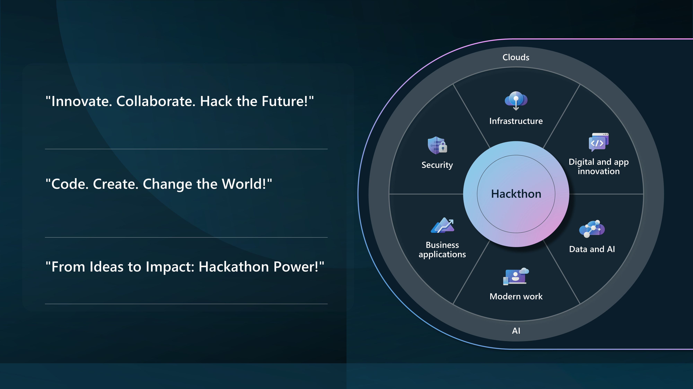

So let us look at a scenario:

> "As a hackathon organizer, I want to build an Azure environment that supports various AI-driven solutions to automate and enhance operational processes, including customer feedback analysis, testing plan creation, and standard procedure refinement."

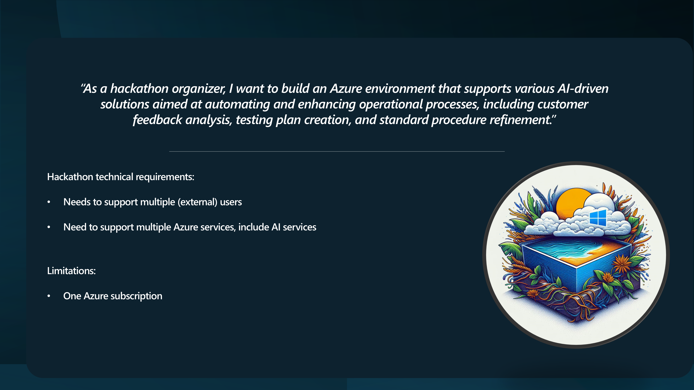

We have a few Technical Requirements:

* It needs to support multiple _(external)_ users and teams from different organizations using Work and Personal accounts who work together.
* Needs to support the creation of multiple Azure resources

And our limitations are:

* One Azure subscription

Let us look at how we can leverage Microsoft Azure technologies to implement this.

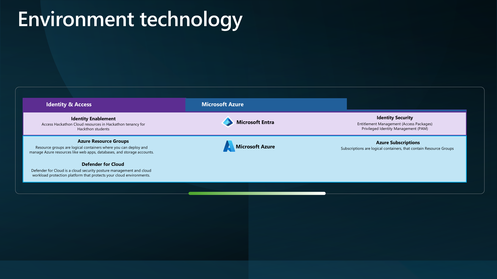

* [Azure Subscription](https://learn.microsoft.com/azure/cost-management-billing/manage/create-subscription?WT.mc_id=AZ-MVP-5004796)
* [Azure Resource Groups](https://learn.microsoft.com/azure/azure-resource-manager/management/overview?WT.mc_id=AZ-MVP-5004796#resource-groups) _(within Azure subscription)_
* [Entra ID](https://learn.microsoft.com/entra/fundamentals/whatis?WT.mc_id=AZ-MVP-5004796)
* [Entra ID Identity Governance - Access Packages](https://learn.microsoft.com/entra/id-governance/entitlement-management-access-package-create?WT.mc_id=AZ-MVP-5004796). This requires a Entra ID P2 license.

For this article, there are some assumptions I will be making, such as:

* A Resource Group per Team is sufficient for the Hackathon.

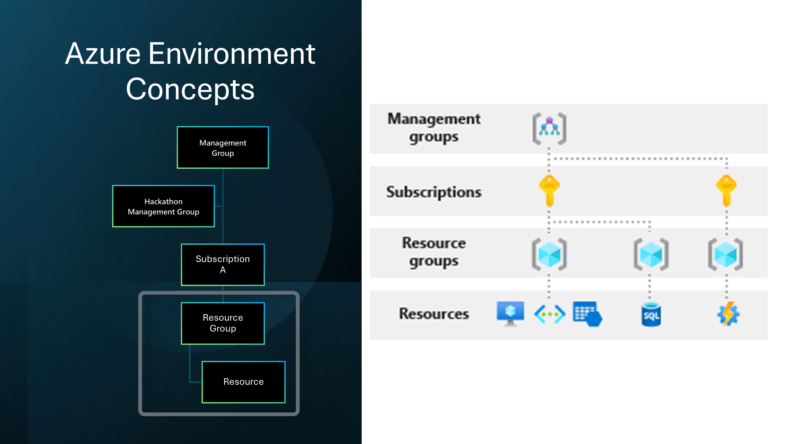

We will approach this as a [Lightly Managed Sandbox](https://luke.geek.nz/azure/microsoft-azure-sandbox-design-considerations/).

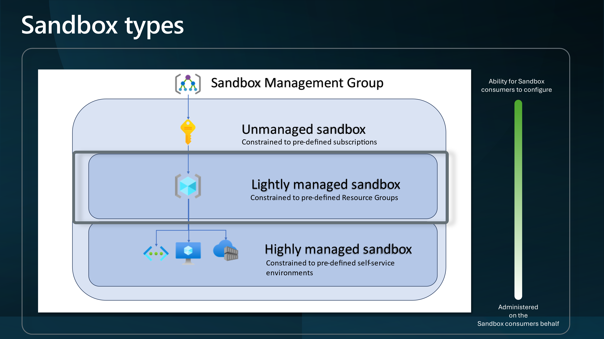

And give External Identities access to an Azure subscription through Access Packages and a Group with a Contributor role assigned to the individual Resource Groups.

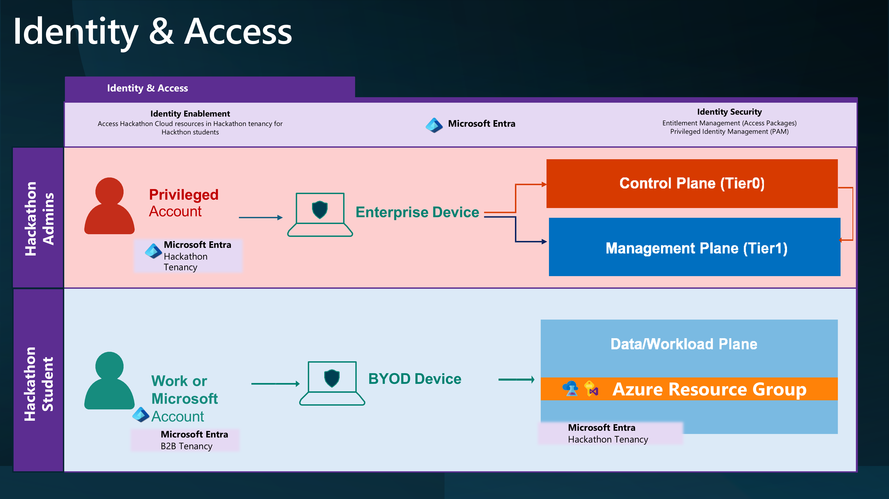

To do this, we will leverage Access packages to invite external users into the Hackathon tenancy and assign them to a group with the Contributor role assigned to the Resource Group.

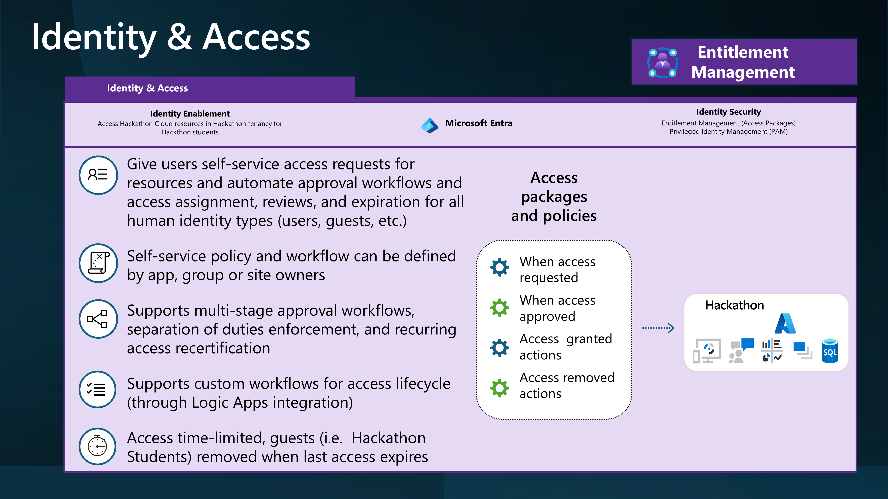

By creating a Policy allowing external organizations to make requests, the Hackathon Organiser can invite external users to the Azure subscription and access internal _(Hackathon)_ resources.

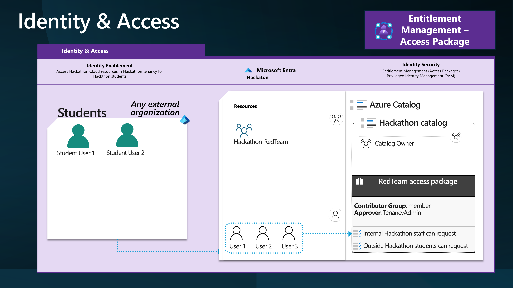
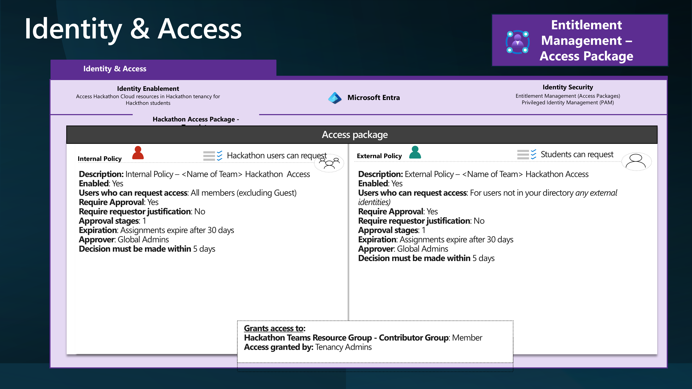


> You may also need to consider [Inbound Cross-tenant Access](https://learn.microsoft.com/entra/external-id/cross-tenant-access-overview?WT.mc_id=AZ-MVP-5004796) setting Trust configuration.

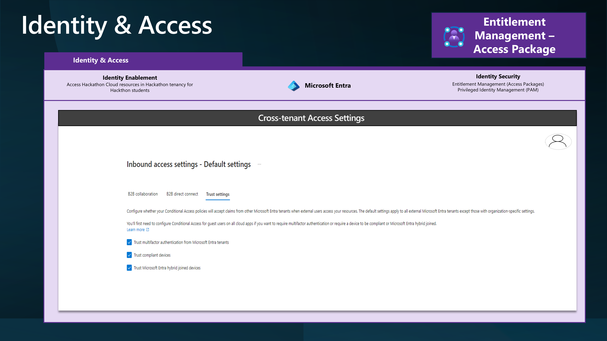

So, let's look at some of the main Terraform code snippets that could be used to create the Azure resources for the Hackathon.

:::info
The identity being used to create these Terraform resources will need the following:

* [Owner](https://learn.microsoft.com/azure/role-based-access-control/role-assignments-portal-subscription-admin?WT.mc_id=AZ-MVP-5004796) of the Azure Subscription to create the Resource Groups and role assignments.
* [Identity Governance Administrator](https://learn.microsoft.com/entra/identity/role-based-access-control/permissions-reference?WT.mc_id=AZ-MVP-5004796#identity-governance-administrator), to create the Access Packages and Catalog.
* [Groups Administrator](https://learn.microsoft.com/entra/identity/role-based-access-control/permissions-reference?WT.mc_id=AZ-MVP-5004796#groups-administrator) role to create and delete the Groups in the Entra ID tenant.
:::

```hcl
locals {
  # Read the content of the CSV file named "az_hackathon.csv" and store it in the local variable "csv_content."
  csv_content = file("az_hackathon.csv")
  # Decode the CSV content into a list of maps, each representing a row in the CSV file.
  csv_data    = csvdecode(local.csv_content)
}
```
This reads a CSV file containing the details of the Azure Resource Groups that need to be created for the Hackathon. I have used this base CSV file.

```csv
Team,Location,Environment,Application,Notes
Team1,AustraliaEast,hackathon,AI,"AI Hackathon for luke.geek.nz."
Team2,canadaeast,hackathon,AI,"AI Hackathon for luke.geek.nz."
Team3,francecentral,hackathon,AI,"AI Hackathon for luke.geek.nz."
Team4,swedencentral,hackathon,AI,"AI Hackathon for luke.geek.nz."
Team5,uksouth,hackathon,AI,"AI Hackathon for luke.geek.nz."
```

Using this and the [AzureRM](https://registry.terraform.io/providers/hashicorp/azurerm/latest) Terraform provider, we can create the Resource Groups and assign the Access Packages to them.

```hcl
## Define an Azure Resource Group resource named "rg".
resource "azurerm_resource_group" "rg" {
  # Create one resource group for each entry in the csv_data list.
  count    = length(local.csv_data)
    # Set the name of the resource group using the Team, Environment, and Application attributes from the csv_data list.
  name     = lower(format("%s-%s-%s-rg", local.csv_data[count.index].Team, local.csv_data[count.index].Environment, local.csv_data[count.index].Application))
    # Set the location of the resource group using the Location attribute from the csv_data list.
  location = local.csv_data[count.index].Location
    # Set tags for the resource group using attributes from the csv_data list.
  tags = {
    Environment = lower(local.csv_data[count.index].Environment)
    Team        = lower(local.csv_data[count.index].Team)
    Application = lower(local.csv_data[count.index].Application)
    Notes       = lower(local.csv_data[count.index].Notes)
  }
}
```

You will create a Resource Group, such as below, for each team based on the CSV file:

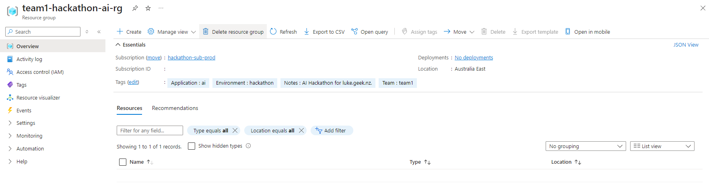

Now we can create the Groups and assign the permissions:

```hcl
## Define an Azure AD Group resource named "ad_group".
resource "azuread_group" "ad_group" {
  # Create one Azure AD group for each entry in the csv_data list.
  count            = length(local.csv_data)
  # Set the display name of the Azure AD group using the Team, Environment, and Application attributes from the csv_data list.
  display_name     = lower(format("%s-%s-%s-group", local.csv_data[count.index].Team, local.csv_data[count.index].Environment, local.csv_data[count.index].Application))
  # Set the description of the Azure AD group using the Team, Environment, and Application attributes from the csv_data list.
  description      = format("Group for %s environment of %s application managed by %s team.", title(local.csv_data[count.index].Environment), title(local.csv_data[count.index].Application), title(local.csv_data[count.index].Team))
  # Disable mail for the Azure AD group.
  mail_enabled     = false
  # Enable security for the Azure AD group.
  security_enabled = true
}

## Define an Azure Role Assignment resource named "role_assignment".
resource "azurerm_role_assignment" "role_assignment" {
  # Create one role assignment for each entry in the csv_data list.
  count                = length(local.csv_data)
  # Set the scope of the role assignment to the ID of the corresponding resource group.
  scope                = azurerm_resource_group.rg[count.index].id
  # Assign the "Owner" role to the principal.
  role_definition_name = "Owner"
  # Set the principal ID to the object ID of the corresponding Azure AD group.
  principal_id         = azuread_group.ad_group[count.index].object_id
}
```

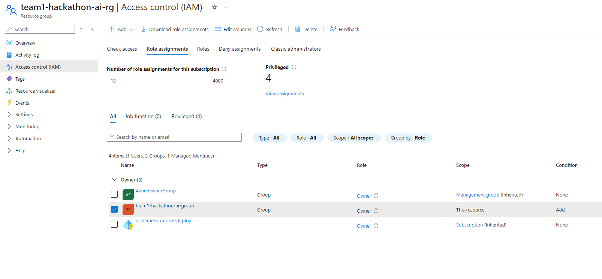'

So now, we have created the Resource Groups and Entra ID groups and assigned Owner permissions to the Resource Groups for each Team in the CSV file; it is time to deploy a base resource - such as Azure OpenAI, which those hackathon teams can use, to get going! [Azure OpenAI models are deployed to various regions](https://learn.microsoft.com/azure/ai-services/openai/concepts/models?WT.mc_id=AZ-MVP-5004796) and have token limits constrained to the region, so we need to consider how heavily these endpoints will be hit - which is why you may have noticed in the CSV, that the location of each Resource Group is different, so we want to use that to make sure that our Azure OpenAI resources are deployed in the same region as the Resource Group, to help balance.

```hcl
## This resource block defines an Azure Cognitive Account resource named "openai"
resource "azurerm_cognitive_account" "openai" {
  # The for_each argument is used to iterate over a map created from local.csv_data.
  # Each entry in the map is identified by an index (idx) and its corresponding value (val).
  for_each = { for idx, val in local.csv_data : idx => val }
  # The name of the cognitive account is dynamically set using the "Team" attribute from each value in the map.
  name = "openai-ca-${lower(each.value.Team)}-${lower(each.value.Location)}"
  # The location of the cognitive account is set using the "Location" attribute from each value in the map.
  location = each.value.Location
  # The resource group name is dynamically set using the key from the map.
  resource_group_name = azurerm_resource_group.rg[each.key].name
  # The kind of cognitive account is set to "OpenAI."
  kind = "OpenAI"
  # The SKU (pricing tier) of the cognitive account is set to "S0".
  sku_name = "S0"
}
```

So we end up with something like this:

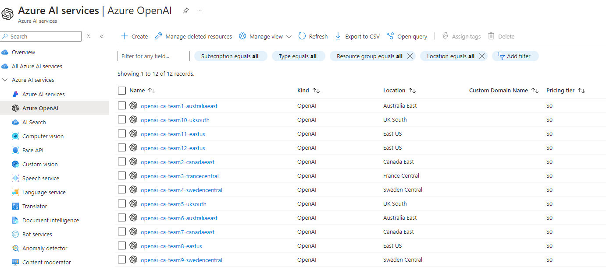

We may also need to consider the Azure [Resource Providers](https://learn.microsoft.com/azure/azure-resource-manager/management/resource-providers-and-types?WT.mc_id=AZ-MVP-5004796), as the Hackathon teams, won't have permissions to register these.

So we can create a map of the Resource Providers, and then iterate over them, to register them.

```hcl
variable "resource_providers" {
  description = "Map of Azure resource providers to register"
  default = {
    "Microsoft.Maps"                    = {}
    "Microsoft.OperationalInsights"     = {}
    "Microsoft.EventGrid"               = {}
    "Microsoft.EventHub"                = {}
    "Microsoft.GuestConfiguration"      = {}
    "Microsoft.HDInsight"               = {}
    "Microsoft.KeyVault"                = {}
    "Microsoft.ContainerService"        = {}
    "Microsoft.DBforMySQL"              = {}
    "Microsoft.DBforMariaDB"            = {}
    "Microsoft.DBforMySQL"              = {}
    "Microsoft.DBforPostgreSQL"         = {}
    "Microsoft.DataFactory"             = {}
    "Microsoft.HealthBot"               = {}
    "Microsoft.HealthModel"             = {}
    "Microsoft.HealthcareApis"          = {}
    "Microsoft.MachineLearning"         = {}
    "Microsoft.Orbital"                 = {}
    "Microsoft.Sql"                     = {}
    // Add the rest of your providers here
  }
}

resource "azurerm_resource_provider_registration" "resourceproviders" {
  for_each = var.resource_providers
  name     = each.key
}
```

Now, we need to create our Entra ID Catalog and Access Packages and assign the Resource Groups to the Access package.

:::warning
The [request policies](https://learn.microsoft.com/entra/id-governance/entitlement-management-access-package-create?WT.mc_id=AZ-MVP-5004796#create-request-policies) themselves, I had issues deploying via Terraform, I suspect due to missing Graph permissions 'EntitlementManagement.ReadWrite.All' on the identity, but had some issues adding this, so did them manually, however, I have successfully deployed the policies in another environment successfully using the: [azuread_access_package_assignment_policy](https://registry.terraform.io/providers/hashicorp/azuread/latest/docs/resources/access_package_assignment_policy) terraform resource. 

Make sure you add:
requests_accepted = true
To the requestors block, enable the policy, or the policy will be deployed as Disabled.
:::
  
  ```hcl
resource "azuread_access_package_catalog" "Sandbox" {
  description  = "Hackathon Sandboxes"
  display_name = "Sandbox"
  published    = true
}

## Define an Azure AD Access Package resource named "access_package"
resource "azuread_access_package" "access_package" {
  # The count parameter determines how many instances of this resource to create based on the length of the csv_data list.
  count = length(local.csv_data)
  # The display_name parameter sets the display name of the access package for each instance,
  # using the Team, Environment, and Application attributes from the csv_data list.
  display_name = format("%s-%s-%s-access-package", local.csv_data[count.index].Team, local.csv_data[count.index].Environment, local.csv_data[count.index].Application)
  # The catalog_id parameter sets the ID of the access package catalog for each instance,
  # using the Sandbox catalog ID.
  catalog_id = azuread_access_package_catalog.Sandbox.id
  # The description parameter sets the description of the access package for each instance,
  # using the Team, Environment, and Notes attributes from the csv_data list.
  description = "Access package for ${local.csv_data[count.index].Team}-${local.csv_data[count.index].Environment}-${local.csv_data[count.index].Notes}"
}

## Assign all groups we have created to our catalog
resource "azuread_access_package_resource_catalog_association" "CloudSandbox_Groups" {
  # The count parameter determines how many instances of this resource to create based on the length of the csv_data list.
  count = length(local.csv_data)
  # The catalog_id parameter sets the ID of the access package catalog for each instance using the Sandbox catalog ID.
  catalog_id = azuread_access_package_catalog.Sandbox.id
  # The resource_origin_id parameter sets the ID of the Azure AD group for each instance using the index from the csv_data list.
  resource_origin_id = azuread_group.ad_group[count.index].id
  # The resource_origin_system parameter specifies the origin system of the resource, which is "AadGroup" in this case.
  resource_origin_system = "AadGroup"
}

resource "azuread_access_package_resource_package_association" "group_association" {
  # The count parameter determines how many instances of this resource to create based on the length of the csv_data list.
  count = length(local.csv_data)
  # The access_package_id parameter sets the ID of the access package for each instance using the index from the csv_data list.
  access_package_id = azuread_access_package.access_package[count.index].id
  # The catalog_resource_association_id parameter sets the ID of the catalog resource association for each instance using the index from the csv_data list.
  catalog_resource_association_id = azuread_access_package_resource_catalog_association.CloudSandbox_Groups[count.index].id
}
}
```

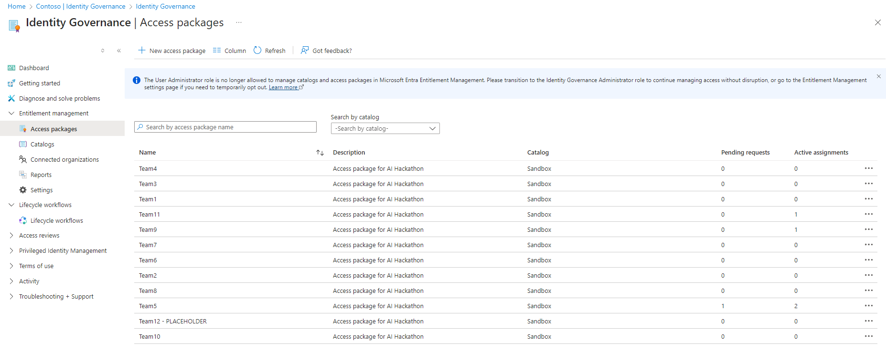

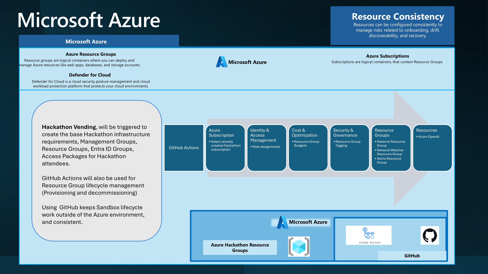

Now we have our base Terraform, it is time to deploy this, and we can use GitHub Actions to do this by creating a GitHub Actions workflow file, such as below:

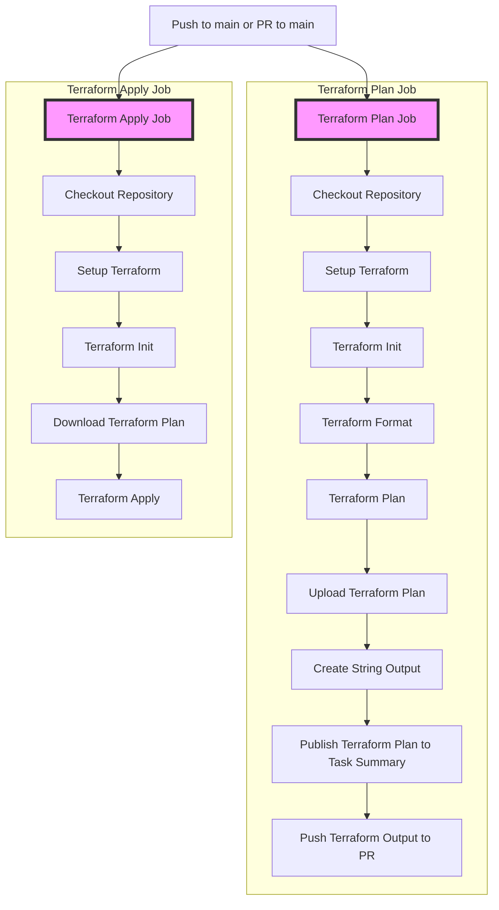

```yaml
name: 'Terraform Plan/Apply'

on:
  push:
    branches:
    - main
  pull_request:
    branches:
    - main

#Special permissions required for OIDC authentication
permissions:
  id-token: write
  contents: read
  pull-requests: write

jobs:
  terraform-plan:
    name: 'Terraform Plan'
    runs-on: ubuntu-latest
    environment: production

    env:
      #this is needed since we are running terraform with read-only permissions
      ARM_SKIP_PROVIDER_REGISTRATION: true
    outputs:
      tfplanExitCode: ${{ steps.tf-plan.outputs.exitcode }}

    steps:
    # Checkout the repository to the GitHub Actions runner
    - name: Checkout
      uses: actions/checkout@v4

    # Install the latest version of the Terraform CLI
    - name: Setup Terraform
      uses: hashicorp/setup-terraform@v3
      with:
        terraform_wrapper: false

    # Initialize a new or existing Terraform working directory by creating initial files, loading any remote state, downloading modules, etc.
    - name: Terraform Init
      run: terraform init
      #These environment variables are used by the terraform azure provider to setup OIDD authenticate. 
      env:
        ARM_CLIENT_ID: "${{ secrets.AZURE_CLIENT_ID }}"
        ARM_SUBSCRIPTION_ID: "${{ secrets.AZURE_SUBSCRIPTION_ID }}"
        ARM_TENANT_ID: "${{ secrets.AZURE_TENANT_ID }}"
      working-directory: ./iac

    # Checks that all Terraform configuration files adhere to a canonical format
    # Will fail the build if not
    - name: Terraform Format
      run: terraform fmt -check
      working-directory: ./iac

    # Generates an execution plan for Terraform
    # An exit code of 0 indicated no changes, 1 a terraform failure, 2 there are pending changes.
    - name: Terraform Plan
      id: tf-plan
      env:
        ARM_CLIENT_ID: "${{ secrets.AZURE_CLIENT_ID }}"
        ARM_SUBSCRIPTION_ID: "${{ secrets.AZURE_SUBSCRIPTION_ID }}"
        ARM_TENANT_ID: "${{ secrets.AZURE_TENANT_ID }}"
      working-directory: ./iac
      run: |
        export exitcode=0
        terraform plan -detailed-exitcode -no-color -out tfplan || export exitcode=$?

        echo "exitcode=$exitcode" >> $GITHUB_OUTPUT
        
        if [ $exitcode -eq 1 ]; then
          echo Terraform Plan Failed!
          exit 1
        else 
          exit 0
        fi
        
    - name: Upload Terraform Plan
      if: success() && steps.plan.outputs.exitcode != '1'
      uses: actions/upload-artifact@v4
      with:
        name: tfplan
        path: ./iac/tfplan # Ensure this path is correct
        
    # Create string output of Terraform Plan
    - name: Create String Output
      id: tf-plan-string
      run: |
        cd ./iac
        TERRAFORM_PLAN=$(terraform show -no-color tfplan)
        delimiter="$(openssl rand -hex 8)"
        echo "summary<<${delimiter}" >> $GITHUB_OUTPUT
        echo "## Terraform Plan Output" >> $GITHUB_OUTPUT
        echo "<details><summary>Click to expand</summary>" >> $GITHUB_OUTPUT
        echo "" >> $GITHUB_OUTPUT
        echo '```hcl' >> $GITHUB_OUTPUT
        echo "$TERRAFORM_PLAN" >> $GITHUB_OUTPUT
        echo '```' >> $GITHUB_OUTPUT
        echo "</details>" >> $GITHUB_OUTPUT
        echo "${delimiter}" >> $GITHUB_OUTPUT
        
    # Publish Terraform Plan as task summary
    - name: Publish Terraform Plan to Task Summary
      env:
        SUMMARY: ${{ steps.tf-plan-string.outputs.summary }}
      run: |
        echo "$SUMMARY" >> $GITHUB_STEP_SUMMARY
      
    # If this is a PR post the changes
    - name: Push Terraform Output to PR
      if: github.ref != 'refs/heads/main'
      uses: actions/github-script@v7
      env:
        SUMMARY: "${{ steps.tf-plan-string.outputs.summary }}"
      with:
          github-token: ${{ secrets.GITHUB_TOKEN }}
          script: |
            const body = `${process.env.SUMMARY}`;
            github.rest.issues.createComment({
                issue_number: context.issue.number,
                owner: context.repo.owner,
                repo: context.repo.repo,
                body: body
            })
                
  terraform-apply:
    name: 'Terraform Apply'
    if: github.ref == 'refs/heads/main' && needs.terraform-plan.outputs.tfplanExitCode == 2
    runs-on: ubuntu-latest
    environment: production
    needs: [terraform-plan]
    
    steps:
    # Checkout the repository to the GitHub Actions runner
    - name: Checkout
      uses: actions/checkout@v4

    # Install the latest version of Terraform CLI and configure the Terraform CLI configuration file with a Terraform Cloud user API token
    - name: Setup Terraform
      uses: hashicorp/setup-terraform@v3

    # Initialize a new or existing Terraform working directory by creating initial files, loading any remote state, downloading modules, etc.
    - name: Terraform Init
      run: terraform init
      env:
        ARM_CLIENT_ID: "${{ secrets.AZURE_CLIENT_ID }}"
        ARM_SUBSCRIPTION_ID: "${{ secrets.AZURE_SUBSCRIPTION_ID }}"
        ARM_TENANT_ID: "${{ secrets.AZURE_TENANT_ID }}"
      working-directory: ./iac

    # Download saved plan from artifacts  
    - name: Download Terraform Plan
      uses: actions/download-artifact@v4
      with:
        name: tfplan
        path: ./iac  # Specify the directory where the tfplan should be saved
    
    - name: Terraform Apply
      run: terraform apply -auto-approve tfplan
      working-directory: ./iac
      env:
        ARM_CLIENT_ID: "${{ secrets.AZURE_CLIENT_ID }}"
        ARM_SUBSCRIPTION_ID: "${{ secrets.AZURE_SUBSCRIPTION_ID }}"
        ARM_TENANT_ID: "${{ secrets.AZURE_TENANT_ID }}"
```

This GitHub Actions workflow will connect to Azure, using OIDC from a User Managed Identity, deploy the Terraform plan, and apply the changes to the Azure subscription.

The Terraform backend settings look like this, with the state file stored in an Azure Storage account called tfstatehackathon in a container called tfstate in the rg-terraform-hackathon-prod Resource Group. These resources were manually deployed:

```hcl
  backend "azurerm" {
    resource_group_name  = "rg-terraform-hackathon-prod"
    storage_account_name = "tfstatehackathon"
    container_name       = "tfstate"
    key                  = "terraform.tfstate"
    use_oidc             = true
  }

  provider "azuread" {
  use_oidc = true
}

## Configure the Azure Provider with the features block
provider "azurerm" {

  skip_provider_registration = true
  use_oidc                   = true
  features {
    key_vault {
      purge_soft_delete_on_destroy    = true
      recover_soft_deleted_key_vaults = true
    }
  }
}

```

In the GitHub repository, we have an Environment named production, and inside this is our:

| Variable | Description |
|----------|-------------|
| AZURE_CLIENT_ID | The client ID of the Entra ID User assigned managed identity used for authentication |
| AZURE_SUBSCRIPTION_ID | The ID of the Azure subscription |
| AZURE_TENANT_ID | The ID of the Entra ID tenant |

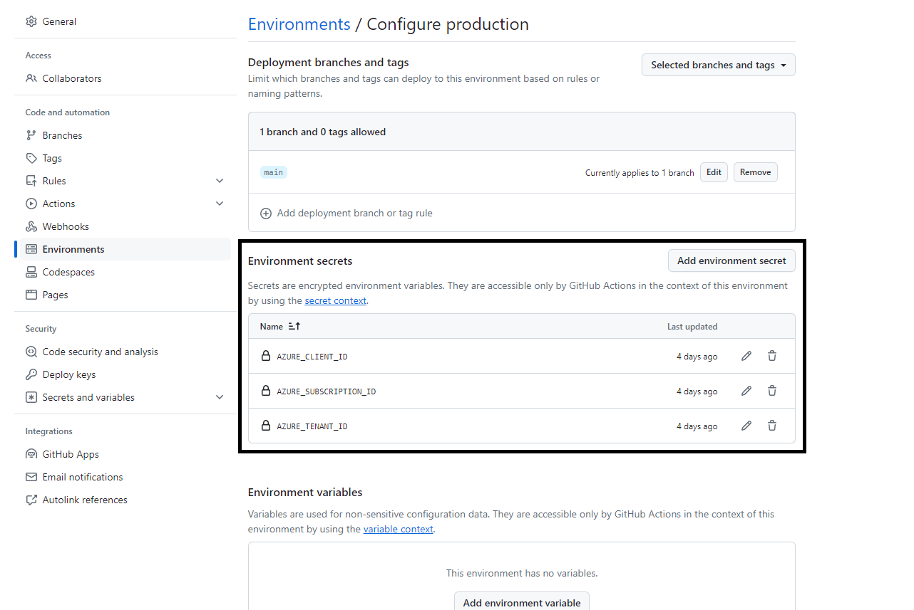

The full code for this can be found in the [lukemurraynz/HackathonRGAzureEnvironment](https://github.com/lukemurraynz/HackathonRGAzureEnvironment). If you have any suggestions or improvements, feel free to open a PR _(Pull Request)_.

Finally, once the Hackathon is over, you can use Terraform to revert the configuration and clean up the Azure subscription; once the users are removed from the Hackathon Access packages, their Guest accounts can be Disabled; you can also configure the policy to remove them from your tenancy automatically.

Your Hackathon students should now be able to log in to the [My Access Portal](https://learn.microsoft.com/entra/id-governance/entitlement-management-request-access?WT.mc_id=AZ-MVP-5004796#sign-in-to-the-my-access-portal), request access, to a Team, and once approved _(based on the policy you specified in the Access package)_ will be able to navigate to the Azure Portal for your tenancy 'https://portal.azure.com/YOURTENANTNAMEORID' and be able to create resources in the Azure Resource Group, and as Teams expand, you simply have to edit the CSV file and push the change.
