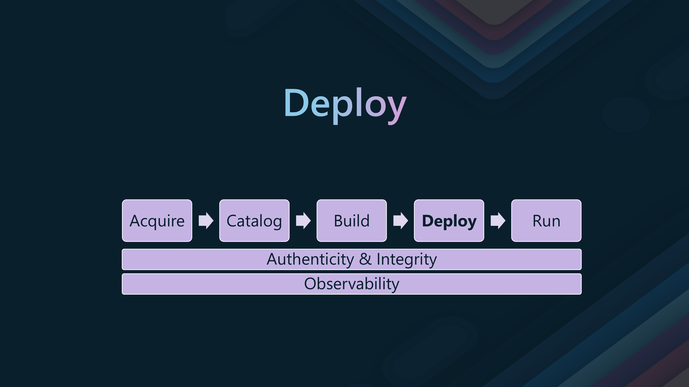

Today, we are going to take a look inside the [Containers Secure Supply Chain Framework](https://learn.microsoft.com/azure/security/container-secure-supply-chain/articles/container-secure-supply-chain-implementation/containers-secure-supply-chain-overview?WT.mc_id=AZ-MVP-5004796), a framework from Microsoft that utilizes an agile ecosystem of tools and processes built to integrate and execute security controls throughout the lifecycle of containers.

{/* truncate */}

## 📋Overview

:::info


> Microsoft's [Containers Secure Supply Chain Framework](https://learn.microsoft.com/azure/security/container-secure-supply-chain/articles/container-secure-supply-chain-implementation/containers-secure-supply-chain-overview?WT.mc_id=AZ-MVP-5004796) framework is a seamless, agile ecosystem of tools and processes built to integrate and execute security controls throughout the lifecycle of containers. The container secure supply chain strategy considers all the security needs of container applications. The goal is to prevent the use of vulnerable container images and create container infrastructure with a standard security portfolio.

The CSSC framework is built using the following steps:

* Identify the supply chain stages for containerized applications
* Outline the risks and the required security controls in each stage
* Describe the security objectives and goals in each stage
* Identify security tools, processes, and best practices in each stage
* Maintain security posture with metadata, logging, and reporting in each stage
:::

In essence, the Containers Secure Supply Chain (CSSC) framework ensures the security and integrity of containerized applications throughout their lifecycle. It aims to prevent vulnerable container images and create a secure container infrastructure by integrating security controls at every stage of the supply chain.

The CSSC framework protects against several risks, including:

* Vulnerable container images: Ensuring that only secure and compliant images are used.
* Malware and unauthorized changes: Verifying the authenticity and integrity of container images.
* Supply chain attacks: Mitigating risks from external sources and third-party vendors.
* Runtime threats: Reducing the attack surface of running containers.

By addressing these risks, the CSSC framework helps maintain a secure and reliable environment for containerized applications.

During each stage, make sure you have gates in place to ensure that the image is secure, meets the minimum quality standard, and gets peer approval before moving to the next stage. This could be done by using Azure Policy, Azure Security Center, or CI/CD with tools such as Azure DevOps or GitHub.

## 🔄Stages of the Container Supply Chain

We will dig into each stage, with a focus on some of the tools, mainly [Azure Container Registry (ACR)](https://learn.microsoft.com/azure/container-registry/container-registry-intro?WT.mc_id=AZ-MVP-5004796), that can be used to implement the security controls in each stage.

We will consider using separate Container Registers, one for each stage, to ensure that the security controls are implemented at each stage.


* One for Quarantine
* One for Catalog
* One for deployment


:::tip
Make use of [Azure Container Registry webhooks](https://learn.microsoft.com/en-us/azure/container-registry/container-registry-webhook?WT.mc_id=AZ-MVP-5004796) to trigger awareness and automation when images are pushed to the registries. This could trigger a pipeline to scan the images and move them to the next stage if they meet the minimum quality standard.
:::

So, let us dig into each stage.

## 🛒Stage 1: Acquire

The [Acquire](https://learn.microsoft.com/azure/security/container-secure-supply-chain/articles/container-secure-supply-chain-implementation/acquire-overview?WT.mc_id=AZ-MVP-5004796) stage is the first step in the container supply chain. It involves obtaining container images from sources that you may deem trusted or un-trusted and ensuring their integrity and authenticity.


* The Acquire stage aims to validate and ensure compliance of external container images with enterprise policies before internal use. This includes vulnerability and malware scanning.
* It involves centralizing the acquisition and management of external artifacts, importing images into an internal registry, and enriching images with metadata like SBOMs and provenance.
* Key tools include Azure Container Registry (ACR) for storing and distributing images, ORAS for interacting with OCI registries, ACR Tasks for automating tasks, and Microsoft Defender for Cloud security.
* Microsoft recommends building software from source when possible and, if not, following the CSSC framework’s practices for acquiring external container images.

In the Aquire stage, you should establish a minimum quality standard for images sourced externally. This includes scanning for vulnerabilities and malware, verifying the authenticity and integrity of images, and enriching images with metadata like Software Bill of Materials (SBOMs) and provenance information.

Tools that can be useful during this stage are:

* [Microsoft Defender for Cloud (for Containers)](https://learn.microsoft.com/azure/defender-for-cloud/defender-for-containers-introduction?WT.mc_id=AZ-MVP-5004796)
* [Trivy](https://trivy.dev/)
* [Copacetic](https://project-copacetic.github.io/copacetic/website/)
* [Azure Container Registry (ACR)](https://learn.microsoft.com/azure/container-registry/container-registry-intro?WT.mc_id=AZ-MVP-5004796)

> The process of quarantining is a security measure that consists of a series of checkpoints that are employed before an artifact is consumed. Those security checkpoints make sure that an artifact transitions from an untrusted status to a trusted status.

Let's take a look at the [Quarantine](https://learn.microsoft.com/azure/architecture/patterns/quarantine?WT.mc_id=AZ-MVP-5004796) function of Azure Container Registry. This function could automate the process of scanning and quarantining images that do not meet the minimum quality standard.

In my demo, I will be using the [debian](https://hub.docker.com/_/debian) base image from the dockerhub and pushed into my Azure Container Registry.


Let's enable Quarantine functionality on the Azure Container Registry. **At the time of this article, this is a preview feature.**

> When a registries policy is set to [Quarantine](https://learn.microsoft.com/rest/api/containerregistry/registries/update?view=rest-containerregistry-2023-01-01-preview&tabs=HTTP&WT.mc_id=AZ-MVP-5004796#quarantinepolicy) Enabled, all images pushed to that registry are put in quarantine by default. Only after the image has been verified and the quarantine flag removed may a subsequent pull be completed. Once Quarantine is enabled on a registry, a newly pushed image will enter a quarantine state automatically, and only a user with quarantine reader permissions can see the image. 

Using Azure CLI, we can enable Quarantine on the Azure Container Registry. Quarantine functionality is only allowed on Premium SKU registries.


```bash
export ACR_NAME=acrqr
id=$(az acr show --name $ACR_NAME --query id -o tsv)
az resource update --ids $id --set properties.policies.quarantinePolicy.status=enabled
```
Once the image is quarantined, you need a user with the AcrQuarantineReader role. The presumption here is the Vulnerability Scanning solution is configured to use this account.

We can run the following Azure CLI to check the image status in the Quarantine.

```bash
export ACR_NAME=acrqr
export IMAGE_NAME=debian
az acr manifest list -r $ACR_NAME -n $IMAGE_NAME
```

!

1. Now using [Defender for Containers](https://learn.microsoft.com/azure/defender-for-cloud/defender-for-containers-introduction?WT.mc_id=AZ-MVP-5004796), we can scan our images in the Container Registry for vulnerabilities.
2. You can also use [Trivy](https://trivy.dev/) to scan the images for vulnerabilities and reveal more about the SBOM (Software Bill of Materials) used in the image.
3. Add any additional metadata to the image, such as the [SBOM](https://learn.microsoft.com/azure/security/container-secure-supply-chain/articles/attach-sbom?WT.mc_id=AZ-MVP-5004796), and [provenance](https://docs.docker.com/build/attestations/slsa-provenance/) information.

:::tip
Check out [Container Patching with Azure DevOps, Trivy and Copacetic](https://luke.geek.nz/azure/automate-container-patching-with-trivy-copacetic-azure-devops/) blog article for more information on how to automate the scanning of images with Copacetic in the Azure Container Registry, from an Azure DevOps pipeline.
:::

Once you have determined that your Container Image's state is good, you can remove the Quarantine flag from it by running the following Azure CLI command.

In order to call the API, you currently need permissions for both Contributor and AcrQuarantineWriter (or AcrPush role) on the registry.

```bash
export ACR_NAME=acrqr
export IMAGE_NAME=debian
az acr repository show-manifests --name $ACR_NAME --repository $IMAGE_NAME --detail
```

Find the digest of the image you want to remove the quarantine flag from, and run the following Azure CLI command.

```bash
export ACR_NAME=acrqr
export IMAGE_NAME=debian
export MANIFEST_DIGEST=sha256:b1ae8b5bfaa9afa86b50c2a151a442d832c4449cf3731bddf8a728e5628ebb59
export REPOSITORY=debian
export REGISTRY=$ACR_NAME.azurecr.io

# Get the Entra ID access token
export EID_ACCESS_TOKEN=$(az account get-access-token --query accessToken -o tsv)

# Exchange the AAD access token for an ACR refresh token
export ACR_REFRESH_TOKEN=$(curl -s -X POST -H "Content-Type: application/x-www-form-urlencoded" \
  -d "grant_type=access_token&service=$REGISTRY&access_token=$EID_ACCESS_TOKEN" \
  https://$REGISTRY/oauth2/exchange \
  | jq -r '.refresh_token')

# Create the repo-level scope
SCOPE="repository:$REPOSITORY:pull,metadata_write"

# Get the ACR access token using the refresh token
export ACR_ACCESS_TOKEN=$(curl -s -X POST -H "Content-Type: application/x-www-form-urlencoded" \
  -d "grant_type=refresh_token&service=$REGISTRY&scope=$SCOPE&refresh_token=$ACR_REFRESH_TOKEN" \
  https://$REGISTRY/oauth2/token \
  | jq -r '.access_token')

# Check if the access token is null
if [ "$ACR_ACCESS_TOKEN" == "null" ]; then
  echo "Failed to retrieve access token. Please check your credentials and scope."
  exit 1
fi

# Use the ACR access token in the curl command
curl -v -X PATCH \
  -H "Authorization: Bearer $ACR_ACCESS_TOKEN" \
  -H "Content-Type: application/json" \
  -d '{
        "quarantineState": "Passed", 
        "quarantineDetails": "{\"state\":\"scan passed\"}"
      }' \
  "https://$ACR_NAME.azurecr.io/acr/v1/$IMAGE_NAME/_manifests/$MANIFEST_DIGEST"
```


## 📦Stage 2: Catalog

The [Catalog](https://learn.microsoft.com/azure/security/container-secure-supply-chain/articles/container-secure-supply-chain-implementation/catalog-overview?WT.mc_id=AZ-MVP-5004796) stage is the second step in the container supply chain. It involves storing and managing container images in a central repository, where they can be easily accessed and deployed.


:::info
Microsoft recommends that internal teams use container images from an internal catalog whenever possible. 

If enterprises are not able to do so, we recommend the following practices for cataloging container images.

* Catalog golden images to enable internal teams to easily discover and consume approved images that enterprise applications and services require.
* Continuously scan container images for vulnerabilities and malware, generate reports, and sign reports to ensure authenticity and integrity.
* Monitor the lifecycle of catalog images and retire images that are out of support.
:::

After the images have been acquired, vetted by the previous step, and meet organizational requirements, it's time to move the photos into a Catalog Container Registry, where they can be stored in a central repository and easily accessed.

Unlike the Acquire Container Registry, this Registry will not be quarantined. However, it will need to be continuously scanned for vulnerabilities and malware as part of operations using tools like Defender for Cloud and Trivy.

1. Now using [Defender for Containers](https://learn.microsoft.com/azure/defender-for-cloud/defender-for-containers-introduction?WT.mc_id=AZ-MVP-5004796), we can scan our images in the Container Registry for vulnerabilities. As this is a Catalog registry, we need to make sure that we monitor and remediate any vulnerabilities that are found.
2. You can also make use of [Trivy](https://trivy.dev/), to scan the images for vulnerabilities.

It can also be valid to move images from the Catalog back to the Quarantine registry if the Catalog registry is not monitored or the image has been found to have high-priority vulnerabilities that fall beneath an organization threshold.

You can use the following Azure CLI command to move an image between the Quarantine and Catalog registries.

```bash
# Variables
SOURCE_REGISTRY="acrqr"
TARGET_REGISTRY="acrcatalog"
IMAGE_NAME="debian:v1"

# Import image from source registry to target registry
az acr import --name $TARGET_REGISTRY --source $SOURCE_REGISTRY.azurecr.io/$IMAGE_NAME --image $IMAGE_NAME
```


We can see the image now in our Catalog registry. The image is left in the Quarantine registry, as it has not been removed. If needed, you can now remove this.


## 🛠️Stage 3: Build

The [Build](https://learn.microsoft.com/azure/security/container-secure-supply-chain/articles/container-secure-supply-chain-implementation/build-overview?WT.mc_id=AZ-MVP-5004796) step is the third step in the container supply chain. It involves building container images from source code and ensuring that they meet security and compliance requirements, whereas previous steps were more aligned with container images that were sourced externally. However, the following practices can be applied to both.


> It is crucial to ensure that base images are always pulled from the internal catalog and verified before use. After building the images, some enterprises publish them without vulnerability and malware scanning and fail to generate attestations like SBOM, which cannot be verified in subsequent supply chain stages. It is essential to ensure that the produced container images are trusted and compliant with the enterprise policies.

The build phase is all about building application images consistently and securely. 

* Use trusted images only
* Verify lifecycle and provenance metadata
* Scan after build
* Fix known vulnerabilities during and post-build
* Sign images and artifacts

Tools that can be used during the Build stage are:

* [GitHub](https://github.com/)
* [Azure DevOps](https://azure.microsoft.com/products/devops?WT.mc_id=AZ-MVP-5004796)
* [Defender for Cloud](https://learn.microsoft.com/azure/defender-for-cloud/defender-for-containers-introduction?WT.mc_id=AZ-MVP-5004796)
* [Dependabot](https://docs.github.com/en/code-security/getting-started/dependabot-quickstart-guide)
* [Copacetic](https://project-copacetic.github.io/copacetic/website/)

:::tip
[Azure Container Registry (ACR) Tasks](https://learn.microsoft.com/azure/container-registry/container-registry-tasks-overview?WT.mc_id=AZ-MVP-5004796) can help fill in the gaps in the Build stage. ACR Tasks can automate the building of container images from source code, scanning for vulnerabilities, and signing images, as part of your build workflow.
:::

## 🚢Stage 4: Deploy

The Deploy stage is the fourth step in the container supply chain. It involves deploying container images to production environments where end-users can access them.



This stage is usually where you move the images downstream from the Catalog registry to the application Deployment registries, where they are deployed to production environments.

Use a secure and scalable private registry for application deployments. Ensure that the registry is protected with role-based access control (RBAC), that images are signed, and that the correct metadata is attached.

* Continuously scan for vulnerabilities and malware
* Keep artifact metadata up-to-date
* Enforce deployment policies

Just because the images have been moved to the Deployment registry does not mean that they are safe to deploy. You should still be scanning them for vulnerabilities and malware and ensuring that they are signed and have the correct metadata attached.

The same tools we have used in the previous stages can be used in this stage.

* [Defender for Cloud](https://learn.microsoft.com/azure/defender-for-cloud/defender-for-containers-introduction?WT.mc_id=AZ-MVP-5004796)
* [Copacetic](https://project-copacetic.github.io/copacetic/website/)
* [Trivy](https://trivy.dev/)
* [HELM](https://helm.sh/)

This is the stage where Copacetic can assist with patching deployed containers and ensuring that the images are up-to-date and secure at the OS layers. The images are fully patched and tested back at the Build and Catalog stages.

## 🚀Stage 5: Runtime

The Runtime stage is the fifth and final step in the container supply chain. It involves monitoring and securing running containers in production environments so that end-users can access them.


This is one of the most important stages, as this is where the images are running in production and are exposed to the Internet. You should monitor the images for vulnerabilities and malware and ensure that they are signed and have the correct metadata attached.

* Monitor for Abnormal behavior
* Continuously scan for vulnerabilities and malware
* Keep runtime node ContainerSupplyFramework_Quarantine_debianimage

Tools that can be used in this stage are:

* [Azure Policy](https://learn.microsoft.com/azure/governance/policy/overview?WT.mc_id=AZ-MVP-5004796)
* [Kubernetes (AKS)](https://learn.microsoft.com/azure/aks/what-is-aks?WT.mc_id=AZ-MVP-5004796)
* [Defender for Cloud](https://learn.microsoft.com/azure/defender-for-cloud/defender-for-cloud-introduction?WT.mc_id=AZ-MVP-5004796)
* [Gatekeeper](https://open-policy-agent.github.io/gatekeeper/website/)
* [Ratify](https://learn.microsoft.com/azure/aks/image-integrity?tabs=azure-cli&WT.mc_id=AZ-MVP-5004796)

:::tip
[Containers running in Azure should have vulnerability findings resolved](https://portal.azure.com/#view/Microsoft_Azure_Security_CloudNativeCompute/AggregatedRecommendationBlade/assessmentKey/e9acaf48-d2cf-45a3-a6e7-3caa2ef769e0/showSecurityCenterCommandBar~/false) Defender recommendations are worth a look to see a list of vulnerabilities, once Defender for Cloud is turned, for Azure Kubernetes Clusters.
:::

## 🏁 Conclusion

Hopefully, this article has given you an insight into the [Containers Secure Supply Chain Framework](https://learn.microsoft.com/azure/security/container-secure-supply-chain/articles/container-secure-supply-chain-implementation/containers-secure-supply-chain-overview?WT.mc_id=AZ-MVP-5004796), and how you can implement the security controls at each stage, using Azure Container Registry, and other tools.


### 📖 Reference

* 🔗[Containers Secure Supply Chain Framework](https://learn.microsoft.com/azure/security/container-secure-supply-chain/articles/container-secure-supply-chain-implementation/containers-secure-supply-chain-overview?WT.mc_id=AZ-MVP-5004796)
* 🔗[duffney/secure-supply-chain-on-aks](https://github.com/duffney/secure-supply-chain-on-aks)
* 🔗[Quarantine pattern](https://learn.microsoft.com/azure/architecture/patterns/quarantine?WT.mc_id=AZ-MVP-5004796)
* 🔗[Secure Container Supply Chain with Notation, ORAS, and Ratify](https://www.youtube.com/watch?v=7RvFj_RWE7c)
* 🔗[Notary](https://notaryproject.dev/)
* 🔗[Secure your Azure Kubernetes Service (AKS) clusters with Azure Policy](https://learn.microsoft.com/azure/aks/use-azure-policy?WT.mc_id=AZ-MVP-5004796)
