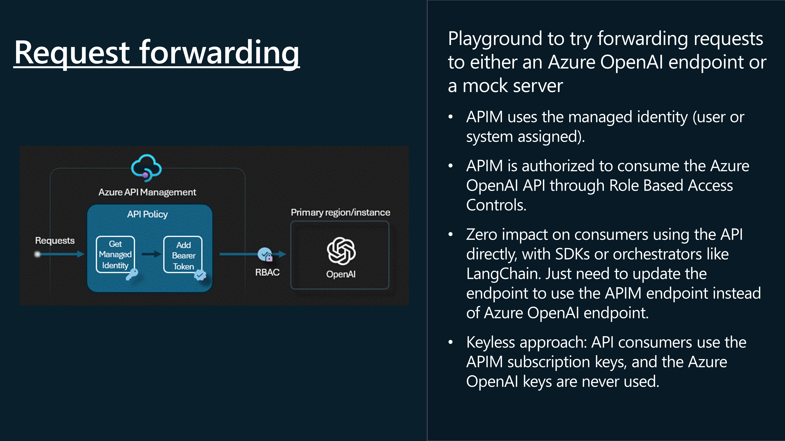
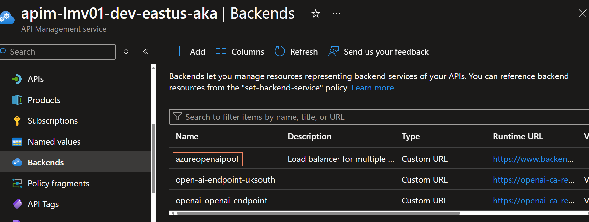

Today, we are going to deleve into some of the Generative [AI Gateway capabilities](https://learn.microsoft.com/ai/playbook/technology-guidance/generative-ai/dev-starters/genai-gateway/?WT.mc_id=AZ-MVP-5004796) _(commonly refered to as AI Gateway)_ that are available in the [API Management](https://learn.microsoft.com/azure/api-management/api-management-key-concepts?WT.mc_id=AZ-MVP-5004796) service. 

These capabilities are designed, to help secure and monitor your OpenAI endpoints, for use in your applications, as you head towards production.

{/* truncate */}

Common scenarios that the AI Gateway capabilities can help with include:

* How can we track token usage across multiple applications? How can we do cross charges for multiple applications/teams that use Azure OpenAI models? 
* How can we make sure that a single app does not consume the whole TPM quota, leaving other apps with no option to use Azure OpenAI models? 
* How can we make sure that the API key is securely distributed across multiple applications? 
* How can we distribute load across multiple Azure OpenAI endpoints? How can we make sure that PTUs are used first before falling back to Pay-as-you-go instances? 

In this post, we will explore how to use the AI Gateway capabilities in API Management to address these scenarios.


The first step is to [import the Azure OpenAI](https://learn.microsoft.com/azure/api-management/azure-openai-api-from-specification?WT.mc_id=AZ-MVP-5004796) service and definition into API Management. This will allow you to create a new API in API Management that can act as a gateway to the Azure OpenAI service.

:::info
You can import an Azure OpenAI API directly to API Management from the Azure OpenAI Service. When you import the API, API Management automatically configures:

* Operations for each of the Azure OpenAI REST API endpoints.
* A system-assigned identity with the necessary permissions to access the Azure OpenAI resource.
* A backend resource and set-backend-service policy that direct API requests to the Azure OpenAI Service endpoint.
* An authentication-managed-identity policy that can authenticate to the Azure OpenAI resource using the instance's system-assigned identity.
* _(optionally)_ Policies to help you monitor and manage token consumption by the Azure OpenAI API.

General avaliability of this functionality, went into May 2024. [GA Import Azure OpenAI enpoints as an APIs in Azure API Management](https://azure.microsoft.com/en-us/updates/ga-import-azure-openai-enpoints-as-an-apis-in-azure-api-management/?WT.mc_id=AZ-MVP-5004796).
:::

So, let us take a look at how to import the Azure OpenAI service and definition into API Management.

## Request Forwarding

Let us take a look at Request forwarding.



For this article I have the following resources pre-deployed already:

| **Name**                  | **Type**               | **Region** |
|---------------------------|------------------------|------------|
| openai-ca-res-eastus      | Azure OpenAI           | East US    |
| openai-ca-res-uksouth     | Azure OpenAI           | UK South   |
| apim-lmv01-dev-eastus-aka | API Management service | East US    |

We will start by adding openai-ca-res-eastus to the Azure API Management, service first, before looking at adding the other resources.

> This will automatically, enable the System Managed Identity of API Management, to access the Azure OpenAI service with the role of [Cognitive Services OpenAI User](https://learn.microsoft.com/azure/ai-services/openai/how-to/role-based-access-control?WT.mc_id=AZ-MVP-5004796#cognitive-services-openai-user), and create a new Backend instance, and operations.


We can see the policiy changes applied, pointing to the backend and system managed identity.


:::info
There is Azure Portal integration, to enable a few API policies out of the box, to help you manage the token consumption of the Azure OpenAI API.

These are:

Manage token consumption _(Use the Azure OpenAI token limit policy to protect the API from overuse and to control Azure OpenAI cost. If selected, API Management will add the policy with the configured TPM value. You can add, edit, or remove this policy after the API is created.)_
Track token usage _(Use the Azure OpenAI emit token policy to log the consumed total, completion, and prompt tokens. If selected, API Management will add the policy with specified configuration. You can add, edit, or remove this policy after the API is created)_
:::

Now that we have a frontend for our Azure OpenAI service, its time to test the Azure OpenAI endpoint, through Azure API Management.

To do this, we will need a:

* deployment-id _(this is the name of the Model deployment, in Azure OpenAI)
* api-version _(this is the version of the Azure OpenAI API, that we want to use)_

We can get this information from the Azure AI Studio, in the Azure Portal, in the Deployment blade.


Now, we can test the Azure OpenAI endpoint, through Azure API Management. In Azure API Management, navigate to the openai API that you created, and select the Creates a completion for the chat message operation and the Test tab.

Add in your deployment id and api version, and in the request body, enter in a sameple prompt like below:

```json
{
  "messages": [
    {"role": "system", "content": "You are a knowledgeable assistant in an ice cream parlor."},
    {"role": "user", "content": "What are the ingredients typically used to make a classic vanilla ice cream?"}
  ],
  "max_tokens": 100
}
```


This confirms that we can now communicate with the Azure OpenAI service, through Azure API Management.

So let us test Request forwarding, from a client application, such as Postman.

We will need to get the subscription key, from the Azure API Management instance, and add this to the request header, as 'api-key', after first associating the openai API with a Product, and subscription key generated.


Here is a sample PowerShell script for invoking the Azure OpenAI endpoint, through Azure API Management, as well.

```powershell
$headers = New-Object "System.Collections.Generic.Dictionary[[String],[String]]"
$headers.Add("api-key", "YOURSUBSCRIPTIONKEY")
$headers.Add("Content-Type", "application/json")

$body = @"
{
    `"messages`": [
        {
            `"role`": `"system`",
            `"content`": `"You are a knowledgeable assistant in an ice cream parlor.`"
        },
        {
            `"role`": `"user`",
            `"content`": `"What are the ingredients typically used to make a classic vanilla ice cream?`"
        }
    ],
    `"max_tokens`": 100
}
"@

$response = Invoke-RestMethod 'https://apim-lmv01-dev-eastus-aka.azure-api.net/openai/deployments/gpt-4o/chat/completions?api-version=2024-02-15-preview' -Method 'POST' -Headers $headers -Body $body
$response | ConvertTo-Json
```
We have successfully implemented Request forwarding, through API Management to the Azure OpenAI endpoint.


## Backend circuit breaking

Now, let us take a look at Backend circuit breaking. The [Circuit Breaker](https://learn.microsoft.com/azure/architecture/patterns/circuit-breaker?WT.mc_id=AZ-MVP-5004796) pattern, follows the same principles as the electrical circuit breaker. It is used to detect failures and encapsulate the logic of preventing a failure from constantly recurring, during maintenance, temporary overloads, or unexpected spikes in traffic. When the circuit breaker trips, it can return an error immediately, without trying to execute the operation.

::trip
The Circuit Breaker pattern, is mentioned in my [Cloud Design Patterns](https://luke.geek.nz/azure/cloud-design-patterns/) blog post.
:::

A circuit breaker acts as a proxy for operations that might fail. The proxy should monitor the number of recent failures that have occurred, and use this information to decide whether to allow the operation to proceed, or simply return an exception immediately, when the circuit is Closed the requests are allowed to pass through, when the circuit is Open, the requests are blocked.


To implement a circuit breaker in API Management, we will need to add a policy to the Azure OpenAI API, that will monitor the number of recent failures that have occurred, and use this information to decide whether to allow the operation to proceed, or simply return an exception immediately.

Unlike, Request forwarding, configuring the Circuit Breaker, cannot currently be done in the Azure Portal, and will require configuration, through Infrastructure as Code _(ie Bicep)_ or the API Management REST API.

:::warning
Before you configure a circuitBreaker policy, make sure you have a backup of your Backend configuration and test this is a non-production environment.
:::

Today, we will configure it using Bicep, by referencing the backend of an already existing API Management resource, and adding in the circuitBreaker rule.


```bicep
param backend string
param existingUrl string

// Use the parameters to update properties
resource updatedBackend 'Microsoft.ApiManagement/service/backends@2023-09-01-preview' = {
  name: backend
  properties: {
    url: existingUrl  // Use the parameter to keep the existing URL
    protocol: 'http'
    circuitBreaker: {
      rules: [
        {
          failureCondition: {
            count: 3 // Number of failures before tripping the circuit breaker
            errorReasons: [
              'Server errors' // Reasons for the failure
            ]
            interval: 'PT1H' // Time interval to count the failures
            statusCodeRanges: [
              {
                min: 500 // Minimum status code to consider as a failure
                max: 599 // Maximum status code to consider as a failure
              }
            ]
          }
          name: 'myBreakerRule' // Name of the circuit breaker rule
          tripDuration: 'PT1H' // Duration for which the circuit breaker remains tripped
          acceptRetryAfter: true // Whether to accept retry after the trip duration
        }
      ]
    }
  }
}

```

In the Circuit Breaker rule above, the following behavior will occur:

| **Parameter**             | **Description**                                                                                                                        |
|---------------------------|----------------------------------------------------------------------------------------------------------------------------------------|
| **Number of Failures**    | The circuit breaker will trip if there are 3 or more failures within the specified time interval.                                     |
| **Error Reasons**         | Failures considered are those matching the reason 'Server errors'. The application or service should categorize errors with this reason. |
| **Status Code Ranges**    | Failures are identified based on HTTP status codes ranging from 500 to 599, covering server-side errors such as internal server errors (500), service unavailable (503), and similar issues. |
| **Time Interval**         | Failures are counted within a time interval of 1 hour ('PT1H'). If there are 3 or more failures with status codes in the 500–599 range within any 1-hour window, the circuit breaker will trip. |
| **Trip Duration**         | Once tripped, the circuit breaker remains in the tripped state for 1 hour ('PT1H'). During this period, requests will not pass through until the breaker is reset. |
| **Retry Behavior**        | After the trip duration of 1 hour, the circuit breaker is designed to allow retries (acceptRetryAfter: true). Requests will be accepted again after the trip duration, and the service will attempt to recover. |
| **Scenarios Where the Circuit Breaker Will Trip** | If, within any 1-hour period, there are 3 or more server-side errors (HTTP status codes 500–599) with the reason 'Server errors', the circuit breaker will trip. Once tripped, the circuit breaker will block requests for 1 hour. After the 1-hour block period, the circuit breaker will reset and start accepting requests again. |

There is nothing in the Azure Portal for API MAnagemement, but if we take a look at the backend provider resource we can confirm, that the configuration for the backend has been set.


## Backend Load Balacing

Let us now take a look at Backend Load Balancing, with [Load-Balanced Pools](https://learn.microsoft.com/azure/api-management/backends?tabs=bicep&WT.mc_id=AZ-MVP-5004796#load-balanced-pool). Load balancing is the process of distributing network traffic across multiple endpoints. This ensures that no single server bears too much demand. By spreading the work evenly, load balancing improves application responsiveness.


Backend pooling your Azure OpenAI endpoints, allows you to:

* Spread the load to multiple backends, which may have individual backend circuit breakers.
* Shift the load from one set of backends to another for upgrade _(blue-green deployment)_.

Note Backend pools don't need any policy configuration. The rules are just properties of the backend.

:::info
API Management supports the following load balancing options for backend pools:

* Round-robin: By default, requests are distributed evenly across the backends in the pool.
* Weighted: Weights are assigned to the backends in the pool, and requests are distributed across the backends based on the relative weight assigned to each backend. Use this option for scenarios such as conducting a blue-green deployment.
* Priority-based: Backends are organized in priority groups, and requests are sent to the backends in order of the priority groups. Within a priority group, requests are distributed either evenly across the backends, or (if assigned) according to the relative weight assigned to each backend.

_(Backends in lower priority groups will only be used when all backends in higher priority groups are unavailable because circuit breaker rules are tripped.)_
:::

If we go back to my environment we are currently operating with the following resources:

| **Name**                  | **Type**               | **Region** |
|---------------------------|------------------------|------------|
| openai-ca-res-eastus      | Azure OpenAI           | East US    |
| openai-ca-res-uksouth     | Azure OpenAI           | UK South   |
| apim-lmv01-dev-eastus-aka | API Management service | East US    |

So so far, the Azure OpenAI backend of eastus is being used, but we can add the uksouth backend to the backend pool, and configure it to be used in a round-robin fashion. 

:::info
One of the reasons you may want to do this, is not only to ensure reliability, using a priority group - that your Azure OpenAI service is highly available, and can be accessed from multiple regions, but you may also want to ensure that you are not hitting the [TPM _(Tokens Per Minute)_ regional limits](https://learn.microsoft.com/azure/ai-services/openai/quotas-limits?WT.mc_id=AZ-MVP-5004796#regional-quota-limits) of the Azure OpenAI service, and that you are distributing the load across multiple regions. 

A common scenario here would be to have a primary region, that has a [PTU _(Proviosned Throughout)_](https://learn.microsoft.com/azure/ai-services/openai/concepts/provisioned-throughput?WT.mc_id=AZ-MVP-5004796) assigned, and failover to a pay as you go region.
:::

Similar to the Circuit Breaker rule capability, we need to configure Backend Pools using the Azure RestAPI or an Infrastructure as Code method, such as Bicep.

In my example, I will be adding the openai-ca-res-uksouth to the backend pool of the Azure OpenAI API, and configuring it to use EastUS first, and failover to UKSouth if eastus stops responding.

To do this, we need to add a new backend, and then reference that in a new pool configuration.

:::Note
When we initially added our first Azure OpenAI resource, alot of the configuration was done for us, including adding the [Cognitive Services OpenAI User](https://learn.microsoft.com/azure/ai-services/openai/how-to/role-based-access-control?WT.mc_id=AZ-MVP-5004796#cognitive-services-openai-user) role to the System Managed Identity of the API Management instance to authenticate with the Azure OpenAI resource, so make sure you grant Azure API Management the necessary permissions to access any other Azure OpenAI resource.


:::

Navigate to your secondary Azure OpenAI instance, and navigate to Keys and Endpoints, we need to grab the endpoint URL ie _(https://openai-ca-res-uksouth.openai.azure.com/)_, to add as another Backend and append with /openai.


Now that its added as a backend, we can add it to the backend pool, and configure it.

```bicep
param backendnane string
param subscriptionID string
param resourceGroupName string
param APIManagementName string
param backend1 string
param backend2 string

// Use the parameters to update properties
resource updatedBackend 'Microsoft.ApiManagement/service/backends@2023-09-01-preview' = {
  name: '${APIManagementName}/${backendnane}'
  properties: {
    description: 'Load balancer for multiple backends'
    type: 'Pool'
    pool: {
      services: [
        // Define the backend pool configuration for an API Management service
        {
          // Define the first backend with a specific ID, priority, and weight
          id: '/subscriptions/${subscriptionID}/resourceGroups/${resourceGroupName}/providers/Microsoft.ApiManagement/service/${APIManagementName}/backends/${backend1}'
          priority: 1 // Higher priority backend
          weight: 1   // Weight of the backend
        }
        {
          // Define the second backend with a specific ID, priority, and weight
          id: '/subscriptions/${subscriptionID}/resourceGroups/${resourceGroupName}/providers/Microsoft.ApiManagement/service/${APIManagementName}/backends/${backend2}'
          priority: 1 // Higher priority backend
          weight: 2   // Weight of the backend
        }
      ]
    }
  }
}

```


Once the deploy is done, we can see the backend pool configuration in the Azure Portal.



Now we need to update the Azure API Managememt OpenAI API, to use the backend pool, instead of the single backend.

Navigate to APIs, and your OpenAI API, select All Operations and then select the edit button.

Change the backend it to the name of your Backend Pool.


Now if we test the Azure OpenAI endpoint, through Azure API Management, we can see that the requests are being distributed across the two backends in the backend pool.

If we enable, Tracing we can see the handoff, and our API callers are oblivious to the fact that their API call is getting redirected. 


You can use the Circuitbreaker and Backend Pooling in conjunction with each other, to ensure that your Azure OpenAI service is highly available, and can be accessed from multiple regions. 

:::info
The Circuitbreaker policies are on the Backends, not the Pools.
:::

For example, I changed the circuitBreaker rule, status code range to: 401 _(Permission Denied)_ and removed the Cogniative User role from the System Managed Identity of the API Management instance, to simulate a backend failure, and moved the UkSouth endpoint to priority group 2.


```json
         statusCodeRanges: [
              {
               // Define the range of HTTP status codes that will be considered as failures for the circuit breaker
                min: 401 // Minimum status code to consider as a failure (e.g., Unauthorized)
                max: 401 // Maximum status code to consider as a failure (e.g., Unauthorized)
              }
            ]
```

And it worked as expected, the circuit breaker tripped, and the requests were redirected to the UKSouth backend.


## Response Streaming

Let us take a look at Response Streaming. Response streaming is a technique used to send a response to a client in chunks, rather than all at once. This can be useful when the response is large, or when the response is being generated in real-time.


:::tip
Follow the [guidelines](https://learn.microsoft.com/en-us/azure/api-management/how-to-server-sent-events?WT.mc_id=AZ-MVP-5004796#guidelines-for-sse) when using API Management to reach a backend API that implements SSE (Server side streaming).
:::

If I go back to our Creates a completion for the chat message, operation, and edit the policy and add the following to the inbound and outbound Azure policies.

```xml
    <inbound>
        <!-- Base inbound processing -->
        <base />
        <!-- Conditional logic to check if the request body contains a non-null "stream" property -->
        <choose>
            <when condition="@(context.Request.Body.As<JObject>(true)["stream"] != null && context.Request.Body.As<JObject>(true)["stream"].Type != JTokenType.Null)">
                <!-- Set a variable "isStream" with the value of the "stream" property from the request body -->
                <set-variable name="isStream" value="@{
                    var content = (context.Request.Body?.As<JObject>(true));
                    string streamValue = content["stream"].ToString();
                    return streamValue;
                }" />
            </when>
        </choose>
    </inbound>
    <!-- Control if and how the requests are forwarded to services -->
    <backend>
        <!-- Base backend processing -->
        <base />
    </backend>
    <!-- Customize the responses -->
    <outbound>
        <!-- Base outbound processing -->
        <base />
        <!-- Set a custom header "x-ms-stream" based on the value of the "isStream" variable -->
        <set-header name="x-ms-stream" exists-action="override">
            <value>@{
                    return context.Variables.GetValueOrDefault<string>("isStream","false").Equals("true", StringComparison.OrdinalIgnoreCase).ToString();
                }</value>
        </set-header>
    </outbound>
```

This sets the x-ms-stream header to true, if the request body contains a non-null "stream" property, allowing streaming, so let us test this in Postman

By using the following prompt:

```json
{
    "messages": [
        {
            "role": "system",
            "content": "You are a knowledgeable assistant in an ice cream parlor."
        },
        {
            "role": "user",
            "content": "What are the ingredients typically used to make a classic vanilla ice cream?"
        }
    ],
    "max_tokens": 100,
    "stream": true
}
```


Note: Full JSON streaming support [is not avaliable](https://github.com/postmanlabs/postman-app-support/issues/12713) at this time of this article in postman, so again - you need a client to support this.

We can however see the response, does include the response being streamed, and broken up into chunks:


To remove the streaming component, we can either remove stream, from the body, or change the stream from true to false.

## Logging

Now let us take a look at Logging. Logging is the process of recording events that occur during the execution of a process. Logs can be used to monitor and troubleshoot requests, as well as to analyze and report on application performance.


To do this, we need to enable [Application Insights](https://learn.microsoft.com/azure/azure-monitor/app/app-insights-overview?WT.mc_id=AZ-MVP-5004796), if we haven't already.


:::tip
If your NOT using Azure API Management, I recommend you check out the workbook by Dolev Shor _(Microsoft Fastrack Engineer)_, you can read more about it here: [Azure OpenAI Insights: Monitoring AI with Confidence](https://techcommunity.microsoft.com/t5/fasttrack-for-azure/azure-openai-insights-monitoring-ai-with-confidence/ba-p/4026850?WT.mc_id=AZ-MVP-5004796).
:::

So lets take a look at some of the logs, that are being generated by the Azure OpenAI API, through Azure API Management, and visible through Application Insights and Log Analytics workspace.

