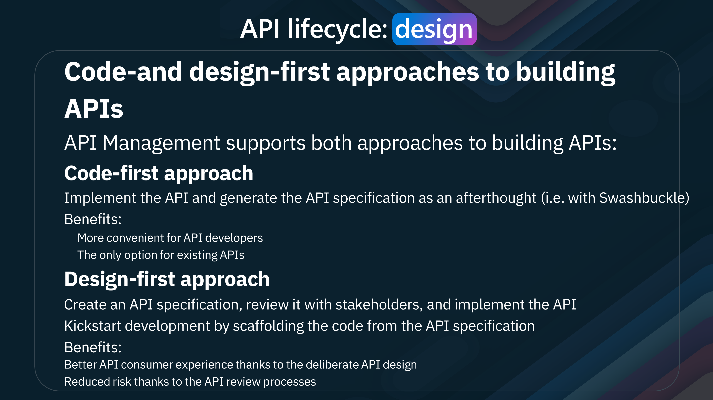
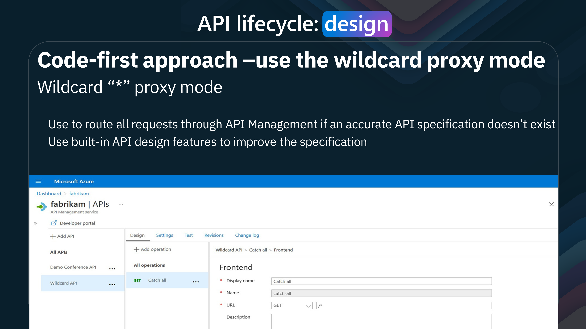
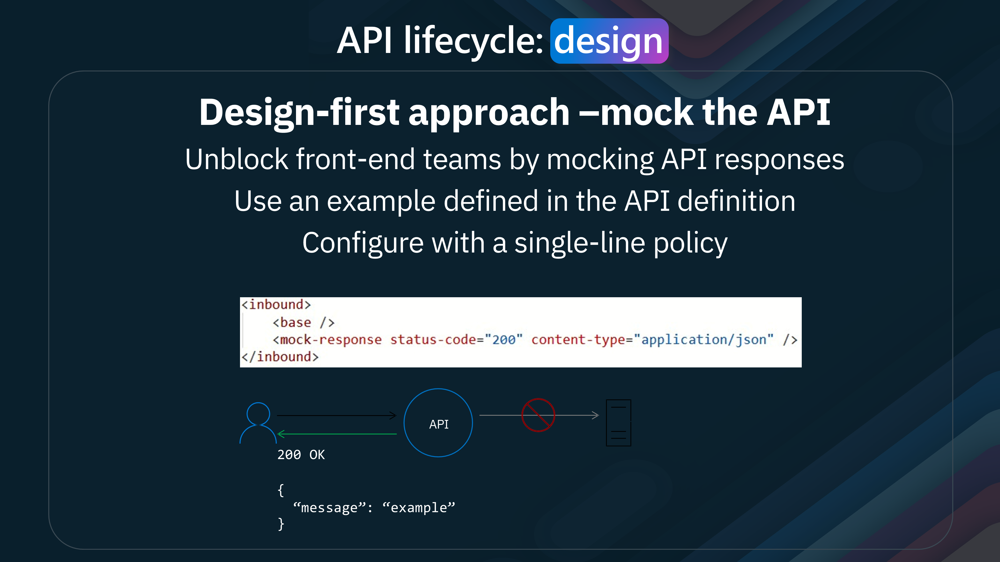

Today, we are going to look at [Azure API Management](https://learn.microsoft.com/azure/api-management/api-management-key-concepts?WT.mc_id=AZ-MVP-5004796). Azure API Management is a service that creates consistent and modern API gateways for existing back-end services. It also publishes APIs to external, partner, and internal developers. Azure API Management is a fully managed service that enables customers to publish, secure, transform, maintain, and monitor APIs.

{/*truncate*/}

# 🌐 Azure API Management Overview

> [Azure API Management](https://learn.microsoft.com/azure/api-management/api-management-key-concepts?WT.mc_id=AZ-MVP-5004796) is a hybrid, multi-cloud management platform for APIs across all environments. As a platform-as-a-service, API Management supports the complete API lifecycle.

We'll examine the API life cycle phases in-depth and explore how Azure API Management can help you efficiently manage your APIs from start to finish.


- **Design**
The first phase of the API life cycle is Design. In this phase, we define the API's purpose, endpoints, and the data it will handle. This involves creating a blueprint for the API, including its structure and functionality. Azure API Management provides tools and templates to help you design efficient, scalable, and easy-to-use APIs.
- **Develop**
Once the design is in place, we move on to the development phase. This is where the actual coding happens. Developers write the code that implements the API's functionality based on the design specifications. Azure API Management supports various development environments and integrates seamlessly with tools like Visual Studio, making the development process smoother and more efficient.
- **Secure**
Security is a critical aspect of API management. We ensure our APIs are protected from unauthorized access and potential threats in the Secure phase. Azure API Management offers robust security features such as authentication, authorization, and encryption. These features help safeguard your APIs and the data they handle, ensuring that only authorized users can access them.
- **Publish**
After securing the API, it's time to make it available to users. The Publish phase involves exposing the API to developers and end-users. Azure API Management provides a developer portal where you can publish your APIs, offer documentation, and manage subscriptions. This makes it easy for developers to discover and start using your APIs.
- **Scale**
As your API gains popularity, you must ensure it can handle increased traffic. The Scale phase focuses on optimizing the API's performance and scalability. Azure API Management allows you to scale your APIs effortlessly, ensuring they can handle large volumes of requests without compromising performance.
- **Monitor**
Monitoring is essential to ensuring your APIs function correctly and efficiently. In the Monitor phase, Azure API Management provides detailed analytics and logging capabilities. You can track usage patterns, monitor performance metrics, and identify potential issues before they impact your users.
- **Analyze**
In the Analyze phase, we use the data collected during monitoring to gain insights into how our APIs are used. Azure API Management offers powerful analytics tools that help you understand user behavior, identify trends, and make data-driven decisions to improve your APIs continuously.

In the modern digital era, transformation is more than just a buzzword—it's necessary. APIs are at the heart of this transformation, enabling connected experiences and seamless integration of services and data.


APIs are crucial in connecting various devices and platforms. Whether it's a smart home system, wearable technology, automotive applications, or industrial equipment, APIs facilitate the communication and interoperability between these diverse endpoints.

Please be sure to think about your daily interactions with technology. From unlocking your smartphone, using applications on your tablet, streaming content on your smart TV, and engaging in augmented reality experiences, APIs are working behind the scenes to ensure a smooth and connected experience. They enable devices and applications to talk to each other, share data, and create a cohesive user experience.

APIs connect various services, databases, servers, and cloud infrastructures. They allow these systems to interact, share data, and coordinate complex functions.

APIs also enable businesses to be agile and adaptive. By exposing functionalities through APIs, companies can quickly integrate new services, scale their operations, and meet evolving customer demands. They empower developers to build robust applications, enhance user experiences, and drive digital growth.

## 📜 API governance

Three crucial aspects of API governance and usage play a significant role in achieving success: 

- **Façade Abstraction**
This concept involves creating an interface that simplifies and standardizes how APIs interact with backend systems.
Aggregate or Slice: APIs can aggregate data from multiple sources or slice it into meaningful pieces for specific use cases. This flexibility allows businesses to present data in the most relevant and valuable way to their users.
Normalize or Modernize: Façade Abstraction also helps normalize or modernize legacy systems, making them compatible with modern applications. This allows you to extend the life of older systems and integrate them with new technologies without extensive rework.
Decouple Lifecycle Mock: Decoupling the API lifecycle from the backend systems ensures that changes in backend services do not disrupt the API functionality. Mocking services during the development and testing phases further ensures smooth transitions and updates.
- **Front Door Control**
This aspect is about managing and controlling how APIs are accessed and utilized.
Route and Accelerate: You can optimize your applications' performance and responsiveness by routing API requests efficiently. Acceleration techniques like caching and load balancing can significantly improve user experience.
Secure and Protect: Security is paramount in API management. Front Door Control involves implementing robust security measures to protect APIs from threats and unauthorized access. These measures include authentication, authorization, and data encryption.
Transform and Observe: Transforming API requests and responses to meet specific requirements and observing API usage patterns helps maintain control and ensure optimal performance. Monitoring tools provide insights into how APIs are being used and can alert you to potential issues before they become critical.
- **Frictionless Consumption**
This principle is about making it easy for developers and users to discover, access, and use your APIs.
Onboarding: A smooth onboarding process is crucial for attracting and retaining users. Clear documentation, tutorials, and support help users quickly understand and start using your APIs.
Discover and Learn: APIs should be easily discoverable. A well-organized developer portal where users can learn about the available APIs, their functionalities, and use cases can achieve this.
Try and Obtain Access: Allowing users to try APIs in a sandbox environment and easily obtain access through streamlined registration encourages experimentation and adoption.

## 🤝 Stakeholders

Azure API Management has the following stakeholders:
 
- **App Developers** 
These are the individuals or teams responsible for creating applications that consume APIs. They use the platform to discover, learn, try, onboard, and get help with APIs.
Employees, Partners.
- **Customers**
These stakeholders leverage the APIs to enhance workflows, integrate systems, and improve customer experiences.
- **Apps on Devices**
These represent the end-user applications that interact with the APIs. They could be mobile apps, web applications, IoT devices, or other software that consumes APIs.

## ✈️ Planes

:::info
Azure API Management consists of three main planes:
 
- **User Plane**
Developer Portal: This portal serves as the primary interface for app developers. It provides resources for developers to discover, learn, try, and onboard with APIs. The portal ensures developers have the support they need to integrate APIs efficiently into their applications.
- **Data Plane**
Gateway: The Gateway is a secure bridge between the API consumers and the backend services. It enforces security policies, manages traffic, and ensures reliable API performance. The gateway handles rate limiting, authentication, and request routing tasks.
- **Management Plane**
API Management Plane: This is where API providers manage the lifecycle of their APIs. The management plane includes tools for abstracting, securing, evolving, observing, and monetizing APIs. This layer ensures that APIs are managed effectively, from creation and deployment to monitoring and analytics.
:::

Azure API Management integrates with various Azure services and microservices, providing a cohesive environment for managing and deploying APIs. This integration allows organizations to leverage the full power of Azure's cloud capabilities, ensuring that their APIs are scalable, secure, and performant.

- **Benefits**

Some of the benefits of Azure API Management include:

* Discoverability: Developers can easily find and access APIs.
* Security: Robust security measures protect data and ensure compliance.
* Scalability: APIs can scale to meet growing demand.
* Efficiency: Streamlined management processes enhance productivity.
* Monetization: Organizations can generate revenue from their APIs.

In conclusion, Azure API Management is a robust platform that enables organizations to create, manage, and scale APIs efficiently. By following the API life cycle phases and leveraging Azure API Management's features, businesses can deliver seamless digital experiences, drive innovation, and stay ahead in today's competitive landscape.

## 📊 Azure API Management plans


Azure API Management offers various service tiers that provide specific capabilities and benefits. Let's explore these tiers in more detail.

- **Consumption Tier**
 
Key Features include:

* No Infrastructure to Provision or Manage: The consumption tier eliminates the need to manage infrastructure. This serverless approach lets you focus solely on your APIs without worrying about the underlying hardware or software.
* Built-in Auto-scaling Down to Zero: It automatically scales to handle varying loads and can scale down to zero during inactivity, ensuring cost-efficiency.
* Consumption-based Micro Billing: Billing is based on actual usage, making it a cost-effective solution for unpredictable or fluctuating traffic applications.
* Variable, Usage-based Monthly Cost: You pay only for what you use, allowing for a flexible and budget-friendly approach.
* No Reserved Capacity: This tier does not require any reserved capacity, making it ideal for projects with uncertain demands.
* Shared Management Plane: The management plane is shared, simplifying administration and reducing costs.
* On-demand Activation: APIs can be activated on demand, providing flexibility and agility.
* Curated Set of Features and Usage Limits: This tier offers a curated set of features and usage limits, ensuring a streamlined and efficient API management experience.

- **Developer, Basic, Standard, and Premium Tiers**
 
Key Features include:

* No Infrastructure to Provision or Manage: Similar to the consumption tier, these tiers also eliminate the need to manage infrastructure, allowing you to focus on development and deployment.
* Manual Scaling or External Auto-scaling: These tiers support manual scaling or external auto-scaling, providing more control over resource allocation.
* Billing Based on Reserved Capacity: Billing is based on reserved capacity, offering predictable and consistent costs.
* Constant, Predictable Monthly Cost: Unlike the consumption tier, these tiers provide a constant, predictable monthly cost, making budget planning easier.
* Reserved Capacity: These tiers offer reserved capacity, ensuring that your APIs can handle consistent and high-demand workloads.
* Dedicated Management, User, and Data Planes: With dedicated planes, you get enhanced security, performance, and isolation, which is crucial for mission-critical applications.
* Always On APIs are always available, ensuring high availability and reliability for your applications.
* Full Set of Features: These tiers offer complete features without governance limits, providing comprehensive capabilities for complex and large-scale API management needs.


Let's delve into the key features of each tier.

| Feature                        | Basic | Basic v2 | Standard | Standard v2 | Premium |
| ------------------------------ | ----- | -------- | -------- | ----------- | ------- |
| Microsoft Entra Integration    | No    | Yes      | Yes      | Yes         | Yes     |
| Virtual Network (VNet) Support | No    | No       | No       | Yes         | Yes     |
| Private Endpoint Support       | Yes   | No       | Yes      | No          | Yes     |
| Multi-region Deployment        | No    | No       | No       | No          | Yes     |
| Availability Zones             | No    | No       | No       | No          | Yes     |
| Autoscaling                    | Yes   | No       | Yes      | No          | Yes     |
| Self-hosted Gateway            | No    | No       | No       | No          | Yes     |
| Backup and Restore             | Yes   | No       | Yes      | No          | Yes     |
| Management over Git            | Yes   | No       | Yes      | No          | Yes     |
| Static IP                      | Yes   | No       | Yes      | No          | Yes     |

> "Accelerate your API strategy with Azure API Management, the comprehensive lifecycle solution trusted by thousands of enterprises worldwide. From abstraction and security to observability and discoverability, the APIM platform empowers you to manage APIs effortlessly across clouds and on-premises environments. Built for reliability, security, scalability, and performance, it's designed to support DevOps and developers, seamlessly integrating with Azure services. Benefit from global availability, robust support, and competitive, accessible pricing—Azure API Management simplifies API management so you can focus on innovation."

## 🔄 API Lifecycle


The API lifecycle consists of several phases, each essential for creating, managing, and optimizing APIs. This lifecycle emphasizes the continuous and iterative nature of API development and management.

- **Design**

The lifecycle begins with the Design phase. In this phase, APIs are conceptualized and defined. 

Key features include:

* Start fast with proxy mode: Quickly create an API proxy to start testing.
* Design and mock: Define and simulate APIs to validate their design.
* Import from a definition: Use existing API definitions to create new APIs.
* Import from Azure resources: Generate APIs based on Azure services.
* Capture schema from test calls: Automatically generate API schemas from sample requests and responses.

- **Develop**

The next phase is Develop, where the API is built and refined. This stage includes:

* 50+ policies: Apply various policies to control API behavior.
* SOAP-to-REST: Convert SOAP services to RESTful APIs.
* Visual Studio Code integration: Use VS Code for development and debugging.
* Live policy debugging: Debug policies in real-time.
* API scaffolding: Automatically generate code and configurations for APIs.

- **Secure**

In the Secure phase, the API's security is ensured. This involves:

* Data | Management | User planes: Secure different aspects of data and management.
* Keys, OAuth, certificates, custom: Implement authentication and authorization mechanisms.
* 1st and 3rd party identity providers: Integrate with various identity providers.
* Request/response validation: Validate API requests and responses for security.
* IP-based access control: Restrict access based on IP addresses.
* Private networking: Secure APIs within private networks.
* Compliance: Ensure APIs comply with industry standards and regulations.

- **Publish**

After securing the API, it is time to Publish it. This stage involves:

* Revisions and versions: Manage different versions and revisions of the API.
* API products, user groups, subscriptions: Organize APIs into products and manage user access.
* Customizable developer portal: Provide a portal for developers to access and use APIs.
* Integrated API playground: Allow developers to test APIs within the portal.
* Export to the Power Platform: Integrate APIs with Microsoft Power Platform.
* Self-service onboarding: Enable users to onboard themselves.
* DevOps: Integrate with DevOps pipelines for continuous integration and deployment.

- **Scale**

Once published, the API needs to be scaled to handle increased demand. The Scale phase includes:

* Worldwide availability: Deploy APIs globally to ensure availability.
* Multi-region deployments: Distribute APIs across multiple regions for redundancy and performance.
* Availability zones: Utilize availability zones to increase reliability.
* Caching: Implement caching to improve performance.
* Auto-scaling: Automatically adjust resources based on demand.
* Hybrid and multi-cloud: Deploy APIs in hybrid and multi-cloud environments.
* Azure Arc enabled: Manage and govern APIs across different environments using Azure Arc.

- **Monitor**

The API must be monitored after scaling to ensure it operates correctly. The Monitor phase involves:

* Azure Monitor: Use Azure Monitor to track and analyze API performance.
* Application Insights: Gain insights into application performance and user behavior.
* Logs | Metrics | Traces | Alerts: Collect and analyze logs, metrics, and traces and set up alerts.
* Configurable verbosity: Adjust the level of detail in logs and metrics.
* E2E request tracing: Trace requests end-to-end to diagnose issues.
* Local telemetry for self-hosted gateway: Collect telemetry data from self-hosted API gateways.

- **Analyze**

Finally, in the Analyze phase, the collected data is used to gain insights and improve the API. This stage includes:

* Built-in reports: Use built-in reports for quick insights.
* Custom reports with Log Analytics: Create custom reports using Log Analytics.
* Reports in Power BI: Visualize data and generate reports using Power BI.
* Custom telemetry pipelines: Set up custom telemetry pipelines for advanced analysis.

This lifecycle ensures that APIs are well-designed, developed, secured, published, scaled, monitored, and analyzed, providing a comprehensive approach to API management.

### 🎨 Design


Code-and design-first approaches to building APIs

API Management supports both approaches to building APIs: 

- **Code-first approach**
Implement the API and generate the API specification as an afterthought (i.e., with Swashbuckle). Benefits: 
More convenient for API developers: The only option for existing APIs

- **Design-first approach**
Create an API specification, review it with stakeholders, and implement the API Kickstart development by scaffolding the code from the API specification. 

Benefits: 

Better API consumer experience thanks to the deliberate API design Reduced risk thanks to the API review processes



You can create APIs

* Support for SOAP, REST, WebSocket and GraphQLAPIs
* Import an API from OpenAPI(1, 2, or 3), WADL, or WSDL files
* Import an API from App Service, Logic App, Function App, or Container App
* Create a blank API


So, let us create a new API by importing the [Star Wars API](https://swapi.dev/).

1. Open your Azure API Management instance
2. Navigate to APIs
3. Click on + Add API
4. Click on HTTP (manually define an HTTP API)
5. Select Full
5. Fill in the details:
   - Display name: Star Wars
   - Name: star-wars
   - Description: Star Wars API
   - Web service URL: https://swapi.dev/api
   - API URL suffix: starwars
6. Click Create
Now that we have imported our initial API endpoint, we can start defining the operations we want to expose.
1. Click on + Add operation
2. Fill in the details:
   - Display name: Get People
   - Name: get-people
   - URL template: /people
   - HTTP verb: GET
Now, let's add another operation to get information about Starships in the Star Wars universe. Fill in the details:
   - Display name: Get Starships
   - Name: get-starships
   - URL template: /starships
   - HTTP verb: GET

Now let us test it.

1. Click on Get Starships API operation
2. Click on test
3. Click + Add parameter 
4. Type in Search in the name and the value as 'Star Destroyer'
5. Click Send


:::tip
You can use a wildcard in the URL path if you are not sure of an accurate specification while you work on the API design.


:::

Now that we have imported and tested an existing API, let's consider designing a new one.


 Azure offers powerful resources to streamline and enhance our workflow.

Defining the API:

First, let's talk about defining our API. Azure provides two main approaches:

Form-Based Editors:

These editors are highly intuitive, offering a user-friendly interface to input all necessary details about your API.
Perfect for those who prefer a guided, step-by-step setup.

Text-Based Editors:

For those more comfortable with coding, Azure allows us to edit the API definition directly in JSON format.
This method offers greater flexibility and control over the API specifications.

Visual Studio Code Extension:

In addition to the Azure portal, you can also leverage the Visual Studio Code extension. This extension integrates seamlessly with Azure, allowing you to manage and define your APIs directly within your development environment. It's an excellent tool for developers who prefer to work locally.

Testing the API:

Once the API is defined, the next crucial step is testing. Azure simplifies this process in several ways:

Azure Portal Testing:
You can test your API directly within the Azure portal. This feature lets you ensure everything functions correctly without switching between multiple tools.
Schema Generation:
Azure can generate schemas from your API responses. These schemas provide a clear structure of your API's data, ensuring that both developers and consumers understand the expected input and output formats.



Adopting a design-first approach can significantly enhance efficiency and collaboration. One technique we can utilize is mocking the API. Let's explore how this approach can benefit our development workflow.

Design-First Approach - Mock the API:

1. Unblock Front-End Teams:

Mocking API responses is a game-changer for front-end developers.
Providing predefined responses enables front-end teams to continue their development work without waiting for the back-end to be fully implemented.
This leads to parallel development, reducing bottlenecks and speeding up the overall project timeline.

2. Use an Example Defined in the API Definition:

The process starts with defining an example response within the API definition.
This predefined response acts as a placeholder, simulating the actual API behavior.
It ensures that front-end teams have consistent and reliable data to work with during the early stages of development.
3. Configure with a Single-Line Policy:

One of Azure API Management's standout features is the ability to configure mocking with a simple, single-line policy.

As shown in the example on the image, the policy can be written as:

```xml
<inbound>
  <base />
  <mock-response status-code="200" content-type="application/json" />
</inbound>
```


This configuration tells the API to return a mock response with a status code of 200 and a content type of application/json.


[WebSocket API](https://learn.microsoft.com/azure/api-management/websocket-api?tabs=portal&WT.mc_id=AZ-MVP-5004796) support enables real-time communication, making our APIs more dynamic and responsive.

[WebSocket API](https://learn.microsoft.com/azure/api-management/websocket-api?tabs=portal&WT.mc_id=AZ-MVP-5004796) support in Azure API Management opens up a whole new realm of possibilities for real-time applications. Let's delve into what this entails and how it can benefit our API infrastructure.

Passthrough Support for WebSocket APIs:

1. Establishing Connections:

Client applications can establish WebSocket connections directly with API Management (APIM).
This setup allows for continuous, two-way communication between clients and backend services.
Once the connection is established, APIM seamlessly proxies WebSocket messages to the backend services, ensuring smooth and reliable communication.

2. Features of WebSocket API Support:

CRUD Operations:

With WebSocket API support, we can perform Create, Read, Update, and Delete (CRUD) operations on WebSocket APIs.
This flexibility ensures that our APIs can handle various real-time data interactions effectively.

Apply Policies:

We can apply policies to handshake requests, which is crucial for managing security, authentication, and other operational requirements.
These policies ensure that only authorized and legitimate requests can establish WebSocket connections.
Browse and Test:

WebSocket APIs can be easily browsed and tested within the Azure and Developer portals.
This capability allows developers to interact with and validate the WebSocket APIs during the design and development phases.

Monitoring and Logging:

Azure Monitor provides metrics and logs specifically for WebSocket APIs.
These monitoring tools enable us to track performance, detect issues, and gain insights into the usage patterns of our WebSocket connections.

### 🛠️ Develop


Azure API Management offers a range of features to streamline the development process and enhance the functionality of our APIs.


APIs are the backbone of modern digital ecosystems, enabling connected experiences across various devices and services. However, managing these APIs efficiently comes with its own set of challenges. API management steps in, providing a structured approach to streamlining the API lifecycle.

1. Consume:

_(Developer Portal)_

The first pillar of API management is the Developer Portal.
This portal is a crucial interface where developers can discover, understand, and consume APIs.
It provides comprehensive documentation, code samples, and testing tools, making it easier for developers to integrate APIs into their applications.
The Developer Portal offers a centralized hub for API information, enhancing developer productivity and reducing the time to market for new applications.

2. Mediate:

_(Gateway)_

The gateway is at the heart of API management. It mediates the communication between client applications and backend services.
The Gateway ensures secure, reliable, and efficient API traffic management.
It provides various capabilities, such as load balancing, rate limiting, and security enforcement.
By mediating API requests, the Gateway helps scale applications, protect against malicious attacks, and ensure consistent performance.

3. Publish:

_(Azure Portal)_

The third pillar is the Azure Portal, where APIs are published and managed.
This portal allows API providers to define and publish their APIs, making them available to developers.

It offers tools for monitoring API usage, setting up policies, and managing API versions.
API providers can ensure their APIs are robust, secure, and up-to-date through the Azure Portal.


APIs are essential for modern digital ecosystems, but managing them efficiently can be complex. API management provides a unified approach to streamlining the interaction between products and backend services.

Products:

* Diverse Product Integration:

We have multiple products (Products 1 to 5) at the top. Each product has unique functionalities and API requirements.
These products represent different applications and services that need to communicate with various backend systems.

API Management Layer:

* Centralized Management:

The middle section represents the API Management layer, a crucial component in this architecture.
API Management acts as a mediator, facilitating seamless communication between the products and the backend services.
It standardizes API interactions, ensuring consistency, security, and reliability.

* Backend Systems:

Backend on Azure and On-premises:
At the bottom, we see the backend systems, categorized into Azure-based and on-premises backends.
Azure backends include services such as Azure Functions, Virtual Machines, and Logic Apps.
On-premises backends consist of traditional servers and databases.
API Management ensures that products seamlessly interact with cloud-based and on-premises backend systems.
Critical Benefits of API Management:

* Unified API Gateway:

Provides a single entry point for all API requests, simplifying the management of APIs across multiple products and services.
Enhanced Security:

Secure communication between products and backend systems is ensured through authentication, authorization, and rate-limiting policies.

* Scalability:

Handles large volumes of API traffic, enabling applications to scale efficiently.

* Monitoring and Analytics:

Offers insights into API usage, performance metrics, and error tracking, helping in proactive management and optimization.
Developer Empowerment:

Facilitates a developer-friendly environment with comprehensive documentation, testing tools, and self-service capabilities.


Policy Scopes


Let's examine the policy scopes. Understanding the scope is crucial to applying the right policy in the right place. Policies are inherited from the parent scope to the child scope.

So let us go through them.

* Global _(Red Border)_

Description: Global policies apply to all requests and responses passing through the API Management instance. They are the outermost scope, impacting every operation, API, and product.
Usage: Commonly used for policies like CORS _(Cross-Origin Resource Sharing)_ and logging, which should be consistent across the entire API Management instance.

* Workspace _(Yellow Border)_

Description: This scope is associated with a workspace, which groups related APIs and other components within API Management.
Usage: Policies defined at this level are used when consistent policy enforcement is needed across multiple APIs belonging to the same workspace.

* Product _(Green Border)_

Description: Product-level policies apply to all APIs included within a specific product. Products are a way to bundle APIs together for subscription and access management.
Usage: Common for setting rate limits and quotas that apply to all APIs in the product, helping to manage usage and prevent abuse.

* API _(Blue Border)_

Description: API-level policies apply to all operations within a specific API. This scope allows for API-wide behavior customization.
Usage: Often used for API-specific security measures like JWT (JSON Web Token) validation or other API-wide configurations.

* Operation _(Purple Border)_

Description: Operation-level policies are the most granular and apply to a specific operation within an API _(e.g., a single endpoint or method)_.
Usage: Useful for operation-specific requirements like caching, URL rewriting, or request/response transformation.

* Inbound and Outbound policies

Inbound policies are applied as the request comes in from the caller, and outbound policies are applied as the response is sent back to the caller after being processed by the backend.

Each of these scopes allows for different levels of customization and control over how requests and responses are handled within Azure API Management.

If we take a look at the [policy named values](https://learn.microsoft.com/azure/api-management/api-management-howto-properties?tabs=azure-portal&WT.mc_id=AZ-MVP-5004796) and [expressions](https://learn.microsoft.com/azure/api-management/api-management-policy-expressions?WT.mc_id=AZ-MVP-5004796).


We can see that Named Values are a powerful feature in Azure API Management that allows us to define reusable variables and secrets that can be used across policies.

> Policies are a collection of statements that are executed sequentially on the request or response of an API. Policy statements can be constructed using literal text values, policy expressions, and named values.

Named values are a global collection of name/value pairs in each API Management instance. There is no imposed limit on the number of items in the collection. Named values can be used to manage constant string values and secrets across all API configurations and policies.

Lets take a look at some out of the box policies


Azure API Management includes, "Out of the box policies" provides the majority of use cases that that can be implemented to manage access, transform data, advance functionalities, integrate with Dapr, authenticate users, cache data, manage cross-domain calls, and validate information. 

Let us delve into each category to understand the capabilities these policies offer.

* **Access Restriction**

Access restriction policies are crucial for controlling who can access your services and how often. These policies include:

Check HTTP header: Validates headers in HTTP requests.
Limit call rate by subscription/key: Controls the rate of API calls based on the subscription or key.
Restrict caller IPs: Allows access only from specified IP addresses.
Set usage quota by subscription/key: Limits the usage based on subscription or key.
Validate client certificate: Ensures the authenticity of the client via certificates.
Validate JWT (JSON Web Token): Verifies the token to ensure secure access.

* **Transformation**

Transformation policies handle the modification and conversion of data formats and content. These policies include:

Convert JSON to XML / XML to JSON: Transforms data between JSON and XML formats.
Find and replace string in body: Replaces specific strings in the request or response body.
Mask URLs in content: Hides sensitive URLs within the content.
Set backend service/body/HTTP header/query string parameter: Customizes backend service configurations and request parameters.
Rewrite URL: Modifies the URL of incoming requests.
Transform XML using XSLT: Applies XSLT to transform XML data.

* **Advanced**

Advanced policies provide extended functionalities for handling requests and responses. These include:

Send one-way request / request: Facilitates sending HTTP requests.
Set HTTP proxy / request method / status code / variable: Configures proxy, method, status code, and variables.
Control flow / Emit metric: Manages the flow of requests and emits metrics.
Log to Event Hub / Trace: Logs events and traces for monitoring.
Mock response / Forward request: Creates mock responses or forwards requests.
Limit concurrency / Return response / Retry / Wait: Manages concurrency, responses, and retry mechanisms.

* **Dapr Integration**

Dapr (Distributed Application Runtime) integration policies enable communication with Dapr services:

Send request to a service / message to a pub/subtopic: Facilitates interaction with Dapr services and pub/subtopics.
Trigger output binding: Initiates output bindings in Dapr.

* **Authentication**

Authentication policies ensure that only authorized users can access your services:

Authenticate with basic / client certificate / managed identity: Supports various authentication methods to verify user identity.

* **Caching**

Caching policies improve performance by storing and retrieving data from the cache:

Store to cache / Get value from cache / Store value from cache / Remove value from cache: Manages caching operations to optimize data retrieval.

* **Cross Domain**
Cross-domain policies handle calls across different domains:

CORS / JSON: Manages cross-origin resource sharing and JSON data handling.

* **Validation Policies**

Validation policies ensure the integrity and correctness of data:

Validate content/parameters/headers/status code / GraphQL request: Check the validity of content, parameters, headers, status codes, and GraphQL requests.

An example of policies that are useful is **Request Forwarding**:


This policy is usually inherited from the global scope via the <base/> tag. If no specific policy is set, it defaults to the base configuration.
Timeout Settings: The forwarding timeout can be configured between 30 seconds to 10 minutes, with the default being 5 minutes.
Redirect Handling: It can be configured to follow redirects or, by default, return them to the caller.

* You can configure Retry (<retry/>)

Triggering Conditions: Retry is triggered when a specified expression evaluates to true.
Backoff Intervals: Offers options for fixed, linear, or exponential backoff intervals.
Fast First Retry: An optional feature for a quick retry attempt.
Request Copy: Does not retain a copy of the request automatically, ensuring efficient resource utilization.

* Limit Concurrency (<limit-concurrency/>)

Concurrency Cap: Caps the number of concurrent requests forwarded to the backend to prevent overloading.
Policy Integration: Can be used in conjunction with other policies to limit the number of requests entering enclosed policies.
Set Backend Service (<set-backend-service/>)

Runtime Changes: Allows changing the backend service during runtime, providing flexibility in managing backend services.
Conditional Policies: Can be configured with conditional policies for blue/green deployment, ensuring smooth transitions and updates.

and Authentication (<authentication/>)


Such as:

* validate-jwt

Purpose: Validates JSON Web Tokens (JWTs).
Supported Standards:
* JWS (JSON Web Signature)
* JWE (JSON Web Encryption)
* RSA256 and HS256 algorithms
* OpenID Configuration: Supports OpenID Configuration endpoints for validation.
* Claims Validation: Can check specific claims within the JWT.
* Scope: Can be configured at any policy scope, offering flexibility in where it is applied.

* validate-client-certificate

Purpose: Enforces that a certificate presented by a client matches the specified validation rules and claims.
Key Attributes:
* validate-revocation="true": Ensures the certificate has not been revoked.
* validate-trust="true": Checks that the certificate is trusted.
* validate-not-before="true": Ensures the certificate is not used before a certain date.
* validate-not-after="true": Ensures the certificate is not used after a certain date.
* ignore-error="false": Indicates whether errors should be ignored.

Identities Section:

Contains one or more identity elements.

* Each identity element includes a thumbprint attribute, identifying the specific certificate by its thumbprint.

Let us take a look at the [Azure API Management Visual Studio Code extension](https://marketplace.visualstudio.com/items?itemName=ms-azuretools.vscode-apimanagement).


The Azure API Management Visual Studio Code extension provides a seamless experience for managing APIs directly from your development environment.


The extension allows us to test and edit APIs directly from Visual Studio Code and push those changes straight to Azure API Management, streamlining the development process and enhancing productivity.


Let us take a look at some of the Deployment Options for Azure API Management.


Azure API Management is an ARM (Azure Resource Manager) resource and can be deployed using [ARM templates](https://learn.microsoft.com/azure/azure-resource-manager/templates/overview?WT.mc_id=AZ-MVP-5004796), [Bicep](https://learn.microsoft.com/azure/azure-resource-manager/bicep/overview?tabs=bicep&WT.mc_id=AZ-MVP-5004796), or [Terraform](https://registry.terraform.io/providers/hashicorp/azurerm/latest/docs).

:::info
It is worth noting that Azure API Management has a [Landing Zone Accelerator](https://learn.microsoft.com/en-us/azure/cloud-adoption-framework/scenarios/app-platform/api-management/landing-zone-accelerator?WT.mc_id=AZ-MVP-5004796), which is a set of pre-built configurations and best practices for deploying Azure API Management in a secure and compliant manner.


:::

[APIOps](https://azure.github.io/apiops/) is a set of practices and tools that help organizations manage the full lifecycle of APIs, from design to deprecation. It combines the principles of DevOps with API management to streamline API development and deployment.


APIOps can be used to automate API management tasks, improve collaboration between development and operations teams, and ensure consistency and quality across APIs, and API Management environments, such as Development, Testing and Production.

### 🔒 Secure


Security is a critical aspect of API management, ensuring that APIs are protected from unauthorized access, data breaches, and other security threats. Azure API Management offers a range of security features to safeguard APIs and ensure compliance with industry standards.

The [Open Web Application Security Project (OWASP)](https://owasp.org/) has identified the top 10 critical API security risks for 2023


| **#**                                                                                                                                                                                        | **Threat**                                      | **Description**                                                             | **Mitigation**                                                                                                                                                                                                                                                                                                   |
|----------------------------------------------------------------------------------------------------------------------------------------------------------------------------------------------|-------------------------------------------------|-----------------------------------------------------------------------------|------------------------------------------------------------------------------------------------------------------------------------------------------------------------------------------------------------------------------------------------------------------------------------------------------------------|
| 1                                                                                                                                                                                            | Broken Object Level Authorization               | Unauthorized access to objects.                                             | Implement key/token/certificate-based authentication and request transformation. Policy-based Access Control: Use policies to enforce authorization rules. OAuth2/JWT: Integrate with Entra ID for token validation.                                                                                             |
| 2                                                                                                                                                                                            | Broken Authentication                           | Weak authentication mechanisms.                                             | Use strong key/token-based authentication methods and transform requests appropriately. Authentication Policies: Enforce authentication using OAuth2, OpenID Connect, certificates, and API keys.                                                                                                                |
| 3                                                                                                                                                                                            | Broken Object Property Level Authorization      | Unauthorized access to object properties.                                   | Filter or mask sensitive data and ensure both request and response validations. Data Masking: Use policies to mask sensitive data. Validation: Validate input to ensure only authorized properties are accessed.                                                                                                 |
| 4                                                                                                                                                                                            | Unrestricted Resource Consumption               | Overuse of resources leads to service denial.                               | Apply throttling and quota limits and manage backend concurrency effectively. Rate Limiting and Quotas: Use policies to set rate limits and quotas. Caching: Reduce load by caching responses.                                                                                                                   |
| 5                                                                                                                                                                                            | Broken Function Level Authorization             | Unauthorized access to functions.                                           | Enforce key/token-based and custom authorizations. Role-Based Access Control (RBAC): Use Azure RBAC to control access to different API operations. Request Validation: Validate incoming requests to ensure they don't contain malicious URLs. Network Security: Use VNETs and NSGs to control outbound traffic. |
| Configuration Management: Use Azure Policy and deployment stacks to enforce security configurations. Automated Deployments: Use CI/CD pipelines to ensure consistent and secure deployments. |                                                 |                                                                             |                                                                                                                                                                                                                                                                                                                  |
| 6                                                                                                                                                                                            | Unrestricted Access to Sensitive Business Flows | Uncontrolled access to critical business operations.                        | Validate all requests and responses meticulously. Custom Policies: Implement custom policies to validate requests and responses, ensuring sensitive operations are protected.                                                                                                                                    |
| 7                                                                                                                                                                                            | Server-Side Request Forgery (SSRF)              | Attackers tricking the server into making requests to unintended locations. | Validate remote resources and user-supplied URIs and ensure response validation.                                                                                                                                                                                                                                 |
| 8                                                                                                                                                                                            | Security Misconfiguration                       | Incorrectly configured API settings.                                        | Maintain an up-to-date API catalog and manage the API lifecycle rigorously.                                                                                                                                                                                                                                      |
| 9                                                                                                                                                                                            | Improper Inventory Management                   | Exposing more endpoints than necessary.                                     | Regularly update and document your API endpoints to manage exposure effectively. API Versioning: Implement API versioning to manage the exposure of endpoints. Documentation: Keep API documentation updated and use tools like Swagger or OpenAPI.                                                              |
| 10                                                                                                                                                                                           | Insufficient Logging and Monitoring             | Lack of proper logging and monitoring mechanisms.                           | Ensure comprehensive and updated documentation and maintain robust logging and monitoring practices. Azure Monitor and Application Insights: Integrate with these services for comprehensive logging and monitoring. Alerts: Set up alerts for unusual activities.                                               |
                                            |      |


Azure API Management provides a range of security features to protect APIs from these threats.

Let us take a look at securing the different planes of Azure API Management.


| Plane Name        | Used For                                                          |  
|-------------------|-------------------------------------------------------------------|  
| User Plane        | Securing user interactions and data at the entry point.           |  
| Management Plane  | Managing and securing interactions between API providers and the management system. |  
| Data Plane        | Securing the flow and integrity of data between the gateway and backend services. |  


In today's interconnected digital landscape, securing backend APIs is paramount. One key strategy for achieving this is through robust data plane security. This layered defense mechanism protects sensitive data and applications from unauthorized access and malicious attacks. Let's delve deeper into how data plane security works and the roles of its components.

**Firewall: Blocking Suspicious Requests**

The first line of defense in data plane security is the firewall. It acts as a gatekeeper, scrutinizing incoming requests to block any that appear suspicious. The firewall employs several rule sets and mechanisms to identify and mitigate potential threats:

* OWASP Core Rule Sets: These are standardized rules for detecting common web application security risks.
* Bot Protection Rule Set: This helps in identifying and blocking automated bot traffic that could pose security risks.
* Custom Rules: Organizations can define their own rules tailored to their specific security requirements.

**Gateway: Authenticating and Authorizing Requests**

Once a request passes through the firewall, it reaches the gateway. The gateway is responsible for performing in-depth request authentication and authorization to ensure only valid requests proceed. Key functions of the gateway include:

* Authentication Mechanisms: OAuth 2, client certificates, and custom authentication methods.
* Authorization Mechanisms: Including IP filtering and custom authorization rules.
* Request/Response Validation: Ensuring that both incoming requests and outgoing responses meet predefined security criteria.
* Throttling: Managing the rate of incoming requests to prevent denial-of-service (DoS) attacks.

**Backend APIs: Fine-Grained Authorization**

The final layer involves the backend APIs themselves, which must accept requests only from trusted sources. This layer applies fine-grained authorization to enforce strict access controls. Key security measures include:

* HTTP Basic (Shared Secret): Simple but effective method for authenticating requests.
* Mutual Certificates: Ensuring both client and server authenticate each other.
* OAuth 2: Secure token-based authentication.
* Managed Identity and IP Filtering: This involves restricting access based on IP addresses and managing identities to enforce security policies.
* Private Networking: Isolating the APIs within a secure network environment.


Let's take a look at the security considerations when networking.


Azure API Management has two networking options:

* Internal
* External

The [internal](https://learn.microsoft.com/azure/api-management/api-management-using-with-internal-vnet?tabs=stv2&WT.mc_id=AZ-MVP-5004796) option is more secure, as it is not exposed to the public internet. It is ideal for scenarios where you want to restrict access to your APIs to only internal clients or services.
The [external](https://learn.microsoft.com/azure/api-management/api-management-using-with-vnet?tabs=stv2&WT.mc_id=AZ-MVP-5004796) option is exposed to the public internet, making it accessible to a broader audience. This option suits scenarios where you want to provide public access to your APIs.


You can also use the best of both worlds by allowing Azure API Management in Internal mode to publish APIs to the Internet or external customers and using Azure Front Door or Azure Application Gateway to expose the APIs to the Internet.


Deciding between using Azure API Management (APIM) in Internal or External mode depends on your specific requirements for security, accessibility, and network configuration. Here are some key considerations:

* Internal Mode

Accessibility: The APIM endpoints are accessible only from within the Virtual Network (VNet) via an internal load balancer.
Security: This mode is more secure as it restricts access to the APIM endpoints to only those resources within the VNet.
Use Case: This is ideal for scenarios where you need to protect sensitive APIs and ensure that they are only accessible from within your organization’s network.

* External Mode

Accessibility: The APIM endpoints are accessible from the public internet via an external load balancer.
Security: While still secure, this mode allows for broader access, including from the internet.
Use Case: Suitable for scenarios where you must expose APIs to external clients or partners.

Deciding between Internal and External modes depends on your specific requirements and use case. Consider your APIs' security, accessibility, and network configuration needs to determine the best mode for your scenario.

For example:

Security Requirements: Internal mode is preferable if your APIs handle sensitive data.
Accessibility Needs: If you need to provide access to external clients, external mode is the way to go.
Network Configuration: Consider your existing network setup and how APIM will integrate.


Azure API Management meets Compliance requirements, such as:

* GDPR
* HIPAA
* ISO 27001 PCI

More information on the compliance can be found here: [Azure compliance documentation](https://learn.microsoft.com/azure/compliance/?WT.mc_id=AZ-MVP-5004796)

### 🚀 Publish


Once an API is designed, developed, and secured, it is ready to be published. Azure API Management offers a range of features to help you publish and manage your APIs effectively.

One of those features is the Developer Portal.


The Developer Portal in API Management _(APIM)_ is a discovery and self-onboarding point for application developers. Here are the primary functions and features it offers:

* Discover APIs:
Developers can explore and find available APIs to integrate into their applications.
* Learn How to Use Them:
The portal provides comprehensive documentation and tutorials to help developers understand how to use the APIs effectively.
* Test Them Out with Interactive Console:
Developers can interactively test the APIs within the portal using a built-in console. This allows them to see how the APIs work and validate their functionality before integrating them into their applications.
* Create and Manage Accounts:
Developers can create accounts on the portal, manage their profiles, and keep track of their API usage and subscriptions.
* Request and Manage API Access:
The portal enables developers to request access to specific APIs and manage their access permissions, ensuring they have the appropriate level of access for their needs.
* Analyze API Usage:
Developers can analyze their API usage data to monitor performance, identify trends, and optimize their application's interaction with the APIs.

The Developer Portal is customizable, allowing organizations to tailor it to their needs and branding. It is a central hub for developers to discover, learn, and interact with APIs, streamlining the API consumption process and fostering collaboration between API providers and consumers.


You can also self-host the Developer Portal, whether in an App Service, a Virtual Machine, or a Kubernetes Cluster. 

You can find the files here: [Azure/api-management-developer-portal](https://github.com/Azure/api-management-developer-portal). 


Let us take a look at Revisions and Versions.


Azure API Management provides the ability to manage [revisions](https://learn.microsoft.com/azure/api-management/api-management-revisions?WT.mc_id=AZ-MVP-5004796) and [versions](https://learn.microsoft.com/azure/api-management/api-management-versions?WT.mc_id=AZ-MVP-5004796) of APIs, allowing you to make changes and updates without affecting existing consumers.


| Scenario                                     | Description                                                                                       | Benefits                                                                                          |  
|----------------------------------------------|---------------------------------------------------------------------------------------------------|---------------------------------------------------------------------------------------------------|  
| Non-Breaking Changes to Your API             | Modifications that do not disrupt existing end-user functionality.                        | - Track and document changes systematically.                                                      |  
|                                              |                                                                                                   | - Ensure a smooth transition for developers using the API.                                        |  
| Potential Roll-Back of Changes               | Reverting to a previous stable state if new changes cause problems.                                | - Quickly revert to a stable state.                                                               |  
|                                              |                                                                                                   | - Minimize downtime and maintain service reliability.                                             |  
| Communicating Changes to Your Developer Community | Keep your developer community informed about your changes.                              | - Provide detailed logs and documentation of changes.                                             |  
|                                              |                                                                                                   | - Help developers understand how updates might affect their applications and how to adapt to them. |  


| Scenario                                      | Description                                                                 | Benefits                                                               |  
|-----------------------------------------------|-----------------------------------------------------------------------------|------------------------------------------------------------------------|  
| Show relationship between APIs                | Demonstrating how different versions of APIs are related                    | Helps developers understand the evolution and compatibility of APIs     |  
| Provide a predictable way to switch APIs        | Giving developers a clear method to switch between different API versions   | Reduces confusion and ensures smoother transitions between versions     |  
| Add breaking changes                          | Introducing changes that are not backward compatible                        | Allows for significant improvements and updates without disrupting users|  
| Try out changes and solicit feedback          | Testing new features or changes and gathering community feedback            | Encourages community engagement and helps refine the API before release |  

Let's look at the following flowchart to decide between revisions and versions.


Now that we have reviewed the Revisions and versions, let's examine [Products](https://learn.microsoft.com/azure/api-management/api-management-howto-add-products?tabs=azure-portal&WT.mc_id=AZ-MVP-5004796).

> In Azure API Management, a product contains one or more APIs, a usage quota, and the terms of use. After a product is published, developers can subscribe to the product and begin to use the product's APIs.

APIs _(Application Programming Interfaces)_ enable seamless interaction between software applications. However, managing multiple APIs can be challenging. Bundling APIs with products has emerged as an effective strategy to streamline this process.


API bundling involves grouping multiple APIs into a single package or product. This approach simplifies developers' and organizations' management, subscription, and usage of APIs.

* Developer Portal
Browse Products: Developers can explore various API products available in the portal.
Subscribe to Products: Once a suitable product is identified, developers can subscribe to it.
Manage Subscriptions and Keys: The portal allows developers to manage their subscriptions and obtain the necessary API keys.

* Management Plane
Manage Products and API Associations: Administrators can define and manage the associations between products and their respective APIs.
Define Product-Scoped Policies: Specific policies can be set for each product, ensuring controlled and secure access.
Approve and Manage Subscriptions: Administrators can approve subscription requests and manage existing subscriptions.
Collect and Analyze Usage Data: Usage data is collected and analyzed to monitor and optimize API performance.
Monetize Access: Administrators can monetize API access by setting pricing plans and usage limits.

* Gateway
Authenticate API Requests: The gateway authenticates incoming API requests using the provided keys.
Execute Product-Scoped Policies: It ensures that the defined policies for each product are enforced during API execution.


Understanding the relationships between users, groups, products, APIs, and subscriptions is crucial for efficient and effective management.

| Entity         | Relationships                                      |  
|----------------|-----------------------------------------------------|  
| **User**       | - Can have many Subscriptions                      |  
|                | - Can belong to many Groups                        |  
| **Group**      | - Can contain many Users                           |  
|                | - Can have many Subscriptions                      |  
|                | - Built-in: Guest, Developer, Admin                |  
|                | - Custom: native or Entra ID                       |  
| **Subscription**| - Each Subscription is related to one User or Group|  
|                | - Can provide access to one Product                |  
| **Product**    | - Can be part of many Subscriptions                |  
|                | - Can contain many APIs                            |  
| **API**        | - Each API is part of one Product                  |  


### 📏 Scale


Azure and the Azure API Management service have a significant [global footprint](https://azure.microsoft.com/en-au/explore/global-infrastructure/products-by-region?WT.mc_id=AZ-MVP-5004796), with 44+ public regions worldwide, 6 regions for US government use, and 4 regions in China, showcasing its extensive infrastructure and specialized services.


Azure API Management's multi-region deployment offers a robust solution for improving API reliability and reducing latency. Let's dive into the key features and benefits of this setup.
Improved Availability and Reduced Latency
 
One of the standout features of Azure API Management's multi-region deployment is the significantly improved availability of the data plane. You can expect minimal downtime with a Service Level Agreement (SLA) of 99.99% compared to the standard 99.95%. This increased reliability ensures that your APIs remain accessible to users worldwide, enhancing the overall user experience.

* Scalability Across Multiple Regions
 
A single Premium instance of Azure API Management can be scaled across multiple regions. This flexibility allows you to deploy additional units into the primary or secondary regions based on your needs. However, regions and units come at an additional cost. This scalability ensures that your API infrastructure can grow alongside your business demands.

* Primary and Secondary Regions
 
In a multi-region deployment, the primary region hosts all components, including the gateway, developer portal, management API, and developer portal API. If the primary region becomes unavailable, these components are inaccessible, highlighting the importance of a robust primary region setup.

On the other hand, secondary regions host only the gateway. These secondary gateways can operate on the last received configuration while the primary area is unavailable. They periodically try to reconnect and catch up, ensuring that API requests continue to be processed even during primary region outages.

* Global API Availability
 
One of the most significant advantages of multi-region deployment is that all APIs are available in every region. Azure Traffic Manager plays a crucial role in routing requests to the closest available region in this setup. Using Traffic Manager’s performance routing with a 5-minute Time-to-Live (TTL), API requests are efficiently managed, reducing latency and improving response times for users worldwide.


Lets take a look at the nuances on the anatomy of an Azure API Management instance.


An Azure API Management instance with 1 unit, represented by two machines (Machine #1 and Machine #2). Each machine has a set of components that work together to manage and secure APIs.

| Machine   | Component      | Description                                                                 |  
|-----------|----------------|-----------------------------------------------------------------------------|  
| Machine #1| Control-Plane  | The administrative interface for configuring and managing APIs and policies.|  
|           | Gateway        | Handles API requests and applies rate limiting and authentication policies.|  
|           | Developer Portal | Customizable portal for developers to discover, learn, and use APIs.       |  
| Machine #2| Control-Plane  | Redundant administrative interface for high availability.                   |  
|           | Gateway        | Redundant API Gateway for load balancing and fault tolerance.               |  
|           | Developer Portal | Another instance of the Developer Portal to ensure high availability.      |  

This is a typical setup of an Azure API Management instance. It emphasizes redundancy and high availability by distributing core components (Control-Plane, Gateway, and Developer Portal) across multiple machines. This setup ensures the API management service remains operational even if one machine fails. 

However, to ensure high availability and disaster recovery, one may want to expand the Azure API Management instance to another region.


When you scale an Azure API Management instance to another region, you are essentially creating a secondary region deployment. This setup provides high availability and disaster recovery capabilities, ensuring your APIs remain accessible even during a regional outage by expanding the Gateway service. All Control planet traffic and the developer portal are still managed by the primary region, however your APIs will still function.


By deploying your APIM instance across two or more Availability Zones within a single region, you can achieve a Service Level Agreement (SLA) of 99.99%. 
In a multi-region deployment, using Availability Zones can enhance the resiliency of the primary region. Even if one zone experiences an outage, the services can operate seamlessly from another zone within the same region.

Every unit deployed across the Availability Zones includes all necessary API Management components, ensuring comprehensive coverage and functionality.

Using Availability Zones in Azure API Management provides enhanced availability, reliability, and resiliency for your API services, especially in a multi-region deployment. This setup ensures that your APIs remain accessible and operational even in the face of regional outages or disruptions.

Now, let us take a look at self-hosting your own Gateway. 


The self-hosted API gateway is functionally equivalent to the managed gateway. This feature provides flexibility, allowing the gateway to be deployed on-premises or in the cloud, depending on the organization's needs. The self-hosted gateway requires only outgoing connectivity to Azure _(API Management Gateway)_ on port 443.

The self-hosted gateway connects to a "parent" API Management service in Azure. It pulls down configuration settings and pushes up telemetry data to Azure. This integration with Azure allows for centralized management and monitoring, simplifying the oversight and control of the API gateway.


Now, let us take a look at [Dapr](https://dapr.io/) and Azure API Management.

:::info
> [Azure API Management is a way to create consistent and modern API gateways for back-end services, including those built with Dapr](https://docs.dapr.io/developing-applications/integrations/azure/azure-api-management/). You can enable Dapr support in self-hosted API Management gateways to allow them to:

Forward requests to Dapr services
Send messages to Dapr Pub/Sub topics
Trigger Dapr output bindings
:::


* Dapr can work with self-hosted Azure API Management gateways and invoke services running in different pods. This allows for seamless communication between microservices within the Kubernetes cluster. 
* Dapr supports publish/subscribe messaging, enabling applications to send messages to topics and other applications to subscribe to these topics
* Dapr can trigger outbound bindings, which allows it to interact with external systems and services. This feature is useful for integrating with external databases, message queues, and other services.

By integrating Dapr with self-hosted gateways, the architecture's complexity is reduced, and common tasks like service discovery, state management, and pub/sub are simplified.

Azure API Management offers an isolated SKU, a dedicated instance of Azure API Management that runs on a single-tenant virtual network. This SKU is ideal for organizations that require enhanced security, compliance, and isolation for their APIs.


> The purpose of the Isolated tier is to enable the use of all the features of the API Management Premium tier in highly regulated industries where compute environment isolation is a requirement. 

Now, let us discuss [Backup and Restore](https://learn.microsoft.com/azure/api-management/api-management-howto-disaster-recovery-backup-restore?tabs=powershell&WT.mc_id=AZ-MVP-5004796).


| **Process**                 | **Details**                                                                                              |  
|-----------------------------|----------------------------------------------------------------------------------------------------------|  
| **Backup**                  |                                                                                                          |  
| Duration                    | Usually takes around 10 minutes.                                                                         |  
| Scope                       | Captures everything but reports and custom domain settings in a blob.                                    |  
| Service Configuration       | Operations such as scaling and upgrades are blocked while the backup is in progress.                     |  
| Changes                     | Any changes applied after the backup starts are not included in the backup.                              |  
| **Restore**                 |                                                                                                          |  
| Duration | It Could take 30 minutes or more, depending on the size.                                                     |  
| Availability                | The instance is not available while the restore is in progress.                                          |  
| Custom Domain               | Custom domain configurations need to be re-applied manually after the restore.                           |  
| **Standby Failover Instance** |                                                                                                          |  
| Setup                       | Create a backup instance in a different region in advance.                                               |  
| Configuration               | Configure the custom domain identically to the active instance.                                          |  
| Sync                        | Periodically sync the configuration with the active instance to achieve the desired RPO (Recovery Point Objective). |  
| Failover                    | To failover, update the CNAME to reference the backup instance.                                         |  
| Scalability                 | Scale up the backup instance if and as required.                                                         |  
| **Summary**                 |                                                                                                          |  
| Backup                      | This process is relatively quick but does block certain operations and does not capture changes made after the backup begins. |  
| Restore                     | This can be time-consuming and renders the instance unavailable during the process. Manual intervention is required for custom domain settings. |  
| Standby Failover            | Setting up a standby instance in advance can significantly reduce downtime and improve recovery times. This involves periodic synchronization and possibly updating DNS records during a failover. |  

:::Warning
Backup and restore need to be configured. It is not enabled by default.
Backup is not possible in Consumption.
Backup and restore could take between 30 minutes to 1 hour.
Taking a backup or restore puts the API Management Management plane in a read-only state while the backup or restore is in progress.
The backups expire after 30 days.
:::

Backup and restore is where you can consider Infrastructure as Code and APIOps functionality and testing. 

###  Monitor and Analyze


Now we need to monitor and analyze the APIs and API Management to ensure that they are performing as expected and to identify any issues that may arise. Azure API Management provides a range of monitoring and analytics features to help you track API usage, performance, and health.


The "[API Inspector](https://learn.microsoft.com/azure/api-management/observability?WT.mc_id=AZ-MVP-5004796)" feature monitors and analyzes API requests. It provides detailed information about each request, including the URL, headers, and response status code. This feature helps troubleshoot issues and optimize API performance.


| Tool        | Useful for    | Data lag | Retention | Sampling | Data kind | Supported Deployment Model(s) |
|:------------- |:-------------|:---- |:----|:---- |:--- |:---- |
| **[API Inspector](https://learn.microsoft.com/azure/api-management/api-management-howto-api-inspector?WT.mc_id=AZ-MVP-5004796)** | Testing and debugging | Instant | Last 100 traces | Turned on per request | Request traces | Managed, Self-hosted, Azure Arc |
| **[Built-in Analytics](https://learn.microsoft.com/azure/api-management/howto-use-analytics?WT.mc_id=AZ-MVP-5004796)** | Reporting and monitoring | Minutes | Lifetime | 100% | Reports and logs | Managed |
| **[Azure Monitor Metrics](https://learn.microsoft.com/azure/api-management/api-management-howto-use-azure-monitor?WT.mc_id=AZ-MVP-5004796)** | Reporting and monitoring | Minutes | 90 days (upgrade to extend) | 100% | Metrics | Managed, Self-hosted<sup>2</sup>, Azure Arc |
| **[Azure Monitor Logs](https://learn.microsoft.com/azure/api-management/api-management-howto-use-azure-monitor?WT.mc_id=AZ-MVP-5004796)** | Reporting, monitoring, and debugging | Minutes | 31 days/5GB (upgrade to extend) | 100% (adjustable) | Logs | Managed<sup>1</sup>, Self-hosted<sup>3</sup>, Azure Arc<sup>3</sup> |
| **[Azure Application Insights](https://learn.microsoft.com/azure/api-management/api-management-howto-app-insights?tabs=rest&WT.mc_id=AZ-MVP-5004796)** | Reporting, monitoring, and debugging | Seconds | 90 days/5GB (upgrade to extend) | Custom | Logs, metrics | Managed<sup>1</sup>, Self-hosted<sup>1</sup>, Azure Arc<sup>1</sup> |
| **[Logging through Azure Event Hubs](https://learn.microsoft.com/azure/api-management/api-management-howto-log-event-hubs?tabs=PowerShell&WT.mc_id=AZ-MVP-5004796)** | Custom scenarios | Seconds | User managed | Custom | Custom | Managed<sup>1</sup>, Self-hosted<sup>1</sup>, Azure Arc<sup>1</sup> |
| **[OpenTelemetry](https://learn.microsoft.com/azure/api-management/how-to-deploy-self-hosted-gateway-kubernetes-opentelemetry?WT.mc_id=AZ-MVP-5004796#introduction-to-opentelemetry)** | Monitoring | Minutes | User managed | 100% | Metrics | Self-hosted<sup>2</sup> |

*1. Optional, depending on the configuration of the feature in Azure API Management*

*2. Optional, depending on the configuration of the gateway*

*3. The self-hosted gateway currently does not send diagnostic logs to Azure Monitor. However, it is possible to configure and persist logs locally where the self-hosted gateway is deployed.*


More information on API Management can be found here: [https://aka.ms/apimlove](https://aka.ms/apimlove).


An excellent resource for Architecting Azure API Management, considerations can be found here: [stephaneey/azure-and-k8s-architecture](https://github.com/stephaneey/azure-and-k8s-architecture/blob/main/maps/apim.md) from MVP [Stephane Eyskens](https://www.linkedin.com/in/stephane-eyskens).


