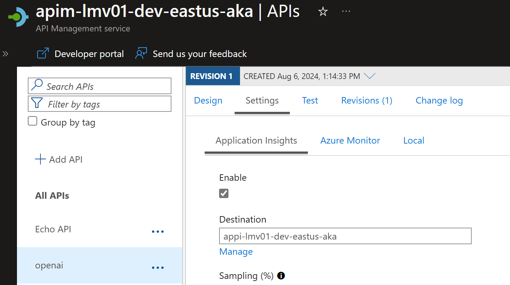

Today, we are going to delve into some of the Generative [AI Gateway capabilities](https://learn.microsoft.com/ai/playbook/technology-guidance/generative-ai/dev-starters/genai-gateway/?WT.mc_id=AZ-MVP-5004796) _(commonly referred to as AI Gateway)_ that are available in the [API Management](https://learn.microsoft.com/azure/api-management/api-management-key-concepts?WT.mc_id=AZ-MVP-5004796) service. 

These capabilities are designed to help secure and monitor your OpenAI endpoints in your applications as you head toward production.

{/* truncate */}

## 🌐 Overview 

Common scenarios that the AI Gateway capabilities can help with include:

* How can we track token usage across multiple applications? How can we do cross charges for multiple applications/teams that use Azure OpenAI models? 
* How can we make sure that a single app does not consume the whole TPM quota, leaving other apps with no option to use Azure OpenAI models? 
* How can we make sure that the API key is securely distributed across multiple applications? 
* How can we distribute load across multiple Azure OpenAI endpoints? How can we make sure that PTUs are used first before falling back to Pay-as-you-go instances? 

In this post, we will explore how to use the AI Gateway capabilities in API Management to address these scenarios.


The first step is to [import the Azure OpenAI](https://learn.microsoft.com/azure/api-management/azure-openai-api-from-specification?WT.mc_id=AZ-MVP-5004796) service and definition into API Management. This will allow you to create a new API in API Management that can act as a gateway to the Azure OpenAI service.

:::info
You can import an Azure OpenAI API directly from the Azure OpenAI Service to API Management. When you import the API, API Management automatically configures:

* Operations for each of the Azure OpenAI REST API endpoints.
* A system-assigned identity with the necessary permissions to access the Azure OpenAI resource.
* A backend resource and set-backend-service policy that directs API requests to the Azure OpenAI Service endpoint.
* An authentication-managed-identity policy that can authenticate to the Azure OpenAI resource using the instance's system-assigned identity.
* _(optionally)_ Policies help you monitor and manage token consumption using the Azure OpenAI API.

The general availability of this functionality went into May 2024. [GA Import Azure OpenAI endpoints as an API in Azure API Management](https://azure.microsoft.com/en-us/updates/ga-import-azure-openai-enpoints-as-an-apis-in-azure-api-management/?WT.mc_id=AZ-MVP-5004796).
:::

So, let us take a look at how to import the Azure OpenAI service and definition into API Management.

## 📬 Request Forwarding

Let us take a look at forwarding the request.


For this article, I have the following resources pre-deployed already:

| **Name**                  | **Type**               | **Region** |
|---------------------------|------------------------|------------|
| openai-ca-res-eastus      | Azure OpenAI           | East US    |
| openai-ca-res-uksouth     | Azure OpenAI           | UK South   |
| apim-lmv01-dev-eastus-aka | API Management service | East US    |

We will start by adding openai-ca-res-eastus to the Azure API Management service first before looking at adding the other resources.

> This will automatically, enable the System Managed Identity of API Management, to access the Azure OpenAI service with the role of [Cognitive Services OpenAI User](https://learn.microsoft.com/azure/ai-services/openai/how-to/role-based-access-control?WT.mc_id=AZ-MVP-5004796#cognitive-services-openai-user), and create a new Backend instance, and operations.


We can see the police changes applied, pointing to the backend and system-managed identity.


:::info
There is Azure Portal integration to enable a few API policies that are out of the box to help you manage the token consumption of the Azure OpenAI API.

These are:

Manage token consumption _(Use the Azure OpenAI token limit policy to protect the API from overuse and to control Azure OpenAI cost. If selected, API Management will add the policy with the configured TPM value. You can add, edit, or remove this policy after the API is created.)_
Track token usage _(Use the Azure OpenAI emit token policy to log the consumed total, completion, and prompt tokens. If selected, API Management will add the policy with the specified configuration. You can add, edit, or remove this policy after the API is created)_
:::

Now that we have a frontend for our Azure OpenAI service, it's time to test the Azure OpenAI endpoint through Azure API Management.

To do this, we will need a:

* deployment-id _(this is the name of the Model deployment, in Azure OpenAI)
* api-version _(this is the version of the Azure OpenAI API, that we want to use)_

We can get this information from the Azure AI Studio, in the Azure Portal, in the Deployment blade.


Now, we can test the Azure OpenAI endpoint, through Azure API Management. In Azure API Management, navigate to the openai API that you created, and select the Creates a completion for the chat message operation and the Test tab.

Add in your deployment ID and API version, and in the request body, enter a sample prompt like the one below:

```json
{
  "messages": [
    {"role": "system", "content": "You are a knowledgeable assistant in an ice cream parlor."},
    {"role": "user", "content": "What are the ingredients typically used to make a classic vanilla ice cream?"}
  ],
  "max_tokens": 100
}
```


This confirms that we can now communicate with the Azure OpenAI service, through Azure API Management.

So let us test Request forwarding, from a client application, such as Postman.

We will need to get the subscription key from the Azure API Management instance and add this to the request header as 'API-key' after first associating the open API with a Product and the subscription key is generated.


Here is a sample PowerShell script for invoking the Azure OpenAI endpoint, through Azure API Management, as well.

```powershell
$headers = New-Object "System.Collections.Generic.Dictionary[[String],[String]]"
$headers.Add("api-key", "YOURSUBSCRIPTIONKEY")
$headers.Add("Content-Type", "application/json")

$body = @"
{
    `"messages`": [
        {
            `"role`": `"system`",
            `"content`": `"You are a knowledgeable assistant in an ice cream parlor.`"
        },
        {
            `"role`": `"user`",
            `"content`": `"What are the ingredients typically used to make a classic vanilla ice cream?`"
        }
    ],
    `"max_tokens`": 100
}
"@

$response = Invoke-RestMethod 'https://apim-lmv01-dev-eastus-aka.azure-api.net/openai/deployments/gpt-4o/chat/completions?api-version=2024-02-15-preview' -Method 'POST' -Headers $headers -Body $body
$response | ConvertTo-Json
```
We have successfully implemented Request forwarding, through API Management to the Azure OpenAI endpoint.

## 🔌 Backend circuit breaking

Now, let us take a look at Backend circuit breaking. The [Circuit Breaker](https://learn.microsoft.com/azure/architecture/patterns/circuit-breaker?WT.mc_id=AZ-MVP-5004796) pattern, follows the same principles as the electrical circuit breaker. It is used to detect failures and encapsulate the logic of preventing a failure from constantly recurring, during maintenance, temporary overloads, or unexpected spikes in traffic. When the circuit breaker trips, it can return an error immediately, without trying to execute the operation.

:::tip
The Circuit Breaker pattern is mentioned in my [Cloud Design Patterns](https://luke.geek.nz/azure/cloud-design-patterns/) blog post.
:::

A circuit breaker acts as a proxy for operations that might fail. The proxy should monitor the number of recent failures that have occurred, and use this information to decide whether to allow the operation to proceed, or simply return an exception immediately, when the circuit is Closed the requests are allowed to pass through, when the circuit is Open, the requests are blocked.


To implement a circuit breaker in API Management, we will need to add a policy to the Azure OpenAI API that monitors the number of recent failures and uses this information to decide whether to allow the operation to proceed or simply return an exception immediately.

Unlike Request forwarding, configuring the Circuit Breaker cannot currently be done in the Azure Portal and will require configuration through Infrastructure as Code (i.e., Bicep)_ or the API Management REST API.

:::warning
Before you configure a circuitbreaker policy, make sure you have a backup of your Backend configuration and test this in a non-production environment.
:::

Today, we will configure it using Bicep, by referencing the backend of an already existing API Management resource, and adding in the circuitBreaker rule.


```bicep
param backend string
param existingUrl string

// Use the parameters to update properties
resource updatedBackend 'Microsoft.ApiManagement/service/backends@2023-09-01-preview' = {
  name: backend
  properties: {
    url: existingUrl  // Use the parameter to keep the existing URL
    protocol: 'http'
    circuitBreaker: {
      rules: [
        {
          failureCondition: {
            count: 3 // Number of failures before tripping the circuit breaker
            errorReasons: [
              'Server errors' // Reasons for the failure
            ]
            interval: 'PT1H' // Time interval to count the failures
            statusCodeRanges: [
              {
                min: 500 // Minimum status code to consider as a failure
                max: 599 // Maximum status code to consider as a failure
              }
            ]
          }
          name: 'myBreakerRule' // Name of the circuit breaker rule
          tripDuration: 'PT1H' // Duration for which the circuit breaker remains tripped
          acceptRetryAfter: true // Whether to accept retry after the trip duration
        }
      ]
    }
  }
}

```

In the Circuit Breaker rule above, the following behavior will occur:

| **Parameter**             | **Description**                                                                                                                        |
|---------------------------|----------------------------------------------------------------------------------------------------------------------------------------|
| **Number of Failures**    | The circuit breaker will trip if there are 3 or more failures within the specified time interval.                                     |
| **Error Reasons**         | Failures considered are those matching the reason 'Server errors'. The application or service should categorize errors with this reason. |
| **Status Code Ranges**    | Failures are identified based on HTTP status codes ranging from 500 to 599, covering server-side errors such as internal server errors (500), service unavailable (503), and similar issues. |
| **Time Interval**         | Failures are counted within a time interval of 1 hour ('PT1H'). If there are 3 or more failures with status codes in the 500–599 range within any 1-hour window, the circuit breaker will trip. |
| **Trip Duration**         | Once tripped, the circuit breaker remains in the tripped state for 1 hour ('PT1H'). During this period, requests will not pass through until the breaker is reset. |
| **Retry Behavior**        | After the trip duration of 1 hour, the circuit breaker is designed to allow retries (acceptRetryAfter: true). Requests will be accepted again after the trip duration, and the service will attempt to recover. |
| **Scenarios Where the Circuit Breaker Will Trip** | If, within any 1-hour period, there are 3 or more server-side errors (HTTP status codes 500–599) with the reason 'Server errors', the circuit breaker will trip. Once tripped, the circuit breaker will block requests for 1 hour. After the 1-hour block period, the circuit breaker will reset and start accepting requests again. |

There is nothing in the Azure Portal for API management, but if we take a look at the backend provider resource, we can confirm that the configuration for the backend has been set.


## ⚖️ Backend Load Balancing

Let us now take a look at Backend Load Balancing with [Load-Balanced Pools](https://learn.microsoft.com/azure/api-management/backends?tabs=bicep&WT.mc_id=AZ-MVP-5004796#load-balanced-pool). Load balancing is the process of distributing network traffic across multiple endpoints. This ensures that no single server bears too much demand. By spreading the work evenly, load balancing improves application responsiveness.


Backend pooling your Azure OpenAI endpoints, allows you to:

* Spread the load to multiple backends, which may have individual backend circuit breakers.
* Shift the load from one set of backends to another for upgrade _(blue-green deployment)_.

Note Backend pools don't need any policy configuration. The rules are just properties of the backend.

:::info
API Management supports the following load balancing options for backend pools:

* Round-robin: By default, requests are distributed evenly across the backends in the pool.
* Weighted: Weights are assigned to the backends in the pool, and requests are distributed across the backends based on the relative weight assigned to each backend. Use this option for scenarios such as conducting a blue-green deployment.
* Priority-based: Backends are organized in priority groups, and requests are sent to the backends in order of the priority groups. Within a priority group, requests are distributed either evenly across the backends, or (if assigned) according to the relative weight assigned to each backend.

_(Backends in lower priority groups will only be used when all backends in higher priority groups are unavailable because circuit breaker rules are tripped.)_
:::

If we go back to my environment, we are currently operating with the following resources:

| **Name**                  | **Type**               | **Region** |
|---------------------------|------------------------|------------|
| openai-ca-res-eastus      | Azure OpenAI           | East US    |
| openai-ca-res-uksouth     | Azure OpenAI           | UK South   |
| apim-lmv01-dev-eastus-aka | API Management service | East US    |

So so far, the Azure OpenAI backend of eastus is being used, but we can add the uksouth backend to the backend pool, and configure it to be used in a round-robin fashion. 

:::info
One of the reasons you may want to do this is not only to ensure reliability, using a priority group - that your Azure OpenAI service is highly available and can be accessed from multiple regions, but you may also want to ensure that you are not hitting the [TPM _(Tokens Per Minute)_ regional limits](https://learn.microsoft.com/azure/ai-services/openai/quotas-limits?WT.mc_id=AZ-MVP-5004796#regional-quota-limits) of the Azure OpenAI service, and that you are distributing the load across multiple regions. 

A common scenario here would be to have a primary region, that has a [PTU _(Proviosned Throughout)_](https://learn.microsoft.com/azure/ai-services/openai/concepts/provisioned-throughput?WT.mc_id=AZ-MVP-5004796) assigned, and failover to a pay as you go region.
:::

Similar to the Circuit Breaker rule capability, we need to configure Backend Pools using the Azure RestAPI or an Infrastructure as Code method, such as Bicep.

In my example, I will be adding the openai-ca-res-uksouth to the backend pool of the Azure OpenAI API and configuring it to use EastUS first and failover to UKSouth if east us stops responding.

To do this, we need to add a new backend and then reference that in a new pool configuration.

:::note
When we initially added our first Azure OpenAI resource, a lot of the configuration was done for us, including adding the [Cognitive Services OpenAI User](https://learn.microsoft.com/azure/ai-services/openai/how-to/role-based-access-control?WT.mc_id=AZ-MVP-5004796#cognitive-services-openai-user) role to the System Managed Identity of the API Management instance to authenticate with the Azure OpenAI resource, so make sure you grant Azure API Management the necessary permissions to access any other Azure OpenAI resource.


:::

Navigate to your secondary Azure OpenAI instance, and navigate to Keys and Endpoints, we need to grab the endpoint URL ie _(https://openai-ca-res-uksouth.openai.azure.com/)_, to add as another Backend and append with /openai.


Now that its added as a backend, we can add it to the backend pool, and configure it.

```bicep
param backendnane string
param subscriptionID string
param resourceGroupName string
param APIManagementName string
param backend1 string
param backend2 string

// Use the parameters to update properties
resource updatedBackend 'Microsoft.ApiManagement/service/backends@2023-09-01-preview' = {
  name: '${APIManagementName}/${backendnane}'
  properties: {
    description: 'Load balancer for multiple backends'
    type: 'Pool'
    pool: {
      services: [
        // Define the backend pool configuration for an API Management service
        {
          // Define the first backend with a specific ID, priority, and weight
          id: '/subscriptions/${subscriptionID}/resourceGroups/${resourceGroupName}/providers/Microsoft.ApiManagement/service/${APIManagementName}/backends/${backend1}'
          priority: 1 // Higher priority backend
          weight: 1   // Weight of the backend
        }
        {
          // Define the second backend with a specific ID, priority, and weight
          id: '/subscriptions/${subscriptionID}/resourceGroups/${resourceGroupName}/providers/Microsoft.ApiManagement/service/${APIManagementName}/backends/${backend2}'
          priority: 1 // Higher priority backend
          weight: 2   // Weight of the backend
        }
      ]
    }
  }
}

```


Once the deploy is done, we can see the backend pool configuration in the Azure Portal.


Now we need to update the Azure API Managememt OpenAI API, to use the backend pool, instead of the single backend.

Navigate to APIs, and your OpenAI API, select All Operations and then select the edit button.

Change the backend it to the name of your Backend Pool.


Now if we test the Azure OpenAI endpoint, through Azure API Management, we can see that the requests are being distributed across the two backends in the backend pool.

If we enable, Tracing we can see the handoff, and our API callers are oblivious to the fact that their API call is getting redirected. 


You can use the Circuitbreaker and Backend Pooling in conjunction with each other, to ensure that your Azure OpenAI service is highly available, and can be accessed from multiple regions. 

:::info
The Circuitbreaker policies are on the Backends, not the Pools.
:::

For example, I changed the circuitBreaker rule, status code range to: 401 _(Permission Denied)_ and removed the Cogniative User role from the System Managed Identity of the API Management instance, to simulate a backend failure, and moved the UkSouth endpoint to priority group 2.


```bicep
         statusCodeRanges: [
              {
               // Define the range of HTTP status codes that will be considered as failures for the circuit breaker
                min: 401 // Minimum status code to consider as a failure (e.g., Unauthorized)
                max: 401 // Maximum status code to consider as a failure (e.g., Unauthorized)
              }
            ]
```

And it worked as expected, the circuit breaker tripped, and the requests were redirected to the UKSouth backend.


## 📡 Response Streaming

Let us take a look at Response Streaming. Response streaming is a technique used to send a response to a client in chunks, rather than all at once. This can be useful when the response is large, or when the response is being generated in real-time.


:::tip
Follow the [guidelines](https://learn.microsoft.com/en-us/azure/api-management/how-to-server-sent-events?WT.mc_id=AZ-MVP-5004796#guidelines-for-sse) when using API Management to reach a backend API that implements SSE (Server side streaming).
:::

If I go back to our Creates a completion for the chat message, operation, and edit the policy and add the following to the inbound and outbound Azure policies.

```xml
    <inbound>
        <!-- Base inbound processing -->
        <base />
        <!-- Conditional logic to check if the request body contains a non-null "stream" property -->
        <choose>
            <when condition="@(context.Request.Body.As<JObject>(true)["stream"] != null && context.Request.Body.As<JObject>(true)["stream"].Type != JTokenType.Null)">
                <!-- Set a variable "isStream" with the value of the "stream" property from the request body -->
                <set-variable name="isStream" value="@{
                    var content = (context.Request.Body?.As<JObject>(true));
                    string streamValue = content["stream"].ToString();
                    return streamValue;
                }" />
            </when>
        </choose>
    </inbound>
    <!-- Control if and how the requests are forwarded to services -->
    <backend>
        <!-- Base backend processing -->
        <base />
    </backend>
    <!-- Customize the responses -->
    <outbound>
        <!-- Base outbound processing -->
        <base />
        <!-- Set a custom header "x-ms-stream" based on the value of the "isStream" variable -->
        <set-header name="x-ms-stream" exists-action="override">
            <value>@{
                    return context.Variables.GetValueOrDefault<string>("isStream","false").Equals("true", StringComparison.OrdinalIgnoreCase).ToString();
                }</value>
        </set-header>
    </outbound>
```

This sets the x-ms-stream header to true, if the request body contains a non-null "stream" property, allowing streaming, so let us test this in Postman

By using the following prompt:

```json
{
    "messages": [
        {
            "role": "system",
            "content": "You are a knowledgeable assistant in an ice cream parlor."
        },
        {
            "role": "user",
            "content": "What are the ingredients typically used to make a classic vanilla ice cream?"
        }
    ],
    "max_tokens": 100,
    "stream": true
}
```


Note: Full JSON streaming support [is not avaliable](https://github.com/postmanlabs/postman-app-support/issues/12713) at this time of this article in postman, so again - you need a client to support this.

We can, however see the response does include the response being streamed and broken up into chunks:


To remove the streaming component, we can either remove the stream from the body or change the stream from true to false.

## ⏳ Token rate limiting

Let us take a look at Token rate limiting. Token rate limiting is a technique used to limit the number of requests that can be made to an API within a certain time period. This can help prevent abuse of the API, and ensure that all users have fair access to the API.


To implement token rate limiting in API Management, we need to add a policy to the Azure OpenAI API, that will limit the number of requests that can be made to the API within a certain time period, the tokens per minute.

This is an Inbound policy, and will limit the tokens per minute, with a 429 _(Too Many Requests)_ response, that can be called from a single IP address _(each unqiue IP address will have its own counter)_.


```xml
        <azure-openai-token-limit counter-key="@(context.Request.IpAddress)" tokens-per-minute="500" estimate-prompt-tokens="false" remaining-tokens-variable-name="remainingTokens" />
```

| **Property**                          | **Description**                                                                                     |
|---------------------------------------|-----------------------------------------------------------------------------------------------------|
| `<azure-openai-token-limit>`          | This is a custom tag or directive used to define the rate-limiting policy for Azure OpenAI tokens. |
| `counter-key="@(context.Request.IpAddress)"` | This specifies that the rate-limiting should be based on the client's IP address. Each unique IP address will have its own counter. |
| `tokens-per-minute="500"`             | This sets the limit to 500 tokens per minute for each IP address. Once an IP address consumes 500 tokens within a minute, further requests will be restricted until the next minute. |
| `estimate-prompt-tokens="false"`      | This indicates whether to estimate the number of tokens in the prompt. Setting it to false means the actual token count will be used rather than an estimate. |
| `remaining-tokens-variable-name="remainingTokens"` | This specifies the variable name (`remainingTokens`) that will store the number of tokens remaining for the current minute. |

So lets test it, in my test, I am using a PowerShell script to call the Azure OpenAI endpoint, through Azure API Management, and I am calling it 20 times, in a loop, to test the rate limiting.

```powershell
# Define the headers
$headers = New-Object "System.Collections.Generic.Dictionary[[String],[String]]"
$headers.Add("api-key", "YOURSUBSCRIPTIONKEY")
$headers.Add("Content-Type", "application/json")

# Define the body
$body = @"
{
    `"messages`": [
        {
            `"role`": `"system`",
            `"content`": `"You are a knowledgeable assistant in an ice cream parlor.`"
        },
        {
            `"role`": `"user`",
            `"content`": `"What are the ingredients typically used to make a classic vanilla ice cream?`"
        }
    ],
    `"max_tokens`": 100
}
"@

# Loop to run the script 20 times
for ($i = 1; $i -le 20; $i++) {
    try {
        # Send the request and capture the response
        $response = Invoke-RestMethod 'https://apim-lmv01-dev-eastus-aka.azure-api.net/openai/deployments/gpt-4o/chat/completions?api-version=2024-02-15-preview' -Method 'POST' -Headers $headers -Body $body

        # Output the response as JSON
        $responseJson = $response | ConvertTo-Json -Depth 10
     
        Write-Output $responseJson
    } catch {
        # Handle any errors that occur during the request
        Write-Error $_.Exception.Message
    }
}
```


As we can see, it instantly gets declined after the 500th token; however, traffic from other IP addresses can still access the API.

## 🗂️ Semantic Caching

Let us take a look at [Semantic Caching](https://learn.microsoft.com/en-us/azure/api-management/azure-openai-enable-semantic-caching?WT.mc_id=AZ-MVP-5004796). Semantic caching is a technique used to cache responses from an API based on the content of the request. This can help improve performance by reducing the number of requests that need to be made to the API.

> With semantic caching, you can return cached responses for identical prompts and also for prompts that are similar in meaning, even if the text isn't the same. 

To use Semantic Caching, we need an Embedding model to generate embeddings for the prompts and a Cache policy to cache the responses based on the embeddings.

In my example, I will deploy an Embedding model _(text-embedding-ada-002)_ to the East US Azure OpenAI resource.


Now, we need to add a Backend for the embedding endpoint, similar to how we originally added the US East backend. If you are using load balancing, you can add this to a new backend pool as well, as long as the model is deployed across all endpoints.

However, instead of a /chat endpoint, we will use the /embed endpoint, and the deployment will be the name of the embedding model deployment, as an example _(https://openai-ca-res-eastus.openai.azure.com/openai/deployments/text-embedding-ada-002/embeddings)_.

Once we have our URL we can add a new Backend. 

:::info
This could be deployed to another Azure OpenAI instance, but make sure you enable the Cognitive Services OpenAI User role on the System Managed Identity of the API Management instance to authenticate with the Azure OpenAI resource.
:::


Now, it is time to configure our [semantic caching policy](https://learn.microsoft.com/azure/api-management/azure-openai-semantic-cache-lookup-policy?WT.mc_id=AZ-MVP-5004796).

> We will need a **[Redis Enterprise Cache deployed](https://learn.microsoft.com/azure/api-management/api-management-howto-cache-external?WT.mc_id=AZ-MVP-5004796)**, and configured as an External cache to API Management, with **[RediSearch module](https://learn.microsoft.com/azure/azure-cache-for-redis/cache-redis-modules?WT.mc_id=AZ-MVP-5004796#redisearch) enabled** and then we can add the semantic caching policy to the Azure OpenAI API. Without the Redis cache, the semantic caching policy will not work, and the azure-openai-semantic-cache-lookup policy will be skipped.

Navigate to our OpenAI API, select the Creates a completion for the chat message operation, and add the following policy to the inbound section.

```xml
<azure-openai-semantic-cache-lookup
    score-threshold="0.5"  <!-- Adjusted threshold for better precision -->
    embeddings-backend-id="azureaiembeddingbackend"  <!-- Updated backend ID -->
    embeddings-backend-auth="system-assigned"
    ignore-system-messages="false"  <!-- Include system messages if they add value -->
    max-message-count="15"> <!-- Increased message count for more context -->
    <vary-by>@(context.Subscription.Id)</vary-by>
</azure-openai-semantic-cache-lookup>
```
| **Element**                                      | **Description**                                                                                                                                         |
|--------------------------------------------------|---------------------------------------------------------------------------------------------------------------------------------------------------------|
| `<azure-openai-semantic-cache-lookup>`           | A custom tag used to define the semantic cache lookup policy for Azure OpenAI.                                                                           |
| `score-threshold="0.8"`                          | Sets the threshold for similarity scores. Only results with a score of 0.5 or higher are considered.                                                     |
| `embeddings-backend-id="embeddings-deployment"`  | Specifies the ID of the embeddings backend deployment used for the cache lookup.                                                                         |
| `embeddings-backend-auth="system-assigned"`      | Indicates that the system-assigned managed identity is used for authentication with the embeddings backend.                                              |
| `ignore-system-messages="true"`                  | Specifies that system messages should be ignored during the cache lookup.                                                                                |
| `max-message-count="10"`                         | Sets the maximum number of messages to be considered in the cache lookup.                                                                                |
| `<vary-by>@(context.Subscription.Id)</vary-by>`  | Specifies that the cache should vary by subscription ID, meaning each subscription will have its own cache.                                              |


In the Outbound processing section for the API, add the azure-openai-semantic-cache-store policy.

```xml
<azure-openai-semantic-cache-store duration="60" />
```

| **Attribute**                              | **Description**                                                                                           |
|----------------------------------------|-------------------------------------------------------------------------------------------------------|
| `<azure-openai-semantic-cache-store>`  | This is a custom tag or directive used to define the semantic cache store policy for Azure OpenAI.     |
| `duration="60"`                        | This specifies the duration for which the cached data should be stored in minutes. In this case, the cache will be stored for 60 minutes. |


Once added, we can test it.

We can do this, using the [Trace](https://learn.microsoft.com/azure/api-management/api-management-howto-api-inspector?WT.mc_id=AZ-MVP-5004796) feature in Azure API Management, and we can see the cache hit, and the response being returned from the cache.

:::warning
If you get HTTP/1.1 415 model_error, make sure you are using a [model that supports embeddings](https://learn.microsoft.com/azure/ai-services/openai/concepts/models?WT.mc_id=AZ-MVP-5004796), and that the model is deployed.
Also if you are testing, make sure that the content-type is application/json.
:::

:::info
I was not able to test this end-to-end in my environment due to needing a payment instance for Redis, not covered under my Visual Studio Enterprise subscription.
:::

If this is all configured you should see something like the below in a Trace:


## 📜 Logging

Now let us take a look at Logging. Logging is the process of recording events that occur during the execution of a process. Logs can be used to monitor and troubleshoot requests, as well as to analyze and report on application performance.


To do this, we need to enable [Application Insights](https://learn.microsoft.com/azure/azure-monitor/app/app-insights-overview?WT.mc_id=AZ-MVP-5004796), which will create a [Logger entity](https://learn.microsoft.com/azure/templates/microsoft.apimanagement/service/loggers?pivots=deployment-language-bicep&WT.mc_id=AZ-MVP-5004796) to Application Insights from API Management.


:::tip
If you're not using Azure API Management, I recommend you check out the workbook by Dolev Shor (Microsoft Fastrack Engineer). You can read more about it here: [Azure OpenAI Insights: Monitoring AI with Confidence](https://techcommunity.microsoft.com/t5/fasttrack-for-azure/azure-openai-insights-monitoring-ai-with-confidence/ba-p/4026850?WT.mc_id=AZ-MVP-5004796).
:::

So, let's take a look at some of the logs generated by the Azure OpenAI API through Azure API Management and visible through the Application Insights and Log Analytics workspace.


The first thing you could do is configure an availability test for your API Management endpoint.

The API Management Gateway health probe URL is: /status-0123456789abcdef

So our availability test URL would be: 'https://apim-lmv01-dev-eastus-aka.azure-api.net/status-0123456789abcdef'


Next, we need to make sure that we are logging the information from the API requests, such as client IP, request URL, response code, and response time, to do that, we need to [enable the Application Insights logging on our openai](https://learn.microsoft.com/en-us/azure/api-management/api-management-howto-app-insights?tabs=rest&WT.mc_id=AZ-MVP-5004796) API in API Management.



Let's take a look at a custom [Azure Monitor workbook](https://learn.microsoft.com/azure/azure-monitor/visualize/workbooks-overview?WT.mc_id=AZ-MVP-5004796) that helps visualize and bring out a lot of the data you need to make informed decisions without having to delve into KQL _(Kusto Query Language)_ queries in Log Analytics.

In Application Insights, navigate to Workbooks, click + New, click on the Code and paste the workbook data from: [AI-Gateway/main/labs/built-in-logging/openai-usage-analysis-workbook.json](https://github.com/Azure-Samples/AI-Gateway/blob/main/labs/built-in-logging/openai-usage-analysis-workbook.json).

You can see the APIs getting called, the subscription key being used, the response time, and the response code.


If you are using a Token Limit policy, you can trace the OpenAITokenLimitExeeded exceptions. This can help you determine if you need to block any particular IP addresses either using an ip-filter policy or Application Gateway if that is in front of your API Management or if you need to increase the TPM limit.


## 🔚 Conclusion

In this article, we have taken a look at how we can use Azure OpenAI as a backend to Azure API Management, how to test the Azure OpenAI endpoint, through Azure API Management, and how to implement Request forwarding, Backend circuit breaking, Backend Load Balancing, Response Streaming, Token rate limiting, Semantic Caching, and Logging.

All code can be found here: [lukemurraynz/AI_Gateway_Tests](https://github.com/lukemurraynz/AI_Gateway_Tests)

## 📚 Reference

* 🔗[What is Azure API Management](https://learn.microsoft.com/azure/api-management/api-management-key-concepts?WT.mc_id=AZ-MVP-5004796)
* 🔗[Azure OpenAI](https://learn.microsoft.com/azure/ai-services/openai?WT.mc_id=AZ-MVP-5004796)
* 🔗[Introducing GenAI Gateway Capabilities in Azure API Management](https://techcommunity.microsoft.com/t5/azure-integration-services-blog/introducing-genai-gateway-capabilities-in-azure-api-management/ba-p/4146525?WT.mc_id=AZ-MVP-5004796)
* 🔗[Cloud Design Patterns](https://luke.geek.nz/azure/cloud-design-patterns/)
* 🔗[Features and Benefits of Azure API Management](https://luke.geek.nz/azure/api-management-overview/)
* 🔗[Azure-Samples/AI-Gateway](https://aka.ms/apim/genai/labs)
