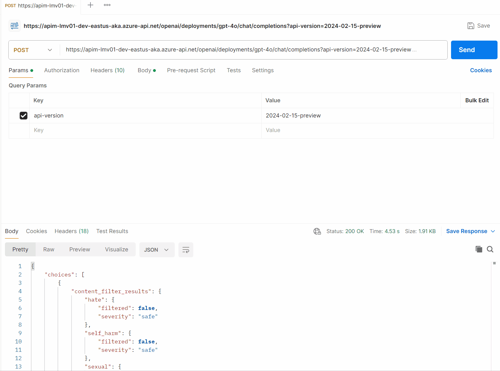
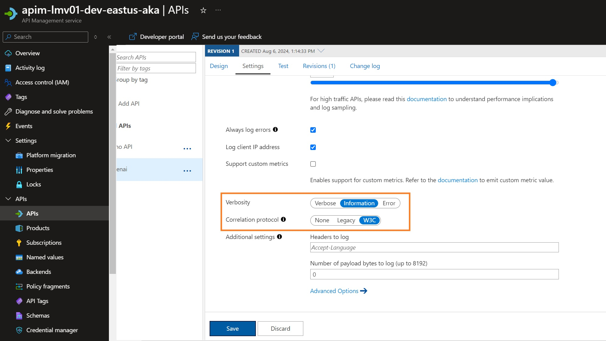
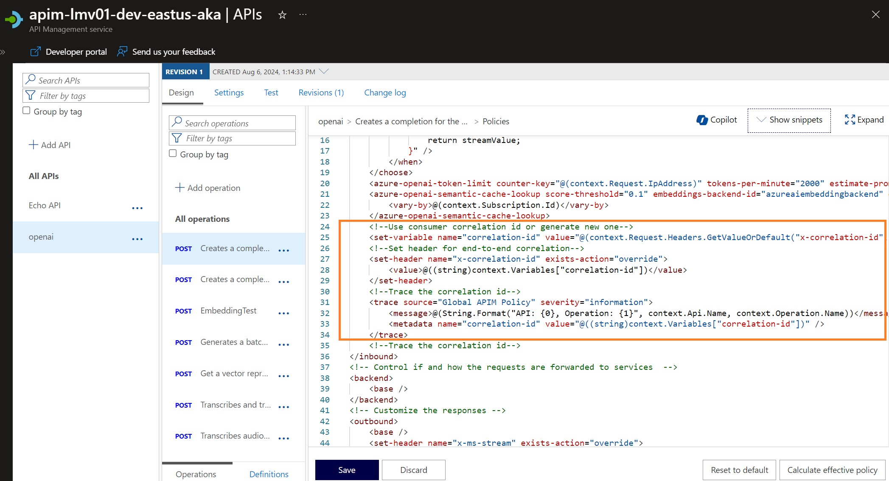
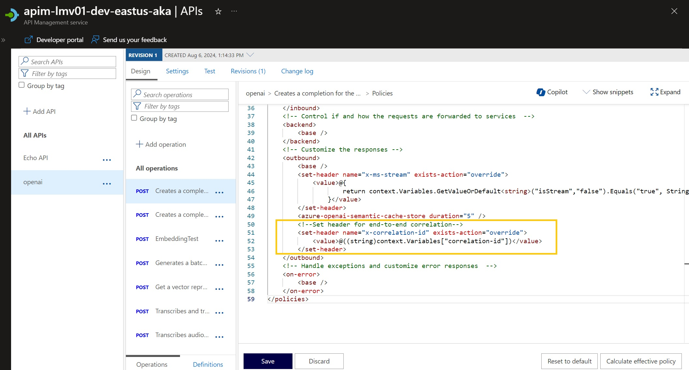

When working with [Azure API Management](https://learn.microsoft.com/azure/api-management/api-management-key-concepts?WT.mc_id=AZ-MVP-5004796), you may want to enable traceability and correlation of requests across different services. This is where the Correlation ID comes in.

Similar to [traceparent](https://www.w3.org/TR/trace-context/#traceparent-header-field-values), the Correlation ID is a unique identifier passed along with the request and response headers. It allows you to track a request's flow as it moves through different services and systems.

In this article, we will explore how to generate a new correlation ID through API Management Inbound policies and pass it back to the Client through an outbound policy, which then is used to help troubleshoot specific calls with [Application Insights](https://learn.microsoft.com/azure/azure-monitor/app/app-insights-overview?WT.mc_id=AZ-MVP-5004796).

{/* truncate */}

So, if you want an experience like the following to help pass the Correlation ID back to the client, then look up the transaction in Application Insights, then let us take a look:



To start with, make sure that the API _(Global or specific API)_ has the following settings enabled:



Now, we need to set an Inbound Policy to create the Correlation ID (if it's not already passed in the request) as a variable and assign that variable to an inbound header.

```xml
<inbound>
  <set-variable name="correlation-id" value="@(context.Request.Headers.GetValueOrDefault('x-correlation-id', Guid.NewGuid().ToString()))" />
  <set-header name="x-correlation-id" exists-action="override">
    <value>@((string)context.Variables["correlation-id"])</value>
  </set-header>
</inbound>
```

| **Line** | **Explanation** |
| --- | --- |
| `<set-variable name="correlation-id" value="@(context.Request.Headers.GetValueOrDefault("x-correlation-id", Guid.NewGuid().ToString()))" />` | This line is setting a variable named "correlation-id". It's getting the value from the request headers. If a header with the name "x-correlation-id" exists, it uses that value. If not, it generates a new unique ID using `Guid.NewGuid().ToString()`. |
| `<set-header name="x-correlation-id" exists-action="override">` | This line is setting a header named "x-correlation-id". If a header with this name already exists, it will be overridden. |
| `<value>@((string)context.Variables["correlation-id"])</value>` | This line sets the value of the "x-correlation-id" header to the value of the "correlation-id" variable. |
| `</set-header>` | This line is closing the `<set-header>` tag. |

Once that added, we need to add another inbound policy:

```xml
<inbound>
<trace source="Global APIM Policy" severity="information">
    <message>@(String.Format("API: {0}, Operation: {1}", context.Api.Name, context.Operation.Name))</message>
    <metadata name="correlation-id" value="@((string)context.Variables["correlation-id"])" />
</trace>
</inbound>
```

| **Element**                                                                                                   | **Description**                                                                                                                                                                                |
| --------------------------------------------------------------------------------------------------------- | ------------------------------------------------------------------------------------------------------------------------------------------------------------------------------------------ |
| <trace source="Global APIM Policy" severity="information">                                                | This is the start of a trace element. The source attribute is set to "Global APIM Policy" and the severity attribute is set to "information".                                              |
| <message>@(String.Format("API: {0}, Operation: {1}", context.Api.Name, context.Operation.Name))</message> | This is a message element. It uses String.Format to create a string that includes the name of the API and the operation from the context.                                                  |
| <metadata name="correlation-id" value="@((string)context.Variables["correlation-id"])" />                 | This is a metadata element. It has a name attribute set to "correlation-id" and a value attribute that retrieves the "correlation-id" from the context variables and casts it to a string. |
| </trace>                                                                                                  | This is the end of the trace element.                                                                                                                                                      |



This will help you track the Correlation ID in the logs and troubleshoot any issues that may arise.

Once that has been added, it's time to return it to the client. This can be done with the following Outbound policy:

```xml
<outbound>
  <set-header name="x-correlation-id" exists-action="override">
    <value>@((string)context.Variables["correlation-id"])</value>
  </set-header>
</outbound>
```

| **Element**                                                          | **Description**                                                                                                                                                                                                                                                                                                       |
| --------------------------------------------------------------- | ----------------------------------------------------------------------------------------------------------------------------------------------------------------------------------------------------------------------------------------------------------------------------------------------------------------- |
| `<outbound>`                                                    | This tag defines the outbound section of the policy. The operations inside this tag are applied to the response before it's sent back to the client.                                                                                                                                                              |
| `<set-header name="x-correlation-id" exists-action="override">` | This tag sets an HTTP header in the outbound response. The `name` attribute specifies the name of the header, in this case `x-correlation-id`. The `exists-action` attribute specifies what to do if the header already exists, in this case it's set to `override`, meaning the existing header will be replaced. |
| `<value>@((string)context.Variables["correlation-id"])</value>` | This tag sets the value of the header. It's using a variable from the context named `correlation-id`. The `@` symbol is used to denote an expression in Azure API Management policies.                                                                                                                            |



Reference: 
* [Optimizing traceability in Azure API Management](https://yourazurecoach.com/2021/01/22/optimizing-api-traceability-in-azure-api-management/)
