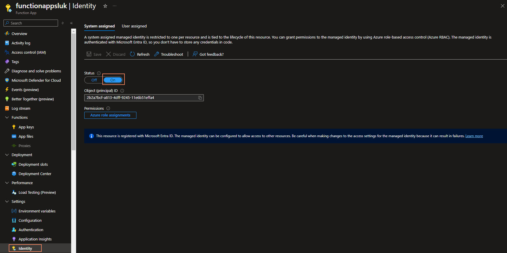
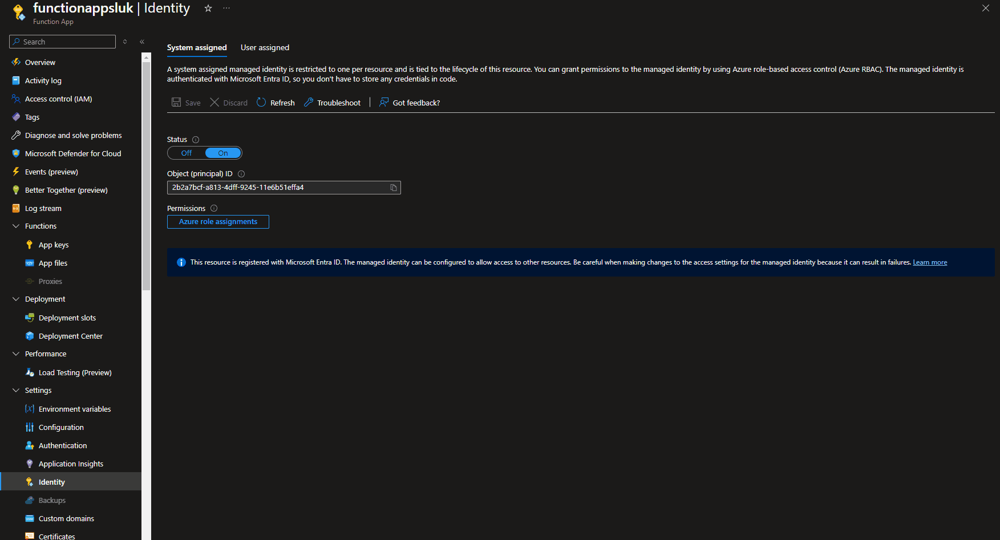
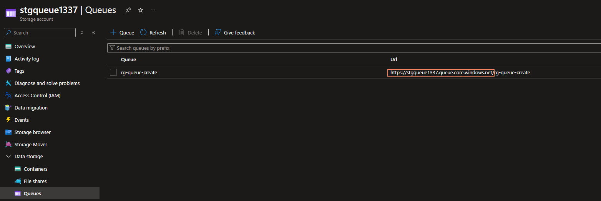
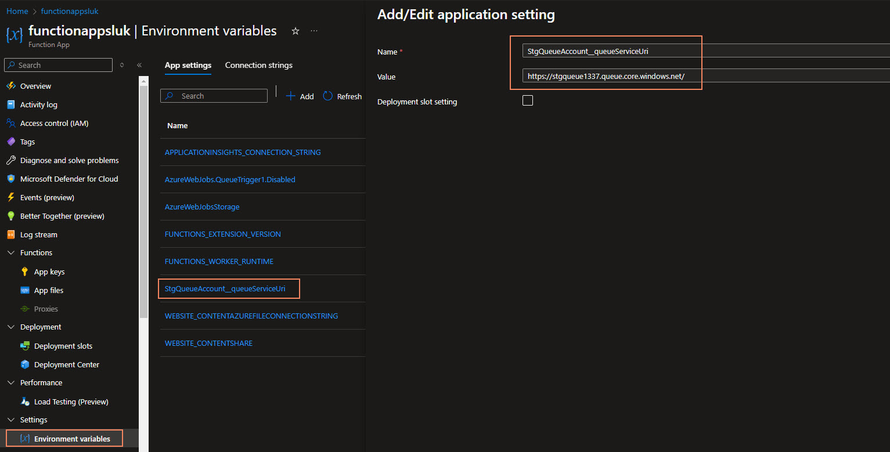

[Azure Functions](https://learn.microsoft.com/azure/azure-functions/functions-overview?pivots=programming-language-powershell&WT.mc_id=AZ-MVP-5004796) is a serverless compute service that enables you to run event-driven code without having to manage infrastructure. You can use Azure Functions to run small pieces of code in response to events, such as HTTP requests, queue messages, or data changes in a storage account. In this article, I will show you how to use Azure Functions with a storage queue trigger using the System Managed Identity of the Function Application *(instead of a Connection String)*.

{/* truncate */}

When you create an Azure Function, you can use a storage queue trigger to execute the function when a message is added to a storage queue. This is useful when you want to process messages in a queue asynchronously. In this article, I will show you how to use an Azure Function with a storage queue by using the System Managed Identity of the Function Application to authenticate with the storage account.

:::info
[Azure Queue storage trigger for Azure Functions](https://learn.microsoft.com/azure/azure-functions/functions-bindings-storage-queue-trigger?tabs=python-v2%2Cisolated-process%2Cnodejs-v4%2Cextensionv5&pivots=programming-language-powershell&WT.mc_id=AZ-MVP-5004796). The queue storage trigger runs a function as messages are added to Azure Queue storage.

The Azure Functions runtime supports triggers and bindings for Azure Queue storage. The Azure Queue storage trigger lets you respond to new messages in a queue. When a message is added to the queue, the runtime invokes your function.
:::


The first thing you will need to do is enable the System Managed Identity of the Azure Function.



Once that has been completed, we can assign the required roles to the Storage account that contains the queue.

What level of permissions you need to assign to the Function App's System Managed Identity depends on what you want to do with the queue. In this example, I will be using the `Storage Queue Data Contributor` role.

| Binding type   | Example built-in roles                                                |
|----------------|-----------------------------------------------------------------------|
| Trigger        | [Storage Queue Data Reader](https://learn.microsoft.com/azure/role-based-access-control/built-in-roles/storage?WT.mc_id=AZ-MVP-5004796#storage-queue-data-reader), [Storage Queue Data Message Processor](https://learn.microsoft.com/azure/role-based-access-control/built-in-roles/storage?WT.mc_id=AZ-MVP-5004796#storage-queue-data-message-processor)   |
| Output binding | [Storage Queue Data Contributor](https://learn.microsoft.com/azure/role-based-access-control/built-in-roles/storage?WT.mc_id=AZ-MVP-5004796#storage-queue-data-contributor), [Storage Queue Data Message Sender](https://learn.microsoft.com/azure/role-based-access-control/built-in-roles/storage?WT.mc_id=AZ-MVP-5004796#storage-queue-data-message-sender) |

Because we are going to assign the permissions to a Storage account, we can do this directly through the Azure Portal at the Function App System Managed identity location.



Once permissions have been granted in our Azure Function App, we will need to create some Connection variables, which will be used by our Function App.

In the Function App, under Settings, go to Environment variables.

We will need to determine a Connection name, which will be used by our Azure Function. In this example, I will be using `StgQueueAccount`. This will be used as a prefix for additional variables, for example:

- `StgQueueAccount__queueServiceUri`

:::info
Note that the variable has x2 underscores `__` between the Connection name and the variable name.
:::

This variable will be used to store the [URI of the Storage Account Queue](https://learn.microsoft.com/azure/azure-functions/functions-bindings-storage-queue-trigger?tabs=python-v2%2Cin-process%2Cnodejs-v4%2Cextensionv5&pivots=programming-language-powershell&WT.mc_id=AZ-MVP-5004796#identity-based-connections).

For the valuiie of the StgQueueAccount__queueServiceUri, you can get this from the Azure Portal, by going to the Storage Account, and then to the Queue Service, to find the endpoint uri.



Once we have retrieved it, we can navigate back to the Environment variables and add in the Key-Value pair.



Make sure to click Apply and Apply.

Once completed, the default profile.ps1 file will run to authenticate using the Managed Identity of the Function App.

```powershell
if ($env:MSI_SECRET) {
    Disable-AzContextAutosave -Scope Process | Out-Null
    Connect-AzAccount -Identity
}
```

Your actual function will need to have the binding updated with the name of the Connection prefix determined earlier and include the queue name, for example:

```json
{
  "bindings": [
    {
      "name": "QueueItem",
      "type": "queueTrigger",
      "direction": "in",
      "queueName": "rg-queue-create",
      "connection": "StgQueueAccount"
    }
  ]
}
```

You should now be able to read the messages from the queue and process them as required using the System Managed Identity of the Azure Function account.
