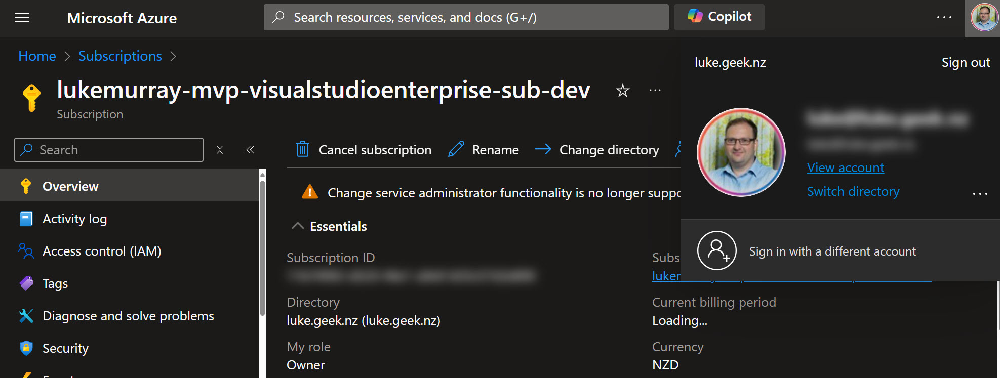
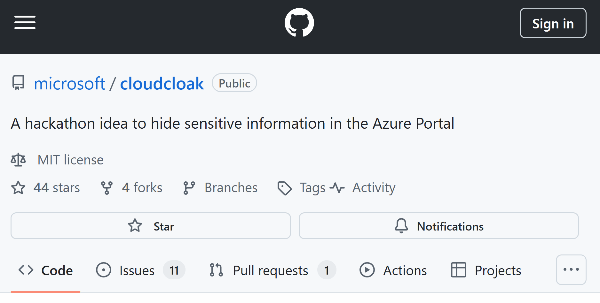
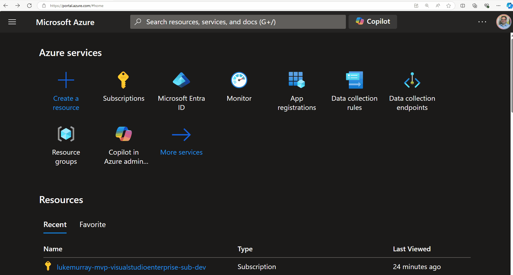
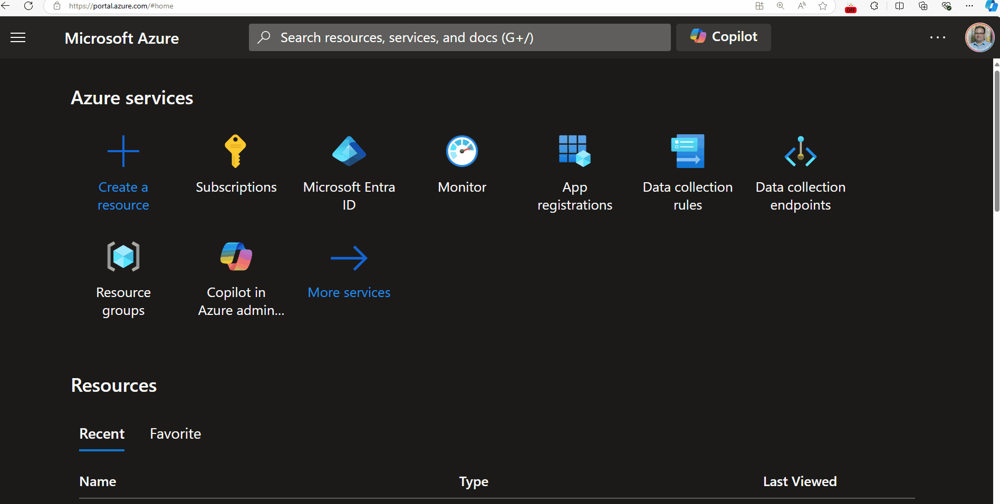

[Cloud Cloak](https://github.com/microsoft/Cloudcloak) is a browser extension for folks who might be streaming or presenting while simultaneously showing one of the Microsoft Cloud Portals. It does its very best to hide connection strings, email addresses, avatars, and anything that might show secure or personal information.

:::info
You can consider this the next-version/update to [Azure Mask](https://github.com/clarkio/azure-mask/) _(shout out to Brian Clark for his pioneering work and blessing for us to create this one)_.
:::

{/* truncate */}

:::info
Developed as part of the Microsoft Global Hackathon 2024 🚀! This extension helps to 'cloak _(ie blur)_' potentially personable or information in the relevant Azure portals, that could potentially be mistreated, allowing presentors to focus on the content they are delivering, instead of having to worry about the type of information _(such as Azure subscription ids)_, that people can see.

[Cloud Cloak](https://github.com/microsoft/Cloudcloak) is open for contributions, and make sure you provide feedback by opening an issue on how we it could be improved further. This is an open-source initiative and not directly supported by Microsoft. At the time of writing this is at release version 1.0.
:::

:::warning
It does not guarantee that all sensitive information is hidden, for example, although the information is hidden in the UI on render, it might still be present in the HTML source code, or the address bar, and link previews.
:::

So let us see how it works according to GitHub Copilot:

The extension monitors specific websites and, when activated, blurs sensitive information such as email addresses, GUIDs, IP addresses, and phone numbers. It uses a combination of background scripts and content scripts to achieve this functionality.

The extension is activated by clicking on the extension icon in the browser toolbar. When activated, the extension will blur sensitive information on the current page. The extension will remain active until the user deactivates it by clicking on the extension icon again.

1. Initialization: When the extension is installed or updated, it initializes the state from storage and updates the badge for the current tab.
Tab Update/Activation: When a tab is updated or activated, the extension checks if the URL matches one of the specified extensions. If it does, it injects the cloak.js script and updates the badge.
2. Cloak Mode: When the user clicks the extension icon, the extension toggles the cloak mode. If enabled, it injects the cloak.js script, which identifies and blurs sensitive information on the page.
3. DOM Changes: The MutationObserver in cloak.js monitors changes in the DOM and reapplies the blur filter to newly added elements containing sensitive information.

| **Component**        | **Description**                                                                                         |
|----------------------|---------------------------------------------------------------------------------------------------------|
| `manifest.json`       | Configures the extension with metadata, permissions, and the background script.                         |
| `background.js`       | Manages the extension’s state, handles events, and injects the content script into specified websites.   |
| `cloak.js`            | Contains the logic to identify and blur sensitive information on web pages.                             |
| **How It Works**      |                                                                                                         |
| `manifest.json`       | - Defines metadata, permissions, and the background script.   - Specifies icons and permissions.      |
| `background.js`       | - Manages the extension’s state.   - Injects `cloak.js` script into the specified tab and frames.    |
| **Event Listeners**   |                                                                                                         |
| `chrome.tabs.onUpdated` | Listens for tab updates and injects the script if the URL matches the specified conditions.             |
| `chrome.tabs.onActivated` | Listens for tab activation and updates the badge accordingly.                                        |
| `chrome.webNavigation.onCompleted` | Injects the script into iframes upon navigation completion.                                  |
| `chrome.action.onClicked` | Toggles the extension's enabled/disabled state when the action button is clicked.                   |

At the time of writing, the following URLs are supported:

- https://portal.azure.com
- https://ms.portal.azure.com
- https://rc.portal.azure.com
- https://preview.portal.azure.com
- https://entra.microsoft.com
- https://intune.microsoft.com
- https://ai.azure.com
- https://admin.microsoft.com
- https://sip.security.microsoft.com
- https://purview.microsoft.com
- https://make.powerapps.com
- https://make.preview.powerapps.com
- https://msazure.visualstudio.com
- https://github.com
- https://copilotstudio.microsoft.com
- https://copilotstudio.preview.microsoft.com
- https://portal.azure.us

However, new URLs can be added by updating the `background.js` file, and readding to your browser to test locally.

Because of the chrome event listeners, this extension is only available for Chrome and Edge browsers _(and I would assume any other chromium browser)_.

So let us get started with the installation, we will be using Edge, as its the browser I use mainly for my own presentations.

This is an unofficial extension, and at this time, not in the Edge or Chrome stores, so will need to be installed manually, and updated manually. This is per user-profile as well, if your browser has multiple profiles.

So let us download the extension from the [GitHub repository](https://github.com/microsoft/Cloudcloak) and unzip the file.

Then in Edge, go to `edge://extensions/` and enable Developer mode, and then click on `Load unpacked` and select the folder where you unzipped the extension.

:::tip
You can disable Developer mode, after extension is installed. For ease of use, you can pin the extension to the toolbar.
:::

Now when you are presenting, you can click on the extension icon, and it will blur out sensitive information on the page. So lets test it, by navigating to an Azure resource.

