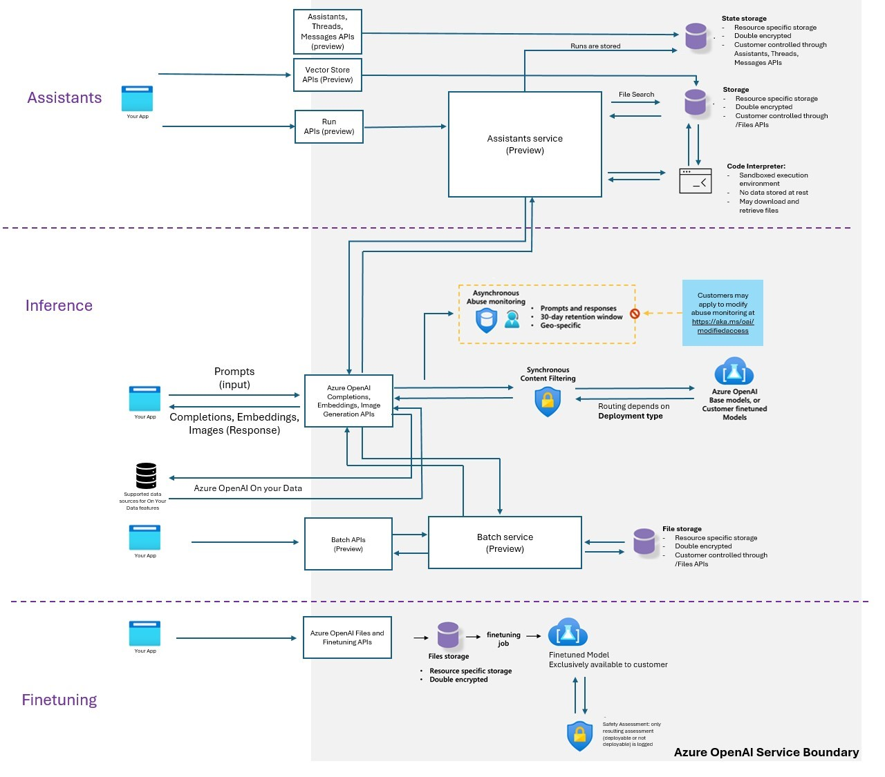

When considering [Azure Open AI](https://learn.microsoft.com/azure/ai-services/openai/overview?WT.mc_id=AZ-MVP-5004796) adoption, there are some common challenges that you might face. These include:

* Protecting confidential information.
* End-to-end observability.
* Disable inferencing via Azure AI Studio
* Protect from OWASP's Top 10 threats

{/* truncate */}

So, let's take a look at each of these challenges and how you can overcome them.

## 📄 Overview
  
When considering [Azure Open AI](https://learn.microsoft.com/azure/ai-services/openai/overview?WT.mc_id=AZ-MVP-5004796) adoption, there are some common challenges or considerations you might face, especially when looking at your solution's Day 1 and Day 2 lifecycles.

:::info
Software life cycle stages are typically broken down into the following stages:

Day 0  - Design and build stage
Day 1  - Infrastructure and code deployment stage
Day 2  - Runtime

:::

Today, we will look at common challenges and how we can overcome, work around, or mitigate them.

## 🛬 Landing Zone
  
When considering Azure Open AI adoption, having a well-defined landing zone for your platform architecture and application is important. 

This is where you will deploy your AI solution.

:::info
An [Azure landing zone](https://learn.microsoft.com/en-us/azure/cloud-adoption-framework/ready/landing-zone/?WT.mc_id=AZ-MVP-5004796) is an environment that follows key design principles across eight design areas. These design principles accommodate all application portfolios and enable application migration, modernization, and innovation at scale. An Azure landing zone uses subscriptions to isolate and scale application resources and platform resources. Subscriptions for application resources are called application landing zones, and subscriptions for platform resources are called platform landing zones.
:::

**Ask**:

Establish an Azure Landing Zone to place the Azure OpenAI solution into.

**Challenge**:

* Ensuring a well-architected foundation
* Need for compliance and security guardrails

Here's how the information can be placed into the relevant table section:

| Why                                       | Risk / Impact                                           | Solution                            |
|-------------------------------------------|---------------------------------------------------------|-------------------------------------|
| Solid foundation for cloud adoption       | Risk – High; Impact – High                              | - Implement Azure Landing Zone - Include Identity, Security, and Network configurations - Address compliance and governance from the start - Provides a scalable and secure environment |

**Rationale**:

Implementing an Azure Landing Zone ensures a secure and compliant foundation for deploying Azure OpenAI solutions. Providing necessary guardrails and governance helps mitigate the high risks and impacts of cloud adoption.

**Action**:

Implement an Azure Landing Zone for your Azure OpenAI solution. Include Identity, Security, and Network configurations. Address compliance and governance from the start. For Platform Landing Zone recommendations, refer to the [Cloud Adoption Framework - Ready](https://learn.microsoft.com/en-us/azure/cloud-adoption-framework/ready/landing-zone/?WT.mc_id=AZ-MVP-5004796).

However, for more specific Azure OpenAI application landing zone considerations, we can view the [chat baseline architecture at the Azure Architecture Center](https://learn.microsoft.com/azure/architecture/ai-ml/architecture/baseline-openai-e2e-chat?WT.mc_id=AZ-MVP-5004796) for reference.

:::tip
Azure Landing Zones consist of more than just a place to store your resources; they should also include considerations for people/processes and products to run your applications at scale. I highly recommend going through the [Azure Landing Zone Review](https://learn.microsoft.com/en-us/assessments/21765fea-dfe6-4bc4-8bb7-db9df5a6f6c0/?WT.mc_id=AZ-MVP-5004796) to ensure you have a solid foundation for your Azure OpenAI solution, and Azure workloads in general.
:::

## 🔒 Protect confidential information

When considering Azure Open AI adoption, confidential information, including data, code, and other sensitive information, must be protected.

It is important to ensure that your data is protected, especially when you use the [RAG (Retrieval Augmented Generation) pattern](https://learn.microsoft.com/azure/architecture/ai-ml/guide/rag/rag-solution-design-and-evaluation-guide?WT.mc_id=AZ-MVP-5004796), which allows you to use your own data.

**Ask**:

Establish an Azure Landing Zone to place Azure OpenAI solution into

**Challenge**:

Ensuring a well-architected foundation
Need for compliance and security guardrails

| Why                                      | Risk / Impact                   | Solution                                                                                  |
|------------------------------------------|----------------------------------|-------------------------------------------------------------------------------------------|
| - Solid foundation for cloud adoption- Critical for enterprise-grade workloads- Ensures compliance and governance | Risk – HighImpact – High         | - Implement Azure Landing Zone- Include Identity, Security, and Network configurations - Address compliance and governance from the start- Provides a scalable and secure environment |

**Rationale**:

Starting with Public and internal data reduces the Impact from high to low. With lower overall risk, an organization can have faster initial adoption by the time they build additional guardrails for governance and compliance in place _(Audit, Monitoring, and enterprise architecture)_.

**Action**:

Use Platform and resource capabilities to lock down access to confidential information. For example, use Azure Key Vault to store and manage secrets, and use Azure Policy to enforce compliance of those policies.

* Make use of Infrastructure as Code _(IaC)_, or [deploy the services manually](https://learn.microsoft.com/en-us/azure/ai-services/openai/how-to/create-resource?pivots=web-portal&WT.mc_id=AZ-MVP-5004796) to ensure that your Azure OpenAI solution is deployed in a secure and compliant manner, vs automated methods, that may automatically create the resources you need _(and sometimes more than you need)_ such as Azure AI Studio with Public endpoints. 
* Make use of [Role-based access control (RBAC) to ensure that only authorized users](https://learn.microsoft.com/azure/ai-services/openai/how-to/role-based-access-control?WT.mc_id=AZ-MVP-5004796) have access to your Azure OpenAI solution.
* [Disable access keys for Storage accounts](https://learn.microsoft.com/azure/storage/common/shared-key-authorization-prevent?tabs=portal&WT.mc_id=AZ-MVP-5004796), and make sure of [Managed Identities](https://learn.microsoft.com/entra/identity/managed-identities-azure-resources/overview?WT.mc_id=AZ-MVP-5004796) for inter-Azure resource permissions.
* Determine if the risk is high enough to manage the keys yourself using [Customer Managed Keys](https://learn.microsoft.com/en-us/azure/storage/common/customer-managed-keys-overview?WT.mc_id=AZ-MVP-5004796) for your Storage account.
* Make use of [Private Endpoints](https://learn.microsoft.com/en-us/azure/private-link/private-endpoint-overview?WT.mc_id=AZ-MVP-5004796) and disable access to the public internet where possible, and monitor private endpoint _(East/West)_ traffic, using a Network Virtual Appliance, such as [Azure Firewall](https://learn.microsoft.com/azure/firewall/overview?WT.mc_id=AZ-MVP-5004796).
* Make use of in-built Azure policies to enforce compliance, such as [Storage account public access should be disallowed](https://learn.microsoft.com/azure/storage/common/policy-reference?WT.mc_id=AZ-MVP-5004796).
* Make sure your data lifecycle is managed correctly, that you are not storing data longer than you need to, and that you are not storing data that you do not need to, you can make use of [lifecycle management policies](https://learn.microsoft.com/azure/storage/blobs/lifecycle-management-policy-configure?tabs=azure-portal&WT.mc_id=AZ-MVP-5004796), to assist with the technical aspects of this, and the Cloud Adoption Framework has some [guidance for Data governance](https://learn.microsoft.com/azure/cloud-adoption-framework/scenarios/cloud-scale-analytics/govern?WT.mc_id=AZ-MVP-5004796).

## 🔍 End-to-end observability

When considering Azure Open AI adoption, it is important to have end-to-end observability. This includes monitoring, logging, and tracing.

Observability for Azure Open AI has come a long way, with greater capabilities being integrated into products, such as [Azure API Management](https://learn.microsoft.com/azure/api-management/api-management-key-concepts?WT.mc_id=AZ-MVP-5004796) features, commonly referred to as an [AI Gateway](https://learn.microsoft.com/ai/playbook/technology-guidance/generative-ai/dev-starters/genai-gateway/?WT.mc_id=AZ-MVP-5004796).

:::tip
I did a blog article on implementing and testing some of the AI Gateway capabilities a few months ago here: [Implementing AI Gateway capabilities in API Management](https://luke.geek.nz/azure/implementing-ai-gateway-in-api-management/), make sure you check this out for a bit more depth, and also [implementing a correlation ID for API Management](https://luke.geek.nz/azure/implementing-correlation-id-in-api-management/) requests, to help track client transactions with Azure Application Insights.
:::

**Ask**:

All interactions by data scientists, including prompts & responses, must be logged.

**Challenge**:

Azure OpenAI only logs the consumer's user ID but does not log prompts sent or responses received in the Azure Diagnostics table (or anywhere else).

Here's how the table could be updated based on your provided details:

| Why | Risk / Impact | Solution |
|-----|---------------|----------|
| - Lines of businesses that own the data need to ensure there was no misuse of confidential data | Risk – High Impact – High | - Move complete audit trail must be established to create a fully governed environment  - Custom applications that call AOAI should log prompts and responses from their side  - Use Azure API Management services as a middle layer between published services and consuming applications and audience |

**Rationale**:

Azure OpenAI has minimal capabilities and relies on other products to capture prompts and inferences fully for audit and governance purposes.

**Action**:

* Use [Azure API Management](https://learn.microsoft.com/azure/api-management/api-management-key-concepts?WT.mc_id=AZ-MVP-5004796) to capture all interactions between your Azure OpenAI solution and your consumers.
* Use [Azure Application Insights](https://learn.microsoft.com/azure/azure-monitor/app/app-insights-overview?WT.mc_id=AZ-MVP-5004796) to capture all interactions between your Azure OpenAI solution and your consumers. Application Insights works well with API Management.
* Make sure of reference architecture, such as the [Implement logging and monitoring for Azure OpenAI models](https://learn.microsoft.com/azure/architecture/ai-ml/openai/architecture/log-monitor-azure-openai?WT.mc_id=AZ-MVP-5004796) for guidance on how to implement this, and to review what metrics and logs can be pulled from Azure OpenAI logging by default and adding the API Management resource into the solution.
* Make sure of the [AI-Gateway labs](https://aka.ms/apim/genai/labs), to help add additional capabilities to your Azure API Management instance, tailored for Azure OpenAI endpoints.

## 🚫 Microsoft to not monitor customer data

Prompts and responses are stored by Microsoft by default for [abuse monitoring](https://learn.microsoft.com/azure/ai-services/openai/concepts/abuse-monitoring?WT.mc_id=AZ-MVP-5004796) _(not accessible to customers)_. You may not want Microsoft to have access to this data, including Microsoft support. 

:::info
Your prompts _(inputs)_ and completions _(outputs)_, your embeddings, and your training data:

Are NOT available to other customers.
Are NOT available to OpenAI.
Are NOT used to improve OpenAI models.
Are NOT used to train, retrain, or improve Azure OpenAI Service foundation models.
Are NOT used to improve any Microsoft or 3rd party products or services without your permission or instruction.
Your fine-tuned Azure OpenAI models are available exclusively for your use.
Microsoft operates the Azure OpenAI Service as an Azure service. Microsoft hosts the OpenAI models in its Azure environment, and the Service does NOT interact with any services operated by OpenAI (e.g., ChatGPT or the OpenAI API).

Reference: [Data, privacy, and security for Azure OpenAI Service](https://learn.microsoft.com/legal/cognitive-services/openai/data-privacy?context=%2Fazure%2Fai-services%2Fopenai%2Fcontext%2Fcontext&tabs=azure-portal&WT.mc_id=AZ-MVP-5004796)
:::

**Ask**:

Confidential data should never be stored anywhere by Microsoft or viewed by any Microsoft support or product team member.

**Challenge**:

Microsoft logs all prompts for internal abuse monitoring for 30 days and then deletes them.

Got it! Here's the updated table incorporating your adjustments:

| Why | Risk / Impact | Solution |
|-----|---------------|----------|
| Some clients do not want any confidential data in prompts to be viewed by Microsoft support team | **Risk / Impact**: High | Managed customers can apply for modified access, which stops all prompt logging |

**Rationale**:

Microsoft’s managed customers are typically large organizations that trust Microsoft and are deemed responsible for their actions.

**Action**:

* [Managed customers](https://learn.microsoft.com/legal/cognitive-services/openai/limited-access?context=%2Fazure%2Fai-services%2Fopenai%2Fcontext%2Fcontext&WT.mc_id=AZ-MVP-5004796#registration-for-modified-content-filters-andor-abuse-monitoring) may apply for modified access, which stops all prompt logging.
* Make use of [Security filters](https://learn.microsoft.com/en-us/azure/ai-services/openai/how-to/use-your-data-securely?WT.mc_id=AZ-MVP-5004796#document-level-access-control) in Azure AI Search, for limiting the data that is returned to the user.

:::info
Managed partners and customers are customers whose subscriptions are managed by the partner network or customers who are part of the Microsoft Enterprise Agreement program. Managed customers can apply for modified access, which stops all prompt logging. This is a contractual agreement between Microsoft and the customer, and the customer must apply for this access.
:::

:::warning
Also, make sure you talk to your account team and understand the implications of this, as it may affect the way you have architected the solution, the safeguards you may have to add, and your expectations with Microsoft support regarding any data that they may have.

"Disabling content filtering could fail to block content that violates the [Microsoft Generative AI Services Code of Conduct](https://learn.microsoft.com/legal/cognitive-services/openai/code-of-conduct?WT.mc_id=AZ-MVP-5004796). My organization will implement systems and measures to ensure that the organization’s use of Azure OpenAI complies with the [Microsoft Generative AI Services Code of Conduct](https://learn.microsoft.com/legal/cognitive-services/openai/code-of-conduct?WT.mc_id=AZ-MVP-5004796)".
:::

:::tip
Make sure you take a look at the [Use Risks & Safety monitoring](https://learn.microsoft.com/en-us/azure/ai-services/openai/how-to/risks-safety-monitor?WT.mc_id=AZ-MVP-5004796#potentially-abusive-user-detection) in Azure OpenAI Studio functionality, to review any results of the filtering activity. You can use that information to further adjust your filter configuration to serve your specific business needs and [Responsible AI principles](https://learn.microsoft.com/azure/machine-learning/concept-responsible-ai?view=azureml-api-2&WT.mc_id=AZ-MVP-5004796). 
:::

## ⚙️ Disable inferencing via Azure AI Studio

When considering Azure Open AI adoption, it is important to consider if you want users, to be able to inference using Azure AI Studio; using Azure AI Studio can be a security risk, as it allows users to inference directly from the Azure Portal, bypassing some traceability mechanisms _(such as Azure API Management)_ which you may have in place.

**Ask**:

Azure OpenAI Studio should not be available to make any inferencing calls and must be disabled.

**Challenge**:
There is no permission or RBAC role that prevents the use of AI Studio.

Here’s the table with all the missing information added:

| **Why** | **Risk / Impact** | **Solution** |
|---------|-------------------|--------------|
| Azure OpenAI Studio does not log prompts and responses in the diagnostic logs | Risk – High/Impact – High | - Implement custom logging at the client side to capture relevant details.  - Use alternative logging mechanisms to track prompts and responses securely. |
| Azure OpenAI Studio will bypass APIM | Risk – High  Impact – High | - Create an intermediary hop between the client and AOAI service and allow AOAI access only via Private Endpoint (e.g., AppGW/APIM). - Enable end user only via Service Principals (no portal access). - DNS block oai.azure.com. |

Rationale:

No other out-of-the-box method exists to disable Azure OpenAI Studio.

**Action**:

* Control access to individual Azure OpenAI instances through [restricting what Virtual Networks](https://learn.microsoft.com/en-gb/azure/ai-services/cognitive-services-virtual-networks?tabs=portal&WT.mc_id=AZ-MVP-5004796) can access the OpenAI instance _(Service Tags need to be allowed through a Network Security Group)_, so make sure you make use of Network Security Groups where possible to only tunnel your approved traffic *(i.e., AppGw or APIM only)*.
* Make use of [Role-based access control for Azure OpenAI](https://learn.microsoft.com/en-gb/azure/ai-services/openai/how-to/role-based-access-control?WT.mc_id=AZ-MVP-5004796) Service to control who can see what.
* Make sure of [Azure Policy built-in policy definitions for Azure AI services](https://learn.microsoft.com/en-us/azure/ai-services/policy-reference?WT.mc_id=AZ-MVP-5004796) to control network access to your Azure OpenAI instances for existing or new deployments. 
* Deploy a Custom policy to prevent the creation of Azure OpenAI Studio. Refer to my blog post: [Azure Policy - Deny the creation of Azure OpenAI Studio](https://luke.geek.nz/azure/policy-deny-creation-azure-openai-studio/).

## 🚷 Restrict models to only certain users

When considering Azure Open AI adoption, it is essential to restrict models _(or deployments)_ to only certain users. 

**Ask**:

The model should be accessible to only the required audience and no one else.

**Challenge**:

Azure OpenAI does not have the ability to grant permissions by models.

Here’s the table with **Risk** and **Impact** on the same row as requested:

| **Why** | **Risk / Impact** | **Solution** |
|---------|-------------------|--------------|
| Model and data access should follow the principle of least privilege | Risk – High, Impact – High | - Each use case should have its own Azure OpenAI instance. - Deploy approved models for use cases only.  - Segregate duties of model deployment and model consumption via a custom RBAC role with the least privilege. |

**Rationale**:

Having segregated instances for each use case eliminates the risk of model misuse and data exposure. New models and their inferencing capabilities need to be explicitly approved per use case before they can be leveraged. 

**Action**:

* [Create and deploy an Azure OpenAI Service resource](https://learn.microsoft.com/azure/ai-services/openai/how-to/create-resource?pivots=web-portal&WT.mc_id=AZ-MVP-5004796) for each use case, and deploy only approved models for that use case.
* Make sure of [Role-based access control for Azure OpenAI](https://learn.microsoft.com/en-us/azure/ai-services/openai/how-to/role-based-access-control?WT.mc_id=AZ-MVP-5004796) Service to control who can see what, separate the users deploying the Models, to the users consuming the models, for example Cognitive Services OpenAI User to a Managed Identity or user using the deployments.
* Make use of [Azure Policy built-in policy definitions for Azure AI services](https://learn.microsoft.com/en-us/azure/ai-services/policy-reference?WT.mc_id=AZ-MVP-5004796), to control network access to your Azure OpenAI instances for existing or new deployments, and also restrict the creation of new 'unapproved' Azure OpenAI resources from being created.

## 💰 FinOps - view total opex of OpenAI

Consumption per use case could vary by order of magnitude. You may want to have visibility of costs at a service or deployment level, especially for use cases where the Azure OpenAI resource is shared but deployments are spread between projects. 

**Ask**:

Use cases must be able to view their total spend for the Azure OpenAI service  
  
**Challenge**:

* Cost metrics are available at the service level and select deployments, but not all  
* Any sharing of Azure OpenAI service makes cost determination not possible  
* No ability to stop usage beyond spending budget  
  
| Why                                                                 | Risk               | Solution                                                                                                                                                  |  
|---------------------------------------------------------------------|--------------------|-----------------------------------------------------------------------------------------------------------------------------------------------------------|  
| - Use case owners need to monitor consumption as they are responsible for cost- Azure OpenAI service can create significant costs depending on usage. | Risk – Medium Impact – High | - Provision each use case in a dedicated instance and a dedicated subscription & resource group, this also ensures full AOAI capacity _(Tokens per min)_ available to use case |  
  
**Rationale**:

- By having segregated instances for each use case, it provides accurate cost for each use case.  

:::info
Sharing an instance of Azure OpenAI among multiple tenants can also lead to a [Noisy Neighbor](https://learn.microsoft.com/en-us/azure/architecture/antipatterns/noisy-neighbor/noisy-neighbor?WT.mc_id=AZ-MVP-5004796) problem. It can cause higher latency for some tenants. You also need to make your application code multitenancy-aware. For example, if you want to charge your customers for the consumption cost of a shared Azure OpenAI instance, implement the logic to keep track of the total number of tokens for each tenant in your application.
:::

**Action**:

* Provision dedicated instances for each use case and rely on distinct Resource Groups and Subscriptions to separate costs.
* Review Cost Management and [scope the cost per Model tokens](https://learn.microsoft.com/en-us/azure/ai-services/openai/how-to/manage-costs?WT.mc_id=AZ-MVP-5004796#monitor-costs).
* Make use of API Management, and [Token Usage](https://journeyofthegeek.com/2024/08/22/azure-openai-service-tracking-token-usage-with-apim/) and merge that with your billing data.
* If the Azure OpenAI instance is part of a wider solution, make sure you tag it with the [cm-resource-parent](https://luke.geek.nz/azure/application-cost-analysis-in-microsoft-azure-with-cm-resource-parent-tag/) tag to allow full visibility of the workload's cost.
* Understand your throughput requirements and investigate PTU _(provisioned throughput units)[https://learn.microsoft.com/azure/ai-services/openai/concepts/provisioned-throughput?WT.mc_id=AZ-MVP-5004796]_. You can leverage [Azure AI Studio for calculate PTUs](https://oai.azure.com/portal/calculator). 
* Review [Multitenancy and Azure OpenAI Service](https://learn.microsoft.com/azure/architecture/guide/multitenant/service/openai?WT.mc_id=AZ-MVP-5004796) architecture considerations.

:::tip
You don't pay for PER Azure OpenAI resource; you pay for the tokens consumed, so make sure you understand the [pricing model](https://azure.microsoft.com/en-us/pricing/details/cognitive-services/openai-service/?WT.mc_id=AZ-MVP-5004796). Why overcomplicate your solution with a shared resource when you can have a dedicated resource for each use case and have a clear understanding of the costs _(and security)_ associated with that use case?
:::

## 🛡️ Protect from OWASP's Top 10 threats

When considering Azure Open AI adoption, it is important to protect from [OWASP Top 10 threats](https://owasp.org/www-project-top-ten/). 

**Ask**:

Service should be protected from OWASP-10 threats.

**Challenge**:

Azure OpenAI Service is an API-based service vulnerable to OWASP-10 threats. Web Application Firewalls, which are typically used for this, can block significant legitimate AOAI inferencing calls.

| Why                                                                                          | Risk                         | Solution                                                                                               |
|-----------------------------------------------------------------------------------------------|------------------------------|--------------------------------------------------------------------------------------------------------|
| - Per the Microsoft shared responsibility model, protection from OWASP-10 threats is customer responsibility | Risk – High Impact – High     | - Disable public access to service - Limit exposure to internal traffic only                            |
|                                                                                               |                              | - Disable file uploads to service via RBAC                                                              |
|                                                                                               |                              | - Add AppGW with WAF v2 in front of AOAI (Not recommended)                                              |

**Rationale**:

* Limiting internal traffic limits the exposure
* Even if an attack is successful from the internal network, there is no data stored in the service to be compromised

**Action**:

* Control access to individual Azure OpenAI instances through [restricting what Virtual Networks](https://learn.microsoft.com/en-gb/azure/ai-services/cognitive-services-virtual-networks?tabs=portal&WT.mc_id=AZ-MVP-5004796) can access the OpenAI instance _(Service Tags need to be allowed through a Network Security Group)_, so make sure you make use of Network Security Groups where possible to only tunnel your approved traffic *(ie AppGw or APIM only)*.
* Make use of [Role-based access control for Azure OpenAI](https://learn.microsoft.com/en-gb/azure/ai-services/openai/how-to/role-based-access-control?WT.mc_id=AZ-MVP-5004796) Service to control who can see what.
* Make sure of [Azure Policy built-in policy definitions for Azure AI services](https://learn.microsoft.com/en-us/azure/ai-services/policy-reference?WT.mc_id=AZ-MVP-5004796), to control network access to your Azure OpenAI instances for existing or new deployments, and disable public endpoint access. 
* Make use of [Azure API Management](https://learn.microsoft.com/azure/api-management/api-management-key-concepts?WT.mc_id=AZ-MVP-5004796) and [Azure Application Gateway](https://learn.microsoft.com/azure/application-gateway/overview?WT.mc_id=AZ-MVP-5004796) to block, prevent, and log attempted connections to the solution.

## 🔑 Must use Customer Managed Keys _(CMK)_

All encryption must use [Customer Managed Keys](https://learn.microsoft.com/azure/security/fundamentals/key-management?WT.mc_id=AZ-MVP-5004796). I have not personally seen this requirement yet, but it is valid, especially for highly sensitive data and industry requirements (such as Finance).

### Ask:

- Encryption in Azure OpenAI must be configured to use Customer Managed Keys (CMK).

### Challenge:

* CMK needs to be stored in a KeyVault (in the same region).
* AOAI service connection to KeyVault can be over 'Trusted Microsoft Connection' only, and not via KeyVault's private endpoint.

| Why                                                                                                             | Risk                         | Solution                                                                           |
|------------------------------------------------------------------------------------------------------------------|------------------------------|------------------------------------------------------------------------------------|
| Per policy, clients typically want to use CMK as opposed to MMK _(Microsoft Managed Keys)_ - CMK configuration will be required to stay compliant with Azure policy | Risk – High Impact – High     | - Avoid need for uploading files to Azure OpenAI studio and fine-tuning - Disable public access of KeyVault |

**Rationale**:

[Trusted Microsoft connections](https://learn.microsoft.com/azure/search/search-indexer-howto-access-trusted-service-exception?WT.mc_id=AZ-MVP-5004796) use the Microsoft backbone network and no public network for communication.

**Action**:

* Azure AI Services support [encryption of data at rest](https://learn.microsoft.com/azure/ai-services/openai/encrypt-data-at-rest?WT.mc_id=AZ-MVP-5004796) by either enabling customer-managed keys (CMK) or by enabling customers to bring their own storage (BYOS). By default, Azure AI services use Microsoft-managed keys to encrypt the data. With [Customer-managed keys for encryption](https://learn.microsoft.com/azure/ai-services/encryption/cognitive-services-encryption-keys-portal?WT.mc_id=AZ-MVP-5004796), customers now have the choice of encrypting the data at rest with an encryption key, managed by the customers, using Azure Key Vault. There is an additional cost, as you are charged for the Key Vault and additional dependant services, as using Customer Managed Keys brings resources _(usually managed by Microsoft in a separate siloed subscription)_ into your own subscription in a separate managed Resource Group.

:::tip
When considering customer-managed keys, consider People, Processes, and Products. You should have processes in place for the key lifecycles _(rotation, revocation, etc)_. Also, consider the implications of the additional costs associated with this and the additional management overhead. Be pragmatic about using Customer-Managed Keys and understand the implications of using them.
:::

## ❌ Must not use shareable access controls

Shareable access controls are considered less secure.

### Ask:

- No use of passwords or access keys to access the Azure OpenAI service.

### Challenge:

* The use of keys is typically less secure and unacceptable in the long term, although it typically increases the pace of initial adoption. This makes the use of Service Principals also less secure.

| Why - Shareable access details                                                                                                                                          | Risk Risk –                 | Solution - Use RBAC for access                                                                                  |  
|-------------------------------------------------------------------------------------------------------------------------------------------------------------------------|-----------------------------|---------------------------------------------------------------------------------------------------------------|  
| can be transferred to unapproved consumers, losing audit trail - Bearer token of authenticated user can be potentially misused                                          | High Impact – High          | control to service for end users as well as applications (consumer and middleware)                             |  
|                                                                                                                                                                         |                             | - Avoid using the RBAC role with ListKey permissions or use a custom RBAC role                                     |  

**Rationale**:

RBAC _(Role-based Access Control)_ use increases the security score.

**Action**:

* Make use of [Role-based access control for Azure OpenAI](https://learn.microsoft.com/en-gb/azure/ai-services/openai/how-to/role-based-access-control?WT.mc_id=AZ-MVP-5004796) Service to control who can see what, and make sure you are not using the ListKey permission or a [custom RBAC](https://learn.microsoft.com/azure/role-based-access-control/custom-roles?WT.mc_id=AZ-MVP-5004796) role that allows or disallows access to the keys _(Microsoft.Storage/storageAccounts/listKeys/action)_.

## 🌍 Resource must be in a specific region only

Azure OpenAI resources must be in a specific region only. This is a common requirement for data sovereignty and compliance reasons.

**Ask**:

Provision Azure OpenAI service in the same region where Express Route terminates 

**Challenge**:

[Azure OpenAI and model capacity are highly variable](https://learn.microsoft.com/azure/ai-services/openai/concepts/models?tabs=python-secure&WT.mc_id=AZ-MVP-5004796#model-summary-table-and-region-availability), and typically may not be available in the same region as customers Express Route region.

**Rationale**:

Azure OpenAI Private Endpoints can be created across regions and no VNet is required for operation.

| Why                                                                                          | Risk                         | Solution                                                                                     |  
|----------------------------------------------------------------------------------------------|------------------------------|----------------------------------------------------------------------------------------------|  
| Network traffic is monitored for all ingress & egress in a predetermined region            | Risk – High Impact – High    | - Enable all regions in policy within a geography acceptable to the client                        |  
| At times there are regulatory compliance requirements to be in specific geographies        |                              | - Provision Azure OpenAI service where capacity is available in allowed regions              |  
|                                                                                              |                              | - Create private endpoint in Express Route region                                            |  

**Rationale**:

Azure OpenAI Private Endpoints can be created across regions and no VNet is required for operation 

* Azure OpenAI in any region can have a [Private Endpoint connected to a VNET _(Virtual Network)_ in a different region](https://learn.microsoft.com/azure/private-link/private-link-faq?WT.mc_id=AZ-MVP-5004796#can-private-endpoint-connect-to-azure-paas-resources-across-azure-regions-).
* Make sure of Azure Policy, such as the [Restrict resource regions](https://learn.microsoft.com/azure/cloud-adoption-framework/manage/azure-server-management/common-policies?WT.mc_id=AZ-MVP-5004796#restrict-resource-regions) policy, to enforce the region of the Azure OpenAI resource.
* Consider [model deployment types _(ie Global vs Regional)_](https://learn.microsoft.com/azure/ai-services/openai/how-to/deployment-types?WT.mc_id=AZ-MVP-5004796#global-versus-regional-deployment-types) - remember that your model inference may be in a different region to your actual Azure OpenAI resource, if Global - so need to be considered from a latency and workload variance perspective, however, these are Read Only - so data resiliency should not be a factor, as you can still store your own data in the region of your choice.

