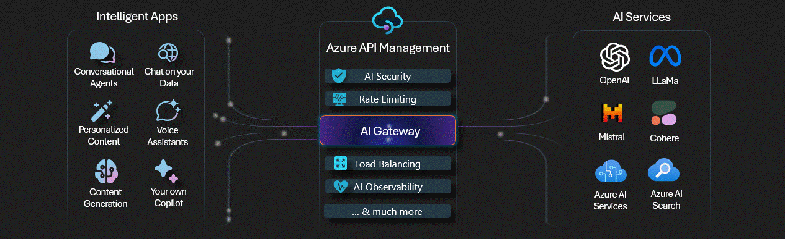

When considering, [Azure Open AI](https://learn.microsoft.com/azure/ai-services/openai/overview?WT.mc_id=AZ-MVP-5004796) adoption, there are some common challenges that you might face. These include:

* Protecting confidential information.
* End to end obserability.
* Disable inferencing via Azure AI Studio
* Protect from OWASP Top 10 threats

{/* truncate */}

So lets' take a look at each of these challenges and how you can overcome them.

## Overview
  
When considering, [Azure Open AI](https://learn.microsoft.com/azure/ai-services/openai/overview?WT.mc_id=AZ-MVP-5004796) adoption, there are some common challenges or considerations you might face, especially when looking at Day 1 and Day 2 lifecycles for your solution.

:::info
Software life cycle stages are typically broken down into the following stages:

Day 0  - Design and build stage
Day 1  - Infrastructure and code deployment stage
Day 2  - Runtime

:::

Today, we will look at some common challenges and how we can overcome, workaround or mitigate them.

## Landing Zone
  
When considering Azure Open AI adoption, it is important to have a well-defined landing zone, for your Platform architecture and your application. 

This is where you will deploy your AI solution into.

:::info
An [Azure landing zone](https://learn.microsoft.com/en-us/azure/cloud-adoption-framework/ready/landing-zone/?WT.mc_id=AZ-MVP-5004796) is an environment that follows key design principles across eight design areas. These design principles accommodate all application portfolios and enable application migration, modernization, and innovation at scale. An Azure landing zone uses subscriptions to isolate and scale application resources and platform resources. Subscriptions for application resources are called application landing zones, and subscriptions for platform resources are called platform landing zones.
:::

**Ask**:

Establish an Azure Landing Zone to place Azure OpenAI solution into

**Challenge**:

* Ensuring a well-architected foundation
* Need for compliance and security guardrails

| Why - Solid foundation for cloud adoption | Risk / Impact | Solution |
|-------------------------------------------|---------------|----------|
| - Provides a scalable and secure environment
- Critical for enterprise-grade workloads
- Ensures compliance and governance | Risk – High
Impact – High | - Implement Azure Landing Zone
- Include Identity, Security, and Network configurations
- Address compliance and governance from the start |

**Rationale**:

Implementing an Azure Landing Zone ensures a secure and compliant foundation for deploying Azure OpenAI solutions. This helps mitigate high risks and impact associated with cloud adoption by providing necessary guardrails and governance.

**Action**:

Implement an Azure Landing Zone for your Azure OpenAI solution. Include Identity, Security, and Network configurations. Address compliance and governance from the start. For Platform Landing Zone recommendations, refer to the [Cloud Adoption Framework - Ready](https://learn.microsoft.com/en-us/azure/cloud-adoption-framework/ready/landing-zone/?WT.mc_id=AZ-MVP-5004796).

However for more specific Azure OpenAI application landing zone considerations we can view **the [chat baseline architecture at the Azure Architecture Center](https://learn.microsoft.com/azure/architecture/ai-ml/architecture/baseline-openai-e2e-chat?WT.mc_id=AZ-MVP-5004796) for reference**.

:::tip
Azure Landing Zones consist of more than just a place to store your resources, they should also include considerations for people/process and products to run your applications at scale. I highly recommend going through the [Azure Landing Zone Review](https://learn.microsoft.com/en-us/assessments/21765fea-dfe6-4bc4-8bb7-db9df5a6f6c0/?WT.mc_id=AZ-MVP-5004796) to ensure you have a solid foundation for your Azure OpenAI solution, and Azure workloads in general.
:::

## Protect confidential information

When considering Azure Open AI adoption, it is important to protect confidential information. This includes data, code, and other sensitive information.

Especially when you are making use of [RAG (Retrieval Augmented Generation) pattern](https://learn.microsoft.com/azure/architecture/ai-ml/guide/rag/rag-solution-design-and-evaluation-guide?WT.mc_id=AZ-MVP-5004796), which allows you to make use of your own data, it is important to ensure that this data is protected.

**Ask**:

Establish an Azure Landing Zone to place Azure OpenAI solution into

**Challenge**:

Ensuring a well-architected foundation
Need for compliance and security guardrails

| Why - Solid foundation for cloud adoption | Risk / Impact | Solution |
|-------------------------------------------|---------------|----------|
| - Provides a scalable and secure environment
- Critical for enterprise-grade workloads
- Ensures compliance and governance | Risk – High
Impact – High | - Implement Azure Landing Zone
- Include Identity, Security, and Network configurations
- Address compliance and governance from the start |

**Rationale**:

Starting with Public & Internal data reduces the Impact from high to low. With lower overall risk, an organization can have faster initial adoption by the time they build additional guardrails for governance & compliance in place _(Audit, Monitoring and enterprise architecture)_.

**Action**:

Make use of Platform and resource capabilities to lock down access to confidential information. For example, use Azure Key Vault to store and manage secrets, and use Azure Policy to enforce compliance of those policies.

* Make use of Infrastructure as Code _(IaC)_, or [deploy the services manually](https://learn.microsoft.com/en-us/azure/ai-services/openai/how-to/create-resource?pivots=web-portal&WT.mc_id=AZ-MVP-5004796) to ensure that your Azure OpenAI solution is deployed in a secure and compliant manner, vs automated methods, that may automatically create the resources you need _(and sometimes more than you need)_ such as Azure AI Studio with Public endpoints. 
* Make use of [Role-based access control (RBAC) to ensure that only authorized users](https://learn.microsoft.com/azure/ai-services/openai/how-to/role-based-access-control?WT.mc_id=AZ-MVP-5004796) have access to your Azure OpenAI solution.
* [Disable access keys for Storage accounts](https://learn.microsoft.com/azure/storage/common/shared-key-authorization-prevent?tabs=portal&WT.mc_id=AZ-MVP-5004796), and make sure of [Managed Identities](https://learn.microsoft.com/entra/identity/managed-identities-azure-resources/overview?WT.mc_id=AZ-MVP-5004796) for inter-Azure resource permissions.
* Determine if the risk is high enough to manage the keys yourself, using [Customer Managed Keys](https://learn.microsoft.com/en-us/azure/storage/common/customer-managed-keys-overview?WT.mc_id=AZ-MVP-5004796) for your Storage account.
* Make use of [Private Endpoints](https://learn.microsoft.com/en-us/azure/private-link/private-endpoint-overview?WT.mc_id=AZ-MVP-5004796) and disable access to the public internet where possible, and monitor private endpoint _(East/West)_ traffic, using a Network Virtual Appliance, such as [Azure Firewall](https://learn.microsoft.com/azure/firewall/overview?WT.mc_id=AZ-MVP-5004796).
* Make use of in-built Azure policies to enforce compliance, such as [Storage account public access should be disallowed](https://learn.microsoft.com/azure/storage/common/policy-reference?WT.mc_id=AZ-MVP-5004796).
* Make sure your data lifecycle is managed correctly, and that you are not storing data longer than you need to, and that you are not storing data that you do not need to, you can make use of [lifecycle management policies](https://learn.microsoft.com/azure/storage/blobs/lifecycle-management-policy-configure?tabs=azure-portal&WT.mc_id=AZ-MVP-5004796), to assist with the technical aspects of this, and the Cloud Adoption Framework has some [guidance for Data governance](https://learn.microsoft.com/azure/cloud-adoption-framework/scenarios/cloud-scale-analytics/govern?WT.mc_id=AZ-MVP-5004796).

## End-to-end observability

When considering Azure Open AI adoption, it is important to have end-to-end observability. This includes monitoring, logging, and tracing.

Obserability for Azure Open AI, has come a long way, with greater capabilities being integrated into products, such as [Azure API Management](https://learn.microsoft.com/azure/api-management/api-management-key-concepts?WT.mc_id=AZ-MVP-5004796) features, commonly referred to as an [AI Gateway](https://learn.microsoft.com/ai/playbook/technology-guidance/generative-ai/dev-starters/genai-gateway/?WT.mc_id=AZ-MVP-5004796).

:::tip
I did a blog article on implementing and testing some of the AI Gateway capabilities, a few months ago here: [Implementing AI Gateway capabilities in API Management](https://luke.geek.nz/azure/implementing-ai-gateway-in-api-management/), make sure you check this out for a bit more deppth, and also [implementing a correlation ID for API Management](https://luke.geek.nz/azure/implementing-correlation-id-in-api-management/) requests, to help track client transactions with Azure Application Insights.
:::

**Ask**:

All interactions by data scientists including prompts & responses must be logged

**Challenge**:

Azure OpenAI only logs user ID of consumer but does not log prompts sent or responses received in Azure Diagnostics table _(or anywhere else)_.

| Why | Risk / Impact | Solution |
|-----|---------------|----------|
| - Lines of businesses that own the data need to ensure there was no misuse of confidential data
- Complete audit trail must be established to create a fully governed environment | Risk – High
Impact – High | - Custom applications that call AOAI should log prompts and responses from their side
- Use Azure API Management services as a middle layer between published service and consuming applications and audience |

**Rationale**:

Azure OpenAI itself has minimal capabilities, and reliant on other products to fully capture capture prompts and inferences for audit and governance purposes.

**Action**:

* Make use of [Azure API Management](https://learn.microsoft.com/azure/api-management/api-management-key-concepts?WT.mc_id=AZ-MVP-5004796) to capture all interactions between your Azure OpenAI solution and your consumers.
* Make use of [Azure Application Insights](https://learn.microsoft.com/azure/azure-monitor/app/app-insights-overview?WT.mc_id=AZ-MVP-5004796) to capture all interactions between your Azure OpenAI solution and your consumers, Application Insights works well with API Management.
* Make sure of reference architecture, such as the [Implement logging and monitoring for Azure OpenAI models](https://learn.microsoft.com/azure/architecture/ai-ml/openai/architecture/log-monitor-azure-openai?WT.mc_id=AZ-MVP-5004796) for guidance on how to implement this, and to review what metrics and logs can be pulled from Azure OpenAI logging by default and adding the API Management resource into the solution.
* Make sure of the [AI-Gateway labs](https://aka.ms/apim/genai/labs), to help add additional capabilities to your Azure API Management instance, tailored for Azure OpenAI endpoints.

## Microsoft to not or monitor customer data

Prompts and responses gets stored by Microsoft by default for [abuse monitoring](https://learn.microsoft.com/azure/ai-services/openai/concepts/abuse-monitoring?WT.mc_id=AZ-MVP-5004796) _(not accessible to customers)_, you may not want Microsoft to have access to this data, this includes Microsoft support. 

:::info
Your prompts _(inputs)_ and completions _(outputs)_, your embeddings, and your training data:

are NOT available to other customers.
are NOT available to OpenAI.
are NOT used to improve OpenAI models.
are NOT used to train, retrain, or improve Azure OpenAI Service foundation models.
are NOT used to improve any Microsoft or 3rd party products or services without your permission or instruction.
Your fine-tuned Azure OpenAI models are available exclusively for your use.
The Azure OpenAI Service is operated by Microsoft as an Azure service; Microsoft hosts the OpenAI models in Microsoft’s Azure environment and the Service does NOT interact with any services operated by OpenAI _(e.g. ChatGPT, or the OpenAI API)_.

Reference: [Data, privacy, and security for Azure OpenAI Service](https://learn.microsoft.com/legal/cognitive-services/openai/data-privacy?context=%2Fazure%2Fai-services%2Fopenai%2Fcontext%2Fcontext&tabs=azure-portal&WT.mc_id=AZ-MVP-5004796)
:::

**Ask**:

Confidential data should never be stored anywhere by Microsoft or viewed by any Microsoft support or product team member

**Challenge**:

Microsoft logs all prompts for internal abuse monitoring for 30 days and then deletes them

| Why | Risk / Impact | Solution |
|-----|---------------|----------|
| - Some clients do not want any confidential data in prompts to be viewed by Microsoft support team | Risk – High
Impact – High | - Managed customers have the option to apply for modified access, which stops all prompt logging |

**Rationale**:

Microsoft’s managed customers are typically large organizations, have a level of trust with Microsoft, and are deemed to be responsible for their actions

**Action**:

* [Managed customers](https://learn.microsoft.com/legal/cognitive-services/openai/limited-access?context=%2Fazure%2Fai-services%2Fopenai%2Fcontext%2Fcontext&WT.mc_id=AZ-MVP-5004796#registration-for-modified-content-filters-andor-abuse-monitoring) may apply for modified access, which stops all prompt logging.

:::info
Managed partners and customers are customers whose subscriptions are managed by the partner network or customers who are part of the Microsoft Enterprise Agreement program. Managed customers have the option to apply for modified access, which stops all prompt logging. This is a contractual agreement between Microsoft and the customer, and the customer must apply for this access.
:::

:::warning
Also, make sure you talk to your account team, and understand the implications of this, as it may affect the way you have architected the solution, and the safeguards you may have to add, and also expectations with Microsoft support, on the data that they may have.

"Disabling content filtering could result in failure to block content that violates the [Microsoft Generative AI Services Code of Conduct](https://learn.microsoft.com/legal/cognitive-services/openai/code-of-conduct?WT.mc_id=AZ-MVP-5004796). My organization will implement systems and measures to ensure that the organization’s use of Azure OpenAI complies with the [Microsoft Generative AI Services Code of Conduct](https://learn.microsoft.com/legal/cognitive-services/openai/code-of-conduct?WT.mc_id=AZ-MVP-5004796)".
:::

:::tip
Make sure you take a look at the [Use Risks & Safety monitoring](https://learn.microsoft.com/en-us/azure/ai-services/openai/how-to/risks-safety-monitor?WT.mc_id=AZ-MVP-5004796#potentially-abusive-user-detection) in Azure OpenAI Studio functionality, to review any results of the filtering activity. You can use that information to further adjust your filter configuration to serve your specific business needs and [Responsible AI principles](https://learn.microsoft.com/azure/machine-learning/concept-responsible-ai?view=azureml-api-2&WT.mc_id=AZ-MVP-5004796). 
:::

## Disable inferencing via Azure AI Studio

When considering Azure Open AI adoption, it is important to consider if you want user, to be able to inference using Azure AI Studio, using Azure AI Studio can be a security risk, as it allows users to inference directly from the Azure Portal, bypassing some traceability mechanisms _(such as Azure API Management)_ which you may have in place.

**Ask**:

Azure OpenAI Studio should not be available to make any inferencing calls and must be disabled

**Challenge**:
There is no permission or RBAC role that prevents use of AI Studio.

| Why | Risk / Impact | Solution |
|-----|---------------|----------|
| - Azure OpenAI Studio does not log prompts and responses in the diagnostic logs
- Azure OpenAI Studio will bypass APIM as well | Risk – High
Impact – High | - Create an intermediary hop between client and AOAI service, and allow AOAI access only via Private Endpoint _(Example: AppGW/APIM)_
- Or enable end user only via Service Principals _(no portal access)_
- Or DNS block oai.azure.com |

Rationale:

No other out of the box method to disable Azure OpenAI Studio exists.

**Action**:

* Control access to individual Azure OpenAI instances, through [restricting what Virtual Networks](https://learn.microsoft.com/en-gb/azure/ai-services/cognitive-services-virtual-networks?tabs=portal&WT.mc_id=AZ-MVP-5004796) can access the OpenAI instance _(Service Tags need to be allowed through a Network Security Group)_, so make sure you make use of Network Security Groups where possible to only tunnel your approved traffic *(ie AppGw or APIM only)*.
* Make use of [Role-based access control for Azure OpenAI](https://learn.microsoft.com/en-gb/azure/ai-services/openai/how-to/role-based-access-control?WT.mc_id=AZ-MVP-5004796) Service to control who can see what.
* Make sure of [Azure Policy built-in policy definitions for Azure AI services](https://learn.microsoft.com/en-us/azure/ai-services/policy-reference?WT.mc_id=AZ-MVP-5004796), to control network access to your Azure OpenAI instances for existing or new deployments. 
* Deploy a Custom policy, to prevent the creation of Azure OpenAI Studio. Refer to my blog post: [Azure Policy - Deny the creation of Azure OpenAI Studio](https://luke.geek.nz/azure/policy-deny-creation-azure-openai-studio/).

## Restrict models to only certain users

When considering Azure Open AI adoption, it is important to restrict models _(or deployments)_ to only certain users. 

**Ask**:

Model should be accessible to only required audience and no one else.

**Challenge**:

Azure OpenAI does not have the ability to grant permissions by models.

| Why | Risk / Impact | Solution |
|-----|---------------|----------|
| - Model and Data access to follow the principle of least privilege | Risk – High
Impact – High | - Each use case to have their own Azure OpenAI instance
- Deploy approved models for use cases only
- Segregate duties of model deployment and model consumption via a custom RBAC role with least privileges |

**Rationale**:

By having segregated instances for each use case, it eliminates the risk of model misuse and data exposure. New models and its inferencing capabilities need to be explicitly approved per use case before it can be leveraged. 

**Action**:

* [Create and deploy an Azure OpenAI Service resource](https://learn.microsoft.com/azure/ai-services/openai/how-to/create-resource?pivots=web-portal&WT.mc_id=AZ-MVP-5004796) for each use case, and deploy only approved models for that use case.
* Make sure of [Role-based access control for Azure OpenAI](https://learn.microsoft.com/en-us/azure/ai-services/openai/how-to/role-based-access-control?WT.mc_id=AZ-MVP-5004796) Service to control who can see what, seperate the users deploying the Models, to the users consuming the models, for example Cognitive Services OpenAI User to a Managed Identity or user using the deployments.
* Make use of [Azure Policy built-in policy definitions for Azure AI services](https://learn.microsoft.com/en-us/azure/ai-services/policy-reference?WT.mc_id=AZ-MVP-5004796), to control network access to your Azure OpenAI instances for existing or new deployments, and also restrict the creation of new 'unapproved' Azure OpenAI resources from being created.

## FinOps - view total opex of OpenAI

Consumption per use cases could vary by order of magnitude, you may want to have visibility of costs at a service or deployment level, especially for use cases where the Azure OpenAI resource is shared, but deployments are spread between projects. 

**Ask**:

Use cases must be able to view their total spend for Azure OpenAI service  
  
**Challenge**:

- Cost metrics are available at service level, and select deployments, but not all  
- Any sharing of Azure OpenAI service makes cost determination not possible  
- No ability to stop usage beyond spend budget  
  
| Why                                                                 | Risk               | Solution                                                                                                                                                  |  
|---------------------------------------------------------------------|--------------------|-----------------------------------------------------------------------------------------------------------------------------------------------------------|  
| - Use case owners need to monitor consumption as they are responsible for cost- Azure OpenAI service can create significant cost depending on usage. | Risk – Medium Impact – High | - Provision each use case in a dedicated instance and a dedicated subscription & resource group<- This also ensures full AOAI capacity _(Tokens per min)_ available to use case |  
  
**Rationale**:

- By having segregated instances for each use case, it provides accurate cost for each use case.  

**Action**:

* Provision dedicated instances for each use case, and rely on distinct Resource Group and Subscriptions, to seperate costs.
* Review Cost Management, and [scope the cost per Model tokens](https://learn.microsoft.com/en-us/azure/ai-services/openai/how-to/manage-costs?WT.mc_id=AZ-MVP-5004796#monitor-costs).
* Make use of API Management, and [Token Usage](https://journeyofthegeek.com/2024/08/22/azure-openai-service-tracking-token-usage-with-apim/) and merge that with your billing data.
* If the Azure OpenAI instance, is part of a wider solution, make sure you tag it with the [cm-resource-parent](https://luke.geek.nz/azure/application-cost-analysis-in-microsoft-azure-with-cm-resource-parent-tag/) tag to allow the full visibility of the cost of the workload.

