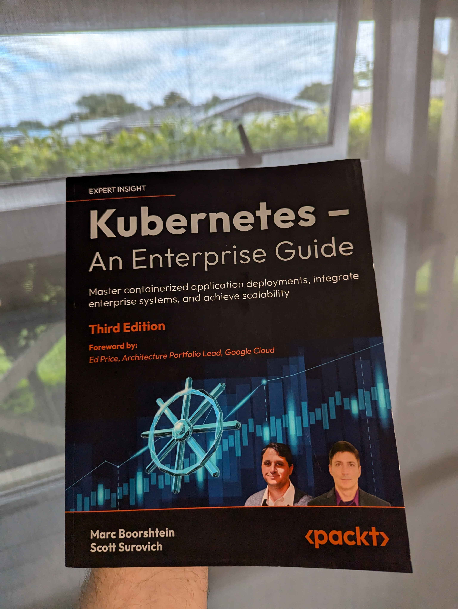

I had the privilege to be able to read and review the ‘[**Kubernetes - An Enterprise Guide**](https://www.amazon.com.au/Kubernetes-Enterprise-Effectively-containerize-applications-dp-1835086950/dp/1835086950)’ book by [Marc Boorshtein](https://www.linkedin.com/in/marc-boorshtein-5979a82/) _(Author)_, [Scott Surovich](https://www.linkedin.com/in/scottsurovich/) _(Author)_. Packt Publishing publishes the book and is available on Amazon. 

> This was the third edition of the book, but I feel there was no need to read the previous editions to understand the content of this book. Being the third edition also means that any mistakes or learnings from the past two editions have been considered.

{/* truncate */}

> The book is a great read for anyone looking to understand Kubernetes from the ground up. The book is divided into 18 chapters and covers a wide range of topics, from the basics of Kubernetes to advanced topics like security, monitoring, and troubleshooting. The book is written in a language that is very easy to understand and is full of examples and diagrams to help you understand the concepts better.

Let's dig into this a bit more:

First, the vision of the book is really about focusing on what you need to run Kubernetes in an Enterprise environment, based on the real-world experience from the authors, so naturally, the questions I wanted to know if this book would answer in its 623 pages of content were:

1.	Does it adequately cover core Kubernetes concepts relevant to enterprises?
2.	Does it address multi-cluster and multi-cloud Kubernetes deployments?
3.	Is the information backed by research, case studies, or industry best practices?
4.	Is the content accessible to the intended readers, whether they are developers, operations staff, or managers?

So, let’s go through each of these:

## **Q. Does it adequately cover core Kubernetes concepts that are relevant to enterprises?**

**I can say yes – it does!**

The book introduces Docker and container essentials, explaining the need for containerization and how Docker works. It also covers the installation and usage of Docker before going into deploying your own Kubernetes cluster with KinD and the various components that make up Kubernetes. It covers concepts such as Ingress, Deployment, and Services, then exposes Load Balancer options, DNS considerations, and identity across multiple chapters.

* Now, let us look at **Q. Does it address multi-cluster and multi-cloud Kubernetes deployments?**

> **Kind of!**

As alluded to, it goes through setting up KinD (Kubernetes in Docker) multi-cluster configurations, and Kubelet options, multi-tenant vCluster configuration, global load balancing!

However, this book – takes a neutral stance on specific Cloud deployment options, i.e., AKS and EKS, concentrating more on integration, and what's happening in the cluster, vs the opinionated Cloud provider implementations, it does, however, touch on various integrations – with identity being a key component – with some demos _(as part of a GitHub)_ repository to match, if you are looking for a book all about AKS and Cloud deployment – then in my opinion not the book for you, HOWEVER, if you want to know what is happening in the background, and WHY the clusters, nodes, namespaces operate the way they do – then this is an ideal book, to understand full the concepts, which doesn’t make it less valuable, but more of a supplement for fully understanding what those Cloud providers obfuscate from.

## **Q. Is the information backed by research, case studies, or industry best practices?**

I always consider this, as it removes any bias the authors may have, with more generalized guidance discovered from sweat and tears in the industry in general, and I can confirm that indeed it does!
The book features many real-world examples based on issues the authors have experienced throughout the years and resolutions on how they have been implemented. It also references external (trusted—i.e., kubernetes.io) sources where needed to point readers to additional information.

## **Q. Is the content accessible to the intended readers, whether they are developers, operations staff, or managers?**

> **Short answer Yes!** 

My background is in system administration (15+ years), so I approached this more from an operations and delivery perspective than a developer, so I have some bias there in my review. However, the key points are:

The book covered a great introduction into the concepts that make up Kubernetes, each chapter included step by step instructions, example demos supplied from a public git repo so get hands on (which was great!), managing secrets and cluster security with Gatekeeper and Dashboards! 

I would say, yes, this book definitely covers it for developers and operations staff. It is more aligned to technical readers. However, as a Manager, there are a lot of concepts you can pick up as well, and the chapters can be skipped easily due to their names of build and deploy if not of interest.

**All in all – this is a great resource! I learned a few things, It's great to get hands-on with the guides and knowledge checks at the end of the book! Add and read this if you want to understand Kubernetes. It builds your knowledge up from concepts, so it’s a book that can meet you where you are!**

> The authors spent much time working on this book, training, and demo material, and you can tell!

I’m going to need to get a bigger bookshelf!

:::info
You can find the repository for the book here: 

* [PacktPublishing/Kubernetes-An-Enterprise-Guide-Third-Edition](https://github.com/PacktPublishing/Kubernetes-An-Enterprise-Guide-Third-Edition)
:::

:::tip
If you purchase the physical book, you can also get a free eBook version from a QR code supplied on the pages of the book, which is common with many PacktPublishing books. So keep this in mind if you're like me and like switching between the physical book and an e-reader like a Kindle!
:::
