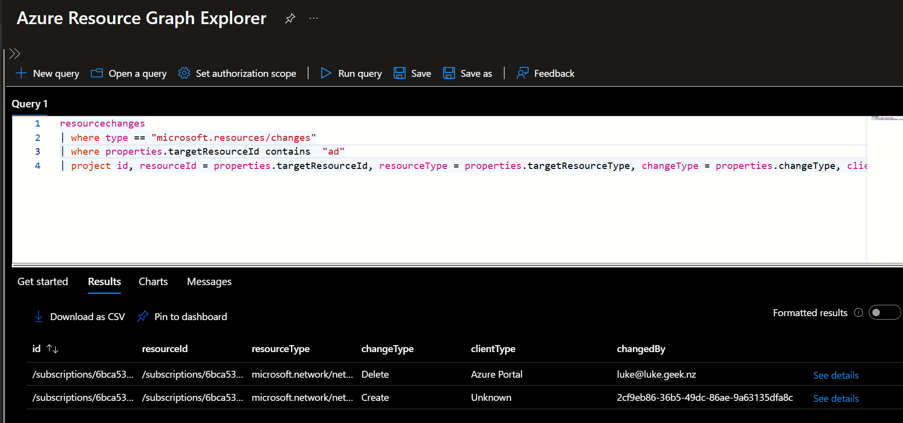
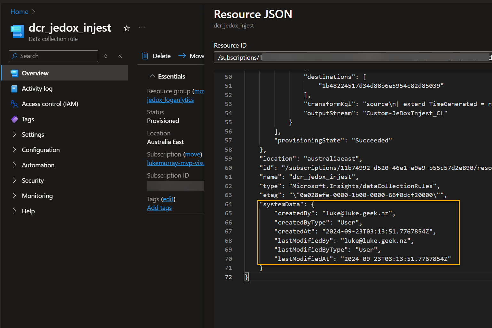

Who created my resource? What created my Azure resource? We often ask ourselves these questions when troubleshooting or trying to understand the state of our Azure resources.

[Change Analysis](https://learn.microsoft.com/azure/azure-monitor/change/change-analysis?WT.mc_id=AZ-MVP-5004796) is a feature in Azure Monitor that helps you answer these questions. Change Analysis helps to provide a view of the changes that have occurred on your Azure resources over time, using the [Azure Resource Graph](https://learn.microsoft.com/azure/governance/resource-graph/overview?WT.mc_id=AZ-MVP-5004796).

{/* truncate */}

## Overview

Today, we will look at Change Analysis to see:

A. Can we see the changes that have occurred on our Azure resources?
B. Can we see the changes that have occurred on our Azure resources over time?
C. Can we tell who made the change?
D. Can we determine what made the change?

:::info
Change Analysis in the portal

Change Analysis experiences across the Azure portal are powered using the Azure Resource Graph Microsoft.ResourceGraph/resources API. You can query this API for changes made to many of the Azure resources you interact with, including App Services (Microsoft.Web/sites) or Virtual Machines (Microsoft.Compute/virtualMachines).

The Azure Resource Graph Change Analysis portal experience provides the following:

* An onboarding-free experience, giving all subscriptions and resources access to change history.
* Tenant-wide querying rather than select subscriptions.
* Change history summaries aggregated into cards at the top of the new Resource Graph Change Analysis.
* More extensive filtering capabilities.
* Improved accuracy and relevance of changed by information, using Change Actor functionality.

Learn how to [view the new Change Analysis experience in the portal](https://learn.microsoft.com/en-us/azure/governance/resource-graph/changes/view-resource-changes?WT.mc_id=AZ-MVP-5004796).
:::

## Can we see the changes that have occurred on our Azure resources?

> Yes, we can see the changes that have occurred on our Azure resources. Change Analysis provides a view of the changes on your Azure resources over time. You can see the changes that have occurred on your Azure resources in the last 14 days.

If we navigate to the [Change Analysis (Preview)](https://portal.azure.com/#view/Microsoft_Azure_OneInventory/ResourceChangesOverview.ReactView) blade in the Azure portal, we can see the changes that have occurred on our Azure resources.


:::note
The blur is intentional, as part of the [Cloudclock](https://luke.geek.nz/azure/cloudcloak/) extension to protect sensitive information.
:::

We can see the changes (Create, Update, and Delete) that have occurred on our Azure resources. We can even group them by resource or by who made the change.

## Can we see the changes on our Azure resources over time?

By default, we can see the changes over the last 14 days from the Azure Portal.

:::info
Changes are queryable for 14 days. For longer retention, you can [integrate your Resource Graph query with Azure Logic Apps](https://learn.microsoft.com/en-us/azure/governance/resource-graph/tutorials/logic-app-calling-arg?WT.mc_id=AZ-MVP-5004796) and manually export query results to any of the Azure data stores like [Log Analytics](https://learn.microsoft.com/en-us/azure/azure-monitor/logs/log-analytics-overview?WT.mc_id=AZ-MVP-5004796) for your desired retention.
:::

A KQL query to see the changes over the last 14 days would look like:

```kql
resourcechanges
| where type == "microsoft.resources/changes"
| project id, resourceid = properties.targetResourceId, changeType = properties.changeType, clientType = properties.changeAttributes.clientType, changedBy = properties.changeAttributes.changedBy
```

If you want to target a specific resource, you can use a query like:

```kql  
resourcechanges
| where type == "microsoft.resources/changes"
| where properties.targetResourceId contains  "ResourceName"
| project id, resourceId = properties.targetResourceId, resourceType = properties.targetResourceType, changeType = properties.changeType, clientType = properties.changeAttributes.clientType, changedBy = properties.changeAttributes.changedBy
```

Replace the `ResourceName` with the name of the resource you are looking for. These queries can also be integrated into the Logic App for export.

You can also run these queries directly from the Azure Portal by navigating to the [Azure Resource Graph Explorer](https://portal.azure.com/#view/HubsExtension/ArgQueryBlade/query/resourcechanges) blade.




:::warning
Currently, Azure Resource Graph doesn't:

Observe changes made to a resource's data plane API, such as writing data to a table in a storage account.
Support file and configuration changes over App Service.
:::

## Can we tell who made the change?

> Yes, we can tell who made the change. Change Analysis provides the `changedBy` field, which tells us who made the change.

In my examples, we can see the `changedBy` field in the query results. This field tells us who made the change.


It could be the user or the service principal that made the change. In this example, I can see:

* A Network interface resource was created by `2cf9eb86-36b5-49dc-86ae-9a63135dfa8c`, which is the Application ID of a Microsoft-owned Registration for Azure Traffic Manager and DNS.
* A Deletion of the network interface was done by `Luke@geek,` which is my user account.

SOME Azure resources _(with the latest API)_ such as this Data Collection Rule, contains the information in the resource metadata.



## Can we determine what made the change?

> Yes, we can determine what caused the change. Change Analysis provides the `clientType` field, which tells us what caused the change. However, as we can see in the previous screenshots, this is not always as accurate as we may want it to be. However, it's good enough that you can infer what may have issued the changes.

Some of the clientType values you may see are:

* `Azure Portal` - Changes made from the Azure Portal.
* `Unknown` - A change happened to a client that is unrecognized.
* `CLI` - Changes made from Azure CLI.
* `Unspecified` - Unspecified is displayed when the resource is missing changedByType values and could be missing for either Creates or Updates. It could also mean changes are performed in the background by Azure services and not user initiatied.
* `ARM Template` - Changes made from an ARM Template, whether deployed automatically or via a 'Deploy to Azure' button. This also includes changes made by Bicep.
* `System` - System is displayed as a changedBy value when a background change occurred that wasn't correlated with any direct user action.

## References

To learn more about Change Analysis, check out the following resources:

* [Change Analysis in Azure Resource Graph vs. Azure Monitor](https://learn.microsoft.com/azure/governance/resource-graph/changes/resource-graph-changes?WT.mc_id=AZ-MVP-5004796#change-analysis-in-azure-resource-graph-vs-azure-monitor)
* [Announcing the General Availability of Change Actor](https://techcommunity.microsoft.com/t5/azure-governance-and-management/announcing-the-general-availability-of-change-actor/ba-p/4171801?WT.mc_id=AZ-MVP-5004796)
