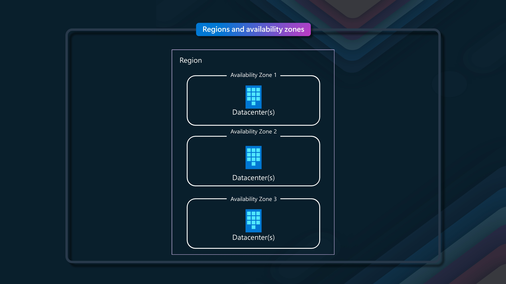
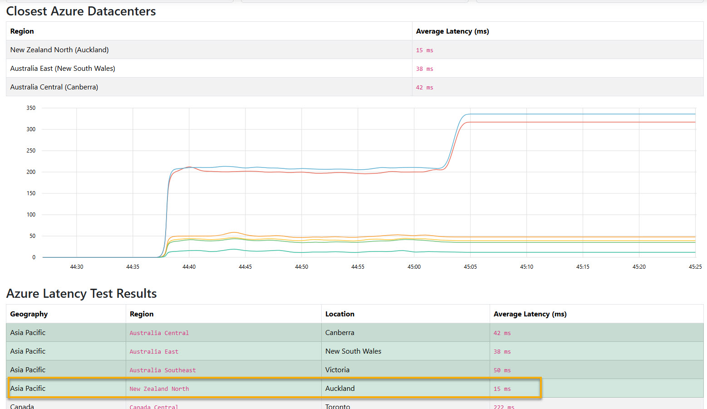
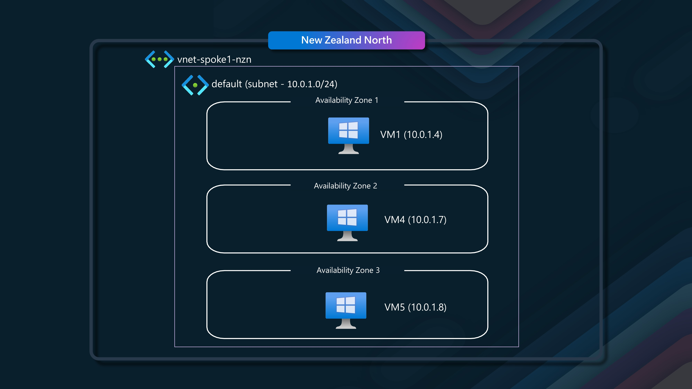
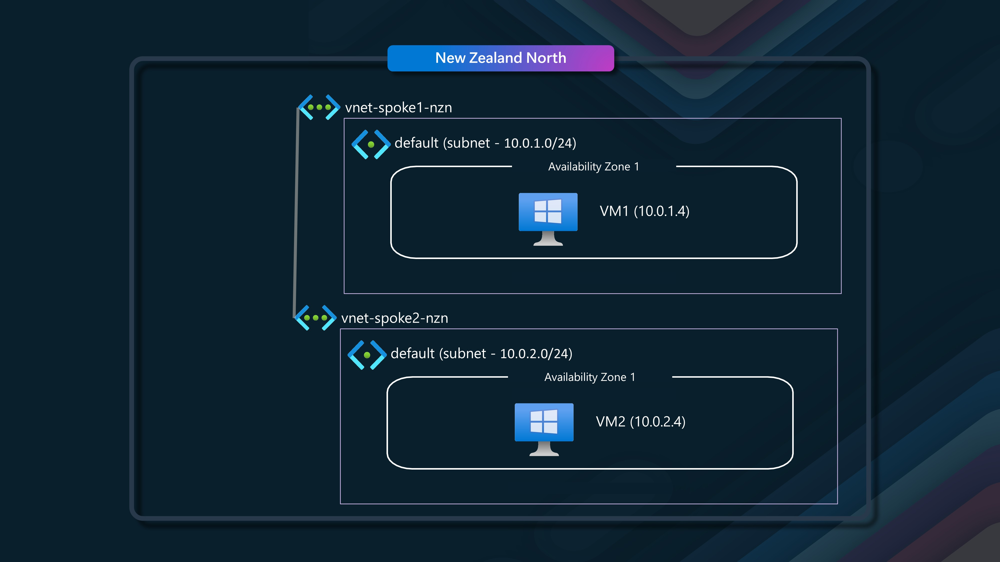
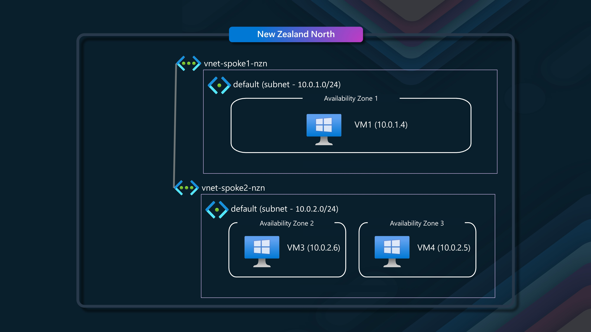
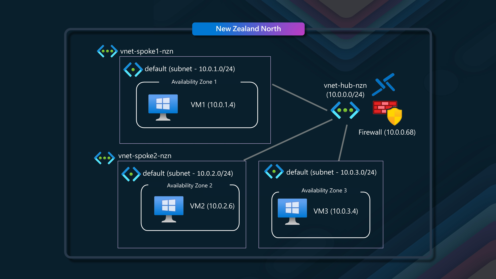

New Zealand has a new (and first) Azure Cloud region: [New Zealand North](https://news.microsoft.com/aotearoa-datacenter?WT.mc_id=AZ-MVP-5004796). It's not every day that we get to explore a new region! In this article, I will examine the latency within the New Zealand North region and between its Availability Zones.

<!--truncate-->

## 🔍 Overview

New Zealand North region follows the newer, now standard, 3 + 0 model, with 3 [availability zones](https://learn.microsoft.com/azure/reliability/availability-zones-overview?tabs=azure-cli&WT.mc_id=AZ-MVP-5004796) (three separate datacenters that make up a region) but with [no specified region pair](https://learn.microsoft.com/azure/reliability/cross-region-replication-azure?WT.mc_id=AZ-MVP-5004796#regions-with-availability-zones-and-no-region-pair) (e.g., locally or in Australia). This means that Microsoft does not assume which other region you may want to use as a failover. You can choose any region you want (e.g., object replication on an Azure storage account can be any region). Most of us in New Zealand will likely choose New Zealand North as the primary and Australia East as the secondary, where applicable. These three availability zones already provide more resiliency out of the box than most New Zealand organizations had before.

:::warning
At the time of this article, New Zealand North is not officially Generally Available _(indicative timelines December)_, however finding I can deploy to this region now, I couldn't resist the opportunity to test the latency between within the region. This article is intended as an indicative to what you can expect from New Zealand North, but recommend running your own tests within your own environment if required.
:::

If we look at the lower end of our resiliency tier we can see Azure Service Bus	starts at an SLA of 99.9% (Y: 8h 45m 36s  M: 43m 12s  W: 10m 4s), and the higher SLA services such as Azure Virtual Machines and API Gateway can give up to 99.99% (Y: 52m 35s  M: 4m 23s  W: 1m 1s) _(how your solution and what services you use, impact your Composite SLA and Service Level Agreements so make sure you architect accordingly and review the [Microsoft SLA documentation](https://www.microsoft.com/licensing/docs/view/Service-Level-Agreements-SLA-for-Online-Services?WT.mc_id=AZ-MVP-5004796))_.

:::info
Availability zones are close enough to have low-latency connections to other availability zones. They're connected by a high-performance network with a round-trip latency of less than 2ms. However, availability zones are far enough apart to reduce the likelihood that more than one will be affected by local outages or weather. Availability zones have independent power, cooling, and networking infrastructure. They're designed so that if one zone experiences an outage, then regional services, capacity, and high availability are supported by the remaining zones. They help your data stay synchronized and accessible when things go wrong.
:::

:::tip
If interested in more information about Avaliaibility Zones, and the differences between Physical + Logical zones make sure you have a read of a previous blog article of mine: [Azure Availability Zone Peering](https://luke.geek.nz/azure/azure-availability-zone-peering/). In essence, you need to be aware that Avalibility Zone 1 _(physical and logical avalibility zones can be different)_, does not always equal Avaliability Zone 1, especially if you have workloads spread across multiple subscriptions. For the purposes of today, all my testing is done in a single subscription.
:::

## 📉 Latency Testing

But this is not a resiliency discussion, it is latency, so lets look at the latency for what New Zealand North is giving us.

:::warning
Keep in mind, these tests are simply a point in time, and my open environment may not necessary reflect your own Azure environment. At the time of these tests, the New Zealand North Region wasn't offically Generally avaliable. This article is intended as an indicitive to what you can expect from New Zealand North, but recommend running your own tests within your own environment if required.
:::

The latency from New Zealand to New Zealand North is around 15ms _(from Hamilton)_, which is a great improvement from the 32-50ms to Australia East _(from Hamilton)_, and the 190-230ms to the US _(from Hamilton)_.

:::info
The test above, was done from Hamilton _(using the [Azure Speed Test](https://www.azurespeed.com/Azure/Latency?WT.mc_id=AZ-MVP-5004796))_, and the latency is to the internet, so it is not the same as the latency between the Azure region and your on-premises _(or other cloud)_ environment, but it is a good indicator of the latency you can expect from your users to your Azure resources. Your browser sends HTTPS requests to Azure blob files in each region. The median latency is calculated by measuring the time between the request and the response. The latency is measured in milliseconds (ms). The lower the latency, the better.
:::

Because this a standard Avalibiliy Zone _(3+0)_ region, Microsoft has certain commitments they have around latency, within their own network, and to the internet, and they have a [guidelines](https://learn.microsoft.com/en-us/azure/reliability/availability-zones-overview?tabs=azure-cli&WT.mc_id=AZ-MVP-5004796) of 2ms _(between zones)_ and 10ms _(to the internet - don't quote me on the SLA to the internet, its inferred by reading the SLA document, but I can't confirm at this stage)_, but remember that is just the network latency, and not the application latency _(which is what you should be more concerned about)_. Its worth noting on SLA _(Service Level Agreements)_, that Microsoft does it per service vs per datacenter or rack.

So, lets prove that with the New Zealand North region, we can communicate between all regions in 2ms or under. For the purposes of this article, I will be using a Single subscription to do my testing _(so I know that each zone, will be seperate)_. I will be using a [Azure Virtual Network](https://learn.microsoft.com/azure/virtual-network/virtual-networks-overview?WT.mc_id=AZ-MVP-5004796) _(VNet)_ in the New Zealand North region, a VNET _(logical Virtual Network)_ is zone-redundant out of the box.

Then I will be using a Windows Server 2022 [Azure Virtual Machine](https://learn.microsoft.com/azure/virtual-machines/windows/overview?WT.mc_id=AZ-MVP-5004796) _(VM)_ in each zone, and I will be using [latte](https://learn.microsoft.com/en-us/azure/virtual-network/virtual-network-test-latency?tabs=windows&WT.mc_id=AZ-MVP-5004796#test-vms-with-latte-or-sockperf) to do my testing from each Virtual Machine.

* Each Test machine is [Accelerated Networking](https://learn.microsoft.com/azure/virtual-network/accelerated-networking-overview?tabs=redhat&WT.mc_id=AZ-MVP-5004796) enabled.
* The size of each Virtual Machine is a: Windows Server 2022 Datacenter: Azure Edition - x64 Gen2 - Standard_D4s_v3 - 4 vCPUs, 16 GB memory, 127GB OS disk. 
* Network Security Groups as left as default _(at the VM NIC)_ and VirtualNetwork allow.
* The version of [latte](https://github.com/microsoft/latte/), I am using is v1.0.0.

:::info
Many  common network latency test tools, such as Ping, don't measure TCP or UDP traffic. Tools like Ping use Internet Control Message Protocol (ICMP), which applications don't use. ICMP traffic can be treated differently from application traffic and doesn't directly affect application performance. ICMP test results don't directly apply to workloads that use TCP and UDP.

[Latte](https://github.com/microsoft/latte) (for Windows) and [SockPerf](https://github.com/mellanox/sockperf) (for Linux) measure only TCP or UDP payload delivery times. These tools use the following approach to measure network latency between two physical or virtual computers:

* Create a two-way communications channel between the computers by designating one as sender and one as receiver.
*  Send and receive packets in both directions and measure the round-trip time (RTT).

Refer: [Test network latency between Azure VMs](https://learn.microsoft.com/en-us/azure/virtual-network/virtual-network-test-latency?tabs=windows&WT.mc_id=AZ-MVP-5004796)
:::

The latte command I will be using is: `latte -c -a 10.0.1.5:80 -i 60000`

:::note
Even though at the time of this article, Windows Server 2025 has been generally avaliable for about a week. I have decided to use 2022, as it is a common and mature version of Windows Server in use today.
:::

Inspired by [Nicola Delfino](https://www.linkedin.com/in/nicoladelfino) post on [Measuring latency between Azure Availabity Zones and the impact of an NVA in between V2](https://nicolgit.github.io/azure-measuring-latency-across-availability-zones-in-we/) I will run through multiple scenarios for the New Zealand North Azure Region:

* Same v-net, same availability zone, same [proximty placement](https://learn.microsoft.com/azure/virtual-machines/co-location?WT.mc_id=AZ-MVP-5004796) group
* Same v-net, across availability zones
* multiple v-nets (in peering), same availability zone
* multiple v-nets (in peering), across availability zones
* multiple v-nets connected in a Hub & Spoke topology and Routing via Azure Firewall

## 🏢 Scenario 1 - Same Virtual Network, same availability zone, same [proximty placement](https://learn.microsoft.com/azure/virtual-machines/co-location?WT.mc_id=AZ-MVP-5004796) group

In this scenario, we will have a single VNET, with a single subnet, and two virtual machines in the same availability zone, and the same [proximty placement](https://learn.microsoft.com/azure/virtual-machines/co-location?WT.mc_id=AZ-MVP-5004796) group.

In this example, we have VM1 talking to VM2.

### VM1 (Sender - 10.0.1.4) - VM2 (Receiver - 10.0.1.5)

| Metric              | Value          | Notes                             |
|---------------------|----------------|-----------------------------------|
| **Protocol**        | TCP            | Connection-oriented, reliable    |
| **Send Method**     | Blocking       | Waits for completion              |
| **Receive Method**  | Blocking       | Waits for completion              |
| **SO_SNDBUF**       | Default        | Default socket send buffer size   |
| **SO_RCVBUF**       | Default        | Default socket receive buffer size|
| **Msg Size (byte)** | 4              | Small message payload size        |
| **Iterations**      | 60,000         | Number of send/receive cycles     |
| **Latency (usec)**  | 72.75          | Average time per message          |
| **CPU (%)**         | 6.5            | CPU utilization during test       |
| **CtxSwitch/sec**   | 27,874 (2.03/iteration) | Context switches per second |
| **SysCall/sec**     | 28,590 (2.08/iteration) | System calls per second     |
| **Interrupt/sec**   | 58,447 (4.25/iteration) | Hardware interrupts per second |

**Latency(usec): 72.75** – The average latency per message is 72.75 microseconds. This is the time it takes for a message to be sent and received back, which is relatively low and suggests a reasonably fast response time for small message sizes.

## 🌐 Scenario 2 - Same Virtual Network, same availability zone, virtual machine NOT in proximity placement group

In this scenario, we will have a single VNET, with a single subnet, and two virtual machines in the same availability zone, but not in the same proximty placement group.

We will be talking from VM1 to VM3.

### VM1 (Sender) - VM3 (Receiver)

| Metric              | Value           | Notes                             |
|---------------------|-----------------|-----------------------------------|
| **Protocol**        | TCP             | Connection-oriented, reliable     |
| **Send Method**     | Blocking        | Waits for completion              |
| **Receive Method**  | Blocking        | Waits for completion              |
| **SO_SNDBUF**       | Default         | Default socket send buffer size   |
| **SO_RCVBUF**       | Default         | Default socket receive buffer size|
| **Msg Size (byte)** | 4               | Small message payload size        |
| **Iterations**      | 60,000          | Number of send/receive cycles     |
| **Latency (usec)**  | 55.97           | Average time per message          |
| **CPU (%)**         | 14.9            | CPU utilization during test       |
| **CtxSwitch/sec**   | 36,652 (2.05/iteration) | Context switches per second |
| **SysCall/sec**     | 39,293 (2.20/iteration) | System calls per second     |
| **Interrupt/sec**   | 68,617 (3.84/iteration) | Hardware interrupts per second |

The table lists the the latency and system performance between **VM1 (Sender)** and **VM3 (Receiver)**. The average latency per message is **55.97 microseconds**, which is interesting slightly lower than the previous scenario, and not what I expected, however could be luck of the draw - something worth noting that without a proximty placement group, the next time I would deallocate this Virtual Machine, it could be spun up in a seperate place within the zone.

## 🔗 Scenario 3 - Same Virtual Network, across availability zones

In this scenario, we will have a single VNET, with a single subnet, and two virtual machines in different availability zones.

We keep the same VM1 _(in Zone 1)_, but we will be talking to VM4 and VM5 (that are in different avaliability zones). VM4 is in Zone 2 and VM5 is in Zone 3.

First lets look at VM1 (Avaliability 1) talking to VM4 _(Avalibility Zone 2)_.

### VM1 (Sender) - VM4 (Receiver)

| Metric              | Value           | Notes                             |
|---------------------|-----------------|-----------------------------------|
| **Protocol**        | TCP             | Connection-oriented, reliable     |
| **Send Method**     | Blocking        | Waits for completion              |
| **Receive Method**  | Blocking        | Waits for completion              |
| **SO_SNDBUF**       | Default         | Default socket send buffer size   |
| **SO_RCVBUF**       | Default         | Default socket receive buffer size|
| **Msg Size (byte)** | 4               | Small message payload size        |
| **Iterations**      | 60,000          | Number of send/receive cycles     |
| **Latency (usec)**  | 559.67          | Average time per message          |
| **CPU (%)**         | 1.5             | CPU utilization during test       |
| **CtxSwitch/sec**   | 3,742 (2.09/iteration) | Context switches per second |
| **SysCall/sec**     | 4,529 (2.53/iteration) | System calls per second     |
| **Interrupt/sec**   | 8,801 (4.93/iteration) | Hardware interrupts per second |

The table summarizes the latency and system performance between **VM1 (Sender)** and **VM4 (Receiver)**. The average latency per message is **559.67 microseconds**, which is significantly higher than the previous scenarios. This is expected as the two virtual machines are in different availability zones.

Next lets look at VM1 (Avaliability 1) talking to VM5 _(Avalibility Zone 3)_.

### VM1 (Sender) - VM5 (Receiver)

| Metric              | Value           | Notes                             |
|---------------------|-----------------|-----------------------------------|
| **Protocol**        | TCP             | Connection-oriented, reliable     |
| **Send Method**     | Blocking        | Waits for completion              |
| **Receive Method**  | Blocking        | Waits for completion              |
| **SO_SNDBUF**       | Default         | Default socket send buffer size   |
| **SO_RCVBUF**       | Default         | Default socket receive buffer size|
| **Msg Size (byte)** | 4               | Small message payload size        |
| **Iterations**      | 60,000          | Number of send/receive cycles     |
| **Latency (usec)**  | 559.25          | Average time per message          |
| **CPU (%)**         | 0.9             | CPU utilization during test       |
| **CtxSwitch/sec**   | 3,868 (2.16/iteration) | Context switches per second |
| **SysCall/sec**     | 4,464 (2.50/iteration) | System calls per second     |
| **Interrupt/sec**   | 7,721 (4.32/iteration) | Hardware interrupts per second |

This table summarizes the latency and system performance between **VM1 (Sender)** and **VM5 (Receiver)**. The average latency per message is **559.25 microseconds**, which is similar to the previous scenario. This is expected as the two virtual machines are in different availability zones.

Finally, lets look at VM4 _(Avaliability Zone 2)_ talking to VM5 _(Avalibility Zone 3)_.

### VM4 (Sender) - VM5 (Receiver)

| Metric              | Value           | Notes                             |
|---------------------|-----------------|-----------------------------------|
| **Protocol**        | TCP             | Connection-oriented, reliable     |
| **Send Method**     | Blocking        | Waits for completion              |
| **Receive Method**  | Blocking        | Waits for completion              |
| **SO_SNDBUF**       | Default         | Default socket send buffer size   |
| **SO_RCVBUF**       | Default         | Default socket receive buffer size|
| **Msg Size (byte)** | 4               | Small message payload size        |
| **Iterations**      | 60,000          | Number of send/receive cycles     |
| **Latency (usec)**  | 494.23          | Average time per message          |
| **CPU (%)**         | 3.6             | CPU utilization during test       |
| **CtxSwitch/sec**   | 5,218 (2.58/iteration) | Context switches per second |
| **SysCall/sec**     | 13,445 (6.65/iteration) | System calls per second    |
| **Interrupt/sec**   | 9,212 (4.55/iteration) | Hardware interrupts per second |

This table summarizes the latency and system performance between **VM4 (Sender)** and **VM5 (Receiver)**. The average latency per message is **494.23 microseconds**, which is slightly lower than the previous scenarios. This is expected as the two virtual machines are in different availability zones.

Even though the latency is higher than the previous scenarios, it is still relatively low and suggests a reasonably fast response time for small message sizes.

- VM1 to VM4: 559.67 microseconds
- VM1 to VM5: 559.25 microseconds
- VM4 to VM5: 494.23 microseconds

All of these latency values are **well below 1 millisecond**, indicating **sub-millisecond latency** between the VMs, in different zones within the same Virtual Network and subnet.

## 🖧  Scenario 4 - Multiple Virtual Networks (peered), same availability zone

In this scenario, we will have two virtual networks, each with a single subnet, and two virtual machines in the same availability zone.

We will have VM1 _(10.0.1.4)_ in our Spoke1 network, talking to VM2 _(10.0.2.4)_, in our spoke2 network, each VM is in Avaliability Zone 1 and the two Virtual Networks are peered through a Hub Virtual Network, with user defined routes, so they can talk to each other. I made use of [Azure Virtual Network Manager](https://learn.microsoft.com/azure/virtual-network-manager/overview?WT.mc_id=AZ-MVP-5004796), and a Mesh configuration to deploy the peering and user defined routes between the Virtual Networks.

### VM1 (Sender) - VM2 (Receiver) through VNet Peering

| Metric              | Value           | Notes                             |
|---------------------|-----------------|-----------------------------------|
| **Protocol**        | TCP             | Connection-oriented, reliable     |
| **Send Method**     | Blocking        | Waits for completion              |
| **Receive Method**  | Blocking        | Waits for completion              |
| **SO_SNDBUF**       | Default         | Default socket send buffer size   |
| **SO_RCVBUF**       | Default         | Default socket receive buffer size|
| **Msg Size (byte)** | 4               | Small message payload size        |
| **Iterations**      | 60,000          | Number of send/receive cycles     |
| **Latency (usec)**  | 67.81           | Average time per message          |
| **CPU (%)**         | 7.7             | CPU utilization during test       |
| **CtxSwitch/sec**   | 30,010 (2.04/iteration) | Context switches per second |
| **SysCall/sec**     | 31,328 (2.12/iteration) | System calls per second     |
| **Interrupt/sec**   | 66,269 (4.49/iteration) | Hardware interrupts per second |

This table summarizes the latency and system performance between **VM1 (Sender)** and **VM2 (Receiver)** through VNet peering. The latency of 67.81 microseconds is still well under 1 millisecond, for a Virtual Machine talking over a Virtual Network peering within the same Avaliability Zone.

## 🖧 Scenario 5 - Multiple Virtual Networks (peered), across availability zones

In this scenario, we will have two virtual networks, each with a single subnet, and two virtual machines in different availability zones.

We will use the good old trusty VM1 again, and this time we will be talking to VM3 _(Avaliability Zone 2)_ and VM4 _(Avaliability Zone 3)_, each in their own Virtual Network, and peered through a Hub Virtual Network, with user defined routes, so they can talk to each other.

### VM1 (Sender) - VM3 (Receiver) through VNet Peering

Here's the performance results for **VM1 (Sender) to VM3 (Receiver) through VNet peering**. VM1 is in **Availability Zone 1** and VM3 is in **Availability Zone 2**.:

### VM1 (Sender) - VM3 (Receiver) in Availability Zone 2 through VNet Peering

| Metric              | Value           | Notes                             |
|---------------------|-----------------|-----------------------------------|
| **Protocol**        | TCP             | Connection-oriented, reliable     |
| **Send Method**     | Blocking        | Waits for completion              |
| **Receive Method**  | Blocking        | Waits for completion              |
| **SO_SNDBUF**       | Default         | Default socket send buffer size   |
| **SO_RCVBUF**       | Default         | Default socket receive buffer size|
| **Msg Size (byte)** | 4               | Small message payload size        |
| **Iterations**      | 60,000          | Number of send/receive cycles     |
| **Latency (usec)**  | 542.39          | Average time per message          |
| **CPU (%)**         | 1.9             | CPU utilization during test       |
| **CtxSwitch/sec**   | 3,933 (2.13/iteration) | Context switches per second |
| **SysCall/sec**     | 5,043 (2.74/iteration) | System calls per second     |
| **Interrupt/sec**   | 8,293 (4.50/iteration) | Hardware interrupts per second |

This table summarizes the latency and system performance between **VM1 (Sender)** and **VM3 (Receiver)** through VNet peering. The latency of 542.39 microseconds is still under 1 millisecond, between zones over a peered Virtual Network.

Now, we need to test VM1 _(Avaliability Zone 1)_ talking to VM4 _(Avaliability Zone 3)_ through VNet peering.

### VM1 (Sender) - VM4 (Receiver) in Availability Zone 3 through VNet Peering

| Metric              | Value           | Notes                             |
|---------------------|-----------------|-----------------------------------|
| **Protocol**        | TCP             | Connection-oriented, reliable     |
| **Send Method**     | Blocking        | Waits for completion              |
| **Receive Method**  | Blocking        | Waits for completion              |
| **SO_SNDBUF**       | Default         | Default socket send buffer size   |
| **SO_RCVBUF**       | Default         | Default socket receive buffer size|
| **Msg Size (byte)** | 4               | Small message payload size        |
| **Iterations**      | 60,000          | Number of send/receive cycles     |
| **Latency (usec)**  | 311.53          | Average time per message          |
| **CPU (%)**         | 13.4            | CPU utilization during test       |
| **CtxSwitch/sec**   | 9,721 (3.03/iteration) | Context switches per second |
| **SysCall/sec**     | 37,752 (11.76/iteration) | System calls per second    |
| **Interrupt/sec**   | 13,496 (4.20/iteration) | Hardware interrupts per second |

This table summarizes the latency and system performance between **VM1 (Sender)** and **VM4 (Receiver)** in **Availability Zone 3** through **VNet peering**. The latency of 311.53 microseconds is still under 1 millisecond.

So far we have seen that the latency between Virtual Machines in different availability zones, over a peered Virtual Network, is still under 1 millisecond. This is a great result and shows that Azure's network infrastructure is capable of providing low-latency communication between Virtual Machines in different availability zones. 

## 🛡️ Scenario 6 - Multiple Virtual Networks connected in a Hub & Spoke topology and Routing via Azure Firewall

In this scenario, we will have three virtual networks, each with a single subnet, and three virtual machines in different availability zones, connecting to each other through a Hub Virtual Network, with user defined routes, and routing through an Azure Firewall.

:::tip
If you are going through this in a Lab environment, make sure you have the necessary depedencies, such as the lattle executable setup on Virtual Machines, or can share between them. As soon as the Firewall is in the mix - the default rules will block the traffic, so you will need to make sure you have the necessary rules in place to allow the traffic through.
:::

The Azure Firewall configuration is a Standard SKU, with a Firewall policy and zone-redundant _(across all 3 zones)_.

We will start with VM1 in Avalibility Zone 1, talking to VM2 in Avalibility Zone 2 via the Azure Firewall and hub and spoke network.

### **VM 1 (Sender)** to **VM 2 (Receiver)** -  Availability Zone 2 through Hub and Spoke Peering with Azure Firewall

| Metric        | Value                      |
|------------------|----------------------------|
| **Protocol**     | TCP                        |
| **SendMethod**   | Blocking                   |
| **ReceiveMethod**| Blocking                   |
| **SO_SNDBUF**    | Default                    |
| **SO_RCVBUF**    | Default                    |
| **MsgSize (bytes)** | 4                         |
| **Iterations**   | 60000                      |
| **Latency (usec)** | 1017.12                   |
| **CPU (%)**      | 1.1                        |
| **CtxSwitch/sec**| 2692 (2.74/iteration)      |
| **SysCall/sec**  | 5563 (5.66/iteration)      |
| **Interrupt/sec**| 4380 (4.45/iteration)      |

This is the longest time we have seen so far, but still boarding on 1 millisecond, we can see how processing through the Azure Firewall and Hub and Spoke adds additional latency _(as we would expect)_  are routing through an Azure Firewall.

Next, we will look at VM1 in Avalibility Zone 1, talking to VM3 in Avalibility Zone 3 and spoke 3 via the Azure Firewall and hub and spoke network.

### **VM 1 (Sender)** to **VM 3 (Receiver)** -  Availability Zone 3 through Hub and Spoke Peering with Azure Firewall

| Metric        | Value                      |
|------------------|----------------------------|
| **Protocol**     | TCP                        |
| **SendMethod**   | Blocking                   |
| **ReceiveMethod**| Blocking                   |
| **SO_SNDBUF**    | Default                    |
| **SO_RCVBUF**    | Default                    |
| **MsgSize (bytes)** | 4                         |
| **Iterations**   | 60000                      |
| **Latency (usec)** | 963.17                    |
| **CPU (%)**      | 0.8                        |
| **CtxSwitch/sec**| 2450 (2.36/iteration)      |
| **SysCall/sec**  | 4344 (4.18/iteration)      |
| **Interrupt/sec**| 4486 (4.32/iteration)      |

This is a slightly lower latency than the previous scenario, but still underneath 1 millisecond, we can see how processing through the Azure Firewall and Hub and Spoke adds additional latency _(as we would expect)_  are routing through an Azure Firewall.

Finally, we will look at VM2 in Avalibility Zone 2, talking to VM3 in Avalibility Zone 3 and spoke 3 via the Azure Firewall and hub and spoke network.

| Metric        | Value                      |
|------------------|----------------------------|
| **Protocol**     | TCP                        |
| **SendMethod**   | Blocking                   |
| **ReceiveMethod**| Blocking                   |
| **SO_SNDBUF**    | Default                    |
| **SO_RCVBUF**    | Default                    |
| **MsgSize (bytes)** | 4                         |
| **Iterations**   | 60000                      |
| **Latency (usec)** | 963.47                    |
| **CPU (%)**      | 1.0                        |
| **CtxSwitch/sec**| 2933 (2.83/iteration)      |
| **SysCall/sec**  | 4756 (4.58/iteration)      |
| **Interrupt/sec**| 4556 (4.39/iteration)      |

This is a slightly lower latency than the previous scenario, but still underneath 1 millisecond, we can see how processing through the Azure Firewall and Hub and Spoke adds additional latency _(as we would expect)_  are routing through an Azure Firewall.

## 📝 Summary

The speed for inter-compute communication between the same and different Avaliability Zones for NZ North is very impressive. The latency between Virtual Machines in the same availability zone is well under 1 millisecond. The latency between Virtual Machines in different availability zones, over a peered Virtual Network, is still under 1 millisecond. Even with Azure Firewall and a Hub and Spoke network, the latency is still around 1 millisecond. This is a great result and shows that Azure's network infrastructure is capable of providing low-latency communication between Virtual Machines in different availability zones.

Summary of my findings today, ordered by shortest to longest latency:

| Scenario                                    | Latency (µs) | Description                                           |
|---------------------------------------------|--------------|-------------------------------------------------------|
| Scenario 2                                  | 55.97        | Same VNET, same availability zone, VM NOT in proximity placement group |
| Scenario 4                                  | 67.81        | Multiple VNETs (peered), same availability zone       |
| Scenario 1                                  | 72.75        | Same VNET, same availability zone, same proximity placement group |
| Scenario 5 (VM1 to VM4)                     | 311.53       | Multiple VNETs (peered), across availability zones (VM1 to VM4) |
| Scenario 3 (VM4 to VM5)                     | 494.23       | Same VNET, across availability zones (VM4 to VM5)     |
| Scenario 5 (VM1 to VM3)                     | 542.39       | Multiple VNETs (peered), across availability zones (VM1 to VM3) |
| Scenario 3 (VM1 to VM5)                     | 559.25       | Same VNET, across availability zones (VM1 to VM5)     |
| Scenario 3 (VM1 to VM4)                     | 559.67       | Same VNET, across availability zones (VM1 to VM4)     |
| Scenario 6 (VM1 to VM3)                     | 963.17       | Multiple VNETs, Hub & Spoke, Azure Firewall (VM1 to VM3) |
| Scenario 6 (VM2 to VM3)                     | 963.47       | Multiple VNETs, Hub & Spoke, Azure Firewall (VM2 to VM3) |
| Scenario 6 (VM1 to VM2)                     | 1017.12      | Multiple VNETs, Hub & Spoke, Azure Firewall (VM1 to VM2) |

Based on this testing the New Zealand North region appears to have very low latency, when compared with other Azure regions. This is great news for New Zealand organizations that are looking to move their workloads to the cloud. The low latency will help to ensure that their applications are responsive and performant.
