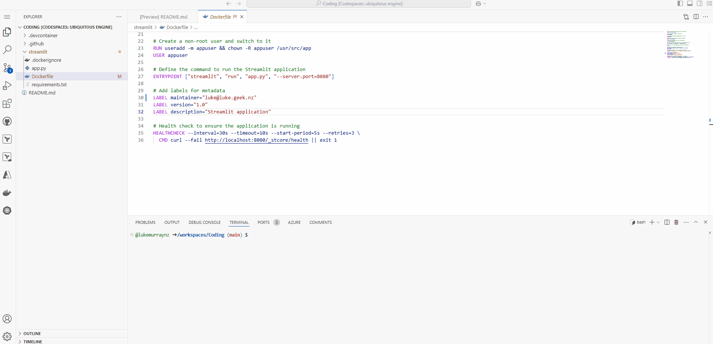
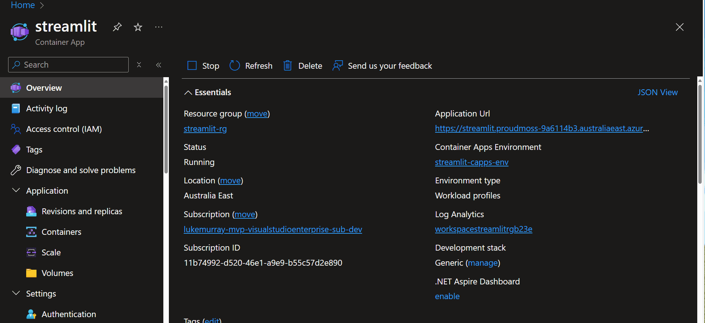

[Streamlit](https://streamlit.io/) is an excellent tool for creating interactive web applications with Python. 

In this post, we will deploy a Streamlit application to [Azure Container Apps](https://learn.microsoft.com/azure/container-apps/overview?WT.mc_id=AZ-MVP-5004796). [Azure Container Apps](https://learn.microsoft.com/azure/container-apps/overview?WT.mc_id=AZ-MVP-5004796) is a fully managed serverless container service that allows you to run your containerized applications without having to manage the underlying infrastructure.

<!--truncate-->

:::note
For this article, you have access to an Azure subscription and have permission to deploy resources. If you don't have an Azure subscription, you can create a [free account](https://azure.microsoft.com/pricing/purchase-options/azure-account?icid=azurefreeaccount&WT.mc_id=AZ-MVP-5004796) in just a couple of minutes.
:::

Today, we are going to take a base Streamlit example application, and deploy it to Azure Container Apps.

:::info
I will be using a GitHub Codespace; feel free to reference my public repository template: [lukemurraynz/Codespace_IaC_Coding](https://github.com/lukemurraynz/Codespace_IaC_Coding) as a Codespace template.
:::


Let us start off with the Streamlit application.

```python title="streamlit_app.py"
import altair as alt
import numpy as np
import pandas as pd
import streamlit as st

"""
# Welcome to Streamlit!

Edit `/streamlit_app.py` to customize this app to your heart's desire :heart:.
If you have any questions, check out our [documentation](https://docs.streamlit.io) and [community
forums](https://discuss.streamlit.io).

In the meantime, below is an example of what you can do with just a few lines of code:
"""

num_points = st.slider("Number of points in spiral", 1, 10000, 1100)
num_turns = st.slider("Number of turns in spiral", 1, 300, 31)

indices = np.linspace(0, 1, num_points)
theta = 2 * np.pi * num_turns * indices
radius = indices

x = radius * np.cos(theta)
y = radius * np.sin(theta)

df = pd.DataFrame({
    "x": x,
    "y": y,
    "idx": indices,
    "rand": np.random.randn(num_points),
})

st.altair_chart(alt.Chart(df, height=700, width=700)
    .mark_point(filled=True)
    .encode(
        x=alt.X("x", axis=None),
        y=alt.Y("y", axis=None),
        color=alt.Color("idx", legend=None, scale=alt.Scale()),
        size=alt.Size("rand", legend=None, scale=alt.Scale(range=[1, 150])),
    ))

```

The next step is to create a `requirements.txt` file specifying the Streamlit application's dependencies. This will be used to install the Python dependencies for the image.

```plaintext title="requirements.txt"
altair
pandas
streamlit
```
Now that we have our Streamlit application, we need to create a Dockerfile to containerize the application. In this example, we use the official Python image from the Docker Hub as the base image. We then copy the application code into the container, install the dependencies, and define the command to run the Streamlit application using port 8080 _(the default port for Streamlit is 8501, but we are using 8080 for this example as a common port)_.

```Dockerfile title="Dockerfile"
# Use the official Python image from the Docker Hub
FROM python:3.12.7-slim

# Set environment variable for the port
ENV PORT=8080

# Expose the port that the application will run on
EXPOSE 8080

# Set the working directory inside the container
WORKDIR /usr/src/app

# Copy the requirements file into the container
COPY requirements.txt ./

# Install the dependencies specified in the requirements file
RUN pip install --no-cache-dir -r requirements.txt

# Copy the rest of the application code into the container
COPY . .

# Create a non-root user and switch to it
RUN useradd -m appuser && chown -R appuser /usr/src/app
USER appuser

# Define the command to run the Streamlit application
ENTRYPOINT ["streamlit", "run", "app.py", "--server.port=8080"]

# Add labels for metadata
LABEL maintainer="luke@luke.geke.nz"
LABEL version="1.0"
LABEL description="Streamlit application"

# Health check to ensure the application is running
HEALTHCHECK --interval=30s --timeout=10s --start-period=5s --retries=3 \
  CMD curl --fail http://localhost:8080/_stcore/health || exit 1
```

:::tip
[Draft](https://github.com/Azure/draft) is an open-source project that streamlines Kubernetes development. It takes a non-containerized application and generates the DockerFiles, Kubernetes manifests, Helm charts, Kustomize configurations, and other artifacts associated the application. The Azure Kubernetes Service _(AKS)_ DevX extension for Visual Studio Code enhances non-cluster experiences, allowing you to create deployment files to deploy your applications to AKS. Draft is the available feature included in the DevX extension.

I used Draft, and the DevX extension was used to draft the first version of the streamlet dockerfile.

Reference: [Use Draft and the DevX extension for Visual Studio Code with Azure Kubernetes Service (AKS)](https://learn.microsoft.com/azure/aks/draft-devx-extension-aks?WT.mc_id=AZ-MVP-5004796)
:::

To build this image, I will use Docker on a GitHub Codespace to build the image locally and test it. Once confirmed, we can push it to an Azure Container Registry, which can then be used to deploy the image to Azure Container Apps.

We can easily test and build the image locally in a Codespace using the [Docker extension](https://code.visualstudio.com/docs/containers/overview?WT.mc_id=AZ-MVP-5004796) in Visual Studio Code.



Now that we have tested the image locally, we can push it to an Azure Container Registry. 

:::info
You can also refer to a previous article [Push Docker Images to Azure Container Registry with GitHub Codespaces](https://luke.geek.nz/azure/push-docker-images-to-acr-using-github-codespaces/) for more information on how to push the image to an Azure Container Registry using the command line from the public dockerhub registry.
:::

To push the image, we are going to use the docker extension again to do the push and tag to the [Azure Container Registry](https://learn.microsoft.com/azure/container-registry/container-registry-intro?WT.mc_id=AZ-MVP-5004796).


Now that we have the image in the Azure Container Registry, we can deploy the image to Azure Container Apps.

To deploy the image to Azure Container Apps, we will to create a new Azure Container Apps resource in the Azure Portal and enable public ingress on port 8080, using a Microsoft managed network.


One of the best features of Azure Container Apps is the ability to scale the application to zero, so we can set up a Scale rule to scale _(replicas)_ the Container App down to 0 when not in use.


