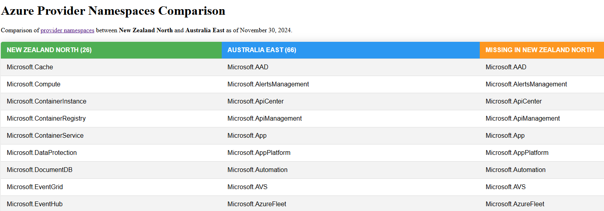

With the release of the [New Zealand North](https://datacenters.microsoft.com/globe/explore?info=region_newzealandnorth) Azure Region on the horizon, I wanted a way to measure what capabilities can be deployed in the new region, particularly in comparison to Australia East.

To do so, I wrote a script that uses the Azure CLI to query the [provider namespaces](https://learn.microsoft.com/en-us/azure/azure-resource-manager/management/azure-services-resource-providers?WT.mc_id=AZ-MVP-5004796) of each region and compare them side by side, and output the results into a HTML table.



<!--truncate-->

There is bound to be differences between the regions, especially when Strategic Services, such as Azure OpenAI _(Cognitive Services)_ is involved, especially for such a new region, especially at the time of writing when its possible not all Foundational and Mainstream services, have been deployed.

:::warning
Using the Providers is not a full-proof way of comparing the regions, however for my purposes it largely helps to identify the capabilities especially when compared to the [Azure services table](https://learn.microsoft.com/en-us/azure/azure-resource-manager/management/azure-services-resource-providers?WT.mc_id=AZ-MVP-5004796). Its also worth mentioning, that this comparison won't touch on some services or capabilities, that may be may have preview capabilities delivered to specific regions as a sub feature of that namespace.
:::

The PowerShell script can be found below:

```powershell
# Get the current date in an easy-to-read format
$currentDate = Get-Date -Format "MMMM dd, yyyy"

# Generate the HTML report with the date in the title
function Generate-HTMLReport {
    param (
        [array]$comparisonTable,
        [string]$location1,
        [string]$location2
    )

    $html = @"
<!DOCTYPE html>
<html>
<head>
    <title>Azure Provider Namespaces Comparison - $currentDate</title>
    <style>
        table { 
            width: 100%; 
            border-collapse: collapse; 
            font-family: Arial, sans-serif; 
            margin: 20px 0; 
            border-radius: 5px 5px 0 0; 
            overflow: hidden; 
            box-shadow: 0 0 20px rgba(0, 0, 0, 0.15); 
        }
        th, td { 
            padding: 12px 15px; 
            text-align: left; 
        }
        th { 
            text-transform: uppercase; 
            font-weight: bold; 
        }
        th:nth-child(1) { 
            background-color: #4CAF50; 
            color: white; 
        }
        th:nth-child(2) { 
            background-color: #2196F3; 
            color: white; 
        }
        th:nth-child(3) { 
            background-color: #FF9800; 
            color: white; 
        }
        tr { 
            border-bottom: 1px solid #dddddd; 
        }
        tr:nth-child(even) { 
            background-color: #f3f3f3; 
        }
        tr:last-child { 
            border-bottom: 2px solid #009879; 
        }
        tr:hover { 
            background-color: #f1f1f1; 
        }
    </style>
</head>
<body>
    <h1>Azure Provider Namespaces Comparison</h1>
    <p>Comparison of <a href="https://learn.microsoft.com/en-us/azure/azure-resource-manager/management/azure-services-resource-providers?WT.mc_id=AZ-MVP-5004796">provider namespaces</a> between <strong>$location1</strong> and <strong>$location2</strong> as of $currentDate.</p>
    <table>
        <tr>
            <th>$location1</th>
            <th>$location2</th>
            <th>Missing in $location1</th>
        </tr>
"@

    foreach ($row in $comparisonTable) {
        $html += "<tr>"
        $html += "<td>$($row."$location1 ($($providerNamespaces1.Count))")</td>"
        $html += "<td>$($row."$location2 ($($providerNamespaces2.Count))")</td>"
        $html += "<td>$($row."Missing in $location1")</td>"
        $html += "</tr>"
    }

    $html += @"
    </table>
    <h2>Service Categories</h2>
    <ul>
        <li><strong><a href="https://learn.microsoft.com/azure/reliability/availability-service-by-category?WT.mc_id=AZ-MVP-5004796#available-services-by-region-category">Foundational</a></strong>: Available in all recommended and alternate regions when the region is generally available, or within 90 days of a new foundational service becoming generally available.</li>
        <li><strong><a href="https://learn.microsoft.com/azure/reliability/availability-service-by-category?WT.mc_id=AZ-MVP-5004796#available-services-by-region-category">Mainstream</a></strong>: Available in all recommended regions within 90 days of the region general availability. Demand-driven in alternate regions, and many are already deployed into a large subset of alternate regions.</li>
        <li><strong><a href="https://learn.microsoft.com/azure/reliability/availability-service-by-category?WT.mc_id=AZ-MVP-5004796#strategic-services">Strategic</a></strong>: Targeted service offerings, often industry-focused or backed by customized hardware. Demand-driven availability across regions.</li>
    </ul>
    <p>Note: The rollout schedule for services may vary based on their category and region, with Foundational Services being prioritized for early adoption, followed by Mainstream services (+90 days after GA), and finally Strategic services as demand requirements. Make sure you let your Microsoft account team know if a Strategic Service is required in your region.</p>
</body>
</html>
"@

    return $html
}

# Main script execution
try {
    Write-Host "Fetching provider namespaces for $location1 and $location2 ..." -ForegroundColor Green

    $providerNamespaces1 = Get-ProviderNamespaces -location $location1
    $providerNamespaces2 = Get-ProviderNamespaces -location $location2

    $comparisonTable = Create-ComparisonTable -providerNamespaces1 $providerNamespaces1 -providerNamespaces2 $providerNamespaces2

    Write-Host "Generating HTML report..." -ForegroundColor Green
    $htmlReport = Generate-HTMLReport -comparisonTable $comparisonTable -location1 $location1 -location2 $location2

    $reportPath = "AzureProviderComparisonReport.html"
    $htmlReport | Out-File -FilePath $reportPath

    Write-Host "HTML report generated at $reportPath" -ForegroundColor Green
}
catch {
    Write-Error "An error occurred: $_"
}
```

It will output a HTML report in the directory thats its ran from _(make sure you are authenticated to Azure first and have the [Az PowerShell](https://learn.microsoft.com/powershell/azure/new-azureps-module-az?view=azps-13.0.0&WT.mc_id=AZ-MVP-5004796) modules installed)_:


