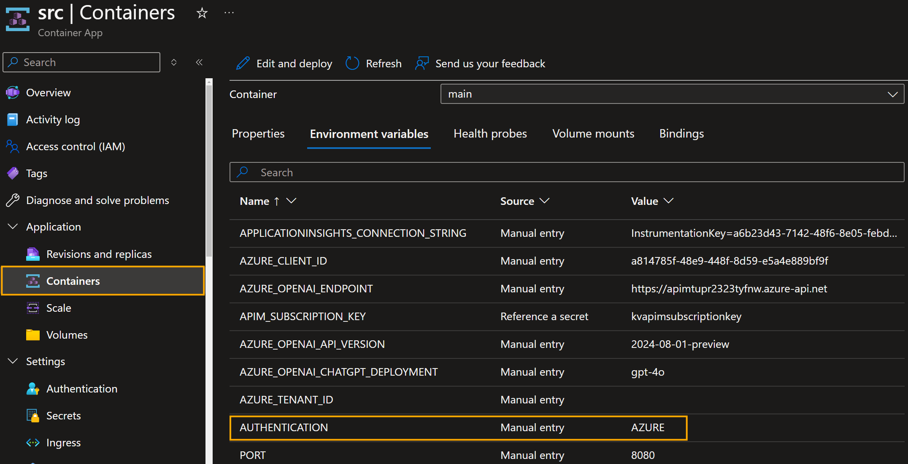

When developing a Python application that interacts with [Azure OpenAI](https://learn.microsoft.com/azure/ai-services/openai/overview?WT.mc_id=AZ-MVP-5004796), you may want to authenticate with an API key for testing, however in Production, you should use Managed Identities within Microsoft Azure.

In this article, we will look at how to authenticate with [Azure OpenAI](https://learn.microsoft.com/azure/ai-services/openai/overview?WT.mc_id=AZ-MVP-5004796) using an API key in Python for local development, then using an environment variable switch to authenticating using [managed Identities](https://learn.microsoft.com/entra/identity/managed-identities-azure-resources/overview?WT.mc_id=AZ-MVP-5004796).

<!--truncate-->

The true hero for Azure authentication is the [DefaultAzureCredential](https://learn.microsoft.com/python/api/azure-identity/azure.identity.defaultazurecredential?view=azure-python&WT.mc_id=AZ-MVP-5004796) class from the Azure Identity library. This class can authenticate with Azure services using various methods, including Managed Identity, Shared Token Cache, and environment variables.


:::info
This code snippet demonstrates how to load and validate environment variables needed to connect to Azure OpenAI services. Here's a step-by-step breakdown:

1. **Load Environment Variables**: The code first attempts to load environment variables from the operating system. If any of the required variables are missing, it then tries to load them from a `.env` file named `azureopenai.env`.

2. **Check for Missing Variables**: This function defines a list of required environment variables and checks for missing ones. If any required variables are not found, an error indicates which variables are missing.

3. **Authentication Setup**: The code checks if the `AUTHENTICATION` environment variable is set to `AZURE`. If it is, it uses Azure's DefaultAzureCredential to get a bearer token for authentication. Otherwise, it uses an API key.

4. **Initialize AzureOpenAI Client**: Finally, it initializes the `AzureOpenAI` client with the appropriate authentication method (either bearer token or API key) and the necessary API version and endpoint.
:::


The Python code is as follows:

```python
from azure.identity import DefaultAzureCredential, get_bearer_token_provider
# Load environment variables from OS and .env file
ENV = {var: os.getenv(var) for var in ["AZURE_OPENAI_ENDPOINT", "AZURE_OPENAI_KEY", "AZURE_OPENAI_API_VERSION", "AZURE_OPENAI_CHATGPT_DEPLOYMENT"]}
if any(value is None for value in ENV.values()):
    ENV.update({k: v for k, v in dotenv.dotenv_values("azureopenai.env").items() if k not in ENV or ENV[k] is None})

required_env_vars = ["AZURE_OPENAI_ENDPOINT", "AZURE_OPENAI_KEY", "AZURE_OPENAI_API_VERSION", "AZURE_OPENAI_CHATGPT_DEPLOYMENT"]
missing_vars = [var for var in required_env_vars if not ENV.get(var)]
if missing_vars:
    raise KeyError(f"Missing required environment variables: {', '.join(missing_vars)}")

# Check if the Authentication environment variable is set to Azure
if os.getenv("AUTHENTICATION") == "AZURE":
    token_provider = get_bearer_token_provider(DefaultAzureCredential(), "https://cognitiveservices.azure.com/.default")
    client = AzureOpenAI(
        api_version=ENV["AZURE_OPENAI_API_VERSION"],
        azure_endpoint=ENV["AZURE_OPENAI_ENDPOINT"],
        azure_ad_token_provider=token_provider
    )
else:
    client = AzureOpenAI(
        api_version=ENV["AZURE_OPENAI_API_VERSION"],
        azure_endpoint=ENV["AZURE_OPENAI_ENDPOINT"],
        api_key=ENV["AZURE_OPENAI_KEY"]
    )
```

:::tip
This is assuming you are using the System Managed identity; however, if you want to run with a User Assigned Managed identity. Make sure you have an environment variable of **AZURE_CLIENT_ID** to the value of the CLIENT ID of the User Assigned managed identity.
:::

When deployed to an [Azure Container Apps](https://learn.microsoft.com/azure/container-apps/overview?WT.mc_id=AZ-MVP-5004796) environment, I have set the operating system environment variables set to use Managed Identities. This is done by setting the `AUTHENTICATION` environment variable to `AZURE` and using the [DefaultAzureCredential](https://learn.microsoft.com/en-us/python/api/azure-identity/azure.identity.defaultazurecredential?view=azure-python&WT.mc_id=AZ-MVP-5004796) class to authenticate with Azure services.


