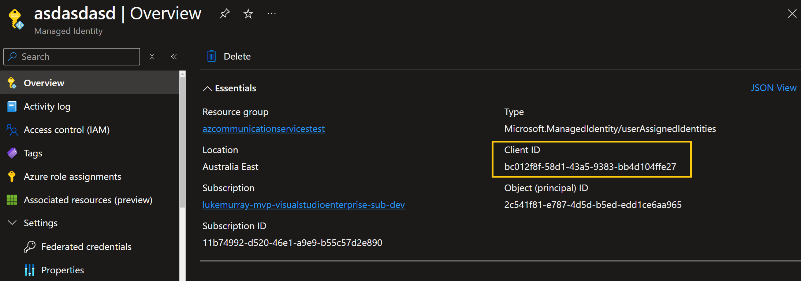

[Azure Communication Services](https://azure.microsoft.com/products/communication-services?WT.mc_id=AZ-MVP-5004796) brings rich communication APIs to all of your apps across any device on any platform, using the same reliable and secure infrastructure that powers Microsoft Teams.

Today, we will explore using Email as part of Azure Communication Services, using the REST API and PowerShell to send an email using a User Assigned Managed Identity.


{/* truncate */}

:::info
I did a previous article: [Deploying and Testing Azure Email Communication Services](https://luke.geek.nz/azure/using-communication-services-and-powershell-to-send-emails/) on this, however the authentication was using an Azure Service Principal. A reader reached out to me about using a User Assigned Managed identity, so I have tested and updated the script to use a User Assigned Managed Identity.
:::

In this example, I will access a token from [Azure Communication Services](https://azure.microsoft.com/products/communication-services?WT.mc_id=AZ-MVP-5004796). I will make a GET request to the identity endpoint of Azure Communication Services, using the oauth identity from the user assigned-managed identity. This will return a token we can use to authenticate against the REST API.

You will need the ClientId of the User Assigned Managed Identity, and that ClientId needs to have Contributor rights to the Azure Communication Service _(not Email or Domain service)_.



Here's a step-by-step explanation of the script:

The script accepts several parameters and constructs an email message in HTML format. It then authenticates using Azure Managed Identity to obtain an access token, which is used to authorize the email sending request to Azure Communication Services.

The script defines the following parameters:

* ClientId: The Client ID for User Assigned Managed Identity (optional).
* EmailRecipient: The recipient's email address.
* SenderAddress: The sender's email address.
* ResourceID: The resource ID for Azure Communication Services.
* CommunicationEndpointUrl: The endpoint URL for Azure Communication Services.

1. The script checks if a Client ID is provided. If so, it constructs a URI to obtain an access token using User Assigned Managed Identity. Otherwise, it uses System Assigned Managed Identity.
2. The script then makes a GET request to the identity endpoint to retrieve the access token.
3. The script constructs the URI for the email sending endpoint and defines the headers, including the access token.
4. A function Send-Email is defined to send the email using the Invoke-RestMethod cmdlet.
5. The email content and recipient details are defined in a hashtable, which is passed to the Send-Email function.

_(This authenticaiton was inititally written to be used in a Azure Automation Runbook, with the User Managed Identity assigned Contributor rights to the Azure Communication Services resource (not the Email Communication Services).)_

Here is the PowerShell script to send an email using Azure Communication Services using the [User Managed identity](https://learn.microsoft.com/entra/identity/managed-identities-azure-resources/overview?WT.mc_id=AZ-MVP-5004796) of an [Azure Automation account](https://learn.microsoft.com/azure/automation/overview?WT.mc_id=AZ-MVP-5004796):

```powershell
param (
    [Parameter(Mandatory=$false)]
    [string]$ClientId = 'bc012f8f-58d1-43a5-9383-bb4d104ffe27',
    
    [Parameter(Mandatory=$false)]
    [string]$EmailRecipient = "example@example.com",
    
    [Parameter(Mandatory=$false)]
    [string]$SenderAddress = 'DoNotReply@af595a23-f54a-4cdc-bffa-fa3ef54eb1c1.azurecomm.net',
    
    [Parameter(Mandatory=$false)]
    [string]$ResourceID = 'https://communication.azure.com',
    
    [Parameter(Mandatory=$false)]
    [string]$CommunicationEndpointUrl = "commserviceslukeuserassignedtest.australia.communication.azure.com"
)

$emailSubject = "Important: Server Maintenance Notification"
$emailBody = @"
<html>
<body>
<p>Dear User,</p>
<p>This is to inform you that a <b><i>server maintenance is scheduled for the next week</i></b>.</p>
<p>The servers will be down from 10:00 PM to 2:00 AM.</p>
<p>Please save your work and log off during this period to avoid any data loss.</p>
<p>If you have any questions or concerns, please contact our IT Support team.</p>
<p>Thank you for your understanding and cooperation.</p>
<p>Best Regards,</p>
<p>IT Support Team</p>
</body>
</html>
"@

if ($emailBody -ne "") {
    Write-Output "Email body is not empty. Proceeding with email sending process."

    if ($ClientId) {
        Write-Output "Client ID: $ClientId exists. Using User Assigned Managed Identity..."
        $Uri = "$($env:IDENTITY_ENDPOINT)?api-version=2018-02-01&resource=$ResourceID&client_id=$ClientId"
    } else {
        Write-Output "Client ID: $ClientId does not exist. Using System Assigned Managed Identity..."
        $Uri = "$($env:IDENTITY_ENDPOINT)?api-version=2018-02-01&resource=$ResourceID"
    }

    # Function to get access token
    try {
        # Invoke a GET request to the identity endpoint to get the access token
        $AzToken = Invoke-WebRequest -Uri $Uri -Method GET -Headers @{ Metadata = "true" } -UseBasicParsing | Select-Object -ExpandProperty Content | ConvertFrom-Json | Select-Object -ExpandProperty access_token
        # Print the obtained access token
        Write-Output "Access Token: $AzToken"
    }
    catch {
        # If there's an error, print the error message and response details
        Write-Error "Failed to get access token: $_"
        Write-Output "Response Status Code: $($_.Exception.Response.StatusCode.Value__)"
        Write-Output "Response Status Description: $($_.Exception.Response.StatusDescription)"
        Write-Output "Response Content: $($_.Exception.Response.GetResponseStream() | %{ $_.ReadToEnd() })"
        return
    }

    # Construct the URI for the email sending endpoint
    $uri = "https://$CommunicationEndpointUrl/emails:send?api-version=2023-03-31"

    # Define the headers for the REST API call
    # Include the content type and the obtained access token in the Authorization header
    $headers = @{
        "Content-Type"  = "application/json"
        "Authorization" = "Bearer $AzToken"
    }

    # Function to send email
    function Send-Email {
        param (
            [string]$Uri,
            [hashtable]$Headers,
            [hashtable]$Body
        )
        try {
            Write-Output "Sending email..."
            Write-Output "URI: $Uri"
                Write-Output "Headers: $(ConvertTo-Json $Headers -Depth 10)"
            Write-Output "Body: $(ConvertTo-Json $Body -Depth 10)"
            $response = Invoke-RestMethod -Uri $Uri -Method Post -Headers $Headers -Body ($Body | ConvertTo-Json -Depth 10) -UseBasicParsing
            Write-Output "Email sent successfully. Response: $response"
            return $response
        }
        catch {
            Write-Error "Failed to send email: $_"
            Write-Output "Exception Message: $($_.Exception.Message)"
            Write-Output "Exception StackTrace: $($_.Exception.StackTrace)"
            throw
        }
    }

    $apiResponse = @{
        headers = @{
            id = (New-Guid).Guid
        }
        senderAddress = $SenderAddress
        content = @{
            subject = $emailSubject
            html    = $emailBody
        }
        recipients = @{
            to = @(
                @{
                    address     = $EmailRecipient
                    displayName = $EmailRecipient
                }
            )
        }
        replyTo = @(
            @{
                address     = "example@contoso.com"
                displayName = "Contoso"
            }
        )
        userEngagementTrackingDisabled = $true
    }

    Send-Email -Uri $uri -Headers $headers -Body $apiResponse

}
```

You can run this script in an Azure Automation Runbook _(and theoretically in an [Azure Function](https://learn.microsoft.com/azure/azure-functions/functions-overview?pivots=programming-language-csharp&WT.mc_id=AZ-MVP-5004796) as well)_ to send an email using Azure Communication Services with a User Assigned Managed Identity.
