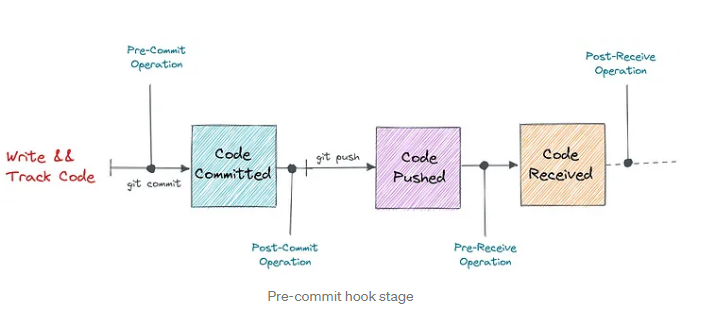
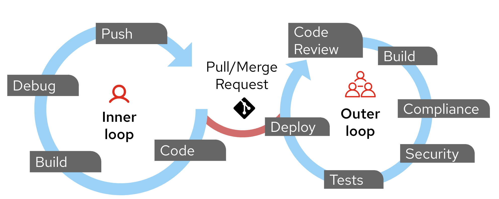

Pre-commit hooks are automated scripts or checks running before developers commit code to a repository. They are particularly useful in the context of infrastructure, such as code _(IaC)_ development, when working with Terraform. 

These hooks serve as an early defense against common issues, ensuring code quality and consistency before changes are committed to version control.

Today, we are going to discuss precommit with GitHub Codespaces.

{/* truncate */}

:::info
[Pre-commit hooks](https://pre-commit.com/) offer several advantages in the IaC development lifecycle:

* Early Error Detection: They catch syntax errors, formatting issues, and potential security vulnerabilities before code is committed.
* Consistency: Hooks enforces coding standards and best practices across the development team.
* Time-saving: By automating routine checks, pre-commit hooks reduce the need for manual review and minimize the likelihood of failed CI/CD pipelines.
* Security: They can identify potential security risks in infrastructure code early in the development process.



_(Image from [AKS DevSecOps Workshop](https://azure.github.io/AKS-DevSecOps-Workshop/))_

Pre-commits work well in the Inner Loop of the Developer/Cloud Engineer workflow _(for the duration of this article when I use the word developer, I am meaning anyone who writes IaC code)_. They can be lightweight and run quickly, providing immediate feedback to developers as they work on their code. This feedback loop helps developers address issues early, leading to higher-quality code and faster development cycles, before the code hits any peer review or remote code source system (such as DevOps or GitHub repositories)_.


:::

:::warning
While pre-commit hooks can be valuable tools for maintaining code quality, there are several concerns and potential drawbacks to be aware of when implementing them. The use of GitHub Codespaces can help with some of the drawbacks, especially around consistency and setup, however consider the tradeoffs of what pre-commit hooks you want and how they may impact your development workflow.

Some potential drawbacks include:

* Pre-commit hooks can significantly slow down the development process, especially if they run extensive checks or tests
* Frequent, time-consuming checks can break a developer's focus and impede productivity
* Overly restrictive pre-commit hooks may be seen as a lack of trust in developers' abilities and judgment
* Strict pre-commit checks might discourage developers from experimenting or pushing work-in-progress code to their branches
* Developers might be tempted to bypass hooks using git commit flags, defeating the purpose of the checks

There's a delicate balance between comprehensive checks and maintaining a fast, frictionless commit process. Not all checks need to be in pre-commit hooks; some can be deferred to CI/CD pipelines or pre-push hooks, and because of the individual nature of having the pre-commit setup for each developer and the developer able to force the commit _(ignoring the pre-commit checks)_ it is important to have a good culture around the use of pre-commit hooks, and any important checks need to be implemented in a CI/CD pipeline, for consistency.
:::

So, let us get started with setting up pre-commit hooks in GitHub Codespaces. The same premise can also be applied outside of a Codespace, but for this article, we will focus on a Codespace.

The guts of this is the [pre-commit framework](https://pre-commit.com/), a Python package that manages pre-commit hooks for you. It is a framework for managing and maintaining multi-language pre-commit hooks. The pre-commit hooks are run against the files that are staged for commit, and if any of the hooks fail, the commit is rejected.

> Git hook scripts are useful for identifying simple issues before submission to code review. We run our hooks on every commit to automatically point out issues in code, such as missing semicolons, trailing whitespace, and debug statements. Pointing these issues out before code review allows a code reviewer to focus on the architecture of a change while not wasting time with trivial style nitpicks.

For the Codespace, we will add the pre-commit framework to the Codespace, then add a script to initialize the pre-commit hooks, then configure the pre-commit hooks to run the checks we want.

Let's add the pre-commit framework to the Codespace devcontainer.json.

```json
"features": {
 //Add pre-commit
    "ghcr.io/prulloac/devcontainer-features/pre-commit:1.0.3": {},
    },
```

Once added, we need to add a postCreateCommand to initialize the pre-commit framework, like so:

```json
"postCreateCommand": "pre-commit install",
```

This will run after the GitHub Codespace has been created and running.

So, an example for our Terraform IaC would look like this:

```json title=".devcontainer/devcontainer.json"
  // "features" section allows adding and configuring predefined features or tools in the development container.
  "features": {
    // Adds and configures the Azure CLI with Bicep and Python installation options.
    "ghcr.io/devcontainers/features/azure-cli:latest": {
      "installBicep": false, //  Bicep installation.
      "installUsingPython": true, // Installs using Python.
      "version": "latest" // Specifies the version of the Azure CLI to install.
    },
    // Adds PowerShell to the container.
    "ghcr.io/devcontainers/features/powershell:latest": {
      "version": "latest" // Specifies the version of PowerShell to install.
    },
     //Add pre-commit
    "ghcr.io/prulloac/devcontainer-features/pre-commit:1.0.3": {},
    // Adds and configures Terraform with specific version, TFLint, and Terragrunt.
    "ghcr.io/devcontainers/features/terraform:1": {
      "version": "latest", // Specifies the version of Terraform to install.
      "tflint": "latest", // Specifies the version of TFLint to install.
      "terragrunt": "latest" // Specifies the version of Terragrunt to install.
    }
  },
    "postCreateCommand": "pre-commit install",
  ```

  :::tip
  You can view a version of the devcontainer.json file [here](https://github.com/lukemurraynz/Codespace_IaC_Coding/blob/main/.devcontainer/devcontainer.json). My [lmurraynz/Codespace_IaC_Coding](https://github.com/lukemurraynz/Codespace_IaC_Coding) repository has a devcontainer.json file that has the pre-commit framework added in. The intention is that you can take this repository as a template and then modify and remove it as you need to.
  ::: 

  Once the Codespace has been created, you can then add a .pre-commit-config.yaml file to the root of your repository. This file will contain the configuration for the pre-commit hooks you want to run.

  An example of a .pre-commit-config.yaml file for Terraform would look like this:

  ```yaml title=".pre-commit-config.yaml"
  default_stages: [pre-commit]
repos:
  - repo: https://github.com/pre-commit/pre-commit-hooks
    rev: v5.0.0
    hooks:
    - id: trailing-whitespace
    - id: end-of-file-fixer
    - id: check-yaml
    - id: check-added-large-files
    - id: check-case-conflict
    - id: check-merge-conflict
  - repo: https://github.com/antonbabenko/pre-commit-terraform
    rev: v1.96.3
    hooks:
      - id: terraform_fmt
        args:
        - --args=-recursive
        exclude: '.*/\.terragrunt-cache'
      - id: terraform_validate
      - id: terraform_tflint
      - id: terraform_trivy
      - id: terraform_docs
        args:
         - --hook-config=--add-to-existing-file=true     # Boolean. true or false
         - --hook-config=--create-file-if-not-exist=true # Boolean. true or false
         - --args=--output-mode=replace
      - id: tfupdate
        name: Autoupdate Terraform versions
        args:
         - --args=provider azurerm # Will be pined to latest version
  - repo: https://github.com/bridgecrewio/checkov.git
    rev: '3.2.346' # change to tag or sha
    hooks:
    - id: checkov
      verbose: true
      args: ['--quiet', '--compact', '--soft-fail']
  ```

Here's a breakdown of what each part does:

1. **`default_stages: [pre-commit]`**: Specifies that the hooks should run at the `pre-commit` stage.

2. **`repos`**: Lists repositories containing pre-commit hooks to be used.

3. **First repository** (`https://github.com/pre-commit/pre-commit-hooks`):
   - **`rev: v5.0.0`**: Specifies the version of the repository.
   - **`hooks`**: Lists the hooks to be used from this repository:
     - `trailing-whitespace`: Removes trailing whitespace.
     - `end-of-file-fixer`: Ensures files end with a newline.
     - `check-yaml`: Checks YAML files for syntax errors.
     - `check-added-large-files`: Prevents large files from being added.
     - `check-case-conflict`: Checks for case conflicts in filenames.
     - `check-merge-conflict`: Checks for unresolved merge conflicts.

4. **Second repository** (`https://github.com/antonbabenko/pre-commit-terraform`):
   - **`rev: v1.96.3`**: Specifies the version of the repository.
   - **`hooks`**: Lists the hooks to be used from this repository:
     - `terraform_fmt`: Formats Terraform files.
       - `args`: Specifies arguments for the hook.
       - `exclude`: Excludes certain files from the hook.
     - `terraform_validate`: Validates Terraform files.
     - `terraform_tflint`: Lints Terraform files.
     - `terraform_trivy`: Scans Terraform files for vulnerabilities.
     - `terraform_docs`: Generates documentation for Terraform files.
       - `args`: Specifies arguments for the hook.
     - `tfupdate`: Updates Terraform provider versions.
       - `name`: Provides a name for the hook.
       - `args`: Specifies arguments for the hook.

5. **Third repository** (`https://github.com/bridgecrewio/checkov.git`):
   - **`rev: '3.2.346'`**: Specifies the version of the repository.
   - **`hooks`**: Lists the hooks to be used from this repository:
     - `checkov`: Runs Checkov to scan for security issues in infrastructure as code.
       - `verbose`: Enables verbose output.
       - `args`: Specifies arguments for the hook.

This configuration ensures that various checks and fixes are automatically applied to the codebase before commits are made, helping to maintain code quality and security.

So, let's spin up our Codespace and see the pre-commit hooks in action.

The first time you run this, it will take a while as it will download the pre-commit hooks and install them. Be mindful of this if you are running this in a new Codespace environment.


As you can see from the pre-commit output, I am missing some dependencies installed, i.e., Terraform docs, but we can see Terraform format ran, the trailing whitespace check ran and fixed the issue, and tflint ran and came back with some issues, such as missing provider versions, and checkov ran a security check, which came back with some failed checks, such as Public access enabled and latest TLS version not set.

Hopefully, you can see the power of the pre-commit, and as these failed, nothing was committed to the repository, so I can fix these issues before I commit the code.

:::info
If needed, we can skip the pre-commit checks and force-push the changes through with the following command:

git push --no-verify

This will bypass the pre-commit checks and force the commit through. There is a [Visual Studio Code extension - Git push(no verify)
](https://marketplace.visualstudio.com/items?itemName=DevEscalus.git-push-no-verify) as well, which adds a noverify button to the commit dialog, so you can bypass the pre-commit checks if needed.
:::

Hopefully, this will give you a great starting block for adding pre-commit hooks to your Codespace and workflow and help with secure and reliable IaC development. You can find a list of common prehooks here: [featured hooks
](https://pre-commit.com/hooks.html), and if your game - you can create your own and find other hooks people have created - such as this Azure Bicep [Azure4DevOps/check-azure-bicep](https://github.com/Azure4DevOps/check-azure-bicep) one.

:::tip
You can run  `pre-commit autoupdate` to update all the pre-commit hook versions. For example, when I ran it, I got:

* [https://github.com/bridgecrewio/checkov.git] updating 3.2.346 -> 3.2.350

Which updated my `.pre-commit-config.yaml` file with the latest version without having to go and check each one manually.
:::
