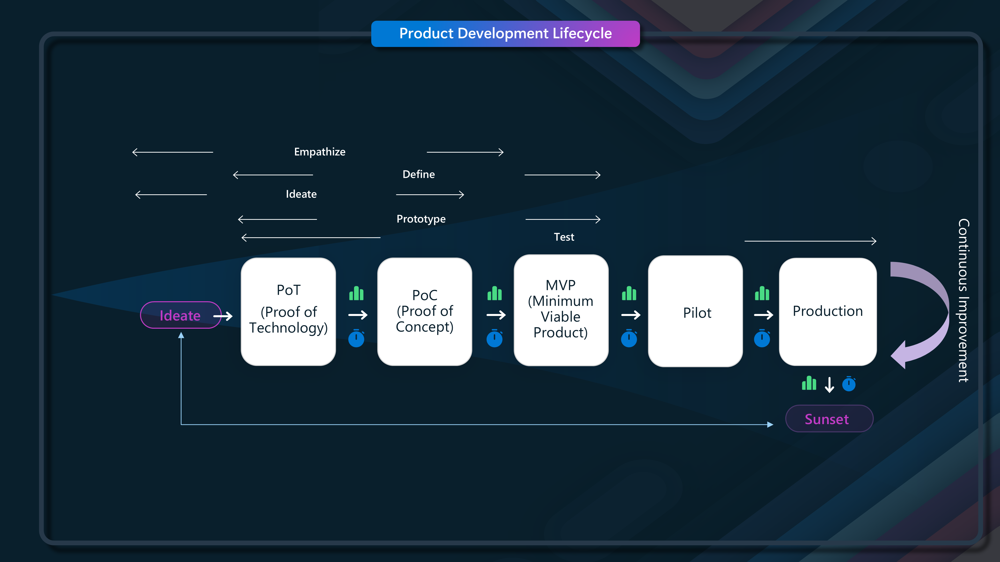
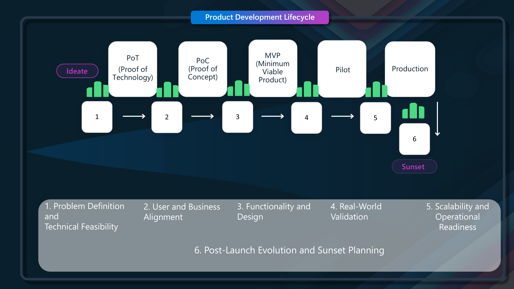

PoC, PoT, Prototype, MVP, Pilot - what do they all mean? What is the difference between them and when should you use them?

# 🚀 Introduction

Today, we are going to take a look at a technical Cloud Product Development Lifecycle - in my eyes, understanding these terminologies are key to determing:

* What kind of resources _(ie both technological and human)_ do you need to dedicate to a product? 
* Where to align lifecycle managemement to your application or service?
* How likelihood is the product to make it a good market fit, or solve an issue?
* Keep your product lean, to avoid wasting the wrong resources at the wrong time
* Shift to a product based mindset
* Focus on innovation, and early feedback loops

And of course - what to expect when people start using these words, often thrown together in a conversation, and sometimes even put in writing in Statement of Works and Requests for Proposals.

{/* truncate */}

# 🎨 Design Thinking and Agile

Using Design Thinking - _(Empathize, Define, Ideate, Prototype, Test, Implement)_ as a base - a Product needs to align with actual customer needs, its an ilterative process, as a Product or service itself isn't static. We live in a VUCA (Volatile, Uncertain, Complexity, Ambiguity) world, where customers expect more from their technology _(as they should)_ to help empower their own needs, in a secure and reliable manner.

Agile is about the speed to adapt, not the velocity to deliver, so if we take in Agile delivery, Design thinking methologies, its no surprise that we need to break the product lifecycle into specific stages, to get faster, more immediate feedback and make sure we are concentrating on the right success metrics for our product at the right time.

# 🛠️ Stages of Product Development Lifecycle

If we break down these stages we have:

| **Stage**             | **Description**                                                                                                           | **Benefits**                                                                                                  | **Acceptance Criteria**                                                                                                                                                       | **Resources Needed**                                                                                   | **Where Used**                                                                                           |
|------------------------|---------------------------------------------------------------------------------------------------------------------------|--------------------------------------------------------------------------------------------------------------|--------------------------------------------------------------------------------------------------------------------------------------------------------------------------------|--------------------------------------------------------------------------------------------------------|----------------------------------------------------------------------------------------------------------|
| Ideate                | Generate and prioritize potential solutions for the identified problem based on insights and feasibility.                  | Fosters creativity and provides a clear roadmap for experimentation and development.                         | Clear problem definition, prioritized ideas based on feasibility, impact, and alignment with user needs.                                   | Innovation workshops, user interviews, brainstorming tools, and cross-functional collaboration.          | At the beginning of any product development or improvement process.                                      |
| PoT (Proof of Technology) | Validate the technical feasibility of a specific technology or approach without focusing on user needs or business value. | Establishes whether the technology is feasible and provides initial direction for further exploration.      | Demonstrates core technical capabilities and resolves major uncertainties regarding technology.                                            | Technical experts, test environments, access to research, and innovation workshops.                     | When exploring unproven or novel technologies before deeper investment in development.                  |
| PoC (Proof of Concept) | Proves that the proposed solution can solve a specific problem, aligning technology with business and user needs.         | Validates alignment of the technology with the desired outcomes and de-risks the solution.                   | Demonstrates that the solution addresses the problem effectively under controlled conditions; stakeholder approval is achieved.          | Business analysts, developers, user research teams, and small-scale testing environments.               | Before seeking stakeholder buy-in or funding for further development.                                   |
| MVP (Minimum Viable Product) | The first version of the product with enough functionality to address core user needs and gather feedback.            | Accelerates market entry, reduces time-to-value, and collects feedback to prioritize future improvements.    | Achieves user adoption and gathers metrics on user engagement, satisfaction, and performance.                                             | Development teams, product managers, QA testers, analytics tools, and customer success teams.            | To test market fit, validate assumptions, and inform scaling decisions.                                 |
| Pilot                  | A limited-scale deployment in a controlled environment to test end-to-end viability and gather comprehensive feedback.   | Identifies risks, operational issues, and unforeseen challenges before scaling to production.                | Demonstrates success in a real-world environment; collects data to refine for production readiness.                                        | End users, operational teams, real-world testing environments, customer support, and analytics tools.    | When preparing for scaling and addressing operational risks.                                             |
| Production             | The full-scale deployment of the product with all necessary features, reliability, and support for end users.           | Delivers the finalized solution to users while ensuring scalability, reliability, and operational efficiency. | Meets key performance indicators (KPIs), user satisfaction benchmarks, and operational SLAs (Service Level Agreements).                   | Development, operations, customer support, monitoring tools, and continuous improvement processes.        | For delivering the product to users at scale with ongoing support and updates.                          |
| Continuous Improvement | Ongoing enhancement and optimization of the product based on user feedback, performance metrics, and market needs.       | Ensures the product remains competitive, relevant, and user-friendly over time.                              | Demonstrates improvement in key metrics (e.g., adoption, satisfaction, performance); regular delivery of enhancements with minimal disruptions. | DevOps teams, user research, monitoring tools, and agile sprint cycles for regular updates.              | Post-production phase to address evolving requirements and maintain product excellence.                  |
| Sunset                 | The planned decommissioning or replacement of the product when it no longer provides value or becomes obsolete.          | Frees up resources for other priorities while ensuring users transition smoothly to alternatives.             | Completion of decommissioning plan, including user migration, data archiving, and system shutdown with minimal disruption.                 | Project managers, operations teams, user communication channels, and migration tools.                    | When the product reaches end-of-life, either due to replacement or diminished relevance.                 |

# 📋 Detailed Stage Descriptions

**Ideate**
Generates and prioritizes ideas, ensuring a user-centered approach from the outset. Benefits include a clear focus on feasible and impactful solutions.

**PoT (Proof of Technology)**
Focused on assessing the technical feasibility of a solution, ensuring it is viable for solving the identified problem. Benefits include reducing technical risk early in the process and providing clarity on technological possibilities.

**PoC (Proof of Concept)**
Aligns technical feasibility with business objectives, showing stakeholders how the solution addresses the problem. Benefits include stakeholder buy-in and a clearer understanding of the project’s potential impact.

**MVP (Minimum Viable Product)**
A functional product with core features deployed to early adopters for real-world usage and feedback. Prioritizes speed-to-market and core functionality. Benefits include reduced time-to-market and insights into user needs for prioritizing future features.

**Pilot**
A controlled, real-world deployment of the MVP to test the product’s operational viability in a controlled real-world environment, focusing on end-to-end testing. Benefits include reduced risks and a clearer path to production readiness.

**Production**
The final stage where the product is fully deployed, supported, and scaled for end users. Benefits include delivering business value, achieving scalability, and operational efficiency.

**Continuous Improvement**
Ensures the product evolves based on user feedback and performance metrics. Benefits include staying competitive and maintaining user satisfaction through regular updates.

**Sunset**
A planned retirement phase that ensures a smooth transition for users while freeing up resources for other priorities. Benefits include minimizing disruptions and maintaining organizational focus.

# ❓ Key Questions for Each Stage

One the key reasons to break down the Product Lifecycle, into these stages is to focus on the right needs of your product or service, at the right times, examples of questions you should be asking at each phase are:

| **Stage**             | **Key Questions**                                                                                                         |
|------------------------|--------------------------------------------------------------------------------------------------------------------------|
| PoT (Proof of Technology) | - What unknowns about the technology must be validated?  \n- Are the tools or platforms feasible for this use case?  \n- What are the technical risks, and how can they be mitigated?  \n- Is this the best technology stack for long-term scalability? |
| PoC (Proof of Concept) | - Does the solution align with business goals?  \n- Can it solve the problem in a controlled, small-scale test?  \n- What are the critical assumptions being validated?  \n- How will stakeholders measure success?  \n- What constraints or dependencies could limit progress? |
| Prototype              | - Does the design meet usability and functionality needs?  \n- What feedback can be gathered on the proposed solution?  \n- Are there any technical barriers to implementing the design?  \n- How well does the prototype align with user personas or scenarios? |
| MVP (Minimum Viable Product) | - What core functionality is essential to meet user needs?  \n- Can this be delivered with minimal effort for testing adoption?  \n- How will user feedback be collected and prioritized?  \n- Are the team and infrastructure ready to iterate quickly based on feedback? |
| Pilot                  | - What operational or real-world risks must be addressed before scaling?  \n- How will success in the pilot phase be measured?  \n- Are there additional training or support requirements for users?  \n- How will pilot learnings be incorporated into scaling plans? |
| Production             | - Is the solution robust and scalable?  \n- Are operational processes in place for monitoring, support, and continuous improvement?  \n- What KPIs or metrics indicate product success?  \n- Are end users satisfied with performance and usability?  \n- How will updates or fixes be managed post-launch? |
| Continuous Development | - What feedback from users or metrics indicates areas for improvement?  \n- How can automation enhance development or deployment processes?  \n- Are there new features or updates that align with market trends?  \n- How can emerging technologies be leveraged to improve the product?  \n- Is there a roadmap for ongoing enhancements? |
| Sunset                 | - What is the timeline and plan for decommissioning?  \n- How will users transition to alternatives?  \n- How will data and systems be archived or disposed of?  \n- Are there plans to communicate changes effectively to all stakeholders?  \n- What metrics indicate it is the right time to sunset the product? |

# 🚪 Product Lifecycle Gates

So let us dig a bit deeper into some of the gates to consider when shifting a product through this lifecycle, before you reach the next stage _(for example from MVP to Pilot)_:

1. Problem Definition and Technical Feasibility
(Helps determine if you're at PoT or PoC stage)

What is the primary problem this application/workload/service is trying to solve?
Do we have enough technical understanding to validate whether this can be built?
Are there specific technical risks or uncertainties that need validation before proceeding further?
Is there an existing technology or approach that can achieve the desired outcome, or does this require exploration?
Are stakeholders aligned on the goals of the solution at this stage?

2. User and Business Alignment
(Determines if you're ready for PoC, Prototype, or MVP stages)

Who are the target users or audiences for this application/workload/service?
What are the critical business outcomes or objectives tied to this solution?
Do we have user personas or initial feedback to validate assumptions?
Is there clarity on how this solution will fit into existing business processes or workflows?
Are there measurable KPIs or success criteria defined for the next stage?

3. Functionality and Design
(Helps decide if Prototype or MVP is needed)

Do we have clear requirements and design principles for the application?
What specific features or functionality are critical to test user engagement?
Is the goal to explore design and usability (Prototype) or to deliver something functional for user adoption (MVP)?
How much feedback or iteration is needed to validate user needs or business value?
Are there competing priorities (e.g., time-to-market vs. feature completeness) that influence this stage?

4. Real-World Validation
(Clarifies readiness for Pilot stage)

Has the application/workload/service undergone sufficient technical, functional, and usability testing?
Are there operational risks or challenges that require validation in a controlled environment?
Do we have a defined test group or environment to deploy the solution and gather feedback?
What are the success metrics for the pilot phase (e.g., adoption rate, performance, operational readiness)?
What’s the contingency plan if the pilot reveals significant issues?

5. Scalability and Operational Readiness
(Determines readiness for Production)

Has the solution demonstrated scalability under expected workloads?
Are there any technical, security, or compliance gaps preventing full-scale deployment?
Is the team equipped with monitoring, support, and incident response processes?
What are the ongoing maintenance and operational requirements?
Is there a plan for onboarding users or customers at scale?

6. Post-Launch Evolution and Sunset Planning
(Addresses long-term product lifecycle considerations)

What is the plan for iterating and improving the product post-launch?
How will we track performance, gather feedback, and prioritize enhancements?
Is there a decommissioning or migration plan in case of obsolescence or replacement?
What’s the budget and resource allocation for ongoing updates?
What external factors (e.g., market changes, technology updates) could impact the solution's longevity?

# 📚 Scenarios

Lets take a look at 2 scenarios, where we can see how these stages can be applied. Scenario #1 is the development of a Azure Landing Zone _(yes it doesn't have to be specifically a product - this is a way of thinking, more of a guideline/framework then a rule)_ and Scenario #2 is the creation of an eCommerce website.

Here is the updated table with the sunset row added at the bottom:

| **Gate**                  | **Scenario #1. Azure Landing Zone Implementation**                                                                                   | **Scenario #2. E-Commerce Website**                                                                                       |
|---------------------------|------------------------------------------------------------------------------------------------------------------------|-------------------------------------------------------------------------------------------------------------|
| Gate 1: Technical Feasibility Validated | - All resource types required for the landing zone deployment are provisioned successfully using IaC (Infrastructure as Code).  \n- A network topology supporting hybrid cloud connectivity is deployed and passes end-to-end connectivity tests. | - The website backend can retrieve product data from a database within 50ms under test conditions.  \n- A sandbox environment successfully processes simulated payments through the payment gateway. |
| Gate 2: Stakeholder Approval             | - Governance policies for tagging, cost management, and resource compliance are reviewed and signed off by stakeholders.  \n- Cloud adoption teams approve the initial structure for subscription and resource group hierarchy.            | - Stakeholders approve a product backlog containing prioritized features for the MVP based on user stories.  \n- Design mockups of key pages (e.g., homepage, product page, checkout page) are reviewed and signed off by business stakeholders. |
| Gate 3: MVP Adoption Metrics Met         | - The MVP landing zone enables 3 application teams to deploy workloads without manual intervention.  \n- Monitoring and logging solutions for the MVP environment are active and provide actionable insights within 5 minutes of an incident. | - The MVP site achieves at least 100 daily active users within 2 weeks of launch.  \n- Basic checkout functionality works end-to-end, including order placement and confirmation email delivery. |
| Gate 4: Pilot Success Criteria Achieved  | - The pilot environment supports the deployment of workloads across all required regions with no SLA violations over a 4-week period.  \n- All critical governance, security, and operational policies pass compliance testing in the pilot.             | - During a limited launch, 1,000 transactions are processed with less than 1% failure rate.  \n- Pilot users provide a Net Promoter Score (NPS) of 7 or higher for their experience on the site. |
| Gate 5: Go-Live Decision                 | - All key stakeholders approve readiness for production based on agreed KPIs (e.g., uptime, cost optimization, and security).  \n- Documentation for deployment, governance, and user onboarding is complete and validated by end users.         | - The e-commerce platform handles a load test of 20,000 concurrent users with a 99.9% success rate in order processing.  \n- Critical user journeys (search, add to cart, checkout) are tested with zero critical defects reported in production-readiness testing. |
| **Gate 6: Sunset**                         | - All resources associated with the landing zone are decommissioned safely and cost-effectively, with no unexpected impact on remaining environments.  \n- Final cost and usage reports for the project are reviewed and shared with stakeholders. | - All user data is successfully migrated or anonymized according to privacy policies.  \n- All legal and financial obligations are met for the e-commerce platform, and any necessary shutdown or scaling activities are completed without affecting the remaining infrastructure. |

# 🏁 Conclusion

Hopefully this article, gives you more clarity with the product design lifecycle, and how to apply it to your own projects, and how to use it to your advantage, to make sure you are focusing on the right things at the right time, and not wasting resources on the wrong things.
